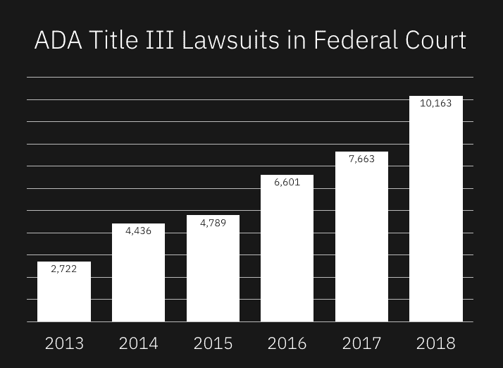

# 如何让您的团队加入可访问性

> 原文：<https://www.freecodecamp.org/news/how-to-align-your-team-on-the-need-for-accessibility/>

在我们职业生涯的不同阶段，我们都会了解网页可访问性。这意味着很多时候你和你的队友不能达成一致。几个月前，我有幸在 [Pingboard](http://pingboard.com/) 谈论无障碍环境。我们的目标是让整个团队处于相同的知识起点。如果我们都有一个基本的理解，网页可访问性影响谁，如何影响他们，我们可以提供更好的体验。

你可能会发现自己在公司也有同样的机会来介绍可访问性。所以我想做两件事来帮助你:我会给你我的演讲作为一个起点，并带你了解我想谈的要点。

> 你可能会发现自己在公司也有同样的机会来介绍可访问性。…我将从[给你们做我的演示](https://drive.google.com/file/d/1W62aya8uk0LgMPyMUBSIAJVOQBewmiKd/view?usp=sharing)开始，带你们了解我想谈及的要点。

# 提醒团队你说的是真实的人。

当我们阅读易访问性文档时，很容易忘记人的因素。这是有意义的，因为你正在阅读旨在影响代码的技术文档。从这个共享的定义开始很好:

******残疾人:****** **身体或精神有缺陷，严重限制一项或多项主要生活活动的人。**

我们用这个来建立友好的对话。人们不想被称为“残疾人”。他们希望别人叫他们的名字。我们还需要澄清残疾的范围有多广。尝试从以下几点开始扩展过去的假设:

*   有些残疾是天生的，有些是后天的。
*   有些残疾是永久性的，有些是暂时性的。
*   有些残疾总是影响，有些来来去去。
*   有些残疾是可见的，有些是不可见的。

# 通过情感体验和快速提示，回顾一些残疾类别。

既然我们已经确立了我们在谈论人，那么是时候谈论他们的经历了。我喜欢将这一部分与常见残疾类别的快速提示结合起来。提醒你的听众，还有比你所涵盖的更多的残疾。它们很难分类，这也是技术文档关注解决方案的原因。

关于这个演示，你会注意到有很多视频和音频。我发现让残疾人比我更多地谈论这个问题更有效。演示中的多媒体使得这些人甚至不必亲临现场。

### 视觉的

[https://www.youtube.com/embed/UzffnbBex6c?feature=oembed](https://www.youtube.com/embed/UzffnbBex6c?feature=oembed)

我喜欢分享汤米·爱迪生使用屏幕阅读器的视频，因为他让事情变得轻松愉快，但也经历了发送电子邮件的整个过程。视频结束后，你可以指出 Mac 用户可以随时使用`CMD + F5`试用他们的屏幕阅读器。

快速提示:

*   有阅读障碍的人更喜欢覆盖字体设置。
*   视力低下的人需要能够正确变焦。
*   色盲人群需要 4.5:1 的整体色彩对比度。19px 或更大的文本可以有 3:1 的比例。
*   色盲的人需要标签和图案来区分。

### 听觉和癫痫

数字产品团队更容易谈论听觉障碍。提醒您的团队，所有音频都应该配有视觉提示和字幕。鼓励团队进行内容审核，检查所有视频的隐藏字幕。

频闪、闪烁和闪光会引发癫痫发作。其他触发因素包括超过 250 毫秒的动画、视差和图像在文本下移动。

### 发动机

[https://www.youtube.com/embed/yx7hdQqf8lE?start=253&feature=oembed](https://www.youtube.com/embed/yx7hdQqf8lE?start=253&feature=oembed)

谈到运动障碍，我喜欢给队友们看两个演示。第一个隐藏在一个更长的视频中。一个叫 Gordin Richins 的家伙展示了使用嘴棒的感觉。这是一个老视频，但我试图指出，新技术可以更昂贵。

第二个视频是眼球追踪产品的健康视频。这些都很棒，因为它们可以为有运动障碍的人提供鼠标功能。但是，为了安全起见，我们还是应该让所有的体验键盘都可以使用。

[https://www.youtube.com/embed/FEQv7buTNxw?feature=oembed](https://www.youtube.com/embed/FEQv7buTNxw?feature=oembed)

### 认知的

认知障碍可能很难传达。对于最后一个类别，我坚持使用快速提示来保持陈述在事实和情感之间的选择性。以下是我分享的快速提示:

*   对于内存，保持过程简短，并尽可能多地提醒用户上下文。
*   为了解决问题，错误消息应该尽可能具有解释性。
*   为了吸引注意力，使用视觉提示来突出内容中最重要的点或部分。
*   对于阅读、语言和口头理解，提供有助于过程的补充媒体。

# 强调残疾实际上有多普遍。

你知道在美国每五个人中就有一个人至少有一种残疾吗？([来源](https://www.census.gov/newsroom/releases/archives/miscellaneous/cb12-134.html)在职场上可能看起来不是这样的，但是我们要考虑为什么。这是演示的要点，人们应该了解隐形残疾。肉眼看不到的残疾。这是一个很棒的采访，卡莉·梅多施谈到了与一个看不见的残疾人一起工作:

[**NPR:有“隐形残疾”的人争取理解**](https://www.npr.org/2015/03/08/391517412/people-with-invisible-disabilities-fight-for-understanding)

这个故事是一个大问题的巨大转变:作为企业软件团队，我们能做些什么来帮助那些有残疾的人？

在美国，79%的劳动适龄人口都有工作。在美国，只有 41%处于工作年龄的残疾人有工作。如果有更多的工作机会，这个差距就会缩小。这意味着我们作为企业软件团队可以把缩小差距作为我们的使命！

# 对于那些需要外在激励的人来说，最后是法律风险。

这可能感觉不太好，但有些人可能仍然需要更多的理由来解释为什么团队应该致力于可访问的体验。这就是为什么我想结束关于可访问性的法律含义的演讲。

ADA Title 3 lawsuits in federal court: 2722 in 2013, 4436 in 2014, 4789 in 2015, 6601 in 2016, 7663 in 2017, 10163 in 2018\. https://www.adatitleiii.com/2019/01/number-of-ada-title-iii-lawsuits-filed-in-2018-tops-10000/

1990 年，美国残疾人法案签署。这为残疾人提供了与 1964 年民权法案相同的保护。第 508 条规定，政府部门和机构的数字体验有可访问性要求。

诉讼继续增长，声称 ADA 也包括任何公司的数字体验。仅在 2018 年就提起了超过 10，000 起诉讼。事实上，那些[案件中的一个正走向最高法院](https://www.cnbc.com/2019/07/25/dominos-asks-supreme-court-to-say-disability-protections-dont-apply-online.html)。

# 成为美好战斗的一部分。

您是否考虑向您的团队介绍网页可访问性？你真的应该。你不必成为专家，如果不是每个人都听你的也没关系。让网络成为一个更友好的地方的一切努力都是值得的。

我希望这些资源能帮助你塑造未来的演讲。请偷走我的一切(但保留引文)。

如果你欣赏这一点，请考虑投票支持我的 SXSW talk 想法。我想教产品经理、设计师和其他所有人关于渐进式网络应用的知识。PWAs 的酷之处在于它包含了很多可访问性标准！如果你想了解更多，看看下面的视频。

请花点时间为我的演讲投票，并与他人分享。

[https://www.youtube.com/embed/aRwfB7Iiaqo?feature=oembed](https://www.youtube.com/embed/aRwfB7Iiaqo?feature=oembed)

有其他好的无障碍演示资源吗？请在评论中分享它们，或者发微博给我，地址是 [@seejamescode](http://twitter.com/seejamescode) 。我会转发最好的！