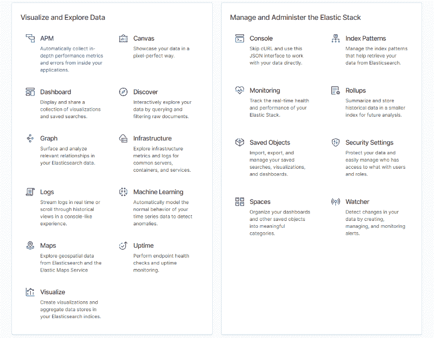
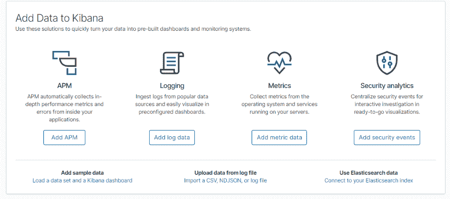
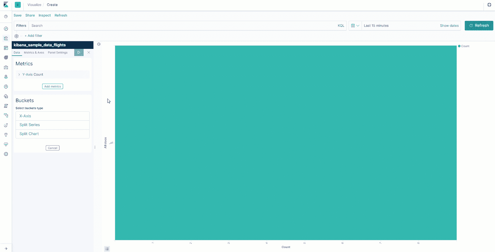
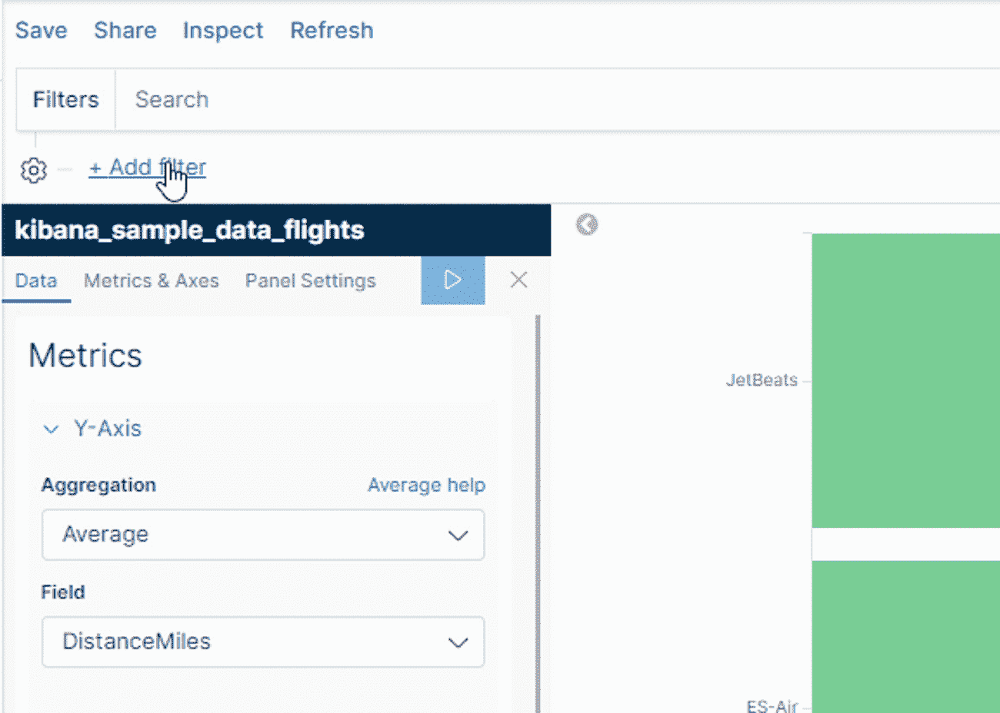
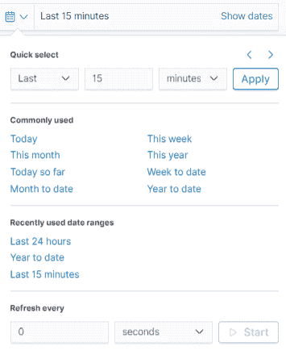
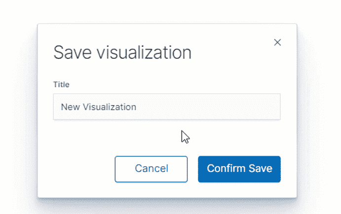
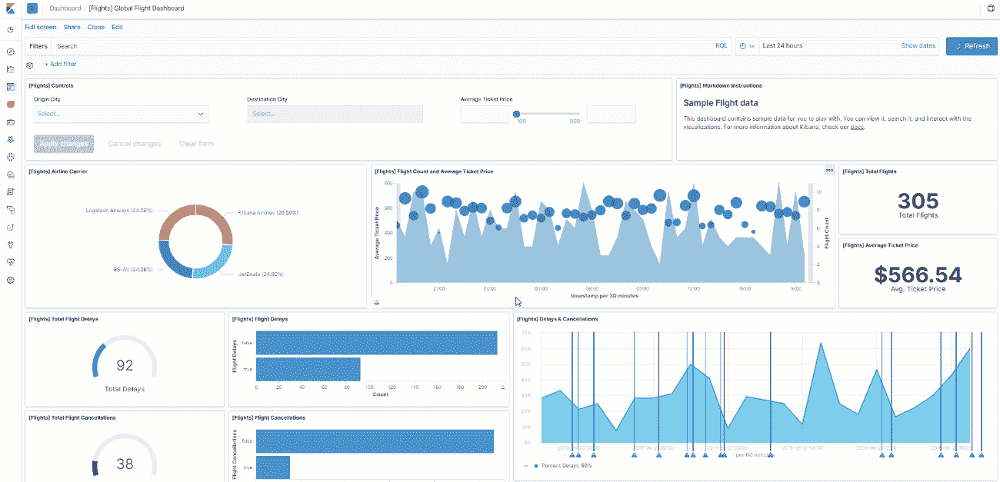
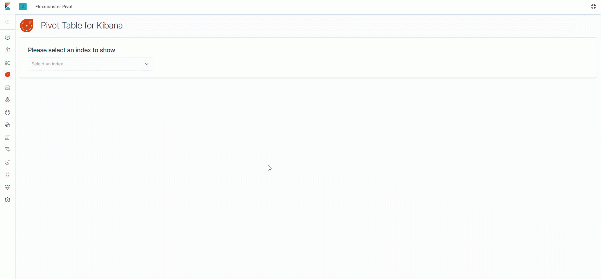

# 弹性搜索数据可视化和分析的强大工具

> 原文：<https://www.freecodecamp.org/news/powerful-tools-for-elasticsearch-data-visualization-analysis/>

> 目标是将数据转化为信息，将信息转化为洞察力。

> ―卡莉·菲奥莉娜

# 关于基巴纳

[Kibana](https://www.elastic.co/products/kibana/?r=fr4) 是一款 ****数据可视化软件**** ，为 **探索 Elasticsearch 数据** 和 **导航 Elastic Stack**——一个开源产品(Elasticsearch、Logstash、Beats 等)的集合提供了一个基于浏览器的界面。

当 Logstash 和 Bits 向 Elasticsearch 传送数据时， **Kibana** **打开进入弹性堆栈** 的窗口，允许您跟踪集群 的 **健康状况，执行 **日志** 和 **时序分析** ，使用 **无监督机器学习** 检测数据中的异常，使用**发现关系 使用 ****可视化**** 从弹性搜索数据中提取洞察，这些可视化可以在一个 **自定义交互式仪表板** 中组合在一起。****

今天我将向您展示如何基于 Elasticsearch 数据创建令人惊叹的 ****仪表板**** 和表格形式的 ****报表**** 。

卷起袖子，我们开始吧！

# 从哪里开始

****首页**** 页面是一切开始的地方。

在这里，您可以决定接下来要采取哪些行动。可用功能可分为两个逻辑部分:

*   ****可视化********探索**** 数据。在这里，您可以创建新的仪表板、可视化或演示，构建机器学习模型，使用 ****图**** 分析数据中的关系，等等。
*   ****管理********弹性栈**** :配置你的空间，分析应用的日志，配置安全设置等。

我们将重点关注创建可视化并将它们添加到仪表板的过程。

# 如何在 Kibana 中创建仪表板

让我让你感受一下建立一个 **丰富的仪表板并开始报告是多么容易。**

要采取的第一个必要步骤是 **将您的数据** 导入到 Kibana 中。有多种添加数据的选项供您选择，您可以选择最适合自己的选项:

出于演示的目的，我选择了样本数据。

要设计您的第一个数据可视化并将它们组合到仪表板中，请打开 ****可视化**** 页面。在这里，您可以创建、修改和查看现有的可视化效果。

让你眼前一亮的是有大量的 ****可视化类型**** 可供选择。

在选择了您需要的一个之后，选择一个索引模式作为源，以便将您的索引通知给 Kibana。让我们选择“kibana_sample_data_flights ”,并开始创建水平条形图。

现在，您可以对 Y 轴应用度量聚合，对 X 轴应用存储桶聚合。这里是图表所有可用聚合的列表。

Creating a horizontal bar chart in Kibana

或者，您可以自定义可视化的颜色。

****过滤**** 是 Elasticsearch 和 Kibana 的另一个强大功能。它提供了一种仅可视化选定文档子集的方法。

了解如何根据逻辑条件对字段应用筛选器:

如您所见，Kibana 提供了一种通过舒适的界面过滤数据的简单方法。除此之外，您还可以选择如何过滤数据——要么使用 ****Kibana 查询语言**** (一种简化的查询语法)，要么使用 ****Lucene**** 。

为了允许最终用户交互地过滤数据，您可以添加 ****控制**** 小部件——仪表板的特殊元素，只需单击它们就可以过滤数据。

我想强调的另一个功能是按日期**进行高级过滤，以及设置刷新仪表板中数据的时间间隔的能力。**

****

**好的一面是可视化是可重用的**。创建完成后，您可以 ****保存您的结果**** 并随时将其添加到仪表板，也可以 ****与您的同事共享**** ，因为他们有权访问您的 Kibana 实例。****

**

Saving a visualization in Kibana** 

**在单个页面上排列好所有可视化元素后，您可以将最终的仪表板导出为**或 ****PDF**** 格式。这就是为什么仪表板是可移植的——很容易在各部门之间立即共享它们。****

**让我们来看一个您可以创建的仪表板示例:**

**

Interacting with the dashboard in Kibana** 

**在我看来，使每个仪表板与众不同的主要特征是**和 ****表现力**** 。有了它，您可以高效地交流业务指标。****

# **个人印象**

**Kibana 中的可视化理想地执行了它们被设计的任务。更重要的是，所有的可视化效果都是 ****醒目的**** ，你可以根据自己的设计思路进行定制。在 Kibana 中创建仪表板的整个过程应该是 **快速** 和 **高效**——这是由于 Kibana 的用户友好和直观的界面。**

**另一方面，我觉得这里缺少了一些功能。**

**在处理数据时，你可以应用的一个有效的探索技巧是在了解数据的哪些方面需要注意之前，对数据进行 ****切片**** 和 ****切片**** 。在我看来，数据表小部件不是最好的选择——它以平面表的形式显示数据，不支持多维数据视图。但是玩数据应该是交互式的，快速的。**

**而这正是 ****透视表控件**** 发挥作用的地方。在搜索了可用的解决方案后，我的选择落在了一个名为 Flexmonster 的开源**插件**上。它处理与**elastic search index**的连接，并允许基于其文档中的数据创建 ****表格报告**** 。除此之外，与 Kibana 的集成也很顺利——开始的唯一要求是通过在命令行中运行一行代码来安装插件。你可以在 GitHub 上找到更多的细节。在使用它之前，我建议确保您的 Kibana 和 Elasticsearch 实例是同一版本。**

**设置好工具后，您就可以使用所有可用的功能来搜索深入的见解了。**

# **分析和报告功能**

**Flexmonster Pivot 提供了对最基本的报告功能的快速访问。它的工具栏允许连接到数据源，加载先前保存的报告，将报告导出为 **PDF** 、 **Excel** 、 **HTML** 、 **CSV** 和图像。此外，我还设法在两种不同的模式之间快速切换——网格和图表。单元格格式选项包括**条件**和**数字格式**。字段列表值得特别注意，在这里您可以选择行、列、度量和报表筛选器的层次结构。还有*搜索输入字段*，如果索引有一个很长的字段列表，它会很有帮助。**

**我想强调的一个特性是能够 ****拖放**** 网格上的层次结构。因此，您可以通过 UI 完全更改切片。**

**另一个是 ****穿透钻取**** 特性——它有助于了解聚合值背后的记录。**

# **使用数据透视表**

**让我向您展示如何基于弹性搜索数据创建报告:**

****

**在测试该工具时，我设法将 **聚合** 和 **过滤** 数据， **排序** 网格上的值并保存结果，以便以后继续处理报告。此外，导出效果很好——很容易与队友分享报告。**

# **将这一切结合在一起**

**今天，我介绍了 Kibana 为弹性搜索数据可视化带来的好处。您已经能够确定仪表板如何增强分析过程。**

**在我看来，数据透视表是一个很好的工具，它能让你在梳理出复杂问题的答案之前从探索数据中获益。**

**Flexmonster 很好地补充了 Kibana 的可用功能——您用它创建的报告很有见地，可定制，并且可以很容易地跨部门共享。**

**这两种工具配合使用，有可能提升你讲故事的能力。**

**我鼓励你尝试这样的组合。**

## **下一步是什么？**

*   **[使用 Kibana 进行报告](https://www.elastic.co/products/stack/reporting/?r=fr4)**
*   **[在 Kibana 中创建可视化效果](https://www.elastic.co/guide/en/kibana/current/createvis.html)**
*   **[用于弹性搜索的数据透视表](https://www.flexmonster.com/demos/connect-elasticsearch/?r=fr4)**
*   **[如何向 Kibana 添加数据透视表](https://www.flexmonster.com/blog/new-pivot-table-for-kibana/?r=fr4)**