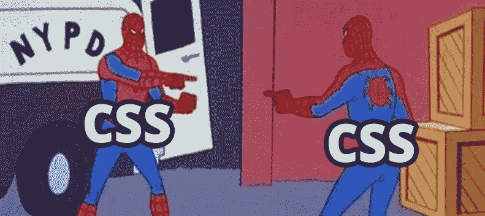
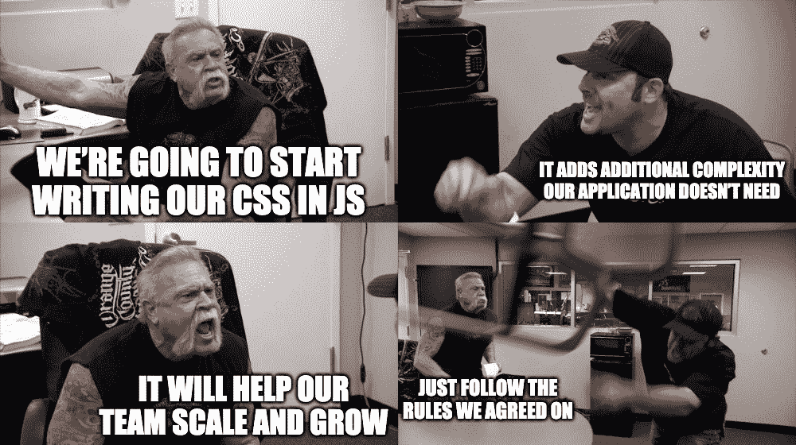

# 你不需要 CSS-in-JS:为什么(以及何时)我使用样式表

> 原文：<https://www.freecodecamp.org/news/you-dont-need-css-in-js-why-i-use-stylesheets/>

CSS-in-JS 风靡一时。但这真的是最好的选择吗？

## 解决你不需要解决的问题

不要误解我，CSS-in-JS 是一个很好的解决方案，但它是针对大多数人没有的问题。以非常孤立的方式维护您的组件绝对有助于:

*   级联样式的意外副作用
*   帮助团队组织他们的规则
*   在发展中避免踩到对方的脚趾

但是那些真的只会成为拥有许多开发人员和庞大组件库的大型团队的问题。

## 那你想让我用什么？

从稍微高一点的角度出发，你可以养成一些基本想法的习惯:

*   设定并遵循一些写作的基本规则
*   使用工具或为组织设定标准
*   使用类似于 [BEM](http://getbem.com/) 的方法进行开发

这将消除小项目(或大项目)中的任何顾虑，并实际上使生活变得更容易。

## CSS-in-JS 擅长的是…

### 帮助大型团队保持理智

这个解决方案存在的部分原因是，当非常大的团队有一个巨大的库要处理时，他们很难避免冲突。能够将你的组件和任何影响它的东西放在一个分隔的区域，可以帮助人们避免踩到对方的脚，避免无意中在整个应用程序中推出调整。这很好，但更有可能的是，你是少数(或独自)在一个小应用上工作的人之一。如果你和你的团队没有就一些基本的规则和标准进行沟通，我认为你有更大的问题。

### 某种程度上消除了学习 CSS 的需要

一些开发人员嘲笑 CSS 说它不是真正的代码，其他人害怕它的魔力(不要害怕，拥抱它)。只需要担心一个组件中的一些规则，这有助于让人们放心，因为这只是多了一点 JS，改变了它的外观。

## 两者能做什么？



CSS pointing at CSS

### 热模块重装(HMR)

虽然有人说 CSS-in-JS 的一个优势是 HMR，但您会发现它对样式表很有效。有时，如果您正在处理一个需要重新呈现的组件，比如那些将网络请求作为依赖项的组件，CSS 的更改不会强制重新呈现，这样做实际上会更好一些。

### 变量，全局设置

如果有人认为 CSS 不能做到这一点，那是因为他们已经有一段时间没有关注了。Sass 不仅提供这一功能，[它还是现代浏览器的原生功能](https://developer.mozilla.org/en-US/docs/Web/CSS/Using_CSS_custom_properties)。

### 包装

是的，你不需要 JS 来做这个。向组件或页面的顶级元素添加一个类名，将所有样式嵌套在里面，这样就有了封装。

```
.page-about {
  .header {
    background-color: red;
  }
}

.navigation {
  .button {
    background-color: blue;
  }
}
```

### 林挺

[https://stylelint.io/](https://stylelint.io/)

### 更多

老实说，可能还有很多你没有意识到的两者的相似之处。

## 哪些样式表和 SASS 做得更好…

### 规则共享和配置

SASS 允许您配置变量、自定义函数和 mixins，将您的 CSS 开发提升到下一个级别。

忽略错误的选择器名称:

```
// settings.scss

$color-ultraviolet: #5F4B8B;

// colbys-styles.scss

@import "settings";

.colbys-text-color {
  color: $color-ultraviolet
}

.colbys-background-color {
  background-color: $color-ultraviolet
}
```

虽然这种方法的语法和配置可以说比在 JS 中设置一堆对象配置更容易，但这极大地允许您提供一致的视觉体验，并减少代码。

### 响应式设计

优秀前端工程师的职责之一是关注项目在多种设备和尺寸下的外观。总的来说，UX 是每个人的工作。以响应第一的心态进行开发不仅使这个过程更容易，而且有助于构建更好的产品。

试图让 JS 中的组件具有响应性意味着更多的 Javascript 和更多的事件监听器。这不仅增加了复杂性，还影响了性能。通过将媒体查询嵌入到 CSS 中，我们可以更容易地做到这一点。

```
.colbys-sidebar {
  width: 100%;
}

// NO EVENT LISTENERS

@media (min-width: 1024px) {
  .colbys-sidebar {
    width: 25%;
  }
}
```

不必限制事件侦听器，确保您的事件侦听器在卸载时取消注册，只需以“反应方式”处理所有这些，媒体查询按需触发，并以更一致的方式根据需要翻转您的样式。

### 降低组件的复杂性

能够专注于功能和呈现的输出使您能够避免引入库或复杂的方法来将 CSS 本质上修补到 JS 中，更不用说您最初用来使其工作的一两个 JS hack 了。

```
// This is an exaggeration

const styles = {
  color: blue;
}

if ( whos_favorite === 'Colby' || whos_favorite === 'Lord Commander' ) {
  styles.color = 'ultraviolet';
} else if ( whos_favorite === 'The Gary' ) {
  styles.color = 'red';
} else if ( whos_favorite === 'Mooncake' ) {
  styles.color = 'green';
} else if ( whos_favorite === 'HUE' ) {
  styles.color = 'blue';
} else if ( whos_favorite === 'KVN' ) {
  styles.color = 'yellow';
}

<MyCompnent styles={styles} />
```

### 表演

[少 Javascript 永远是赢家](https://medium.com/@addyosmani/the-cost-of-javascript-in-2018-7d8950fbb5d4)。你的浏览器需要加载的东西越少，你的浏览器需要编译的东西越少，这最终会转化为更快的页面速度。当浏览器加载页面时，它会尽可能地优化 HTML 和 CSS。是的，你可能会预先加载更多的 CSS，但是更多的 JS 是非常昂贵的，并且也更有可能[强制完全重新提交](https://developers.google.com/web/fundamentals/performance/rendering/)；

你用 Javascript 做的许多小魔术可以用一些非常强大的 CSS 动画方法来完成，只需浏览一下 Codepen 或查看一下类似于 [Animista](http://animista.net/) 的东西。

除了一些好的笔记和一些 [CSS-in-JS 基准](https://github.com/A-gambit/CSS-IN-JS-Benchmarks)之外，我实际上没有这方面的任何数字。*有人做过这方面的调查吗？*

## 在一天结束的时候，做有效的事情



每个人都有自己的偏好，每个人都以不同的方式工作。做对自己最有利的事，做对团队最有利的事，避免把其他开发者说的话当成教条式的是非曲直。

如果你是一个单独的项目开发人员，并且想在大型团队中实践 CSS-in-JS 来适应它，那就去做吧！如果你在脸书的一个非常非常大的团队中，想要使用样式表，如果每个人都不遵循相同的指导方针，你可能会遇到问题，但是做对你和你的团队最有利的事情。

你能弄清楚的唯一方法是通过经验和实验。尝试这两种解决方案，找出为什么你认为其中一种比另一种更好。你永远不知道在谷歌或你车库里的新公司找到工作后，你会在哪里结束。

[](https://twitter.com/colbyfayock)

*   [？在 Twitter 上关注我](https://twitter.com/colbyfayock)
*   [？️订阅我的 Youtube](https://youtube.com/colbyfayock)
*   [✉️注册我的简讯](https://www.colbyfayock.com/newsletter/)

*最初发布于[https://www . colbyfayock . com/2019/07/you-dont-need-CSS-in-js-why-I-use-style sheets](https://www.colbyfayock.com/2019/07/you-dont-need-css-in-js-why-i-use-stylesheets)。*