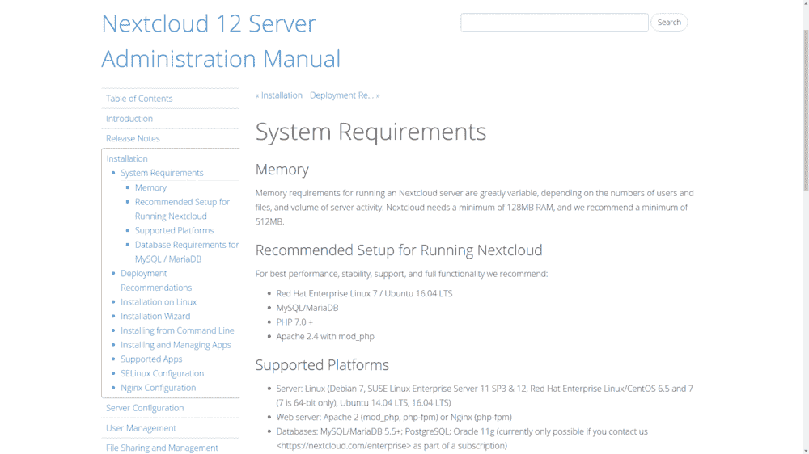
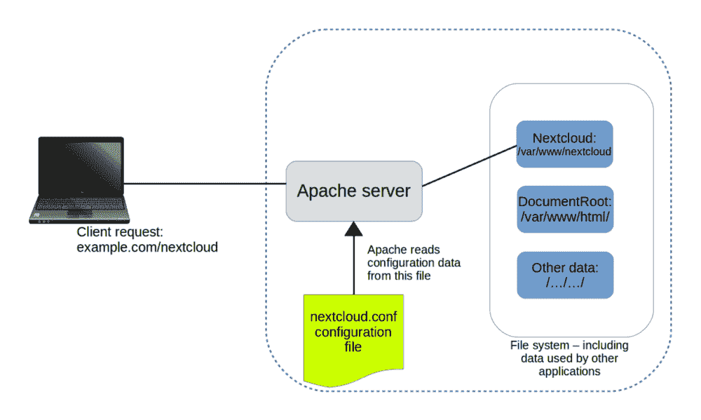
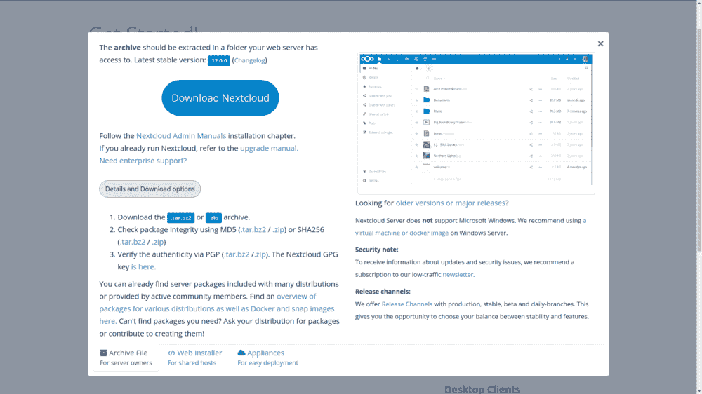
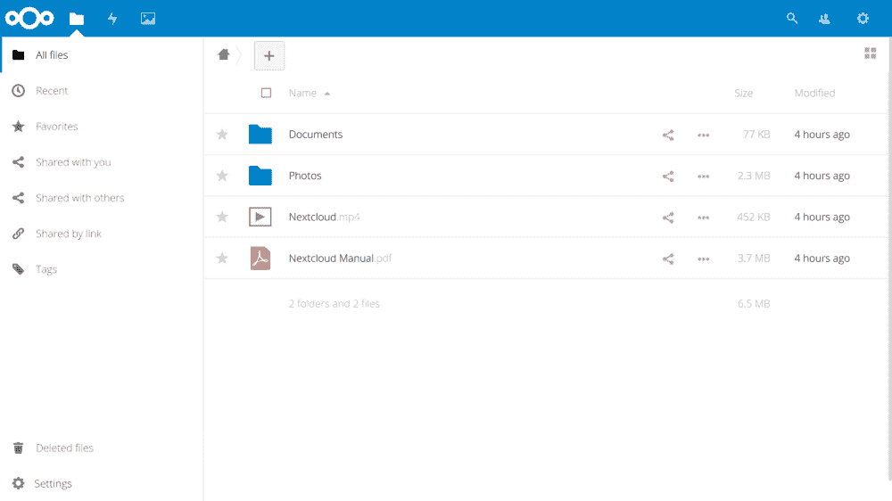
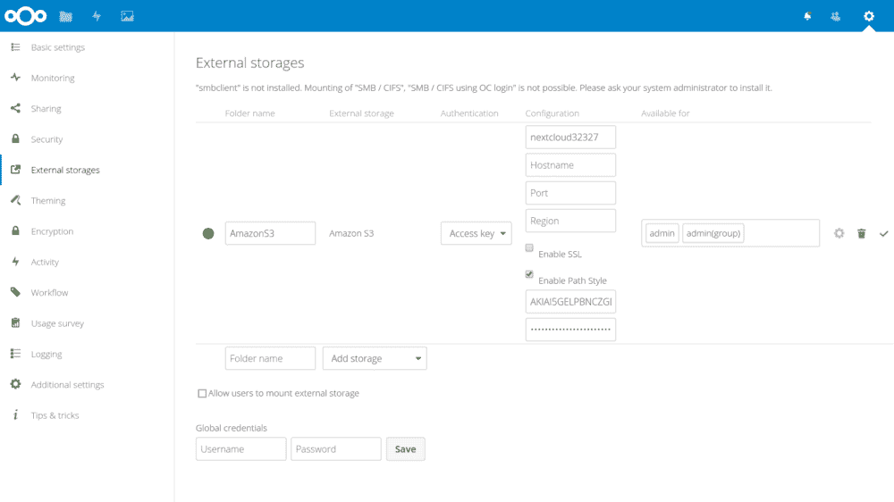

# 如何使用 Nextcloud 设置基于 AWS S3 的企业网络文件共享

> 原文：<https://www.freecodecamp.org/news/aws-s3-based-enterprise-network-file-sharing-using-nextcloud/>

Nextcloud 是一个开源软件套件，当安装在 Linux 服务器上时，可以利用存储容量来保存、编辑和使用各种文档类型，包括音频/视频呼叫托管等服务。Nextcloud 还提供 _client_ applications，允许 Linux、Windows、MacOS 和智能手机平台上的用户使用媒体资源。

使用 Nextcloud，你可以创建自己的 Dropbox 或 Google Drive 私人版本，但要按照自己的方式，不必担心可用性或服务/隐私协议的意外变化。

太棒了。Nextcloud 有一些真正的好处。但是，单干意味着您要承担数据托管、复制和备份的成本和复杂性。当您可以使用任何一种其他服务以很低的成本或零成本获得大量存储时，所有的麻烦和费用真的值得吗？

好消息:你可以两者兼得。对于特别敏感的数据，你可以把整个事情放在内部。但你也可以建立一个 Nextcloud 服务器作为你的前端(以精细控制用户如何与你的媒体交互)，但将数据本身自动安全地保存到更便宜、可靠的第三方服务，包括 Dropbox、Google Drive 和亚马逊的 S3。如果最终你发现你需要将你的数据从像 S3 这样的第三方提供商那里迁移出去，你可以在你的用户察觉不到变化的情况下完成。

## 硬件先决条件

基于我的手册《Linux 在行动中》的内容，让我们用 Ubuntu 把一些东西放在一起。

检查应用程序的文档以确保您有足够的硬件和软件来处理负载总是一个好主意。下图是 Nextcloud 的系统需求网页。如果你打算托管一个简单的、很少使用的服务器，只为几十个用户提供服务，那么你会发现 Nextcloud 是一个相当容易相处的工具，它不需要任何现成容器不能处理的东西。



Hardware and software requirements for both recommended and minimal Nextcloud installations

任何旧的最小硬件配置都可以很好地用于技术测试，但我不想依赖一个运行在旧 PC 上的 LXC 容器来服务成千上万的用户和万亿字节的数据。规划企业级部署？Nextcloud [提供了一个有用的多级部署建议指南](https://docs.nextcloud.com/server/12/admin_manual/installation/deployment_recommendations.html)来配置全强度平台。

例如，Nextcloud 建议 150 人以下的小型工作组访问高达 10TB 的数据:

*   一台带有两个 CPU 内核的服务器
*   16GB 内存
*   通过轻量级目录访问协议(LDAP)(一种广泛使用的分布式信息协议)进行身份验证
*   Red Hat Enterprise Linux 或 Ubuntu 16.04 _ with _ vendor support
    Apache with TLS/SSL 加密证书
*   MySQL 或 MariaDB 数据库
*   使用 _nodatacow_ for Nextcloud 数据分区装载的 Btrfs 文件系统允许 _ 零停机时间 _ 备份
*   使用 memcache 进行缓存以提高访问性能

## 构建 LAMP 服务器

构建一个适合测试包的基础环境应该足够简单。这里是您的服务器在一个命令中需要的所有包。我加入了 wget 和 nano，以防它们还没有安装。为了保持基础映像尽可能小，像 nano 这样的包通常不会默认安装在一些虚拟化平台上，比如 LXC 容器。

```
# apt install apache2 mariadb-server libapache2-mod-php7.0 \
 php7.0-gd php7.0-json php7.0-mysql php7.0-curl php7.0-mbstring \
 php7.0-intl php7.0-mcrypt php-imagick php7.0-xml php7.0-zip \
 wget nano
```

如果你对使用 MySQL 而不是 MariaDB 不挑剔——并且你在 Ubuntu 服务器上——那么你可以轻松地省去大量的打字工作，使用我在前一章提到的 LAMP 服务器元包。同样:不要忘记包名末尾的插入符号(`^`)。

```
apt install lamp-server^
```

安装完成后，不要忘记运行 MySQL 安全安装工具:

```
mysql_secure_installation
```

如果您选择了 MariaDB 路线，并且发现自己不得不在该命令中使用 sudo，这里有一个快速解决方法:

```
MariaDB [(none)]> SET PASSWORD = PASSWORD(‘your-password’);
MariaDB [(none)]> update mysql.user set plugin = ‘mysql_native_password’ where User=’root’;
MariaDB [(none)]> FLUSH PRIVILEGES;
```

## Apache 配置

为了确保 Apache 能够与 Nextcloud 通信，您需要做一些相对简单的调整。首先，您应该通过 a2enmod 工具启用几个 Apache 模块。重写模块用于在 URL 在客户机和服务器之间移动时实时重写它们。headers 模块对 HTTP 头执行类似的功能。

```
a2enmod rewrite
a2enmod headers
```

如果您不打算将该服务器用于任何其他目的，那么可以在 Apache 文档根目录中找到 Nextcloud 应用程序文件。由于/etc/apache2/sites-available/目录中的 000-default.conf 文件中的“DocumentRoot”条目的值已经指向/var/www/html/，所以您真的没有什么可做的了。

但是，将 Nextcloud 的数据文件放在默认的文档根目录下会带来潜在的安全风险，因此您可能希望将 Nextcloud 应用程序放在文件系统的其他部分。

有两种方法可以告诉 Apache 如何找到不在文档根目录中的站点文件。“Ubuntu 方法”包括在现有的 000-default.conf 文件中添加一个包含所有必要信息的新部分。然而，大多数人似乎更喜欢创建新的。每个新服务的/etc/apache2/sites-available/目录中的 conf 文件。两者都工作得很好，但是假设您将应用程序放在/var/www/而不是文档根目录中，那么这个单独的文件应该是这样的:

```
Alias /nextcloud “/var/www/nextcloud/”
<Directory /var/www/nextcloud/>
 Options +FollowSymlinks
 AllowOverride All
<IfModule mod_dav.c>
 Dav off
 </IfModule>
SetEnv HOME /var/www/nextcloud
 SetEnv HTTP_HOME /var/www/nextcloud
</Directory>
```

请注意,“Alias”行将/var/www/nextcloud/目录的内容与“nextcloud”主机(或“site ”)相关联，而两个“SenEnv”行分配将定义 nextcloud 应用程序工作方式的环境变量

使用 Ubuntu 方法的类似指令会在 000-default.conf 文件中添加一个如下所示的部分:

```
<VirtualHost *:443> <1>
 ServerName bootstrap-it.com
 DocumentRoot /var/www/nextcloud
 ServerAlias bootstrap-it.com/nextcloud <2>
</VirtualHost>
```

如图所示，当 Apache 读取该文件时，它会将所有发往 example.com/nextcloud 的传入流量重定向到/var/www 中的应用程序文件(再次假设您的域是 example . com…和以前一样，IP 地址也可以)。



Apache reads configuration files in /etc/apache2/sites-enabled/ and uses their settings to redirect requests

最后，您需要在/etc/apache2/sites-enabled/目录中创建一个符号链接，指向您在/etc/apache2/sites-available/中创建的 nextcloud.conf 文件。

```
ln -s /etc/apache2/sites-available/nextcloud.conf \
    /etc/apache2/sites-enabled/nextcloud.conf
```

但是为什么呢？什么是象征性的联系？

当 Apache 启动时，它读取/etc/apache2/sites-enabled/的内容，寻找要加载的站点配置。这些配置实际上不会存在于/etc/apache2/sites/enabled/中，但是会有指向/etc/apache2/sites-available/中真实文件的符号链接。

那么，为什么不首先告诉 Apache 读取/etc/apache2/sites-available/并省去中间人呢？因为把它挂在符号链接上可以很容易和方便地快速禁用一个网站，然后——当你完成一轮编辑后——再次启用它。您不需要实际删除并重写真正的文件，只需要使用一个易于管理的链接。

符号链接？它们只是对象，*表示位于文件系统其他地方的*文件或目录。它们允许用户在一个地方执行或查看资源，即使资源本身在其他地方。

## 下载和解包 Nextcloud

你可以从 [Nextcloud 安装页面](https://nextcloud.com/install/)下载最新的 Nextcloud 包。如果您正在安装到一个容器或 VM——或者从一个没有安装桌面 GUI 的服务器上安装——那么最方便的方法是获取包的下载 URL 并从命令行获取包。

从 Nextcloud 网站(从您自己的 PC 上的常规会话中)获取该 URL 的一个快速方法是单击“获取 Nextcloud 服务器”下的“下载”选项卡，然后，正如您在下面看到的那样，单击“详细信息和下载选项”按钮。右键单击. tar.bz2 链接，并从菜单中选择复制链接地址。



Links to Nextcloud download archives: either the .tar.bz2 or the .zip formats will work

您可以通过在终端中右键单击并选择粘贴，或者通过 SHIFT+CTRL+v，将该 URL 复制到一个“wget”命令中。

```
wget https://download.nextcloud.com/server/releases/nextcloud-12.0.0.tar.bz2
```

不要忘记单击 MD5 或 SHA256 哈希链接，并确认这些值与您从下载的归档文件中生成的哈希相同。解压缩. tar.bz2 归档文件需要 xjf 参数，而不是. gz 使用的' xzf'。

```
tar xjf nextcloud-12.0.0.tar.bz2
```

下一步是将解压缩后的文件和目录复制到新的主目录中——按照我前面提到的最佳实践，它将位于/var/www/中，这个位置在文档根目录之外。向 copy 命令添加-r 将“递归地”复制文件，以包含子目录及其内容。

```
cp -r nextcloud /var/www/
```

只需再走两步，你就可以走了。Apache 需要对 Nextcloud 目录中的所有文件拥有完全的访问权限才能完成工作。您可以让 root 拥有这些文件，但这意味着您必须授予访问用户 root 权限来访问这些文件。正如你可能想象的那样，让互联网上的每个人都能访问你的文件只是一个小问题。因此，许多网络服务器使用一种特殊的系统用户，称为 www-data。

下一个命令将使用 chown 将所有这些文件的用户和组所有权移交给 web 服务器用户 www-data。使用大写字母-r 将(像您在 cp 中使用的小写字母-R 一样)递归地将命令应用于目录层次结构中的所有文件和目录。

```
chown -R www-data:www-data /var/www/nextcloud/
```

Apache 不知道我们在它不注意的时候做了什么，所以你最好通过重启服务来让它享受一下乐趣。# systemctl 重新启动 apache2

如果重启不成功，那么记下所有错误消息，看看是否有什么可以修复的地方。您还可以通过显示日志中的最后十个条目来更深入地研究日志。例如，在 nextcloud.conf 文件中可能有对特定行的引用。

```
journalctl | tail
```

但是如果一切顺利，那么将你的浏览器指向你的容器的 IP 地址，后面跟着“nextcloud”。您将被带到一个页面，要求您创建一个新的管理员帐户，并为您的 MariaDB 数据库提供有效的登录凭证。除非您为此目的创建了一个不同的数据库用户帐户，否则您将使用“root”和您之前提供的密码。

```
10.0.3.36/nextcloud 
```

一旦你的信息被消化，你将看到 Nextcloud 的客户端应用程序的链接，然后进入管理控制台，如下图所示。在这里，您可以上传、查看和共享文档和媒体文件。



The main Nextcloud console, complete with sample folders and files — you can work with objects here just as you would using an OS file manager

作为站点管理员，您还可以创建组和用户，分配权限和配额，以及管理站点的运行方式。

## 使用 AWS S3 作为您的主要 next 云存储

储存物品的问题是，你必须找到空间来存放所有物品。而且，由于所有存储设备最终都会在没有警告的情况下发生故障，因此您需要每个设备的多个副本。弄清楚如何配置、连接和维护这样的存储阵列是非常耗时的，并且保持其运行相对昂贵。

另一方面，云存储相对便宜，而且——你可以在我的《一个月的午餐学习亚马逊网络服务》一书中读到——设置简单。由于大型云提供商在数据安全性和弹性方面投入了大量资金，他们的服务几乎可以保证比你能组合起来的任何东西都更可靠。

因此，使用基于云的数据作为本地托管的 Nextcloud 网站的后端是一个值得探索的严肃选择。它是这样工作的。

您首先需要启用外部存储支持应用捆绑包。从右上角的齿轮图标中，单击应用程序项目，然后单击左侧面板中的禁用应用程序链接。如图所示，外部存储支持选项出现在列表中。单击启用。


The list of currently available apps, including External storage support

## 将 Nextcloud 连接到 S3 桶

在任何安装了 AWS CLI 并为您的 AWS 帐户配置了 AWS CLI 的计算机上的命令行中(参见[我的 AWS in a Month of lunch book](https://livebook.manning.com/#!/book/learn-amazon-web-services-in-a-month-of-lunches/chapter-12/)的第 12 章了解详情)，创建一个具有全局唯一名称的新 bucket。$ aws s3 mb nextcloud32327

从 AWS 控制台的“您的安全凭证”页面中检索一组帐户访问密钥(AWS 手册中的[第 7 章)。您也可以使用现有的一组密钥，如果您有可用的密钥的话。](https://livebook.manning.com/#!/book/learn-amazon-web-services-in-a-month-of-lunches/chapter-7/)

现在回到你的 Nextcloud 控制台，从齿轮下拉菜单中点击 Admin，然后点击应该在左侧面板中可见的外部存储链接。这将打开“外部存储”页面，您可以在其中单击“添加存储”下拉列表，并从列表中选择“亚马逊 S3”——其中也包括 Dropbox 和 Google Drive。

系统会提示您输入想要使用的 S3 存储桶以及访问密钥和密钥。所有其他字段都是可选的，这些字段允许您使用非标准端口或 SSL 加密来定制您的配置。完成后，单击右侧的复选标记将保存您的设置，并将 Nextcloud 设置为不尝试通过 AWS 进行身份验证。

如果你成功了，你会在左边看到一个快乐的绿色圆圈，如图所示。如果它不起作用，最可能的原因是您不知何故使用了无效的身份验证密钥。确认网络连接到互联网，尤其是 AWS，不会有什么坏处。



The External storages setup page for Amazon S3, showing a successful connection to my S3 bucket

您可以通过将文件从您的计算机复制并粘贴到 Nextcloud 控制台中的文件夹来测试您的新存储配置。然后，在您的 AWS CLI 中，列出您的存储桶的内容。

```
aws s3 ls s3://nextcloud32327
testfile.pdf
```

当然，您也需要以另一种方式测试它。从命令行将本地文件复制到 bucket。

```
aws s3 cp test.txt s3://nextcloud32327
```

test.txt 文件应该出现在您的控制台中。辉煌的多平台存储集成。

*本文摘自我的* [*曼宁《Linux 在行动》一书*](https://www.manning.com/books/linux-in-action?a_aid=bootstrap-it&a_bid=4ca15fc9) *。还有更多有趣的东西* [*来自*](https://bootstrap-it.com/index.php/books/) *，包括一个名为*[*Linux in Motion*](https://www.manning.com/livevideo/linux-in-motion?a_aid=bootstrap-it&a_bid=0c56986f&chan=motion1)*的混合课程，它由两个多小时的视频和大约 40%的 Linux in Action 文本组成。谁知道呢……你可能也会喜欢我的* [*在一个月的午餐中学习亚马逊网络服务*](https://www.manning.com/books/learn-amazon-web-services-in-a-month-of-lunches?a_aid=bootstrap-it&amp;a_bid=1c1b5e27) *。*