# Alexa 和 Google Home:如何构建自己的语音应用并将其部署到全球数百万台设备上

> 原文：<https://www.freecodecamp.org/news/creating-deploying-voice-apps-for-alexa-google/>

语音应用完全改变了我们与数字世界互动的方式。语音为人机交互增加了另一个层面，开发者才刚刚开始探索。

在本文中，我将向您展示如何使用现有的后端架构和 API，将它们与您的语音应用程序连接起来，为您的客户提供新的体验。语音应用借鉴了我们一般的开发流程，不需要单独的开发资源。

# 我们正在建造的东西

我们将使用[开源超级英雄 API](https://akabab.github.io/superhero-api/api/all.json) 构建一个超级英雄搜索应用。

我在这个 API 周围添加了一个包装器，使它可以从我们的语音应用程序中访问。你可以在这个 gist-[https://gist . github . com/akash-Joshi/476 EAD 410 a 244 a 48 e 037 c 138 ba 2387 b 0](https://gist.github.com/akash-joshi/476ead410a244a48e037c138ba2387b0)中找到代码。

看看下面完成的应用程序:

[https://www.youtube.com/embed/5F20v5cIQts?feature=oembed](https://www.youtube.com/embed/5F20v5cIQts?feature=oembed)

我们将为语音应用程序(Alexa 和谷歌)建立这一点。我们将使用平台 [VoiceFlow](http://voiceflow.com) ，它允许我们可视化地构建语音应用。

# Voiceflow 教程

VoiceFlow 是一种创建语音应用的可视化方式，非常易于使用和理解。

首先，在那里创建一个帐户开始。

创建帐户后，创建一个新项目，给它一个合适的名称。出于本教程的目的，我们选择了所有英语区域作为部署区域。

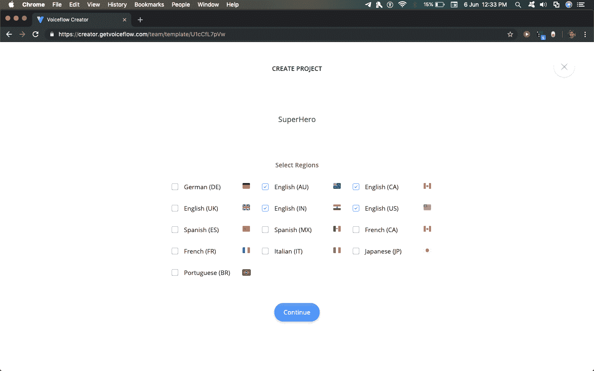

在这之后，你将在一张空白的画布上结束。不要被屏幕上出现的所有选项弄得不知所措，本教程将指导您完成所需的所有相关模块。

在左边的模块子菜单中，你会看到几个模块可以用来构建 Alexa 或者 Google 技能。每个模块执行特定的功能，Voiceflow 基于通过组合这些模块来构建语音应用。

### 1.朗读块

我们将使用的第一个模块是 Speak 模块。我们将使用它来让 Alexa 对用户说些什么。将 speak blog 拖到画布上，将其重命名为 Introduction，并在文本区域为您的应用程序编写合适的介绍。我会用“欢迎来到超级英雄！说个英雄的名字去搜！”。

在任何时候，点击播放按钮测试你的应用程序。

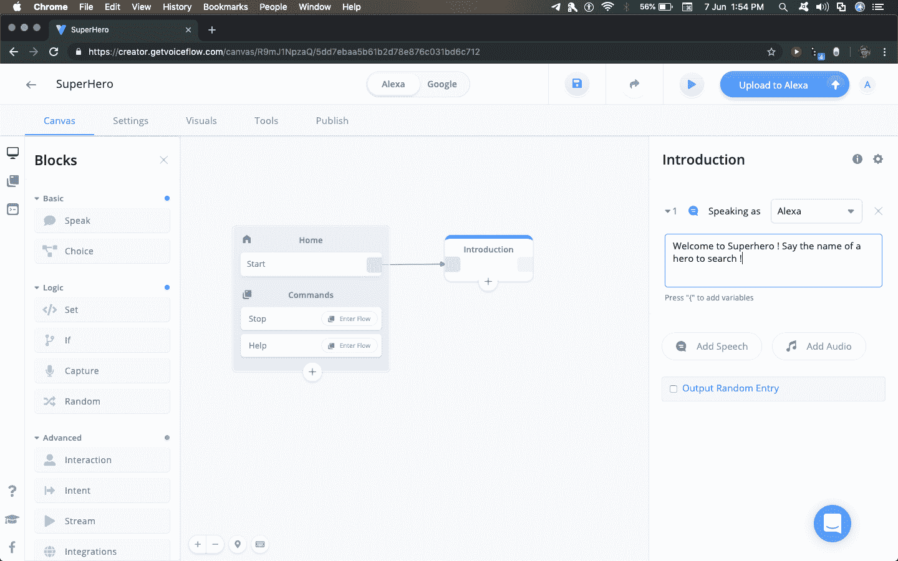

### 2.捕获块

我们将使用的下一个模块是捕获模块。它用于从用户的语音中捕获数据，并将其存储到一个变量中。

首先，在左边的“变量”子菜单中创建一个新变量，输入一个名称并按回车键。暂时用“英雄”这个名字。

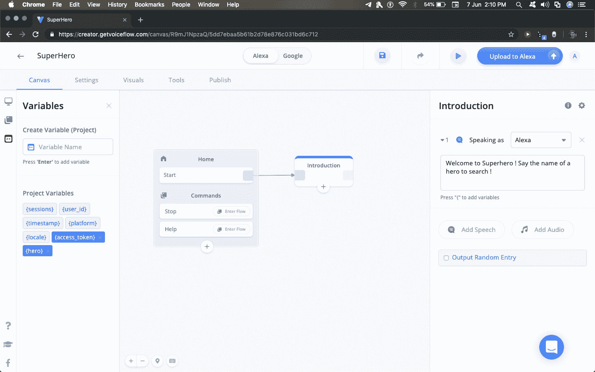

添加一个捕获块，将“输入类型”命名为“演员”，将“捕获输入到”命名为“英雄”。

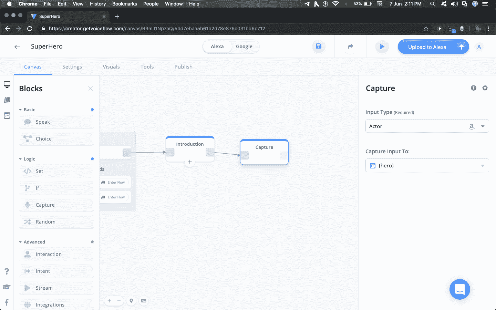

后面加一个语音块，说:“寻找{hero}。<break time="2s">”。我们用花括号来表示语音中的变量。请务必手动输入{hero}，以便 Voiceflow 将其检测为变量。<break time="2s">是一个标签，它是一种叫做语音合成标记语言(SSML)的语言的一部分。你可以在亚马逊的[官方文档页面上了解更多信息。](https://developer.amazon.com/docs/custom-skills/speech-synthesis-markup-language-ssml-reference.html)</break></break>

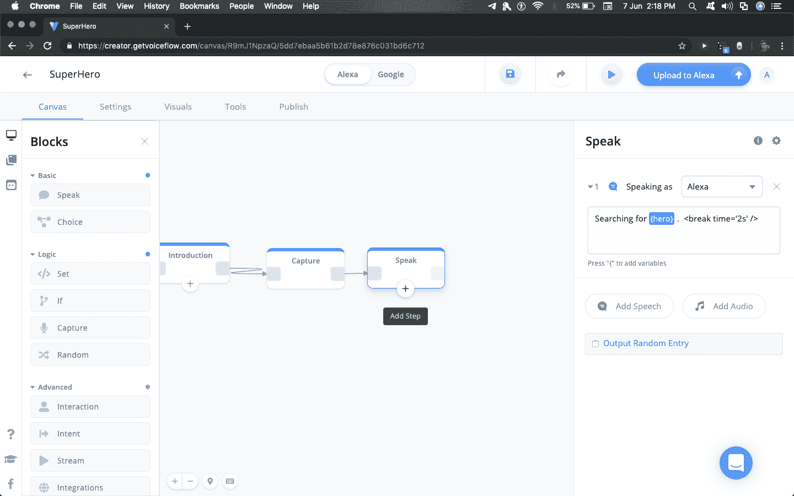

### 3.API 块

单击发言模块下方的加号图标，向模块添加另一个步骤。从列表中添加集成块。之后，点击集成块，按以下顺序设置选项:

1.  选择一个集成——“自定义 API”，因为我们将使用自定义 API 来获取一些数据。

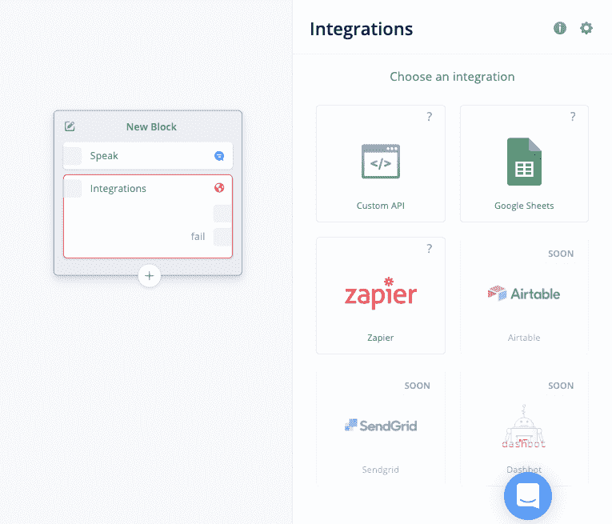

2.我想“发出 GET 请求”，因为我们使用 GET 请求从 API 获取 JSON 数据。

我们将使用一个定制的 API ( `https://super-search-akashjoshi.flexiple.now.sh/?hero=`)来获取超级英雄数据。

尝试在您的浏览器中导航到`https://super-search-akashjoshi.flexiple.now.sh/?hero=superman`,看看 API 返回哪种数据。用你想寻找的任何英雄替换超人 T2。

我们用{hero}变量替换了英雄名，这样 API 就可以正确地获取所需的英雄。

粘贴

`https://super-search-akashjoshi.flexiple.now.sh/?hero={hero}`

进入地址栏。请务必自己键入{hero}，以便 Voiceflow 将其检测为变量。

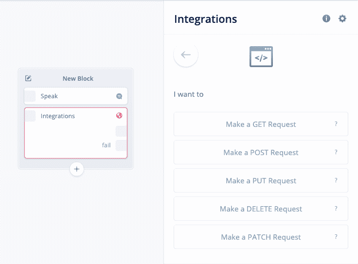

然而，我们还没有完成。单击 Test Integration 来测试 API 调用。

来自 API 的响应必须被映射到输出变量中，以便将它们传达给用户。

从变量侧边栏添加名称、全名、出生、对齐、工作和基础的变量。

通过点击 Test Integration 选项卡的 response 选项卡，复制 JSON 文件的输出路径，并将其粘贴到 output 菜单中。对以下所有内容执行此操作-姓名、全名、出生、对齐、工作和基础。

查看下面的视频短片，了解如何将 JSON 输出与您的 Voiceflow 变量对应起来:

[https://www.youtube.com/embed/fDY_klt08mg?feature=oembed](https://www.youtube.com/embed/fDY_klt08mg?feature=oembed)

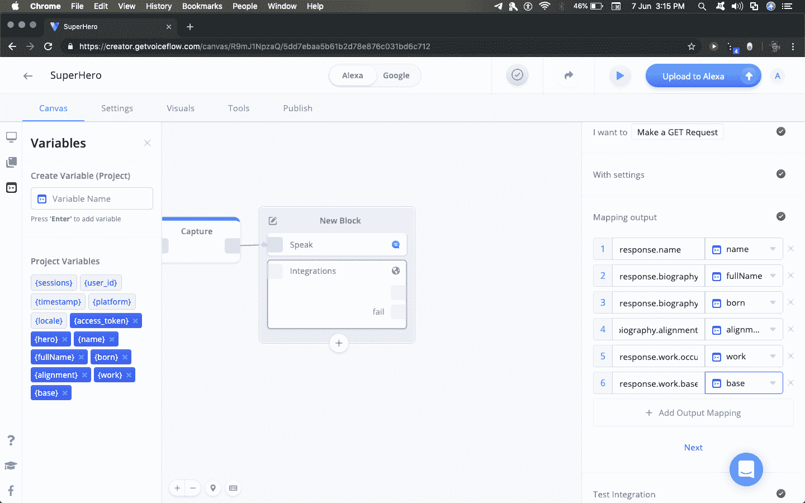

在上图中，我们可以看到集成有两个输出，一个没有前缀文本，另一个带有前缀 fail。没有前缀文本的是成功状态输出，有失败输出的是 API 调用失败时的输出。

添加一个连接到失败状态的语音块，表示“没有找到英雄”。如果 API 成功，并且找到了与{hero}变量匹配的 hero，所有输出变量都将设置为正确的值。否则，它们将被设为默认值 0。

### 4.If 块

在画布上添加一个 if 块，检查是否 fullName = 0。如果为 0，则将其连接到“未找到”块。

观看下面的短片，了解如何向 If 块添加条件:

[https://www.youtube.com/embed/gmS-NleBtl0?feature=oembed](https://www.youtube.com/embed/gmS-NleBtl0?feature=oembed)

否则，英雄就被发现了。所以，通过在演讲区写下“他们的英雄名字是{name}”来说出英雄的名字。他们的全名是{fullName}。他们出生于{born}。它们是{对齐}。他们从{base}作为{work}工作。<break time="3s">你想再找一个英雄吗？”</break>

同样，请确保键入变量名，以便 Voiceflow 将它们检测为变量。

要在技能完成后清除变量，向画布添加一个“Set”块，并将 fullName 设置为 0。这一步是必须的，因为如果不清除变量，前面的回答会被技能重复！

### 5.选择块

我们不应该在这里结束技能。我们应该允许用户选择是否要寻找另一个超级英雄。更改“未找到”块中的文本，询问用户是否希望在结尾处搜索更多内容。

将选择块添加到画布。选择块允许我们根据用户的声音执行某些操作。该块检查用户是否想要搜索另一个英雄。输入同义词 Yes 以便进一步搜索。

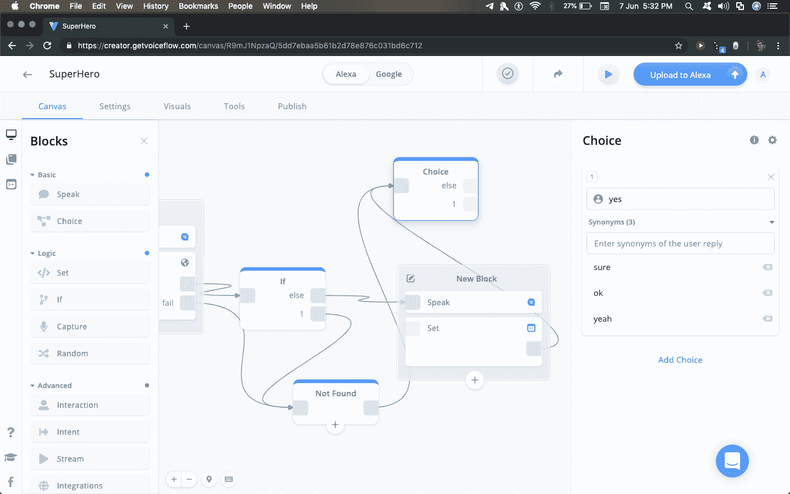

否则，添加流程块，选择停止流程作为流程。

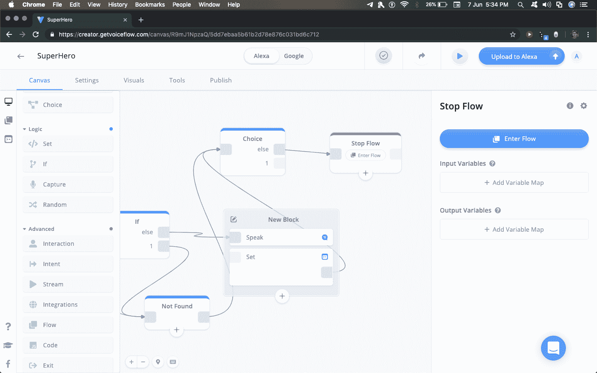

将选择模块的“1”输出连接到要求用户说出另一个英雄名字的语音模块，并将其连接到捕获模块。看看下面的图片就明白是怎么做到的了。

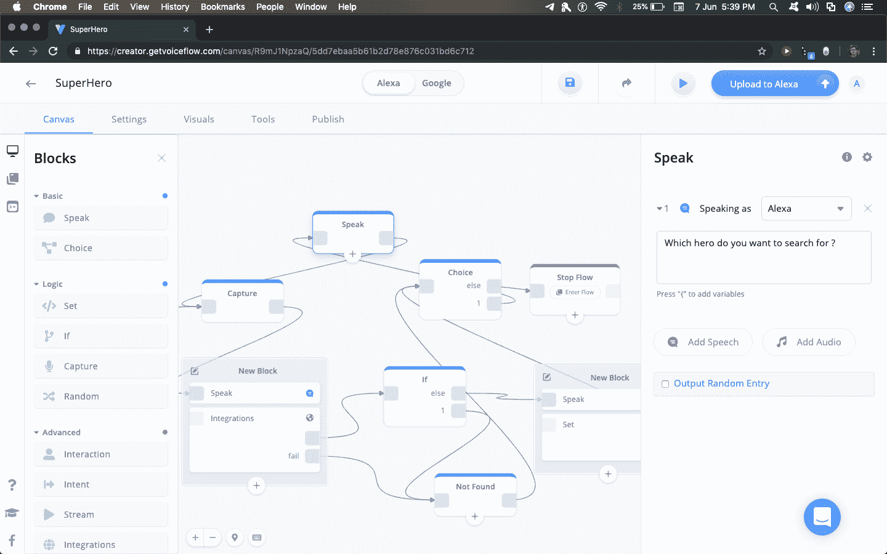

我们完了。点击播放按钮，测试你的应用程序。

### 6.部署

**a. Alexa**

要将你的应用程序部署到 Alexa 平台，点击发布选项卡，连接你的亚马逊开发者账户，并根据与你技能的相关性填写表格选项(如描述、技能名称等)。)

确保不要更改任何默认调用，这可能会在部署期间影响您的技能，并导致您重新提交它。

万一你在提交过程中出错了，审查过程会很有帮助&他们会让你知道提交过程中哪里出错了。

**b .谷歌**

点击说明链接，查看将 Google Assistant 文件添加到 Voiceflow 的[说明。添加文件后，请在此处](https://learn.voiceflow.com/articles/2705386-uploading-your-project-to-google-assistant)遵循[的发布到生产指南。Google 部署过程中的一些注意事项:](https://learn.voiceflow.com/articles/2712178-deploying-your-google-assistant-project-to-production)

1.  您的调用名称不能有任何可能在调用过程中使用的关键字。例如，你不能将动作命名为“超级英雄搜索”，因为“搜索”可能会被用作调用名称。
2.  您需要添加来自 Google 的自定义隐私政策。你不能使用来自 Voiceflow 的那个，因为它提到了 Alexa 或 skills，这将导致你的操作被拒绝。你可以在这里使用我建立的模板。它有关于如何写你的隐私政策和在哪里保存它的说明。
3.  最后一点是，不要在你的动作描述或应用程序中使用术语“Alexa”或“技能”。如果应用程序中出现任何情况，用更通用的东西替换它们，这样你就可以为 Alexa 和谷歌使用相同的代码库。在描述和类似的地方用“谷歌”和“行动”替换“Alexa”和“技能”。

# 接下来呢？

App 创意:

语音应用的有趣之处在于，你可以将它们作为现有应用的扩展。例如，如果你已经开发了一款类似于[这款](https://blog.flexiple.com/build-a-powerful-chat-application-using-react-hooks/)的消息应用，那么语音平台可以成为你在应用上发送和阅读消息的一种简单方式。对于博客写作平台来说，在真正坐下来写文章之前，语音应用程序可能是一种简单的记笔记方式。即使是像 [ProductHunt](https://producthunt.com) 或 [Remote.tools](https://remote.tools) 这样的产品发布平台，你也可以很容易地集成语音来读出产品的描述和其他细节。

通过这种方式，语音应用可以用来增强用户体验。

有用链接:

[https://getvoiceflow.com](https://getvoiceflow.com)

[https://learn . voice flow . com/articles/2705386-将您的项目上传到谷歌助手](https://learn.voiceflow.com/articles/2705386-uploading-your-project-to-google-assistant)

[https://learn.voiceflow.com](https://learn.voiceflow.com)

[https://developer . Amazon . com/docs/custom-skills/speech-synthesis-markup-language-SSL-reference . html](https://developer.amazon.com/docs/custom-skills/speech-synthesis-markup-language-ssml-reference.html)

希望你喜欢这篇文章。我还写了一篇[更广泛的文章](https://blog.flexiple.com/building-a-web-and-voice-app-ecosystem-amazon-alexa-google-home-react-node/)，为这款应用添加了一个基于网络的前端，使其成为一个完整的生态系统。

编码快乐！