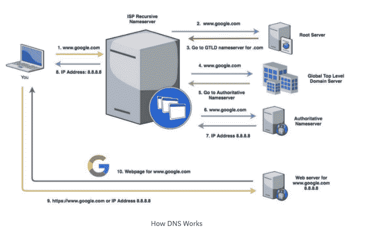

# 关于 DNS 你需要知道什么

> 原文：<https://www.freecodecamp.org/news/what-is-dns-anyway/>

### 什么是 DNS 查找？

域名系统查找，简称 DNS，是在某人在搜索栏中键入 URL 和页面加载之间的时间内发生的事情。从技术上来说，这是一个将 URL(如[www.google.com)](http://www.google.com%29)转换成 IP 地址的过程。

IP 地址类似于你家的地址。正如您使用地址发送邮件一样，计算机使用 IP 地址将数据发送到特定的位置。由于 IP 地址很难记住(它们是一长串数字)，计算机使用 DNS 在 IP 地址和 URL(更容易记住)之间进行转换。所有联网设备都有一个 IP 地址。

### DNS 是如何工作的？

鉴于互联网的规模，计算机无法在内存中存储所有的 IP 地址。取而代之的是，在浏览器中输入[www.google.com](http://www.google.com)告诉电脑查找该网站的 IP 地址。

首先，计算机检查它的本地内存，称为缓存。这是电脑存储其最近访问过的网站的 IP 地址的地方，因此它可以更快地加载它们，而不必查找它们。然而，由于只有少数最近访问过的网站在这里，机会是，计算机找不到 IP 地址。

**步骤 1(步骤与上面的图号相对应):**接下来，计算机将询问 ISP 的本地递归名称服务器。ISP 是互联网服务提供商，如时代华纳有线、频谱、威瑞森等。域名服务器听起来很复杂，但它只是一个用来回答 DNS 请求的服务器软件(比如“www.google.com 的 IP 地址是什么？”).

任何名称服务器都可以回答这个问题，要么用 IP 地址(如果它知道的话)来响应，要么用它不知道的 IP 地址来响应，并告诉请求服务器询问另一个服务器。递归名称服务器是不同的，因为如果它不知道问题的答案。它将完成寻找答案的工作，而不仅仅是重定向查询。并非所有的名称服务器都是递归的。

**第二步:**递归名称服务器将首先检查其缓存。如果 IP 地址不在那里，它将询问根域名服务器(根域名服务器不知道 IP 地址，但是它们可以读取请求并告诉递归域名服务器下一步去哪里)。所有递归域名服务器都预先配置了 13 个根域名服务器的 IP 地址。递归名称服务器选择一个并问它同样的问题(“www.google.com 的 IP 地址是什么？”).

**第三步:**根域名服务器读取顶级域名(请求结束)，本例中。(www.google.com)并将告诉递归域名服务器询问全球顶级域名服务器(GTLD)。GTLDs 本质上是每种类型域名的参考列表，如. com、. net、.edu 等。虽然他们不知道网站的 IP 地址，但他们知道哪些域名服务器会有这些信息。

**第四步:**递归域名服务器向 GTLD 域名服务器索要 www.google.com 的 IP 地址。

**第 5 步:**GTLD 域名服务器将从右向左读取您请求的下一部分(在本例中为 www.google.com[的“谷歌”)](http://www.google.com%29)并将发回一条消息，通知权威域名服务器进行联系。权威名称服务器是负责域的名称服务器(并且是信息的主要来源)。

**步骤 6:** 递归域名服务器会问权威域名服务器同样的问题(“www.google.com 的 IP 地址是什么？”).从技术上来说，服务器要求地址记录(A)，这是服务器引用 IP 地址的方式。

**第七步:**这个服务器有答案！它会将 IP 地址传递回递归名称服务器，并进行标记，让递归名称服务器知道答案是权威的。递归域名服务器将 IP 地址保存在缓存中，以防有人试图很快访问同一个网站。缓存中的每一项都标有“生存时间”,告诉服务器在删除信息之前可以保存多长时间。

步骤 8: 递归名称服务器告诉你的计算机 IP 地址是什么(这次它没有被标记为权威，因为它不是信息的主要来源。它只是传递信息。

**第九步:**你的电脑向刚刚收到的 IP 地址发送一个对【www.google.com】T2 的请求。

**步骤 10:** 这个地址的 web 服务器返回 google 主页，页面加载。

整个过程只需要几毫秒就能完成，每天会发生数万亿次。

### DNS 如何影响最终用户？

由于 DNS 是互联网运行不可或缺的一部分，它是黑客的主要目标。DNS 的根本问题与我们在当今技术中遇到的大多数安全问题是一样的。互联网以及我们今天使用的许多技术都是为一小群研究人员设计的，随着时间的推移，它们扩展成了一个全世界都在使用的系统。DNS(和 HTTP，以及我们使用的大多数协议)在设计时并没有考虑安全性。现在，我们不得不添加各种安全问题的修复程序。不幸的是，最后附加的安全性不如开发中的安全性有效。

这给 DNS 带来的一个问题是，当收到响应时，没有对名称服务器的真实性进行任何验证。因此，黑客可以对计算机的 DNS 查询发送恶意响应，并欺骗计算机认为这是来自 DNS 名称服务器的真实响应。换句话说，当计算机询问“www.chase.com 的 IP 地址是什么？”黑客将(在 DNS 服务器做出响应之前)用黑客的恶意站点的 IP 地址做出响应。然后当网站加载时，它看起来就像 chase.com 网站，但实际上是由黑客控制的。

这与网络钓鱼非常相似，只是用户没有被诱骗点击不良链接，而是他们试图访问的网站通过 DNS 查找被路由到不良网站(更危险，因为阻止这种类型的攻击要困难得多)。这就要求用户保持警惕，注意到这个网站是在欺骗真实的网站(可能链接看起来不太对，或者有拼写错误或糟糕的徽标复制)。然而，这可能非常困难，并且依赖于用户相对熟练的技术。

2016 年，一次 DNS 攻击使美国东海岸大部分地区的互联网瘫痪了几乎一整天。在这种情况下，中断是由 DDoS 攻击引起的。DDoS 攻击是一种分布式拒绝服务攻击，在这种攻击中，互联网上成千上万的机器同时攻击一个系统。通常，这些机器在主人不知情的情况下感染了恶意软件，一个黑客或一群黑客正在控制所有的机器。这些机器一起使用时被称为“僵尸网络”。

僵尸网络向受害者服务器发送 DNS 请求，发送的请求数量使系统不堪重负，导致服务器无法处理它收到的合法流量。因此，当黑客攻击 DNS 服务器并且计算机试图请求 IP 地址时，服务器无法响应。因此，在攻击停止之前，计算机无法访问服务器控制(或授权)的站点。

这种攻击可以通过过度配置服务器来应对超额需求或拥有 DNS 防火墙来缓解。

解决 DNS 带来的许多问题的一个更广泛的方法是 DNSSEC。DNSSEC 使用基于公钥加密的数字签名来加强认证。本质上，被请求数据的所有者对其进行了数字签名，以确保上述情况不会发生。这提供了数据源验证(数据实际上来自解析器认为它来自的地方)和数据完整性保护(数据在传输中没有被修改)。

不幸的是，为了修复 DNS，DNSSEC 需要广泛的部署。它需要由网络运营商在其递归解析器上，以及由域名所有者在权威服务器上专门启用。这种情况还没有发生，但希望随着越来越多的人意识到 DNS 带来的问题并倡导改变，这种情况会发生。