# 如何用 Node.js 和 SlackBots.js 构建一个 SlackBot

> 原文：<https://www.freecodecamp.org/news/building-a-slackbot-with-node-js-and-slackbots-js/>

Slack 是一套美国基于云的专有团队协作软件工具和在线服务，由 Slack Technologies 开发。Slack 是团队可以交流和协作的工作空间。

Slack 中的团队合作发生在渠道中——消息、工具和文件的单一位置——帮助每个人节省时间和协作。


* * *

Slack 的一个令人惊叹的功能是 Slack 应用程序、集成和 T2 Slack 机器人。

Slack bot 是一种 Slack 应用程序，旨在通过对话与用户互动。你的 bot 可以发送 DMs，可以被用户提及，可以发布消息或者上传文件，可以被邀请到频道。酷吧？

如果你已经在使用 Slack，你应该熟悉一些有创意的 Slack 机器人，比如[站立机器人](https://standupbot.com/)、[生日机器人](https://birthdaybot.io/)等等。

在本文中，我将用 [Node.js](http://nodejs.org/) 和 [SlackBots.js](https://github.com/mishk0/slack-bot-api) 带你从头到尾构建你的第一个 Slack bot

> PS:本文发表于[我的博客第一篇](https://www.bolajiayodeji.com/building-a-slackbot-with-node-js-and-slackbots-js/)。

# SlackBot 描述

我们将构建一个简单的 Slackbot，为开发人员/设计人员显示随机的鼓舞人心的技术引语和笑话。

我做了一个 chrome 扩展，在你的新标签页上为开发者/设计师显示随机的鼓舞人心的技术报价(你可以在这里下载)。我们将使用来自这个扩展的 quotes JSON 作为我们的 quotes API 和用于笑话的 [Chuck Norris 笑话 API](https://api.chucknorris.io/) 。

当用户提到我们的机器人并添加**给我灵感**时，机器人会从[的灵感金块](https://chrome.google.com/webstore/detail/inspirenuggets-for-chrome/acnfgdioohhajabdofaadfdhmlkphmlb)中随机返回一段话。当用户键入**随机笑话**时，它从 [Chuck Norris](https://api.chucknorris.io/) API 返回一个随机笑话。当用户键入 help 时，它会返回指令指南。

> @inspirenuggets 激励我
> 
> @inspirenuggets 随机笑话
> 
> @inspirenuggets 帮忙


这篇文章实际上并不是关于我们将构建什么——它只是向你展示 Slack 机器人背后的概念以及如何构建你的。在你完成它之后，你可以考虑一些其他的事情，构建一个不同的机器人，因为有很多可能性。

你可以在这里克隆或者分叉最终项目[。](https://github.com/BolajiAyodeji/inspireNuggetsSlackBot)

很有趣吧？让我们开始吧。

# 先决条件

我们将使用 Node.js 和 SlackBots.js 来构建这个 bot。您不需要知道如何编写 Node.js，因为我会带您完成它。尽管如此，知道这是一个优势。你也应该有

*   基本的 JavaScript 知识
*   ES6 JavaScript
*   宽松工作空间
*   一些关于懈怠的经验
*   一些版本控制技巧

# 设置环境

让我们先设置并安装 Node.js 和 Npm。

*   在这里下载节点[。如果您已经安装了它，请跳过这一步。如果你更喜欢使用软件包管理器来安装，阅读](https://nodejs.org/en/)[这个](https://nodejs.org/en/download/package-manager/#windows)用于所有操作系统。
*   检查是否安装了节点

```
node -v 
```

*   Node.js 附带了 Npm，所以您不必再次安装它。

```
npm -v 
```

现在我们有了 Node.js 设置，让我们初始化我们的项目。

创建您的项目目录(我称之为我的 Slackbot)并初始化 git:

```
git init 
```

接下来，创建一个`index.js`文件:

```
touch index.js 
```

并初始化 Npm:

```
npm init 
```

简单地回答随后出现的所有问题。如果你有问题，这是我自己的`package.json`:

```
{
  "name": "slackbot",
  "version": "1.0.0",
  "description": "A simple Slackbot that displays random inspiring techie quotes for developers/designers.",
  "main": "index.js",
  "scripts": {
    "start": "index.js"
  },
  "repository": {
    "type": "git",
    "url": "git+https://github.com/BolajiAyodeji/slackbot.git"
  },
  "author": "Bolaji Ayodeji",
  "license": "MIT",
  "bugs": {
    "url": "https://github.com/BolajiAyodeji/slackbot/issues"
  },
  "homepage": "https://github.com/BolajiAyodeji/slackbot#readme"
} 
```

# 安装依赖项

现在让我们安装并设置我们需要的所有库。

## SlackBots.js

[SlackBots.js](https://github.com/mishk0/slack-bot-api) 是一个 Node.js 库，便于使用 Slack API 进行操作。

```
npm install slackbots 
```

在`index.js`中:

```
const SlackBot = require('slackbots'); 
```

## 阿克斯

Axios 是一个基于 promise 的 HTTP 客户端，用于浏览器和 node.js。如果你知道 Fetch 或 AJAX，这只是一个用更酷的功能做同样事情的库。你可以在这里看到他们。

```
npm install axios 
```

在`index.js`中:

```
const axios = require('axios') 
```

## Nodemon

要在 Node.js 中运行脚本，必须运行`node index.js`。每当您对该文件进行更改时，您都必须重新运行`node index.js`。当你像我们一样做这么多改变的时候，这很糟糕。这就是为什么我们需要 [nodemon](https://github.com/remy/nodemon) 的原因，这是一个帮助开发基于 node.js 的应用程序的工具，当检测到目录中的文件更改时，它会自动重启节点应用程序。

```
npm install -g nodemon 
```

在`package.json`中，找到脚本部分并添加一个新的启动脚本:

```
"scripts": {
    "start": "node index.js"
  } 
```

如果您运行`npm start`，文件将会运行，但不会因更改而重启。要解决这个问题，请使用我们安装的 nodemon，而不是 node，如下所示:

```
"scripts": {
    "start": "nodemon index.js"
  } 
```

# Dotenv

这个我就不深入解释了。几天后，我将发表一篇关于环境变量的文章，但是现在我们只需要知道我们使用它来隐藏密钥和令牌，比如我们将要使用的 Slack 访问令牌。这样你就不用把你的秘钥推给 GitHub 了。

有几种方法可以做到这一点，但我更喜欢使用 dotenv。 [Dotenv](https://github.com/motdotla/dotenv) 是一个零依赖模块，它将环境变量从一个. env 文件加载到 process.env 中。

```
npm install dotenv 
```

在`index.js`中:

```
const dotenv = require('dotenv')

dotenv.config() 
```

安装完成后，您的`package.json`应该是这样的:

```
{
  "name": "inspireNuggetsSlackBot",
  "version": "1.0.0",
  "description": "A simple Slackbot that displays random inspiring techie quotes and jokes for developers/designers.",
  "main": "index.js",
  "scripts": {
    "start": "nodemon index.js"
  },
  "repository": {
    "type": "git",
    "url": "git+https://github.com/BolajiAyodeji/inspireNuggetsSlackBot.git"
  },
  "author": "Bolaji Ayodeji",
  "license": "MIT",
  "bugs": {
    "url": "https://github.com/BolajiAyodeji/inspireNuggetsSlackBot/issues"
  },
  "homepage": "https://github.com/BolajiAyodeji/inspireNuggetsSlackBot#readme",
  "devDependencies": {
    "dotenv": "^8.0.0"
  },
  "dependencies": {
    "axios": "^0.19.0",
    "slackbots": "^1.2.0"
  }
} 
```

# 创建您的宽松工作空间

现在我们已经设置好了，我们需要一个宽松的工作空间来运行开发中的 bot。创建一个工作空间非常容易，阅读[这篇](https://get.slack.help/hc/en-us/articles/206845317-Create-a-Slack-workspace)来了解更多。

# 注册您的 Slack Bot

现在您有了一个工作区，您应该有一个带有您的工作区名称的 Slack URL。我的是`mekafindteam.slack.com`。

现在你需要创建一个 Slack 应用程序。在这里创建一个。

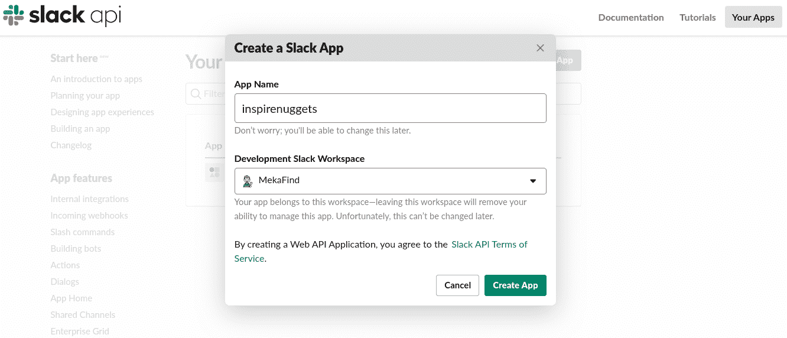

如果您在多个工作空间中，请输入您的应用程序名称并确保您在您创建的工作空间中。

现在你会看到设置>基本信息页面。点击第一个标签页`Add features and functionality`:

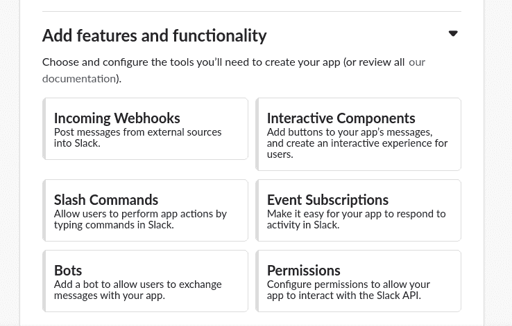

因为我们正在构建一个机器人，所以选择**机器人**字段。

现在您将看到机器人用户页面:

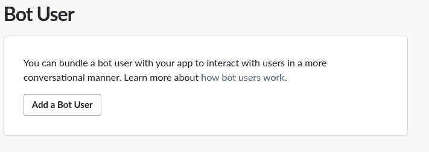

点击`Add a Bot User`按钮。

您的显示名称将自动由您已经选择的应用程序名称填充。你可以更新它，但是我建议你在任何地方都用相同的字母大小写来避免错误。

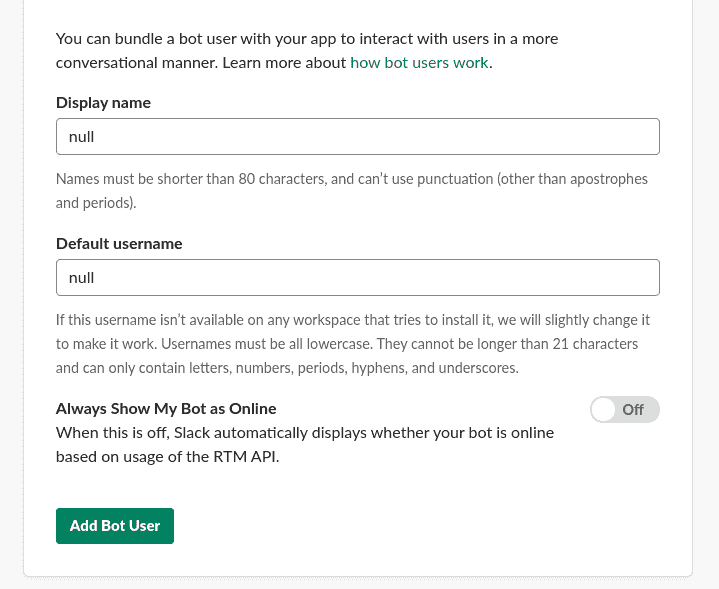

现在，切换`Always Show My Bot as Online`开关，总是显示你的机器人在线。记住这个机器人就像是你工作空间里的一个用户。之后，点击`Add Bot User`按钮。

立即保存所有更改:

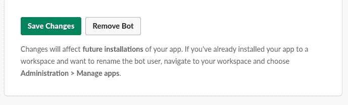

接下来，返回到`Basic Information`页面并选择`Install your app to your workspace`选项卡。

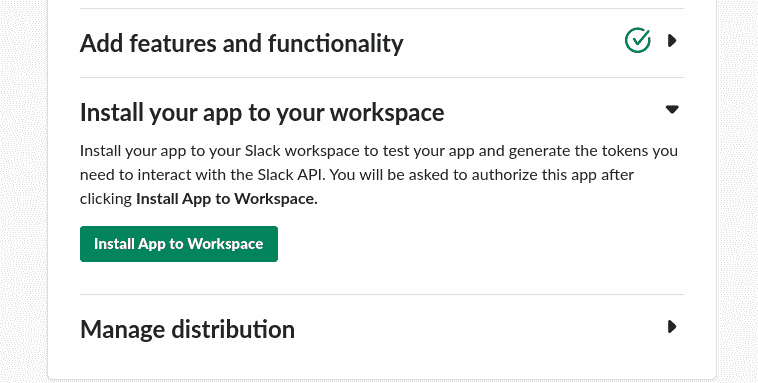

点击`Install App to Workspace`:

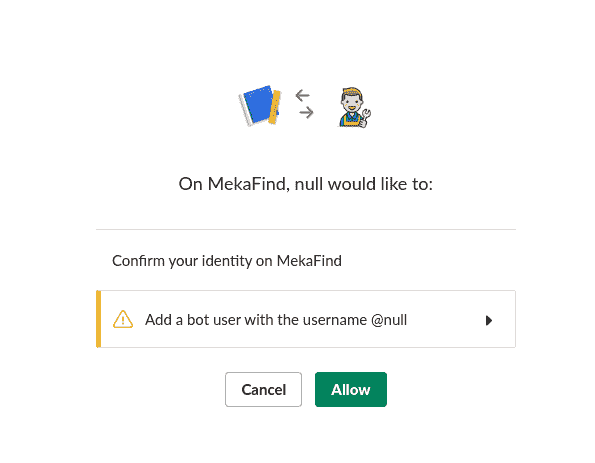

点击允许并等待被重定向回`Basic Information`页面。

注意`Manage distribution`标签:当你想让你的机器人可以被其他人安装时，这个部分是需要的。现在我们只是在开发中构建，我不会在这篇文章中讨论发行版。在我的下一篇文章中，我将向您展示如何部署您的 Slack bot，并将其作为一个应用程序提供给其他工作区。

如果您现在检查您的 Slack 工作区，您应该会在应用程序部分看到安装的应用程序。

现在，它是离线的-一旦我们开始构建机器人，我们将打开它。

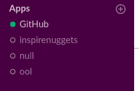

# 定制您的 Slack bot

现在我们已经创建了我们的机器人，让我们做一些定制。

不过，在`Basic Information`页面上，向下滚动到`Display Information`部分:

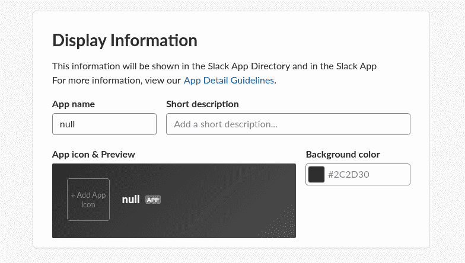

这是基本的东西:只需上传一个标志，改变你的背景颜色，并添加一个简短的描述。

你的图标应该是`512x512px`或更大，你的背景颜色应该是十六进制。点击阅读更多应用指南[。](https://api.slack.com/docs/slack-apps-guidelines)

下面是我的定制后的样子:

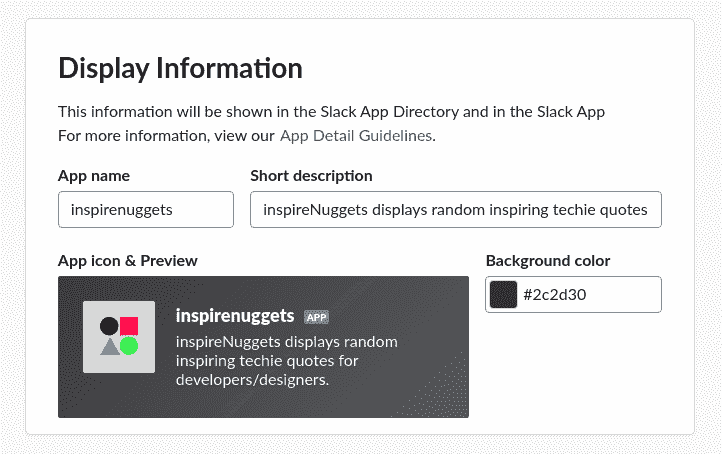

# 备用 bot OAuth 令牌

现在我们已经有了 Slack bot 设置，让我们拿出令牌密钥。

在导航栏中，找到功能部分并点击`OAuth & Permission`选项卡:

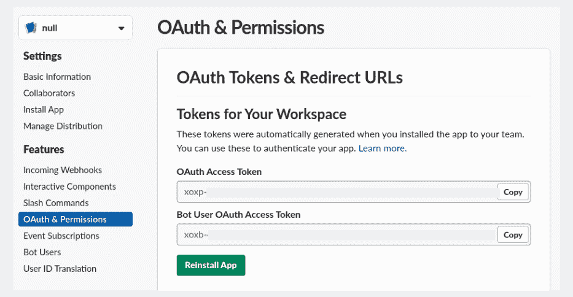

您将看到两个访问令牌:

*   OAuth 访问令牌
*   Bot 用户 OAuth 访问令牌

复制 **Bot 用户 OAuth 访问令牌。**

这将在您每次重新安装此应用或将其安装在另一个工作区时发生变化。令牌应该以`xoxb-`开头。

> 无论您是在开发开源库和工具、为您的工作区开发内部集成，还是在为世界各地的工作区开发 Slack 应用程序，保证凭证的安全都是非常重要的。-松弛

这就是我们安装 Dotenv 的原因——我们将在下一节进行设置。

# 建造机器人

现在让我们建立我们的机器人:)。

### 首先，让我们把访问令牌放在某个地方。

创建一个`.env`文件并添加如下内容:

```
BOT_TOKEN=YOUR_SLACK_ACCESS_TOKEN_HERE 
```

现在让我们开始我们的 SlackBot.js:

```
const bot = new SlackBot({
    token: `${process.env.BOT_TOKEN}`,
    name: 'inspirenuggets'
}) 
```

我们刚刚创建了一个 bot 变量，它初始化了一个新的 SlackBot 实例，该实例有两个值，我们的令牌和应用程序名称。

我使用 [ES6 模板字符串语法](https://developer.mozilla.org/en-US/docs/Web/JavaScript/Reference/Template_literals)从我们的`.env`文件中引入我们的令牌密钥。dotenv 已经帮我们搞定了。

确保您使用的名称与创建 Slack 应用程序时使用的名称相同，否则会出现身份验证错误。

现在启动应用程序:

```
npm start 
```

nodemon 现在应该正在运行，我们的 Slack 应用程序也应该在线。

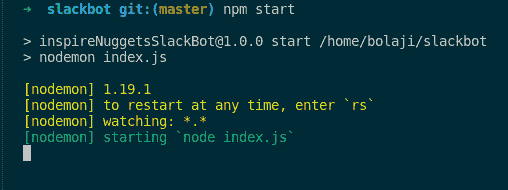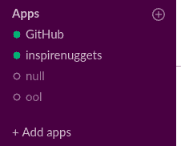

### 开始处理程序

我们的机器人现在什么也不做，尽管它正在运行。我们回个消息吧。

```
bot.on('start', () => {
    const params = {
        icon_emoji: ':robot_face:'
    }

    bot.postMessageToChannel(
        'random',
        'Get inspired while working with @inspirenuggets',
        params
    );
}) 
```

`bot.on`处理器发送欢迎消息。我们传递了两个参数，`'start'`和一个保存 params 变量的函数，该变量也保存 slack 表情符号。Slack 表情符号有代码，你可以在这里找到它们[。我用的是`:robot_face:`，但是你可以把它改成你喜欢的表情符号。](https://slackmojis.com/)

我们还初始化了`bot.postMessageToChannel`函数，这是一个 SlackBot.js 方法，用于向通道发布消息。在这个函数中，我们传递我们想要发布的频道名称、字符串中的消息以及我们之前为表情符号声明的 params 变量。我使用了**#随机**通道，并向其发送了`Get inspired while working with @inspirenuggets`。你的应用应该自动重启，你的机器人应该这样做:


酷吧？您还可以向用户和群组发布消息。

```
 // define existing username instead of 'user_name'
    bot.postMessageToUser('user_name', 'Hello world!', params); 

    // define private group instead of 'private_group', where bot exist
    bot.postMessageToGroup('private_group', 'Hello world!', params); 
```

### 错误处理程序

让我们也编写一个函数来检查错误并返回它们:

```
bot.on('error', (err) => {
    console.log(err);
}) 
```

### 消息处理程序

现在让我们构建主要的 bot 功能。

正如我前面说过的，我们将使用我构建的扩展中的 quotes JSON 作为我们的 quotes API。JSON 可以通过以下网址找到:`https://raw.githubusercontent.com/BolajiAyodeji/inspireNuggets/master/src/quotes.json`

当用户提到我们的机器人并添加**给我灵感**时，机器人会从[的灵感金块](https://chrome.google.com/webstore/detail/inspirenuggets-for-chrome/acnfgdioohhajabdofaadfdhmlkphmlb)中随机返回一段话。当用户键入**随机笑话**时，它从 [Chuck Norris](https://api.chucknorris.io/) API 返回一个随机笑话。当用户输入**帮助**时，它会返回说明指南。

首先，让我们从用户消息中检查我们的命令词(**激励我**、**随机笑话、**和**帮助**):

```
function handleMessage(message) {
    if(message.includes(' inspire me')) {
        inspireMe()
    } else if(message.includes(' random joke')) {
        randomJoke()
    } else if(message.includes(' help')) {
        runHelp()
    }
} 
```

现在让我们创建我们需要的三个函数

**inspireMe()**

我们的演示 JSON 并不是一个真正的 API，它只是我在 Chrome 扩展中使用的一些 JSON。我们只能从 GitHub 原始内容中访问它。你可以使用任何你喜欢的 API，你只需要根据你的 API 是返回一个数组还是一个对象来进行不同的迭代就可以得到你的数据——无论它返回哪个，都没什么大不了的。

查看我以前的文章:

*   [在 JavaScript 中操作数组](https://www.bolajiayodeji.com/manipulating-arrays-in-javascript/)和
*   遍历 JavaScript 对象- 5 技术和性能测试。

```
function inspireMe() {
    axios.get('https://raw.githubusercontent.com/BolajiAyodeji/inspireNuggets/master/src/quotes.json')
      .then(res => {
            const quotes = res.data;
            const random = Math.floor(Math.random() * quotes.length);
            const quote = quotes[random].quote
            const author = quotes[random].author

            const params = {
                icon_emoji: ':male-technologist:'
            }

            bot.postMessageToChannel(
                'random',
                `:zap: ${quote} - *${author}*`,
                params
            );

      })
} 
```

我们刚刚使用 Axios 获得 JSON 文件，该文件返回一些数据:

```
[
    {
        "number": "1",
        "author": "Von R. Glitschka",
        "quote": "The client may be king, but he's not the art director."
    },
    {
        "number": "2",
        "author": "Frank Capra",
        "quote": "A hunch is creativity trying to tell you something."
    },
.
.
.
.
] 
```

这个 JSON 目前包含 210 个引用，我经常更新它们。因此，我们想得到一个随机报价加上作者姓名，每次用户请求它。根据我们的 Axios 响应，我们只是这样做:

```
 const quotes = res.data;
const random = Math.floor(Math.random() * quotes.length);
const quote = quotes[random].quote
const author = quotes[random].author 
```

就像我们处理欢迎消息一样，我们只返回引用和作者，而不是字符串消息:

```
`:zap: ${quote} - *${author}*`
```

让我们来测试一下:

类型`@inspirenuggets inspire me`

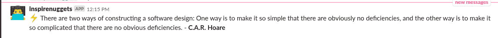

Yayyy！成功了！

PS:你可以随时为每个请求更改表情类型。如果你注意到我把`inspireMe()`改成了`:male-technologist:`

**randomJoke()**

我们从这个端点`https://api.chucknorris.io/jokes/random`获得 Chuck Norris API 的笑话。

```
{
"categories": [],
"created_at": "2016-05-01 10:51:41.584544",
"icon_url": "https://assets.chucknorris.host/img/avatar/chuck-norris.png",
"id": "6vUvusBeSVqdsU9C5-ZJZw",
"updated_at": "2016-05-01 10:51:41.584544",
"url": "https://api.chucknorris.io/jokes/6vUvusBeSVqdsU9C5-ZJZw",
"value": "Chuck Norris once choked a wildcat to death with his sphincter muscle."
} 
```

这是一个真正的 API，对每个请求都返回一个随机的笑话，所以我们不用再做`Math.floor()`了。

```
function randomJoke() {
    axios.get('https://api.chucknorris.io/jokes/random')
      .then(res => {
            const joke = res.data.value;

            const params = {
                icon_emoji: ':smile:'
            }

            bot.postMessageToChannel(
                'random',
                `:zap: ${joke}`,
                params
            );

      })
} 
```

到目前为止，您应该已经明白这是如何工作的了。用频道名称、消息和参数发帖。

**运行帮助()**

这类似于我们的欢迎消息:我们只想在用户将 **help** 添加到请求中时返回一个自定义文本。

```
function runHelp() {
    const params = {
        icon_emoji: ':question:'
    }

    bot.postMessageToChannel(
        'random',
        `Type *@inspirenuggets* with *inspire me* to get an inspiring techie quote, *random joke* to get a Chuck Norris random joke and *help* to get this instruction again`,
        params
    );
} 
```

现在让我们测试所有三个命令:

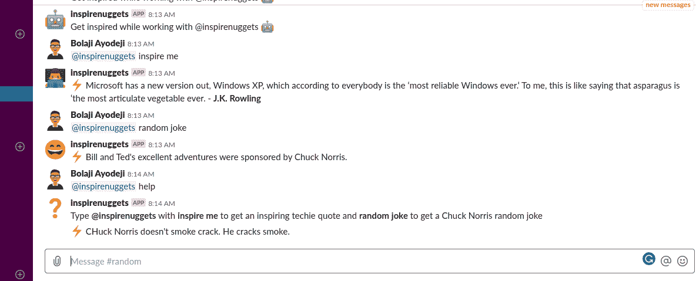

现在一切正常，恭喜你！！！！你刚刚制造了你的懒汉机器人。

* * *

有无数的可能性，你可以用它来建立机器人，使你自己的工作或团队工作自动化。

您可以构建一个机器人:

*   从某处获取任务，并在您键入`hey what next`时提醒您，
*   欢迎每一个用户来到你的工作空间(这是我在 [HNG 实习的](https://hng.tech/)期间建造的)，
*   在您工作时为您提供足球比赛的最新消息，
*   告诉您的团队当您的注册用户数量达到一个里程碑时，

还有更多...

这只是关于从某个地方获取数据，以及一些基本的迭代技巧和`bot.postMessageToChannel()`方法。

自动化是我们作为开发人员应该学习的一件事。我们有很多事情要做，所以我们应该把简单的任务自动化，这样我们就有时间做更困难的任务。我希望有了这个，你可以自动完成你的任务，我期待着你带来的创造性的想法。

* * *

# 最终代码

这是我们最后的`index.js`

```
const SlackBot = require('slackbots');
const axios = require('axios')
const dotenv = require('dotenv')

dotenv.config()

const bot = new SlackBot({
    token: `${process.env.BOT_TOKEN}`,
    name: 'inspirenuggets'
})

// Start Handler
bot.on('start', () => {
    const params = {
        icon_emoji: ':robot_face:'
    }

    bot.postMessageToChannel(
        'random',
        'Get inspired while working with @inspirenuggets',
        params
    );
})

// Error Handler
bot.on('error', (err) => {
    console.log(err);
})

// Message Handler
bot.on('message', (data) => {
    if(data.type !== 'message') {
        return;
    }
    handleMessage(data.text);
})

// Response Handler
function handleMessage(message) {
    if(message.includes(' inspire me')) {
        inspireMe()
    } else if(message.includes(' random joke')) {
        randomJoke()
    } else if(message.includes(' help')) {
        runHelp()
    }
}

// inspire Me
function inspireMe() {
    axios.get('https://raw.githubusercontent.com/BolajiAyodeji/inspireNuggets/master/src/quotes.json')
      .then(res => {
            const quotes = res.data;
            const random = Math.floor(Math.random() * quotes.length);
            const quote = quotes[random].quote
            const author = quotes[random].author

            const params = {
                icon_emoji: ':male-technologist:'
            }

            bot.postMessageToChannel(
                'random',
                `:zap: ${quote} - *${author}*`,
                params
            );

      })
}

// Random Joke
function randomJoke() {
    axios.get('https://api.chucknorris.io/jokes/random')
      .then(res => {
            const joke = res.data.value;

            const params = {
                icon_emoji: ':smile:'
            }

            bot.postMessageToChannel(
                'random',
                `:zap: ${joke}`,
                params
            );

      })
}

// Show Help
function runHelp() {
    const params = {
        icon_emoji: ':question:'
    }

    bot.postMessageToChannel(
        'random',
        `Type *@inspirenuggets* with *inspire me* to get an inspiring techie quote, *random joke* to get a Chuck Norris random joke and *help* to get this instruction again`,
        params
    );
}
```

# 接下来呢？

我们的机器人现在只在开发中运行，为了使用它，我们总是必须`npm start`。

这不酷，对吧？我们想把它放在一个每次都能运行的地方。在我的下一篇文章中，我将向你展示如何在 [Heroku](https://herokuapp.com/) 、 [Zeit](https://zeit.co/) 或 [Netlify](https://netlify.com) 上托管它，并将其发布到 Slack 应用商店，以便世界各地的任何人都可以使用它。
此外，在推送到 GitHub 之前，不要忘记将这个添加到您的`.gitignore`中:

```
 /.env
/node_modules 
```

> **订阅我的[时事通讯](https://tinyletter.com/bolajiayodeji/)获取最新消息。**

# 有用的资源

*   [松弛 API](https://api.slack.com/)
*   [松弛 API 文档](https://api.slack.com/#read_the_docs)
*   [SlackBot.js](https://github.com/slackapi/node-slack-sdk)

*   [松弛应用指南](https://api.slack.com/docs/slack-apps-guidelines)
*   [Slack 应用简介](https://api.slack.com/start/overview)
*   [灵感金块](https://github.com/BolajiAyodeji/inspireNuggets)
*   [inspiregnuggsslackbot](https://github.com/BolajiAyodeji/inspireNuggetsSlackBot)