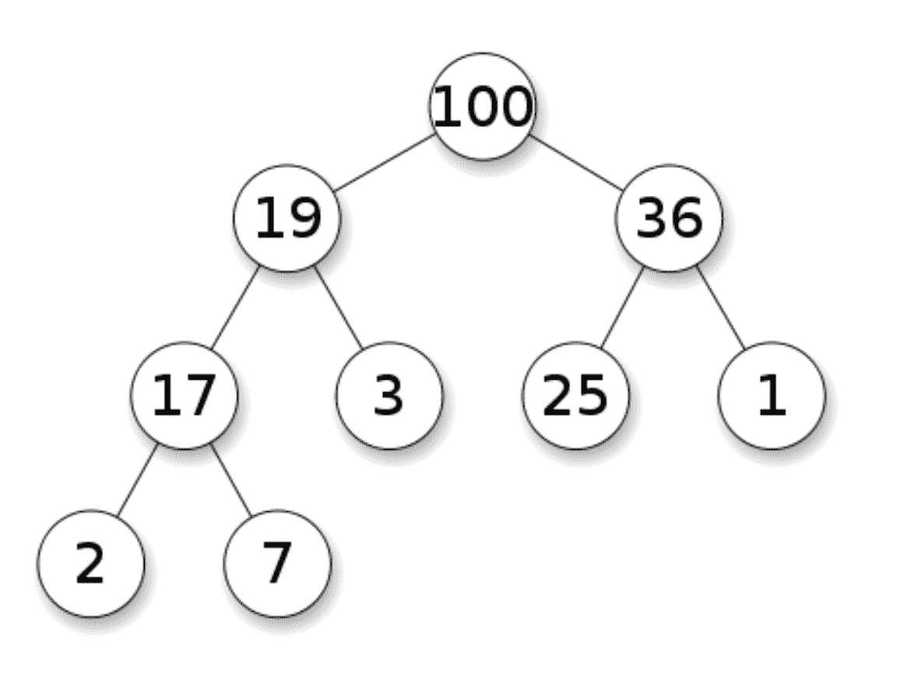
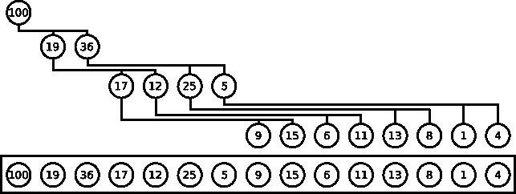
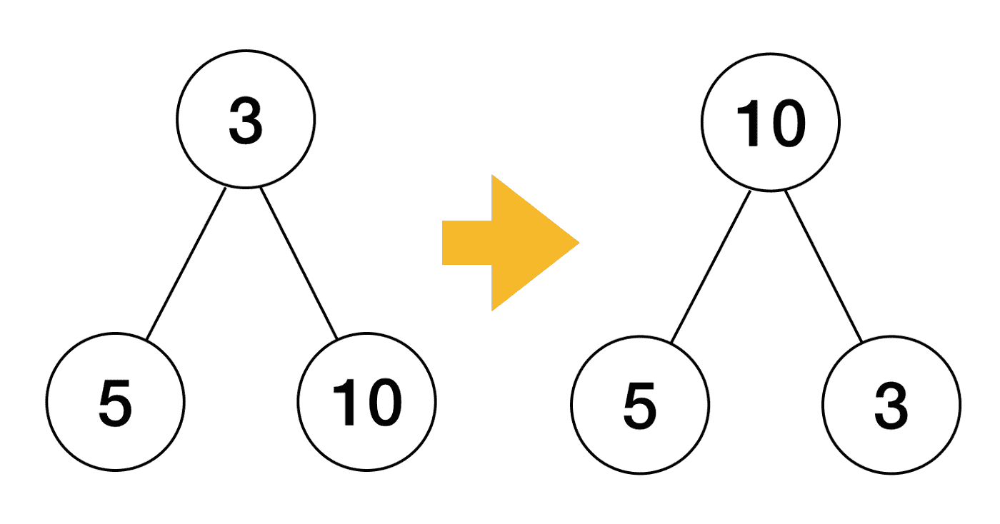

# 如何在 Go 标准库中实现堆排序

> 原文：<https://www.freecodecamp.org/news/reading-challenge-heap-sort-in-go/>

堆排序是一个漂亮的排序算法。它使用一个 max-heap 来排序一个数字序列或其他具有定义的顺序关系的元素。在本文中，我们将深入研究 ****Go 标准库**** 堆排序实现。

# 最大堆

首先简单回顾一下 [****二进制最大堆****](https://en.wikipedia.org/wiki/Heap_(data_structure)) 。max-heap 是一个在 O(1)时间内提供其最大元素，在 O(log n)内添加一个元素，在 O(log n)内删除 ****最大元素**** 的容器。

Max-heaps 是 ****几乎满的**** 二叉树，其中 ****每个节点都大于或等于其子节点**** 。在整篇文章中，我将后者称为 ****堆属性**** 。

这两个属性一起定义了最大堆:



A Max heap. By Ermishin — Own work, CC BY-SA 3.0, [https://commons.wikimedia.org/w/index.php?curid=12251273](https://commons.wikimedia.org/w/index.php?curid=12251273)

在堆算法中，最大堆被表示为一个数组。在数组表示中，索引`i`中节点的子节点位于索引`2*i+1`和`2*i+2`中。维基百科中的图表显示了数组表示:



Max-heap represented as an array. By Maxiantor — Own work, CC BY-SA 4.0, [https://commons.wikimedia.org/w/index.php?curid=55590553](https://commons.wikimedia.org/w/index.php?curid=55590553)

## 建立一个堆

一个数组可以在 O(n)时间内转换成一个最大堆。很神奇，不是吗？算法是这样的:

1.  将输入数组视为一个堆。它还不满足堆属性。
2.  从堆的倒数第二层开始迭代堆的节点——比叶子高一层——返回到根。
3.  对于遇到的每个节点，在堆中向下传播，直到它大于它的两个子节点。向下传播时，始终与较大的子级交换。

就是这样！你完了！

为什么有效？我将试着用这个手动波形证明来说服你(尽管可以随意跳过):

*   取一个树节点`x`。因为我们从后向前迭代堆，所以当我们到达它时，根在它的两个子树中的子树已经满足堆属性。
*   如果`x`大于它的两个子节点，我们就完成了。
*   否则，我们就把`x`和它最大的孩子交换。这使得子树的新根大于它的两个子树。
*   如果`x`在它的新子树中不满足堆属性，这个过程将被重复，直到它满足或成为一片叶子，在这种情况下，它不会有任何子树。

这适用于堆中的所有节点，包括根节点。

# 堆排序算法

现在是主菜——堆排序。

堆排序分两步进行:

1.  使用我上面展示的算法从输入数组构建一个 max-heap。这要花很多时间
2.  将堆中的元素放入输出数组，从后向前填充。每次从堆中移除最大元素需要 O(log n)时间，整个容器总共需要 O(n * log n)时间。

Go 实现的一个很酷的特性是，它使用输入数组来存储输出，因此不需要为输出分配 O(n)内存。

# 堆排序实现

Go 排序库支持任何由整数 索引的 ****、在其元素上具有 ****定义的顺序关系**** 的集合，并且 ****支持在两个索引之间交换**** 元素:****

```
type Interface interface {
	// Len is the number of elements in the collection.
	Len() int
	// Less reports whether the element with
	// index i should sort before the element with index j.
	Less(i, j int) bool
	// Swap swaps the elements with indexes i and j.
	Swap(i, j int)
}
```

From [https://github.com/golang/go/blob/master/src/sort/sort.go](https://github.com/golang/go/blob/master/src/sort/sort.go)

自然，任何连续的数字容器都可以满足这个接口。

现在我们来看看`heapSort()`的身体:

```
func heapSort(data Interface, a, b int) {
	first := a
	lo := 0
	hi := b - a

	// Build heap with greatest element at top.
	for i := (hi - 1) / 2; i >= 0; i-- {
		siftDown(data, i, hi, first)
	}

	// Pop elements, largest first, into end of data.
	for i := hi - 1; i >= 0; i-- {
		data.Swap(first, first+i)
		siftDown(data, lo, i, first)
	}
}
```

From [https://github.com/golang/go/blob/master/src/sort/sort.go](https://github.com/golang/go/blob/master/src/sort/sort.go)

该函数的签名有点神秘，但是看一下前三行就明白了:

*   `a`和`b`是进入`data`的指标。`heapSort(data, a, b)`在半开范围`[a, b)`内对`data`进行分类。
*   `first`是`a`的副本。
*   `lo`和`high`是由`a`归一化的指数——`lo`总是从零开始，`hi`在输入的大小时开始。

接下来，代码构建最大堆:

```
// Build heap with greatest element at top.
for i := (hi - 1) / 2; i >= 0; i-- {
  siftDown(data, i, hi, first)
}
```

正如我们前面看到的，代码从叶子之上的一级开始扫描堆，并使用`siftDown()`向下传播当前元素，直到它满足堆属性。我将在下面更详细地介绍`siftDown()`。

在这个阶段，`data`是一个最大堆。

接下来，我们弹出所有元素来创建排序后的数组:

```
// Pop elements, largest first, into end of data.
for i := hi - 1; i >= 0; i-- {
  data.Swap(first, first+i)
  siftDown(data, lo, i, first)
}
```

在这个循环中，`i`是堆中的最后一个索引。在每次迭代中:

*   堆的最大值`first`与堆的最后一个元素交换。
*   通过向下传播新的`first`来恢复堆属性，直到它满足堆属性。
*   堆大小`i`减少 1。

换句话说，我们从后向前填充数组，从最大的元素开始，到第二个元素，一直到最小的元素。结果是排序后的输入。

## 维护堆属性

在这篇文章中，我提到了使用`siftDown()`来维护堆属性。让我们看看它是如何工作的:

```
// siftDown implements the heap property on data[lo, hi).
// first is an offset into the array where the root of the heap lies.
func siftDown(data Interface, lo, hi, first int) {
	root := lo
	for {
		child := 2*root + 1
		if child >= hi {
			break
		}
		if child+1 < hi && data.Less(first+child, first+child+1) {
			child++
		}
		if !data.Less(first+root, first+child) {
			return
		}
		data.Swap(first+root, first+child)
		root = child
	}
}
```

From [https://github.com/golang/go/blob/master/src/sort/sort.go](https://github.com/golang/go/blob/master/src/sort/sort.go)

这段代码沿着树向下传播`root`中的元素，直到它比它的两个子元素都大。向下一级时，该元素将与其更大的子元素交换。也就是确保新的父节点大于它的两个子节点:



The parent ‘3’ is swapped with the greatest child ‘10’

前几行计算第一个子项的索引，并检查它是否存在:

```
child := 2*root + 1
if child >= hi {
  break
} 
```

`child >= hi`表示当前`root`是叶子，所以算法停止。

接下来，我们选择两个孩子中较大的一个:

```
if child+1 < hi && data.Less(first+child, first+child+1) {
  child++
}
```

因为任何节点的子节点在数组中都是相邻的，`child++`选择第二个子节点。

接下来，我们检查父节点是否确实小于子节点:

```
if !data.Less(first+root, first+child) {
  return
}
```

如果父代大于它最大的子代，我们就这样做了，所以我们返回。

最后，如果父元素比子元素小，我们交换两个元素并增加`root`为下一次迭代做准备:

```
data.Swap(first+root, first+child)
root = child
```

# 结论

这是我阅读一段不熟悉的代码并尝试解释它的第三篇文章。我喜欢这种体验，因为它教会我如何阅读代码，以及如何就代码进行交流。请在下面留下您的评论和反馈！