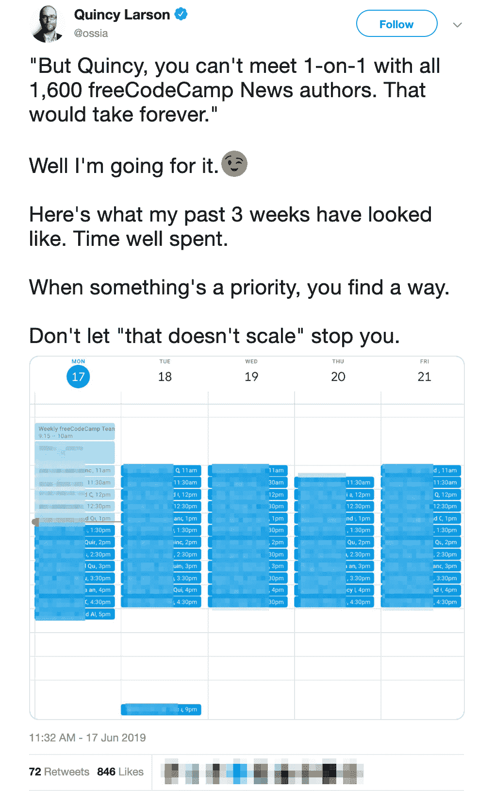
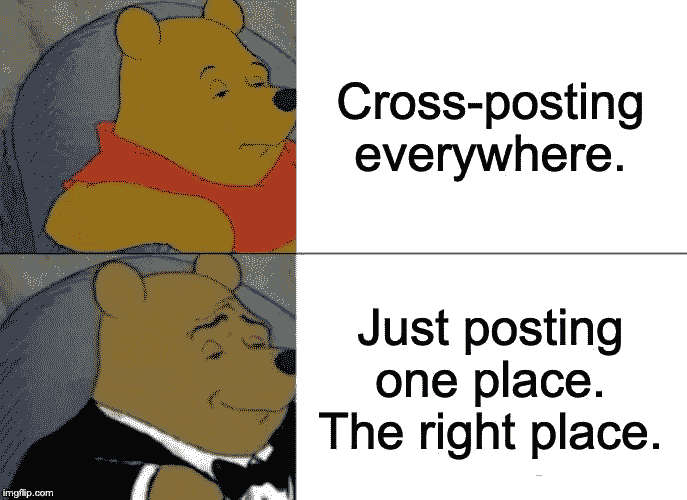
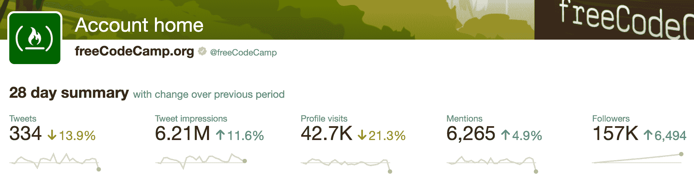
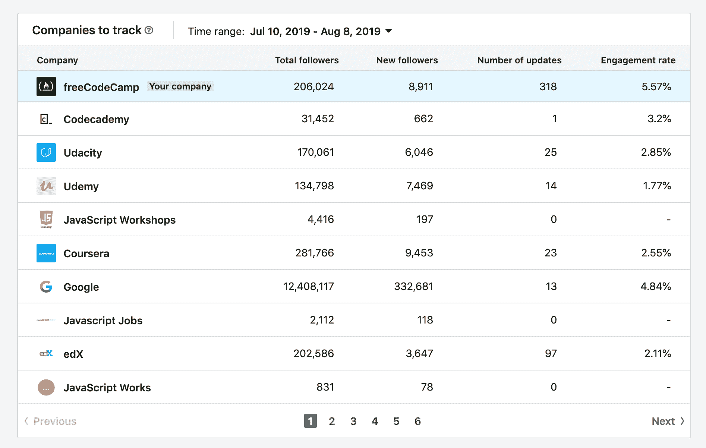
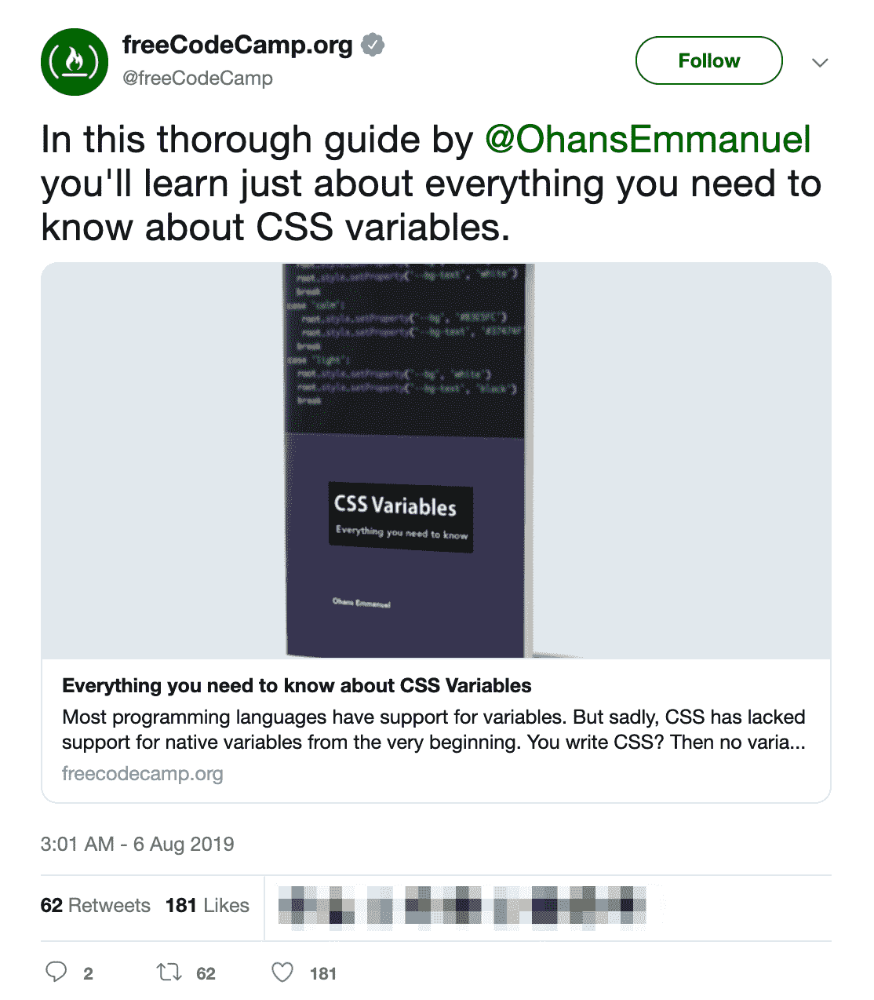

# 当你为读者优化时，每个人都是赢家

> 原文：<https://www.freecodecamp.org/news/the-new-way-forward-for-developer-news/>

我们两个月前推出了 freeCodeCamp.org/news。读者数量的增长比我们想象的要快得多。

我就不吊你胃口了。freeCodeCamp.org 现在是全球第 1755 大网站。新闻是这一增长的重要部分。

Source: Amazon's Alexa global website rankings

/news——和 freeCodeCamp 做的其他事情一样——是完全免费的。你不必签到。我们甚至没有广告。

这都要归功于 5000 多名体贴的人，他们每个月都捐款支持我们的非营利组织。

freeCodeCamp 也没有那些在我们变得足够大的时候就迫不及待地想把我们“货币化”的投资者。

相反，freeCodeCamp 是一个由公众拥有的免税慈善机构。(即使是我——创办 freeCodeCamp 的老师——也不拥有它的任何股票。)

全球开发者社区正在共同构建一个将永远存在的公共空间。

在宇宙热寂之后很久，我们今天在这里的集体努力将继续通过时空本身的结构产生反响。？

## 让我们回顾一下到目前为止 freecodecamp.org/news 的故事。

### 2015 年，我们将所有文章从我们的博客转移到我们的媒体出版物上。

中号很棒。真的。但是我们已经长大了。

我们使用 Medium 作为内容管理系统。这样我们就不用担心托管了。或者当我们的一篇文章登上“互联网首页”时，偶尔的“死亡的 Reddit 拥抱”

这些文章一直在 freeCodeCamp.org，在我们的中域。所以当时机到来时，我们准备转移到我们自己的自主博客。

### 然后 2019 年 6 月我们推出了/news。

有了/news，我们能够立即做出改进。比如撕掉 Medium 所有的社交媒体功能，换成更重要的东西。比如代码语法高亮和更好的可访问性。

多年来，媒体在中国、埃及和马来西亚被封锁。

在这一行动中，我们将所有这些文章提供给了人类中四分之一的人，他们以前无法阅读这些文章。

# /新闻不是社交媒体发布平台。

已经有很多优秀的开放发布平台了。大声喊到:

*   代码墙
*   Dev.to
*   哈希码

任何人都可以在这些社交媒体平台上创建一个账户，并在几秒钟内开始发布。

他们有有趣的反馈机制。心跳。鼓掌。独角兽。

每天都有数百人在这些平台上发表文章。

/新闻没有这些。

相反，我们只是专注于对读者有用。

# /新闻更像是学术期刊。

我知道，我知道。学术期刊并不十分吸引人。

但是他们确实推动了艺术的发展。

当你在学术期刊上发表文章时，人们会认真对待你的工作。他们读了。他们谈论它。

在设计/新闻方面，我们从学术期刊中获得了很多灵感。

首先，**我们是选择性的**。很难拿到作者账号。

上个月，近 1000 名开发者申请成为作者。我们批准的不到 13%。

(如果你申请了，但没有被录取:坚持下去，继续练习你的技术写作。如果你坚持下去，你会成功的。)

在过去的两个月里，我与数百名过去的作者进行了一对一的会面，亲自让他们登上/news。

第二，**我们有一个编辑团队**负责审核和微调这些文章。

我们已经在[这份详细的风格指南](https://www.freecodecamp.org/news/developer-news-style-guide/)中阐述了我们的编辑理念。

在创作了数百篇技术文章 **-** 并编辑了数千篇之后，我对什么有效有了一个相当好的想法。

我就在这里告诉你这个秘密。

就一个字。

**物质**。

# 我们关注的是你在其他地方读不到的实质性文章。

正如我们所建立的，已经有很多地方可以交叉发布你的博客文章。这个世界不需要另一个。

所以/新闻不会是另一个。

相反，我们将把重点放在你在其他地方读不到的文章上。

实质性的文章需要时间去研究和写作。

例如，我花了整整一周的时间研究并撰写了这篇 6500 字的关于网络中立历史的文章。一百万人读了它，SXSW 联系我，让我飞到奥斯汀做一个关于它的演讲。

这种事情经常发生。对于 freeCodeCamp 的作者来说，凭借他们的 freeCodeCamp 文章获得自由客户甚至工作邀请是很常见的。

那是因为这些作者投入了时间。他们投入了研究。他们想把文章写好。

归根结底，质量比数量重要得多。

开发者很忙。我们想读值得我们花时间去读的文章。

如果/news 一周只出一篇，那也行。就这样吧。只要那一篇是好文章。

# /新闻给作者扩音器。

我们通过 freeCodeCamp 的社交媒体大力宣传文章。

例如，这是我们过去 28 天的 Twitter 分析。

Fewer tweets. More impressions.

比 Twitter 更大的是，这里是我们的 LinkedIn 分析:

我们不仅分享新的文章。随着时间的推移，我们不断分享它们。我们不是在追逐头条。我们写的是今天重要和明天重要的事情。

例如，这里有一个几年前的故事，我们刚刚在本周再次分享:

以下是我们为读者优化的一些其他方法:

*   因为我们不关心“广告印象”/新闻可以使用**谷歌放大器**，意味着/新闻文章在谷歌搜索结果中出现得更高。
*   **/消息快如闪电**。我们尽可能少地使用您的手机数据。这使得/news 成为 IT 基础设施欠发达国家的人们的首选资源。
*   哦，我有一个 200 万人的邮件列表，我每周用它来发布新闻。随便说说。

# /新闻正在大力发展

我是艾萨克·牛顿的超级粉丝。他让我脚踏实地。

你可能听过他 1765 年的名言:

> "如果说我看得更远，那是因为我站在巨人的肩膀上."

在设计/新闻方面，我们站在巨人的肩膀上。我们抵制了“不是在这里发明的”陷阱。

相反，我们运行的是 [Ghost](https://github.com/TryGhost/Ghost) ，一个麻省理工学院许可的自托管发布工具。自从这个项目成立以来，我一直在关注它，团队一直在稳步改进它，并构建出我们需要的功能。

对于评论，我们使用我们现有的[话语](https://github.com/discourse/discourse)论坛。因此，我们的版主团队可以帮助保持评论的文明和建设性。

这意味着 freeCodeCamp 社区并不孤单。我们有来自其他项目的其他开发人员团队，他们正在帮助我们稳步提高/news 的性能和可访问性。

# 底线:在/news 上发布意味着什么。

如果你喜欢写实质性的文章，并且希望有思想的人阅读你的文章，那么你来对地方了。

对于所有正在阅读这篇文章但现在太忙而没有时间写文章的开发人员，我们感谢你们的读者。我们将继续为您优化我们所做的一切。

快乐编码。