# 如何在 Keras 用深度学习对蝴蝶进行分类

> 原文：<https://www.freecodecamp.org/news/classify-butterfly-images-deep-learning-keras/>

不久前，我在荷兰组织 [Vlinderstichting](https://www.vlinderstichting.nl/actueel/nieuws/nieuwsbericht/?bericht=1492) 的网站上读到了一篇有趣的博文。每年他们组织一次蝴蝶计数。志愿者帮助确定他们花园里不同的蝴蝶种类。Vlinderstichting 收集并分析结果。

由于蝴蝶种类的确定是由志愿者完成的，这个过程不可避免地容易出错。因此，Vlinderstichting 有来手动检查提交的内容，这是非常耗时的。

具体来说，有三种蝴蝶的 Vlinderstichting 得到了许多错误的判定。这些是

*   草甸棕色或马尼拉棕色
*   [看门人](https://en.wikipedia.org/wiki/Gatekeeper_(butterfly))或 Pyronia tithonus
*   [小石南](https://en.wikipedia.org/wiki/Small_heath_(butterfly))或蒲葵

在本文中，我将描述拟合深度学习模型的步骤，该模型有助于区分前两种蝴蝶。

# 使用 Flickr API 下载图像

为了训练一个卷积神经网络，我需要找到带有正确标签的蝴蝶图像。当然，我可以自己给我想分类的蝴蝶拍照。他们有时在我的花园里飞来飞去…

开玩笑，那要花很长时间。为此，我需要一种自动获取图像的方法。为此，我通过 Python 使用 Flickr API。

## 设置 Flickr API

首先，我用 pip 安装了 [flickrapi 包](https://pypi.python.org/pypi/flickrapi/2.3)。然后我在 Flickr 网站上创建必要的 [API 键](https://www.flickr.com/services/api/misc.api_keys.html)来连接到 Flickr API。

除了 flickrapi 包之外，我还导入了 os 和 urllib 包，用于下载图像和设置目录。

```
from flickrapi import FlickrAPI
import urllib
import os
import config
```

在配置模块中，我为 Flickr API 定义了公钥和密钥。这只是一个 Python 脚本(config.py ),代码如下:

```
API_KEY = 'XXXXXXXXXXXXXXXXX'  // replace with your key
API_SECRET = 'XXXXXXXXXXXXXXXXX'  // replace with your secret
IMG_FOLDER = 'XXXXXXXXXXXXXXXXX'  // replace with your folder to store the images
```

出于安全原因，我将这些密钥保存在一个单独的文件中。因此，您可以将代码保存在公共存储库中，如 GitHub 或 BitBucket，并将 config.py 放在. gitignore 中。因此，您可以与其他人共享您的代码，而不必担心有人会访问您的凭据。

为了提取不同蝴蝶种类的图像，我写了一个函数 download_flickr_photos。我会一步一步解释这个函数。此外，我已经在 [GitHub](https://github.com/bertcarremans/Vlindervinder/tree/master/flickr) 上发布了完整的代码。

## 输入参数

首先，我检查输入参数的类型或值是否正确。如果没有，我会抛出一个错误。参数的解释可以在函数的 docstring 中找到。

```
if not (isinstance(keywords, str) or isinstance(keywords, list)):
    raise AttributeError('keywords must be a string or a list of strings')
if not (size in ['thumbnail', 'square', 'medium', 'original']):
    raise AttributeError('size must be "thumbnail", "square", "medium" or "original"')
if not (max_nb_img == -1 or (max_nb_img > 0 and isinstance(max_nb_img, int))):
    raise AttributeError('max_nb_img must be an integer greater than zero or equal to -1')
```

其次，我定义了稍后将在 walk 方法中使用的一些参数。我为关键字创建了一个列表，并确定需要从哪个 URL 下载图像。

```
if isinstance(keywords, str):
    keywords_list = []
    keywords_list.append(keywords)
else:
    keywords_list = keywords
if size == 'thumbnail':
    size_url = 'url_t'
elif size == 'square':
    size_url = 'url_q'
elif size == 'medium':
    size_url = 'url_c'
elif size == 'original':
    size_url = 'url_o'
```

## 连接到 Flickr API

接下来，我连接到 Flickr API。在 FlickrAPI 调用中，我使用了配置模块中定义的 API 键。

```
flickr = FlickrAPI(config.API_KEY, config.API_SECRET)
```

## 为每种蝴蝶创建子文件夹

我将每种蝴蝶的图片保存在单独的子文件夹中。每个子文件夹的名称是蝴蝶物种的名称，由关键字。如果子文件夹还不存在，我就创建它。

```
results_folder = config.IMG_FOLDER + keyword.replace(" ", "_") + "/"
if not os.path.exists(results_folder):
    os.makedirs(results_folder)
```

## 在 Flickr 图书馆里漫步

```
photos = flickr.walk(
    text=keyword,
    extras='url_m',
    license='1,2,4,5',
    per_page=50)
```

我使用 Flickr API 的 walk 方法来搜索指定关键字的图像。这个 walk 方法与 Flickr API 中的[搜索方法](http://www.flickr.com/services/api/flickr.photos.search.html)具有相同的参数。

在文本参数 ******，*******中我使用关键字来搜索与该关键字相关的图片。其次，在 extras 参数*中，我指定 url_m 为小、中尺寸的图片。在这个 [Flickcurl C 库](http://librdf.org/flickcurl/api/flickcurl-searching-search-extras.html)中给出了更多关于图像大小和它们各自 URL 的解释。**

**第三，在许可参数*中，我选择带有非商业许可的图片。关于许可证代码及其含义的更多信息可以在 Flickr [API 平台](https://www.flickr.com/services/api/flickr.photos.licenses.getInfo.html)上找到。最后，per_page 参数指定了我允许每页显示多少张图片。***

**因此，我有一个名为 photos 的生成器来下载图片。**

## **下载 Flickr 图像**

**有了照片生成器，我可以下载搜索查询中找到的所有图片。首先，我得到了下载图片的具体网址。然后我增加 count 变量，并使用这个计数器来创建图像文件名。**

**使用 urlretrieve 方法，我下载图像并将其保存在蝴蝶物种的文件夹中。如果出现错误，我会打印出错误消息。**

```
**`for photo in photos:
    try:
        url=photo.get('url_m')
        print(url)
        count += 1
        urllib.request.urlretrieve(url,  results_folder + str(count) +".jpg")
    except Exception as e:
        print(e, 'Download failure')`**
```

**为了下载多种蝴蝶，我创建了一个列表，并在 for 循环中调用 download_flickr_photos 函数。为了简单起见，我只下载了上面提到的三种蝴蝶中的两种。**

```
**`butterflies = ['meadow brown butterfly', 'gatekeeper butterfly']
for butterfly in butterflies:
    download_flickr_photos(butterfly)`**
```

# **图像的数据扩充**

**在少量图像上训练 convnet 会导致过度拟合。因此，该模型在分类新的、看不见的图像时会出错。数据扩充有助于避免这种情况。幸运的是，Keras 有一些很好的工具来轻松转换图像。**

**我想和我儿子在路上给汽车分类的方式做个比较。目前他只有 2 岁，还没有见过像成年人一样多的车。所以你可以说他的训练图像集相当小。因此，他更有可能将汽车分类错误。例如，他有时会误把救护车当成警车。**

**随着他年龄的增长，他会看到更多的救护车和警车，以及我将给他的相应标签。因此，他的训练集将变得更大，从而他将更正确地对它们进行分类。**

**因此，我们需要向 convnet 提供比目前更多的蝴蝶图片。一个简单的解决方案是*数据扩充*。简而言之，这意味着对 Flickr 图像应用一组变换。**

**Keras 提供了[大范围的图像变换](https://keras.io/preprocessing/image/)。但首先，我们必须转换图像，以便 Keras 可以使用它们。**

## **将图像转换为数字**

**我们从导入 Keras 模块开始。我们将用一个示例图像来演示图像转换。为此，我们使用 load_img 方法。**

```
**`from keras.preprocessing.image import ImageDataGenerator, array_to_img, img_to_array, load_img
i = load_img('data/train/maniola_jurtina/1.jpg' )
x = img_to_array(i)
x = x.reshape((1,) + x.shape)`**
```

**load_img 方法创建一个 Python 图像库文件。我们需要将它转换成一个 Numpy 数组，以便稍后在 ImageDataGenerator 方法中使用。这是通过方便的 img_to_array 方法完成的。因此，我们有一个 75x75x3 形状的数组。这些尺寸反映了宽度、高度和 RGB 值。**

**事实上，图像的每个像素有 3 个 RGB 值。这些范围在 0 到 255 之间，代表红色、绿色和蓝色的强度。较低的值代表较高的强度，较高的值代表较低的强度。例如，一个像素可以表示为这三个值的列表[ 78，136，60]。黑色将表示为[0，0，0]。**

**最后，我们需要添加一个额外的维度，以避免在应用转换时出现值错误。这是通过整形功能完成的。**

**好了，现在我们有东西可以用了。让我们继续转换。**

## **旋转**

**通过指定 0 到 180 之间的值，Keras 将随机选择一个角度来旋转图像。它会顺时针或逆时针转动。在我们的例子中，图像最大旋转 90 度。**

**ImageDataGenerator 还有一个参数 fill_mode。默认值为“最近”。通过在原始图像的宽度和高度范围内旋转图像，我们得到了“空”像素。fill_mode 然后使用最近的像素来填充这个空白空间。**

```
**`imgGen = ImageDataGenerator(rotation_range = 90)
i = 1
for batch in imgGen.flow(x, batch_size=1, save_to_dir='example_transformations', save_format='jpeg', save_prefix='trsf'):
    i += 1
    if i &gt; 3:
        break`**
```

**在流方法中，我们指定保存转换图像的位置。请确保该目录存在！为了方便起见，我们还给新创建的图像加上前缀。flow 方法可以无限运行，但是对于这个例子，我们只生成三个图像。所以当我们的计数器达到这个值时，我们就中断 for 循环。你可以在下面看到结果。**

**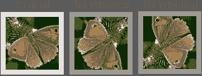**

## **宽度移动**

**在 width_shift_range 参数中，您可以指定图像向左或向右移动的原始宽度的比率。同样，fill_mode 将填充新创建的空像素。对于其余的示例，我将只展示如何用相应的参数实例化 ImageDataGenerator。生成图像的代码与旋转示例中的代码相同。**

```
**`imgGen = ImageDataGenerator(width_shift_range = 90)`**
```

**在变换后的图像中，我们看到图像向右移动。空像素被填充，这使它看起来有点拉伸。**

**通过为 height_shift_range 参数指定一个值，可以对上移或下移执行相同的操作。**

**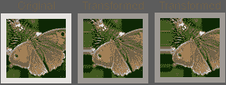**

## **重新调节**

**在任何其他预处理之前，重新缩放图像会将每个像素的 RGB 值乘以一个选定的值。在我们的示例中，我们对值应用最小-最大缩放。因此，这些值的范围将在 0 和 1 之间。这使得值更小，模型更容易处理。**

```
**`imgGen = ImageDataGenerator(rescale = 1./255)`**
```

**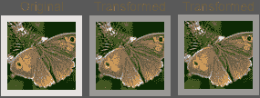**

## **剪(羊毛)**

**使用 shear_range 参数，我们可以指定必须如何应用剪切变换。当该值设置得太高时，这种变换会产生相当奇怪的图像。所以不要定的太高。**

```
**`imgGen = ImageDataGenerator(shear_range = 0.2)`**
```

**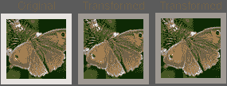**

## **一款云视频会议软件**

**这种转换将在图片内部放大。就像剪切参数一样，这个值不应该被夸大以保持图像的真实感。**

```
**`imgGen = ImageDataGenerator(zoom_range = 0.2)`**
```

## **水平翻转**

**这种变换水平翻转图像。生活有时会很简单…**

```
**`imgGen = ImageDataGenerator(horizontal_flip = True)`**
```

**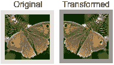**

## **所有转换组合**

**现在我们已经分别看到了每个变换的效果，我们一起应用所有的组合。**

```
**`imgGen = ImageDataGenerator(
    rotation_range = 40,
    width_shift_range = 0.2,
    height_shift_range = 0.2,
    rescale = 1./255,
    shear_range = 0.2,
    zoom_range = 0.2,
    horizontal_flip = True)
i = 1
for batch in imgGen.flow(x, batch_size=1, save_to_dir='example_transformations', save_format='jpeg', save_prefix='all'):
    i += 1
    if i &gt; 3:
        break`**
```

**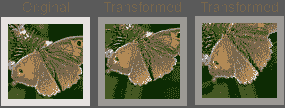**

## **设置文件夹结构**

**我们需要将这些图像存储在特定的文件夹结构中。因此，我们可以使用方法 flow_from_directory 来扩充图像并创建相应的标签。该文件夹结构需要如下所示:**

*   ******列车******
*   **梅尼洛·尤里蒂纳**
*   **0.jpg**
*   **1.jpg**
*   **…**
*   **pyronia_tithonus**
*   **0.jpg**
*   **1.jpg**
*   **…**
*   ******验证******
*   **梅尼洛·尤里蒂纳**
*   **0.jpg**
*   **1.jpg**
*   **…**
*   **pyronia_tithonus**
*   **0.jpg**
*   **1.jpg**
*   **…**

**为了创建这个文件夹结构，我创建了一个要点 [img_train_test_split.py](https://gist.github.com/bertcarremans/679624f369ed9270472e37f8333244f5) 。请随意在您的项目中使用它。**

## **创建发电机**

**和以前一样，我们为训练生成器指定配置参数。验证图像将不会被转换为训练图像。我们只划分 RGB 值，使它们变小。**

**flow_from_directory 方法从 train 或 validation 文件夹中获取图像，并生成 32 个转换图像的批次。通过将 class_mode 设置为“二进制”,基于图像的文件夹名称创建一维标签。**

```
**`train_datagen = ImageDataGenerator(
    rotation_range = 40,
    width_shift_range = 0.2,
    height_shift_range = 0.2,
    rescale = 1./255,
    shear_range = 0.2,
    zoom_range = 0.2,
    horizontal_flip = True)
validation_datagen = ImageDataGenerator(rescale=1./255)
train_generator = train_datagen.flow_from_directory(
    'data/train',
    batch_size=32,
    class_mode='binary')
validation_generator = validation_datagen.flow_from_directory(
    'data/validation',
    batch_size=32,
    class_mode='binary')`**
```

## **不同的图像尺寸呢？**

**Flickr API 允许您下载特定大小的图像。然而，在实际应用中，图像大小并不总是恒定的。如果图像的纵横比相同，我们可以简单地调整图像的大小。否则，我们可以裁剪图像。不幸的是，很难在保持我们想要分类的对象完整的同时裁剪图像。**

**Keras 可以处理不同大小的图像。配置模型时，可以在 input_shape 中不指定宽度和高度。**

```
**`input_shape=(3, None, None)  # Theano
input_shape=(None, None, 3)  # Tensorflow`**
```

**我想展示的是，它可以处理不同大小的图像，然而，它有一些缺点。**

*   *并非所有层(如展平)都将“无”作为输入尺寸*
*   *运行起来计算量可能很大*

# *构建深度学习模型*

*在本文的剩余部分，我将讨论卷积神经网络的结构，并用我们的 butterfly 项目中的一些例子来说明。在本文的最后，我们将有我们的第一个分类结果。*

## *卷积神经网络由哪几层组成？*

*当然，您可以选择将多少层及其类型添加到您的卷积神经网络(也称为 CNN 或 convnet)。在这个项目中，我们将从以下结构开始:*

*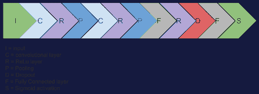*

*让我们了解每一层的作用，以及我们如何用 Keras 创建它们。*

## *输入层*

*这些不同版本的图像通过几次变换进行了修改。然后，这些图像被转换成数字表示或矩阵。*

*该矩阵的尺寸将是宽度 x 高度 x(颜色)通道数 **。** 对于 RGB 图像，通道数量为三个。对于灰度图像，这等于 1。下面你可以看到一个 7×7 的 RGB 图像的数字表示。*

*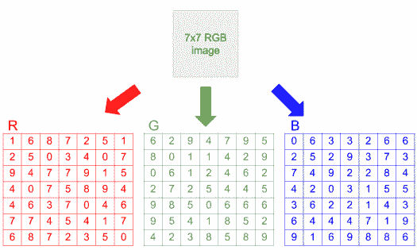*

*由于我们的图像大小为 75×75，我们需要在添加第一个卷积层时在 input_shape 参数中指定。*

```
*`cnn = Sequential()
cnn.add(Conv2D(32,(3,3), input_shape = (3 ,75 ,75)))`*
```

## *卷积层*

*在第一层，卷积神经网络将寻找较低层次的特征，如水平或垂直边缘。我们在网络中走得越远，它将寻找更高级的特征，例如蝴蝶的翅膀。但是，当它只获得数字作为输入时，它如何检测特征呢？这就是过滤器发挥作用的地方。*

## *过滤器(或内核)*

*您可以将滤镜想象为扫描图像的特定大小的探照灯。下面的过滤器示例具有 3x3x3 的尺寸，并且包含将检测垂直边缘的权重。对于灰度图像，尺寸应该是 3x3x1。通常，过滤器的尺寸小于我们要分类的图像。通常使用 3×3、5×5 或 7×7。第三维应该总是等于通道的数量。*

*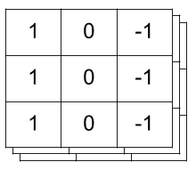*

*扫描图像时，会转换 RGB 值。它通过将 RGB 值与滤镜的权重相乘来实现这种转换。最后，相乘后的值在所有通道上求和。在我们的 7x7x3 图像示例和 3x3x3 滤镜中，这将导致 5x5x1 的结果。*

*下面的动画演示了这种卷积运算。为简单起见，我们只在红色通道中寻找垂直边缘。因此，绿色和蓝色通道的权重都等于零。但是您应该记住，这些通道的乘法结果会添加到红色通道的结果中。*

*如下所示，卷积层将产生数值结果。当您有较高的数字时，这意味着过滤器遇到了它正在寻找的特征。在我们的例子中，垂直边缘。*

*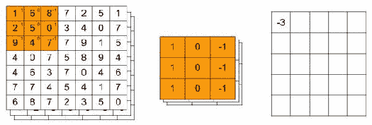*

*我们可以指定想要一个以上的过滤器。这些过滤器可以在图像中寻找它们自己的特征。假设我们使用 32 个大小为 3x3x3 的过滤器。在我们的示例中，所有过滤器的结果叠加在一起，最终得到一个 5x5x32 的体积。在上面的代码片段中，我们添加了 32 个大小为 3x3x3 的过滤器。*

## *进展*

*在上面的例子中，我们看到过滤器一次向上移动一个像素。这就是所谓的跨步。我们可以增加过滤器上移的像素数量。增加步幅将更快地减小原始图像的尺寸。在下面的示例中，您可以看到滤镜如何以步长 2 移动，这将导致 3x3x3 滤镜的 3x3x1 结果和 7x7x3 图像。*

*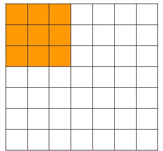*

## *填料*

*通过应用过滤器，原始图像的尺寸迅速减小。尤其是图像边缘的像素在卷积运算中只使用一次。这导致了信息的丢失。如果要避免这种情况，可以指定填充。填充会在图像周围添加“额外像素”。*

*假设我们在 7x7x3 图像周围添加一个像素的填充。这产生了 9x9x3 的图像。如果我们应用一个 3x3x3 的过滤器，步长为 1，我们最终得到 7x7x1 的结果。因此，在这种情况下，我们保留原始图像的尺寸，外部像素被多次使用。*

*您可以计算具有特定填充和步长的卷积运算的结果，如下所示:*

*****1 + [(原始维度+填充 x 2 —过滤维度)/步幅大小]*****

*例如，假设我们有这样的 conv 层设置:*

*   *7x7x3 图像*
*   *3x3x3 过滤器*
*   *1 个像素的填充*
*   *2 像素的步幅*

*这将得出 1+[(7+1 x 2–3)/2]= 4*

## *为什么我们需要卷积层？*

*使用 conv 图层的一个好处是要估计的参数数量要少得多。比普通隐藏层低得多。假设我们继续使用 7x7x3 的示例图像和 3x3x3 的滤镜，没有填充，步幅为 1。卷积层将有 5x5x1 + 1 个偏差= 26 个权重要估计。在隐层中具有 7x7x3 输入和 5x5x1 神经元的神经网络中，我们将需要估计 3.675 个权重。想象一下，当你有更大的图像时，这个数字是多少…*

## *图层继电器*

*或者整流线性单元层。这一层增加了网络的非线性。卷积层是线性层，因为它将滤波器权重和 RGB 值的乘积相加。*

*对于所有 x <= 0 的值，ReLu 函数的结果等于零。否则，它等于 x 的值。Keras 中添加 ReLu 层的代码是:*

```
*`cnn.add(Activation(‘relu’))`*
```

## *联营*

*为了进一步降低维度，池化聚合了输入量。这加快了计算时间，因为要估计的参数数量减少了。除此之外，通过使网络更加健壮，它有助于避免过拟合。下面我们举例说明最大池的大小为 2×2，步幅为 2。*

*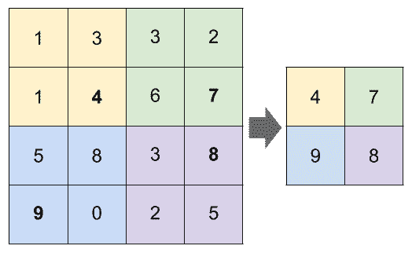*

*Keras 中添加大小为 2×2 的池的代码是:*

```
*`cnn.add(MaxPooling2D(pool_size = (2 ,2)))`*
```

## *全连接层*

*最后，convnet 能够检测输入图像中的更高级特征。然后，这可以作为全连接层的输入。在此之前，我们将展平最后一个 ReLu 层的输出。展平意味着我们把它转换成一个矢量。然后向量值被连接到完全连接层中的所有神经元。为了在 Python 中做到这一点，我们使用了以下 Keras 函数:*

```
*`cnn.add(Flatten())        
cnn.add(Dense(64))`*
```

## *拒绝传统社会的人*

*就像合用一样，辍学可以帮助避免过度适应。在模型训练期间，它随机将输入的指定部分设置为零。辍学率在 20%到 50%之间被认为是有效的。*

```
*`cnn.add(Dropout(0.2))`*
```

## *乙状结肠激活*

*因为我们想要产生图像是两种蝴蝶物种之一的概率(即二元分类)，所以我们可以使用 sigmoid 激活层。*

```
*`cnn.add(Activation('relu'))
cnn.add(Dense(1))
cnn.add(Activation( 'sigmoid'))`*
```

## *卷积神经网络在蝴蝶图像中的应用*

*现在我们可以定义完整的卷积神经网络结构，如本文开头所示。首先，我们需要导入必要的 Keras 模块。然后，我们可以开始添加我们上面解释的层。*

```
*`from keras.models import Sequential
from keras.layers import Conv2D, MaxPooling2D
from keras.layers import Activation, Flatten, Dense, Dropout
from keras.preprocessing.image import ImageDataGenerator
import time
IMG_SIZE = # Replace with the size of your images
NB_CHANNELS = # 3 for RGB images or 1 for grayscale images
BATCH_SIZE = # Typical values are 8, 16 or 32
NB_TRAIN_IMG = # Replace with the total number training images
NB_VALID_IMG = # Replace with the total number validation images`*
```

*我做了一些额外的参数明确的 conv 层。这里有一个简短的解释:*

*   *kernel_size 指定过滤器的大小。因此，对于第一个 conv 层，这是 2×2 的大小*
*   *padding = 'same '表示应用零填充，这样原始图像大小将被保留。*
*   *padding = 'valid '意味着我们不应用任何填充。*
*   *data_format = 'channels_last '只是为了指定在 input_shape 参数中最后指定颜色通道的数量。*

```
*`cnn = Sequential()
cnn.add(Conv2D(filters=32, 
               kernel_size=(2,2), 
               strides=(1,1),
               padding='same',
               input_shape=(IMG_SIZE,IMG_SIZE,NB_CHANNELS),
               data_format='channels_last'))
cnn.add(Activation('relu'))
cnn.add(MaxPooling2D(pool_size=(2,2),
                     strides=2))
cnn.add(Conv2D(filters=64,
               kernel_size=(2,2),
               strides=(1,1),
               padding='valid'))
cnn.add(Activation('relu'))
cnn.add(MaxPooling2D(pool_size=(2,2),
                     strides=2))
cnn.add(Flatten())        
cnn.add(Dense(64))
cnn.add(Activation('relu'))
cnn.add(Dropout(0.25))
cnn.add(Dense(1))
cnn.add(Activation('sigmoid'))
cnn.compile(loss='binary_crossentropy', optimizer='rmsprop', metrics=['accuracy'])`*
```

*最后，我们编译这个网络结构，并设置损失参数为 binary_crossentropy，这对于二进制目标是很好的，并使用准确度作为评估度量。*

*在指定了网络结构之后，我们为训练和验证样本创建生成器。在训练样本上，我们应用如上所述的数据扩充。对于验证样本，我们不应用任何增强，因为它们仅用于评估模型性能。*

```
*`train_datagen = ImageDataGenerator(
    rotation_range = 40,                  
    width_shift_range = 0.2,                  
    height_shift_range = 0.2,                  
    rescale = 1./255,                  
    shear_range = 0.2,                  
    zoom_range = 0.2,                     
    horizontal_flip = True)
validation_datagen = ImageDataGenerator(rescale = 1./255)
train_generator = train_datagen.flow_from_directory(
    '../flickr/img/train',
    target_size=(IMG_SIZE,IMG_SIZE),
    class_mode='binary',
    batch_size = BATCH_SIZE)
validation_generator = validation_datagen.flow_from_directory(
    '../flickr/img/validation',
    target_size=(IMG_SIZE,IMG_SIZE),
    class_mode='binary',
    batch_size = BATCH_SIZE)`*
```

*使用生成器上的 flow _ from _ directory*方法，我们可以轻松地遍历指定目录中的所有图像。**

**最后，我们可以在训练数据上拟合卷积神经网络，并用验证数据进行评估。模型的最终权重可以被保存并在以后重用。**

```
**`start = time.time()
cnn.fit_generator(
    train_generator,
    steps_per_epoch=NB_TRAIN_IMG//BATCH_SIZE,
    epochs=50,
    validation_data=validation_generator,
    validation_steps=NB_VALID_IMG//BATCH_SIZE)
end = time.time()
print('Processing time:',(end - start)/60)
cnn.save_weights('cnn_baseline.h5')`**
```

**历元的数量被任意设置为 50。一个时期是向前传播的循环，检查误差，然后在向后传播期间调整权重。**

**steps_per_epoch 设置为训练图像的数量除以批量大小(顺便说一下，双除法符号将确保结果是整数而不是浮点数)。指定大于 1 的批处理大小将加快进程。validation_steps 参数同上。**

## **结果**

**运行 50 个纪元后，我们的训练精度为 0.8091，验证精度为 0.7359。所以卷积神经网络仍然遭受相当多的过拟合。我们还看到验证的准确性变化很大。这是因为我们有一小组验证样本。最好每轮评估都做 k 倍交叉验证。但这需要相当长的时间。**

**为了解决过度拟合问题，我们可以:**

*   **增加辍学率**
*   **在每一层应用下降**
*   **查找更多培训数据**

**我们将研究前两个选项并监控结果。我们第一个模型的结果将作为基线。在应用额外的漏失层并增加漏失率后，模型的过度拟合程度会有所降低。**

**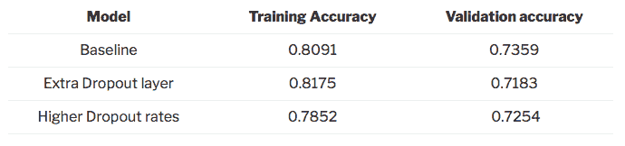**

**我希望你们都喜欢读这篇文章，并且学到了一些新的东西。完整代码可在 [Github](https://github.com/bertcarremans/Vlindervinder) 上获得。干杯！**