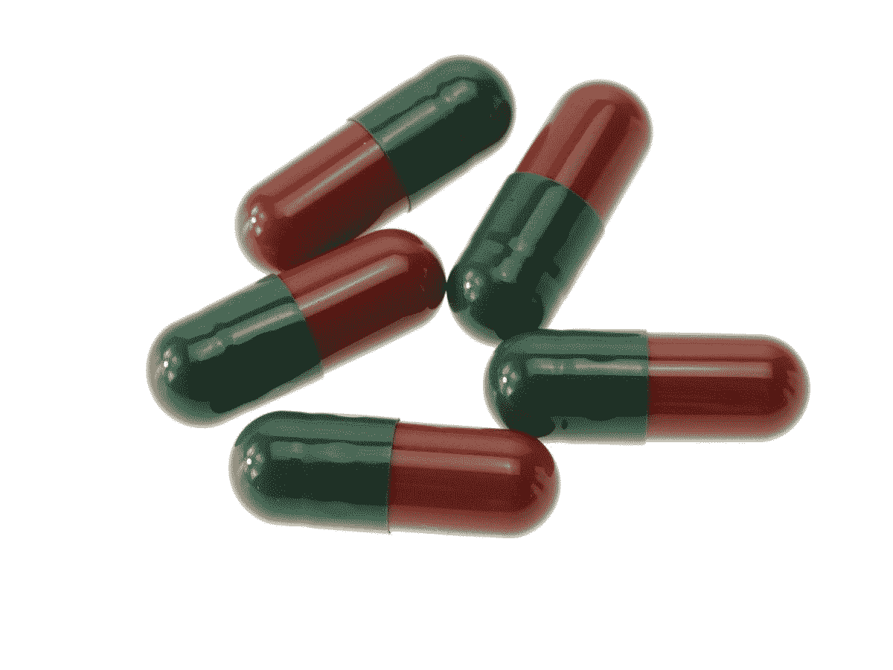
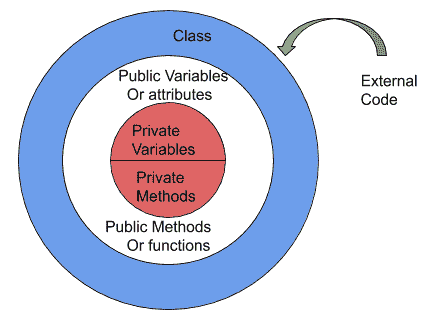
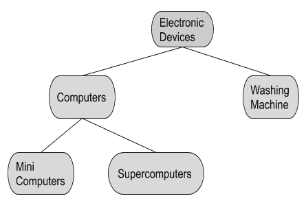

# 面向对象编程概念:如何用对象从零到一

> 原文：<https://www.freecodecamp.org/news/object-oriented-concepts/>

面向对象编程是最广泛使用的编程范例之一。名字本身就定义了它的工作方式。“面向对象”——对象扮演着重要的角色。操作对象并获得结果是面向对象编程的最终目标。

使用面向对象编程范例的语言被称为面向对象编程语言。它们大多是高级语言，如

1.  Java 语言(一种计算机语言，尤用于创建网站)
2.  C#
3.  Python 是一种脚本化/结构化和面向对象的语言

为了在面向对象编程中编程，使用了称为“**面向对象概念**的概念。这些概念简化了&给面向对象编程增加了更多的价值。

这些概念是

1.  包装
2.  抽象
3.  多态性
4.  遗产

在进入这些概念之前，我们需要了解类和对象。

对象是 OOP 中的基本运行时实体。在我们的日常生活中，我们看到许多物体，如电视、手机、狗、人类、汽车&其他生物和非生物。这些可以在 OOP 中被描绘成对象。

**类**是一个蓝图或原型，它定义了某种类型的所有对象共有的变量/属性和方法/函数。这是一个逻辑组件。

简单的说，Class 就是一个**用户自定义的**数据类型。对象是一个类的**变量**。一旦创建了类，我们就可以创建任意多的对象。

例如，以一个名为 Tree 的类为例。树类的状态/属性是:

*   树的名称
*   树的年龄
*   树的类型
*   树的高度

状态/属性用于定义对象的属性。

也就是说，**状态/属性/属性**都代表同一个东西。

树的行为可以是:

*   结出果实
*   树叶掉落
*   从根部向上部吸收水分
*   创建阴影

那么，芒果就是一个类树的变量。我们可以通过创建一个 Mango 对象来存储和检索我们为类树定义的所有属性和行为。

从类树创建 Mango 对象的语法:

**树**芒果；

### 包装

你曾经使用过被彩色外壳包裹的药片/药物吗？

Medicines are encapsulated & placed inside the tablet

药物被安全地保存在里面。我们用肉眼找不到任何东西。要看里面是什么，我们需要打开盖子....

同样，所有的**数据成员(变量，属性/特性)** & **行为(函数/方法)**都聚集在一起并关闭。类是封装的最好例子。

举个例子，

你要去药房给你买处方药。你把处方交给药剂师，然后他/她会从商店拿药，并给你账单。

在这种情况下，

药物——作为变量、属性或特征

药剂师——作为会员职能/方法，他/她帮助给你开药

您-外部应用程序或其他软件代码

通过使用封装，**数据可以被限制**不被外界使用。类中定义的函数只能访问属性。这可以在实现阶段定义。程序员可以在开发时定义和指定成员变量的可访问性，而不是像在过程语言中那样将所有变量都变成全局变量。这种对可访问性的控制也被称为**信息隐藏**。

封装**允许暴露必要的东西，对外界隐藏重要的东西**。所以，一个类的隐藏部分就像**封装** &一样，暴露部分就像**抽象**一样。

### 抽象

暴露一个类**的必要特性而不解释太多或细节**是通过抽象完成的。

今天早上，我想泡一杯热茶，我用水壶烧水。我刚打开按钮上的**开始烧水。我不想知道水壶的内部工作流程，它有很高的电阻，电阻产生热量并煮沸水。相反，我必须轻松地完成我的工作。因此，按下这个按钮来烧水被称为抽象。**

同样，我们可以使用遥控器，通过遥控器上的简单按键来操作电视。

**数据抽象**是一种编程技术，依赖于**接口**和**实现**的分离。

当使用 OOP 编码时，这种数据抽象可以通过使用 2 个不同的类来存档

1.  抽象类:(0-100)%抽象
2.  接口类:100%抽象

### 遗产

这个词本身描述了它的功能。每个人从出生起就有他们的遗传素质。你可能从出生时就有你祖父母/父母的品质。这就是 OOP 中继承的作用。

一个类可以有其父类的属性和方法。此外，该类也可以有自己的属性和方法。父类被称为**基类**。继承基类的类称为**派生类**。继承是 OOP 最强大的特性。

通过有效地使用继承，我们可以节省大量时间并减少程序中的错误。这导致我们**提高工作质量**和**生产率**。

有不同类型的继承

1.  单一遗传
2.  分层继承
3.  多重遗传
4.  多层次继承

### 多态性

多态性是一个希腊语术语，指的是采用多种形式/重载的能力。

比方说，我们都知道编程中的**函数**。他们在括号里有不同的参数。多态不过是用相同的函数名，传递不同的参数来得到结果。

例如:-名为 sum 的函数可以有 2 个或 3 个参数。

sum(3，4) sum(10，23，56)
通过提供适当数量的参数来调用这些函数，将根据被调用函数的设计给出结果。

***在上述场景下，程序如何区分需要执行哪个功能？***

OOP 中有一个特性叫做**动态绑定**。这将根据程序执行情况调用实际函数。当程序运行带有两个参数的函数时，编译器也采用两个参数的函数来执行带有三个参数的程序。

直到运行时，编译器才确切知道需要调用哪个函数。这取决于程序调用函数名的方式。这也被称为**后期绑定。**

### 面向对象概念的使用

*   使用**封装**(信息隐藏)可以对外界隐藏数据
*   通过使用**继承**可以重用代码
*   运算符/方法.函数可以通过使用**多态**来重载。即:相同的功能或操作员姓名可用于多任务
*   数据抽象可以从**抽象**归档。
*   项目迁移很容易(可以从较小的项目转换为较大的项目)
*   对同一项目的工程进行划分
*   可管理的软件复杂性

### OOP 的应用领域

1.  人工智能和专家系统
2.  企业应用
3.  神经网络与并行编程
4.  办公自动化系统

希望你喜欢通过阅读对面向对象概念的简要介绍。我希望在我即将发布的帖子中也能写下我们如何进行面向对象编程。

* * *

请将您对我的文章的反馈发送到 parathan19@gmail.com

[LinkedIn](https://www.linkedin.com/in/parathantl/) | [Twitter](http://twitter.com/parathantl)