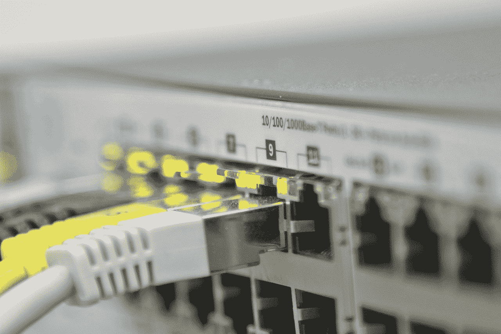

# 思科会成为 AWS 的下一个拦路虎吗？

> 原文：<https://www.freecodecamp.org/news/will-cisco-be-the-next-roadkill-for-aws/>

我没有密切跟踪，但感觉亚马逊网络服务(AWS)最近颠覆了一个主要的技术行业，这已经过去几个月了。但凭借他们所有的资源和市场力量，我敢肯定，无论亚马逊总部在哪里，现在总会有一些有趣的东西在厨房里烹饪。

所以让我把我的纯粹推测性的预测抛到脑后。正如我在我的[在一个月的午餐书中学习 AWS](https://www.manning.com/books/learn-amazon-web-services-in-a-month-of-lunches?a_aid=bootstrap-it&a_bid=1c1b5e27&chan=medium)所描述的，AWS 已经愉快地用 EC2 取代了您的服务器机房，用 S3 取代了您的 SAN 和 NAS，用 Redshift 取代了您的数据仓库，用 RDS(和 Aurora)取代了您的数据库。他们还发明了全新的部署模式:例如，礼貌地通知你，你只需通过无服务器功能(Lambda)提供你的移动应用。

那么下一步是什么？那么企业路由呢？

## 如今什么是企业路由？

几十年来，大型组织一直通过由专有操作系统配置的交换机和路由器来控制其内部网络流量。硬件非常昂贵(单个设备很容易达到 10，000 美元)，雇佣训练有素的管理员来维护硬件的成本可能会高得多。

但所有这些真的还有必要吗？

如今，您的工作负载更有可能位于云中，而不是您的实际办公室中。甚至内部的物联网设备也可以很容易地从云中控制，例如使用 [AWS IoT](https://aws.amazon.com/iot/) 。我猜大多数现代内部企业路由涉及控制人们如何连接到生产资源以及如何相互连接(电子邮件、VOIP、视频)——但即使是这样，也越来越有可能外包给 SaaS 解决方案。

我可能遗漏了一些东西，但我在这里没有看到硬件交换机的令人信服的案例。软件定义的网络(SDN)应该可以轻松完成这项任务。为什么不在您的校园中覆盖无线接入点，使用 Kerberos 或 Active Directory 对用户进行身份验证，并配置您的权限/连接完善方式。

## AWS 如何统治路由世界？

这让我又回到了 AWS。他们已经为认证( [AWS 目录服务](https://aws.amazon.com/directoryservice/))和高端远程连接( [AWS 直接连接](https://aws.amazon.com/directconnect/))打下了基础。他们可能不需要花太多时间就能把网络扩展到你的校园。也许他们会允许你创建本地[VPC](https://aws.amazon.com/vpc/)——包括可配置的子网——用来组织你的本地基础设施。

我想象着一家公司的管理员登录 AWS 控制台，让几名市场部的新员工加入进来。他们将被添加到 AWS IAM“营销”组，该组已经可以访问 Amazon QuickSight 仪表盘和来自运行在 EC2 上的面向公众的 web 服务器的流数据。但是，该组织可以很容易地被配置为允许其成员进入数据库，由于监管原因，必须保持本地。

你怎么想呢?专有系统网络管理员的日子屈指可数了吗？

*寻找更多？你可能会喜欢我的关于 Linux、AWS 和 Docker 相关主题的* [*书籍和 Pluralsight 课程*](https://bootstrap-it.com/) *。*