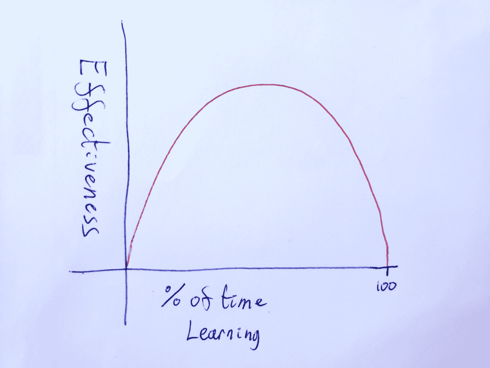

# 有史以来最好的策略来解开辉煌的想法

> 原文：<https://www.freecodecamp.org/news/stop-trying-to-be-so-productive-and-become-productive/>

#### 为什么我们认为时间优化是完全错误的

技术已经彻底改变了我们的生活方式。我们开始意识到像 facebook 和 twitter 这样的应用程序对我们造成的伤害。我们知道无限卷轴是我们不应该参与的事情。

我喜欢把我的手机变成一个没有社交媒体的设备。然后我更进一步，取消了“一个月”挑战的电子邮件。挑战开始两周后，我甚至不再考虑挑战，我的手机只是一个不再收发电子邮件的设备。这太棒了，我的口袋里没有一个 24/7 都在和我说话的人的待办事项列表。我感到奇怪的是，我曾经想要那样，或者为自己是一个如此多产的人而感到自豪。不管怎样，这不是这篇博客的内容。

“寓教于乐”的辉煌崛起，伴随着奇妙的播客和听有声读物的能力，这不是我们真正仔细研究过的。但值得调查。我会解释为什么使用你的手机进行教育也应该受到限制。你的创造力和心理健康会开花结果，你会为此感谢我的。这篇博客将讲述为什么限制教育时间会让你成为一个更聪明、更快乐的人。

## 极端的例子

与你的效率相比，你应该花多少时间学习和消费新内容是有比例的。简单来说，这是显而易见的。

如果你花 0%的时间去研究或学习任何东西，你将一无所知。你将一事无成。

反过来，如果你把 100%的时间花在学习和研究上。根本没有时间去想点子或做任何事情。你会是一个非常聪明但同样无用的实体。人类的净流失。没有人希望这样。尤其是你。

## 现代问题

然而，在现代社会，我们被越来越多的海量信息所包围，我们永远也跟不上。我们还被能够以低成本的方式向我们提供这些信息的技术所包围。我们可以在任何空闲时间立即投入到学习中。当你走路去上班、做饭或去健身房时，忽略脸书和其他社交媒体的干扰，播放播客，你会觉得很明智。午休的时候可以看教育视频。这些都有助于在你跟不上的大量信息中做出微小的让步。

但是，处理这些信息并建立联系、有想法或使用这些信息的时间在哪里？

## “寓教于乐”和插入式教学的论点

如果你正在学习，建立一个企业，或试图留在你的领域的顶端，你不想错过机会。你想利用大量的停滞时间来学习更多的东西。

一天中有如此多的时间来消耗音频和视频上的大量有用信息。它可以让你对你的领域有不同的看法，或者帮助你了解新事物的复杂想法。你甚至可以通过听小说来了解人类。它告诉你如何创造一个好故事或坏故事，当你在寻找爱情时，你甚至可以从《五十度灰》中了解爱情。

不利用所有额外的时间去学习，你就不太可能成为你所在领域的变革者。

## 在你按播放键之前

在优化你的生活以学习新东西和用空闲的大脑度过业余时间之间有一个快乐的中间点。很难找到确切但至关重要的。

就像无尽的社交媒体卷轴一样，我们也有无限的教育娱乐卷轴。我根据推荐列出了今年要读的书的清单，6 个月下来已经有 350 本了，我确信它们都非常棒。一个十分钟的会话，在我的播客订阅中很容易就能让我找到 100 个新的播客。我收到了一系列令人惊叹的博客的轰炸，这些博客增长了我的思维，科学记者和报纸产生了精彩的内容。然后还有政治、经济，当然还有新闻。更别提 BBC、Youtube 和网飞网站上的精彩内容了。

我们觉得我们需要跟上它。当你开始步行去上班时，你没有在听或者做什么，你的大脑可以自由地漫游。什么都不做让人感觉效率低下，你可以用现成的寓教于乐的方法立即解决这个问题，并且不断地感到富有成效。

#### 无所事事的未知价值

什么都不做并不能立即提高生产力。你永远不会*知道*如果你在接下来的 20 分钟步行中什么都不做，你会有好主意。让你的大脑保持平静，就像扬帆驶向未知，可能没有任何回报，这一切看起来非常无聊，毫无意义。

我们需要训练我们的大脑不要要求即时的满足，这种需要做某事的感觉是大脑运转的动力。如果你允许的话，它可以触发大脑自己做一些很棒的事情。如果你听到大脑想要做某件事的触发信号，并且只是坚持听别人的想法，那么你是在关闭你的大脑，而不是激活它。

我要直言不讳地说，你这是在往自己的篝火上撒尿，而不是火上浇油。

你需要学会喜欢那种大脑未被占据的感觉，拥抱它，而不是迅速找到抑制它的方法。你需要认识到大脑天生渴望做酷的事情。让你的大脑像你的播客告诉你的那样，与世界上的问题搏斗。

## 身体类似物

#### 锻炼你的大脑

如果每次你开始感到有点喘不过气来时，有人让你坐下来，为你做一切事情，你就不健康了。你根本得不到锻炼。这对你的身体非常不健康，会产生一个降的反馈循环，甚至从椅子上站起来都会开始挑战你。你将永远不会使用你的肌肉，那会浪费掉。你将无法行走，变成一个卧床不起的无用之人。

我要问你自己的问题。一旦你的大脑要自己做一些工作，你应该坐下来让它休息吗？

#### 过度喂食

如果你整天被糖果和饼干包围着，你会不断地想起可以吃的食物。如果每次你有一个念头，也许你可以吃一块饼干，然后你就吃了一块，你就会变得肥胖。

人类生来就有能力在有食物的时候暴饮暴食。这可以防止它在没有食物的时候挨饿。为了保持健康，人类需要在有食物时停止进食的固有行为。

我们现在生活在口袋里的设备不断提醒我们可以学习更多的东西。我们的大脑被设计来感受满足饥饿的需要。我们的大脑习惯于低信息量的环境。它是在一个没有书籍的时代设计的，偶尔你会在你的环境中发现一些新的东西，你会对它进行调查。如果一旦某人带来了任何消息，你会听着，就好像你的生命取决于此，因为有时确实如此。

因此，你的大脑想要了解周围环境中的每一个新事物，以保持与时俱进，以免被扼杀。

这是一种强大的天生行为，经过优化可以让你的基因传给下一代。你今天存在的原因直接是因为你的祖先比他们的同龄人更擅长痴迷于他们环境中的新事物。

然而，如果你不了解每一个新事物，现代世界不会杀了你。就像食物一样，如果你让你的大脑按照默认行为运作，它会让你非常不健康。你需要停止尝试学习一切。

## 什么是“高效”

我们需要知道什么都不做实际上是在做一些事情。你的大脑正在建立联系，当你在没有其他事情发生的情况下做一些事情，如冥想、体力劳动或锻炼时，你的大脑会产生最好的想法。你需要学会倾听自己内心的声音，并与之成为好朋友。

#### 集中思维与分散思维

在学习科学中，你需要花时间在新的材料上来理解事物。但是，当你停止思考它，让大脑进入一种“分散”的思维模式，在不同的想法之间建立联系时，神奇的事情就发生了。这就是 AirBnB 和优步等价值数十亿美元的想法的来源，它们将大脑中两种不同的知识整合成一个新颖的概念。当你处于专注模式时，这是不会发生的。

#### 学习与评级

如果你试着回忆一本书或播客，你会比仅仅听一遍学到更多。然而，疯狂的是，我们大多数人只消费了一次这些东西，然后就再也不去吃了。我们很快就会忘记所有的细节，如果我们还记得的话，我们可以模糊地记得当时的感受。因此，你基本上只是通过优化所有这些消费时间，在你的头脑中创造了一堆评级。

如果你在每个播客或书的章节后花些时间思考你刚刚学到的东西，并测试自己为什么它有用，你会真正从中获得两倍的收获。这需要 5 分钟，但它的效果是你刚刚听了一个小时的两倍。

#### 生活处理

然后，在你的生活中，你正在学习和处理的其他事情也需要自己的处理时间。如果你不花时间去思考正在发生的事情，并从中学习和如何改进，那么令人惊讶的是，你不会从中学习或改进。像写日记这样的工具可以从根本上提高你的进步速度，并有益于你的快乐和幸福水平。

## 游戏时间

想象一下，你正在工作，出于某种奇怪的原因，一个蹒跚学步的孩子不知从哪里冒出来，想和你一起玩。它想去散步，看花，在水坑里跳。*(或者以我自己的经验，看水坑，跳花丛)*。然后它问一些很难回答的烦人的事情:
*“为什么天空是蓝色的？*
*为什么意大利面不健康，烤豆健康，它们长在一棵树上？*
*然后，如果不是为了跳进去，为什么有人会首先关心花呢？”*

它想探索这个世界，它似乎想探索你的思想，把事情联系起来。不幸的是，这对你没有任何帮助，所以你给它一个 iPad，希望它占据自己的空间，不会打扰你。

这种希望完成更多工作的分散注意力的技巧就是你对自己大脑所做的。当你内心的声音突然出现，让你知道你什么也没做，你意识到你有一些空闲时间。你会觉得自己可以通过坚持播客*来“工作”。否则你的大脑只会做一些无意义的事情，你会有一大堆事情要做。*

*当你这样做的时候，你正在关闭你的真实意识。是的，当你第一次倾听你的意识时，它会做一些相当愚蠢的事情，因为它探索了环境和你的思想的内容。有时它是一只爱发牢骚的母狗，有时它对错误的事情念念不忘。但是如果你让它到处玩，听它说话，认真对待它，它会回报你的。让它探索环境，让它探索你的思想内容，就像蹒跚学步的孩子一样，它会学到深刻的东西。*

*

This isn't a toddler but I saw a puppy and then it magically ended up here for no sensible reason* 

## *改变你的想法*

*当有空闲的时候，你开始为自己考虑一秒钟，你需要听到你内心的声音，说 *:**

**“开枪。你好我。哇，能有时间在一起真是太好了。怎么了，伙计。让我们聊聊**

*代替当前的 *:**

**“开枪。我希望能完成工作。让我们给你一些事情做。这样我就可以继续工作了**

*你内心的声音不是一个和你毫无共同之处的蹒跚学步的孩子。这不是你一天中需要逃离的巨大拖累，而是一种可以充分利用的祝福。*

*我们需要停止感觉我们一直在工作，我们需要停止感觉我们内心的声音是一件不好的事情。*

*这很重要，因为你内心的声音不仅仅是你最好的朋友。这是真正的真实的你。你需要去了解它，倾听它，认真对待它。重要的是，你不要再把它当成一件需要分散注意力的可怜的事情。不要在它面前放东西，希望它不会打扰你。*

*找出你真实的想法和了解。探索想法，实际上把有用的想法带到下一个层次。*

### *锻炼时间*

*锻炼和大脑中没有其他事情的结合是好主意的完美滋生地。*

*锻炼非常温和地占据大脑，但给思考留下了很多空间。它还会释放荷尔蒙，让你更积极地思考。这可以防止在你有时间进一步思考之前，任何负面的怀疑阻碍了潜在的好主意。它提供了一个黄金时期，你的大脑可以探索它所知道的随机事物并建立联系。*

*优化你所有的学习锻炼时间，让你的大脑处于一种专注的模式，在这种模式下它永远不会有想法。你必须拔掉插头，让你的大脑思考自己的想法，而不是永远听别人的想法。*

**

## *最低要求*

*根据你目前的情况，有不同的指导方针。正如我在开始时提到的，如果你从不学习有用的东西，你就会落后。我今年读过的 350 本书对我的思维方式产生了不可思议的影响。但是我也发现拔掉插头是我把所有信息放在一起，用它做一些有用的事情。*

*我认为你应该每天有 20 分钟的时间完全和自己保持联系。冥想是聪明的，但是如果你想做瑜伽、散步或烹饪，那真的没关系。这是作为一个人的最低要求。*

## *思考与倾听的比率*

*在满足了最低要求后，我认为争取一个平衡的比例是最好的策略。和两耳一嘴的说法一样。我觉得你三分之二的时间听信息就可以了。但是你应该把三分之一的时间用来思考你自己的想法。*

*这个要看个人，看情况。有时候我觉得我真的什么都不想做，而且我的大脑有太多的想法。有时候有东西听是让我出门跑步的首要原因。但是其他时候，你会被问题压垮，你应该利用所有的时间去思考。*

## *结论*

*根据关于如何学习的最佳研究，给你的大脑不集中的时间是关键。这段时间是创造力和最聪明想法的最终来源。*

*不要让别人的想法分散你的注意力，给自己时间倾听自己的想法。*

*这是一个具有讽刺意味的结论，因为我在运行[成长思维播客](http://www.GrowthMindsetPodcast.com)，我认为这是最好的寓教于乐。希望这能证明除了更好的生活，我并不想卖给你任何东西。这并不是由某种反苹果反亚马逊情结驱动的，而只是我在进化心理学和普通人类学研究中的产物。*(人类观看)*。将一个领域的知识和另一个领域的知识结合在一起并产生想法。*

###### ***效果***

*上周我在特拉维夫，我想去海边跑步和游泳。不想把手机留在沙滩上，我独自跑了一个小时。一个真正的人，身上没有任何装置，在一个它从未到过的城市里跑来跑去。这怎么这么快就变成稀罕事了？(十年前，我开车环游美国，只带了一个指南针...这是有史以来最可爱的早晨之一。我带着比我想象的更多的问题解决方案和写作想法回来了。这看起来很疯狂，我通常把这么多宝贵的时间花在自己身上，让别人的想法永久地分散我的大脑。*

*我不知道我跑了多远，走了多少步，甚至不知道我去了哪里。但这并不重要。我关注的是新的衡量成功的标准，比如富有成效的运行、想法的数量和流汗程度。我打破了两项记录。*

###### ***自问自答***

*我认为我们都应该退后一步，定义一下我们的手机到底是干什么用的。当我们意识到我们心理健康的重要性以及我们的设备给我们带来的问题时，这比以往任何时候都更加重要。我们需要放下 FOMO 来跟上这个世界，花更多的时间和自己在一起。*

*简单来说。没有人会为你着想，解决你的问题。如果你不能独立思考，你就完了。*

**

* * *

#### *相关阅读*

*喜欢这个吗？你可能会喜欢这些以变得更理智为主题的类似帖子:*

*   *[做出更好决策的最佳策略(你没有使用)](https://samwebsterharris.com/blog/top-strategies-for-better-decisions-that-you-probably-arent-using/)* 
*   *[不在任何生活帮榜单上的最佳生活帮](https://samwebsterharris.com/blog/the-best-life-hack-for-2018-that-isnt-on-any-life-hack-list/)*

#### *订阅*

*这将构成五部曲“五部曲”**(学了一个新单词)*的一部分。一定不要错过它的其余部分！**

 **[https://upscri.be/w0rlmr?as_embed=true](https://upscri.be/w0rlmr?as_embed=true)**