# 如何在 YouTube 上开设一个关于编程、软件和技术的频道

> 原文：<https://www.freecodecamp.org/news/how-to-start-a-software-youtube-channel/>

大家好，我是 Beau，我运营着 freeCodeCamp.org YouTube 频道。

在我们频道成立的最初几年，我们的订户不到 10 万。当我们发布新的视频时，如果有一千多人观看，我们会很兴奋。

但是在过去的 18 个月里，我们的用户已经超过了 100 万。freeCodeCamp.org 现在是 YouTube 上最大的活跃软件频道。

那么是什么导致了我们渠道的爆发式增长呢？在本教程中，我将分享我们对 YouTube 的算法和 YouTube 上的观众偏好的见解。我还将分享创建你自己的软件 YouTube 频道的技巧，以及来自各种成功的 YouTube 创建者的建议。即使你是软件新手，你也可以从开办 YouTube 频道中受益匪浅。

freeCodeCamp.org 频道侧重于长期、深入的技术课程。我们自己创建了一些，也和其他 YouTube 创建者一起创建和发布课程。我还会分享用你的 YouTube 频道赚钱的小技巧。

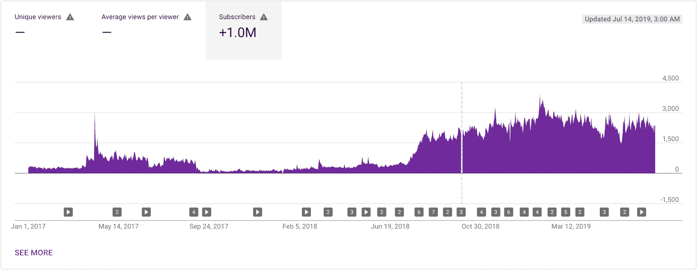

Subscribers analytics for the freeCodeCamp.org channel.

# 我的故事

首先，让我简单地告诉你我的故事。当我试图获得我的第一份软件开发工作时(在为 freeCodeCamp 工作之前)，我能够获得多个工作邀请。我最终接受了一份比我所在城市的初级开发人员平均工资高得多的工作。我相信我成功的最重要的事情之一是创办了一个软件 YouTube 频道。

在我得到第一份软件工作之前，我创建了一个 YouTube 频道(不是 freeCodeCamp 频道),并开始发布 JavaScript 培训视频。我知道我可以指出这一点，这样潜在的雇主就可以看到我知道自己在做什么。

当我面试工作时，他们经常提到我的 JavaScript 视频，作为考虑我的一个原因。一家公司表示，他们很欣赏我创造这些产品的主动性。

我的视频向雇主展示了我是 JavaScript 的权威。但秘密是:我制作视频的许多主题对我来说都是新的。我不得不研究这些话题来制作视频。这个过程帮助我成为一名权威。

实际上，你不必事先对一个主题了解很多，就可以创建一个关于这个主题的教学资源。你只需要有兴趣和学习的欲望。

仅仅把内容发布到世界上通常会带来更多的机会。

在我开始在我的个人 YouTube 频道上发布视频后不久，Quincy Larson(来自 freeCodeCamp)给了我在 freeCodeCamp 频道上发布我的训练视频的机会。

最初是在 freeCodeCamp 做志愿者，最终我被全职雇佣了。

我认为创办一个软件 YouTube 频道可以让每个人受益，不管你处于职业生涯的哪个阶段。

# 如何确定你的 YouTube 频道的目标

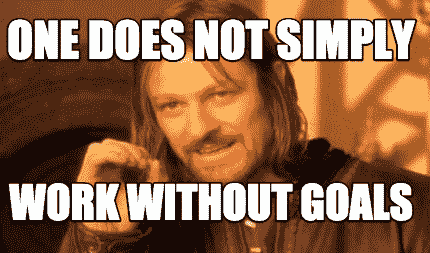

在你开始一个渠道之前，你需要决定你的渠道的目标。您的目标会对您的渠道的许多方面产生影响。

以下是一些共同的目标(并不相互排斥):

*   帮助他人学习
*   建立一个能带来其他职业机会的工作体系
*   给你一个学习的理由
*   推广付费资源
*   通过 YouTube 广告收入、赞助和附属链接赚钱

> “知道你为什么做你正在做的事情是至关重要的。”德里克·西弗斯

当考虑你的频道和你想制作的视频时，如果你想制作一个别人已经做过的主题的视频，不要担心。世界上有很多潜在的观众，可能有一些人能从你独特的风格中学到最好的东西。

我要再次强调这一点，因为它非常重要:你不需要事先知道一个主题来制作一个关于这个主题的视频。一个视频创意是一个很好的学习机会！

# 如何确定你的 YouTube 频道风格

你需要确定 YouTube 频道启动的软件类型。我将软件 YouTube 频道分为四种类型:教程、信息、现场编码和软件娱乐。

一些视频风格比其他风格更能吸引更多的人群。教程的浏览量往往比软件娱乐视频少。

记住你的最终目标是很重要的，这样当你看到其他频道有更多的浏览量时，你就不会气馁。

例如，如果你的频道目标是帮助其他人学习软件开发或帮助推广你的付费软件课程，不要担心你的视频“用 Vue & Ionic 4 构建 PWA”没有其他人的视频“为什么我作为百万富翁不去餐馆吃饭”那么多

我将更详细地介绍不同的软件渠道风格。请记住，一些频道以多种风格的视频为特色，但大多数只有一种主要风格。

### 教程风格的 YouTube 编程视频

这种类型的频道主要以软件教程为特色。如果你想让你的渠道帮你找到工作，或者你想出售付费课程，这是最好的渠道。与其他风格相比，这种风格有时不太注重你的个性。

渠道示例:

*   [freeCodeCamp.org](https://www.youtube.com/freecodecamp)
*   [移动媒体](https://www.youtube.com/traversymedia)
*   [用 Mosh 编程](https://www.youtube.com/programmingwithmosh)
*   德里克·巴纳斯

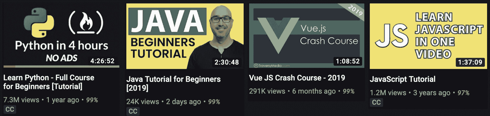

### 信息风格的 YouTube 视频

这种类型的频道有关于软件开发的信息视频。它侧重于软技能和开发人员应该知道的其他信息。视频的标题有“你需要使用的 5 个开发者工具”、“作为 Web 开发者的财务自由”、“2019 年你该不该学 Python？”。

这种类型的频道有时可以获得比教程频道更多的浏览量，并且通常专注于创作者的个性。

渠道示例:

*   [ForrestKnight](https://www.youtube.com/channel/UC2WHjPDvbE6O328n17ZGcfg)
*   [编码阶段](https://www.youtube.com/codingphase)
*   [RealToughCandy](https://www.youtube.com/realtoughcandy)
*   安迪·斯特科维茨

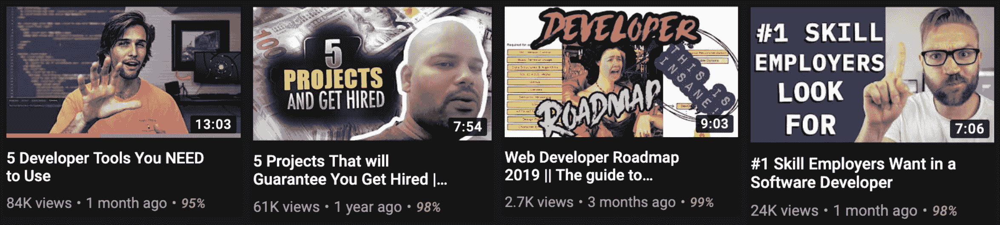

### 现场编码风格的 YouTube 编程视频

这类频道主要以真人编码为特色。观众可以看到创建程序的实际思维过程。它也可以有助于了解现场编码人员如何实时解决问题，尽管有些人非常擅长于此，以至于它看起来像教程频道一样精美(例如，编码列车)。

现场编码对于建立一个社区来说是很棒的，因为你经常可以在一个流中直接与观众交流。

渠道示例:

*   [用 CJ 编码花园](https://www.youtube.com/channel/UCLNgu_OupwoeESgtab33CCw)
*   [编码序列](https://www.youtube.com/thecodingtrain)
*   [杰西·威格尔在 freeCodeCamp.org 频道](https://www.youtube.com/watch?v=VSLMJ2mZx5Y&list=PLWKjhJtqVAbknyJ7hSrf1WKh_Xnv9RL1r)
*   [Bisqwit](https://www.youtube.com/user/Bisqwit)

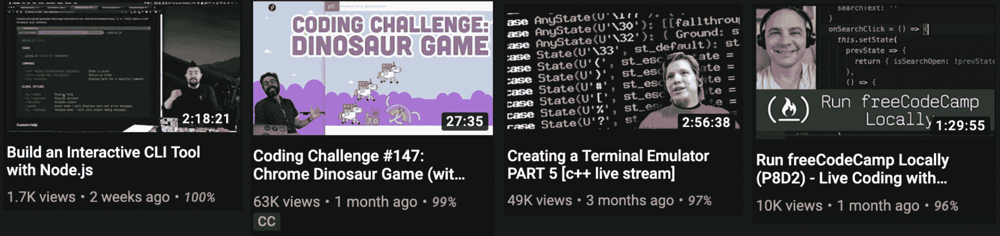

### 软件娱乐风格的 YouTube 视频

这种类型的频道有潜力获得最多的浏览量。创作者使用编程来创建广泛人群感兴趣的项目。视频更关注程序的结果，而不是实际使用的代码。

视频的标题是“当我在堡垒之夜被枪击时，一个机器人向我开枪”，“人工智能学会玩世界上最难的游戏”，“你的姓氏会保留下来吗？”

渠道示例:

*   迈克尔·里维斯
*   [贾布里勒](https://www.youtube.com/channel/UCQALLeQPoZdZC4JNUboVEUg)
*   [代码项目符号](https://www.youtube.com/channel/UC0e3QhIYukixgh5VVpKHH9Q)
*   [CodeParade](https://www.youtube.com/channel/UCrv269YwJzuZL3dH5PCgxUw)

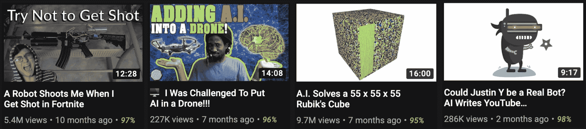

# YouTube 视频初始规划和设置技巧

一旦你决定了你的目标和你想要制作的视频的风格，你应该做一些准备和计划。以下是你必须做的一些事情:

*   为您的 YouTube 频道创建帐户。我建议将您的渠道创建为[品牌账户](https://support.google.com/accounts/answer/7001996)。这允许你在你的个人谷歌账户和你的软件 YouTube 频道之间保持一定的距离。品牌帐户仍然使用你的谷歌帐户登录，所以你不需要跟踪另一个用户名和密码。此外，品牌帐户允许您添加其他人作为经理。
*   确定您的频道名称。我个人推荐使用你的名字作为你的频道名，尽管你会在上面的频道例子中看到许多人成功地使用了其他名字。使用您的名字作为频道名称有助于更好地将您与您的内容联系起来。
*   设计您的[频道图标](https://support.google.com/youtube/answer/2976309)、[频道艺术](https://support.google.com/youtube/answer/2972003)和通用缩略图样式。如果你不是一个好的设计师，可以考虑雇佣一个做设计师的朋友。如果你没有，你可以在 fiverr.com 的[上雇人来设计这些资产。](https://fiverr.com)
*   确定你想要什么样的介绍，如果有的话。如果你使用介绍，它应该是 5 秒或更少。许多人不使用介绍，但它可能有助于个人品牌。
*   考虑一下你还想在你的视频中添加什么东西来使它们与众不同。它可以是一个标志线或道具(像一只猫)。
*   选择上传的频率(参见下面标题为“一致性和具体目标”的部分)

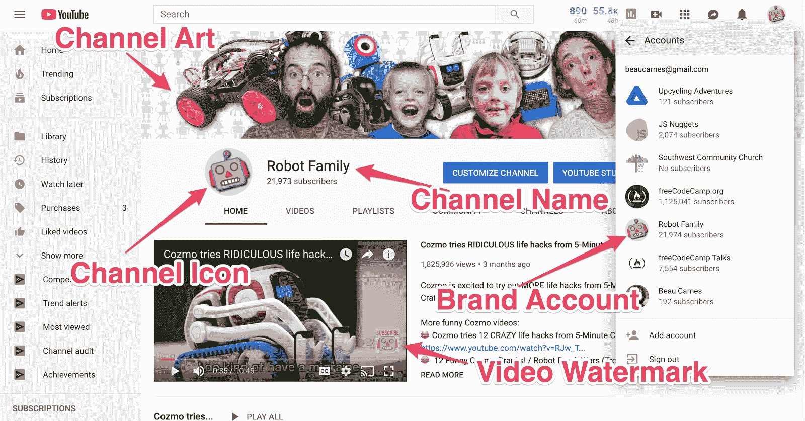

Components of my personal [Robot Family channel](https://youtube.com/robotfamily) (feel free to subscribe).

# YouTube 视频规划和脚本技巧

一旦你为你的渠道做了高层次的规划，是时候开始规划你要制作的具体视频了。

一个好的第一步是头脑风暴。花些时间思考，写出你可能想到的每一个想法。即使是坏主意。然后开始把想法筛选成最好的想法。

你已经写了可以用于视频教程的代码了吗？你过去的软件项目可以成为视频创作的灵感。

一旦你想出一个特定的视频是关于什么的，是时候开始研究了。记住，你不需要事先知道一个主题*来制作一个关于这个主题的视频。但是如果你还不太了解这个话题，你需要做大量的研究和学习，这样你才能让你的视频对观众尽可能有价值。*

你很可能需要为这部视频写一个剧本。如果你正在制作一个编码教程，你将不得不事先为视频编写代码。

# YouTube 录制/编辑技巧

录音时最重要的两件事是:

1.  使用好的麦克风。
2.  如果你在屏幕上显示代码，尽可能的放大。

如果你有糟糕的音频或微小的代码，它会导致人们立即停止观看-甚至在他们看到你视频的真实内容之前。

### YouTube 视频编程音频提示

几乎任何 USB 麦克风都会比你电脑上的内置麦克风好。如果您负担得起，请考虑以下话筒之一:

*   [蓝色雪人麦克风](https://amzn.to/2Fa3k77)
*   [音频技术公司 AT2005USB 麦克风](https://amzn.to/2KjePgC)
*   [蓝色雪球](https://amzn.to/31vH5lO)

如果你买不起麦克风，用手机录音做一些测试。根据你使用的手机和电脑，手机上录制的音频有可能比电脑上的要好。

The 3 mics I listed above.

### 录制节目视频的 YouTube 视频技巧

如果你要在镜头前展示自己，最便宜的方法是使用你电脑的摄像头或手机摄像头。许多手机实际上有相当好的视频质量。

如果你想更上一层楼，可以考虑这些相机(注意:如果你的频道主要由编码教程组成，这些相机可能不是必需的):

*   [佳能 EOS 80D DSLR](https://amzn.to/2F5cFNG)
*   [佳能 EOS Rebel T6 数码单反](https://amzn.to/2WIjv6l)
*   [松下 Lumix FZ80](https://amzn.to/2X5vCdh)

如果你正在制作信息或软件娱乐视频，一个好的相机尤其重要。

The 3 cameras listed above.

### 如何制作 YouTube 编程视频的屏幕录制

如果您使用的是 Windows，有一个快捷键可以开始录制您的屏幕。只需按 Windows 键+ Alt + R。

如果你想在播放视频的同时显示屏幕上的视频，你可以用免费的 [OBS 软件](https://obsproject.com/)来设置。

当您录制屏幕时，请始终确保主要内容在屏幕上占据尽可能多的空间。这可能很难相信，但几乎⅓的人在手机上观看编码教程。所有文本应该尽可能大。你需要一个非常好的理由来显示一个非全屏的窗口。

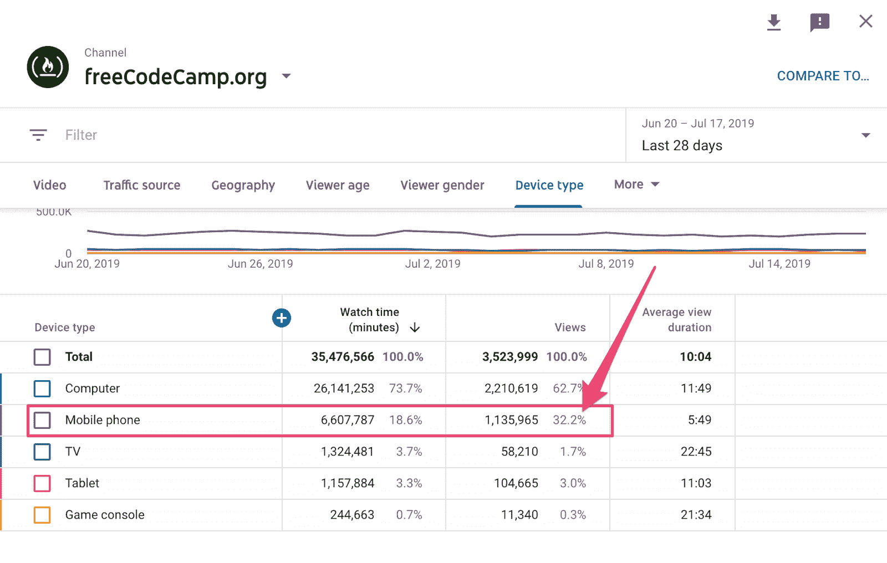

录制教程时，使用两个屏幕会很有帮助。您可以在其中一个屏幕上录制视频，在另一个屏幕上录制脚本和完整的代码。

这是一些人为了让他们的编码教程听起来更加完美而做的一个秘密。首先，记录编码教程。然后，转录你所有的对话，并在转录中做一些小的编辑，以改善流程。

最后，重新录制您的对话，并将其添加到原始屏幕记录中。如果你不去想接下来的教程，会更容易表达和娱乐。

### 如何编辑 YouTube 视频

你也许应该编辑你的视频，让它们更流畅，减少错误。编辑对于信息和软件娱乐视频尤为重要。

使用编辑来移除或减少不需要的声音，如风扇声、咳嗽声和其他会分散观众注意力的噪音。使用编辑软件或插件可以消除持续的嗡嗡声和混响。

对于非常简单的编辑，您可以使用苹果电脑上的 iMovie 或视窗上的影音制作。但是这些项目非常有限。我个人使用 Final Cut Pro，但这有点贵。以下是一些比 iMovie 和影音制作提供更多功能的免费视频编辑器:

*   [开拍](https://www.openshot.org/)
*   [VideoPad](https://www.nchsoftware.com/videopad/)
*   [灯光工程](https://www.lwks.com/)

决定使用什么软件进行编辑后，观看一些教程来了解软件的基本功能。

另一个选择是雇人来编辑你的视频。即使你已经知道如何编辑视频，如果你负担得起，聘请一名编辑可以节省很多时间。

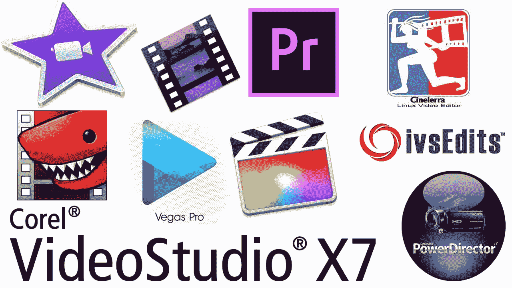

Video editing software logos.

# 如何创建 YouTube 缩略图和标题

你可以拥有世界上最好的视频。但是没有人会发现它，如果他们不点击缩略图。

为了扩大你的渠道，创造高质量的内容是很重要的。但是同样重要的是使用缩略图和标题，让人们点击你的视频。

虽然缩略图对所有 YouTube 视频都很重要，但根据我的经验，它们对软件娱乐频道的影响最大，对教程频道的影响最小。

在开始录制或编写脚本之前选择标题会很有帮助。通过强迫自己首先选择一个标题，你必须有意识地决定视频的重点。当你写剧本的时候，标题可以帮助指导你，这样你就可以专注于传递标题中承诺的价值。

### 如何为你的 YouTube 视频选择标题

对于大多数类型的视频，最好选择人们正在搜索的标题。有两种主要方法可以找到人们在搜索什么:YouTube 搜索自动完成和谷歌趋势。

### YouTube 搜索自动完成

进入 YouTube 搜索框，开始输入与视频主题相关的单词。YouTube 会自动补全其他人搜索的相关单词。这可以让你洞察到你的视频应该以什么为标题，或者制作一个关于什么的视频。

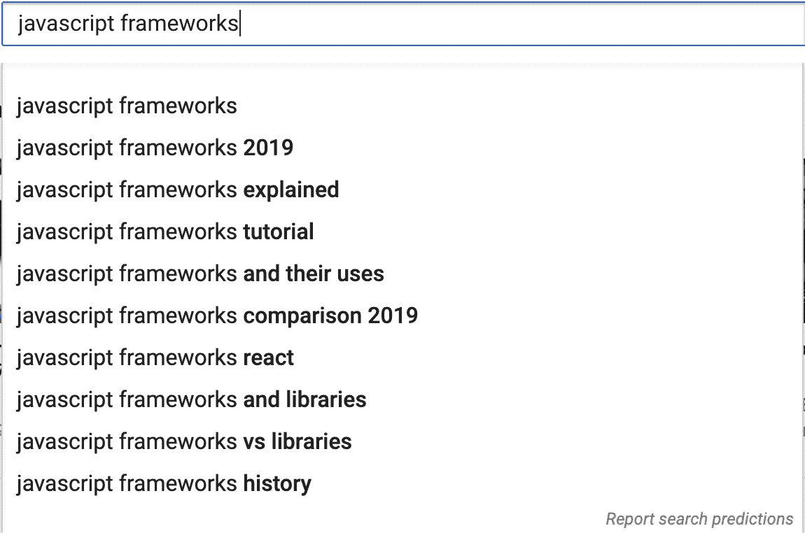

YouTube search autocomplete

例如，如果你正在创建一个关于 JavaScript 框架的视频，使用这个策略可能会让你将视频命名为“JavaScript 框架解释(2019)”

### 谷歌趋势的 YouTube 关键词研究

另一种了解人们在搜索什么的方法是谷歌趋势。在网站上，你可以比较两个(或更多)相似的短语，以确定哪一个更受欢迎。确保选择“YouTube 搜索”,这样数据将特定于 YouTube。

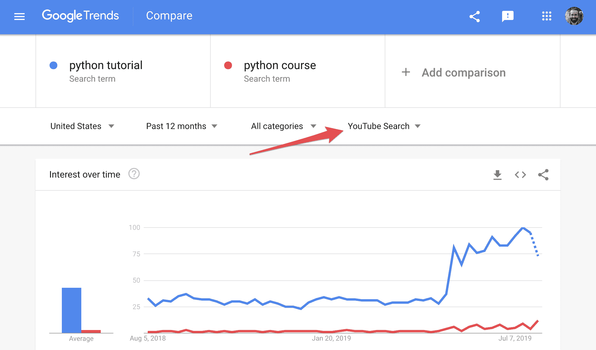

Google trends: "python tutorial" vs "python course"

如果你正在发布一个 Python 课程视频，上面的数据建议你应该将它命名为“Python 教程”，而不是“Python 课程”。

### 如何设计一个人们会点击的 YouTube 缩略图

YouTube Creator Academy 有一些设计缩略图的好建议。

以下是一些建议:

*   通过使用一致的颜色、字体和图形来“标记”您的缩略图。
*   您可以应用“三分法”来制作有趣的动态图像，然后覆盖您的品牌和/或描述性文字。如果您添加文本，请确保使用易于阅读的字体。
*   在拍摄前考虑一下你的缩略图是有好处的，这样你就可以捕捉到几个选项。
*   缩略图以不同的大小显示在 YouTube 和嵌入 YouTube 视频的外部网站上，因此请检查您的缩略图在移动和桌面上是否好看。
*   看看其他类似频道在他们成功的视频上使用的缩略图。这会给你一些什么样的缩略图效果好的想法。

### YouTube 缩略图设计软件

你将需要软件来创建你的缩略图。最顶级的图片编辑软件是 [Photoshop](https://www.adobe.com/products/photoshop.html) 。要使用它，你必须注册一个月订阅服务。有一些更便宜的选择。

最流行的图片编辑免费软件是 [Gimp](https://www.gimp.org/) 。在使用 Gimp 多年后，我决定我需要一些更加用户友好的东西，所以我购买了[的亲和照片](https://affinity.serif.com/en-us/photo/)。功能和用户体验都比 Gimp 好很多。我喜欢这是一次性成本，不像 Photoshop 订阅模式。另一个不错的选择是[像素化器](https://www.pixelmator.com/pro/)。

Image editing software logos.

# YouTube 算法是如何工作的

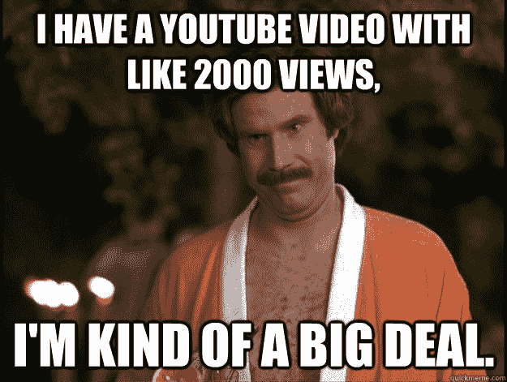

YouTube 算法决定了哪些视频将被推广，并在搜索结果中排名靠前。事实上，YouTube 可能有数千种不同的算法，但为了简单起见，我将把它称为“YouTube 算法”。

YouTube 算法是个神秘的东西。甚至顶级 YouTubers 也表示不完全理解为什么该算法推广了一些视频，但没有推广其他视频。

根据我听到的一些采访，我相信即使是 YouTube 的工程师也不完全理解算法是如何工作的。工程师告诉算法他们想要什么样的结果，但他们并不具体编程如何实现这一结果。由人工智能和机器学习来处理。

所以我要告诉你的每件事都可能有例外，但这是基于大量的经验和研究。

### 算法不关心的是

*   上传频率
*   视频标签
*   以前的视频表现如何
*   描述
*   订户计数
*   视频观看的平均百分比

好吧，也许算法关心这些事情有一点点，但与算法*关心的事情相比，这是非常小的。让我们一次讨论一个。接下来我会分享算法关心的问题。*

### YouTube 算法关心上传频率吗？

我听人说过，创作者必须每隔几天不间断地上传一个视频，才能真正成长为一个频道。这似乎是一个神话。我发现很多不经常上传视频的频道，每个视频都有大量的浏览量。我相信 YouTube 算法并不在乎上传频率。

有时 YouTube 工程师会进行研究，以更好地理解算法的工作原理。在一个面向创作者的官方 YouTube 频道上，他们讨论了一项研究，该研究表明，当创作者休息一段时间后回来时，暂停创作视频不会影响观看次数。

虽然上传频率并不总是与你获得的浏览量相关，但它可能会影响观众是否会订阅你的频道。如果你有一段时间没有上传，用户就不太可能订阅。

### YouTube 算法关心视频标签吗？

YouTube 的代表已经正式表示，视频标签在推荐方面几乎不算什么。每件事都有一定程度的影响，但这是影响最小的项目之一。

算法寻找模式。一旦它确定某一类型的观众经常观看您频道的视频，它会向该类型的观众推荐您的视频，无论标签和描述是什么。在算法为您的通道识别模式之前，它可能会使用标签作为标识符。

### YouTube 算法在乎之前的视频表现如何吗？

根据我的经验，前一个视频的性能对后一个视频的性能影响很小。在我的频道和我观察过的其他频道上都是如此。然而，我认为这可能会影响一个视频流行的速度。

如果用户刚刚观看了你频道的视频，该算法可能更有可能在你频道发布后立即推荐一个新视频。但是，如果没有很多用户点击观看，并且他们观看的时间也不是很长，算法就会很快停止推荐该视频。

另一方面，如果没有很多人看你之前的视频，你的视频一开始可能不会得到很多推荐。但是如果很多人点击它，并且看了很长时间，YouTube 就会开始大量推荐它。

我见过无数非常受欢迎的视频紧随不受欢迎的视频而来的例子。

### YouTube 算法在乎视频描述吗？

描述确实对算法有一点影响——与点击率和平均观看持续时间相比非常小(这些是算法关心的，很快会讨论)。

据 YouTube 报道，描述的前几行可能很重要，尤其是对于搜索来说。你应该用尽可能多的相关搜索词来填充第一句话。当搜索词在描述中的位置越低，它们对算法的影响就越小。

新手的错误是把链接或广告放在描述的第一行。虽然一些知名的 YouTube 频道这样做，那是因为该算法已经找到了向哪里推荐他们的视频的模式。对于较小的渠道，你应该始终把一个关键字丰富的描述性句子作为第一行。

但是请记住，即使是最好的描述也不能弥补低点击率和低平均观看时长。

### YouTube 算法在乎你有多少订户吗？

该算法更有可能向订户推荐你的视频，所以这确实有一些影响。然而，我经常在低订阅用户的频道上看到非常受欢迎的视频，在高订阅用户的频道上看到非常不受欢迎的视频。

如果人们长时间不观看你的视频，算法会很快停止向你的订阅者推荐你的视频(除非他们点击了铃铛图标)。

拥有更多订户显然有一些好处。当用户搜索时，如果他们订阅了您的频道，您的视频将在搜索结果中显示得更靠前。

此外，算法受到模式的严重影响。如果一个用户点击了你的频道中出现在他们订阅源中的每一个视频，那么这个算法就会不断地把你的更多视频放到他们的订阅源中。

### YouTube 算法在乎一个视频的平均观看百分比吗？

这一点可能会对较短的视频产生影响。如果你的视频只有几分钟长，那么视频被观看的比例会有所不同。但是如果你发布的是长达一小时的教程，那么浏览率就不那么重要了。

在 freeCodeCamp.org 频道，我们有一个长达 4.5 小时的 Python 视频，点击量超过 700 万次。它的平均观看百分比是 4.3%，但它的平均观看时长是 11:20。对于较长的视频，平均观看时长比观看百分比更重要。

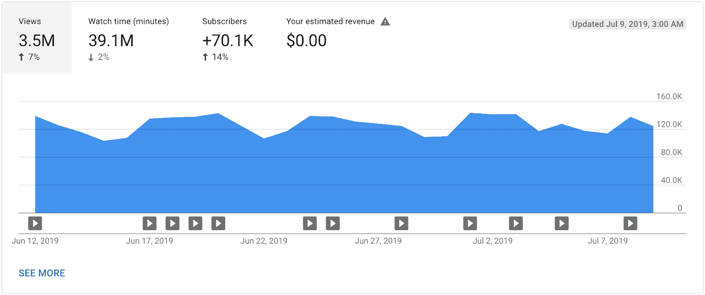

View analytics for the freeCodeCamp.org channel.

### YouTube 算法真正关心的是

根据我的经验，YouTube 算法只关心两件事:

*   点击率
*   平均观看时长

如果你的视频有很高的点击率和很高的平均观看时长，其他什么都不重要。你的视频会很受欢迎。

点击率衡量观众在 YouTube 上看到缩略图后观看视频的频率。你需要有一个缩略图和标题，人们会想点击。

平均观看时长是人们观看您的视频的平均时长。您的视频需要尽可能长时间地吸引观众的兴趣。

我听到一个流行的 YouTuber 说，如果你能获得超过 7 分钟的平均观看时长，一个视频几乎总是会变得非常受欢迎。然而，很少会有这么长的平均观看时长。

在极少数情况下，一个视频可能具有很高的点击率和很高的平均观看时长，但仍然不太被推荐。当算法无法确定在哪里推荐视频时，就会出现这种情况。也许该算法找到的唯一推广你的视频的地方是在不受欢迎的视频上。

例如，在显示油漆干燥的视频之后，当推荐你的视频时，也许人们会 100%地点击你的视频。但是因为很少有人看显示油漆干燥的视频，所以你的视频不太值得推荐。

如果这种情况发生在你的视频上，你最好试着改变视频的标题。这将导致 YouTube 尝试以不同的方式推荐您的视频。

### YouTube 流量来源类型解释

Traffic sources for the freeCodeCamp.org and Robot Family channels.

我想简单说一下流量来源。流量来源是观众如何找到你的视频观看。YouTube 上大多数频道的流量来源细分看起来更像上面右边的图表。

YouTube 上的大多数观看来自用户点击他们正在观看的视频旁边的建议视频(在图表中被列为“建议视频”)。YouTube 上第二个最常见的观看来源是用户点击他们主页上的视频(在图表中被列为“浏览功能”)。

如果你有一个信息或软件娱乐频道，你可能会从“推荐视频”和“浏览功能”中获得你的大部分意见。

你会注意到左边的图表显示了大多数来自“YouTube 搜索”的视图。这就是成功的教程频道如何获得大部分的观点。

当开发标题和缩略图时，你应该考虑你的目标用户是搜索你的视频的用户还是碰巧看到你推荐给他们的视频的用户。标题对搜索更重要，缩略图对推荐视频更重要。

# 一致性和具体目标

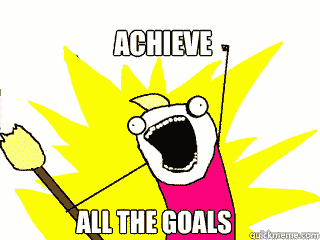

虽然你不需要频繁上传就可以获得受欢迎的视频，但保持一致的时间表仍然很重要。某种一致的时间表对增加你的 YouTube 频道很重要。

如果你不经常上传，那么当你上传的时候，应该是实质性的。如果每一个视频都是关于不同编程语言的 5 小时课程，如果你只是每一两个月上传一次也没问题。

为了保持一致性，你应该为自己设定目标。一个有效的目标是可衡量的，有时间限制的，可控制的。

可衡量的目标:目标应该有一个量化的组成部分，让你知道你是否达到了目标。

*定时*:目标应该有一个具体而现实的截止日期。

*可控*:目标应该是你能执行的行动，而不是你想要的结果。

例如，你的目标可能是每周(定时)推出 1 个视频(可衡量)。请注意，“发布视频”是您可以执行的操作，但是“达到 1000 个订阅者”不是操作，而是结果。

你应该制定雄心勃勃但仍然可行的目标。这在很大程度上取决于你的人生阶段。如果你是一个没有工作的单身人士，你将比一个有三个孩子和一份全职工作的已婚人士创造更多的内容。

当我刚开始我的 JavaScript 教程频道时，我的目标是每周发布 3 个短视频。一旦我持续达到这个目标，我就能增加到每周 5 个视频。(虽然这个目标对我来说是可行的，但我现在意识到，不那么频繁、更充实的视频往往会吸引更多的观众。)

# 作为创作者如何在 YouTube 上赚钱

在考虑赚钱的时候，一定要知道自己的目标是什么。有些人不关心从他们的视频中赚钱，只想提供免费的学习资源。然而，大多数人不会花时间制作学习资源，除非他们得到一点补偿。

这里有一些你的软件渠道可以为你赚钱的常见方法。

### 如何使用 YouTube 获得工作或加薪

对大多数人来说，软件 YouTube 频道赚钱的主要方式是间接地通过创作者获得一份更好的工作或加薪。

我已经提到过，创建软件教程帮助我的第一份开发工作获得了多个工作机会。我从其他 YouTube 创建者那里听说过类似的故事。

在最近的一次采访中，软件 YouTube 创始人迪伦·伊斯雷尔(Dylan Israel)说，每一个向他提供工作的雇主都特别提到了他的 YouTube 频道。迪伦说，即使只有 100 名订户，他的频道也帮他找到了工作。

杰西·魏格尔也说过类似的话。他说，他的现场编码帮助他获得了两次不同的加薪，甚至让他的整个团队都获得了加薪。

Jesse 最近完成了一次求职，他说在每次面试中，人们最想了解的就是现场编码。他说这真的让他作为候选人脱颖而出。杰西说，“我认为这给了雇主对我的信心，他们甚至可以在决定面试我之前就知道我是如何编码的，我的个性是什么。”

### 如何获得 YouTube 广告收入

如果你听说过在 YouTube 上很难赚钱，那么你没听错。大多数频道每 1000 次观看的收入在 1 美元到 2.50 美元之间，但收入可能低于或高于这一数字。因此，如果你想在一年内赚到 3 万美元，你可能需要获得 3000 万次浏览。

我的个人[机器人家庭频道](https://www.youtube.com/robotfamily)播放广告，我通常会从 10 分钟以下的视频每 1000 次观看中获得 1-1.50 美元，从 10 分钟以上的视频每 1000 次观看中获得 2-2.50 美元。十分钟后，你可以添加中间插播广告，这让我非常惊讶，我赚了多少额外的钱。

只有当人们点击视频广告或观看至少 30 秒的广告时，你才能从视频广告中赚钱。如果他们点击“跳过广告”，你就赚不到钱。此外，每个广告的收入取决于观众所在的国家。有些观众会比其他观众让你赚更多的钱。这就是为什么你能赚多少钱会有这么大的差别。

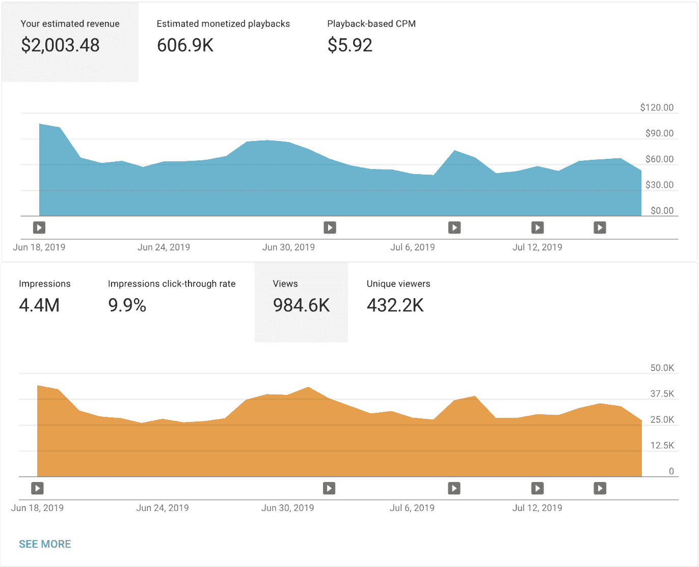

Revenue and views for the same time period on my Robot Family channel (maybe you should start a kids channel instead of a software channel ?).

### 如何在 YouTube 上推广产品和课程

用软件 YouTube 频道赚钱的一个有效方法是用它来推广你的付费产品和课程。来自 Mosh YouTube 频道的[节目的 Mosh Hamedani 似乎对这种模式做得很好。](https://www.youtube.com/user/programmingwithmosh)

为了达到最佳效果，你需要创建多个高质量的完整课程。在 YouTube 上免费发布一些完整的课程，并用这些课程来宣传你的付费课程。

有些人以错误的方式处理这件事。他们将创建一个完全付费的课程，然后在 YouTube 上免费发布一部分。这不会带来很多销售。

YouTube 上不完整的课程不会有很多人观看。如果你想在 YouTube 上获得大量的浏览量，你必须发布一个全面完整的课程。这将最大限度地提高你的曝光率，并增加付费课程的销量。

### 如何让 YouTube 用户通过 Patreon 给你钱

许多创建软件教程的人已经用 Patreon 取得了成功。[科里·斯查费](https://www.youtube.com/user/schafer5)就是其中之一。我问他对使用 Patreon 的新创作者有什么建议。

他建议人们从一开始就设置 Patreon，并不时提醒他们的观众，他们可以通过该页面提供支持。科里在每个视频的结尾都提醒他的观众，他们可以通过 Patreon 支持他。

Corey 还表示，为不同的支持层级提供额外津贴可能是有效的。他提到了额外津贴，比如一件 t 恤或一个 discord 服务器的邀请。

数据学校的凯文·马卡姆是另一个在 Patreon 上做得很好的软件 YouTuber。我联系了他，询问他对成功使用 Patreon 的想法。他的回答很好，很有见地，我想直接引用他的话:

> Patreon 上做的好的人有三种:
> 
> 1。拥有真正庞大受众的人(对他们来说，他们通过 Patreon 提供什么并不重要，这只是一个捐赠页面)
> 2。拥有大量观众的创作者通过 Patreon 发布超级引人注目的奖励内容(就像一个受欢迎的播客每周向顾客发布一集奖励，这就是他们用 Patreon 所做的一切)
> 3。拥有大量观众的创作者，他们努力以不同的方式为他们的顾客提供价值:提供很酷的奖励，创建一个社区，给粉丝更多接触创作者的机会，等等。因此，对于绝大多数创作者来说，你必须拥有相当规模的观众，并投入大量工作，才能让帕特里翁有价值。你的观众越多，你“需要”在 Patreon 上投入的工作就越少。这里的一个要点是，除非你超级有名，否则仅仅在你的 YouTube 页面上放一个 Patreon 链接不会带来任何有意义的顾客数量。Patreon 需要努力，你可能只应该做你喜欢做的事情，因为否则你会筋疲力尽。
> 
> 以下是我成功吸引人们加入我的 Patreon 的原因:
> (由于我的博客)我有一个很大的电子邮件简讯，这是关键，因为电子邮件比任何其他营销渠道转换得都好。我在构建和完善我的页面上投入了大量的工作，在公开发布之前，我让大约 20 名我最大的支持者审查了页面上的层级和语言，给我关于奖励以及我如何传达加入的价值的建议。
> 我在 YouTube 上创建的视频“课程”(意思是播放列表)需要数百个小时的工作，质量非常高，所以大多数人都加入了 Patreon，因为我的一门课程在某个时候为他们带来了巨大的价值，他们想要感谢我。
> 多年来，我一直免费为社区提供服务(回复了成千上万的 YouTube 评论/博客评论/电子邮件)，因此许多观众与我建立了个人联系。
> 我在社交媒体上有很好的影响力。
> 
> 以下是人们继续订阅的原因:
> 我投入了大量持续的工作来提供价值
> 我非常感谢我的顾客
> 我把我的顾客看得比其他任何人都重要

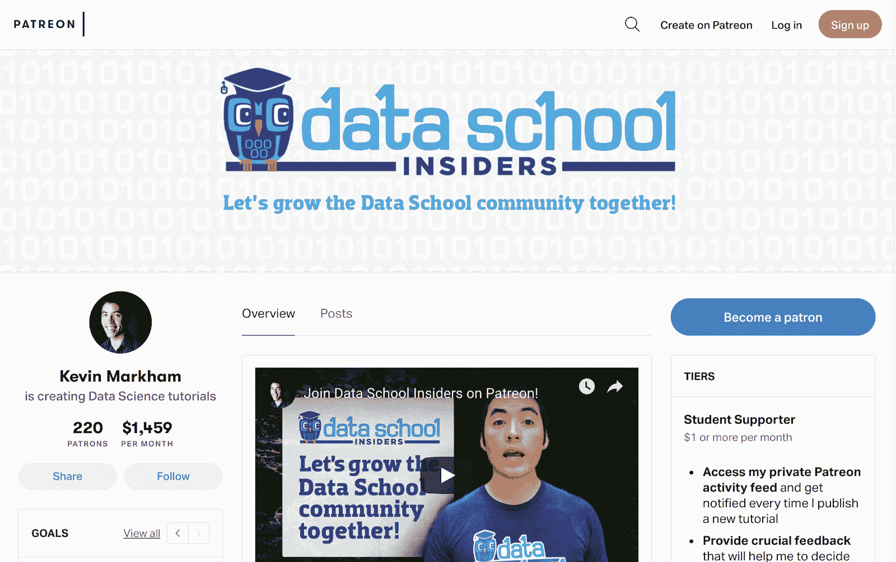

[The Patreon page for Data School.](https://www.patreon.com/dataschool)

## 如何在 YouTube 上获得赞助

很多创作者通过视频赞助赚钱。

我和迪伦·伊斯雷尔谈过获得赞助的事。他说他的第一个赞助商有大约 2500 名订户。为了获得赞助，他联系了编码组织/训练营，要求加入他们的市场部。现在他正处于赞助商向他伸出援手的时刻。

我也和福里斯特·奈特谈过获得赞助的事。像迪伦一样，他正处于赞助商来找他的时候。

福里斯特说要确保你的电子邮件可以在你的频道的“关于”部分找到。有时品牌会直接联系 Forrest，但大多数联系来自那些目的是将品牌与内容创作者联系起来的公司。福里斯特说，如果你发布了吸引眼球的高质量内容，品牌就会注意到并伸出援手。

就协商付款而言，Forrest 建议增加每次赞助机会的请求金额。最终你会开始得到“不”，然后你会知道你的利率范围。一定要随着你的渠道增长而提高费率，不要商定一个让你不舒服的价格。

# 如何推广你的 YouTube 频道

如果你刚刚开始，这可能是一个挑战。你必须考虑你的目标观众会在哪里看到你的视频。以下是一些想法:

*   发布到相关的子编辑
*   提交编码简讯，如 [CodeNewbie](https://www.codenewbie.org/) 简讯
*   与您所在的在线社区分享您的视频

另一个选择是将你的视频提交到一个更受欢迎的 YouTube 频道。freeCodeCamp.org YouTube 频道发布来自许多不同贡献者的教程。许多创作者报告说，在他们的一个视频在 freeCodeCamp.org 频道上发表后，他们自己频道的订户显著增加。

这是一位创作者最近的推文，展示了在我们发布了他们的一个视频后，他们的订户激增。

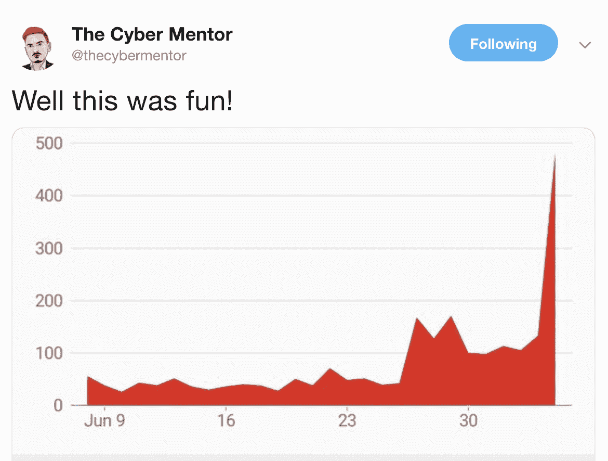

[https://twitter.com/thecybermentor/status/1147540016312311809](https://twitter.com/thecybermentor/status/1147540016312311809)

此外，有些人只在 freeCodeCamp.org 频道上发表文章。如果你的主要目标是获得大量的观众，这是一个可以考虑的选择。事实上，我就是这么做的。我从自己的频道开始，但最终开始在 freeCodeCamp.org 频道独家发布教程。这帮助我很快接触到大量的观众。

如果你有兴趣向 freeCodeCamp.org 频道提交视频，请发邮件给我。我的地址是 beau@freecodecamp.org。

# YouTube 上为视频制作者编程的其他技巧

*   考虑给视频添加结束屏幕。它们可以带来更多的浏览量，尤其是当你制作更短的视频时。在我的个人机器人家庭频道上，我有 6%的观看率来自终端屏幕。
*   如果视频是播放列表的一部分，*总是*链接到描述中的播放列表。
*   如果你已经创建了一个包含许多单独视频的完整课程，考虑将它们合并成一个长视频。如果你真的想单独上传视频，千万不要一次全部上传。确保每段视频至少间隔几个小时。一天一个最好。如果您一次全部上传，它们可能会以错误的顺序出现在您的频道上。
*   总是期望每个视频将是你的频道中第一个被很多人看到的视频。如果你想扩大你的渠道，试着最大限度地增加新加入的人的数量。一些创作者犯了一个错误，就是只为他们的订户制作视频。这导致视频对于新接触该频道的人来说可能是混乱的。你应该始终包括一个快速更新，告诉人们从哪里可以获得任何预期的先验知识——特别是如果观众需要从你的频道上的其他视频中获得先验知识。
*   我见过一些非英语母语的创作者选择制作没有对话的软件教程。我建议不要这样做。如果你的英语很差，可以考虑用你的母语制作视频，或者雇佣一个以英语为母语的人来朗读你写的画外音脚本。
*   不要在编码教程中使用背景音乐。经常会让人分心。如果人们想在看你的教程时听音乐，他们可以打开自己的音乐。
*   如果您的视频是系列的一部分，并且您想要在标题中包含系列名称，请将系列名称放在标题的末尾，而不是开头。这样对 SEO 更好。

# 结论

好了——现在你应该已经拥有了创建自己的软件 YouTube 频道所需的一切。祝你好运！

关于创建软件 YouTube 频道，你还有其他建议吗？在评论中分享吧！你不同意我的任何建议吗？给我发微博@beaucarnes 。