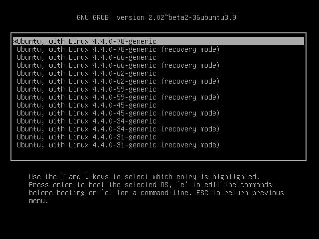
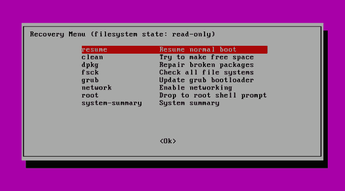

# Ubuntu 恢复菜单:揭秘 Linux 系统恢复

> 原文：<https://www.freecodecamp.org/news/the-ubuntu-recovery-menu-demystifying-linux-system-recovery/>

不要试图说服你自己:除了所有的好东西，你还会有不愉快的日子。

*   您(或您支持的用户)将会输入错误的命令并永久性地销毁文档。
*   当你意识到某个真正重要的硬件或软件刚刚出了故障时，你会经历这种沮丧的感觉。那是你多年来为它所做的一切后的感激。

正确备份意味着您可以离开无法正常运行的操作系统或计算机，并在其他地方重新构建。但那永远是 b 计划。A 计划是恢复。

## 在 Ubuntu 上使用恢复模式

Linux 不允许您正常登录(例如，可能引导过程在显示登录屏幕之前意外停止)？你需要一些基本的系统管理工具。

但是等等:如果 Linux 不能加载，你将如何启动这些工具？好吧，即使 Linux 不能加载到一个正常的命令提示符下，它通常会带你到 GRUB 菜单。在那里，您可以使用上下箭头键，然后回车选择一个运行在恢复模式下的 Linux 内核，您很快就会看到，这将打开一个完整的锦囊妙计。



The GRUB “Advance options” menu of an Ubuntu installation with links to both current and older kernel versions along with options for launching in recovery mode

如下图所示，一旦 Ubuntu 在恢复模式下加载，你会看到一个工具菜单，解决一些常见的启动时问题。值得尝试每一个看起来能解决你的根本问题的方法。例如，如果您怀疑问题源于磁盘已满，则“清理”会删除未使用的文件。“dpkg”将试图修复任何可能会把事情搞砸的基于 apt 的软件包。(“dpkg”工具可能要求您首先启用网络。)



The Ubuntu Recovery Menu with links to some basic diagnostic and repair tools, along with the option of opening a shell session as “root”

“root”选项将为您打开一个 root 命令行 shell 会话，在这里您可以随意使用 Bash。一般来说，使用简单的 shell 会话而不是完整的 GUI 桌面进行恢复是非常有意义的，因为您运行的复杂服务越少，您至少能够让系统运行的可能性就越大。一旦你*确实*设法得到了一个有效的命令提示符，你就可以开始四处探索，看看你是否能识别并修复这个问题。

但至少，你这样做看起来会很酷。

但是那些工具是什么呢？有运行 Ubuntu 的机器吗？你自己去看看吧。运行菜单的代码必须已经存在于 Ubuntu 文件系统中的某个地方。使用“定位”找到它。

```
locate recovery-mode
/lib/recovery-mode
/lib/recovery-mode/l10n.sh
/lib/recovery-mode/options
/lib/recovery-mode/recovery-menu
/lib/recovery-mode/options/apt-snapshots
/lib/recovery-mode/options/clean
/lib/recovery-mode/options/dpkg
/lib/recovery-mode/options/failsafeX
/lib/recovery-mode/options/fsck
/lib/recovery-mode/options/grub
/lib/recovery-mode/options/network
/lib/recovery-mode/options/root
/lib/recovery-mode/options/system-summary
```

请注意，“l10n.sh”脚本为菜单设置了适当的环境变量。如果您导航到/lib/recovery-mode/目录，您会看到“recovery-menu”文件是显示您在上面看到的菜单界面的脚本。/lib/recovery-mode/options/目录包含用于执行每个菜单项的文件…比如“fsck ”,它将检查并在可能的情况下修复任何损坏的文件系统。

根据本书前面的章节，既然您现在已经是一名出色的 Bash 脚本专家，为什么不看看 options/目录中的每一个脚本，看看您是否能弄清楚它们是如何工作的。下面是让您入门的“fsck”脚本的内容。请注意该脚本是如何被很好地记录下来的(使用“#”字符)，以帮助您理解发生了什么。

```
cat /lib/recovery-mode/options/fsck
#!/bin/sh
. /lib/recovery-mode/l10n.sh  <1>
if [ "$1" = "test" ]; then
  echo $(eval_gettext "Check all file systems")
  exit 0
fi
# Actual code is in recovery-menu itself  <2>
exit 0
```

这里有一些你可以自己尝试的事情:

*   在 Debian/Ubuntu 机器上手动运行“清理”脚本。发生了什么事？
*   然后尝试*仔细*编辑/lib/recovery-mode/recovery-menu 脚本(先做个备份)。也许只是改变一些简单的东西，比如菜单标题或者脚本描述。然后重启你的机器，从 GRUB 菜单进入恢复模式，看看是什么样子。

通过一些变化和例外，您应该能够在其他地方很好地使用这些示例。

*本文改编自我的* [*曼宁《Linux in Action》一书*](https://www.manning.com/books/linux-in-action?a_aid=bootstrap-it&a_bid=4ca15fc9) *的第六章(应急工具:搭建系统恢复装置)。这其中有更多的乐趣，包括一个名为 Linux in Motion 的混合课程，由两个多小时的视频和大约 40%的文本组成*[*Linux in Action*](https://www.manning.com/livevideo/linux-in-motion?a_aid=bootstrap-it&a_bid=0c56986f&chan=motion1)*。谁知道呢……你可能也会喜欢我的* [*在一个月的午餐中学习亚马逊网络服务*](https://www.manning.com/books/learn-amazon-web-services-in-a-month-of-lunches?a_aid=bootstrap-it&amp;a_bid=1c1b5e27) *。*