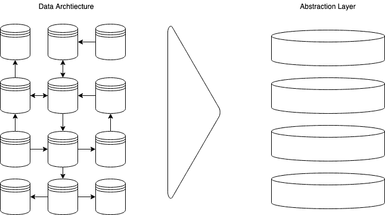

# 如何用 Python 构建 JSON API

> 原文：<https://www.freecodecamp.org/news/build-a-simple-json-api-in-python/>

JSON API 规范是一种支持客户机和服务器之间通信的强大方法。它使用 JSON 格式指定两者之间发送的请求和响应的结构。

作为一种数据格式，JSON 具有轻量级和可读性的优点。这使得快速高效地工作变得非常容易。该规范旨在最大限度地减少客户端和服务器之间需要发送的请求数量和数据量。

在这里，您可以学习如何使用 Python 和 Flask 创建一个基本的 JSON API。然后，本文的其余部分将向您展示如何尝试 JSON API 规范必须提供的一些特性。

Flask 是一个 Python 库,它为 web 开发提供了一个“微框架”。它非常适合快速开发，因为它附带了一个简单但可扩展的核心功能。

如何使用 Flask 发送类似 JSON 的响应的基本示例如下所示:

```
from flask import Flask

app = Flask(__name__)

@app.route('/')
def example():
   return '{"name":"Bob"}'

if __name__ == '__main__':
    app.run()
```

本文将为 Flask 使用两个附加组件:

*   Flask-REST-JSONAPI 将帮助开发一个严格遵循 JSONAPI 规范的 API。
*   Flask-SQLAlchemy 将使用 [SQLAlchemy](https://www.sqlalchemy.org/) 使创建一个简单的数据库并与之交互变得非常简单。

### 整体情况

最终目标是创建一个允许客户端与底层数据库交互的 API。在数据库和客户机之间有两层——数据抽象层和资源管理器层。


以下是相关步骤的概述:

1.  使用 Flask-SQLAlchemy 定义数据库
2.  用 [Marshmallow-JSONAPI](https://marshmallow-jsonapi.readthedocs.io/en/latest/) 创建一个数据抽象
3.  用 Flask-REST-JSONAPI 创建资源管理器
4.  创建 URL 端点并用 Flask 启动服务器

这个例子将使用一个简单的模式来描述现代艺术家和他们与不同艺术品的关系。

### 安装所有东西

在开始之前，您需要设置项目。这包括创建工作空间和虚拟环境，安装所需的模块，以及为项目创建主要的 Python 和数据库文件。

从命令行创建一个新目录并在其中导航。

```
$ mkdir flask-jsonapi-demo
$ cd flask-jsonapi-demo/
```

为你的每个 Python 项目创建虚拟环境是一个很好的实践。您可以跳过这一步，但强烈建议您这样做。

```
$ python -m venv .venv
$ source .venv/bin/activate 
```

一旦创建并激活了虚拟环境，就可以安装这个项目所需的模块了。

```
$ pip install flask-rest-jsonapi flask-sqlalchemy
```

您需要的所有东西都将按照这两个扩展的要求进行安装。这包括 Flask 本身和 SQLAlchemy。

下一步是为项目创建一个 Python 文件和数据库。

```
$ touch application.py artists.db
```

### 创建数据库模式

在这里，您将开始修改`application.py`来为项目定义和创建数据库模式。

在您喜欢的文本编辑器中打开`application.py`。从导入一些模块开始。为了清楚起见，模块将随着您的操作导入。

接下来，创建一个名为`app`的对象作为 Flask 类的实例。

之后，使用 SQLAlchemy 连接到您创建的数据库文件。最后一步是定义并创建一个名为`artists`的表。

```
from flask import Flask
from flask_sqlalchemy import SQLAlchemy

# Create a new Flask application
app = Flask(__name__)

# Set up SQLAlchemy
app.config['SQLALCHEMY_DATABASE_URI'] = 'sqlite:////artists.db'
db = SQLAlchemy(app)

# Define a class for the Artist table
class Artist(db.Model):
    id = db.Column(db.Integer, primary_key=True)
    name = db.Column(db.String)
    birth_year = db.Column(db.Integer)
    genre = db.Column(db.String)

# Create the table
db.create_all()
```

### 创建抽象层

下一步使用 [Marshmallow-JSONAPI](https://marshmallow-jsonapi.readthedocs.io/en/latest/) 模块在刚刚定义的表上创建逻辑数据抽象。

创建这个抽象层的原因很简单。它让您能够更好地控制如何通过 API 公开底层数据。可以把这一层想象成一个镜头，通过它 API 客户端可以清楚地看到底层数据，并且只看到他们需要看到的部分。



在下面的代码中，数据抽象层被定义为一个继承自 Marshmallow-JSONAPI 的`Schema`类的类。它将通过 API 提供对艺术家表中单个记录和多个记录的访问。

在这个块中，`Meta`类定义了一些元数据。具体来说，用于与单个记录交互的 URL 端点的名称将是`artist_one`，其中每个艺术家将由 URL 参数`<id>`来标识。与许多记录交互的端点的名称将是`artist_many`。

定义的其余属性与 artists 表中的列相关。在这里，您可以进一步控制如何通过 API 公开每一项。

例如，当请求向数据库添加新艺术家时，可以通过设置`required=True`来确保`name`字段是强制的。

如果出于某种原因，您不希望在发出 GET 请求时返回`birth_year`字段，您可以通过设置`load_only=True`来指定。

```
from marshmallow_jsonapi.flask import Schema
from marshmallow_jsonapi import fields

# Create data abstraction layer
class ArtistSchema(Schema):
    class Meta:
        type_ = 'artist'
        self_view = 'artist_one'
        self_view_kwargs = {'id': '<id>'}
        self_view_many = 'artist_many'

    id = fields.Integer()
    name = fields.Str(required=True)
    birth_year = fields.Integer(load_only=True)
    genre = fields.Str() 
```

### 创建资源管理器和 URL 端点

拼图的最后一块是为每条路线/艺术家和/艺术家/id 创建一个资源管理器和相应的端点。

每个资源管理器都被定义为从 Flask-REST-JSONAPI 类`ResourceList`和`ResourceDetail`继承的类。

这里他们有两个属性。`schema`用于表示资源管理器使用的数据抽象层，`data_layer`表示将用于数据层的会话和数据模型。

接下来，将`api`定义为 Flask-REST-JSONAPI 的`Api`类的实例，并用`api.route()`为 API 创建路由。这个方法有三个参数——数据抽象层类、端点名和 URL 路径。

最后一步是编写一个主循环，在脚本直接运行时以调试模式启动应用程序。调试模式非常适合开发，但不适合在生产环境中运行。

```
# Create resource managers and endpoints

from flask_rest_jsonapi import Api, ResourceDetail, ResourceList

class ArtistMany(ResourceList):
    schema = ArtistSchema
    data_layer = {'session': db.session,
                  'model': Artist}

class ArtistOne(ResourceDetail):
    schema = ArtistSchema
    data_layer = {'session': db.session,
                  'model': Artist}

api = Api(app)
api.route(ArtistMany, 'artist_many', '/artists')
api.route(ArtistOne, 'artist_one', '/artists/<int:id>')

# main loop to run app in debug mode
if __name__ == '__main__':
    app.run(debug=True)
```

### 发出 GET 和 POST 请求

现在您可以开始使用 API 来[发出 HTTP 请求](https://restfulapi.net/http-methods/)。这可能来自 web 浏览器，或者来自像 curl 这样的命令行工具，或者来自另一个程序(例如，使用请求库的 Python 脚本)。

要启动服务器，使用以下命令运行`application.py`脚本:

```
$ python application.py
```

在浏览器中，导航到[http://localhost:5000/artists](http://localhost:5000/artists)。您将看到到目前为止数据库中所有记录的 JSON 输出。除了，没有。

要开始向数据库添加记录，您可以发出 POST 请求。一种方法是从命令行使用 curl。或者，您可以使用类似于[失眠症](https://insomnia.rest/)的工具，或者编写一个简单的 HTML 用户界面，使用表单发布数据。

用[卷曲](https://curl.haxx.se/)，从命令行:

```
curl -i -X POST -H 'Content-Type: application/json' -d '{"data":{"type":"artist", "attributes":{"name":"Salvador Dali", "birth_year":1904, "genre":"Surrealism"}}}' http://localhost:5000/artists
```

现在，如果您导航到[http://localhost:5000/artists](http://localhost:5000/artists)，您将看到您刚刚添加的记录。如果您要添加更多的记录，它们也会显示在这里，因为这个 URL 路径调用了`artists_many`端点。

要通过艺术家的`id`号查看单个艺术家，您可以导航到相关的 URL。例如，要查看第一位艺术家，请尝试[http://localhost:5000/artists/1](http://localhost:5000/artists/1)。

### 过滤和排序

JSON API 规范的一个优秀特性是能够通过在 URL 中定义一些参数以更有用的方式返回响应。例如，您可以根据选择的字段对结果进行排序，或者根据某些标准进行筛选。

Flask-REST-JSONAPI 内置了这个。

要按出生年份排序艺术家，只需导航到[http://localhost:5000/artists？排序=出生 _ 年份](http://localhost:5000/artists?sort=birth_year)。在 web 应用程序中，这将使您不必在客户端对结果进行排序，这可能会影响性能，从而影响用户体验。

过滤也很容易。您可以将想要过滤的标准附加到 URL 中，放在方括号中。包括三条信息:

*   “名称”-作为过滤依据的字段(如`birth_year`)
*   “op”-过滤器操作(“等于”、“大于”、“小于”等)。)
*   “val”-要筛选的值(例如，1900)

例如，下面的 URL 检索出生年份大于 1900 年的艺术家:

[http://localhost:5000/artists？filter=[{"name":"birth_year "，" op":"gt "，" val":1900}]](http://localhost:5000/artists?filter=[{"name":"birth_year","op":"gt","val":1900}])

这个功能使得在调用 API 时只检索相关信息变得容易得多。这对于提高性能很有价值，尤其是在通过慢速连接检索潜在的大量数据时。

### 页码

JSON API 规范的另一个有助于提高性能的特性是分页。这时，大量的回复会分几页发送，而不是一次性全部发送。您可以在 URL 中控制页面大小和您请求的页面数量。

例如，您可以在 10 个页面上收到 100 个结果，而不是一次性加载所有 100 个结果。第一页包含结果 1-10，第二页包含结果 11-20，依此类推。

要指定每页接收的结果数，可以添加参数？page[size]= URL 的 X，其中 X 是结果的数量。Flask-REST-JSONAPI 使用 30 作为默认页面大小。

要请求给定的页码，可以添加参数？page[number]=X，其中是页码。您可以组合这两个参数，如下所示:

[http://localhost:5000/artists？页面[大小]=2 &页面[数量]=2](http://localhost:5000/artists?page[size]=2&page[number]=1)

该 URL 将页面大小设置为每页两个结果，并要求第二页的结果。这将从总体响应中返回第三和第四个结果。

### 关系

一个表中的数据几乎总是与存储在另一个表中的数据相关。例如，如果你有一个艺术家表，你可能也想要一个艺术品表。每件艺术品都与创作它的艺术家有关。

JSON API 规范允许您轻松处理关系数据，Flask-REST-JSONAPI 允许您利用这一点。在这里，这将通过向数据库添加一个 artworks 表来演示，并包括艺术家和艺术品之间的关系。

为了实现 artworks 示例，有必要对`application.py`中的代码做一些修改。

首先，创建几个额外的导入，然后创建一个新表，将每件艺术品与一位艺术家相关联:

```
from marshmallow_jsonapi.flask import Relationship
from flask_rest_jsonapi import ResourceRelationship

# Define the Artwork table
class Artwork(db.Model):
    id = db.Column(db.Integer, primary_key=True)
    title = db.Column(db.String)
    artist_id = db.Column(db.Integer, 
        db.ForeignKey('artist.id'))
    artist = db.relationship('Artist',
        backref=db.backref('artworks'))
```

接下来，重写抽象层:

```
# Create data abstraction 
class ArtistSchema(Schema):
    class Meta:
        type_ = 'artist'
        self_view = 'artist_one'
        self_view_kwargs = {'id': '<id>'}
        self_view_many = 'artist_many'

    id = fields.Integer()
    name = fields.Str(required=True)
    birth_year = fields.Integer(load_only=True)
    genre = fields.Str()
    artworks = Relationship(self_view = 'artist_artworks',
        self_view_kwargs = {'id': '<id>'},
        related_view = 'artwork_many',
        many = True,
        schema = 'ArtworkSchema',
        type_ = 'artwork')

class ArtworkSchema(Schema):
    class Meta:
        type_ = 'artwork'
        self_view = 'artwork_one'
        self_view_kwargs = {'id': '<id>'}
        self_view_many = 'artwork_many'

    id = fields.Integer()
    title = fields.Str(required=True)
    artist_id = fields.Integer(required=True) 
```

这为 artwork 表定义了一个抽象层，并将 artist 和 artwork 之间的关系添加到`ArtistSchema`类中。

接下来，定义新的资源管理器，用于一次访问多个艺术品，以及访问艺术家和艺术品之间的关系。

```
class ArtworkMany(ResourceList):
    schema = ArtworkSchema
    data_layer = {'session': db.session,
                  'model': Artwork}

class ArtworkOne(ResourceDetail):
    schema = ArtworkSchema
    data_layer = {'session': db.session,
                  'model': Artwork}

class ArtistArtwork(ResourceRelationship):
    schema = ArtistSchema
    data_layer = {'session': db.session,
                  'model': Artist}
```

最后，添加一些新的端点:

```
api.route(ArtworkOne, 'artwork_one', '/artworks/<int:id>')
api.route(ArtworkMany, 'artwork_many', '/artworks')
api.route(ArtistArtwork, 'artist_artworks',
    '/artists/<int:id>/relationships/artworks')
```

运行`application.py`并尝试通过 curl 从命令行提交一些数据:

```
curl -i -X POST -H 'Content-Type: application/json' -d '{"data":{"type":"artwork", "attributes":{"title":"The Persistance of Memory", "artist_id":1}}}' http://localhost:5000/artworks
```

这会创建一个与`id=1`相关的艺术家作品。

在浏览器中，导航到[http://localhost:5000/artists/1/relationships/artworks](http://localhost:5000/artists/1/relationships/artworks)。这应该显示与带有`id=1`的艺术家相关的艺术品。这使您不必编写一个更复杂的带有参数的 URL 来通过它们的`artist_id`字段过滤艺术品。您可以快速列出某个艺术家与其作品之间的所有关系。

另一个特性是在调用`artists_one`端点的响应中包含相关结果的能力:

[http://localhost:5000/artists/1？包含=艺术品](http://localhost:5000/artists/1?include=artworks)

这将返回艺术家端点的通常响应，以及该艺术家的每件作品的结果。

### 稀疏字段

最后一个值得一提的特性——稀疏字段。当处理具有许多复杂关系的大型数据资源时，响应大小可能会非常快。只检索您感兴趣的字段很有帮助。

JSON API 规范允许您通过向 URL 添加一个 fields 参数来实现这一点。例如，下面的 URL 会得到给定艺术家及其相关作品的响应。但是，它不是返回给定作品的所有字段，而是只返回标题。

[http://localhost:5000/artists/1？include =艺术品&字段[艺术品]=标题](http://localhost:5000/artists/1?include=artworks&fields[artwork]=title)

这对于提高性能非常有帮助，尤其是在慢速连接时。一般来说，您应该只向服务器发出和从服务器发出所需数据量最少的请求。

### 结束语

JSON API 规范是一个非常有用的框架，用于以干净、灵活的格式在服务器和客户机之间发送数据。本文概述了如何使用它，并提供了一个使用 Flask-REST-JSONAPI 库的 Python 示例。

那你接下来会做什么？有很多种可能。本文中的例子是一个简单的概念验证，只有两个表和它们之间的一个关系。您可以开发任意复杂的应用程序，并使用这里提供的所有工具创建一个强大的 API 与之交互。

感谢阅读，继续用 Python 编码！