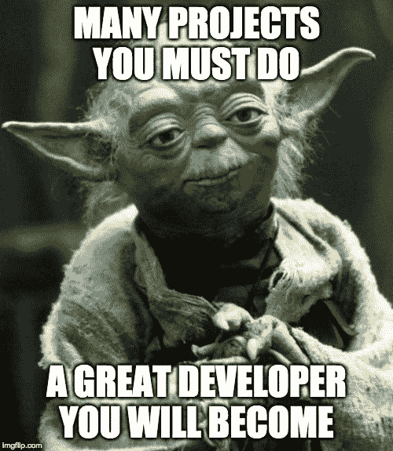
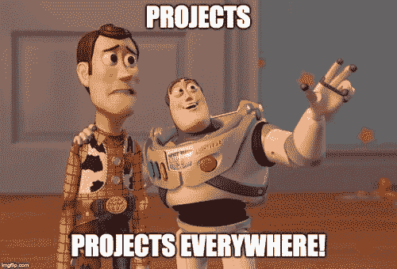
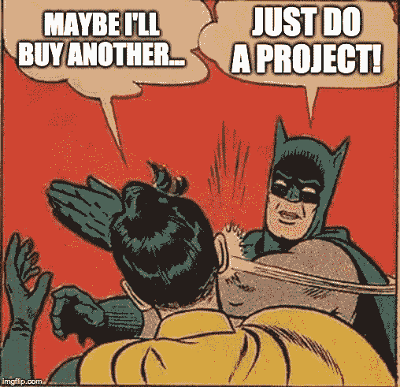
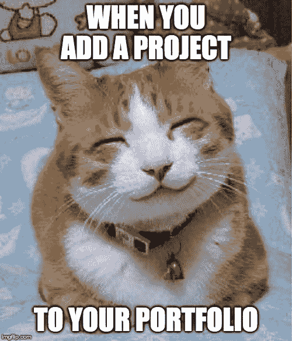
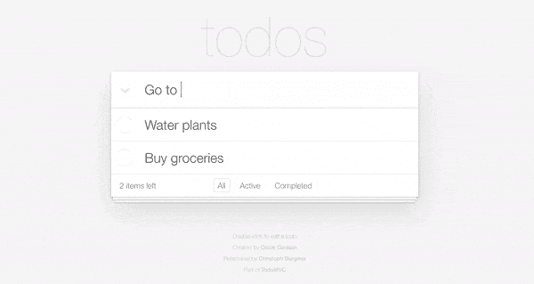

# 保证进入 Web 开发的最快方法

> 原文：<https://www.freecodecamp.org/news/the-guaranteed-fastest-way-to-break-into-web-development/>

## 做很多项目。

我没开玩笑，真的就这么简单。如果你已经记住了这一点，停止阅读，去工作吧。

## 到处都有项目

*   当你得到这份工作时，你会做**个项目**。

*   当你找到一份更好的工作时，你会领导**个项目**。

*   当你开了一家你梦寐以求的价值数百万美元的咨询公司时，你会经营许多项目。

因此，要成为一名杰出的开发人员，你必须——现在就跟我说——**做很多项目**！

## 书和课程呢？

理论上，他们很棒。

但事实上，它们可能是拖延的绝佳来源。

在你所有的学习材料中，你完成了多少？更好的是，有多少直接影响了你的职业生涯？

很少到没有？相信我，我也经历过。我自己的物理和虚拟图书馆都堆满了同样的满是灰尘的书。

因为我们在做反了。

## 用它们做参考

首先解决一个问题或有趣的想法，然后*也许*买些东西。因为没有行动，书本和课程只是有趣的信息。

你听起来会很聪明，但不会很有用。

然而，在项目的上下文中，所有这些信息对于更好地理解您的问题空间是非常宝贵的。

我爱书！我不是说“不要读”。

我是说找一个让你有点害怕的项目。试着完成它，然后当你不可避免地陷入困境时，用你的材料作为参考。

这样做，看着你的收获飞向月球。

## 我是 Web 开发的新手，我应该从哪里开始？

这个我怎么强调都不为过——***挑个项目*** ！

之后，过程就简单了:

*   学习*只需*足够前进
*   受骗
*   学习*只需*足够前进

一遍又一遍。

这简单得令人抓狂，这就是为什么几乎没有人这么做。我们寻找一个宏大的、过于复杂的系统来“驱动我们走向成功”，却忽略了这个永恒的原则...

> 找到自己做不到的事情，想办法去做。不惜一切代价。

## 终极初学者项目

在我看来，TodoMVC 是终极初学者项目。它在概念上很简单，但有一个有趣的设计和大量的功能。

1.  添加待办事项
2.  双击编辑待办事项
3.  删除待办事项
4.  选中/取消选中待办事项
5.  已完成/活动待办事项的过滤器
6.  计算还剩多少待办事项
7.  待办事项被保存到本地存储

用 HTML/CSS 编写一个像素完美的副本，然后用 JavaScript 实现该功能。

尽一切努力完成任务。如果你买了一本书或者一门课程，那就是*具体来说就是*完成 TodoMVC。

不过你应该不需要。Google 和 FreeCodeCamp 是完美的资源，它们的总成本是 0 美元。

作为一名专业的 web 开发人员，我个人使用 TodoMVC 来...

*   提高我的 HTML、CSS 和 JavaScript 技能。
*   在开始担任 React 首席开发人员的两周前，学习 React。
*   让自己熟悉一种全新的编程语言。

无论你在哪里，无论你在学什么，TodoMVC 都是一个完美的入门项目。

之后，选择一些新的或者更难的版本。

*   允许用户使用 GitHub 登录
*   将用户的待办事项保存在数据库中
*   下次他们登录时向他们展示
*   如果他们不想登录，请退回到本地存储

复杂性几乎可以无限扩展。如果你因为任何原因讨厌待办事项列表，没关系。我的建议仍然有效——选择一个项目。

## 简历，GitHub 等呢？

这些是你的收尾工作。

首先为优质项目打下坚实的基础，然后在任何地方展示它们——在你的 GitHub、简历、LinkedIn、个人网站上。

为了额外加分，在做项目的时候学习使用 Git/GitHub。工作流程最终会变得舒适，你会更加接近地模拟一个工作环境。

不管是开源，聚会，还是你自己，做很多项目。

## 想要免费辅导？

如果你想安排一个**免费的** 15-30 分钟的电话，讨论关于代码、面试、职业或任何其他方面的前端开发问题[请在 Twitter 上关注我，并给我发短信](https://twitter.com/yazeedBee)。

之后，如果你喜欢我们的第一次会议，我们可以讨论一个持续的教练关系，这将有助于你达到你的前端发展目标！

## 感谢阅读

更多类似的内容，请查看[https://yazeedb.com！](https://yazeedb.com)

下次见！