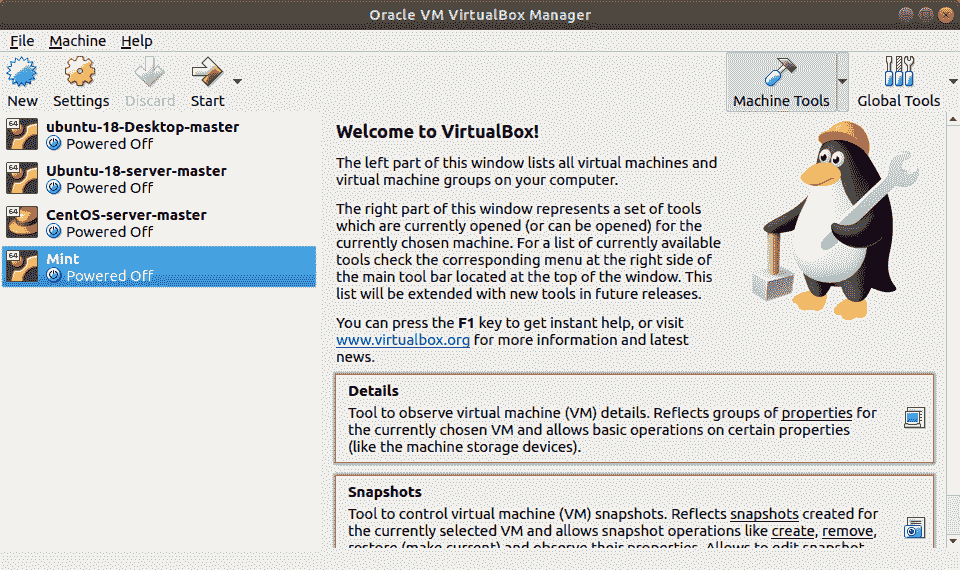
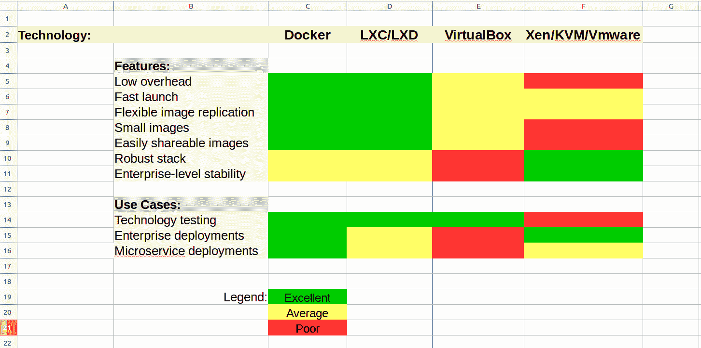

# VirtualBox:你的钱花得值吗？

> 原文：<https://www.freecodecamp.org/news/virtualbox-are-you-getting-your-moneys-worth/>

****注**** :截至 2018 年 11 月 7 日，VirtualBox 中存在一个[未打补丁的零日漏洞，该漏洞可能允许访客上的用户完全访问主机。除非另行通知，否则不要使用默认网络设置的 VirtualBox。](https://github.com/MorteNoir1/virtualbox_e1000_0day)[详情请点击](https://github.com/MorteNoir1/virtualbox_e1000_0day)。

当然你的钱花得值。VirtualBox 是免费的吧？好吧，那么为什么不加倍你的投资回报呢？为什么不了解一下作为 VirtualBox 高级用户，您还可以完成多少工作？



Oracle 的 VirtualBox 易于安装、易于使用，并使您能够在任何其他现代操作系统中运行几乎任何现代操作系统的虚拟版本。Ubuntu Linux 上的 Windows 10？我自己也做过。CentOS Linux 上的 FreeBSD？当然，为什么不呢？

当然，你可以用免费的 VMware Player 工具做类似的事情，在 Windows 8 和更高版本上，你可以用 Hyper-V 做类似的事情。

我已经使用 VirtualBox 很多年了，但是直到我需要把房子周围的一些物理机器聚集在一起，作为一个 Docker 群模式网络的节点，事情才变得复杂起来。毕竟，手动创建和启动虚拟机需要在每台电脑前花费大量时间，照看操作系统的安装和配置。反过来，这意味着我要爬楼梯，坐在孩子们房间里真正糟糕的椅子上。别告诉他们我说过这话，但我不知道他们为什么要忍受这些。

事实证明，我的(Linux)电脑之间的 SSH 连接和一些非常基础的关于 *vboxmanage* 命令行 shell 的知识让我回到了懒惰的系统管理员的快乐中。这是一种解放，你可能也需要一些你自己的解放。

但是在去那里之前，我将谈论一下 VirtualBox 的工作方式和你可以用它做的事情。如果听起来不有趣，请随意跳过。

我在这一切中的立场是什么？在为我的各种[书籍](https://bootstrap-it.com/index.php/books/)和 [Pluralsight 视频课程](http://pluralsight.pxf.io/c/1191769/424552/7490?subId1=solving&u=https%3A%2F%2Fapp.pluralsight.com%2Fprofile%2Fauthor%2Fdavid-clinton)进行研究时，我经常构建测试环境，其中包括运行奇怪操作系统组合的机器。对于某些目的来说——尤其是当我需要在操作系统内核级别工作时——VirtualBox 已经被反复证明是我所拥有的最快和最有效的工具。我不确定我是否想使用一个资源贪婪的 VirtualBox 虚拟机来运行永久服务，但是对于测试和开发相关的情况，这绝对是最好的。

那就是我。但是我的体验对正常用户有用吗？从某种意义上说，至少偶尔每个人都需要检验新技术，那是绝对的。但是我想我有点不寻常，因为我很少从事生产。我一直在测试。

## 使用 VirtualBox

除了让你可以尝试全新的操作系统，而不必在车库中寻找未使用的(但可用的)硬件组件，VirtualBox 还是一个很棒的沙箱。因此，即使你真的不在乎你正在运行什么操作系统，但你不太热衷于在一些实验性的软件配置上拿你的主工作站的健康和福利冒险，VirtualBox 可以帮助你。

如果实验软件配置是你自己的，这个也可以。也就是说，VirtualBox 可以作为一种工具，用于安全地测试您自己的开发项目在多个 OS 环境中的处理方式。

不要忘记，VirtualBox 是一个非常广泛使用的提供者，为流浪配置自动化系统。

正如我在我的 [Linux 服务器虚拟化文章](https://hackernoon.com/linux-server-virtualization-the-basics-32079b0e7d6e)中简要写的，VirtualBox 是一个第二类管理程序。事实也的确如此。但它是一个占用空间如此之小的虚拟机管理程序，以至于就功能而言，它有时可以与 Docker 和 LXC/LXD 等容器技术相竞争。这为 VirtualBox 开辟了相当广泛的用途。但是，由于重叠可能会变得复杂，这里(因为你永远不会有太多的电子表格)是一个视觉技术与技术的比较:



An unscientific feature/use-case matrix for virtualization technologies

## 把事情做完

已经说得够多了。我们开始工作吧。

VirtualBox 的 GUI 非常漂亮，但是当你在多个网络主机上启动虚拟机时，它真的会降低你的速度。这里有一些工具可以让事情发生——无论是在本地还是通过远程连接——从命令行。

安装 VirtualBox。以下是在 Ubuntu 或 Debian 上是如何做到的，无论如何:

```
sudo apt install virtualbox
```

现在，可以使用以下命令从零开始远程创建新的虚拟机:

```
vboxmanage list ostypes
vboxmanage createhd --filename Ubuntu64.vdi --size 16384
VBoxManage createvm --name Ubuntu64 --ostype “Ubuntu_64” --register
```

…但是在远程屏幕上显示实际的安装界面有时会带来更多的麻烦，不值得这样做。相反，让我们假设您在本地工作站上已经有了一个“黄金映像”VirtualBox 虚拟机。您将需要使用 *vboxmanage 列出虚拟机*来查看那里有什么。

这是它在我的工作站上的样子:

```
vboxmanage list vms
“Ubuntu-16.04-template” {c00d3b2b-6c77–4919–85e2–6f6f28c63d56}
“Ubuntu14-template” {43e2f9d4–8aa1–4db4-aa59–33b202df32ed}
“centos-7-template” {e2613f6d-1d0d-489c-8d9f-21a36b2ed6e7}
“Kali-Linux-template” {b7a3aea2–0cfb-4763–9ca9–096f587b2b20}
“Kali-Linux-openvas” {1ec41fdd-bf14–4025–9e9e-ee7272acf87f}
“docker-project” {2387a5ab-a65e-4a1d-8e2c-25ee81bc7203}
“Ubuntu-16-lxd” {62bb89f8–7b45–4df6-a8ea-3d4265dfcc2f}
```

顺便提一下，我是如何保存单个操作系统的干净的“模板”副本，然后在我需要做一些实际工作时创建克隆副本的。相信我，这真的可以加快你的启动时间，而不是每次都要经历整个安装程序。您可以从 GUI 创建克隆，或者像这样使用 *clonevm* (其中“Kali-Linux-template”是现有虚拟机的名称，“newkali”是我们希望为克隆指定的名称):

```
vboxmanage clonevm Kali-Linux-template --name newkali
```

点击查看 [VirtualBox 文档页面上的 *clonevm* 参数细节。](https://www.virtualbox.org/manual/ch08.html#vboxmanage-clonevm)

但是，在这里，我将向您展示如何将现有的 VM 导出到. OVA 文件，您可以简单地将该文件复制到您的远程机器，然后导入到它们的 VirtualBox 实例中。导出操作再简单不过了:您输入想要导出的 VM 的名称(在我的例子中是 docker-project)， *-o* 来指定一个输出文件名，以及带有适当文件扩展名的文件名本身。

```
vboxmanage export docker-project -o docker.ova
0%…10%…20%…30%…40%…50%…60%…70%…80%…90%…100%
Successfully exported 1 machine(s).
```

文件将保存到您的当前目录。您可以显示刚刚创建的文件的详细信息:

```
ls -lh | grep docker-rw — — — — 
1 root root 2.1G Jun 4 17:01 docker.ova
```

无论如何，您都需要复制。OVA 文件到您的其他电脑。下面是使用 scp 在 Linux/MAC OS 机器之间进行文件传输的方式:

```
scp docker.ova username@192.168.0.34:/home/username
```

当然，您必须确保有足够的空闲磁盘空间来保存。OVA 文件本身(可能相当大)*和*创建新的 VM。

现在登录到您的远程计算机，从包含您刚才传输的文件的目录中，将其导入到 VirtualBox:

```
vboxmanage import docker.ova
0%…10%…20%…30%…40%…50%…60%…70%…80%…90%…100%
Interpreting /home/dad/docker.ova…
OK.
Disks: 
vmdisk2 36945920000 -1 http://www.vmware.com/interfaces/specifications/vmdk.html#streamOptimized docker-disk1.vmdk
-1–1Virtual system 0:
0: Suggested OS type: "Ubuntu_64"
    (change with "--vsys 0 --ostype <type>"; use "list ostypes" to list all possible values)
 1: Suggested VM name "docker-project"
    (change with "--vsys 0 --vmname <name>")
 2: Number of CPUs: 1
    (change with "--vsys 0 --cpus <n>")
 3: Guest memory: 2048 MB
    (change with "--vsys 0 --memory <MB>")
 4: Sound card (appliance expects "", can change on import)
    (disable with "--vsys 0 --unit 4 --ignore")
 5: USB controller
    (disable with "--vsys 0 --unit 5 --ignore")
 6: Network adapter: orig Bridged, config 3, extra slot=0;type=Bridged
 7: CD-ROM
    (disable with "--vsys 0 --unit 7 --ignore")
 8: IDE controller, type PIIX4
    (disable with "--vsys 0 --unit 8 --ignore")
 9: IDE controller, type PIIX4
    (disable with "--vsys 0 --unit 9 --ignore")
10: SATA controller, type AHCI
    (disable with "--vsys 0 --unit 10 --ignore")
11: Hard disk image: source image=docker-disk1.vmdk, target path=/home/dad/VirtualBox VMs/docker-project/docker-disk1.vmdk, controller=10;channel=0
    (change target path with "--vsys 0 --unit 11 --disk path";
    disable with "--vsys 0 --unit 11 --ignore")
0%...10%...20%...30%...40%...50%...60%...70%...80%...90%...100%
Successfully imported the appliance.
```

您需要通过运行*list VM*来确认一切正常:

```
vboxmanage list vms
“docker-project” {30ec7f7d-912b-40a9–8cc1-f9283f4edc61}
```

您可以使用 *vboxmanage modifyvm* 将虚拟机连接到网络。但是，在这样做之前，您需要知道您的主机如何引用适当的网络接口。在 Linux 机器上，你可以使用*的 ip 地址*来得到它。在这种情况下，显示的第二个接口(“eth0”，即“eth”后面跟一个零，而不是字母 o)是网卡，机器通过它访问互联网，因此这就是我们要找的连接。

```
ip addr
1: lo: <LOOPBACK,UP,LOWER_UP> mtu 65536 qdisc noqueue state 
UNKNOWN group default qlen 1
 link/loopback 00:00:00:00:00:00 brd 00:00:00:00:00:00
 inet 127.0.0.1/8 scope host lo
 valid_lft forever preferred_lft forever
 inet6 ::1/128 scope host
 valid_lft forever preferred_lft forever
2: eth0: <BROADCAST,MULTICAST,UP,LOWER_UP> mtu 1500 qdisc
 pfifo_fast state UP group default qlen 1000
 link/ether 94:de:80:c5:1e:2d brd ff:ff:ff:ff:ff:ff
 inet 192.168.1.13/24 brd 192.168.1.255 scope global dynamic eth0
 valid_lft 59857sec preferred_lft 59857sec
 inet6 fe80::e1c3:f8a2:9f8d:4375/64 scope link
  valid_lft forever preferred_lft forever
```

通过桥接适配器将 VM(虚拟)网卡移动到 eth0 接口的一种方法是通过`modifyvm`命令。在这种情况下，“docker-project”指向 VM 名称，eth0 是新桥的目标，将您的 VM 的内部网络接口与主机的 eth0 连接起来。

```
vboxmanage modifyvm “docker-project” --bridgeadapter1 eth0
```

现在，您已经准备好启动虚拟机了。“type headless”参数告诉 VirtualBox 在没有 GUI 的情况下将 VM 作为服务器运行。

```
vboxmanage startvm “docker-project” --type headless
Waiting for VM “docker-project” to power on…
VM “docker-project” has been successfully started.
```

对您的新虚拟机有什么好奇吗？尝试 *showvminfo* :

```
vboxmanage showvminfo docker-project
```

您可能需要运行网络搜索程序(如 nmap)来获取虚拟机的 IP 地址。有了这些信息，你就可以开始工作了。使用在源虚拟机上使用的相同凭据登录到新虚拟机，该虚拟机是从源虚拟机复制的。完成后关闭虚拟机就像运行 *poweroff* 命令一样简单:

```
VBoxManage controlvm “docker-project” poweroff 
0%…10%…20%…30%…40%…50%…60%…70%…80%…90%…100%
```

虚拟化快乐！

*David Clinton 是 Pluralsight 上 [Linux、AWS、Docker 和安全课程](http://pluralsight.pxf.io/c/1191769/424552/7490?subId1=solving&u=https%3A%2F%2Fapp.pluralsight.com%2Fprofile%2Fauthor%2Fdavid-clinton)以及* [*技术书籍和内容*](https://bootstrap-it.com) *的作者。*