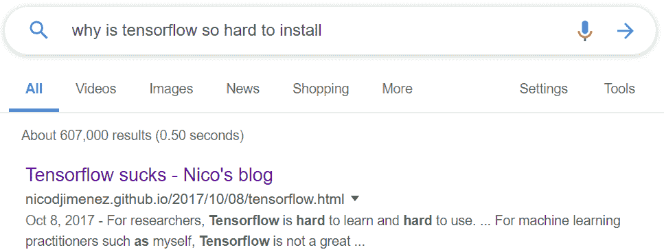
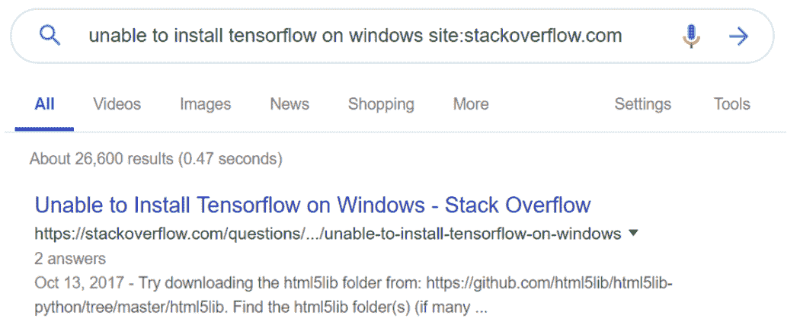
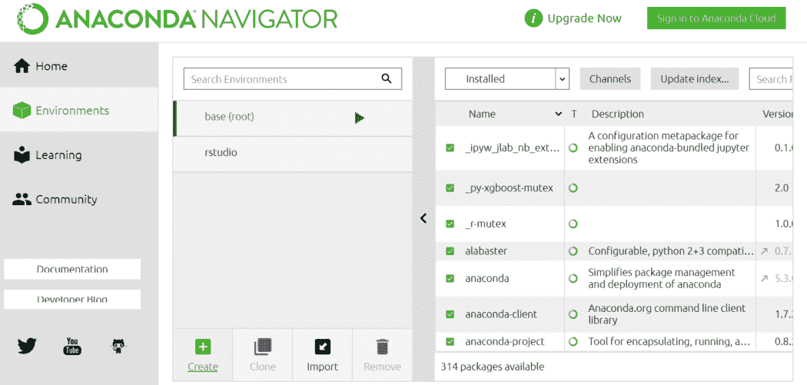
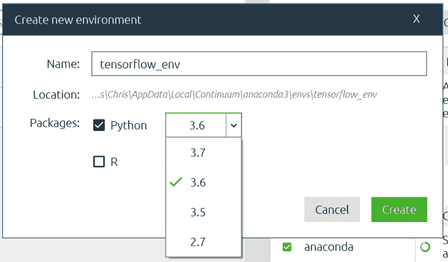
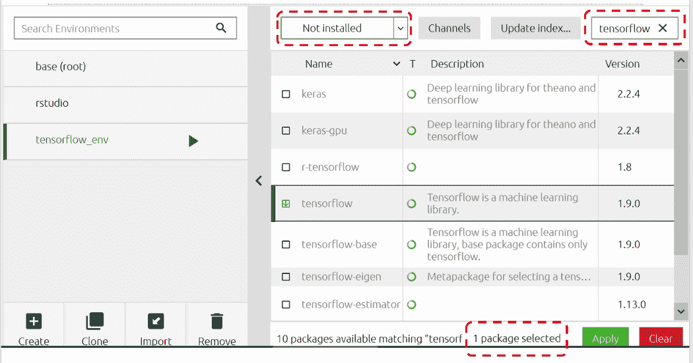
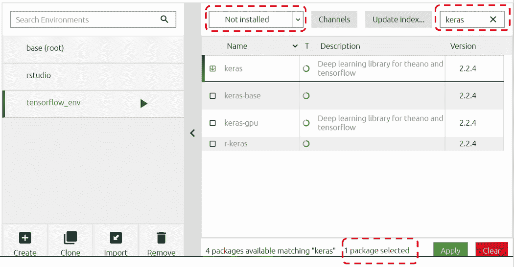
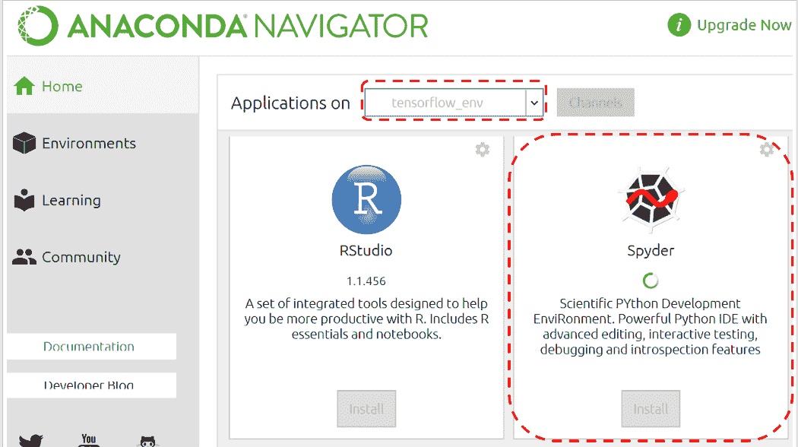
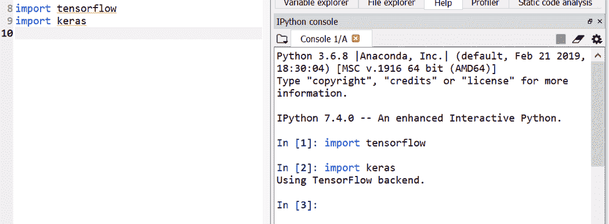

# 如何使用 Anaconda Navigator 安装 TensorFlow 和 Keras 无需命令行

> 原文：<https://www.freecodecamp.org/news/install-tensorflow-and-keras-using-anaconda-navigator-without-command-line/>

在命令行中对 pip 安装说不！以下是在本地机器上安装 TensorFlow 的另一种方法，只需 3 个步骤。

Photo by [Krzysztof Kowalik](https://unsplash.com/@kowalikus?utm_source=ghost&utm_medium=referral&utm_campaign=api-credit) / [Unsplash](https://unsplash.com/?utm_source=ghost&utm_medium=referral&utm_campaign=api-credit)

# 我为什么要写这个？

我花了几个小时使用多种配置的 pip install，试图弄清楚如何为 TensorFlow 和 Keras 正确设置我的 python 环境。

why is tensorflow so hard to install — 600k+ results

unable to install tensorflow on windows site:stackoverflow.com — 26k+ results

# 就在我放弃之前，我发现了这个…

**" [使用 conda 而非 pip 安装 TensorFlow 的一个主要优势是 conda 软件包管理系统。当使用 conda 安装 TensorFlow 时，conda 也会安装软件包的所有必需和兼容的依赖项。](https://www.anaconda.com/tensorflow-in-anaconda/?source=post_page---------------------------)**

*本文将带您了解如何使用 Anaconda 的 GUI 版本安装 TensorFlow 和 Keras。我假设你已经下载并安装了 Anaconda Navigator。*

# *我们开始吧！*

1.  *启动蟒蛇导航器。转到“环境”选项卡，然后单击“创建”。*

*

Go to ‘Environments tab’, click ‘Create’* 

*2.输入一个新的环境名——我输入‘tensor flow _ env’。 ****这里一定要选择 Python 3.6！**** 然后‘创建’，这可能需要几分钟。*

*

make sure to select Python 3.6* 

*3.在新的“tensorflow_env”环境中，选择“未安装”，然后键入“tensorflow”。然后，勾选“张量流”和“应用”。将出现弹出窗口，继续操作并应用。这可能需要几分钟时间。*

**

*对“keras”进行同样的操作。*

**

*通过导入软件包来检查您的安装。如果一切正常，该命令将不返回任何内容。如果安装不成功，您将得到一个错误。*

*

no error pop up — Yeah!* *

You can also try with Spyder.* *

no error pop up — Yeah!* 

*然后…哒哒！搞定了！您可以按照本文来测试您新安装的软件包:)*

* * *

*感谢您的阅读。请尝试一下，并让我知道你的反馈！*

*如果你喜欢我的做法，可以考虑在 [GitHub](https://github.com/ekapope?source=post_page---------------------------) 、 [Medium](https://medium.com/@ekapope.v?source=post_page---------------------------) 和 [Twitter](https://twitter.com/EkapopeV?source=post_page---------------------------) 上关注我，在你的 feed 上获取更多文章和教程。:)*