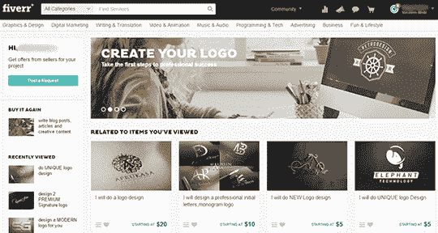
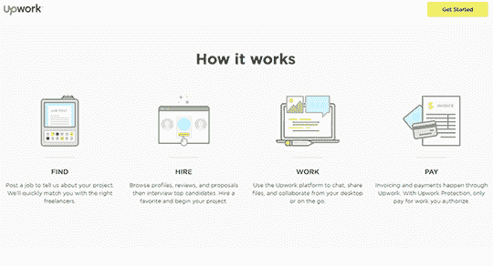
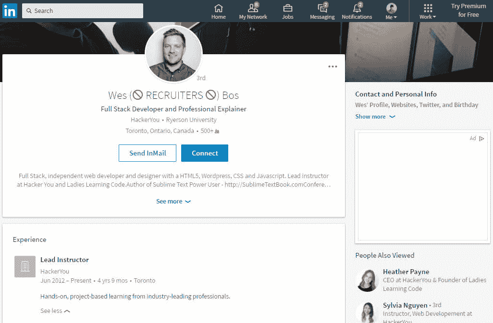

# 自由职业？这里有 7 个地方可以销售你的软件开发服务

> 原文：<https://www.freecodecamp.org/news/selling-services/>

Web 开发人员需要客户。无论你是全职自由职业者还是兼职自由职业者，都是如此。

因此，如果你曾经问过:“我在哪里销售我的 web 开发服务？”

你来对地方了。这篇文章应该给你一个简短的，有帮助的概述。

这些工具中有些可能与您相关，有些可能不相关。无论哪种方式，我的建议都是让你尝试哪种方式是最好的，并据此做出相应的调整。

## #1:五元

对于那些知道什么是 ****[Fiverr](https://www.fiverr.com/)**** 的人来说，你可能会想为什么我要在这里加上 Fiverr？

如果我一开始就告诉你，在过去的 5 个月里，我从 Fiverr 赚了 5 位数(美元)的钱，会怎么样？

我以为这会引起你的注意:)

对于那些不知道 Fiverr 是什么的人来说，它是一个出售服务的平台，起价为 5 美元。

这是我对 Fiverr 的真实看法:

根据你提供的服务，如果你不知道如何利用这些好处，那将是浪费你的时间。

所以，这是五边是如何工作的:

我首先看了看我服务中的其他人，想出了作为一个 Fiverr 的新手，我该如何脱颖而出。

我注意到他们的主图像看起来并不好，如果他们有视频，那也不好。所以，我决定投资制作一个好的视频，帮助我脱颖而出。

然后我在 Fiverr 上找人设计了一个 80 美元左右的像样的动画视频。

因为 Fiverr 是关于评论的，我需要尽快得到合法的评论来帮助提高我的可信度，所以我让我的哥哥和妈妈从我这里订购并为我写一篇评论。

现在，你可能认为我这样做是不明智的，也是不正确的…

首先，我在这里对你是 100%公开和透明的，其次，我在过去帮助过我哥哥和我妈妈的个人网站，所以我没有撒谎。

抛开背景不谈，让我们把注意力集中在实际方面:

一份网站转化报告我收了 5 美元(我给了他们如何改进网站的建议)。

自从我在 2016 年年中创建账户以来，我总共购买了三次(不包括我的哥哥和妈妈)。在这三个订单中，一个在最初的转换报告后签约了更多的项目(我现在将谈到这一点)，另一个给了我一个提示，最后一个是有史以来最奇怪的客户(在本文中我将忽略这一点)。

有趣的是，我在 5 美元的订单中的份额在扣除 5 美元的费用后只有 4 美元，这在我呆的地方基本上是一种体面的咖啡。

如果你像大多数人一样思考，你会想哇…所有的工作只需要 4 美元？谁会这么做？

我会…

我会解释为什么:

大多数人将他们的服务定价为一次性的，但我知道我可以通过为更多的工作提供更高的定价等级来改变这种情况。

我的 5 美元报告很有价值。我真的打算超额交货。这是一篇 3 页的关于我改进网站整体目标的建议的概述。

下一个报告是一个 100 美元的非常详细的行动计划和 UI 文档，其中有一个让我实施行动计划的 4 个数字的建议。

提议得到了同意，网站和其他在线营销也完成了。

两个月后，他的销售额翻了两番。

3 个月后:又订购了 5 个网站+我每月定期聘用+我们正在进行额外的项目。

总的来说，Fivver 是我时间上的一项伟大投资，也是获得一个了不起的客户(现在是客户变成朋友)的绝佳方式。

结论:刚起步时，在 Fiverr 这样拥挤的市场中脱颖而出并不容易——尤其是当你提供 web 开发这样的商品服务时。但是如果你创造性地思考如何获得客户，你就能成功。

### #2:升级

****[Upwork](https://www.upwork.com/i/how-it-works/freelancer/)**** 是全球最大的自由职业者在线平台(注册人数超过 1200 万)。

他们的三大服务是:

*   Web 开发
*   移动开发
*   设计

工作原理:

1.  注册成为自由职业者
2.  制作一个突出的个人资料页面(研究排名前 20 的个人资料，看看他们做了什么，并做更多)
3.  被客户雇佣
4.  做工作
5.  得到报酬

点击阅读更多关于流程[的信息。](https://www.upwork.com/i/how-it-works/freelancer/)

### 第三名 LinkedIn(是的——LinkedIn)

查看韦斯·博斯的 LinkedIn 页面。

根据[一些统计数据](http://www.forbes.com/sites/susanadams/2013/02/05/new-survey-linked-in-more-dominant-than-ever-among-job-seekers-and-recruiters-but-facebook-poised-to-gain/#4ba4744d16bf)，高达 97%的招聘者使用 ****[LinkedIn](https://www.linkedin.com/)**** 来寻找候选人。

有趣的是，每月只有 25%的用户活跃在 LinkedIn 上。

这些数据显示了一件好事和一件坏事…

不好是因为这表明很少有人利用 LinkedIn。

很好，因为它显示了如果你在 LinkedIn 上更活跃的潜力。

当然，如果你只是为了活跃而活跃并不意味着什么。

更加活跃应该与一个伟大的(更新的)个人资料相结合，在那里你可以分享想法和资源，为小组做出贡献，并提供你对某些主题的看法。

我提到这一点实际上有点虚伪，因为我甚至没有宣传我的 LinkedIn 个人资料(我以后会的)，但如果你想联系，这里有

如果你需要帮助来分解它，看看这个 LinkedIn 课程。

PS——不要忽视你的其他社交媒体资料，如 Instagram、脸书和 Twitter。

### #4:自由职业者

****[自由职业者](https://www.freelancer.com/)**** 也是类似的 Upwork。它还拥有数百万用户，是销售你的服务的另一个热门选择。

工作原理:

1.  注册成为自由职业者
2.  制作一个突出的个人资料页面(研究排名前 20 的个人资料，看看他们做了什么，并做更多)
3.  被客户雇佣
4.  做工作
5.  得到报酬

[在这里注册一个自由职业者账户](https://www.freelancer.com/?t=b&utm_expid=294858-511.oKOldrUTRkqgwrFQ1XPOaQ.1&utm_referrer=https%3A%2F%2Fwww.freelancer.com%2Fabout)。

## #5:租赁代码

RentaCoder 与 Upwork 和 Freelancer 非常相似，但值得一试。

## #6: Hirable

Hirable 也类似于 Upwork 和 Freelancer，但也值得一试。

### #7:你自己的投资组合网站

Website by [Adham Dannaway](http://www.adhamdannaway.com/)

我把这部分留在最后，因为我相信这是最被低估的部分。

让我们从一个场景开始:

你去参加一个面试，你坐在另外三个等待面试的候选人旁边。你们所有人都有相同的学院/大学资格，这表明你们学习过编程，知道如何编码。

最重要的问题是:

什么能让你从其他候选人中脱颖而出，从而得到这份工作？

可能这种情况下你和面试官怎么相处。但至少在纸面上你们都是一样的。

现在，想象一下上面同样的场景，但是你有一个由 3-5 个网站组成的投资组合，这些网站是你通过兼职做自由职业者或为企业创建网站而创建的，你把这个“证据”带到面试中。你会立刻从其他候选人中脱颖而出，你得到这份工作的机会也大大增加了。

你的投资组合让你与众不同，最终会让你的资格成为一纸空文——说真的。

底线是…你需要一个出色的作品集来展示你的作品。

## 增加投资组合的可行技巧:

联系当地的慈善商店/餐馆/非政府组织/教堂，告诉他们你将为他们创建一个网站(免费)，并告诉他们这是为了建立你的网络开发组合并获得经验。

作为网站的交换，你希望他们允许你把它添加到你的作品集里，你希望得到一份证明。这对你和他们都是双赢。他们有一个很好的网站，你可以通过创建更多的项目学到更多的东西，你可以在你的投资组合上获得更多的经验，这对你来说是一笔财富。

把这个策略想象成“负债变成资产的策略”，它是你的负债，因为你没有得到报酬，它需要你花时间去创造，但是在这个过程的最后，你将拥有一笔资产，没有人能从你的名下拿走。

在申请工作之前，为你的作品集瞄准至少 5 个网站。这是一个很好的工作基础，它展示了你的多样性和技能。

我希望你能从这篇文章中获得一些启示。永远记住，获得客户的最佳“平台”是让你的客户为你做营销。

直到下次...

凯尔