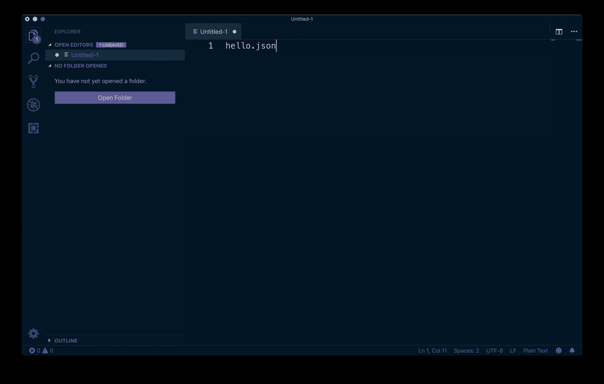

# 如何在 VSCode 中创建代码配置文件

> 原文：<https://www.freecodecamp.org/news/how-to-create-code-profiles-in-vscode/>

这篇文章借鉴了 [@avanslaars](https://twitter.com/avanslaars) 所做的工作，他是 [egghead.io](https://github.com/avanslaars/code-profiles) 的讲师同事。他不久前在书呆子聚会上分享了这一点，而我从来没有自己动手做过。

现在，我正在安装一台新的笔记本电脑，并决定尝试一下。在安迪的[回购这里](https://github.com/avanslaars/code-profiles)之后，我将向您介绍整个过程，以便您可以跟随。

在我们开始之前，“代码概要”本质上是一种不同的`settings.json`配置。您也可以定制每个代码概要文件加载哪些扩展，但是这超出了本文的范围。

### 1.创建一个`code_profiles`目录

我们需要做的第一件事是创建一个存储我们的“配置文件设置”的地方。它不一定要被称为`code_profiles`，但我们将使用这个术语，因为安迪这样做，听起来很好。

他将他的保存在计算机的根目录下，因此我们也将这样做:

```
# From the root of your computer ~/
mkdir code_profiles 
```

完成后，`cd`进入那个目录:

```
cd code_profiles 
```

### 2.创建您的第一个个人资料

因为我将使用它进行 egghead 记录，所以我将创建一个名为`egghead`的新目录:

```
# mkdir name-of-profile
mkdir egghead 
```

然后`cd`进入那个目录:

```
cd egghead 
```

### 3.添加 settings.json

VSCode 需要一个带有`User`子目录的`data`目录。在那里，我们将放置我们的设置:

```
# -p will create parent directories as needed
mkdir -p data/User 
```

创建完这些文件后，进入新的`User`子目录并创建您的`settings.json`文件:

```
# Go into that directory
cd data/User

# Create your settings file
touch settings.json 
```

然后打开您的`settings.json`文件并添加您的设置。我将添加安迪[在他的](https://github.com/avanslaars/code-profiles/blob/master/egghead/data/User/settings.json)中的修改版本:

```
{
  "editor.tabSize": 2,
  "editor.quickSuggestions": false,
  "editor.parameterHints": false,
  "editor.suggestOnTriggerCharacters": false,
  "editor.hover": false,
  "editor.fontSize": 18,
  "editor.tabCompletion": true,
  "window.zoomLevel": 1,
  "workbench.colorTheme": "Night Owl",
  "editor.cursorBlinking": "solid",
  "editor.cursorStyle": "line",
  "editor.minimap.renderCharacters": false,
  "terminal.integrated.fontSize": 16,
  "explorer.openEditors.visible": 0
} 
```

### 4.测试您的新代码配置文件

现在让我们确保我们做的一切都是正确的。假设您已经将 VSCode 设置为[从命令行启动]([https://code . visual studio . com/docs/setup/MAC # _ 从命令行启动](https://code.visualstudio.com/docs/setup/mac#_launching-from-the-command-line)，我们可以通过运行以下命令来启动我们的新概要文件:

```
# replace CODE_PROFILE_NAME with the profile name used earlier
code --user-data-dir ~/code_profiles/CODE_PROFILE_NAME/data 
```

如果成功了，您应该会看到 VSCode 以您的设置打开:



### 5.为您的个人资料创建别名。

我不知道你怎么想，但我不想记住`code --user-data-dir ...`所以让我们接受安迪的建议，创建一个别名。

我正在使用`zsh`，所以我将使用关键字“teach”将这个别名添加到我的`.zshrc`文件中:

```
# replace CODE_PROFILE_NAME with the profile name used earlier
alias teach="code --user-data-dir ~/code_profiles/CODE_PROFILE_NAME/data" 
```

现在，当您想要使用这个代码配置文件时，您所要做的就是键入:

```
teach ~/projects/lesson 
```

呜哇！仅此而已。

特别感谢 [@avanslaars](https://twitter.com/avanslaars) 的分享。这里有一个他的 [`code_profiles`回购](https://github.com/avanslaars/code-profiles)的链接，我在那里学会了如何做这件事。

*注意*:如果你在便携模式下使用 VSCode，有一个[已知的 bug](https://github.com/microsoft/vscode/issues/63657) ，其中标志`user-data-dir`目前不工作(特别感谢@myfonj 指出这一点)。

###

*这篇文章最初出现在 [DEV](https://dev.to/jsjoeio/how-to-create-code-profiles-in-vscode-3ofo) 上。*

？不要脸的插头:如果你想看更多这样的内容，订阅我的简讯:[https://buttondown.email/jsjoeio](https://buttondown.email/jsjoeio)