# HTML 手册——初学者学习 HTML

> 原文：<https://www.freecodecamp.org/news/the-html-handbook/>

# 介绍

欢迎光临！我写这本书是为了帮助你快速学习 HTML，熟悉高级 HTML 主题。

HTML 是超文本标记语言的简写，是网络最基本的组成部分之一。

HTML 正式诞生于 1993 年，从那时起，它发展到了现在的状态，从简单的文本文档发展到丰富的 Web 应用程序。

这本手册面向广大读者。

首先，初学者。我以简洁但全面的方式从零开始解释 HTML，所以你可以使用这本书从基础开始学习 HTML。

然后，专业的。HTML 通常被认为是次要的东西。这可能是理所当然的。

然而，许多事情对许多人来说是模糊的。包括我。我写这本手册是为了帮助我理解这个话题，因为当我需要解释一些事情的时候，我最好先确保自己对事情了如指掌。

即使你在日常工作中不写 HTML，当你需要不时地理解它时，知道 HTML 是如何工作的可以帮你省去一些麻烦，例如在调整网页时。

你可以在推特上找到我。

我的网站是 flaviocopes.com。

注意:你可以下载这本书的 PDF / ePub / Mobi 版本，这样你就可以离线阅读了。

## ****图书索引****

*   [前言](#preface)
*   [HTML 基础知识](#html-basics)
*   [文件标题](#the-document-heading)
*   [文档体](#the-document-body)
*   [与文本交互的标签](#tags-that-interact-with-text)
*   [链接](#links)
*   [容器标签和页面结构 HTML](#container-tags-and-page-structure-html)
*   [表格](#forms)
*   [表格](#tables)
*   [多媒体标签:音频和视频](#multimedia-tags-audio-and-video)
*   [iframes](#iframes)
*   [图像](#images)
*   [可访问性](#accessibility)

# 前言

HTML 是网络奇迹的基础。

在这套相当简单和有限的规则之下有一种不可思议的力量，它让我们——开发者、制造者、设计者、作家和修补者——为全球各地的人们制作文档、应用程序和体验。

我的第一本书是在 1997 年出版的，名叫《HTML Unleashed》。一本很大很厚的大部头书。

20 多年过去了，HTML 仍然是 Web 的基础，与那时相比变化很小。

当然，我们有了更多的语义标签，表示的 HTML 不再是一个东西，CSS 已经照顾到了事物的设计。

HTML 的成功基于一点: ****简洁**** 。

当人们最终意识到事情太复杂时，它拒绝通过 XHTML 被劫持成 XML 方言。

它这样做是因为它为我们提供了另一个特征:**。还有 **一些** 的规则，对吧，但是学了那些之后，你就有很多自由了。**

**浏览器学会了适应，并且在解析和向用户呈现 HTML 时总是尽力而为。**

**整个网络平台做对了一件事:它从未破坏向后兼容性。令人难以置信的是，我们可以追溯到 1991 年编写的 HTML 文档，它们看起来和当时差不多。**

**我们甚至知道第一个网页是什么。是这样的:[http://info.cern.ch/hypertext/WWW/TheProject.html](http://info.cern.ch/hypertext/WWW/TheProject.html)**

**而你可以看到页面的来源，得益于 Web 和 HTML 的另一大特点: ****我们可以考察任何网页的 HTML****。**

**不要认为这是理所当然的。我不知道还有哪个平台给了我们这种能力。**

**内置在任何浏览器中的优秀开发工具都可以让我们检查世界上任何人编写的 HTML 并从中获取灵感。**

**如果你是 HTML 新手，这本书旨在帮助你入门。如果你是一个经验丰富的网络开发人员，这本书将提高你的知识。**

**虽然我已经从事网络工作 20 多年了，但我在写作的过程中学到了很多，我相信你也会发现一些新的东西。**

**否则你会重新学习你忘记的旧东西。**

**无论如何，书的目标是对你有用，希望成功。**

## **HTML 基础**

**HTML 是由 ****WHATWG**** 定义的标准，是网络超文本应用技术工作组的首字母缩写，该组织由从事最流行的网络浏览器工作的人组成。这意味着它基本上由谷歌、Mozilla、苹果和微软控制。**

**过去，万维网联盟是负责创建 HTML 标准的组织。**

**当 W3C 向 XHTML 推进显然不是一个好主意时，控制权非正式地从 W3C 转移到了 WHATWG。**

**如果你从未听说过 XHTML，这里有一个小故事。在 21 世纪初，我们都相信 Web 的未来是 XML(真的)。所以 HTML 从基于 SGML 的创作语言变成了 XML 标记语言。**

**这是一个巨大的变化。我们必须知道并尊重更多的规则。更严格的规则。**

**最终，浏览器供应商意识到这不是网络的正确道路，他们进行了反击，创造了现在众所周知的 HTML5。**

**W3C 并没有真正同意放弃对 HTML 的控制，多年来我们有两个相互竞争的标准，每个都旨在成为官方标准。最终在 2019 年 5 月 28 日，W3C 正式宣布“真正的”HTML 版本是 WHATWG 发布的版本。**

**我提到了 HTML5。我来解释一下这个小故事。我知道，到目前为止，这有点令人困惑，因为生活中有许多事情涉及到许多演员，但这也很迷人。**

**我们在 1993 年有了 HTML 版本 1 。[这是原始的 RFC](https://tools.ietf.org/html/rfc1983) 。**

******HTML 2**1995 年的 T3 紧随其后。****

**我们在 1997 年 1 月得到了 ****HTML 3**** ，1997 年 12 月得到了 ****HTML 4**** 。**

**忙的时候！**

**20 多年过去了，我们有了整个 XHTML 的东西，最终我们得到了这个 HTML5“东西”，它不再是真正的 **而是 HTML** 了。**

**HTML5 是一个术语，现在定义了一整套技术，包括 HTML，但增加了许多 API 和标准，如 WebGL、SVG 等。**

**这里需要理解的关键是:现在已经没有 HTML 版本了。这是一种生活标准。像 CSS，号称“3”，实则是一堆独立模块单独开发。比如 JavaScript，我们每年都有一个新版本，但是现在，唯一重要的是引擎实现了哪些特性。**

**是的，我们称之为 HTML5，但 HTML4 是 1997 年的。这对任何东西来说都是一段很长的时间，更不用说网络了。**

**这是标准现在“生活”的地方:https://html.spec.whatwg.org/multipage。**

**HTML 是我们用来组织我们在网上消费的内容的标记语言。**

**HTML 以不同的方式提供给浏览器。**

*   **它可以由服务器端应用程序生成，服务器端应用程序根据请求或会话数据构建它，例如 Rails 或 Laravel 或 Django 应用程序。**
*   **它可以由动态生成 HTML 的 JavaScript 客户端应用程序生成。**
*   **在最简单的情况下，它可以存储在文件中，并由 Web 服务器提供给浏览器。**

**让我们深入研究最后一个案例。尽管在实践中这可能是最不受欢迎的生成 HTML 的方式，但了解基本的构建模块仍然是必不可少的。**

**按照惯例，HTML 文件以`.html`或`.htm`扩展名保存。**

**在这个文件中，我们使用 ****标签**** 来组织内容。**

**标签包装内容，每个标签赋予它包装的文本特殊的含义。**

**我们来举几个例子。**

**这个 HTML 片段使用`p`标签创建了一个段落:**

```
`<p>A paragraph of text</p>` 
```

**这个 HTML 代码片段使用`ul`标记和`li`标记创建一个条目列表，其中`ul`标记表示 **无序列表** ，而`li`标记表示 **列表条目** :**

```
`<ul>
  <li>First item</li>
  <li>Second item</li>
  <li>Third item</li>
</ul>` 
```

**当浏览器提供 HTML 页面时，标签被解释，并且浏览器根据定义元素视觉外观的规则呈现元素。**

**其中一些规则是内置的，比如列表如何呈现，或者链接如何用蓝色加下划线。**

**其他一些规则是你用 CSS 设置的。**

**HTML 不是表示性的。这与事情 **看起来** 如何无关。而是关心什么东西 **表示** 。**

**由浏览器决定事情看起来如何，由构建页面的人用 CSS 语言定义指令。**

**现在，我举的这两个例子是取自页面上下文之外的 HTML 片段。**

### ******HTML 页面结构******

**让我们制作一个合适的 HTML 页面的例子。**

**事情从文档类型声明(又名 **doctype** )开始，这是一种告诉浏览器这是一个 HTML 页面以及我们使用的 HTML 版本的方式。**

**现代 HTML 使用这种文档类型:**

```
`<!DOCTYPE html>` 
```

**然后我们有了`html`元素，它有一个开始和结束标签:**

```
`<!DOCTYPE html>
<html>
...
</html>` 
```

**大多数标签是成对出现的，有一个开始标签和一个结束标签。结束标记的写法与开始标记相同，但带有一个`/`:**

```
`<sometag>some content</sometag>` 
```

**有一些自结束标记，这意味着它们不需要单独的结束标记，因为它们的 中不包含任何 **。****

**`html`开始标签用在文档的开头，紧接在文档类型声明之后。**

**结束标签是 HTML 文档中最后出现的东西。**

**在`html`元素中，我们有两个元素:`head`和`body`:**

```
`<!DOCTYPE html>
<html>
    <head>
    ...
    </head>
    <body>
    ...
    </body>
</html>` 
```

**在里面`head`我们会有创建网页所必需的标签，比如标题、元数据、内部或外部 CSS 和 JavaScript。大多数东西不会直接出现在页面上，只是帮助浏览器(或者像谷歌搜索机器人这样的机器人)正确地显示出来。**

**在里面`body`我们将有页面的内容。 ****可见货色**** 。**

### ******标签 vs 元素******

**我提到了标签和元素。有什么区别？**

**元素有一个开始标记和一个结束标记。在这个例子中，我们使用`p`开始和结束标签来创建一个`p`元素:**

```
`<p>A paragraph of text</p>` 
```

**所以，一个元素构成了整个 **包** :**

*   **开始标签**
*   **文本内容(可能还有其他元素)**
*   **结束标签**

**如果一个元素没有结束标记，那么它只写开始标记，并且不能包含任何文本内容。**

**也就是说，我可能会在书中使用标签或元素术语来表达相同的意思，除非我明确提到开始标签或结束标签。**

### ******属性******

**元素的起始标签可以有我们可以附加的特殊信息片段，称为**。****

****属性具有`key="value"`语法:****

```
**`<p class="a-class">A paragraph of text</p>`** 
```

****您也可以使用单引号，但是在 HTML 中使用双引号是一个很好的约定。****

****我们可以有很多:****

```
**`<p class="a-class" id="an-id">A paragraph of text</p>`** 
```

****有些属性是布尔型的，这意味着您只需要键:****

```
**`<script defer src="file.js"></script>`** 
```

****`class`和`id`属性是两个最常用的属性。****

****它们有特殊的含义，在 CSS 和 JavaScript 中都很有用。****

****两者的区别在于，`id`在网页的上下文中是唯一的；它不能被复制。****

****另一方面，类可以在多个元素中出现多次。****

****另外，`id`只是一个值。`class`可以保存多个值，用空格隔开:****

```
**`<p class="a-class another-class">A paragraph of text</p>`** 
```

****在类值中使用破折号`-`来分隔单词是很常见的，但这只是一种惯例。****

****这只是你可能拥有的两种属性。有些属性只用于一个标签。他们高度专业化。****

****其他属性可以以更通用的方式使用。你刚刚看到了`id`和`class`，但是我们还有其他的，比如`style`，它可以用来在一个元素上插入内联 CSS 规则。****

### ********不区分大小写********

**HTML 不区分大小写。标签可以全部大写，也可以小写。在早期，封顶是标准。今天小写是标准。这是一个惯例。**

**你通常这样写:**

```
`<p>A paragraph of text</p>` 
```

**不是这样的:**

```
`<P>A paragraph of text</P>` 
```

### ******留白******

**相当重要。在 HTML 中，即使你在一行中添加了多个空格，它也会被浏览器的 CSS 引擎折叠。**

**例如这一段的翻译:**

```
`<p>A paragraph of text</p>` 
```

**和这个是一样的:**

```
`<p>        A paragraph of text</p>` 
```

**和这个一样:**

```
`<p>A paragraph

of
           text          </p>` 
```

**>*使用[空白 CSS 属性](https://developer.mozilla.org/en-US/docs/Web/CSS/white-space)你可以改变事情的行为方式。你可以在 [CSS 规范](https://www.w3.org/TR/CSS2/text.html#white-space-model)中找到更多关于 CSS 如何处理空白的信息***

**我通常喜欢**

```
`<p>A paragraph of text</p>` 
```

**或者**

```
`<p>
    A paragraph of text
</p>` 
```

**嵌套标签应缩进 2 或 4 个字符，具体取决于您的偏好:**

```
`<body>
    <p>
        A paragraph of text
    </p>
    <ul>
        <li>A list item</li>
    </ul>
</body>` 
```

**注意:这个“空白不相关”的特性意味着，如果你想添加额外的空间，它会让你很生气。建议你用 CSS 在需要的时候腾出更多空间。**

**注意:在特殊情况下，您可以使用`&nbsp;` HTML 实体(一个首字母缩写，意思是 **不间断空格**)——稍后会有更多关于 HTML 实体的内容。我认为这不应该被滥用。CSS 永远是改变视觉表现的首选。**

## **文档标题**

**`head`标签包含定义文档属性的特殊标签。**

**它总是写在`body`标签之前，紧接在开始的`html`标签之后:**

```
`<!DOCTYPE html>
<html>
    <head>
        ...
    </head>
    ...
</html>` 
```

**我们从不在这个标签上使用属性。而且我们不在里面写内容。**

**它只是一个其他标签的容器。在它里面，我们可以有各种各样的标签，这取决于你需要做什么:**

*   **`title`**
*   **`script`**
*   **`noscript`**
*   **`link`**
*   **`style`**
*   **`base`**
*   **`meta`**

### ******`title`标记******

**标签决定了页面的标题。标题显示在浏览器中，它尤其重要，因为它是搜索引擎优化(SEO)的关键因素之一。**

### ******`script`标记******

**这个标签用于将 JavaScript 添加到页面中。**

**您可以使用开始标记、JavaScript 代码和结束标记来内联包含它:**

```
`<script>
..some JS
</script>` 
```

**或者您可以使用`src`属性加载外部 JavaScript 文件:**

```
`<script src="file.js"></script>` 
```

**默认情况下，`type`属性被设置为`text/javascript`，所以它是完全可选的。**

**关于这个标签，有一些非常重要的事情需要了解。**

**有时这个标签用在页面的底部，就在结束的`</body>`标签之前。为什么？出于性能原因。**

**默认情况下，加载脚本会阻止页面的呈现，直到脚本被解析和加载。**

**通过将它放在页面的底部，在整个页面已经被解析和加载之后，脚本被加载和执行，与将它放在`head`标签中相比，给用户提供了更好的体验。**

**我的意见是，这是现在不好的做法。让`script`活在`head`标签里。**

**在现代 JavaScript 中，我们有一个替代方法，这比将脚本放在页面底部更有效——`defer`属性。这是一个加载相对于当前 URL 的`file.js`文件的例子:**

```
`<script defer src="file.js"></script>` 
```

**这是触发快速加载页面和快速加载 JavaScript 的更快路径的场景。**

**注意:`async`属性是相似的，但是在我看来是比`defer`更糟糕的选择。我会在 https://flaviocopes.com/javascript-async-defer/的[页更详细地描述原因](https://flaviocopes.com/javascript-async-defer/)**

### ******`noscript`标记******

**此标签用于检测浏览器中何时禁用脚本。**

**注意:用户可以在浏览器设置中选择禁用 JavaScript 脚本。或者默认情况下浏览器可能不支持它们。**

**根据它是放在文档头还是文档体中，它的用法是不同的。**

**我们现在说的是文档头，先介绍一下这个用法。**

**在这种情况下，`noscript`标签只能包含其他标签:**

*   **`link`标签**
*   **`style`标签**
*   **`meta`标签**

**如果脚本被禁用，则更改页面提供的资源或`meta`信息。**

**在这个例子中，我用`no-script-alert`类设置了一个元素，以便在脚本被禁用时显示，因为默认情况下它是`display: none`:**

```
`<!DOCTYPE html>
<html>
    <head>
        ...
        <noscript>
            <style>
                .no-script-alert {
                    display: block;
                }
            </style>
        </noscript>

        ...
    </head>
    ...
</html>` 
```

**让我们解决另一种情况:如果放在主体中，它可以包含内容，如段落和其他标记，这些内容呈现在 UI 中。**

### ******`link`标记******

**标签用来设置文档和其他资源之间的关系。**

**主要用来链接一个要加载的外部 CSS 文件。**

**此元素没有结束标记。**

**用法:**

```
`<!DOCTYPE html>
<html>
    <head>
        ...
        <link href="file.css" rel="stylesheet">
        ...
    </head>
    ...
</html>` 
```

**`media`属性允许根据设备功能加载不同的样式表:**

```
`<link href="file.css" media="screen" rel="stylesheet">
<link href="print.css" media="print" rel="stylesheet">` 
```

**我们也可以链接到样式表以外的资源。**

**例如，我们可以使用**

```
`<link rel="alternate" type="application/rss+xml" href="/index.xml">` 
```

**或者，我们可以使用以下方式关联一个网站图标:**

```
`<link rel="apple-touch-icon" sizes="180x180" href="/assets/apple-touch-icon.png">

<link rel="icon" type="image/png" sizes="32x32" href="/assets/favicon-32x32.png">

<link rel="icon" type="image/png" sizes="16x16" href="/assets/favicon-16x16.png">` 
```

**这个标签*T3 被*T5 也用于多页内容，用`rel="prev"`和`rel="next"`来表示上一页和下一页。主要是为谷歌。截至 2019 年，[谷歌宣布不再使用这个标签](https://twitter.com/googlewmc/status/1108726443251519489)，因为没有它也能找到正确的页面结构。**

### ******`style`标记******

**该标签可用于向文档中添加样式，而不是加载外部样式表。**

**用法:**

```
`<style>
.some-css {}
</style>` 
```

**与`link`标签一样，您可以使用`media`属性来仅在指定的介质上使用 CSS:**

```
`<style media="print">
.some-css {}
</style>` 
```

### ******`base`标记******

**此标签用于为页面中包含的所有相对 URL 设置一个基本 URL。**

```
`<!DOCTYPE html>
<html>
    <head>
        ...
        <base href="https://flaviocopes.com/">
        ...
    </head>
    ...
</html>` 
```

### ******`meta`标记******

**元标签执行各种各样的任务，它们非常非常重要。**

**尤其是对于 SEO 来说。**

**`meta`元素只有开始标签。**

**最基本的一个是`description` meta 标签:**

```
`<meta name="description" content="A nice page">` 
```

**这个 **可能会被** 用于谷歌在其结果页面中生成页面描述，如果它发现它比页面上的内容更好地描述了页面(不要问我如何描述)。**

**`charset` meta 标签用于设置页面字符编码。`utf-8`大多数情况下:**

```
`<meta charset="utf-8">` 
```

**meta 标签指示搜索引擎机器人是否索引一个页面:**

```
`<meta name="robots" content="noindex">` 
```

**或者他们是否应该跟随链接:**

```
`<meta name="robots" content="nofollow">` 
```

**您也可以在单个链接上设置 nofollow。这就是如何全局设置`nofollow`的方法。**

**您可以将它们结合起来:**

```
`<meta name="robots" content="noindex, nofollow">` 
```

**默认行为是`index, follow`。**

**您可以使用其他属性，包括`nosnippet`、`noarchive`、`noimageindex`等等。**

**你也可以只告诉谷歌而不是针对 **所有的** 搜索引擎:**

```
`<meta name="googlebot" content="noindex, nofollow">` 
```

**其他搜索引擎也可能有自己的 meta 标签。**

**说到这里，我们可以告诉谷歌禁用一些功能。这阻止了搜索引擎结果中的翻译功能:**

```
`<meta name="google" content="notranslate">` 
```

**`viewport` meta 标签用于告诉浏览器根据设备宽度设置页面宽度。**

```
`<meta name="viewport" content="width=device-width, initial-scale=1">` 
```

**[查看更多关于此标签的信息](https://developer.mozilla.org/en-US/docs/Mozilla/Mobile/Viewport_meta_tag)。**

**另一个相当流行的元标签是`http-equiv="refresh"`标签。这一行告诉浏览器等待 3 秒钟，然后重定向到另一个页面:**

```
`<meta http-equiv="refresh" content="3;url=http://flaviocopes.com/another-page">` 
```

**使用 0 而不是 3 将尽快重定向。**

**这不是一个完整的参考；还存在其他较少使用的 meta 标签。**

**在这个文档标题介绍之后，我们可以开始进入文档主体。**

## **文档正文**

**在结束 head 标签之后，我们在一个 HTML 文档中只能有一样东西:`body`元素。**

```
`<!DOCTYPE html>
<html>
    <head>
        ...
    </head>
    <body>
        ...
    </body>
</html>` 
```

**就像`head`和`html`标签一样，我们在一个页面中只能有一个`body`标签。**

**在`body`标签中，我们有定义页面内容的所有标签。**

**从技术上讲，开始和结束标记是可选的。但是我认为添加它们是一个很好的做法。为了清楚起见。**

**在接下来的章节中，我们将定义可以在页面主体中使用的各种标签。**

**但在此之前，我们必须介绍一下块元素和行内元素的区别。**

## ******块元素 vs 行内元素******

**页面主体中定义的可视元素通常可以分为两类:**

*   **块元素(`p`、`div`)、标题元素、列表和列表项，...)**
*   **内联元素(`a`、`span`、`img`，...)**

**有什么区别？**

**当块元素位于页面中时，不允许其他元素靠近它们。向左，或向右。**

**行内元素可以紧挨着其他行内元素。**

**不同之处还在于我们可以使用 CSS 编辑的可视属性。我们可以改变块元素的宽度/高度、边距、填充和边框。对于内联元素，我们不能这样做。**

**注意，使用 CSS 我们可以改变每个元素的默认值，例如，将一个`p`标记设置为内联，或者将一个`span`设置为块元素。**

**另一个区别是行内元素可以包含在块元素中。反之则不然。**

**一些块元素可以包含其他块元素，但这取决于具体情况。例如,`p`标签不允许这样的选项。**

# ******与文本交互的标签******

## ******`p`标记******

**这个标签定义了一段文字。**

```
`<p>Some text</p>` 
```

**它是一个块元素。**

**在它里面，我们可以添加任何我们喜欢的内联元素，比如`span`或`a`。**

**我们不能添加块元素。**

**我们不能将一个`p`元素嵌套到另一个元素中。**

**默认情况下，浏览器会在段落的顶部和底部留有空白。在 Chrome 浏览器中，但具体数值可能因浏览器而异。**

**这导致两个连续的段落被隔开，复制了我们所认为的印刷文本中的“段落”。**

## ******`span`标记******

**这是一个内联标签，可用于在段落中创建一个可使用 CSS 定位的部分:**

```
`<p>A part of the text <span>and here another part</span></p>` 
```

## ******`br`标记******

**这个标签代表一个换行符。它是一个内联元素，不需要结束标记。**

**我们用它在一个`p`标签内创建一个新的行，而不是创建一个新的段落。**

**与创建新段落相比，它不会增加额外的间距。**

```
`<p>Some text<br>A new line</p>` 
```

## ******标题标签******

**HTML 为我们提供了 6 个标题标签。从最重要到最不重要，我们有`h1`、`h2`、`h3`、`h4`、`h5`、`h6`。**

**通常一个页面会有一个`h1`元素，即页面标题。然后，根据页面内容，您可能有一个或多个`h2`元素。**

**标题，尤其是标题组织，对于 SEO 来说也是必不可少的，搜索引擎会以各种方式使用它们。**

**默认情况下，浏览器会将`h1`标签渲染得更大，并随着`h`附近的数字增加而使元素尺寸变小:**

**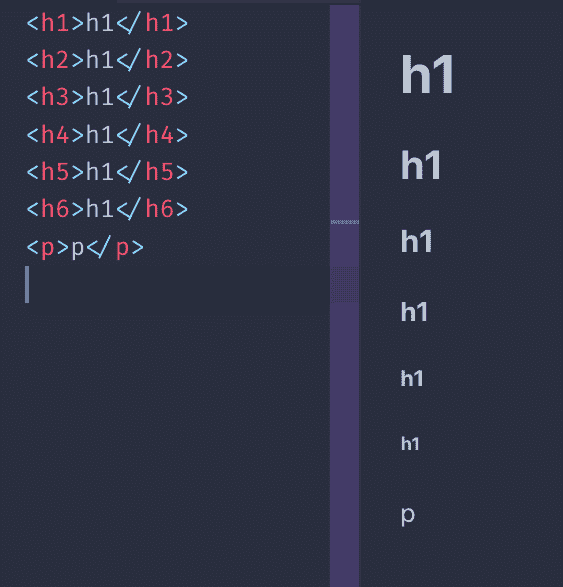**

**所有标题都是块元素。它们不能包含其他元素，只能包含文本。**

## ******`strong`标记******

**这个标签用来标记里面的文字为 **强** 。这很重要，它不是视觉提示，而是语义提示。根据所使用的媒介，其解释会有所不同。**

**默认情况下，浏览器会将该标签中的文本**加粗。****

## ********`em`标记********

**这个标签用来标记里面的文字为 **强调** 。和`strong`一样，不是视觉提示而是语义提示。**

**浏览器默认将此 ****中的文本设为斜体**** 。**

## ******行情******

**HTML 标签对于在文本中插入引用非常有用。**

**默认情况下，浏览器会对`blockquote`元素应用边距。Chrome 应用了 40px 的左右边距和 10px 的上下边距。**

**`q` HTML 标记用于内联报价。**

## ******水平线******

**并不是真正基于文本，但是`hr`标签经常在页面中使用。意思是`horizontal rule`，在页面中加一条横线。**

**用于分隔页面中的各个部分。**

## ******代码块******

**标签对于显示代码特别有用，因为浏览器给了它一种等宽字体。**

**这通常是浏览器唯一做的事情。这是 Chrome 应用的 CSS:**

```
`code {
    font-family: monospace;
}` 
```

**这个标签通常包装在一个`pre`标签中，因为`code`元素忽略空白和换行符。喜欢`p`的标签。**

**Chrome 给了`pre`这个默认样式:**

```
`pre {
    display: block;
    font-family: monospace;
    white-space: pre;
    margin: 1em 0px;
}` 
```

**这防止空白折叠并使其成为块元素。**

## ******列出了******

**我们有 3 种类型的列表:**

*   **无序列表**
*   **有序列表**
*   **定义列表**

**无序列表是使用`ul`标签创建的。列表中的每个项目都创建有`li`标签:**

```
`<ul>
    <li>First</li>
    <li>Second</li>
</ul>` 
```

**有序列表是相似的，只是使用了`ol`标签:**

```
`<ol>
    <li>First</li>
    <li>Second</li>
</ol>` 
```

**两者的区别在于，有序列表的每个项目前都有一个数字:**

**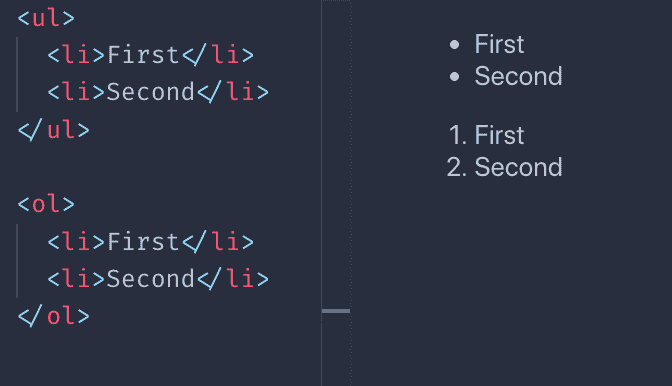**

**定义列表有点不同。你有一个术语，它的定义是:**

```
`<dl>
    <dt>Flavio</dt>
    <dd>The name</dd>
    <dt>Copes</dt>
    <dd>The surname</dd>
</dl>` 
```

**浏览器通常是这样呈现它们的:**

**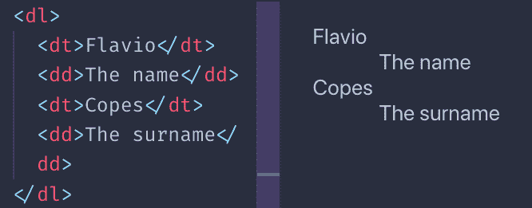**

**我必须说你很少在野外看到它们，当然没有`ul`和`ol`那么多，但有时它们可能是有用的。**

## ******其他文字标签******

**有许多标签用于表示目的:**

*   **`mark`标签**
*   **`ins`标签**
*   **`del`标签**
*   **`sup`标签**
*   **`sub`标签**
*   **`small`标签**
*   **`i`标签**
*   **`b`标签**

**这是浏览器默认应用的可视化渲染示例:**

**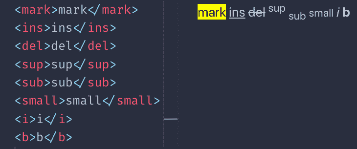**

**你可能想知道，`b`和`strong`有什么不同？`i`和`em`有什么不同？**

**区别在于语义上。当`b`和`i`直接提示浏览器将一段文本加粗或斜体时，`strong`和`em`赋予文本特殊的含义，并由浏览器给出样式。默认情况下，这恰好与`b`和`i`完全相同。虽然你可以用 CSS 来改变它。**

**还有许多其他不常用的与文本相关的标签。我只是提到了我看到的最常用的方法。**

# **链接**

**使用`a`标签定义链接。链接目的地通过它的`href`属性设置。**

**示例:**

```
`<a href="https://flaviocopes.com">click here</a>` 
```

**在开始和结束标签之间，我们有链接文本。**

**上面的例子是一个绝对的 URL。链接也适用于相对 URL:**

```
`<a href="/test">click here</a>` 
```

**在这种情况下，当点击链接时，用户移动到当前原点的`/test` URL。**

**小心使用`/`字符。如果省略，浏览器将只把`test`字符串添加到当前 URL，而不是从原点开始。**

**例如，我在页面`https://flaviocopes.com/axios/`上，我有这些链接:**

*   **`/test`点击一次会将我带到`https://flaviocopes.com/test`**
*   **`test`点击一次会将我带到`https://flaviocopes.com/axios/test`**

**链接标签可以包含其他内容，不仅仅是文本。例如，图像:**

```
`<a href="https://flaviocopes.com">
    
</a>` 
```

**或者任何其他元素，除了其他`<a>`标签。**

**如果您想在新标签页中打开链接，您可以使用`target`属性:**

```
`<a href="https://flaviocopes.com" target="_blank">open in new tab</a>` 
```

# ******容器标签和页面结构 HTML******

## ******集装箱标签******

**HTML 提供了一组容器标签。这些标签可以包含一组未指定的其他标签。**

**我们有:**

*   **`article`**
*   **`section`**
*   **`div`**

**理解它们之间的区别可能会令人困惑。**

**让我们看看何时使用它们中的每一个。**

### ******`article`******

**文章标签标识一个 **事物** ，可以独立于页面中的其他 **事物** 。**

**例如主页中的博客帖子列表。**

**或者链接列表。**

```
`<div>
    <article>
        <h2>A blog post</h2>
        <a ...>Read more</a>
    </article>
    <article>
        <h2>Another blog post</h2>
        <a ...>Read more</a>
    </article>
</div>` 
```

**我们不局限于列表:一篇文章可以是页面中的主要元素。**

```
`<article>
    <h2>A blog post</h2>
    <p>Here is the content...</p>
</article>` 
```

**在一个`article`标签中，我们应该有一个标题(`h1` - `h6`)和**

### ******`section`******

**代表文档的一部分。每一节都有一个标题标记(`h1` - `h6`)，然后是节体*。***

***示例:***

```
*`<section>
    <h2>A section of the page</h2>
    <p>...</p>
    
</section>`* 
```

***将一篇长文分成不同的 ****段**** 很有用。***

***不应用作通用容器元素。`div`就是为此而生。***

### *******`div`*******

***`div`是通用容器元素:***

```
*`<div>
    ...
</div>`* 
```

***您通常会向该元素添加一个`class`或`id`属性，以允许使用 CSS 对其进行样式化。***

***我们在任何需要容器但现有标签不适合的地方使用`div`。***

## *******标签与**** 页面相关***

### *******`nav`*******

***该标记用于创建定义页面导航的标记。我们通常会添加一个`ul`或`ol`列表:***

```
*`<nav>
    <ol>
        <li><a href="/">Home</a></li>
        <li><a href="/blog">Blog</a></li>
    </ol>
</nav>`* 
```

### *******`aside`*******

***`aside`标签用于添加一条与主内容相关的内容。***

***例如，添加报价的框。或者侧边栏。***

***示例:***

```
*`<div>
  <p>some text..</p>
  <aside>
    <p>A quote..</p>
  </aside>
  <p>other text...</p>
</div>`* 
```

***使用`aside`是一个信号，表明它包含的东西不是它所在部分的常规流程的一部分。***

### *******`header`*******

***标签代表页面的一部分，即介绍。例如，它可以包含一个或多个标题标签(`h1` - `h6`)、文章的标语、图像。***

```
*`<article>
  <header>
      <h1>Article title</h1>
  </header>
  ...
</div>`* 
```

### *******`main`*******

***标签代表了页面的主要部分:***

```
*`<body>
  ....
  <main>
    <p>....</p>
  </main>
</body>`* 
```

### *******`footer`*******

***`footer`标签用于确定文章的页脚，或页面的页脚:***

```
*`<article>
 ....
  <footer>
    <p>Footer notes..</p>
  </footer>
</div>`*
```

# *******表格*******

***表单是您与网页或应用程序交互的方式，它是用 Web 技术构建的。***

***您有一组控件，当您提交表单时，无论是单击“提交”按钮还是以编程方式，浏览器都会将数据发送到服务器。***

***默认情况下，这种数据发送会导致页面在数据发送后重新加载，但是使用 JavaScript 可以改变这种行为(在本书中不会解释如何改变)。***

***使用`form`标签创建一个表单:***

```
*`<form>
    ...
</form>`* 
```

***默认情况下，使用 GET HTTP 方法提交表单。这有它的缺点，通常你想用 POST。***

***您可以使用`method`属性将表单设置为在提交时使用 POST:***

```
*`<form method="POST">
    ...
</form>`* 
```

***使用 GET 或 POST 将表单提交到它所在的 URL。***

***因此，如果表单在`https://flaviocopes.com/contacts`页面中，按下“提交”按钮将向同一个 URL 发出请求。***

***可能什么都不会发生。***

***您需要一些服务器端的东西来处理请求，通常您会在一个专用的 URL 上“监听”那些表单提交事件。***

***您可以通过`action`参数指定 URL:***

```
*`<form action="/new-contact" method="POST">
    ...
</form>`* 
```

***这将导致浏览器使用 POST 向同一原点上的`/new-contact` URL 提交表单数据。***

***如果来源(协议+域+端口)是`https://flaviocopes.com`(默认端口 80)，这意味着表单数据将被发送到`https://flaviocopes.com/new-contact`。***

***我谈到了数据。哪些数据？***

***用户通过 Web 平台上的一组控件提供数据:***

*   ***输入框(单行文本)***
*   ***文本区域(多行文本)***
*   ***选择框(从下拉菜单中选择一个选项)***
*   ***单选按钮(从始终可见的列表中选择一个选项)***
*   ***复选框(选择零个、一个或多个选项)***
*   ***文件上传***
*   ***还有更多！***

***让我们在下面的表单域概述中逐一介绍它们。***

## *******`input`标记*******

***`input`字段是使用最广泛的表单元素之一。这也是一个非常通用的元素，它可以基于`type`属性完全改变行为。***

***默认行为是单行文本输入控件:***

```
*`<input>`* 
```

***相当于使用:***

```
*`<input type="text">`* 
```

***与后面的所有其他字段一样，您需要为字段指定一个名称，以便在提交表单时将其内容发送到服务器:***

```
*`<input type="text" name="username">`* 
```

***当字段为空时，`placeholder`属性用于以浅灰色显示一些文本。向用户添加键入内容的提示很有用:***

```
*`<input type="text" name="username" placeholder="Your username">`* 
```

### *******邮箱*******

***使用`type="email"`将在提交前验证客户端(在浏览器中)电子邮件的正确性(语义正确性，不确保电子邮件地址存在)。***

```
*`<input type="email" name="email" placeholder="Your email">`* 
```

### *******密码*******

***使用`type="password"`将使输入的每个键都显示为星号(*)或圆点，这对保存密码的字段很有用。***

```
*`<input type="password" name="password" placeholder="Your password">`* 
```

### *******数字*******

***您可以让 input 元素只接受数字:***

```
*`<input type="number" name="age" placeholder="Your age">`* 
```

***您可以指定可接受的最小值和最大值:***

```
*`<input type="number" name="age" placeholder="Your age" min="18" max="110">`* 
```

***`step`属性有助于识别不同值之间的步长。例如，它接受 10 到 50 之间的值，步长为 5:***

```
*`<input type="number" name="a-number"  min="10" max="50" step="5">`* 
```

### *******隐藏领域*******

***可以对用户隐藏字段。在提交表单时，它们仍将被发送到服务器:***

```
*`<input type="hidden" name="some-hidden-field" value="some-value">`* 
```

***这通常用于存储值，如 CSRF 令牌，用于安全和用户识别，甚至使用特殊技术检测发送垃圾邮件的机器人。***

***它也可以仅仅用来识别一个表单和它的动作。***

### *******设定默认值*******

***所有这些字段都接受预定义的值。如果用户不更改它，这将是发送到服务器的值:***

```
*`<input type="number" name="age" value="18">`* 
```

***如果设置了占位符，该值将在用户清除输入字段值时出现:***

```
*`<input type="number" name="age" placeholder="Your age" value="18">`* 
```

## *******表单提交*******

***`type="submit"`字段是一个按钮，一旦用户按下，就提交表单:***

```
*`<input type="submit">`* 
```

***`value`属性设置按钮上的文本，如果缺少该属性，则显示“提交”文本:***

```
*`<input type="submit" value="Click me">`* 
```

## *******表单验证*******

***浏览器为表单提供客户端验证功能。***

***您可以根据需要设置字段，确保它们被填充，并为每个字段的输入强制执行特定的格式。***

***让我们看看两个选项。***

### *******根据需要设置字段*******

***`required`属性帮助您进行验证。如果未设置该字段，客户端验证将失败，并且浏览器不会提交表单:***

```
*`<input type="text" name="username" required>`* 
```

### *******强制执行特定格式*******

***我在上面描述了`type="email"`字段。它会根据规范中设置的格式自动验证电子邮件地址。***

***在`type="number"`字段中，我提到了`min`和`max`属性，将输入的值限制在一个区间内。***

***你可以做得更多。***

***您可以对任何字段强制使用特定的格式。***

***`pattern`属性使您能够设置一个正则表达式来验证值。***

***我推荐在 flaviocopes.com/javascript-regular-expressions/阅读我的正则表达式指南。***

***pattern=" [https://。*](https://.%2A/) "***

```
*`<input type="text" name="username" pattern="[a-zA-Z]{8}">`* 
```

## *******其他字段*******

### *******文件上传*******

***您可以从本地计算机加载文件，并使用`type="file"`输入元素将它们发送到服务器:***

```
*`<input type="file" name="secret-documents">`* 
```

***您可以附加多个文件:***

```
*`<input type="file" name="secret-documents" multiple>`* 
```

***您可以使用`accept`属性指定一个或多个允许的文件类型。这接受图像:***

```
*`<input type="file" name="secret-documents" accept="image/*">`* 
```

***你可以使用特定的 MIME 类型，比如`application/json`或者设置一个文件扩展名，比如`.pdf`。或者设置多个文件扩展名，如下所示:***

```
*`<input type="file" name="secret-documents" accept=".jpg, .jpeg, .png">`* 
```

### *******按钮*******

***`type="button"`输入字段可用于向表单添加额外的按钮，而不是提交按钮:***

```
*`<input type="button" value="Click me">`* 
```

***它们用于使用 JavaScript 以编程方式做一些事情。***

***有一个呈现为按钮的特殊字段，它的特殊操作是清除整个表单并将字段的状态恢复到初始状态:***

```
*`<input type="reset">`* 
```

### *******单选按钮*******

***单选按钮用于创建一组选项，其中一个被按下，所有其他的被禁用。***

***这个名字来自有这种接口的老式汽车收音机。***

***您定义了一组`type="radio"`输入，所有输入都具有相同的`name`属性和不同的`value`属性:***

```
*`<input type="radio" name="color" value="yellow">
<input type="radio" name="color" value="red">
<input type="radio" name="color" value="blue">`* 
```

***一旦表单被提交，`color`数据属性将只有一个值。***

***总是有一个元素被选中。第一项是默认选中的项目。***

***您可以使用`checked`属性设置预先选择的值。每个无线电输入组只能使用一次。***

### *******复选框*******

***类似于单选按钮，但是它们允许选择多个值，或者根本不选择任何值。***

***您定义了一组`type="checkbox"`输入，所有输入都具有相同的`name`属性和不同的`value`属性:***

```
*`<input type="checkbox" name="color" value="yellow">
<input type="checkbox" name="color" value="red">
<input type="checkbox" name="color" value="blue">`* 
```

***默认情况下，所有这些复选框都不会被选中。使用`checked`属性在页面加载时启用它们。***

***由于此输入字段允许多个值，因此在表单提交时，这些值将作为数组发送到服务器。***

### *******日期和时间*******

***我们有一些输入类型来接受日期值。***

***`type="date"`输入字段允许用户输入日期，并在需要时显示日期选择器:***

```
*`<input type="date" name="birthday">`* 
```

***`type="time"`输入字段允许用户输入时间，并在需要时显示时间选择器:***

```
*`<input type="time" name="time-to-pickup">`* 
```

***`type="month"`输入栏允许用户输入月份和年份:***

```
*`<input type="month" name="choose-release-month">`* 
```

***`type="week"`输入字段允许用户输入星期和年份:***

```
*`<input type="week" name="choose-week">`* 
```

***所有这些字段都允许限制每个值之间的范围和步长。我建议查看 MDN，了解关于它们的用法的小细节。***

***`type="datetime-local"`字段允许您选择日期和时间。***

```
*`<input type="datetime-local" name="date-and-time">`* 
```

***这里有一个页面来测试它们:[https://codepen.io/flaviocopes/pen/ZdWQPm](https://codepen.io/flaviocopes/pen/ZdWQPm)***

### *******颜色选择器*******

***您可以让用户使用`type="color"`元素选择一种颜色:***

```
*`<input type="color" name="car-color">`* 
```

***使用`value`属性设置默认值:***

```
*`<input type="color" name="car-color" value="#000000">`* 
```

***浏览器将负责向用户显示颜色选择器。***

### *******范围*******

***这个输入元素显示了一个滑块元素。人们可以用它从一个起始值移动到一个结束值:***

```
*`<input type="range" name="age" min="0" max="100" value="30">`* 
```

***您可以提供一个可选步骤:***

```
*`<input type="range" name="age" min="0" max="100" value="30" step="10">`* 
```

### *******电话*******

***`type="tel"`输入栏用于输入电话号码:***

```
*`<input type="tel" name="telephone-number">`* 
```

***使用`tel`而不是`text`的主要卖点是在移动设备上，设备可以选择显示数字键盘。***

***为附加验证指定一个`pattern`属性:***

```
*`<input type="tel" pattern="[0-9]{3}-[0-9]{8}" name="telephone-number">`* 
```

### *******网址*******

***`type="url"`字段用于输入 URL。***

```
*`<input type="url" name="website">`* 
```

***您可以使用`pattern`属性来验证它:***

```
*`<input type="url" name="website"  pattern="https://.*">`* 
```

## *******`textarea`标记*******

***元素允许用户输入多行文本。与`input`相比，它需要一个结束标签:***

```
*`<textarea></textarea>`* 
```

***您可以使用 CSS 设置尺寸，但也可以使用`rows`和`cols`属性:***

```
*`<textarea rows="20" cols="10"></textarea>`* 
```

***与其他表单标签一样，`name`属性决定了发送到服务器的数据的名称:***

```
*`<textarea name="article"></textarea>`* 
```

## *******`select`标记*******

***这个标签用来创建一个下拉菜单。***

***用户可以选择可用的选项之一。***

***每个选项都是使用`option`标签创建的。向选择添加一个名称，并向每个选项添加一个值:***

```
*`<select name="color">
    <option value="red">Red</option>
    <option value="yellow">Yellow</option>
</select>`* 
```

***您可以将选项设置为禁用:***

```
*`<select name="color">
    <option value="red" disabled>Red</option>
    <option value="yellow">Yellow</option>
</select>`* 
```

***您可以有一个空选项:***

```
*`<select name="color">
    <option value="">None</option>
    <option value="red">Red</option>
    <option value="yellow">Yellow</option>
</select>`* 
```

***可以使用`optgroup`标签对选项进行分组。每个选项组都有一个`label`属性:***

```
*`<select name="color">
    <optgroup label="Primary">
        <option value="red">Red</option>
        <option value="yellow">Yellow</option>
        <option value="blue">Blue</option>
    </optgroup>
    <optgroup label="Others">
        <option value="green">Green</option>
        <option value="pink">Pink</option>
    </optgroup>
</select>`* 
```

# *******表*******

***在网络的早期，桌子是建筑布局中非常重要的一部分。***

***后来它们被 CSS 和它的布局功能所取代，今天我们有了像 CSS Flexbox 和 CSS Grid 这样强大的工具来构建布局。桌子现在只是用来，猜猜看，造桌子！***

### *******`table`标记*******

***使用`table`标签定义一个表格:***

```
*`<table>

</table>`* 
```

***在表中，我们将定义数据。我们根据行进行推理，这意味着我们向表中添加行(而不是列)。我们将在一行中定义列。***

### *******行*******

***使用`tr`标签添加一行，这是我们唯一可以添加到`table`元素中的东西:***

```
*`<table>
  <tr></tr>
  <tr></tr>
  <tr></tr>
</table>`* 
```

***这是一个有三排的桌子。***

***第一排 **可以** 起表头的作用。***

### *******列标题*******

***表格标题包含列的名称，通常以粗体显示。***

***想象一个 Excel / Google Sheets 文档。顶部`A-B-C-D...`标题。***

***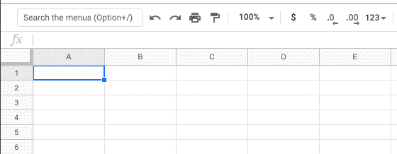***

***我们使用`th`标签定义头部:***

```
*`<table>
  <tr>
    <th>Column 1</th>
    <th>Column 2</th>
    <th>Column 3</th>
  </tr>
  <tr></tr>
  <tr></tr>
</table>`* 
```

### *******表内容*******

***表格的内容是在其他`tr`元素中使用`td`标记定义的:***

```
*`<table>
  <tr>
    <th>Column 1</th>
    <th>Column 2</th>
    <th>Column 3</th>
  </tr>
  <tr>
    <td>Row 1 Column 1</td>
    <td>Row 1 Column 2</td>
    <td>Row 1 Column 3</td>
  </tr>
  <tr>
    <td>Row 2 Column 1</td>
    <td>Row 2 Column 2</td>
    <td>Row 2 Column 3</td>
  </tr>
</table>`* 
```

***如果不添加任何 CSS 样式，浏览器会这样呈现它:***

***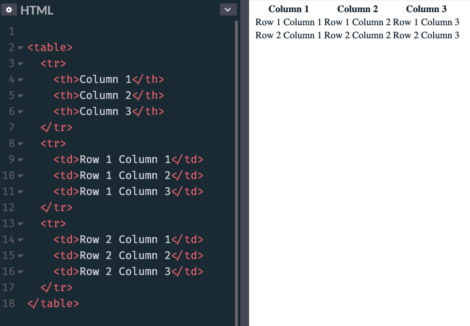***

***添加此 CSS:***

```
*`th, td {
  padding: 10px;
  border: 1px solid #333;
}`* 
```

***让桌子看起来更像一张真正的桌子:***

***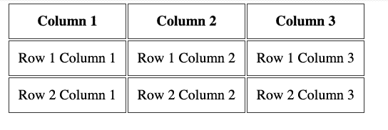***

### *******跨越列和行*******

***使用`colspan`属性，一行可以决定跨越两列或更多列:***

```
*`<table>
  <tr>
    <th>Column 1</th>
    <th>Column 2</th>
    <th>Column 3</th>
  </tr>
  <tr>
    <td colspan="2">Row 1 Columns 1-2</td>
    <td>Row 1 Column 3</td>
  </tr>
  <tr>
    <td colspan="3">Row 2 Columns 1-3</td>
  </tr>
</table>`* 
```

***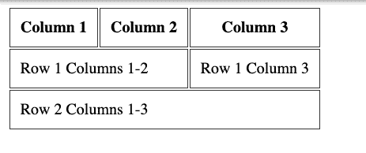***

***或者它可以跨越 2 行或更多行，使用`rowspan`属性:***

```
*`<table>
  <tr>
    <th>Column 1</th>
    <th>Column 2</th>
    <th>Column 3</th>
  </tr>
  <tr>
    <td colspan="2" rowspan="2">Rows 1-2 Columns 1-2</td>
    <td>Row 1 Column 3</td>
  </tr>
  <tr>
    <td>Row 2 Column 3</td>
  </tr>
</table>`* 
```

***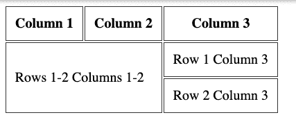***

### *******行标题*******

***在我解释如何在表格的第一个`tr`标签中使用`th`标签来创建列标题之前。***

***您可以添加一个`th`标签作为不是表格第一个`tr`的`tr`内的第一个元素，以获得行标题:***

```
*`<table>
  <tr>
    <th></th>
    <th>Column 2</th>
    <th>Column 3</th>
  </tr>
  <tr>
    <th>Row 1</th>
    <td>Col 2</td>
    <td>Col 3</td>
  </tr>
  <tr>
    <th>Row 2</th>
    <td>Col 2</td>
    <td>Col 3</td>
  </tr>
</table>`* 
```

***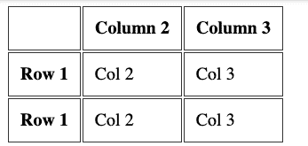***

### *******更多标签组织表格*******

***您可以在表格中再添加 3 个标签，让表格更有条理。***

***当使用大桌子时，这是最好的。并正确定义页眉和页脚。***

***这些标签是***

*   ***`thead`***
*   ***`tbody`***
*   ***`tfoot`***

***它们包装了`tr`标签来清楚地定义表格的不同部分。这里有一个例子:***

```
*`<table>
  <thead>
    <tr>
      <th></th>
      <th>Column 2</th>
      <th>Column 3</th>
    </tr>
  </thead>
  <tbody>
    <tr>
      <th>Row 1</th>
      <td>Col 2</td>
      <td>Col 3</td>
    </tr>
    <tr>
      <th>Row 2</th>
      <td>Col 2</td>
      <td>Col 3</td>
    </tr>
  </tbody>
  <tfoot>
    <tr>
      <td></td>
      <td>Footer of Col 1</td>
      <td>Footer of Col 2</td>
    </tr>
  </tfoot>
</table>`* 
```

***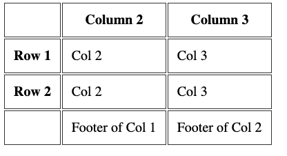***

## *******表格标题*******

***表格应该有一个描述其内容的`caption`标签。该标签应紧接在开始的`table`标签之后:***

```
*`<table>
  <caption>Dogs age</caption>
  <tr>
    <th>Dog</th>
    <th>Age</th>
  </tr>
  <tr>
    <td>Roger</td>
    <td>7</td>
  </tr>
</table>`* 
```

# *******多媒体标签:`AUDIO``VIDEO`*******

***在这一节中，我将向您展示`audio`和`video`标签。***

## *******`audio`标记*******

***这个标签允许你在 HTML 页面中嵌入音频内容。***

***这个元素可以流音频，可能通过`getUserMedia()`使用麦克风，或者它可以播放您使用`src`属性引用的音频源:***

```
*`<audio src="file.mp3">`* 
```

***默认情况下，浏览器不显示此元素的任何控件。这意味着音频只有在设置为自动播放(稍后会详细介绍)时才会播放，用户看不到如何停止播放或控制音量或在音轨间移动。***

***为了显示内置控件，您可以添加`controls`属性:***

```
*`<audio src="file.mp3" controls>`* 
```

***控件可以有自定义外观。***

***您可以使用`type`属性指定音频文件的 MIME 类型。如果未设置，浏览器将尝试自动确定它:***

```
*`<audio src="file.mp3" controls type="audio/mpeg">`* 
```

***默认情况下，音频文件不会自动播放。添加`autoplay`属性自动播放音频:***

```
*`<audio src="file.mp3" controls autoplay>`* 
```

***注意:移动浏览器不允许自动播放***

***`loop`属性如果设置，则在 0:00 重新开始音频播放；否则，如果不存在，音频将在文件结尾停止:***

```
*`<audio src="file.mp3" controls autoplay loop>`* 
```

***您还可以使用`muted`属性播放静音的音频文件(不确定这有什么用):***

```
*`<audio src="file.mp3" controls autoplay loop muted>`* 
```

***使用 JavaScript，您可以监听发生在`audio`元素上的各种事件，其中最基本的有:***

*   ***`play`文件开始播放时***
*   ***`pause`当音频播放暂停时***
*   ***`playing`当音频从暂停状态恢复时***
*   ***`ended`当到达音频文件的结尾时***

## *******`video`标记*******

***这个标签允许你在 HTML 页面中嵌入视频内容。***

***该元素可以使用网络摄像头通过`getUserMedia()`或**或**WebRTC**T5 传输视频，或者它可以播放您使用`src`属性引用的视频源:*****

```
*`<video src="file.mp4">`* 
```

***默认情况下，浏览器不显示该元素的任何控件，只显示视频。***

***这意味着视频只有在设置为自动播放(稍后会详细介绍)时才会播放，用户看不到如何停止、暂停、控制音量或跳到视频中的特定位置。***

***为了显示内置控件，您可以添加`controls`属性:***

```
*`<video src="file.mp4" controls>`* 
```

***控件可以有自定义外观。***

***您可以使用`type`属性指定视频文件的 MIME 类型。如果未设置，浏览器将尝试自动确定它:***

```
*`<video src="file.mp4" controls type="video/mp4">`* 
```

***默认情况下，视频文件不会自动播放。添加`autoplay`属性自动播放视频:***

```
*`<video src="file.mp4" controls autoplay>`* 
```

***有些浏览器还需要`muted`属性来自动播放。视频仅在静音时自动播放:***

```
*`<audio src="file.mp3" controls autoplay muted>`* 
```

***如果设置了`loop`属性，则在 0:00 重新开始播放视频；否则，如果不存在，视频将在文件结尾停止:***

```
*`<video src="file.mp4" controls autoplay loop>`* 
```

***您可以将图像设置为海报图像:***

```
*`<video src="file.mp4" poster="picture.png">`* 
```

***如果不存在，浏览器将在视频的第一帧可用时立即显示。***

***您可以设置`width`和`height`属性来设置元素将占用的空间，以便浏览器可以考虑它，并且当它最终加载时不会改变布局。它采用一个以像素表示的数值。***

***使用 JavaScript，您可以监听发生在`video`元素上的各种事件，其中最基本的有:***

*   ***`play`文件开始播放时***
*   ***`pause`当视频暂停时***
*   ***`playing`当视频从暂停状态恢复时***
*   ***`ended`当到达视频文件的结尾时***

# *******IFRAMES*******

***标签允许我们将来自其他来源(其他网站)的内容嵌入到我们的网页中。***

***从技术上讲，iframe 创建了一个新的嵌套浏览上下文。这意味着 iframe 中的任何内容都不会干扰父页面，反之亦然。JavaScript 和 CSS 不会“泄漏”到 iframess 或从 iframe“泄漏”出来。***

***许多站点使用 iframes 来完成各种事情。你可能熟悉 Codepen、Glitch 或其他允许你在页面的一部分编码的网站，你会在一个框中看到结果。那是一个 iframe。***

***您可以这样创建一个:***

```
*`<iframe src="page.html"></iframe>`* 
```

***您也可以加载绝对 URL:***

```
*`<iframe src="https://site.com/page.html"></iframe>`* 
```

***您可以设置一组宽度和高度参数(或使用 CSS 设置它们),否则 iframe 将使用默认的 300x150 像素的框:***

```
*`<iframe src="page.html" width="800" height="400"></iframe>`* 
```

## *******Srcdoc*******

***属性让您指定一些要显示的内联 HTML。它是`src`的替代产品，但最近在 Edge 18 和更低版本中不受支持，在 IE:***

```
*`<iframe srcdoc="<p>My dog is a good dog</p>"></iframe>`* 
```

## *******沙盒*******

***属性允许我们限制 iframes 中允许的操作。***

***如果我们省略它，一切都是允许的:***

```
*`<iframe src="page.html"></iframe>`* 
```

***如果我们将其设置为“”，则不允许任何内容:***

```
*`<iframe src="page.html" sandbox=""></iframe>`* 
```

***我们可以通过在`sandbox`属性中添加选项来选择允许什么。您可以通过在中间添加一个空格来允许多个。以下是您可以使用的选项的不完整列表:***

*   ***`allow-forms`:允许提交表单***
*   ***`allow-modals`允许打开模态窗口，包括用 JavaScript 调用`alert()`***
*   ***`allow-orientation-lock`允许锁定屏幕方向***
*   ***使用`window.open()`和`target="_blank"`链接，允许弹出窗口***
*   ***`allow-same-origin`将正在加载的资源视为同一来源***
*   ***让加载的 iframe 运行脚本(但不创建弹出窗口)。***
*   ***`allow-top-navigation`允许顶级浏览上下文访问 iframe***

## *******允许*******

***目前还处于试验阶段，只有基于 Chromium 的浏览器支持，这是父窗口和 iframe 之间资源共享的未来。***

***它类似于`sandbox`属性，但是让我们允许特定的特性，包括:***

*   ***`accelerometer`提供对传感器 API 加速计接口的访问***
*   ***`ambient-light-sensor`提供对传感器 API AmbientLightSensor 接口的访问***
*   ***`autoplay`允许自动播放视频和音频文件***
*   ***`camera`允许从 getUserMedia API 访问摄像机***
*   ***`display-capture`允许使用 getDisplayMedia API 访问屏幕内容***
*   ***`fullscreen`允许进入全屏模式***
*   ***`geolocation`允许访问地理定位 API***
*   ***`gyroscope`访问传感器 API 陀螺仪接口***
*   ***`magnetometer`访问传感器 API 磁力计接口***
*   ***`microphone`使用 getUserMedia API 访问设备麦克风***
*   ***`midi`允许访问网络 MIDI API***
*   ***`payment`允许访问付款申请 API***
*   ***`speaker`允许通过设备扬声器播放音频***
*   ***`usb`提供对 WebUSB API 的访问。***
*   ***`vibrate`访问振动 API***
*   ***`vr`允许访问网络虚拟现实应用编程接口***

## *******引荐者*******

***当加载 iframe 时，浏览器在`Referer`头中向它发送关于谁在加载它的重要信息(注意单个的`r`，这是一个我们必须忍受的拼写错误)。***

***referrer 的拼写错误源于计算机科学家菲利普·哈拉姆-贝克最初的提议，即把该字段合并到 HTTP 规范中。这种拼写错误在被纳入征求意见标准文件 RFC 1945 时就已经是板上钉钉了***

***`referrerpolicy`属性允许我们设置 referrer，以便在加载时发送给 iframe。referrer 是一个 HTTP 头，让页面知道谁在加载它。这些是允许的值:***

*   ***这是默认设置，当当前页面通过 HTTPS 加载并且 iframe 通过 HTTP 协议加载时，不发送引用***
*   ***`no-referrer`不发送引用头***
*   ***`origin`referer 已发送，仅包含来源(端口、协议、域)，不包含默认的来源+路径***
*   ***`origin-when-cross-origin`从 iframe 中的相同来源(端口、协议、域)加载时，会以完整形式(来源+路径)发送引用。否则，只发送原点***
*   ***`same-origin`仅当从 iframe 中的相同来源(端口、协议、域)加载时，才会发送引用***
*   ***如果当前页面通过 HTTPS 加载，并且 iframe 也通过 HTTPS 协议加载，则发送原点作为引用。如果 iframe 是通过 HTTP 加载的，则不发送任何内容***
*   ***`strict-origin-when-cross-origin`在同一原点工作时，发送原点+路径作为引用。如果当前页面通过 HTTPS 加载，并且 iframe 也通过 HTTPS 协议加载，则发送原点作为引用。如果 iframe 是通过 HTTP 加载的，则不发送任何内容***
*   ***`unsafe-url`:即使从 HTTP 加载资源并且当前页面是通过 HTTPS 加载的，也发送 origin + path 作为引用***

# *******画面*******

***可以使用`img`标签显示图像。***

***这个标签接受一个`src`属性，我们用它来设置图像源:***

```
*``* 
```

***我们可以使用大量的图像。最常见的是 PNG，JPEG，GIF，SVG 和最近的 WebP。***

***HTML 标准要求有一个`alt`属性来描述图像。这被屏幕阅读器和搜索引擎机器人使用:***

```
*``* 
```

***您可以设置`width`和`height`属性来设置元素将占用的空间，以便浏览器可以考虑它，并且当它完全加载时不会改变布局。它采用一个以像素表示的数值。***

```
*``* 
```

## *******`figure`标记*******

***标签`figure`通常与标签`img`一起使用。***

***`figure`是一个语义标签，常用于显示带有标题的图像。你像这样使用它:***

```
*`<figure>
    
    <figcaption>A nice dog</figcaption>
</figure>`* 
```

***`figcaption`标签将标题文本换行。***

## *******响应式画面使用`srcset`*******

***根据您的喜好，`srcset`属性允许您根据像素密度或窗口宽度设置浏览器可以使用的响应图像。通过这种方式，它可以只下载渲染页面所需的资源，而不需要下载更大的图像，例如，如果是在移动设备上。***

***下面是一个例子，我们针对 4 种不同的屏幕尺寸给出了 4 幅额外的图像:***

```
*``* 
```

***在`srcset`中，我们使用`w`度量来表示窗口宽度。***

***既然我们这样做了，我们还需要使用`sizes`属性:***

```
*``* 
```

***在这个例子中，`sizes`属性中的`(max-width: 500px) 100vw, (max-width: 900px) 50vw, 800px`字符串描述了图像相对于视窗的大小，多个条件用分号分隔。***

***媒体条件`max-width: 500px`设置与视窗宽度相关的图像尺寸。简而言之，如果窗口大小为< 500px，它会以窗口大小的 100%渲染图像。***

***如果窗口尺寸较大但<`900px`，它会以窗口尺寸的 50%渲染图像。***

***如果更大，它会以 800 像素的分辨率呈现图像。***

***`vw`度量单位对你来说可能很陌生，简而言之，我们可以说 1 `vw`是窗口宽度的 1%，所以`100vw`是窗口宽度的 100%。***

***一个有用的生成`srcset`和逐渐变小的图片的网站是[https://responsivebreakpoints.com/](https://responsivebreakpoints.com/)。***

## *******`picture`标记*******

***HTML 也给了我们`picture`标签，它做的工作和`srcset`非常相似，区别非常微妙。***

***当你想彻底改变一个文件，而不是仅仅提供一个较小的版本时，你可以使用`picture`。或者提供不同的图像格式。***

***我发现的最佳用例是在提供 WebP 图像时，这是一种仍然没有得到广泛支持的格式。在`picture`标签中，您指定了一个图像列表，它们将按顺序使用，因此在下一个例子中，支持 WebP 的浏览器将使用第一个图像，如果不支持，则退回到 JPG:***

```
*`<picture>
  <source type="image/webp" srcset="image.webp">
  
</picture>`* 
```

***标签为图像定义了一种(或多种)格式。如果浏览器太旧，不支持`picture`标签，那么`img`标签就是备用标签。***

***在`picture`内的`source`标签中，您可以添加一个`media`属性来设置媒体查询。***

***下面的例子类似于上面的例子，带有`srcset`:***

```
*`<picture>
  <source media="(min-width: 500w)" srcset="dog-500.png" sizes="100vw">
  <source media="(min-width: 800w)" srcset="dog-800.png" sizes="100vw">
  <source media="(min-width: 1000w)" srcset="dog-1000.png"    sizes="800px">
  <source media="(min-width: 1400w)" srcset="dog-1400.png"    sizes="800px">
  
</picture>`* 
```

***但这不是它的用例，因为如你所见，它要冗长得多。***

***标签是最近才出现的，但是现在除了 Opera Mini 和 IE(所有版本)之外，所有主流浏览器都支持标签。***

# *******可达性*******

***重要的是，我们在设计 HTML 时要考虑到可访问性。***

***拥有可访问的 HTML 意味着残疾人可以使用网络。有完全失明或视力受损的用户，有听力损失问题的人和许多其他不同的残疾。***

***不幸的是，这个话题没有得到应有的重视，看起来也不像其他话题那么酷。***

***如果一个人无法 **看到** 你的页面，却还想消费它的内容怎么办？首先，他们是如何做到的？他们不能使用鼠标，他们使用一种叫做 ****的屏幕阅读器**** 。你不必去想象。你现在就可以尝试一个:谷歌提供免费的 [ChromeVox Chrome 扩展](https://chrome.google.com/webstore/detail/chromevox/kgejglhpjiefppelpmljglcjbhoiplfn/)。可访问性还必须考虑允许工具轻松地选择元素或浏览页面。***

***网页和 Web 应用程序并不总是以可访问性作为他们的首要目标之一，也许第 1 版发布时是不可访问的，但在发布后可以使网页可访问。越快越好，但永远不会太晚。***

***这很重要，在我的国家，政府或其他公共组织建立的网站必须是可访问的。***

***让一个 HTML 具有可访问性意味着什么？我来举例说明你需要考虑的主要事情。***

***注意:还有一些其他的事情需要注意，它们可能会出现在 CSS 主题中，比如颜色、对比度和字体。或者[如何让 SVG 图片可访问](https://css-tricks.com/accessible-svgs/)。我在这里不谈论他们。***

## *******使用语义 HTML*******

***语义 HTML 非常重要，是你需要注意的主要事情之一。让我举例说明几个常见的场景。***

***使用正确的标题标签结构很重要。最重要的是`h1`，你用较高的数字表示不太重要的，但是所有同级的标题应该有相同的意思(把它想象成一个树形结构)***

```
*`h1
    h2
        h3
    h2
    h2
        h3
            h4`* 
```

***用`strong`和`em`代替`b`和`i`。视觉上它们看起来是一样的，但是前两个有更多的含义。`b`和`i`是更多的视觉元素。***

***清单很重要。屏幕阅读器可以检测一个列表并提供一个概览，然后让用户选择是否进入该列表。***

***表格应该有一个描述其内容的`caption`标签:***

```
*`<table>
  <caption>Dogs age</caption>
  <tr>
    <th>Dog</th>
    <th>Age</th>
  </tr>
  <tr>
    <td>Roger</td>
    <td>7</td>
  </tr>
</table>`* 
```

## *******对图像使用`alt`属性*******

***所有图像都必须有一个描述图像内容的`alt`标签。这不仅仅是一个好的实践，它是 HTML 标准所要求的，没有它的 HTML 是不会被验证的。***

```
*``* 
```

***它对搜索引擎也有好处，如果这是你添加它的动机的话。***

## *******使用`role`属性*******

***属性允许您为页面中的各种元素分配特定的角色。***

***您可以分配许多不同的角色:补充，列表，列表项，主，导航，区域，标签，警报，应用程序，文章，横幅，按钮，单元格，复选框，内容信息，对话框，文档，提要，数字，表格，网格，gridcell，标题，img，列表框，行，行组，搜索，开关，表格，选项卡面板，文本框，计时器。***

***这是一个很大的问题，我给你[这个 MDN 链接](https://developer.mozilla.org/en-US/docs/Web/Accessibility/ARIA/Roles)，作为他们每个人的完整参考。但是您不需要为页面中的每个元素分配一个角色。在大多数情况下，屏幕阅读器可以从 HTML 标记进行推断。例如，你不需要添加一个角色标签到语义标签中，比如`nav`、`button`、`form`。***

***让我们以`nav`标签为例。您可以使用它来定义页面导航，如下所示:***

```
*`<nav>
  <ul>
    <li><a href="/">Home</a></li>
    <li><a href="/blog">Blog</a></li>
  </ul>
</nav>`* 
```

***如果你是 **强迫** 使用`div`标签而不是`nav`，你会使用`navigation`角色:***

```
*`<div role="navigation">
  <ul>
    <li><a href="/">Home</a></li>
    <li><a href="/blog">Blog</a></li>
  </ul>
</div>`* 
```

***所以这里有一个实际的例子:`role`用于在标签没有表达意思的时候指定一个有意义的值。***

## *******使用`tabindex`属性*******

***`tabindex`属性允许您改变按 Tab 键选择“可选”元素的顺序。默认情况下，只有链接和表单元素可以通过使用 Tab 键导航来“选择”(并且您不需要在它们上面设置`tabindex`)。***

***添加`tabindex="0"`使元素可选:***

```
*`<div tabindex="0">
...
</div>`* 
```

***相反，使用`tabindex="-1"`可以从基于选项卡的导航中删除一个元素，这可能非常有用。***

## *******使用`aria`属性*******

***ARIA 是一个首字母缩写词，意思是可访问的富互联网应用程序，并定义了可应用于元素的语义。***

### *******`aria-label`*******

***此属性用于添加描述元素的字符串。***

***示例:***

```
*`<p aria-label="The description of the product">...</p>`* 
```

***我在我的博客侧边栏上使用了这个属性，这里有一个用于搜索的输入框，没有明确的标签，因为它有一个占位符属性。***

### *******`aria-labelledby`*******

***此属性设置当前元素和标记它的元素之间的相关性。***

***如果您知道如何将一个`input`元素与一个`label`元素相关联，那就差不多了。***

***我们传递描述当前元素的项目 id。***

***示例:***

```
*`<h3 id="description">The description of the product</h3>

<p aria-labelledby="description">
...
</p>`* 
```

### *******`aria-describedby`*******

***这个属性让我们将一个元素与另一个作为描述的元素相关联。***

***示例:***

```
*`<button aria-describedby="payNowDescription" >Pay now</button>

<div id="payNowDescription">Clicking the button will send you to our Stripe form!</div>`* 
```

### *******使用 aria-hidden 隐藏内容*******

***我喜欢我的网站极简设计。例如，我的博客大部分都是内容，在侧边栏有一些链接。但是侧边栏中的一些东西只是视觉元素，并不能增加看不到页面的人的体验。比如我的 logo 图片，或者暗/亮主题选择器。***

***添加`aria-hidden="true"`属性将告诉屏幕阅读器忽略该元素。***

## *******去哪里了解更多*******

***这只是对题目的介绍。要了解更多信息，我推荐以下资源:***

*   ***[https://www.w3.org/TR/WCAG20/](https://www.w3.org/TR/WCAG20/)***
*   ***[https://webaim.org](https://webaim.org/)***
*   ***[https://developers . Google . com/web/fundamentals/accessibility/](https://developers.google.com/web/fundamentals/accessibility/)***

* * *

***您已到达 HTML 手册的末尾。***

***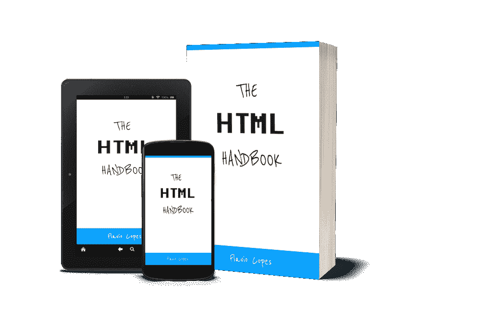***

*****[**点击这里获取本**书的 PDF / ePub / Mobi 版本**离线阅读**！](https://flaviocopes.com/page/html-handbook/)*****