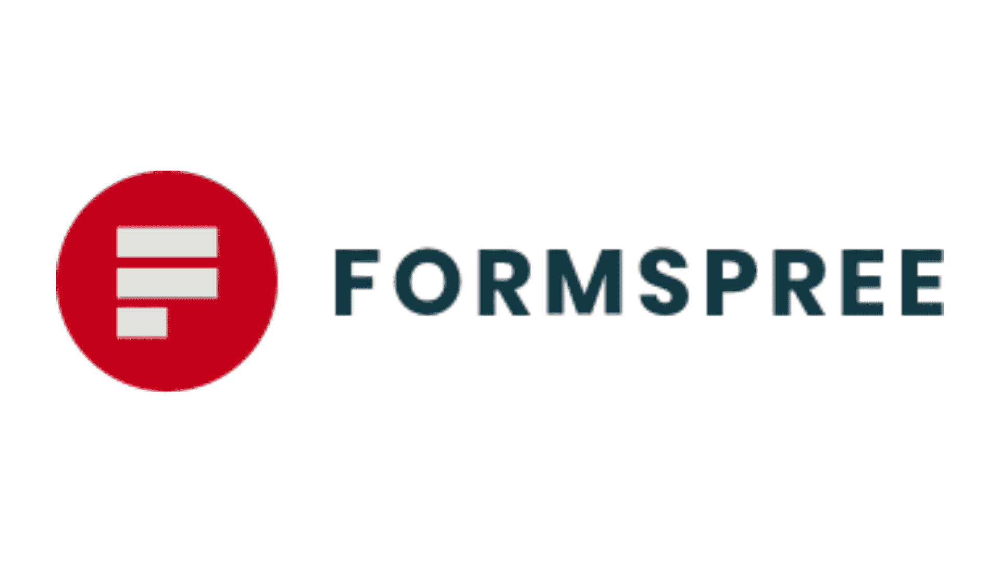
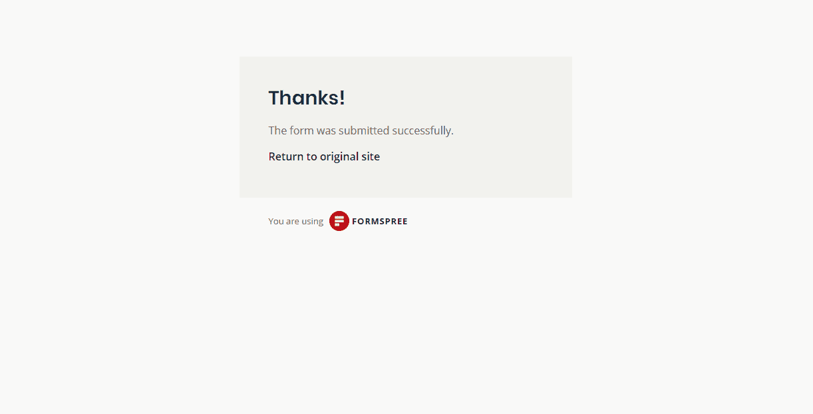
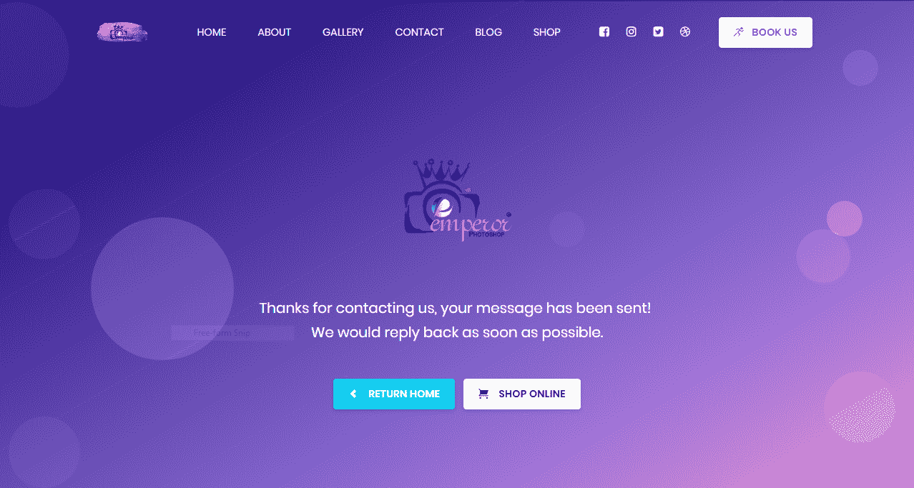
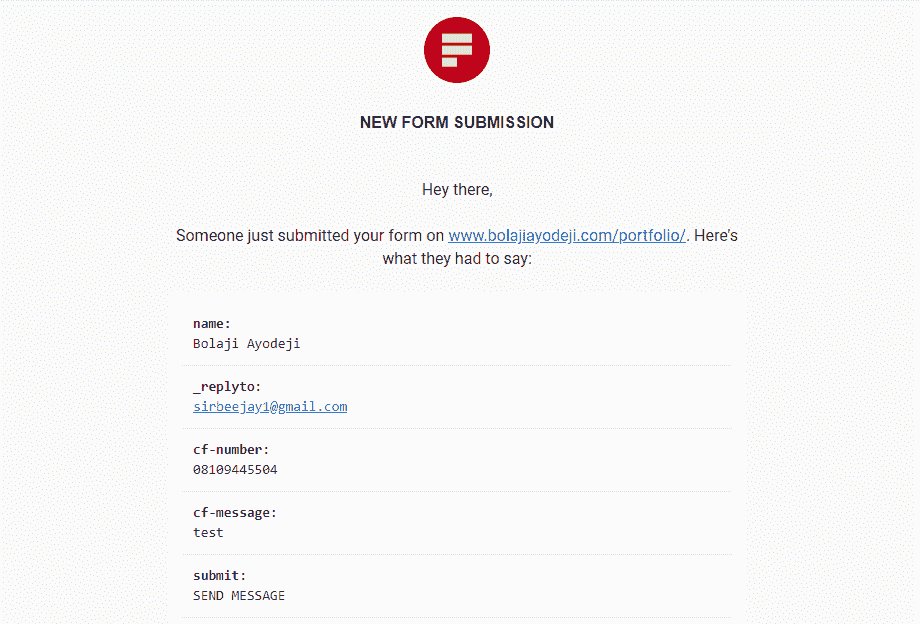
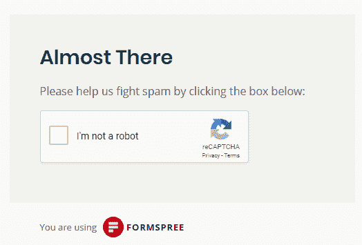
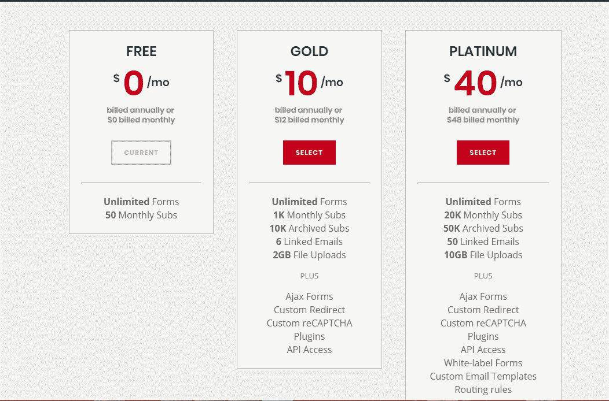
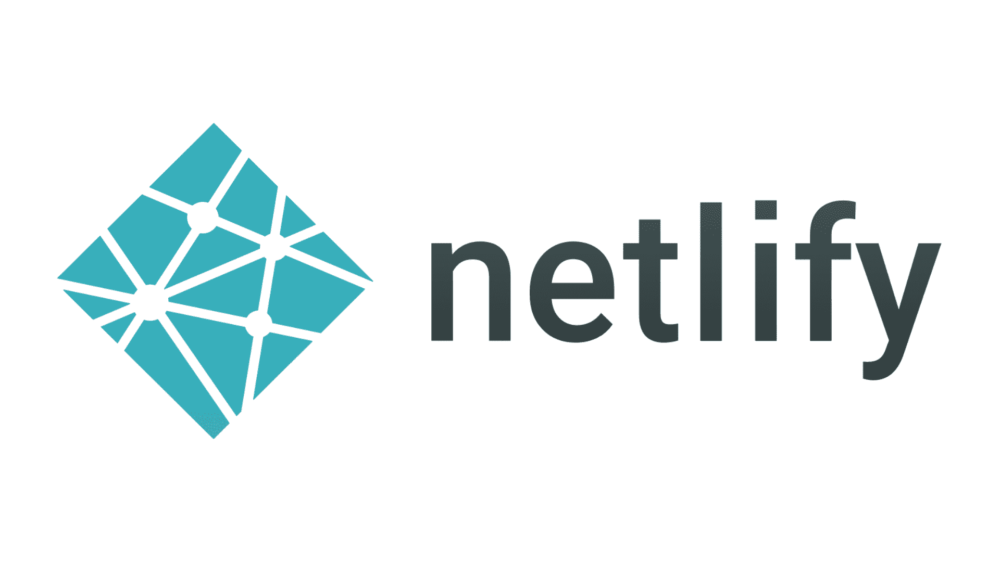
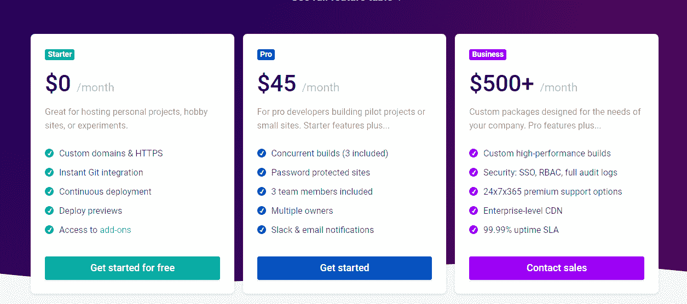
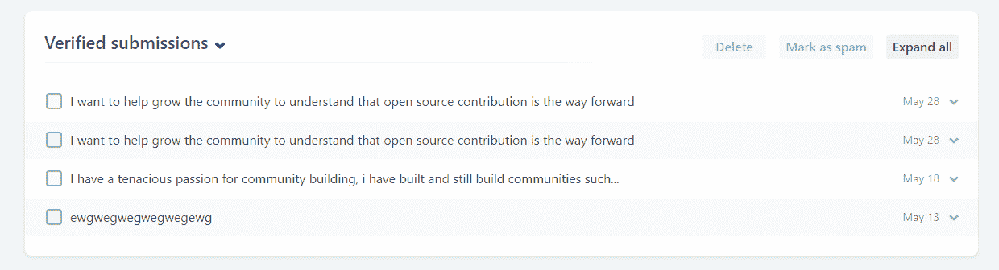

# 如何处理静态表单-客户端方式

> 原文：<https://www.freecodecamp.org/news/handling-static-forms-the-client-side-way/>

表单是交互式元素，用于从用户处获取输入以进行进一步处理。大多数情况下，表单只是用来接收不需要处理的输入，而只是接收数据，这可能是一个联系表单，RSVP，get a quote e.t.c

传统上，表单是在服务器(也称为服务器端)的帮助下管理的，但当您处理表单数据时，这更有效，可能是用户注册表单，其中表单数据被验证、认证并保存在数据库中。

当你创建一个简单的表单，只接收用户的数据而不进行处理时(如联系表单)，目标是从表单中获取数据并发送到你公司的支持电子邮件(如 info@…，support@…)

在这里使用服务器并不理想，只是有点矫枉过正，一种非常常见的方式是通过[PHP mailer](https://github.com/PHPMailer/PHPMailer)(PHP 的经典邮件发送库)。PHPMailer 配合 PHP 使用，需要大量枯燥的服务器配置。如果你只是建立一个静态网站呢？应该有一种更简单的方法来处理客户端，对吗？

在本文中，我将向您介绍在静态站点中处理表单数据客户端的两种方法。还有其他方法，但我已经使用了这两种方法，并认为它们是最好和最简单的(没有恶意:)。

没有忙乱的配置，没有服务器，没有严重的东西，只是建立你的表单，做一些小调整，用户提交，宾果它直接发送到你指定的电子邮件。:)

### 起始形式

出于本文的目的，我已经用 HTML5 和 Bootstrap 4 构建了一个基本表单，您可以从下面的 [Codepen 中派生出来。](https://codepen.io/iambolajiayo/pen/MdGdex)

[https://codepen.io/iambolajiayo/embed/preview/MdGdex?height=300&slug-hash=MdGdex&default-tabs=html,result&host=https://codepen.io](https://codepen.io/iambolajiayo/embed/preview/MdGdex?height=300&slug-hash=MdGdex&default-tabs=html,result&host=https://codepen.io)

目前，这个表单没有使用我们将要讨论的任何方法，在文章的最后，我将提供这两种方法的完整的`code`,然后您可以更新表单并进行测试。我已经添加了一点验证，不用担心

现在，让我们开始吧！！

### 方法一



forms spree 通过其平台提供功能性的 HTML 表单，无需 PHP 或 JavaScript。将您的表格发送到他们的 URL，它将被转发到您的电子邮件中。不需要 PHP、Javascript 或注册——非常适合静态网站！

等等！，等等！！，等等！！！也是[开源的](https://github.com/formspree/formspree)

#### 用 FORMSPREE 处理表单

*   构建你的表单，[我们已经完成了](https://codepen.io/iambolajiayo/pen/MdGdex?editors=1010)

(遵循下一步并更新此表单以使用此方法)

```
<form action="https://formspree.io/you@email.com" method="POST">
    <input type="hidden" name="_subject" value="Bolaji's Form">                 
    <input type="hidden" name="_next" value="/thanks.html" >
    <input type="text" name="name">
    <input type="email" name="_replyto">
    <input type="text" name="phone">
    <input type="submit" value="Send">
</form>
```

现在让我们检查一下上面添加的新内容。

*   我们将表单的动作属性改为`[https://formspree.io/you@email.com](https://formspree.io/you@email.com)`[用你自己的电子邮件替换[your@email.com](mailto:your@email.com)。]这只是将您的表单数据发送到 formspree，然后发送到您的电子邮件。Formspree 在这里充当第三方。
*   我在输入字段中添加了一些名称属性。这只是配置每个字段，以便我们可以获取数据并发送到 formspree。

—对于电子邮件地址，我添加了一个 **_replyto 属性**(这只是意味着，您将能够快速回复最初通过电子邮件提交的用户)

—我添加了一个 **_subject** 属性。该值用于电子邮件的主题，以便您可以快速回复提交的邮件，而不必每次都编辑主题行。

—我添加了一个 **_next** 属性。默认情况下，提交表单后，用户会看到 Formspree“谢谢”页面。您可以为该页面提供一个替代 URL，如下所示:`<input type=”hidden” name=”_next” value=”/thanks.html" />`



formspree default success page



custom success page I built for a client.

*   我们向发送按钮[ **value="Send"** ]添加了一个值属性

这是我们的灭霸，按一下这个按钮，你的表格就会被删除，数据会发送到你的邮箱。



使用 formspree 就这么多了:)虽然其他几个功能还有其他配置设置，你可以在这里查看[。](https://formspree.io/)

#### 注意事项！

*   你不需要注册使用 formspree，只需添加你的动作属性就可以了。只有当你想要一个[付费计划](https://formspree.io/plans)时，你才注册。
*   确保你的表单有`method=”POST”`属性
*   Formspree 使用 reCAPTCHA 来识别垃圾邮件提交。在用户点击我们的*后，他们必须做一些验证码验证。阻止垃圾邮件提交的酷方法。*

**

*   *之后，表格会发送到您指定的电子邮件地址，并显示定制成功页面！*
*   *Formspree 不读取您的表单数据，他们无法访问这些数据，他们只是一个递送服务，您将包裹密封寄给他们，他们将包裹递送给您的客户，对吗？:)*
*   *Formspree 每月只免费提交 50 份表格！需要更多，可以升级到[付费计划](https://formspree.io/plans)。*
*   *Formspree 有免费和付费两种计划。付费计划有几个其他功能，如管理仪表板，无限提交，AJAX 处理 e.t.c 付费计划和他们的功能可以找到[这里](https://formspree.io/plans)*

**

*如果你正在建立一个基础网站，你不应该担心付费计划，付费计划主要是企业应用程序和公司需要的，免费计划将覆盖你的所有需求。我也为一些客户项目使用这个:)*

*   *Formspree premium 用户可以通过 AJAX 提交表单。只需将 Accept 头设置为 application/json。如果您使用的是 jQuery，可以这样做:*

```
 *`$.ajax({
        url: "https://formspree.io/FORM_ID",
        method: "POST",
        data: {message: "hello!"},
        dataType: "json"
    });`* 
```

*嗯，这个是针对付费用户的:)*

*如果您不像我一样使用 jQUERY，并且厌倦了冗长的 AJAX 默认语法，请查看 [simpleAJAX 库](https://github.com/BolajiAyodeji/simple-ajax-library)，这是我为处理 HTTP 请求而构建的一个简单库。像这样:*

```
*`const http = new simpleAJAX;

const data = {
    "name": "Bolaji Ayodeji",
    "email": "hi@bolajiayodeji.com",
    "message": "hi"
};
http.post('https://formspree.io/FORM_ID', data,
(err, user) => {
    if(err) {
     console.log(err)
    } else {
     console.log(user);
   }
 });`* 
```

*一颗星星会让我快乐！:)*

*如果你喜欢 React， [ZEIT](https://zeit.co/) 有一个关于使用 Formspree 和 [Create React App](https://zeit.co/guides/deploying-react-forms-using-formspree-with-zeit-now) 的全面指南，包括部署说明。强烈推荐！*

### *方法二*

**

*Netlify 为部署在他们平台上的站点提供表单处理。*

#### *用 NETLIFY 处理表单*

*   *在 Netlify 上创建一个帐户，并在那里部署您的站点。*

*如果你不知道什么是 Netlify，请观看下面这个由 [@JamesQuick](https://twitter.com/jamesqquick) 制作的 14 分钟的视频。了解 Netlify 中所有令人惊叹的特性，如持续部署、Lambda 函数、分割测试、预览分支等等！*

 *[https://www.youtube.com/embed/qAUX2A-W4Bc?feature=oembed](https://www.youtube.com/embed/qAUX2A-W4Bc?feature=oembed)* 

*   *现在您已经部署了您的站点，让我们再次创建表单*

```
 *`<form action="/thanks.html" name="Bolaji's form" method="POST" data-netlify="true">
        <input type="text" name="name">
        <input type="email" name="email">
        <input type="text" name="phone">
        <input type="submit">
    </form>`* 
```

*现在让我们回顾一下我在上面添加的新内容。*

*   *Netlify 非常简单，你只需将`netlify`属性`data-netlify="true"`添加到`<form>`标签中，你就可以在你的 Netlify 站点管理面板中开始接收提交的内容。*
*   *在这里，`action`属性充当您的定制成功页面*

*就这样，您提交的表单将直接进入您的网络管理面板*

*设置>构建和部署>环境>环境变量*

*(如果你不明白面板的意思，可以看上面的视频)*

***注意事项！***

*   *您的站点必须托管在 netlify 上才能使用此方法*
*   *必须添加 netlify 属性，表单才能工作*
*   *您可以在站点仪表板的“表单”选项卡中找到所有提交到 Netlify 表单的内容。**设置>表单***
*   *Netlify 也有免费和付费计划*

*

[https://www.netlify.com/pricing](https://www.netlify.com/pricing/#features)* 

*   *Netlify 有几个用于验证表单提交的内置通知选项，包括电子邮件和 Slack 通知。**(仅在付费计划中可用)**。你可以在**设置>表格>表格通知**中找到。*
*   *Netlify 还与 [Zapier](https://zapier.com/app/dashboard) 集成，因此你可以设置触发器，将你验证过的表单提交发送到他们目录中的 500 多个应用程序中的任何一个。*
*   *所有通知电子邮件都从`team@netlify.com`发送，对通知的任何回复都将发送到该地址。如果您想回复表单提交者，您需要手动输入他们的地址。*
*   *Netlify 表单也可以通过表单提交接收文件上传:)。*

*为此，向任何表单添加一个带有`type="file"`的输入。提交表单时，每个上传文件的链接将包含在表单提交详细信息中。*

*   *对于免费计划，Netlify 每月限于 100 次提交和 10MB 上传，如果您想要更多，您需要升级*

*

form submissions in the admin panel* 

*仅此而已！！*

### *最终 HTML 表单代码*

```
*`<!--formspree.html-->

<form action="https://formspree.io/you@email.com" method="POST">
   <input type="hidden" name="_subject" value="Bolaji's Form">                 
   <input type="hidden" name="_next" value="/thanks.html" >
   <div class="form-group">
      <label>Name:</label>
      <input type="text" class="form-control" id="name" placeholder="Name">
      <div class="invalid-feedback">
         Name must be between 2 and 20 characters
      </div>
   </div>
   <div class="form-group">
      <label>Email:</label>
      <input type="text" class="form-control" id="email" placeholder="Email address">
      <div class="invalid-feedback">
         Enter a valid email address
      </div>
   </div>
   <div class="form-group">
      <label>Telephone:</label>
      <input type="text" class="form-control" id="phone" placeholder="Phone number">
      <div class="invalid-feedback">
         Enter a valid number
      </div>
   </div>
   <input type="submit" value="Send" class="btn btn-info btn-block">
</form>`*
```

```
*`<!--netlify.html-->

<form action="/thanks.html" name="Bolaji's form" method="POST" data-netlify="true">
   <div class="form-group">
      <label>Name:</label>
      <input type="text" class="form-control" id="name" placeholder="Name">
      <div class="invalid-feedback">
         Name must be between 2 and 20 characters
      </div>
   </div>
   <div class="form-group">
      <label>Email:</label>
      <input type="text" class="form-control" id="email" placeholder="Email address">
      <div class="invalid-feedback">
         Enter a valid email address
      </div>
   </div>
   <div class="form-group">
      <label>Telephone:</label>
      <input type="text" class="form-control" id="phone" placeholder="Phone number">
      <div class="invalid-feedback">
         Enter a valid number
      </div>
   </div>
   <input type="submit" value="Send" class="btn btn-info btn-block">
</form>`*
```

### *结论*

*关于 formspree 需要注意的一点是，免费版本会将你的电子邮件地址暴露给抓取工具和机器人，所以你可能需要在使用它时设置一个临时的一次性电子邮件地址。如果你想在默认情况下隐藏你的电子邮件地址，你需要升级你的计划。*

*你想要额外的练习吗？观看下面由 Brad Traversy 制作的教程视频，学习如何使用 Netlify 表单功能(包括文件上传和垃圾邮件过滤)向您的网站添加联系人或任何类型的表单。【全指南+实用代码】*

 *[https://www.youtube.com/embed/6ElQ689HRcY?feature=oembed](https://www.youtube.com/embed/6ElQ689HRcY?feature=oembed)* 

### *有用的链接*

*   *[netlify.com/docs/form-handling](https://hashnode.com/util/redirect?url=https://www.netlify.com/docs/form-handling/)*
*   *[forestry.io/blog/5-ways-to-handle-forms-on-..](https://hashnode.com/util/redirect?url=https://forestry.io/blog/5-ways-to-handle-forms-on-your-static-site/)*
*   *[gridsome.org/docs/guide-forms](https://hashnode.com/util/redirect?url=https://gridsome.org/docs/guide-forms/)*
*   *[zeit.co/guides/deploying-react-forms-using-..](https://hashnode.com/util/redirect?url=https://zeit.co/guides/deploying-react-forms-using-formspree-with-zeit-now)*
*   *[zeit.co/guides/deploying-statickit-with-zei..](https://hashnode.com/util/redirect?url=https://zeit.co/guides/deploying-statickit-with-zeit-now)*

*感谢阅读！*