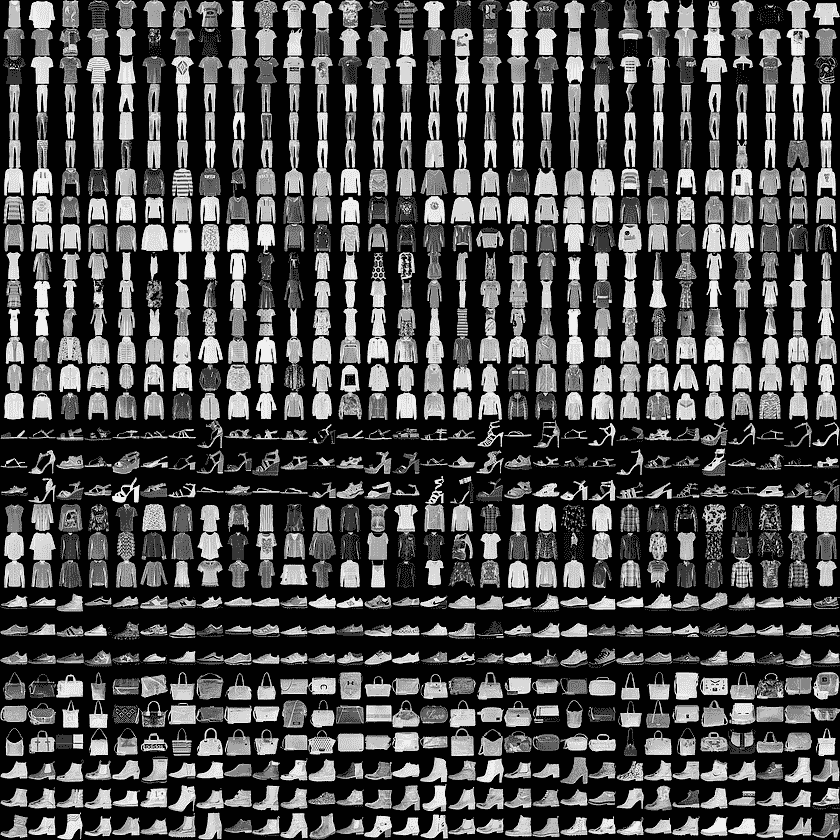
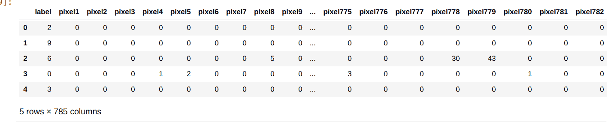
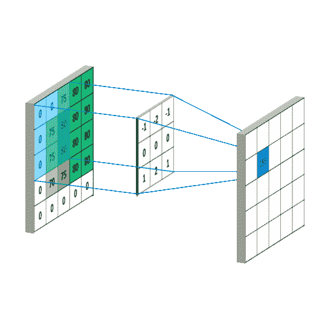

# 如何创建一个简单的图像分类器

> 原文：<https://www.freecodecamp.org/news/creating-your-first-image-classifier/>

图像分类是深度学习的一个惊人应用。我们可以训练一种强大的算法来模拟大型图像数据集。然后这个模型可以用来分类一组相似但未知的图像。

图像分类的应用没有限制。你可以在你的下一个应用程序中使用它，或者你可以用它来解决一些现实世界的问题。这都取决于你。但是对于这个领域的新手来说，一开始看起来很有挑战性。我应该如何获取我的数据？我应该如何建立我的模型？我应该使用什么工具？

在本文中，我们将讨论所有这些——从查找数据集到训练模型。我会尽量避免一些技术细节，让事情变得简单( *PS:请注意，这并不意味着那些细节不重要。我将提到一些很棒的资源，您可以参考这些资源来了解关于这些主题的更多信息*。这篇文章的目的是解释建立一个图像分类器的基本过程，这也是我们在这里将更多关注的。

我们将为[时尚 MNIST 数据集](https://research.zalando.com/welcome/mission/research-projects/fashion-mnist/)构建一个图像分类器。《时尚-MNIST》数据集是由[扎兰多的](https://research.zalando.com/)文章图片组成的集合。它包含用于训练集的 60，000 幅图像和用于测试集数据的 10，000 幅图像(*我们稍后将讨论测试和训练数据集以及验证数据集*)。这些图像属于 10 个不同类别的标签。



[Source](https://research.zalando.com/welcome/mission/research-projects/fashion-mnist/)

## 导入库

我们的目标是训练一个深度学习模型，它可以将给定的一组图像分类到这 10 个类别中的一个。现在我们有了数据集，我们应该继续使用我们需要的工具。有许多库和工具可供您根据自己的项目需求进行选择。对于这一点，我将坚持以下几点:

1.  [**Numpy**](https://www.numpy.org/) -用于数值计算的 Python 库
2.  [**熊猫**](https://pandas.pydata.org/) - Python 库数据操纵
3.  [**Matplotlib**](https://matplotlib.org/)-Python 库数据可视化
4.  [**Keras**](https://keras.io/)——基于 tensorflow 的 Python 库，用于创建深度学习模型
5.  Jupyter——我会在 Jupyter 笔记本上运行我所有的代码。你可以通过链接安装它。如果你需要更好的计算能力，你也可以使用[谷歌眼镜](https://colab.research.google.com/)。

除了这四个，我们还将使用 [scikit-learn](https://scikit-learn.org/) 。一旦我们深入研究代码，这些库的用途将变得更加清楚。

好吧！我们已经准备好了工具和库。现在我们应该开始设置我们的代码。

从导入上面提到的所有库开始。除了导入库，我还从这些库中导入了一些特定的模块。让我一个一个地看。

```
import numpy as np 
import pandas as pd
import matplotlib.pyplot as plt 
import keras 

from sklearn.model_selection import train_test_split 
from keras.utils import to_categorical 

from keras.models import Sequential 
from keras.layers import Conv2D, MaxPooling2D 
from keras.layers import Dense, Dropout 
from keras.layers import Flatten, BatchNormalization
```

**[train _ test _ split](https://scikit-learn.org/stable/modules/generated/sklearn.model_selection.train_test_split.html):**该模块将训练数据集拆分成训练和验证数据。这种分割背后的原因是为了检查我们的模型是否[过度拟合](https://en.wikipedia.org/wiki/Overfitting)。我们使用一个训练数据集来训练我们的模型，然后我们将比较结果准确性和验证准确性。如果两个数量之间的差异非常大，那么我们的模型可能是过度拟合的。我们将重申我们的模型构建过程，并在此过程中进行必要的更改。一旦我们对我们的训练和验证准确性感到满意，我们将对我们的测试数据进行最终预测。

**to _ categorial:**to _ categorial 是一个 keras 实用程序。它用于将分类标签转换成[的一键编码](https://machinelearningmastery.com/why-one-hot-encode-data-in-machine-learning/)。假设我们有三个标签(“苹果”、“橙子”、“香蕉”)，那么每个标签的一个热编码将是[1，0，0] - >“苹果”，[0，1，0] - >“橙子”，[0，0，1] - >“香蕉”。

我们导入的其余 Keras 模块是卷积层。我们将在开始构建模型时讨论卷积层。我们还将快速浏览一下每一层的功能。

## 数据预处理

现在，我们将把注意力转移到获取数据和分析数据上。你应该永远记住预处理和分析数据的重要性。它不仅能让你了解数据，还能帮助你找出不一致的地方。

数据中非常微小的变化有时会给模型带来灾难性的结果。这使得在使用数据进行训练之前对其进行预处理变得非常重要。记住这一点，让我们开始数据预处理。

```
train_df = pd.read_csv('./fashion-mnist_train.csv')
test_df = pd.read_csv('./fashion-mnist_test.csv')
```

首先，让我们导入我们的数据集( *[)这里的](https://www.kaggle.com/zalando-research/fashionmnist)是在您的系统*上下载该数据集的链接。导入数据集后，运行以下命令。

```
train_df.head()
```

该命令将向您展示数据的外观。下面的屏幕截图显示了该命令的输出。



我们可以看到我们的图像数据是如何以像素值的形式存储的。但是我们不能以这种格式向我们的模型提供数据。所以，我们必须把它转换成 numpy 数组。

```
train_data = np.array(train_df.iloc[:, 1:])
test_data = np.array(test_df.iloc[:, 1:])
```

现在，是时候拿我们的标签了。

```
train_labels = to_categorical(train_df.iloc[:, 0])
test_labels = to_categorical(test_df.iloc[:, 0])
```

在这里，你可以看到我们使用了*to _ categorial*将我们的分类数据转换成一个热编码。

我们现在将重塑数据，并将其转换为 *float32* 类型，以便我们可以方便地使用它。

```
rows, cols = 28, 28 

train_data = train_data.reshape(train_data.shape[0], rows, cols, 1)
test_data = test_data.reshape(test_data.shape[0], rows, cols, 1)

train_data = train_data.astype('float32')
test_data = test_data.astype('float32')
```

我们差不多完成了。让我们通过规范化来完成对数据的预处理。标准化图像数据会将每个图像中的所有像素值映射到 0 到 1 之间的值。这有助于我们减少数据中的不一致。在标准化之前，图像数据的像素值可能会有很大的变化，这可能会在训练过程中导致一些不寻常的行为。

```
train_data /= 255.0
test_data /= 255.0
```

## 卷积神经网络

这样，数据预处理就完成了。现在我们可以开始构建我们的模型了。我们将构建一个[卷积神经网络](http://cs231n.github.io/convolutional-networks/)用于对图像数据建模。CNN 是常规[神经网络](https://en.wikipedia.org/wiki/Neural_network)的修改版本。这些是专门为图像数据修改的。将图像输入常规神经网络需要我们的网络有大量的输入神经元。例如，对于一个 28×28 的图像，我们需要 784 个输入神经元。这将产生一大堆训练参数。

CNN 通过假设输入是一幅图像来解决这个问题。卷积神经网络的主要目的是利用图像的空间结构，并从中提取高级特征，然后在这些特征上进行训练。它通过对像素值矩阵执行[卷积](https://en.wikipedia.org/wiki/Convolution)操作来实现这一点。



[Source](https://mlnotebook.github.io/post/CNN1/)

上图展示了卷积运算的工作原理。我们之前导入的 Conv2D 层也是如此。演示中左起第一个矩阵(*)是卷积层的输入。然后将另一个称为“滤波器”或“内核”的矩阵乘以(矩阵乘法)输入矩阵的每个窗口。该乘法的输出是下一层的输入。*

除了卷积层之外，一个典型的 CNN 还有另外两种类型的层:1)卷积层(T1)，和 2)T2 全连接层(T3)。

汇集层用于概括卷积层的输出。除了概化，它还通过对卷积层的输出进行下采样来减少模型中的参数数量。

正如我们刚刚了解到的，卷积层代表图像数据的高级特征。完全连接的层使用这些高级特征来训练参数并学习对这些图像进行分类。

除了上面提到的图层，我们还将使用[剔除](https://machinelearningmastery.com/dropout-for-regularizing-deep-neural-networks/)、[批量归一化](https://en.wikipedia.org/wiki/Batch_normalization)和[展平](https://stackoverflow.com/questions/43237124/role-of-flatten-in-keras)图层。展平层将卷积层的输出转换为一维特征向量。展平输出非常重要，因为密集(完全连接)图层仅接受要素矢量作为输入。丢弃和批量标准化层用于防止模型[过度拟合](https://en.wikipedia.org/wiki/Overfitting)。

```
train_x, val_x, train_y, val_y = train_test_split(train_data, train_labels, test_size=0.2)

batch_size = 256
epochs = 5
input_shape = (rows, cols, 1)
```

```
def baseline_model():
    model = Sequential()
    model.add(BatchNormalization(input_shape=input_shape))
    model.add(Conv2D(32, (3, 3), padding='same', activation='relu'))
    model.add(MaxPooling2D(pool_size=(2, 2), strides=(2,2)))
    model.add(Dropout(0.25))

    model.add(BatchNormalization())
    model.add(Conv2D(32, (3, 3), padding='same', activation='relu'))
    model.add(MaxPooling2D(pool_size=(2, 2)))
    model.add(Dropout(0.25))

    model.add(Flatten())
    model.add(Dense(128, activation='relu'))
    model.add(Dropout(0.5))
    model.add(Dense(10, activation='softmax'))
    return model
```

你在上面看到的代码是我们 CNN 模型的代码。您可以用许多不同的方式构建这些层，以获得良好的结果。有许多流行的 CNN 架构提供了最先进的结果。在这里，我刚刚为这个问题创建了自己的简单架构。请随意尝试你自己的，让我知道你得到了什么结果:)

## 训练模型

一旦创建了模型，就可以导入它，然后使用下面的代码编译它。

```
model = baseline_model()
model.compile(loss='categorical_crossentropy', optimizer='sgd', metrics=['accuracy']) 
```

**model.compile** 为我们的模型配置学习过程。我们已经通过了三次辩论。这些参数定义了我们模型的[损失函数](https://machinelearningmastery.com/loss-and-loss-functions-for-training-deep-learning-neural-networks/)、[优化器](https://blog.algorithmia.com/introduction-to-optimizers/)和[指标](https://keras.io/metrics/)。

```
history = model.fit(train_x, train_y,
          batch_size=batch_size,
          epochs=epochs,
          verbose=1,
          validation_data=(val_x, val_y)) 
```

最后，通过运行上面的代码，你可以训练你的模型。我只为五个时期训练这个模型，但是你可以增加时期的数量。训练过程完成后，您可以使用以下代码对测试集进行预测。

```
predictions= model.predict(test_data)
```

## 结论

恭喜你。你做到了，你已经向计算机视觉的神奇世界迈出了第一步。

您已经创建了自己的图像分类器。尽管这是一项伟大的成就，但我们只是触及了表面。

你可以在 CNN 上做很多事情。应用是无限的。我希望这篇文章能帮助你理解训练这些模型的过程。

自己处理其他数据集将有助于您更好地理解这一点。我还为我在本文中使用的代码创建了一个 GitHub [库](https://github.com/aditya2000/MNIST-Fashion-)。所以，如果这篇文章对你有用，请告诉我。

如果你有任何问题，或者你想分享你自己的成果，或者如果你只是想说声“嗨”，请随时通过 [twitter](https://twitter.com/aditya_dehal) 联系我，我会尽力帮助你。最后**非常感谢你阅读这篇文章！！**:)