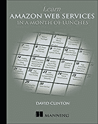
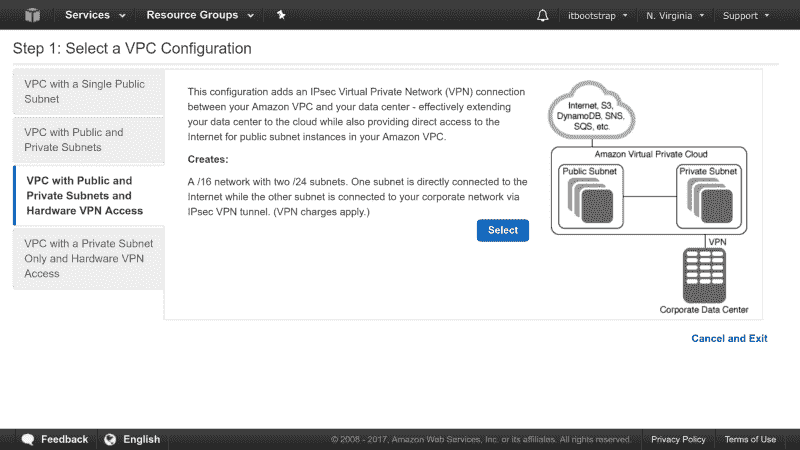

# 如何打败技术学习曲线怪兽

> 原文：<https://www.freecodecamp.org/news/beating-the-technology-learning-curve-monster/>

做我谋生的工作，这些天主要是[创作技术书籍和课件](https://bootstrap-it.com/)，我在不断学习新技术。在某种程度上，我的新技术冒险与大多数 IT 专业人士面临的冒险没有太大不同，只是我的冒险可能更频繁。

因为这很大程度上取决于我对新平台或流程的理解，而且一旦我完成了这个，还有许多其他更新的平台和流程等待着我的关注，所以我的主要目标是尽可能快地进入和退出。

试图组织一项技术中固有的复杂层次和设计隐喻，同时努力弄清楚它是否能完全达到我的要求，有时可能会非常令人生畏。没有一个好的进攻计划，我会死在水里。

在我分享我在自己的学习中成功使用的一些工具之前，有必要讨论一下现实世界中的(相对)新技术。

不久前，运营管理监控公司 ScienceLogic [对 1000 多名企业和 IT 专业人士进行了一项调查](https://www.sciencelogic.com/company/news/releases/28-percent-information-technology-pros-fear-cloud-adoption)，征求他们对采用云的看法。很明显，越来越多的 it 工作负载正在向云提供商转移(亚马逊网络服务在每一项指标上都处于领先地位)，但人们对这种变化可能带来的影响有着深刻而广泛的担忧。

31%的受访者认为他们缺乏自信地领导云部署的技能，50%的人声称他们缺乏适当管理云中基础架构的工具，28%的人担心向云的转移可能会危及他们目前的工作。

听起来熟悉吗？变化的速度越快，破坏性越大，我们就越担心如何或者是否能跟上。如果你认为 Joe IT Professional 熬夜想知道他将如何解决这一切，请对他的经理表示一些同情，他负责将整个部门拖入云中。

我现在特别关注 AWS，因为我的 Wiley/Sybex 书籍" [AWS 认证云从业者学习指南](https://www.amazon.com/gp/product/1119490707/ref=as_li_tl?ie=UTF8&camp=1789&creative=9325&creativeASIN=1119490707&linkCode=as2&tag=projemun-20&linkId=c407a50c1752a2bc7d9ff3ea66ac8cdc)"刚刚出版。AWS 是十多年前我第一次努力理解的技术，当时我需要建立自己面向公众的网络会议系统(使用 BigBlueButton)。从第一台 EC2 服务器到我在尝试这本书之前达到的舒适水平和深刻体验，这是一段漫长的旅程，但我在采取这些最初步骤时得到的正确和错误的东西对我现在如何教授 It 主题有很大的影响。

## 顺序扫描与扫描运行

你将如何学习一项技能，部分取决于你打算学什么。如果您正在寻找一个介绍，它将带您从零开始在 AWS 这样的全栈、多层环境中运行，那么您可能更安全地选择顺序。从头开始可以帮助你避免遗漏关键细节——比如 AWS 上的计费或安全工作方式。相信我:如果你不喜欢令人惊讶的四位数月服务费或受损的基础设施，那么你就不会想跳过计费和安全基础知识。

但是，如果它是一个独立的软件包(比如虚拟化技术或新的 IDE ),在实际部署之前，你可以在自己的网络中安全地测试几次，那么越快越好。对于这种项目，我通常会使用 LXC 启动一个干净的 Linux 容器(在探索新软件时，我发现它比 Docker 更好),或者当我正在使用的应用程序需要主机内核访问时(如 SELinux ),在 Virtual Box 上启动一个 [Linux 虚拟机。](https://www.freecodecamp.org/news/how-to-create-a-virtual-it-workspace-16927c0f3535/?source=rss----336d898217ee---4)

我所说的“扫描并运行”是指在 DuckDuckGo.com(或者其他我一时想不起名字的搜索引擎)中仔细地制作一个搜索字符串，快速地从结果中挑选出你想要的信息，并在你的一次性虚拟服务器上尝试。没起作用？恭喜你。你刚刚学到了一些你还不知道的东西。

只要确保正确记录你的失败和成功，这样你就不必一遍又一遍地在同一个公园里走来走去。

## 命令行

如果可以选择，我通常更喜欢从 Bash 命令行工作，而不是 GUI 控制台。这并不是因为我是一个命令行势利眼(虽然我是)，但我发现 CLI 的明确和可跟踪的性质在迭代实验中工作得很好。用简单的语言来说，这意味着更容易追溯我的步骤，以找出什么有效，什么无效。不要忘记 Bash 错误消息可以很容易地被回收到很棒的互联网搜索中。

CLI 的另一个优点是:设计良好的 shell 环境的可预测模式比设计良好的 web GUI 更容易预测功能。让我用 AWS CLI 来说明这一点。一旦安装并正确配置，即使不带任何参数运行“aws ”,也会得到一些有用的东西。请注意输出是如何引导您向任何部分完成的命令添加“help”来返回上下文帮助的。

> *$ aws*
> *用法:aws【选项】<命令> <子命令> [ <子命令>……]【参数】*
> *要查看帮助文本，可以运行:*

> *aws 帮助*
> *aws <命令>帮助*
> *aws <命令> <子命令>帮助*
> *aws:错误:参数太少*

的确，通过 GUI 可以获得大量帮助:所有 AWS 控制台页面都有大量文档资源的链接。但是那将是 AWS 文档，虽然写得很好并且精心维护，但是通常非常非常冗长，有时有点混乱。内联 CLI 文档更具针对性，让您更快地进入和退出。

仅仅是熟悉如何获取这类信息就能让你更快更有效……即使是在早期学习阶段。而且基本结构远不止 AWS 可用。

Manning’s [Learn Amazon Web Services in a Month of Lunches](https://www.manning.com/books/learn-amazon-web-services-in-a-month-of-lunches?a_aid=bootstrap-it&amp;a_bid=1c1b5e27)

另一方面，正如我在《在一个月的午餐中学习 AWS》一书中所写的，我觉得 AWS 浏览器控制台实际上是一个更好的地方，可以首先掌握亚马逊云的工作方式。这是因为高层结构在理解数十个 AWS 服务协同工作的方式方面发挥了如此大的作用，而网站在可视化方面做得非常好。但也许这只是我的想法。

Official AWS documentation — complete with helpful illustrations

## 自己做

最重要的是，如果你卷起袖子去尝试，你的学习将是最有效的。你不仅应该复制文档中的例子，还应该改变参数，看看有什么问题。然后根据您正在学习的技术来计划和执行您自己的项目。将你的知识应用到现实世界中是至关重要的。