# 以上是 2019 年最有效的简历字体

> 原文：<https://www.freecodecamp.org/news/these-are-the-most-effective-resume-fonts-in-2019/>

说到制作一份完美的简历来获得你梦想中的工作，你可能会想到除了字体之外的一切。但是字体是你给招聘人员和雇主的第一印象的关键部分。

在本帖中，我将带你浏览简历中的 10 种最佳字体(以及何时使用每种字体)。我们还将讨论为什么雇主关心字体的选择，以及你如何利用它让自己在竞争中脱颖而出。

## 简历字体真的很重要吗？

想象一个时尚超薄手机的广告。你在营销材料中描绘了什么样的设计和字体？

你可能想象出了一个像手机本身一样纤细而浓缩的东西。如果营销团队试图让客户认为瘦，你不会期望他们使用任何华丽、华丽或粗旷的东西:

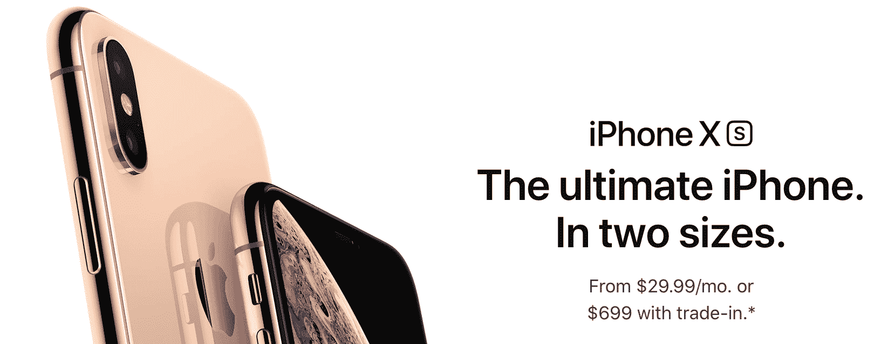

**图片由【Apple.com】T2*提供*

现在想象一个奇幻小说的广告。这些单词会在页面上弹出来吗？

你大概没有想象过传统直白的东西吧？如果你要潜入一个充满屠龙英雄和高耸城堡的童话世界，你可能会期望看到一种带有一些花饰和花饰的字体。

字体选择是任何营销团队设计的关键部分。广告设计的每一个方面，从图像到版面设计以及文字在页面上出现的方式，都应该让潜在客户对所销售的产品或服务产生积极的想法。

当你制作简历时，把自己想象成一个营销团队。你的求职信和简历是为招聘人员或雇主对你的第一印象而设计的。你在自我品牌的各个方面推销自己，从内容到时间和形式。

当你的名字出现在雇主的办公桌上或收件箱里时，你希望他们会对你留下好印象。他们没有看到你本人，除了你向他们展示的东西，没有其他的上下文线索可以给他们任何其他的想法——即使是像格式或字体这样看起来很小的东西。因为他们看到的所有关于你的东西都会用你选择的字体书写，这将会比你想象的要大得多。

你也不必相信我的话。有大量科学证据证明，字体会影响消费者对产品或公司的看法，以及雇主对求职者的看法:

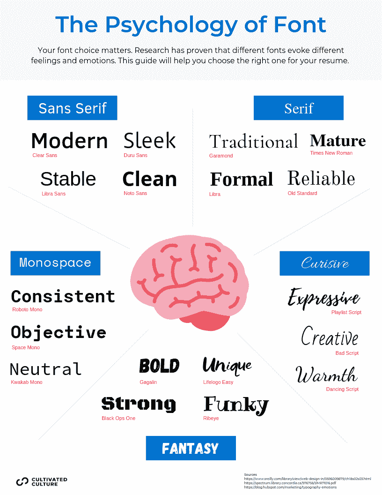

例如，威奇托州立大学的一项研究表明，受访者将 Times New Roman 和 Arial 等字体与稳定性联系在一起。Courier New 和 Georgia 在参与者的心目中意味着“成熟”，而 Agency FB 则与刻板印象联系在一起，Kristen 则象征着兴奋。

[其他研究表明](http://japr.or.kr/journal/article.php?code=25772)真正起作用的不仅仅是字体选择，还有字体选择与营销其他方面的一致性。如果字体和其他视觉和色调元素(如简历设计、格式、段落、图形以及粗体和斜体等风格选择)都给出了相同的一致信息，如“该申请人具备相关技能”、“该申请人可靠且值得信赖”或“该申请人有创造力且注重视觉”，那么该信息更有可能留在读者的脑海中。但是，如果只有一个方面，比如字体，是关闭的，它可能会破坏整个信息，削弱你的介绍的各个方面。

请记住，同时展示你的简历和求职信是你展示自我的一种方式。如果你的品牌信息在设计和内容、形式和功能、字体和色调上保持一致，你就更有可能做成一笔生意——或者，在这种情况下，被邀请参加面试。

## 简历字体有什么大不了的？

那么，为什么字体选择这样的小事会对你被录用的能力产生如此大的影响呢？

我们的大脑每秒钟都在建立联系，加班加点地充实我们所读到和看到的一切的意义。我们将某些美学和词汇与情感、性格特征和心情联系起来。

想想看:如果你去一家鲜果冰沙店，看到肮脏、粗糙、黑暗的装饰，你可能会感到困惑。这是因为，由于你过去的经历，你可能已经把冰沙店与微风习习的热带环境和明亮欢快的颜色联系在一起了。

正如字体设计者和作者塞勒斯·海史密斯告诉**“排版是一个故事的细节和呈现。它代表了一种氛围或某种历史背景的声音。它可以做很多事情。”**

**把排版想象成你简历的基调；你不用点燃蜡烛，而是用你的字体和其他设计选择来营造一种氛围。**

**我们把过去的经历和无数的联想带到我们所做的每一件事情中。你的简历字体应该激活招聘者和潜在雇主心中的联系，让他们将你与专业、诚实和技能联系起来。**

**像每个申请人一样，[每种字体都有自己的“个性”如果字体难以阅读或者不能反映你申请的工作，可能会给招聘人员留下不好的印象(即使他们没有意识到)。因为你已经在简历上花了很多心思和精力，你不希望像字体选择这样的小事产生负面影响。](https://spectrum.library.concordia.ca/976758/1/MR71016.pdf)**

**接下来，我们将讨论如何用你的简历字体给人留下最好的印象。一旦你选择了你喜欢的字体，你可以使用[我的免费简历生成器](https://cultivatedculture.com/resume-templates/)用我们招聘人员批准的模板创建一份漂亮的、ATS 友好的简历。**

## **如何为简历选择最合适的字体**

**为简历选择字体时，两个最重要的因素是可读性和专业性。**

**你最不想做的事情就是让招聘人员或雇主的日子更难过，所以你的简历字体应该总是直截了当，可读性强。他们不应该眯着眼睛阅读过轻过细的字体，或者努力辨认复杂的符号或字体。**

**与此同时，专业精神完全取决于语气。正如我们在上一节中讨论的那样，即使是“无声”的选择，如字体和格式，也能像你的用词选择一样容易地传达语气。你的字体基调应该与你的职场个性和专业水平相匹配。**

**就可读性和专业性而言，我们通常会将一些宽泛的“字体家族”与工作场所和专业设置联系在一起。让我们来看看五种主要的字体，或者说大类，当你写简历的时候，你可以从中选择。**

### **“字体系列”之间的差异**

**每种字体都属于一个字体“家族”，具有相似的特征，给人留下相似(尽管不完全相同)的印象。在选择简历字体方面，你要做的第一个决定是哪种字体最适合你的目标。**

**字体分为五大类:**

******Serif:**** Serif 字体和 Times New Roman 一样，属于最大最常见的“字体家族”之一衬线字体的字母在某些字符笔画上有装饰性的衬线或小“尾巴”。**

******Sans Serif:****Sans Serif 字面意思是“没有衬线”，所以你可以猜到这些字体没有–尾巴！无衬线字体的例子包括 Arial 和 Helvetica。无衬线字体在数字市场上变得非常流行，部分原因是它们不太正式，更直接和极简的外观。**

******等宽:**** 等宽字体通常与报纸和打字机相关联，像 Courier 和 Courier New 这样的等宽字体被设计成使得每个字母在给定的行上占据相同的空间。每个字母宽度相同。这使得图形设计简洁、一致，因为字符之间没有大小差异。近年来，等宽字体也成为一种流行的设计选择，因为它们有点怀旧，让人想起打字机和电报的时代。**

******草书:**** 草书字体，就像著名的漫画 Sans 一样，是为了让文字显得手写或“潦草”，给人一种个性化的感觉。这一类别中的某些字体可能很少在专业环境中使用，但在绝大多数情况下，这些字体用于平面设计或营销材料，而不是求职信或简历。**

****幻想字体对简历或求职信没有用处——可能会有例外，但我还没有发现——但它们用于装饰和设计目的，比如标牌和某些营销材料。幻想字体的例子包括 Impact 和 Western。它们通常用于标题或其他较短的文本，因为它们不容易阅读。****

********我们对 2019 年的推荐:**** 有五种字体家族可供选择，你简历的最佳选项是什么？****

****在当今世界，一个干净的，现代的无衬线字体是值得推荐的。这在一定程度上是因为劳动力越来越数字化，使得即使是专业的交流也变得不那么正式，而更加简单明了。****

****无衬线字体在外观和感觉上比传统的墨守成规的衬线字体更现代。它们迎合了当今极简主义、开门见山、280 字驱动的经济。他们去掉了所有多余的干扰，直奔主题，就像你在找工作时想做的那样。****

****虽然你可能会在求职中对简历的字体做出不同的决定——例如，如果你从事的是一个超传统、更保守、要求高度正式的职业——无衬线字体通常是最好的选择。既然我们已经把范围缩小到了某个字体家族，我们就来分析一下 10 种最佳简历字体以及它们可能适合的工作类别。****

## ****分解 10 种最好的简历字体****

****在 2019 年的市场上，以下是基于可靠性、感知和风格的 10 种最佳简历字体:****

*   ********【开桑(现代)********
*   ********【现代】卡利布********
*   ********【Helvetica(现代)********
*   ********【未来(现代)********
*   ********【拉托(现代)********
*   ********【现代机器人】********
*   ********【前卫(现代)********
*   ********【现代】博物馆********
*   **********【格鲁吉亚经典】**********
*   ********【经典】********

****对于每一种字体，我们都会深入探究一下它的历史和美学，以及它的优缺点和何时使用:****

****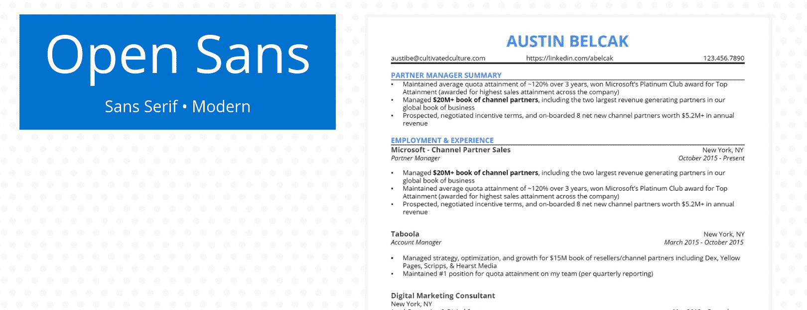****

## ****开启无****

****2011 年发布的 Open Sans 是谷歌的标志性字体之一。它的字母又高又宽。****

********优点:**** Open Sans 在网页设计中广受欢迎是有原因的:最佳可读性。这些大开的字母在任何屏幕上都很容易阅读，无论是大屏幕还是小屏幕。因为它在许多情况下被用作 Mozilla 的默认字体，而且对于许多 Google 页面来说，它看起来很熟悉。****

********缺点:**** 开放的 Sans 被广泛认为是“平淡”或“中性”，这对简历来说是一件非常好的事情。但是如果你想脱颖而出或者让你的简历更有个性，这可能不是最好的选择。****

********替代品:**** Adelle Sans 类似于 Open Sans，是很棒的替代品。****

****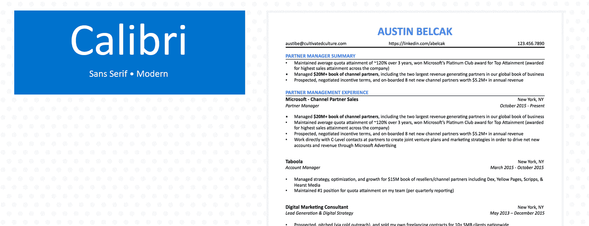****

## ****卡里布里布里布里布里布里布里布里布里布里布里布里布里布里布里布里布里布里布里布里布里布里布里布里布****

****Calibri 在 21 世纪初作为经典的 Times New Roman 的 Microsoft Word 替代品出现。****

********优点:**** Calibri 可以在任何电脑上轻松阅读，无论发送到哪里都不会弄乱格式。大家之前都看过，不分散注意力。是无衬线字体，所以干净圆滑。对于标准简历或在数字优先公司工作来说，这是一个不错的选择。****

********缺点:**** Calibri 有点“安全”，因为它是微软 Word 的默认字体，被许多其他申请人使用。但是在简历字体方面，脱颖而出并不总是最好的目标。相反，你希望你的简历本身来完成这项工作。但对于一家古怪的公司的创造性职业来说，Calibri 可能不是最佳选择。****

********备选:**** Arial 是 Google Docs 的默认字体，在网页的最佳可读性方面有点类似于 Calibri。它也同样简单易懂。****

****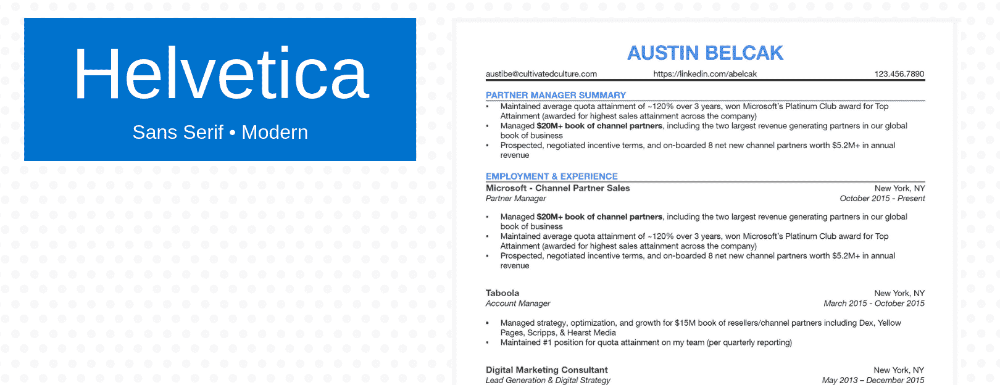****

## ****Helvetica****

****Helvetica 是 20 世纪 50 年代设计的，带有一点优雅和华丽。它经常被评为最有吸引力的字体之一。****

********优点:**** Helvetica 是一种更柔和、漂亮的无衬线字体。这是现代的，但仍然有点漂亮，不太明显。因为它并不总是用于简历，所以它显得有点突出，不会太“突出”对于设计公司(尤其是因为[它经常被用于平面设计](https://medium.com/@joeflory/15-modern-alternatives-to-helvetica-2c4b2f602a9a))或者注重美感的职业来说，这可能是一个不错的选择。****

********缺点:**** Helvetica 只预装在 MAC 上，所以在其他系统上会转换成不同的字体。****

********备选:**** 瑞体、Arial、Folio 在“字体个性”上都与 Helvetica 相似****

****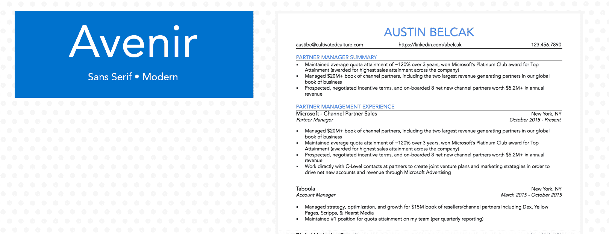****

## ****未来的未来****

****Avenir 来自法语，意思是“未来”这种设计于 1988 年的几何无衬线字体温暖而活泼，边缘弯曲，有几个选择性的尾部。****

********优点:**** Avenir 还不至于古怪到让人分心，但也不是标准的“安全”简历字体。对于一家未来的公司来说，这可能是一个不错的选择。它也是[一直被评为设计师最喜欢的字体之一](https://www.typewolf.com/site-of-the-day/fonts/avenir)，所以它对任何注重审美或创意的职业都有好处。最后，它是多功能的:它有多种重量。****

****缺点: Avenir 不是一个很常见的简历选择，所以对一个非常传统或正式的人来说可能会有点不和谐。
替代词:Nunito 的圆形字母与 Avenir 非常相似。****

****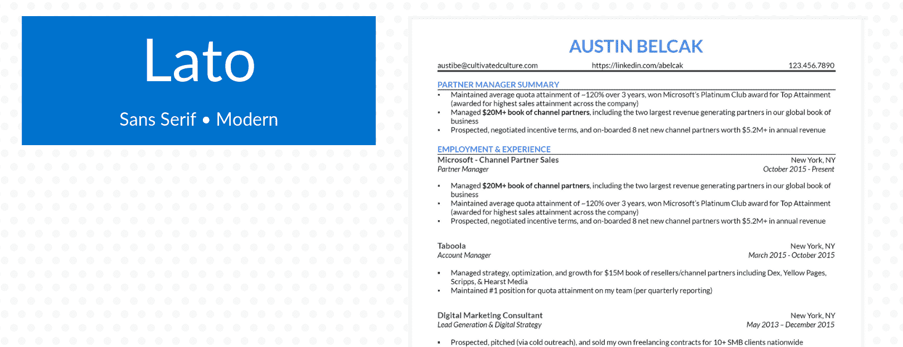****

## ****拉托****

****Lato 设计于 2010 年，以波兰语单词“夏天”命名，因为它意味着像最温暖的季节一样欢快。它足够专业，严肃，但在字体风格上有一点明亮。****

********优点:**** 由于可读性强，Lato 越来越成为简历的常见选择。这是一种平易近人的时尚字体，同时保持专业。最后，Lato 是开源的，这意味着任何人都可以免费下载。****

********缺点:**** 拉托并不是简历中的“经典之作”，这总是一点点的赌博。微软 Word 没有将 Lato 列为默认设置之一，这意味着它不会出现在每个招聘人员或雇主面前。如果你下载并安装了这种字体，确保你的简历是 PDF 格式的，这样招聘人员/招聘经理会看到和你一样的格式。****

********备选:**** [布兰登奇形怪状](https://blog.spoongraphics.co.uk/articles/the-best-free-alternatives-to-the-most-popular-fonts)和开桑斯都类似拉托。****

****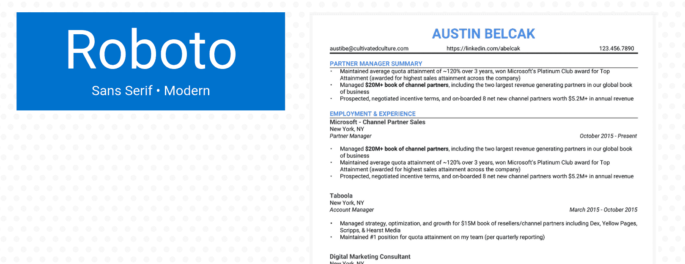****

## ****Roboto****

****谷歌在 2011 年发布的 Roboto 可能看起来很熟悉，尤其是如果你经常旅行的话:它用于谷歌地图。它类似于其他针对网络优化的字体，字体更加纤细、光滑。****

********优点:**** 因为是开源的，Roboto 对任何人都是免费使用的。它还针对网页可读性进行了优化，因此像 Open Sans 一样，它在任何屏幕上都清晰可辨。它也很时尚和现代，所以它对任何现代公司都很好，尤其是那些重视网络形象的公司(如营销)。****

********缺点:**** Roboto 比其他一些字体显得不那么正式，所以对于学术应用或者非常传统的工作环境来说并不理想。****

********备选:**** Roboto 在风格上有点类似于 Helvetica 和 Arial。****

********

## ****前进！前进****

****受 20 世纪 20 年代德国包豪斯运动的启发，前卫是一种独特的字体，在 20 世纪 70 年代的广告中频繁使用后又卷土重来。它的字母很宽，其中几个有古怪的花体，像倾斜的“v”和卷曲的 q。****

********优点:**** 前卫足够有趣，在保持网络可读性的同时脱颖而出。这是创意型和想要突出自己独特个性的人的可靠选择。****

********缺点:**** 前卫就是，嗯，前卫。它不是默认或标准的简历字体，因此它不是传统领域高管级别职位的最佳选择。****

********替代品:**** 前卫类似于哈耳摩尼亚 Sans。****

****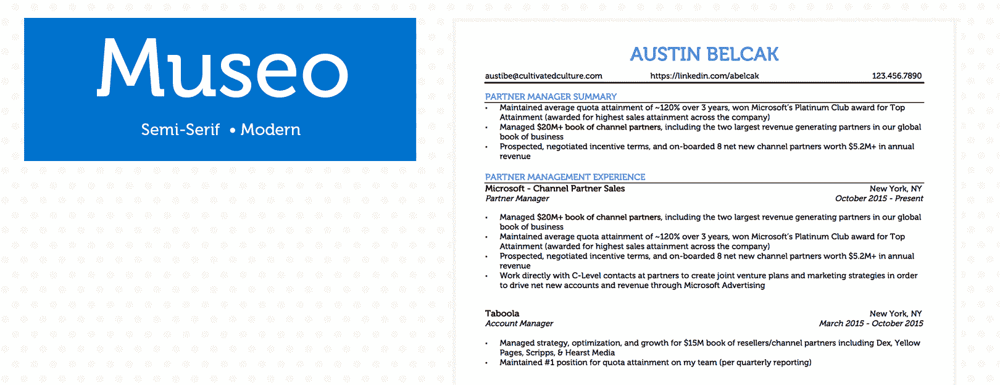****

## ****博物馆****

****Museo [于 2009 年发布，以大写字母“U”开头，](https://www.exljbris.com/museo.html)则有两条平坦弯曲的水平尾巴。很温暖，很平易近人。****

********优点:**** Museo 在网页设计中经常使用。对于需要友好、开放举止的客户服务或销售工作，或者对于时尚或设计等手工或艺术领域的工作，这将是一个很好的选择。它是开源的，所以可以免费使用。****

****缺点: 博物馆热情友好，但如果你的招聘人员非常传统，这可能是个缺点。在某些情况下可能会分散注意力。****

****备选方案: 如果你正在寻找一种类似的氛围，用卡尔弗特代替 Museo。****

****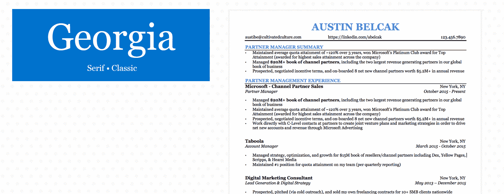****

## ****格鲁吉亚****

****Georgia 于 1993 年发布，被亚马逊、纽约时报和雅虎等公司广泛用作默认字体。这是一种衬线字体，所以它有一个带着一点温暖的经典外观。****

********优点:**** Georgia 是专门为在屏幕上阅读而设计的，因此它对于有视觉障碍的屏幕读者来说非常容易理解，即使在手机上也清晰可辨。这是专业和标准的，同时也有一点乐趣和天赋。****

********缺点:**** 佐治亚州被广泛使用和熟悉，可能不会让你在其他申请者中脱颖而出。****

********替代品:**** 佐治亚和泰晤士新罗马经常互换使用。佐治亚州似乎是 TNR 的“升级版”。****

****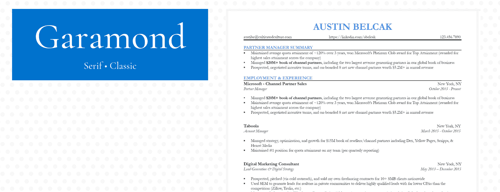****

## ****加拉蒙字体****

****Garamond 于 1989 年问世，但它的历史要长得多。这种字体的灵感来自 16 世纪的设计，常用于印刷。****

********优点:**** 加拉蒙[有一个老派、复古的外观](https://www.typewolf.com/site-of-the-day/fonts/garamond)，给它增添了一点档次。这是一个具有鲜明个性的字体的好例子，使它成为学术或文学领域的可靠选择。****

********缺点:**** Garamond 的复古外观意味着它可能不适合超当代公司。****

********替代品:**** 鸬鹚、Sabon、Minion 是 Garamond 强有力的替代品。****

## ****简历的最佳字体大小****

****记住，可读性是简历字体选择最重要的方面之一。****

****字体大小是你的读者能够快速浏览你的简历，挑出重要部分，并给你留下一个坚实、积极的印象的一个关键方面。招聘人员可能会一次筛选几十份甚至几百份简历(或者更多)，简化他们的工作是让你的简历脱颖而出的第一个也是最简单的方法。****

****把你曾经做过的每一件事都塞进你的简历可能很有诱惑力，但是删掉你工作经历中无关的部分会在很多方面给你带来好处。如果你的简历上有太多的章节，很快就会让人眼花缭乱。****

****更重要的是，如果你包含了太多的内容，你可能会被要求将字体缩小到 10 号(永远不要小于 10 号！).但是稍微大一点的字体会给雇主更好的印象；斯蒂芬·f·奥斯汀大学的一项研究显示，使用 12 磅的简历。字体比 10 磅字体评价更高。字体。****

****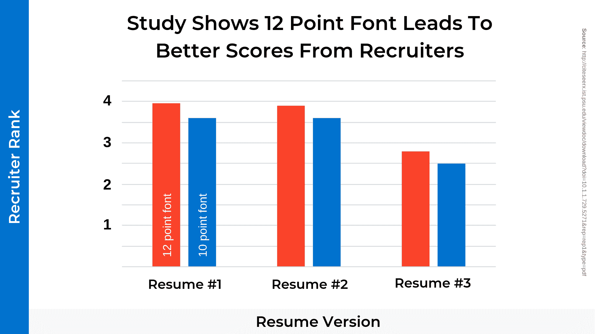****

****因为最终目标是让你的简历尽可能的容易阅读，所以最好的字体大小在 12 到 14 之间。如果你非常有经验，并且有一份非常长的简历，10 分可以用，但这并不理想。试着删掉一些与手头工作不直接相关的东西，看看你能否用更大的字体让你的简历看起来更容易一些。****

****这个练习也可以让你的简历更加简单明了。无论你多么想把你的高中志愿者经历包括在内，更重要的是招聘人员只看到最相关和最适用的教育和工作经验——不要弄乱，不要大惊小怪。****

****同样，要警惕任何浅色或细字体，因为如果你的简历难以阅读，你的读者可能会感到沮丧。用黑色代替灰色或任何其他颜色，这样你的简历可读性更好。****

### ****如何利用格式让你的简历字体流行起来****

****除了选择字体，你还可以使用各种格式来突出简历的某些部分。****

****简历格式的第一条规则是谨慎使用任何特殊的风格，比如粗体或斜体。你不希望你的读者被混合的风格或者页面上过多的斜体部分弄得不知所措。对任何特殊字符要有选择性。空白是你简历最好的朋友，可以让你的读者快速浏览文档，轻松挑选出最重要的部分。****

****在简历中使用粗体和斜体的下一个规则是要保持一致。这似乎是一个显而易见的规则，但它也经常被打破。例如，如果你把你以前的工作标题加粗，副标题用斜体，那么你列出的每一份工作都要这样做，即使它们在某些方面有所不同。马上用你的风格选择建立一个模式，你的读者会跟随你的领导。****

****你可以在简历中使用粗体来突出你的背景中与给定工作相关的特定关键方面，或者留出特定部分以获得最佳浏览性。例如，你可以用粗体突出你在工作描述中特别提到的特殊技能(比如某个软件项目的专业知识)。或者，你可以对标题使用粗体和稍大的字体。****

****同时，斜体最适合用于标题下的副标题，或者额外强调你的教育或工作经历的某个方面，比如可衡量的结果。例如，你可以用斜体表示你从事某项工作的日期。它们也经常被用来分享定量数据，比如“季度销售额增长了 13%。”****

### ****如何找到和下载非标准的简历字体(免费！)****

****你可能已经注意到，当你试图在微软 Word 或谷歌文档中查找时，我推荐的一些字体没有显示出来。****

****尽管这些字体是简历的最佳选择，但它们并不总是微软或谷歌的标准包装的一部分。好消息是，你可以轻松下载并自己添加它们，而不用花一毛钱！****

****以下是在 Microsoft Word 中添加自定义字体的方法:****

1.  ****找一个可以免费下载字体的网站。[字体松鼠](https://www.fontsquirrel.com/)、[达丰](https://www.dafont.com/)、 [1001 自由字体](https://www.1001freefonts.com/)都是很棒的选择。****
2.  ****搜索您想要的字体，并将 OTF 或 TTF 文件下载到您的桌面上****
3.  ****打开你下载的文件，点击“安装字体”****
4.  ****重新启动您想要使用该字体的任何应用程序(Microsoft Word、Photoshop 等。)****
5.  ****您应该看到您的新字体作为一个选项出现在下拉菜单中！****

****向谷歌文档添加新字体要容易得多。你需要做的就是:****

1.  ****打开任何谷歌文档****
2.  ****点击字体下拉菜单，然后点击“更多字体…”****
3.  ****搜索您想要的字体，选择它，然后单击“确定”****
4.  ****你的新字体应该作为一个选项出现在你的下拉列表中****

### ****简历字体:底线****

****我们一起研究了简历字体的各个方面，从一开始为什么它们很重要，到如何选择最适合你职业目标的字体。****

****当你为你的求职信和简历选择字体时，记住要保持可读性和专业性。如有疑问，选择当代无衬线字体和 12-14 号字体。字体大小。坚持使用粗体和斜体，但要有节制，记住空白是你的朋友。****

****此外，我们在这篇文章中思考简历字体的方式是一个很好的模型，可以帮助你在求职过程中处理所有的介绍性材料。****

****你的求职信和简历的每个方面都应该精心策划，以突出相关的经历和特质。因为你的潜在雇主除了你提供给他们的东西之外没有任何其他的东西，所以让每一个字母和每一种字体都有价值是很重要的。****

#### ****想要一份没有关系，没有“经验”，没有网上申请就能得到梦想工作的内幕消息吗？****

****点击此处获取我的学生在谷歌、微软、亚马逊等公司求职时使用的 5 个免费策略，无需在线申请。****