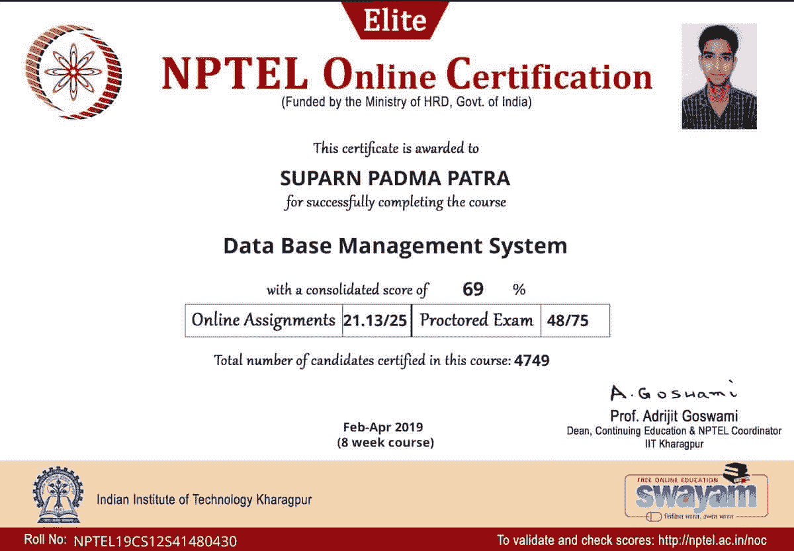

# 印度顶尖大学的 600 多门免费在线课程现在就开始了

> 原文：<https://www.freecodecamp.org/news/swayam-free-online-courses/>

SWAYAM 是印度的国家 MOOC 平台，旨在实现印度教育政策的三个基本原则:机会、公平和质量。

自从 2014 年 8 月[首次宣布](https://www.classcentral.com/report/swayam-india/)SWAYAM 平台以来，Class Central 一直在跟踪该平台的进展。自 2017 年 7 月推出测试版以来，该平台已注册超过 1000 万名学习者。按照这种增长速度，几年后，SWAYAM 可能会成为全球最大的 MOOC 提供商，提供各种学科的课程，以及印度知名院校(如印度理工学院和中央大学)的课程。

2019 年 7 月， [SWAYAM](https://www.classcentral.com/provider/swayam) 的主页和课程目录进行了修改，特别是包括了由 [NPTEL](https://www.classcentral.com/institution/nptel) 提供的所有课程，该集团由印度一些最著名的工程机构组成。所有这些课程都是免费的。学生也可以选择支付少量费用(约 15 美元)参加印度考试中心的监考考试，以获得结业证书。

反过来，印度高等教育的学生可以用这些证书来获得学术学分，因为他们完成了被他们的大学指定为合格学分的 SWAYAM 课程。如果你想了解更多关于印度如何在大学层面利用 SWAYAM 的信息，请阅读我们之前的文章:[在印度，MOOCs 现在是教育系统的一部分](https://www.classcentral.com/report/swayam-for-credit/)。

我个人在 [SWAYAM](https://www.classcentral.com/provider/swayam) 上完成了几门课程，包括一门 [SWAYAM-NPTEL](https://nptel.ac.in/LocalChapter/) 课程，这是我在印度拉贾斯坦邦中央大学计算机科学硕士学位(人工智能专业)最后一个学期的一部分。我付了一点额外的费用(不到 2 美元)通过邮件收到了证书(嵌入在下面)。从那时起，纸质证书已经停止，但学生仍然可以获得虚拟证书，享有同样的特权。

我于 2019 年 4 月加入了 Class Central 工程团队，我的部分工作是确保 Class Central 的目录是最新的。这意味着我维护并编写新的从不同提供商那里收集课程信息的抓取器。

我很高兴地说，我们现在列出了所有的斯瓦亚姆课程。2020 年 1 月和 2 月开始有超过 600+的免费在线课程。如果您想获得有关这些课程的通知，请使用[跟随按钮](https://www.classcentral.com/help/account-how-follow-button-work)，课堂中心将随时通知您。

以下是按科目分类的所有 [SWAYAM 课程](https://www.classcentral.com/provider/swayam)的列表。

## **人文学科(47)**

*   [学术写作](https://www.classcentral.com/course/swayam-academic-writing-13881?utm_source=cc_mooc_report&utm_medium=web&utm_campaign=swayam_spring_2020)来自**UGC**★★★★(226)
*   [二十世纪小说](https://www.classcentral.com/course/swayam-twentieth-century-fiction-17829?utm_source=cc_mooc_report&utm_medium=web&utm_campaign=swayam_spring_2020)来自 **印度理工学院*马德拉斯*
*   [十九世纪英国小说](https://www.classcentral.com/course/swayam-the-nineteenth-century-english-novel-12971?utm_source=cc_mooc_report&utm_medium=web&utm_campaign=swayam_spring_2020)出自 **印度理工学院*马德拉斯*
*   [德国-II](https://www.classcentral.com/course/swayam-german-ii-14097?utm_source=cc_mooc_report&utm_medium=web&utm_campaign=swayam_spring_2020) 来自*印度理工学院*马德拉斯
*   [竞争性考试文献](https://www.classcentral.com/course/swayam-literature-for-competitive-exams-17676?utm_source=cc_mooc_report&utm_medium=web&utm_campaign=swayam_spring_2020)来自 **印度理工学院*马德拉斯*
*   [文学批评(从柏拉图到李维斯)](https://www.classcentral.com/course/swayam-literary-criticism-from-plato-to-leavis-17675?utm_source=cc_mooc_report&utm_medium=web&utm_campaign=swayam_spring_2020)从*到*印度理工学院*马德拉斯*
*   [现代印度文字翻译](https://www.classcentral.com/course/swayam-modern-indian-writing-in-translation-17699?utm_source=cc_mooc_report&utm_medium=web&utm_campaign=swayam_spring_2020)来自*印度理工学院*马德拉斯
*   [德国-I](https://www.classcentral.com/course/swayam-german-i-14096?utm_source=cc_mooc_report&utm_medium=web&utm_campaign=swayam_spring_2020) 来自*印度理工学院*马德拉斯
*   [浪漫主义时期的英国文学，1798-1832](https://www.classcentral.com/course/swayam-english-literature-of-the-romantic-period-1798-1832-12983?utm_source=cc_mooc_report&utm_medium=web&utm_campaign=swayam_spring_2020) 来自*印度理工学院*马德拉斯
*   [世界文学概论](https://www.classcentral.com/course/swayam-introduction-to-world-literature-12982?utm_source=cc_mooc_report&utm_medium=web&utm_campaign=swayam_spring_2020)来自*印度理工学院*马德拉斯
*   [竞争性考试英语](https://www.classcentral.com/course/swayam-english-language-for-competitive-exams-7964?utm_source=cc_mooc_report&utm_medium=web&utm_campaign=swayam_spring_2020)来自*印度理工学院马德拉斯*
*   [基础口语梵语入门](https://www.classcentral.com/course/swayam-introduction-to-basic-spoken-sanskrit-17655?utm_source=cc_mooc_report&utm_medium=web&utm_campaign=swayam_spring_2020)来自 **印度理工学院，哈拉格普尔**
*   [定性研究方法与研究写作](https://www.classcentral.com/course/swayam-qualitative-research-methods-and-research-writing-13035?utm_source=cc_mooc_report&utm_medium=web&utm_campaign=swayam_spring_2020)来自 **印度理工学院*【卡拉格普尔】*
*   [文学、文化与传媒](https://www.classcentral.com/course/swayam-literature-culture-and-media-12972?utm_source=cc_mooc_report&utm_medium=web&utm_campaign=swayam_spring_2020)来自*印度理工学院 Roorkee*
*   [有效写作](https://www.classcentral.com/course/swayam-effective-writing-17584?utm_source=cc_mooc_report&utm_medium=web&utm_campaign=swayam_spring_2020)来自*印度理工学院 Roorkee*
*   [印度商业史](https://www.classcentral.com/course/swayam-indian-business-history-17640?utm_source=cc_mooc_report&utm_medium=web&utm_campaign=swayam_spring_2020)来自*印度理工学院*古瓦哈蒂
*   [在线社交媒体中的隐私和安全](https://www.classcentral.com/course/swayam-privacy-and-security-in-online-social-media-12938?utm_source=cc_mooc_report&utm_medium=web&utm_campaign=swayam_spring_2020)来自 **印度理工学院德里**
*   [समकालीन अस्मितामूलक विमर्श](https://www.classcentral.com/course/swayam------------14366?utm_source=cc_mooc_report&utm_medium=web&utm_campaign=swayam_spring_2020) from **Dr. Harisingh Gour University**
*   [社会转型的某些方面&15-18 世纪现代欧洲的经济](https://www.classcentral.com/course/swayam-some-aspects-of-the-transformation-of-society-economy-of-modern-europe-15th-18th-century-17794?utm_source=cc_mooc_report&utm_medium=web&utm_campaign=swayam_spring_2020)从*到*CEC**
*   [古希腊和中世纪哲学](https://www.classcentral.com/course/swayam-ancient-greek-and-medieval-philosophy-17514?utm_source=cc_mooc_report&utm_medium=web&utm_campaign=swayam_spring_2020)源自*CEC*
*   [数字图书馆](https://www.classcentral.com/course/swayam-digital-library-17575?utm_source=cc_mooc_report&utm_medium=web&utm_campaign=swayam_spring_2020)从*到*CEC**
*   [报道编辑印刷](https://www.classcentral.com/course/swayam-reporting-and-editing-for-print-17759?utm_source=cc_mooc_report&utm_medium=web&utm_campaign=swayam_spring_2020)发自*CEC*
*   [早期历史印度的出现(公元前 300-750 年)](https://www.classcentral.com/course/swayam-emergence-of-early-historic-india-300bce-750ce-17589?utm_source=cc_mooc_report&utm_medium=web&utm_campaign=swayam_spring_2020)来自 **加尔各答*大学*
*   [当代印度的制作](https://www.classcentral.com/course/swayam-making-of-contemporary-india-17679?utm_source=cc_mooc_report&utm_medium=web&utm_campaign=swayam_spring_2020)来自 **CEC**
*   [साहित्य का इतिहास दर्शन](https://www.classcentral.com/course/swayam-----------17847?utm_source=cc_mooc_report&utm_medium=web&utm_campaign=swayam_spring_2020) from **CEC**
*   [印度独立史](https://www.classcentral.com/course/swayam-history-of-indian-independence-1857-1950-17634?utm_source=cc_mooc_report&utm_medium=web&utm_campaign=swayam_spring_2020)从*到*从*到*
*   [家政-推广与沟通管理-二级](https://www.classcentral.com/course/swayam-home-science-extension-and-communication-management-level-2-17635?utm_source=cc_mooc_report&utm_medium=web&utm_campaign=swayam_spring_2020)从*到*CEC**
*   [莫卧儿印度(1550-1605)](https://www.classcentral.com/course/swayam-mughal-india-1550-1605-17700?utm_source=cc_mooc_report&utm_medium=web&utm_campaign=swayam_spring_2020) 从*到*CEC**
*   [俄语基础知识-第一部分](https://www.classcentral.com/course/swayam-basics-of-russian-part-1-17528?utm_source=cc_mooc_report&utm_medium=web&utm_campaign=swayam_spring_2020)来自*IGNOU*
*   [信息来源与图书馆服务](https://www.classcentral.com/course/swayam-information-sources-and-library-services-14125?utm_source=cc_mooc_report&utm_medium=web&utm_campaign=swayam_spring_2020)来自 **IGNOU**
*   [图书馆自动化和数字化](https://www.classcentral.com/course/swayam-library-automation-and-digitisation-14174?utm_source=cc_mooc_report&utm_medium=web&utm_campaign=swayam_spring_2020)来自 **IGNOU**
*   [中学:印地语(201)](https://www.classcentral.com/course/swayam-secondary-hindi-201-17771?utm_source=cc_mooc_report&utm_medium=web&utm_campaign=swayam_spring_2020) 来自 **NIOS**
*   [高级中学:图书馆&情报学(339)](https://www.classcentral.com/course/swayam-sr-secondary-library-information-science-339-17799?utm_source=cc_mooc_report&utm_medium=web&utm_campaign=swayam_spring_2020) 从 **NIOS**
*   [高级中学:英语(302)](https://www.classcentral.com/course/swayam-sr-secondary-english-302-17804?utm_source=cc_mooc_report&utm_medium=web&utm_campaign=swayam_spring_2020) 来自*NIOS*
*   [高中:印地语(301)](https://www.classcentral.com/course/swayam-sr-secondary-hindi-301-17805?utm_source=cc_mooc_report&utm_medium=web&utm_campaign=swayam_spring_2020) 来自*NIOS*
*   [高级中学:历史(315)](https://www.classcentral.com/course/swayam-sr-secondary-history-315-17806?utm_source=cc_mooc_report&utm_medium=web&utm_campaign=swayam_spring_2020) 从 **NIOS**
*   [高级中学:家政(321)](https://www.classcentral.com/course/swayam-sr-secondary-home-science-321-17807?utm_source=cc_mooc_report&utm_medium=web&utm_campaign=swayam_spring_2020) 从 **NIOS**
*   [二级:吠陀阿迪亚延(245)](https://www.classcentral.com/course/swayam-secondary-veda-adhyayan-245-17782?utm_source=cc_mooc_report&utm_medium=web&utm_campaign=swayam_spring_2020) 从*到 *NIOS* 到*
*   [二级:梵文 Sahitya (248)](https://www.classcentral.com/course/swayam-secondary-sanskrit-sahitya-248-17778?utm_source=cc_mooc_report&utm_medium=web&utm_campaign=swayam_spring_2020) 出自*NIOS*
*   [二级:梵文(209)](https://www.classcentral.com/course/swayam-secondary-sanskrit-209-17777?utm_source=cc_mooc_report&utm_medium=web&utm_campaign=swayam_spring_2020) 出自*NIOS*
*   [中学:英语(202)](https://www.classcentral.com/course/swayam-secondary-english-202-17770?utm_source=cc_mooc_report&utm_medium=web&utm_campaign=swayam_spring_2020) 从 **NIOS**
*   [中学:印度文化&遗产(223)](https://www.classcentral.com/course/swayam-secondary-indian-culture-heritage-223-17773?utm_source=cc_mooc_report&utm_medium=web&utm_campaign=swayam_spring_2020) 来自 **NIOS**
*   [中学:家学(216)](https://www.classcentral.com/course/swayam-secondary-home-science-216-17772?utm_source=cc_mooc_report&utm_medium=web&utm_campaign=swayam_spring_2020) 从 **NIOS**
*   [中学:巴蒂亚·达尔山(247)](https://www.classcentral.com/course/swayam-secondary-bhartiya-darshan-247-17766?utm_source=cc_mooc_report&utm_medium=web&utm_campaign=swayam_spring_2020) 从*到 *NIOS* 到*
*   [Sr . neo4j:梵文(309)](https://www.classcentral.com/course/swayam-sr-secondary-sanskrit-309-17811?utm_source=cc_mooc_report&utm_medium=web&utm_campaign=swayam_spring_2020) 出自*NIOS*
*   [乌尔都语文字学习](https://www.classcentral.com/course/swayam-urdu-language-script-learning-17833?utm_source=cc_mooc_report&utm_medium=web&utm_campaign=swayam_spring_2020)从*到*NCERT**
*   [二级:梵文 Viyakaran (246)](https://www.classcentral.com/course/swayam-secondary-sanskrit-viyakaran-246-17779?utm_source=cc_mooc_report&utm_medium=web&utm_campaign=swayam_spring_2020) 出自*NIOS*

## **编程(19)**

*   [动画](https://www.classcentral.com/course/swayam-animations-13880?utm_source=cc_mooc_report&utm_medium=web&utm_campaign=swayam_spring_2020)来自 **巴纳拉斯印度教大学**★★★☆(61)
*   [使用 Python 计算的乐趣](https://www.classcentral.com/course/swayam-the-joy-of-computing-using-python-17823?utm_source=cc_mooc_report&utm_medium=web&utm_campaign=swayam_spring_2020)来自 **印度理工学院，Ropar**★★★★(1)
*   [MATLAB 编程进行数值计算](https://www.classcentral.com/course/swayam-matlab-programming-for-numerical-computation-5303?utm_source=cc_mooc_report&utm_medium=web&utm_campaign=swayam_spring_2020)来自*印度理工学院*马德拉斯
*   [数据库系统介绍](https://www.classcentral.com/course/swayam-introduction-to-database-systems-17660?utm_source=cc_mooc_report&utm_medium=web&utm_campaign=swayam_spring_2020)来自*印度理工学院*马德拉斯
*   [数据库管理系统](https://www.classcentral.com/course/swayam-data-base-management-system-17564?utm_source=cc_mooc_report&utm_medium=web&utm_campaign=swayam_spring_2020)来自 **印度理工学院*卡拉格普尔*
*   [工业 4.0 和工业物联网简介](https://www.classcentral.com/course/swayam-introduction-to-industry-4-0-and-industrial-internet-of-things-12941?utm_source=cc_mooc_report&utm_medium=web&utm_campaign=swayam_spring_2020)来自 **印度理工学院，哈拉格普尔**
*   [软件工程](https://www.classcentral.com/course/swayam-software-engineering-14293?utm_source=cc_mooc_report&utm_medium=web&utm_campaign=swayam_spring_2020)来自 **印度理工学院*哈拉格普尔*
*   [用 C++编程](https://www.classcentral.com/course/swayam-programming-in-c-6704?utm_source=cc_mooc_report&utm_medium=web&utm_campaign=swayam_spring_2020)来自*印度理工学院，哈拉格普尔*
*   [云计算](https://www.classcentral.com/course/swayam-cloud-computing-10027?utm_source=cc_mooc_report&utm_medium=web&utm_campaign=swayam_spring_2020)来自 **印度理工学院*哈拉格普尔*
*   [用 Java 编程](https://www.classcentral.com/course/swayam-programming-in-java-12930?utm_source=cc_mooc_report&utm_medium=web&utm_campaign=swayam_spring_2020)来自*印度理工学院*哈拉格普尔**
*   [c++](https://www.classcentral.com/course/swayam-an-introduction-to-programming-through-c-13892?utm_source=cc_mooc_report&utm_medium=web&utm_campaign=swayam_spring_2020)编程入门来自 **印度理工学院孟买**
*   [软件测试](https://www.classcentral.com/course/swayam-software-testing-14295?utm_source=cc_mooc_report&utm_medium=web&utm_campaign=swayam_spring_2020)来自 **印度理工学院**
*   [云计算和分布式系统](https://www.classcentral.com/course/swayam-cloud-computing-and-distributed-systems-17544?utm_source=cc_mooc_report&utm_medium=web&utm_campaign=swayam_spring_2020)来自 **NPTEL**
*   [现代应用开发](https://www.classcentral.com/course/swayam-modern-application-development-17698?utm_source=cc_mooc_report&utm_medium=web&utm_campaign=swayam_spring_2020)从*到*NP tel**
*   [解题方面与 Python 编程](https://www.classcentral.com/course/swayam-problem-solving-aspects-and-python-programming-17744?utm_source=cc_mooc_report&utm_medium=web&utm_campaign=swayam_spring_2020)来自*CEC*
*   [C 语言编程艺术](https://www.classcentral.com/course/swayam-art-of-c-programming-17519?utm_source=cc_mooc_report&utm_medium=web&utm_campaign=swayam_spring_2020)从*到*CEC**
*   [数据库和内容组织](https://www.classcentral.com/course/swayam-database-and-content-organisation-13985?utm_source=cc_mooc_report&utm_medium=web&utm_campaign=swayam_spring_2020)来自*IGNOU*
*   [设计数字解决方案](https://www.classcentral.com/course/swayam-designing-digital-solution-13998?utm_source=cc_mooc_report&utm_medium=web&utm_campaign=swayam_spring_2020)
*   [发展残疾人辅助技术](https://www.classcentral.com/course/swayam-development-of-assistive-technology-for-persons-with-disabilities-17571?utm_source=cc_mooc_report&utm_medium=web&utm_campaign=swayam_spring_2020)从*到*aicete**

## **计算机科学(38)**

*   [物联网入门](https://www.classcentral.com/course/swayam-introduction-to-internet-of-things-10093?utm_source=cc_mooc_report&utm_medium=web&utm_campaign=swayam_spring_2020)来自 **印度理工学院，哈拉格普尔**★★★★(2)
*   [机器学习入门](https://www.classcentral.com/course/swayam-introduction-to-machine-learning-5288?utm_source=cc_mooc_report&utm_medium=web&utm_campaign=swayam_spring_2020)来自 **印度理工学院马德拉斯**★★★★(1)
*   [算法的设计与分析](https://www.classcentral.com/course/swayam-design-and-analysis-of-algorithms-3984?utm_source=cc_mooc_report&utm_medium=web&utm_campaign=swayam_spring_2020)来自 **金奈数学研究所** ★★★☆☆(1)
*   [用 Tensorflow 实用机器学习](https://www.classcentral.com/course/swayam-practical-machine-learning-with-tensorflow-14244?utm_source=cc_mooc_report&utm_medium=web&utm_campaign=swayam_spring_2020)来自 **谷歌**
*   [计算机系统设计基础](https://www.classcentral.com/course/swayam-foundations-to-computer-systems-design-12927?utm_source=cc_mooc_report&utm_medium=web&utm_campaign=swayam_spring_2020)来自*印度理工学院*马德拉斯
*   [计算机架构](https://www.classcentral.com/course/swayam-computer-architecture-3985?utm_source=cc_mooc_report&utm_medium=web&utm_campaign=swayam_spring_2020)来自 **印度理工学院*马德拉斯*
*   [信息安全–5–安全系统工程](https://www.classcentral.com/course/swayam-information-security-5-secure-systems-engineering-12940?utm_source=cc_mooc_report&utm_medium=web&utm_campaign=swayam_spring_2020)来自 **印度理工学院马德拉斯**
*   [强化学习](https://www.classcentral.com/course/swayam-reinforcement-learning-6706?utm_source=cc_mooc_report&utm_medium=web&utm_campaign=swayam_spring_2020)从*到*印度理工学院*马德拉斯*
*   [人工智能:知识表示和推理](https://www.classcentral.com/course/swayam-artificial-intelligence-knowledge-representation-and-reasoning-5290?utm_source=cc_mooc_report&utm_medium=web&utm_campaign=swayam_spring_2020)来自*印度理工学院马德拉斯*
*   [ARM 嵌入式系统设计](https://www.classcentral.com/course/swayam-embedded-system-design-with-arm-12936?utm_source=cc_mooc_report&utm_medium=web&utm_campaign=swayam_spring_2020)来自*的*印度理工学院*的*
*   [深度学习](https://www.classcentral.com/course/swayam-deep-learning-17566?utm_source=cc_mooc_report&utm_medium=web&utm_campaign=swayam_spring_2020)来自 **印度理工学院，哈拉格普尔**
*   [算法与分析介绍](https://www.classcentral.com/course/swayam-introduction-to-algorithms-and-analysis-17670?utm_source=cc_mooc_report&utm_medium=web&utm_campaign=swayam_spring_2020)来自 **印度理工学院，哈拉格普尔**
*   [模糊逻辑和神经网络](https://www.classcentral.com/course/swayam-fuzzy-logic-and-neural-networks-13036?utm_source=cc_mooc_report&utm_medium=web&utm_campaign=swayam_spring_2020)来自 **印度理工学院*【卡拉格普尔】*
*   [GPU 架构和编程](https://www.classcentral.com/course/swayam-gpu-architectures-and-programming-17622?utm_source=cc_mooc_report&utm_medium=web&utm_campaign=swayam_spring_2020)来自 **印度理工学院，哈拉格普尔**
*   [软计算简介](https://www.classcentral.com/course/swayam-introduction-to-soft-computing-10053?utm_source=cc_mooc_report&utm_medium=web&utm_campaign=swayam_spring_2020)来自 **印度理工学院，哈拉格普尔**
*   [密码学与网络安全](https://www.classcentral.com/course/swayam-cryptography-and-network-security-9896?utm_source=cc_mooc_report&utm_medium=web&utm_campaign=swayam_spring_2020)来自 **印度理工学院*【卡拉格普尔】*
*   [用 C 语言编程解决问题](https://www.classcentral.com/course/swayam-problem-solving-through-programming-in-c-10090?utm_source=cc_mooc_report&utm_medium=web&utm_campaign=swayam_spring_2020)来自 **印度理工学院，哈拉格普尔**
*   [实时操作系统](https://www.classcentral.com/course/swayam-real-time-operating-system-9848?utm_source=cc_mooc_report&utm_medium=web&utm_campaign=swayam_spring_2020)来自 **印度理工学院*卡拉格普尔*
*   [编译器设计](https://www.classcentral.com/course/swayam-compiler-design-12926?utm_source=cc_mooc_report&utm_medium=web&utm_campaign=swayam_spring_2020)来自*印度理工学院*哈拉格普尔**
*   [计算机网络和互联网协议](https://www.classcentral.com/course/swayam-computer-networks-and-internet-protocol-17551?utm_source=cc_mooc_report&utm_medium=web&utm_campaign=swayam_spring_2020)来自 **印度理工学院*【卡拉格普尔】*
*   [区块链技术及应用介绍](https://www.classcentral.com/course/swayam-introduction-to-blockchain-technology-and-applications-17656?utm_source=cc_mooc_report&utm_medium=web&utm_campaign=swayam_spring_2020)来自*印度理工学院坎普尔*
*   [随机算法](https://www.classcentral.com/course/swayam-randomized-algorithms-12933?utm_source=cc_mooc_report&utm_medium=web&utm_campaign=swayam_spring_2020)来自 **印度理工学院*古瓦哈蒂*
*   [多核计算机架构——存储和互联](https://www.classcentral.com/course/swayam-multi-core-computer-architecture-storage-and-interconnects-17701?utm_source=cc_mooc_report&utm_medium=web&utm_campaign=swayam_spring_2020)来自 **印度理工学院古瓦哈蒂**
*   [以用户为中心的人机交互计算](https://www.classcentral.com/course/swayam-user-centric-computing-for-human-computer-interaction-17836?utm_source=cc_mooc_report&utm_medium=web&utm_campaign=swayam_spring_2020)来自 **印度理工学院古瓦哈蒂**
*   [人工智能简介](https://www.classcentral.com/course/swayam-an-introduction-to-artificial-intelligence-17510?utm_source=cc_mooc_report&utm_medium=web&utm_campaign=swayam_spring_2020)来自*印度理工学院德里*
*   [操作系统](https://www.classcentral.com/course/swayam-operating-system-17712?utm_source=cc_mooc_report&utm_medium=web&utm_campaign=swayam_spring_2020)来自*印度理工学院*德里**
*   [机器学习，ML](https://www.classcentral.com/course/swayam-machine-learning-ml-12945?utm_source=cc_mooc_report&utm_medium=web&utm_campaign=swayam_spring_2020) 来自*KTH 皇家理工学院*
*   [使用 Python 编程、数据结构和算法](https://www.classcentral.com/course/swayam-programming-data-structures-and-algorithms-using-python-14260?utm_source=cc_mooc_report&utm_medium=web&utm_campaign=swayam_spring_2020)来自 **钦奈数学学院**
*   [密码学基础](https://www.classcentral.com/course/swayam-foundations-of-cryptography-17613?utm_source=cc_mooc_report&utm_medium=web&utm_campaign=swayam_spring_2020)来自 **印度理工学院**
*   [社交网络](https://www.classcentral.com/course/swayam-social-networks-9920?utm_source=cc_mooc_report&utm_medium=web&utm_campaign=swayam_spring_2020)来自 **印度理工学院，Ropar**
*   [深度学习——第一部分](https://www.classcentral.com/course/swayam-deep-learning-part-1-17567?utm_source=cc_mooc_report&utm_medium=web&utm_campaign=swayam_spring_2020)来自 **印度理工学院，罗帕**
*   [信息技术课程](https://www.classcentral.com/course/swayam-course-in-information-technology-17556?utm_source=cc_mooc_report&utm_medium=web&utm_campaign=swayam_spring_2020)来自 **Savitribai Phule Pune 大学**
*   [电脑网络](https://www.classcentral.com/course/swayam-computer-networks-13951?utm_source=cc_mooc_report&utm_medium=web&utm_campaign=swayam_spring_2020)发自*发自*德维·阿希利亚·维斯瓦维德亚拉亚，印多尔*发自*
*   [operations Systems](https://www.classcentral.com/course/swayam-operatings-systems-17713?utm_source=cc_mooc_report&utm_medium=web&utm_campaign=swayam_spring_2020)来自 **马德拉斯大学，钦奈**
*   [网络安全](https://www.classcentral.com/course/swayam-cyber-security-13978?utm_source=cc_mooc_report&utm_medium=web&utm_campaign=swayam_spring_2020)来自*UGC*
*   [人工智能](https://www.classcentral.com/course/swayam-artificial-intelligence-17520?utm_source=cc_mooc_report&utm_medium=web&utm_campaign=swayam_spring_2020)来自 **古吉拉特大学**
*   [网络安全入门](https://www.classcentral.com/course/swayam-introduction-to-cyber-security-14116?utm_source=cc_mooc_report&utm_medium=web&utm_campaign=swayam_spring_2020)从*到*IGNOU**
*   [高级中学:计算机科学(330)](https://www.classcentral.com/course/swayam-sr-secondary-computer-science-330-17803?utm_source=cc_mooc_report&utm_medium=web&utm_campaign=swayam_spring_2020) 从 **NIOS**

## **工程(155)**

*   [数字土地测绘(DLS & M)](https://www.classcentral.com/course/swayam-digital-land-surveying-and-mapping-dls-m-7983?utm_source=cc_mooc_report&utm_medium=web&utm_campaign=swayam_spring_2020) 来自*印度理工学院 Roorkee*★★★★(2)
*   [计算流体力学](https://www.classcentral.com/course/swayam-computational-fluid-dynamics-5301?utm_source=cc_mooc_report&utm_medium=web&utm_campaign=swayam_spring_2020)来自 **印度理工学院马德拉斯**★★★☆(1)
*   [模拟电路](https://www.classcentral.com/course/swayam-analog-circuits-3978?utm_source=cc_mooc_report&utm_medium=web&utm_campaign=swayam_spring_2020)来自 **印度理工学院*马德拉斯*★★★★(1)
*   [工业自动化与控制](https://www.classcentral.com/course/swayam-industrial-automation-and-control-5222?utm_source=cc_mooc_report&utm_medium=web&utm_campaign=swayam_spring_2020)来自 **印度理工学院，哈拉格普尔**★★★★(1)
*   [MIMO 无线通信基础](https://www.classcentral.com/course/swayam-fundamentals-of-mimo-wireless-communication-6702?utm_source=cc_mooc_report&utm_medium=web&utm_campaign=swayam_spring_2020)来自 **印度理工学院，哈拉格普尔** ★★★☆☆(1)
*   [设备设计:机械方面](https://www.classcentral.com/course/swayam-equipment-design-mechanical-aspects-12904?utm_source=cc_mooc_report&utm_medium=web&utm_campaign=swayam_spring_2020)来自 **印度理工学院 Roorkee**★★★☆(1)
*   [动态系统建模与仿真](https://www.classcentral.com/course/swayam-modelling-and-simulation-of-dynamic-systems-7952?utm_source=cc_mooc_report&utm_medium=web&utm_campaign=swayam_spring_2020)来自 **印度理工学院 Roorkee**★☆☆☆(1)
*   [铸造工艺原理](https://www.classcentral.com/course/swayam-principles-of-casting-technology-7899?utm_source=cc_mooc_report&utm_medium=web&utm_campaign=swayam_spring_2020)出自 **印度理工学院 Roorkee**★★★★①
*   [焊接科学技术基础](https://www.classcentral.com/course/swayam-fundamental-of-welding-science-and-technology-13016?utm_source=cc_mooc_report&utm_medium=web&utm_campaign=swayam_spring_2020)来自*印度理工学院*古瓦哈蒂★★★★(1)
*   [电动汽车——第一部分](https://www.classcentral.com/course/swayam-electric-vehicles-part-1-12960?utm_source=cc_mooc_report&utm_medium=web&utm_campaign=swayam_spring_2020)来自 **印度理工学院德里**★★★★(1)
*   [测试功能性和技术性纺织品](https://www.classcentral.com/course/swayam-testing-of-functional-and-technical-textiles-13051?utm_source=cc_mooc_report&utm_medium=web&utm_campaign=swayam_spring_2020)来自 **印度理工学院德里**★★★★(1)
*   [控制工程](https://www.classcentral.com/course/swayam-control-engineering-10070?utm_source=cc_mooc_report&utm_medium=web&utm_campaign=swayam_spring_2020)来自 **印度理工学院*马德拉斯*
*   [模拟集成电路设计](https://www.classcentral.com/course/swayam-analog-ic-design-10032?utm_source=cc_mooc_report&utm_medium=web&utm_campaign=swayam_spring_2020)来自 **印度理工学院*马德拉斯*
*   [实验应力分析](https://www.classcentral.com/course/swayam-experimental-stress-analysis-10102?utm_source=cc_mooc_report&utm_medium=web&utm_campaign=swayam_spring_2020)来自 **印度理工学院*马德拉斯*
*   [非线性系统分析](https://www.classcentral.com/course/swayam-nonlinear-system-analysis-17708?utm_source=cc_mooc_report&utm_medium=web&utm_campaign=swayam_spring_2020)来自 **印度理工学院*马德拉斯*
*   [特殊环境载荷下的海洋结构物包括耐火](https://www.classcentral.com/course/swayam-offshore-structures-under-special-environmental-loads-including-fire-resistance-17711?utm_source=cc_mooc_report&utm_medium=web&utm_campaign=swayam_spring_2020)来自 **印度理工学院马德拉斯**
*   [光学工程](https://www.classcentral.com/course/swayam-optical-engineering-17714?utm_source=cc_mooc_report&utm_medium=web&utm_campaign=swayam_spring_2020)来自 **印度理工学院*马德拉斯*
*   [数字集成电路设计](https://www.classcentral.com/course/swayam-digital-ic-design-17574?utm_source=cc_mooc_report&utm_medium=web&utm_campaign=swayam_spring_2020)来自 **印度理工学院*马德拉斯*
*   [过程控制——设计、分析和评估](https://www.classcentral.com/course/swayam-process-control-design-analysis-and-assessment-12902?utm_source=cc_mooc_report&utm_medium=web&utm_campaign=swayam_spring_2020)来自 **印度理工学院马德拉斯**
*   [土工合成材料和加筋土结构](https://www.classcentral.com/course/swayam-geosynthetics-and-reinforced-soil-structures-3994?utm_source=cc_mooc_report&utm_medium=web&utm_campaign=swayam_spring_2020)来自 **印度理工学院*马德拉斯*
*   [传输线和电磁波](https://www.classcentral.com/course/swayam-transmission-lines-and-electromagnetic-waves-17827?utm_source=cc_mooc_report&utm_medium=web&utm_campaign=swayam_spring_2020)来自*印度理工学院*马德拉斯
*   [钢材质量:二次精炼和连铸的作用](https://www.classcentral.com/course/swayam-steel-quality-role-of-secondary-refining-and-continuous-casting-17815?utm_source=cc_mooc_report&utm_medium=web&utm_campaign=swayam_spring_2020)来自 **印度理工学院*马德拉斯*
*   [电源管理集成电路](https://www.classcentral.com/course/swayam-power-management-integrated-circuits-17734?utm_source=cc_mooc_report&utm_medium=web&utm_campaign=swayam_spring_2020)来自*印度理工学院*马德拉斯
*   [多速率 DSP](https://www.classcentral.com/course/swayam-multirate-dsp-12967?utm_source=cc_mooc_report&utm_medium=web&utm_campaign=swayam_spring_2020) 来自 **印度理工学院*马德拉斯*
*   [具体科技中的高级课题](https://www.classcentral.com/course/swayam-advanced-topics-in-the-science-and-technology-of-concrete-12924?utm_source=cc_mooc_report&utm_medium=web&utm_campaign=swayam_spring_2020)来自 **印度理工学院*马德拉斯*
*   [环境质量监测与分析](https://www.classcentral.com/course/swayam-environmental-quality-monitoring-and-analysis-17596?utm_source=cc_mooc_report&utm_medium=web&utm_campaign=swayam_spring_2020)来自*印度理工学院*马德拉斯
*   [混凝土结构的维护与维修](https://www.classcentral.com/course/swayam-maintenance-and-repair-of-concrete-structures-17678?utm_source=cc_mooc_report&utm_medium=web&utm_campaign=swayam_spring_2020)来自 **印度理工学院*马德拉斯*
*   [火箭推进](https://www.classcentral.com/course/swayam-rocket-propulsion-17764?utm_source=cc_mooc_report&utm_medium=web&utm_campaign=swayam_spring_2020)来自*印度理工学院*马德拉斯
*   [电子材料与器件基础](https://www.classcentral.com/course/swayam-fundamentals-of-electronic-materials-and-devices-5337?utm_source=cc_mooc_report&utm_medium=web&utm_campaign=swayam_spring_2020)来自*印度理工学院马德拉斯*
*   [材料表征](https://www.classcentral.com/course/swayam-material-characterization-13029?utm_source=cc_mooc_report&utm_medium=web&utm_campaign=swayam_spring_2020)来自 **印度理工学院*马德拉斯*
*   [建筑材料的表征](https://www.classcentral.com/course/swayam-characterization-of-construction-materials-17538?utm_source=cc_mooc_report&utm_medium=web&utm_campaign=swayam_spring_2020)来自*印度理工学院*马德拉斯
*   [非传统能源](https://www.classcentral.com/course/swayam-non-conventional-energy-resources-13039?utm_source=cc_mooc_report&utm_medium=web&utm_campaign=swayam_spring_2020)来自*印度理工学院*马德拉斯
*   [DC 电力传输系统](https://www.classcentral.com/course/swayam-dc-power-transmission-systems-17562?utm_source=cc_mooc_report&utm_medium=web&utm_campaign=swayam_spring_2020)来自*印度理工学院*马德拉斯
*   [工程力学:静力学和动力学](https://www.classcentral.com/course/swayam-engineering-mechanics-statics-and-dynamics-7959?utm_source=cc_mooc_report&utm_medium=web&utm_campaign=swayam_spring_2020)来自*印度理工学院马德拉斯*
*   [焊接工艺](https://www.classcentral.com/course/swayam-welding-processes-13032?utm_source=cc_mooc_report&utm_medium=web&utm_campaign=swayam_spring_2020)来自 **印度理工学院*马德拉斯*
*   [无损检测的理论与实践](https://www.classcentral.com/course/swayam-theory-and-practice-of-non-destructive-testing-9872?utm_source=cc_mooc_report&utm_medium=web&utm_campaign=swayam_spring_2020)来自 **印度理工学院*马德拉斯*
*   [土木工程专业介绍](https://www.classcentral.com/course/swayam-introduction-to-civil-engineering-profession-17658?utm_source=cc_mooc_report&utm_medium=web&utm_campaign=swayam_spring_2020)来自*印度理工学院马德拉斯*
*   [医用生物材料](https://www.classcentral.com/course/swayam-medical-biomaterials-7985?utm_source=cc_mooc_report&utm_medium=web&utm_campaign=swayam_spring_2020)来自 **印度理工学院*马德拉斯*
*   [汽车系统基础](https://www.classcentral.com/course/swayam-fundamentals-of-automotive-systems-17616?utm_source=cc_mooc_report&utm_medium=web&utm_campaign=swayam_spring_2020)来自*印度理工学院马德拉斯*
*   [空中接口从*向 5G*](https://www.classcentral.com/course/swayam-evolution-of-air-interface-towards-5g-12957?utm_source=cc_mooc_report&utm_medium=web&utm_campaign=swayam_spring_2020) 演进*印度理工学院，哈拉格普尔*
*   [电机-II](https://www.classcentral.com/course/swayam-electrical-machines-ii-12948?utm_source=cc_mooc_report&utm_medium=web&utm_campaign=swayam_spring_2020)来自 **印度理工学院，哈拉格普尔**
*   [工程数学 II](https://www.classcentral.com/course/swayam-engineering-mathematics-ii-17592?utm_source=cc_mooc_report&utm_medium=web&utm_campaign=swayam_spring_2020) 来自*的*印度理工学院，哈拉格普尔*的*
*   [机械微加工入门](https://www.classcentral.com/course/swayam-introduction-to-mechanical-micro-machining-10095?utm_source=cc_mooc_report&utm_medium=web&utm_campaign=swayam_spring_2020)来自 **印度理工学院，哈拉格普尔**
*   [离散时间信号处理](https://www.classcentral.com/course/swayam-discrete-time-signal-processing-17576?utm_source=cc_mooc_report&utm_medium=web&utm_campaign=swayam_spring_2020)来自*印度理工学院*哈拉格普尔**
*   [数字电子电路](https://www.classcentral.com/course/swayam-digital-electronic-circuits-12953?utm_source=cc_mooc_report&utm_medium=web&utm_campaign=swayam_spring_2020)来自 **印度理工学院，哈拉格普尔**
*   [金属切削与机床](https://www.classcentral.com/course/swayam-metal-cutting-and-machine-tools-10105?utm_source=cc_mooc_report&utm_medium=web&utm_campaign=swayam_spring_2020)来自*印度理工学院*哈拉格普尔
*   [膜分离过程中的过程建模介绍](https://www.classcentral.com/course/swayam-introduction-to-process-modeling-in-the-membrane-separation-process-17647?utm_source=cc_mooc_report&utm_medium=web&utm_campaign=swayam_spring_2020)来自 **印度理工学院，哈拉格普尔**
*   [机构和机器的运动学](https://www.classcentral.com/course/swayam-kinematics-of-mechanisms-and-machines-13022?utm_source=cc_mooc_report&utm_medium=web&utm_campaign=swayam_spring_2020)来自 **印度理工学院，哈拉格普尔**
*   [工程实践中的伦理](https://www.classcentral.com/course/swayam-ethics-in-engineering-practice-14046?utm_source=cc_mooc_report&utm_medium=web&utm_campaign=swayam_spring_2020)来自 **印度理工学院，哈拉格普尔**
*   [化学工程中的优化](https://www.classcentral.com/course/swayam-optimization-in-chemical-engineering-17717?utm_source=cc_mooc_report&utm_medium=web&utm_campaign=swayam_spring_2020)来自 **印度理工学院，哈拉格普尔**
*   [水利工程](https://www.classcentral.com/course/swayam-hydraulic-engineering-17638?utm_source=cc_mooc_report&utm_medium=web&utm_campaign=swayam_spring_2020)来自*印度理工学院*哈拉格普尔**
*   [VLSI 信号处理](https://www.classcentral.com/course/swayam-vlsi-signal-processing-17837?utm_source=cc_mooc_report&utm_medium=web&utm_campaign=swayam_spring_2020)来自*印度理工学院*哈拉格普尔**
*   [非传统磨料加工工艺超声波、磨料射流和磨料水射流加工](https://www.classcentral.com/course/swayam-non-traditional-abrasive-machining-processesultrasonic-abrasive-jet-and-abrasive-water-jet-machining-17706?utm_source=cc_mooc_report&utm_medium=web&utm_campaign=swayam_spring_2020)来自 **印度理工学院，哈拉格普尔**
*   [运输现象](https://www.classcentral.com/course/swayam-transport-phenomena-17828?utm_source=cc_mooc_report&utm_medium=web&utm_campaign=swayam_spring_2020)来自 **印度理工学院，哈拉格普尔**
*   [城市规划中的地理空间分析](https://www.classcentral.com/course/swayam-geo-spatial-analysis-in-urban-planning-17624?utm_source=cc_mooc_report&utm_medium=web&utm_campaign=swayam_spring_2020)来自 **印度理工学院，哈拉格普尔**
*   [地理信息系统](https://www.classcentral.com/course/swayam-geographic-information-system-17625?utm_source=cc_mooc_report&utm_medium=web&utm_campaign=swayam_spring_2020)来自 **印度理工学院*卡拉格普尔*
*   [网络分析](https://www.classcentral.com/course/swayam-network-analysis-17705?utm_source=cc_mooc_report&utm_medium=web&utm_campaign=swayam_spring_2020)来自 **印度理工学院*哈拉格普尔*
*   [齿轮和齿轮组设计:理论与实践](https://www.classcentral.com/course/swayam-gear-and-gear-unit-design-theory-and-practice-10107?utm_source=cc_mooc_report&utm_medium=web&utm_campaign=swayam_spring_2020)来自 **印度理工学院，哈拉格普尔**
*   [微处理器和微控制器](https://www.classcentral.com/course/swayam-microprocessors-and-microcontrollers-9894?utm_source=cc_mooc_report&utm_medium=web&utm_campaign=swayam_spring_2020)来自 **印度理工学院*卡拉格普尔*
*   [电力系统工程](https://www.classcentral.com/course/swayam-power-system-engineering-10052?utm_source=cc_mooc_report&utm_medium=web&utm_campaign=swayam_spring_2020)来自*印度理工学院*哈拉格普尔**
*   [软纳米技术](https://www.classcentral.com/course/swayam-soft-nano-technology-9923?utm_source=cc_mooc_report&utm_medium=web&utm_campaign=swayam_spring_2020)来自*印度理工学院*哈拉格普尔**
*   [生物医学信号处理](https://www.classcentral.com/course/swayam-biomedical-signal-processing-10069?utm_source=cc_mooc_report&utm_medium=web&utm_campaign=swayam_spring_2020)来自 **印度理工学院，哈拉格普尔**
*   [质量设计和控制](https://www.classcentral.com/course/swayam-quality-design-and-control-10034?utm_source=cc_mooc_report&utm_medium=web&utm_campaign=swayam_spring_2020)来自 **印度理工学院，哈拉格普尔**
*   [微波工程的基本构建模块以及射频和微波滤波器和放大器的设计原理](https://www.classcentral.com/course/swayam-basic-building-blocks-of-microwave-engineering-and-design-principles-of-rf-and-microwave-filters-and-amplifiers-17523?utm_source=cc_mooc_report&utm_medium=web&utm_campaign=swayam_spring_2020)来自 **印度理工学院，哈拉格普尔**
*   [嵌入式系统设计](https://www.classcentral.com/course/swayam-embedded-systems-design-7943?utm_source=cc_mooc_report&utm_medium=web&utm_campaign=swayam_spring_2020)来自 **印度理工学院*哈拉格普尔*
*   [VLSI 物理设计](https://www.classcentral.com/course/swayam-vlsi-physical-design-7894?utm_source=cc_mooc_report&utm_medium=web&utm_campaign=swayam_spring_2020)来自 **印度理工学院，哈拉格普尔**
*   [流体力学入门](https://www.classcentral.com/course/swayam-introduction-to-fluid-mechanics-7945?utm_source=cc_mooc_report&utm_medium=web&utm_campaign=swayam_spring_2020)来自 **印度理工学院，哈拉格普尔**
*   [扩频通信与干扰](https://www.classcentral.com/course/swayam-spread-spectrum-communications-and-jamming-7948?utm_source=cc_mooc_report&utm_medium=web&utm_campaign=swayam_spring_2020)来自*印度理工学院*哈拉格普尔
*   [风景园林与场地规划——基础原理](https://www.classcentral.com/course/swayam-landscape-architecture-and-site-planning-basic-fundamentals-7955?utm_source=cc_mooc_report&utm_medium=web&utm_campaign=swayam_spring_2020)来自 **印度理工学院，哈拉格普尔**
*   [模拟电子电路](https://www.classcentral.com/course/swayam-analog-electronic-circuits-17513?utm_source=cc_mooc_report&utm_medium=web&utm_campaign=swayam_spring_2020)来自 **印度理工学院，哈拉格普尔**
*   [岩土工程二基础工程](https://www.classcentral.com/course/swayam-geotechnical-engineering-ii-foundation-engineering-12922?utm_source=cc_mooc_report&utm_medium=web&utm_campaign=swayam_spring_2020)来自 **印度理工学院，哈拉格普尔**
*   [通过 SPICE 模拟的模拟电路和系统](https://www.classcentral.com/course/swayam-analog-circuits-and-systems-through-spice-simulation-17512?utm_source=cc_mooc_report&utm_medium=web&utm_campaign=swayam_spring_2020)来自 **印度理工学院，哈拉格普尔**
*   [机械加工科学](https://www.classcentral.com/course/swayam-machining-science-17677?utm_source=cc_mooc_report&utm_medium=web&utm_campaign=swayam_spring_2020)来自*印度理工学院*坎普尔
*   [制造工艺技术 I 和 II](https://www.classcentral.com/course/swayam-manufacturing-process-technology-i-and-ii-17683?utm_source=cc_mooc_report&utm_medium=web&utm_campaign=swayam_spring_2020) 来自*印度理工学院*坎普尔
*   [应用人体工程学](https://www.classcentral.com/course/swayam-applied-ergonomics-17516?utm_source=cc_mooc_report&utm_medium=web&utm_campaign=swayam_spring_2020)来自*印度理工学院*坎普尔
*   [太阳能光伏:原理、技术和材料](https://www.classcentral.com/course/swayam-solar-photovoltaics-principles-technologies-and-materials-17793?utm_source=cc_mooc_report&utm_medium=web&utm_campaign=swayam_spring_2020)来自 **印度理工学院坎普尔**
*   [信号与系统原理](https://www.classcentral.com/course/swayam-principles-of-signals-and-systems-9900?utm_source=cc_mooc_report&utm_medium=web&utm_campaign=swayam_spring_2020)来自*印度理工学院*坎普尔
*   [飞机性能介绍](https://www.classcentral.com/course/swayam-introduction-to-airplane-performance-3987?utm_source=cc_mooc_report&utm_medium=web&utm_campaign=swayam_spring_2020)来自 **印度理工学院*坎普尔*
*   [通信系统原理-I](https://www.classcentral.com/course/swayam-principles-of-communication-systems-i-7963?utm_source=cc_mooc_report&utm_medium=web&utm_campaign=swayam_spring_2020) 来自*印度理工学院*坎普尔
*   [运算电路复杂度](https://www.classcentral.com/course/swayam-arithmetic-circuit-complexity-17518?utm_source=cc_mooc_report&utm_medium=web&utm_campaign=swayam_spring_2020)来自*印度理工学院*坎普尔
*   [全面质量管理——我](https://www.classcentral.com/course/swayam-total-quality-management-i-17825?utm_source=cc_mooc_report&utm_medium=web&utm_campaign=swayam_spring_2020)来自 **印度理工学院*坎普尔*
*   [产品设计与制造](https://www.classcentral.com/course/swayam-product-design-and-manufacturing-10068?utm_source=cc_mooc_report&utm_medium=web&utm_campaign=swayam_spring_2020)来自*印度理工学院*坎普尔
*   [计算机集成制造](https://www.classcentral.com/course/swayam-computer-integrated-manufacturing-17550?utm_source=cc_mooc_report&utm_medium=web&utm_campaign=swayam_spring_2020)来自*印度理工学院*坎普尔
*   [生命过程的生物能学](https://www.classcentral.com/course/swayam-bioenergetics-of-life-processes-17530?utm_source=cc_mooc_report&utm_medium=web&utm_campaign=swayam_spring_2020)来自 **印度理工学院*坎普尔*
*   [化学反应工程 II](https://www.classcentral.com/course/swayam-chemical-reaction-engineering-ii-12900?utm_source=cc_mooc_report&utm_medium=web&utm_campaign=swayam_spring_2020) 来自 **印度孟买理工学院**
*   [天线](https://www.classcentral.com/course/swayam-antennas-7924?utm_source=cc_mooc_report&utm_medium=web&utm_campaign=swayam_spring_2020)来自 **印度孟买理工学院**
*   [岩土工程- 1](https://www.classcentral.com/course/swayam-geotechnical-engineering-1-17629?utm_source=cc_mooc_report&utm_medium=web&utm_campaign=swayam_spring_2020) 来自 **印度孟买理工学院**
*   [传热](https://www.classcentral.com/course/swayam-heat-transfer-10061?utm_source=cc_mooc_report&utm_medium=web&utm_campaign=swayam_spring_2020)从*到*印度理工学院孟买**
*   [系统动力学建模介绍](https://www.classcentral.com/course/swayam-introduction-to-system-dynamics-modeling-17668?utm_source=cc_mooc_report&utm_medium=web&utm_campaign=swayam_spring_2020)来自 **印度理工学院孟买**
*   [微波集成电路](https://www.classcentral.com/course/swayam-microwave-integrated-circuits-5224?utm_source=cc_mooc_report&utm_medium=web&utm_campaign=swayam_spring_2020)来自 **印度孟买理工学院**
*   [可持续建筑](https://www.classcentral.com/course/swayam-sustainable-architecture-17822?utm_source=cc_mooc_report&utm_medium=web&utm_campaign=swayam_spring_2020)来自 **印度理工学院 Roorkee**
*   [发电厂工程](https://www.classcentral.com/course/swayam-power-plant-engineering-17735?utm_source=cc_mooc_report&utm_medium=web&utm_campaign=swayam_spring_2020)来自*印度理工学院 Roorkee*
*   [故障分析及预防](https://www.classcentral.com/course/swayam-failure-analysis-and-prevention-10048?utm_source=cc_mooc_report&utm_medium=web&utm_campaign=swayam_spring_2020)来自*印度理工学院 Roorkee*
*   [结构、形式、建筑:协同](https://www.classcentral.com/course/swayam-structure-form-and-architecture-the-synergy-17819?utm_source=cc_mooc_report&utm_medium=web&utm_campaign=swayam_spring_2020)来自 **印度理工学院 Roorkee**
*   [电能质量改善技术](https://www.classcentral.com/course/swayam-power-quality-improvement-technique-17736?utm_source=cc_mooc_report&utm_medium=web&utm_campaign=swayam_spring_2020)来自*印度理工学院 Roorkee*
*   [光纤](https://www.classcentral.com/course/swayam-fiber-optics-7913?utm_source=cc_mooc_report&utm_medium=web&utm_campaign=swayam_spring_2020)来自*印度理工学院 Roorkee*
*   [对流传热](https://www.classcentral.com/course/swayam-convective-heat-transfer-7891?utm_source=cc_mooc_report&utm_medium=web&utm_campaign=swayam_spring_2020)来自*印度理工学院 Roorkee*
*   [CMOS 数字 VLSI 设计](https://www.classcentral.com/course/swayam-cmos-digital-vlsi-design-12964?utm_source=cc_mooc_report&utm_medium=web&utm_campaign=swayam_spring_2020)来自*印度理工学院 Roorkee*
*   [纳米材料表面工程](https://www.classcentral.com/course/swayam-surface-engineering-of-nanomaterials-7914?utm_source=cc_mooc_report&utm_medium=web&utm_campaign=swayam_spring_2020)来自*印度理工学院 Roorkee*
*   [制造中的检验和质量控制](https://www.classcentral.com/course/swayam-inspection-and-quality-control-in-manufacturing-13020?utm_source=cc_mooc_report&utm_medium=web&utm_campaign=swayam_spring_2020)来自*印度理工学院 Roorkee*
*   [高等工程数学](https://www.classcentral.com/course/swayam-advanced-engineering-mathematics-13006?utm_source=cc_mooc_report&utm_medium=web&utm_campaign=swayam_spring_2020)来自*印度理工学院 Roorkee*
*   [先进的电力电子与控制](https://www.classcentral.com/course/swayam-advance-power-electronics-and-control-12956?utm_source=cc_mooc_report&utm_medium=web&utm_campaign=swayam_spring_2020)来自*印度理工学院 Roorkee*
*   [废物转化为能源](https://www.classcentral.com/course/swayam-waste-to-energy-conversion-7960?utm_source=cc_mooc_report&utm_medium=web&utm_campaign=swayam_spring_2020)来自*印度理工学院 Roorkee*
*   [蒸汽和燃气动力系统](https://www.classcentral.com/course/swayam-steam-and-gas-power-systems-7976?utm_source=cc_mooc_report&utm_medium=web&utm_campaign=swayam_spring_2020)来自*印度理工学院 Roorkee*
*   [遥感要领](https://www.classcentral.com/course/swayam-remote-sensing-essentials-17758?utm_source=cc_mooc_report&utm_medium=web&utm_campaign=swayam_spring_2020)来自*印度理工学院 Roorkee*
*   [连铸中间包炼钢过程建模](https://www.classcentral.com/course/swayam-modeling-of-tundish-steelmaking-process-in-continuous-casting-17696?utm_source=cc_mooc_report&utm_medium=web&utm_campaign=swayam_spring_2020)来自 **印度理工学院 Roorkee**
*   [自动控制](https://www.classcentral.com/course/swayam-automatic-control-9850?utm_source=cc_mooc_report&utm_medium=web&utm_campaign=swayam_spring_2020)来自*印度理工学院 Roorkee*
*   [机器人与控制:理论与实践](https://www.classcentral.com/course/swayam-robotics-and-control-theory-and-practice-17763?utm_source=cc_mooc_report&utm_medium=web&utm_campaign=swayam_spring_2020)来自*印度理工学院 Roorkee*
*   [数值方法:有限差分法](https://www.classcentral.com/course/swayam-numerical-methods-finite-difference-approach-10003?utm_source=cc_mooc_report&utm_medium=web&utm_campaign=swayam_spring_2020)来自 **印度理工学院 Roorkee**
*   [两相流动与传热](https://www.classcentral.com/course/swayam-two-phase-flow-and-heat-transfer-10065?utm_source=cc_mooc_report&utm_medium=web&utm_campaign=swayam_spring_2020)来自*印度理工学院 Roorkee*
*   [聚合物和聚合物复合材料加工](https://www.classcentral.com/course/swayam-processing-of-polymers-and-polymer-composites-17745?utm_source=cc_mooc_report&utm_medium=web&utm_campaign=swayam_spring_2020)来自*印度理工学院 Roorkee*
*   [工业工程原理](https://www.classcentral.com/course/swayam-principles-of-industrial-engineering-17740?utm_source=cc_mooc_report&utm_medium=web&utm_campaign=swayam_spring_2020)来自*印度理工学院 Roorkee*
*   [地貌学](https://www.classcentral.com/course/swayam-geomorphology-17628?utm_source=cc_mooc_report&utm_medium=web&utm_campaign=swayam_spring_2020)来自*印度理工学院 Roorkee*
*   [地理信息系统简介](https://www.classcentral.com/course/swayam-introduction-to-geographic-information-systems-10033?utm_source=cc_mooc_report&utm_medium=web&utm_campaign=swayam_spring_2020)来自*印度理工学院 Roorkee*
*   [不可压缩流的计算流体力学](https://www.classcentral.com/course/swayam-computational-fluid-dynamics-for-incompressible-flows-17546?utm_source=cc_mooc_report&utm_medium=web&utm_campaign=swayam_spring_2020)来自 **印度理工学院古瓦哈蒂**
*   [内燃机和燃气轮机](https://www.classcentral.com/course/swayam-ic-engines-and-gas-turbines-13013?utm_source=cc_mooc_report&utm_medium=web&utm_campaign=swayam_spring_2020)来自*印度理工学院古瓦哈蒂*
*   [计算机辅助应用单目标优化](https://www.classcentral.com/course/swayam-computer-aided-applied-single-objective-optimization-17549?utm_source=cc_mooc_report&utm_medium=web&utm_campaign=swayam_spring_2020)来自*印度理工学院古瓦哈蒂*
*   [多相流](https://www.classcentral.com/course/swayam-multiphase-flows-10089?utm_source=cc_mooc_report&utm_medium=web&utm_campaign=swayam_spring_2020)来自 **印度理工学院*古瓦哈蒂*
*   [产品设计与创新](https://www.classcentral.com/course/swayam-product-design-and-innovation-17746?utm_source=cc_mooc_report&utm_medium=web&utm_campaign=swayam_spring_2020)来自*印度理工学院古瓦哈蒂*
*   [统计信号处理](https://www.classcentral.com/course/swayam-statistical-signal-processing-17813?utm_source=cc_mooc_report&utm_medium=web&utm_campaign=swayam_spring_2020)来自*印度理工学院*古瓦哈蒂
*   [流体力学中的实验方法](https://www.classcentral.com/course/swayam-experimental-methods-in-fluid-mechanics-17600?utm_source=cc_mooc_report&utm_medium=web&utm_campaign=swayam_spring_2020)来自*印度理工学院古瓦哈蒂*
*   [机械加工](https://www.classcentral.com/course/swayam-mechanics-of-machining-17691?utm_source=cc_mooc_report&utm_medium=web&utm_campaign=swayam_spring_2020)来自*印度理工学院古瓦哈蒂*
*   [高等测量](https://www.classcentral.com/course/swayam-higher-surveying-17632?utm_source=cc_mooc_report&utm_medium=web&utm_campaign=swayam_spring_2020)来自*印度理工学院古瓦哈蒂*
*   [膜技术](https://www.classcentral.com/course/swayam-membrane-technology-17692?utm_source=cc_mooc_report&utm_medium=web&utm_campaign=swayam_spring_2020)来自 **印度理工学院*古瓦哈蒂*
*   [化工基本原理与计算](https://www.classcentral.com/course/swayam-basic-principles-and-calculations-in-chemical-engineering-17524?utm_source=cc_mooc_report&utm_medium=web&utm_campaign=swayam_spring_2020)来自*印度理工学院古瓦哈蒂*
*   [核能发电基础](https://www.classcentral.com/course/swayam-fundamentals-of-nuclear-power-generation-10046?utm_source=cc_mooc_report&utm_medium=web&utm_campaign=swayam_spring_2020)来自*印度理工学院古瓦哈蒂*
*   [磨料加工和精加工工艺介绍](https://www.classcentral.com/course/swayam-introduction-to-abrasive-machining-and-finishing-processes-17649?utm_source=cc_mooc_report&utm_medium=web&utm_campaign=swayam_spring_2020)来自 **印度理工学院古瓦哈蒂**
*   [微处理器与接口](https://www.classcentral.com/course/swayam-microprocessors-and-interfacing-17694?utm_source=cc_mooc_report&utm_medium=web&utm_campaign=swayam_spring_2020)来自*印度理工学院古瓦哈蒂*
*   [材料科学与工程概论](https://www.classcentral.com/course/swayam-introduction-to-materials-science-and-engineering-10064?utm_source=cc_mooc_report&utm_medium=web&utm_campaign=swayam_spring_2020)来自*印度理工学院德里*
*   [纺织材料的评价](https://www.classcentral.com/course/swayam-evaluation-of-textiles-materials-17598?utm_source=cc_mooc_report&utm_medium=web&utm_campaign=swayam_spring_2020)来自 **印度理工学院德里**
*   [高功率多电平变流器-分析设计和运行问题](https://www.classcentral.com/course/swayam-high-power-multilevel-converters-analysis-design-and-operational-issues-17631?utm_source=cc_mooc_report&utm_medium=web&utm_campaign=swayam_spring_2020)来自 **印度理工学院德里**
*   [非线性自适应控制](https://www.classcentral.com/course/swayam-nonlinear-adaptive-control-17707?utm_source=cc_mooc_report&utm_medium=web&utm_campaign=swayam_spring_2020)来自*印度理工学院*德里**
*   [建筑消防服务及维护管理](https://www.classcentral.com/course/swayam-fire-protection-services-and-maintenance-management-of-building-17607?utm_source=cc_mooc_report&utm_medium=web&utm_campaign=swayam_spring_2020)来自 **印度理工学院德里**
*   [建筑节能、声学和采光](https://www.classcentral.com/course/swayam-energy-efficiency-acoustics-and-daylighting-in-building-9822?utm_source=cc_mooc_report&utm_medium=web&utm_campaign=swayam_spring_2020)来自 **印度理工学院德里**
*   [变形纱技术](https://www.classcentral.com/course/swayam-textured-yarn-technology-13054?utm_source=cc_mooc_report&utm_medium=web&utm_campaign=swayam_spring_2020)来自 **印度理工学院德里**
*   [先进的纺织印花技术](https://www.classcentral.com/course/swayam-advanced-textile-printing-technology-13053?utm_source=cc_mooc_report&utm_medium=web&utm_campaign=swayam_spring_2020)来自 **印度德里理工学院**
*   [数字通信原理](https://www.classcentral.com/course/swayam-principles-of-digital-communication-17739?utm_source=cc_mooc_report&utm_medium=web&utm_campaign=swayam_spring_2020)来自*印度理工学院*德里**
*   [纱线结构理论](https://www.classcentral.com/course/swayam-theory-of-yarn-structure-13052?utm_source=cc_mooc_report&utm_medium=web&utm_campaign=swayam_spring_2020)来自*印度理工学院*德里**
*   [信号处理中的数学方法和技术](https://www.classcentral.com/course/swayam-mathematical-methods-and-techniques-in-signal-processing-10101?utm_source=cc_mooc_report&utm_medium=web&utm_campaign=swayam_spring_2020)来自 **印度科学研究所**
*   [集成电路、Mosfets、运算放大器及其应用](https://www.classcentral.com/course/swayam-integrated-circuits-mosfets-op-amps-and-their-applications-10006?utm_source=cc_mooc_report&utm_medium=web&utm_campaign=swayam_spring_2020)来自 **印度科学研究所**
*   [半导体器件基础](https://www.classcentral.com/course/swayam-fundamentals-of-semiconductor-devices-12950?utm_source=cc_mooc_report&utm_medium=web&utm_campaign=swayam_spring_2020)来自 **印度科学研究所**
*   [传输过程一:传热传质](https://www.classcentral.com/course/swayam-transport-processes-i-heat-and-mass-transfer-7975?utm_source=cc_mooc_report&utm_medium=web&utm_campaign=swayam_spring_2020)来自 **印度科学研究所**
*   [模型检查](https://www.classcentral.com/course/swayam-model-checking-3991?utm_source=cc_mooc_report&utm_medium=web&utm_campaign=swayam_spring_2020)从*到*钦奈数学学院*到*
*   [输电绝缘子最新进展](https://www.classcentral.com/course/swayam-recent-advances-in-transmission-insulator-17755?utm_source=cc_mooc_report&utm_medium=web&utm_campaign=swayam_spring_2020)来自*印度理工学院*
*   [使用开源工具进行电源转换的设计和仿真](https://www.classcentral.com/course/swayam-design-and-simulation-of-power-conversion-using-open-source-tools-17568?utm_source=cc_mooc_report&utm_medium=web&utm_campaign=swayam_spring_2020)来自 **印度理工学院**
*   [光谱学和显微镜学:光学测量和仪器基础](https://www.classcentral.com/course/swayam-optical-spectroscopy-and-microscopy-fundamentals-of-optical-measurements-and-instrumentation-17716?utm_source=cc_mooc_report&utm_medium=web&utm_campaign=swayam_spring_2020)来自 **印度理工学院**
*   [污染控制中的电化学技术](https://www.classcentral.com/course/swayam-electrochemical-technology-in-pollution-control-17585?utm_source=cc_mooc_report&utm_medium=web&utm_campaign=swayam_spring_2020)来自 **印度理工学院**
*   [电子设备集成与原型建造](https://www.classcentral.com/course/swayam-electronics-equipment-integration-and-prototype-building-17588?utm_source=cc_mooc_report&utm_medium=web&utm_campaign=swayam_spring_2020)从*到*印度理工学院*到*
*   [软物质介绍](https://www.classcentral.com/course/swayam-introduction-to-soft-matter-17666?utm_source=cc_mooc_report&utm_medium=web&utm_campaign=swayam_spring_2020)来自 **印度理工学院**
*   [信号与系统(हिंदी में)](https://www.classcentral.com/course/swayam-signals-and-systems----17786?utm_source=cc_mooc_report&utm_medium=web&utm_campaign=swayam_spring_2020) 从*到*NP tel*t5】*
*   [微型传感器简介](https://www.classcentral.com/course/swayam-a-brief-introduction-of-micro-sensors-17497?utm_source=cc_mooc_report&utm_medium=web&utm_campaign=swayam_spring_2020)来自 **NPTEL**
*   [结构动力学](https://www.classcentral.com/course/swayam-structural-dynamics-17818?utm_source=cc_mooc_report&utm_medium=web&utm_campaign=swayam_spring_2020)来自*NP tel*
*   [商品水果生产:石榴&番石榴](https://www.classcentral.com/course/swayam-commercial-fruit-production-pomegranate-guava-13945?utm_source=cc_mooc_report&utm_medium=web&utm_campaign=swayam_spring_2020)产自 **马哈拉施特拉邦开放大学、马哈拉施特拉邦纳什克**
*   [制造业竞争力](https://www.classcentral.com/course/swayam-manufacturing-competitiveness-14181?utm_source=cc_mooc_report&utm_medium=web&utm_campaign=swayam_spring_2020)来自 **印度质量委员会**
*   [线性动力系统](https://www.classcentral.com/course/swayam-linear-dynamical-systems-17674?utm_source=cc_mooc_report&utm_medium=web&utm_campaign=swayam_spring_2020)来自 **印度理工学院曼迪**

## **数据科学(7)**

*   [工程师数据科学](https://www.classcentral.com/course/swayam-data-science-for-engineers-10096?utm_source=cc_mooc_report&utm_medium=web&utm_campaign=swayam_spring_2020)来自*印度理工学院*马德拉斯★☆☆☆(1)
*   [用于数据科学的 Python](https://www.classcentral.com/course/swayam-python-for-data-science-14266?utm_source=cc_mooc_report&utm_medium=web&utm_campaign=swayam_spring_2020)来自 **印度理工学院*马德拉斯*
*   [生物信息学:算法与应用](https://www.classcentral.com/course/swayam-bio-informatics-algorithms-and-applications-12890?utm_source=cc_mooc_report&utm_medium=web&utm_campaign=swayam_spring_2020)来自 **印度理工学院马德拉斯**
*   [数据挖掘](https://www.classcentral.com/course/swayam-data-mining-9821?utm_source=cc_mooc_report&utm_medium=web&utm_campaign=swayam_spring_2020)来自 **印度理工学院*哈拉格普尔*
*   [处理资料数据:收集分析解释](https://www.classcentral.com/course/swayam-dealing-with-materials-data-collection-analysis-and-interpretation-17565?utm_source=cc_mooc_report&utm_medium=web&utm_campaign=swayam_spring_2020)来自 **印度孟买理工学院**
*   [用 Python 进行数据分析](https://www.classcentral.com/course/swayam-data-analytics-with-python-17563?utm_source=cc_mooc_report&utm_medium=web&utm_campaign=swayam_spring_2020)来自*印度理工学院 Roorkee*
*   [预测分析](https://www.classcentral.com/course/swayam-predictive-analytics-17737?utm_source=cc_mooc_report&utm_medium=web&utm_campaign=swayam_spring_2020)来自 **印度管理学院**

## **商业(78)**

*   [运筹学概论](https://www.classcentral.com/course/swayam-introduction-to-operations-research-7902?utm_source=cc_mooc_report&utm_medium=web&utm_campaign=swayam_spring_2020)来自*印度理工学院马德拉斯*★★★★(1)
*   [创业要领](https://www.classcentral.com/course/swayam-entrepreneurship-essentials-13037?utm_source=cc_mooc_report&utm_medium=web&utm_campaign=swayam_spring_2020)来自 **印度理工学院，哈拉格普尔**★★★☆(1)
*   [现代建筑材料](https://www.classcentral.com/course/swayam-modern-construction-materials-3993?utm_source=cc_mooc_report&utm_medium=web&utm_campaign=swayam_spring_2020)来自 **印度理工学院*马德拉斯*
*   [设计思维——入门](https://www.classcentral.com/course/swayam-design-thinking-a-primer-12998?utm_source=cc_mooc_report&utm_medium=web&utm_campaign=swayam_spring_2020)来自 **印度理工学院*马德拉斯*
*   [管理组织变革](https://www.classcentral.com/course/swayam-managing-change-in-organizations-12985?utm_source=cc_mooc_report&utm_medium=web&utm_campaign=swayam_spring_2020)来自 **印度理工学院，哈拉格普尔**
*   [金融机构与市场](https://www.classcentral.com/course/swayam-financial-institutions-and-markets-12986?utm_source=cc_mooc_report&utm_medium=web&utm_campaign=swayam_spring_2020)来自 **印度理工学院，哈拉格普尔**
*   [销售和分销管理](https://www.classcentral.com/course/swayam-sales-and-distribution-management-12987?utm_source=cc_mooc_report&utm_medium=web&utm_campaign=swayam_spring_2020)来自 **印度理工学院*哈拉格普尔*
*   [战略绩效管理](https://www.classcentral.com/course/swayam-strategic-performance-management-17816?utm_source=cc_mooc_report&utm_medium=web&utm_campaign=swayam_spring_2020)来自 **印度理工学院*哈拉格普尔*
*   [供应链管理的建模和分析](https://www.classcentral.com/course/swayam-modelling-and-analytics-for-supply-chain-management-17697?utm_source=cc_mooc_report&utm_medium=web&utm_campaign=swayam_spring_2020)来自 **印度理工学院，哈拉格普尔**
*   [商业银行管理](https://www.classcentral.com/course/swayam-management-of-commercial-banking-17680?utm_source=cc_mooc_report&utm_medium=web&utm_campaign=swayam_spring_2020)来自 **印度理工学院*卡拉格普尔*
*   [库存系统管理](https://www.classcentral.com/course/swayam-management-of-inventory-systems-17681?utm_source=cc_mooc_report&utm_medium=web&utm_campaign=swayam_spring_2020)来自 **印度理工学院，哈拉格普尔**
*   [营销分析](https://www.classcentral.com/course/swayam-marketing-analytics-17684?utm_source=cc_mooc_report&utm_medium=web&utm_campaign=swayam_spring_2020)来自 **印度理工学院，哈拉格普尔**
*   [人力资源管理原理](https://www.classcentral.com/course/swayam-principles-of-human-resource-management-5339?utm_source=cc_mooc_report&utm_medium=web&utm_campaign=swayam_spring_2020)来自 **印度理工学院*哈拉格普尔*
*   [用于管理决策的商业分析](https://www.classcentral.com/course/swayam-business-analytics-for-management-decision-10050?utm_source=cc_mooc_report&utm_medium=web&utm_campaign=swayam_spring_2020)来自 **印度理工学院，哈拉格普尔**
*   [行为与个人理财](https://www.classcentral.com/course/swayam-behavioral-and-personal-finance-17529?utm_source=cc_mooc_report&utm_medium=web&utm_campaign=swayam_spring_2020)来自 **印度理工学院，哈拉格普尔**
*   [消费者行为](https://www.classcentral.com/course/swayam-consumer-behaviour-7901?utm_source=cc_mooc_report&utm_medium=web&utm_campaign=swayam_spring_2020)来自 **印度理工学院，哈拉格普尔**
*   [服务营销:实用方法](https://www.classcentral.com/course/swayam-services-marketing-a-practical-approach-7961?utm_source=cc_mooc_report&utm_medium=web&utm_campaign=swayam_spring_2020)来自 **印度理工学院，哈拉格普尔**
*   [六个适马](https://www.classcentral.com/course/swayam-six-sigma-7967?utm_source=cc_mooc_report&utm_medium=web&utm_campaign=swayam_spring_2020)来自*印度理工*哈拉格普尔**
*   [商业系统模拟:一种实用的方法](https://www.classcentral.com/course/swayam-simulation-of-business-systems-an-applied-approach-17787?utm_source=cc_mooc_report&utm_medium=web&utm_campaign=swayam_spring_2020)来自 **印度理工学院*坎普尔*
*   [土木工程师会计金融入门](https://www.classcentral.com/course/swayam-introduction-to-accounting-and-finance-for-civil-engineers-17650?utm_source=cc_mooc_report&utm_medium=web&utm_campaign=swayam_spring_2020)来自*印度理工学院坎普尔*
*   [理解设计思维和以人为本的设计](https://www.classcentral.com/course/swayam-understanding-design-thinking-and-people-centred-design-17832?utm_source=cc_mooc_report&utm_medium=web&utm_campaign=swayam_spring_2020)来自 **印度坎普尔理工学院**
*   [新产品和服务的管理](https://www.classcentral.com/course/swayam-management-of-new-products-and-services-10035?utm_source=cc_mooc_report&utm_medium=web&utm_campaign=swayam_spring_2020)来自 **印度理工学院*坎普尔*
*   [飞机维修](https://www.classcentral.com/course/swayam-aircraft-maintenance-9818?utm_source=cc_mooc_report&utm_medium=web&utm_campaign=swayam_spring_2020)来自*印度理工学院*坎普尔
*   [运营管理](https://www.classcentral.com/course/swayam-operations-management-10058?utm_source=cc_mooc_report&utm_medium=web&utm_campaign=swayam_spring_2020)来自*印度理工学院 Roorkee*
*   [商业统计](https://www.classcentral.com/course/swayam-business-statistics-12992?utm_source=cc_mooc_report&utm_medium=web&utm_campaign=swayam_spring_2020)来自 **印度理工学院*Roorkee*
*   [市场调研与分析-二](https://www.classcentral.com/course/swayam-marketing-research-and-analysis-ii-12991?utm_source=cc_mooc_report&utm_medium=web&utm_campaign=swayam_spring_2020)来自*印度理工学院 Roorkee*
*   [全球营销管理](https://www.classcentral.com/course/swayam-global-marketing-management-12990?utm_source=cc_mooc_report&utm_medium=web&utm_campaign=swayam_spring_2020)来自*印度理工学院 Roorkee*
*   [财务报表分析与报告](https://www.classcentral.com/course/swayam-financial-statement-analysis-and-reporting-7898?utm_source=cc_mooc_report&utm_medium=web&utm_campaign=swayam_spring_2020)来自 **印度理工学院 Roorkee**
*   [供应链分析](https://www.classcentral.com/course/swayam-supply-chain-analytics-7905?utm_source=cc_mooc_report&utm_medium=web&utm_campaign=swayam_spring_2020)来自*印度理工学院 Roorkee*
*   [金融数学](https://www.classcentral.com/course/swayam-financial-mathematics-13024?utm_source=cc_mooc_report&utm_medium=web&utm_campaign=swayam_spring_2020)来自 **印度理工学院 Roorkee**
*   [战略性贸易与保护主义——理论与经验](https://www.classcentral.com/course/swayam-strategic-trade-and-protectionism-theories-and-empirics-17817?utm_source=cc_mooc_report&utm_medium=web&utm_campaign=swayam_spring_2020)来自 **印度理工学院 Roorkee**
*   [服务营销:整合人员技术战略](https://www.classcentral.com/course/swayam-services-marketing-integrating-people-technology-strategy-17785?utm_source=cc_mooc_report&utm_medium=web&utm_campaign=swayam_spring_2020)来自 **印度理工学院 Roorkee**
*   [人际动态管理技巧](https://www.classcentral.com/course/swayam-managerial-skills-for-interpersonal-dynamics-17682?utm_source=cc_mooc_report&utm_medium=web&utm_campaign=swayam_spring_2020)来自 **印度理工学院 Roorkee**
*   [生产经营管理](https://www.classcentral.com/course/swayam-production-and-operation-management-17747?utm_source=cc_mooc_report&utm_medium=web&utm_campaign=swayam_spring_2020)来自*印度理工学院 Roorkee*
*   [商业分析和数据挖掘建模使用 R](https://www.classcentral.com/course/swayam-business-analytics-and-data-mining-modeling-using-r-10073?utm_source=cc_mooc_report&utm_medium=web&utm_campaign=swayam_spring_2020) 来自 **印度理工学院 Roorkee**
*   [经理人财务管理](https://www.classcentral.com/course/swayam-financial-management-for-managers-17606?utm_source=cc_mooc_report&utm_medium=web&utm_campaign=swayam_spring_2020)来自 **印度理工学院 Roorkee**
*   [整合营销管理](https://www.classcentral.com/course/swayam-integrated-marketing-management-17643?utm_source=cc_mooc_report&utm_medium=web&utm_campaign=swayam_spring_2020)来自 **印度理工学院**
*   [零售管理入门](https://www.classcentral.com/course/swayam-introduction-to-retail-management-14163?utm_source=cc_mooc_report&utm_medium=web&utm_campaign=swayam_spring_2020)来自 **印度管理学院**
*   [定量营销研究](https://www.classcentral.com/course/swayam-quantitative-marketing-research-17753?utm_source=cc_mooc_report&utm_medium=web&utm_campaign=swayam_spring_2020)来自 **印度管理学院**
*   [组织设计:创造竞争优势](https://www.classcentral.com/course/swayam-organizational-design-creating-competitive-advantage-14224?utm_source=cc_mooc_report&utm_medium=web&utm_campaign=swayam_spring_2020)来自 **印度管理学院**
*   [新产品开发](https://www.classcentral.com/course/swayam-new-product-development-14210?utm_source=cc_mooc_report&utm_medium=web&utm_campaign=swayam_spring_2020)来自 **印度管理学院**
*   [管理创新](https://www.classcentral.com/course/swayam-managing-innovation-14179?utm_source=cc_mooc_report&utm_medium=web&utm_campaign=swayam_spring_2020)来自 **印度管理学院**
*   [决策管理会计](https://www.classcentral.com/course/swayam-management-accounting-for-decision-making-14178?utm_source=cc_mooc_report&utm_medium=web&utm_campaign=swayam_spring_2020)来自 **印度管理学院**
*   [银行与金融市场简介](https://www.classcentral.com/course/swayam-introduction-to-banking-and-financial-markets-17654?utm_source=cc_mooc_report&utm_medium=web&utm_campaign=swayam_spring_2020)来自*印度管理学院*
*   [高级企业战略](https://www.classcentral.com/course/swayam-advanced-corporate-strategy-17505?utm_source=cc_mooc_report&utm_medium=web&utm_campaign=swayam_spring_2020)来自 **印度管理学院**
*   [客户关系管理](https://www.classcentral.com/course/swayam-customer-relationship-management-13977?utm_source=cc_mooc_report&utm_medium=web&utm_campaign=swayam_spring_2020)来自 **印度管理学院**
*   [银行和金融市场:风险管理视角](https://www.classcentral.com/course/swayam-banking-and-financial-markets-a-risk-management-perspective-17522?utm_source=cc_mooc_report&utm_medium=web&utm_campaign=swayam_spring_2020)来自 **印度管理学院**
*   [品牌管理](https://www.classcentral.com/course/swayam-brand-management-13928?utm_source=cc_mooc_report&utm_medium=web&utm_campaign=swayam_spring_2020)来自 **印度管理学院**
*   [战略管理](https://www.classcentral.com/course/swayam-strategic-management-14306?utm_source=cc_mooc_report&utm_medium=web&utm_campaign=swayam_spring_2020)来自 **印度管理学院**
*   [财务会计与分析](https://www.classcentral.com/course/swayam-financial-accounting-and-analysis-14055?utm_source=cc_mooc_report&utm_medium=web&utm_campaign=swayam_spring_2020)来自 **印度管理学院**
*   [营销要领介绍](https://www.classcentral.com/course/swayam-introduction-to-marketing-essentials-14156?utm_source=cc_mooc_report&utm_medium=web&utm_campaign=swayam_spring_2020)来自 **印度管理学院**
*   [银行和保险基础](https://www.classcentral.com/course/swayam-fundamentals-in-banking-and-insurance-17615?utm_source=cc_mooc_report&utm_medium=web&utm_campaign=swayam_spring_2020)来自 **Savitribai Phule Pune 大学**
*   [商业策划&项目管理](https://www.classcentral.com/course/swayam-business-planning-project-management-17535?utm_source=cc_mooc_report&utm_medium=web&utm_campaign=swayam_spring_2020)来自 **Savitribai Phule Pune 大学**
*   [金融对非金融](https://www.classcentral.com/course/swayam-finance-for-non-finance-17604?utm_source=cc_mooc_report&utm_medium=web&utm_campaign=swayam_spring_2020)来自*Savitribai Phule Pune 大学*
*   [零售管理](https://www.classcentral.com/course/swayam-retail-management-14274?utm_source=cc_mooc_report&utm_medium=web&utm_campaign=swayam_spring_2020)来自 **Savitribai Phule Pune 大学**
*   [财务管理基础知识](https://www.classcentral.com/course/swayam-fundamentals-of-financial-management-17618?utm_source=cc_mooc_report&utm_medium=web&utm_campaign=swayam_spring_2020)出自 **萨维特里拜·普勒·普纳大学**
*   [财务管理](https://www.classcentral.com/course/swayam-financial-management-17605?utm_source=cc_mooc_report&utm_medium=web&utm_campaign=swayam_spring_2020)来自 **杰一言九鼎的维亚斯大学，焦特布尔**
*   [组织行为](https://www.classcentral.com/course/swayam-organizational-behaviour-17720?utm_source=cc_mooc_report&utm_medium=web&utm_campaign=swayam_spring_2020)来自*CEC*
*   [广告](https://www.classcentral.com/course/swayam-advertising-17508?utm_source=cc_mooc_report&utm_medium=web&utm_campaign=swayam_spring_2020)来自 **斋威亚斯大学一言九鼎*焦特布尔*
*   [学校教育中的教育行政、管理和领导](https://www.classcentral.com/course/swayam-educational-administration-management-and-leadership-in-school-education-17583?utm_source=cc_mooc_report&utm_medium=web&utm_campaign=swayam_spring_2020)从*到*CEC**
*   [广告简介](https://www.classcentral.com/course/swayam-introduction-to-advertising-17651?utm_source=cc_mooc_report&utm_medium=web&utm_campaign=swayam_spring_2020)来自*CEC*
*   [市场营销管理入门——1](https://www.classcentral.com/course/swayam-introduction-to-marketing-management-1-17662?utm_source=cc_mooc_report&utm_medium=web&utm_campaign=swayam_spring_2020)来自 **曼尼普尔大学**
*   [供应链管理](https://www.classcentral.com/course/swayam-supply-chain-management-14314?utm_source=cc_mooc_report&utm_medium=web&utm_campaign=swayam_spring_2020)来自
*   *[经理业务与会计基础](https://www.classcentral.com/course/swayam-fundamentals-of-business-and-accounting-for-managers-17617?utm_source=cc_mooc_report&utm_medium=web&utm_campaign=swayam_spring_2020)来自 **CEC***
*   *[创业](https://www.classcentral.com/course/swayam-entrepreneurship-14038?utm_source=cc_mooc_report&utm_medium=web&utm_campaign=swayam_spring_2020)从*到*杰一言九鼎的维亚斯大学，焦特布尔*到 **
*   *[商品及服务税简介](https://www.classcentral.com/course/swayam-introduction-to-gst-14150?utm_source=cc_mooc_report&utm_medium=web&utm_campaign=swayam_spring_2020)来自 **加尔各答*Netaji Subhas 开放大学**
*   *[家禽养殖入门](https://www.classcentral.com/course/swayam-introduction-to-poultry-farming-14160?utm_source=cc_mooc_report&utm_medium=web&utm_campaign=swayam_spring_2020)从*到*IGNOU***
*   *[印度农业发展](https://www.classcentral.com/course/swayam-indian-agricultural-development-14119?utm_source=cc_mooc_report&utm_medium=web&utm_campaign=swayam_spring_2020)从*到*IGNOU***
*   *[高级中学:会计(320)](https://www.classcentral.com/course/swayam-sr-secondary-accountancy-320-17801?utm_source=cc_mooc_report&utm_medium=web&utm_campaign=swayam_spring_2020) 从 **NIOS***
*   *[消费者购买行为](https://www.classcentral.com/course/swayam-consumer-buying-behaviour-17552?utm_source=cc_mooc_report&utm_medium=web&utm_campaign=swayam_spring_2020)来自 **韦林卡尔管理学院***
*   *[营销与创新](https://www.classcentral.com/course/swayam-marketing-and-innovation-14184?utm_source=cc_mooc_report&utm_medium=web&utm_campaign=swayam_spring_2020)来自 **IILM 高等教育学院***
*   *[会计 XI 第一部分](https://www.classcentral.com/course/swayam-accountancy-xi-part-i-17500?utm_source=cc_mooc_report&utm_medium=web&utm_campaign=swayam_spring_2020)从*到*NCERT***
*   *[高中:商科(319)](https://www.classcentral.com/course/swayam-senior-secondary-business-studies-319-17783?utm_source=cc_mooc_report&utm_medium=web&utm_campaign=swayam_spring_2020) 从 **NIOS***
*   *[商业研究第十二部分第一部分](https://www.classcentral.com/course/swayam-business-studies-xii-part-i-17536?utm_source=cc_mooc_report&utm_medium=web&utm_campaign=swayam_spring_2020)来自*NCERT**
*   *[创新创业政策](https://www.classcentral.com/course/swayam-innovation-and-start-up-policy-17641?utm_source=cc_mooc_report&utm_medium=web&utm_campaign=swayam_spring_2020)来自 **IILM 高等教育学院***
*   *[中专:会计(224)](https://www.classcentral.com/course/swayam-secondary-accountancy-224-17765?utm_source=cc_mooc_report&utm_medium=web&utm_campaign=swayam_spring_2020) 从 **NIOS***
*   *[中学:商科(215)](https://www.classcentral.com/course/swayam-secondary-business-studies-215-17767?utm_source=cc_mooc_report&utm_medium=web&utm_campaign=swayam_spring_2020) 从 **NIOS***
*   *[二级:数据录入操作(229)](https://www.classcentral.com/course/swayam-secondary-data-entry-operations-229-17768?utm_source=cc_mooc_report&utm_medium=web&utm_campaign=swayam_spring_2020) 从*到 *NIOS* 到**

## ***理科(108)***

*   *[生物化学](https://www.classcentral.com/course/swayam-biochemistry-5229?utm_source=cc_mooc_report&utm_medium=web&utm_campaign=swayam_spring_2020)来自 **印度理工学院，哈拉格普尔** ★★★☆☆(1)*
*   *[量子力学我](https://www.classcentral.com/course/swayam-quantum-mechanics-i-13046?utm_source=cc_mooc_report&utm_medium=web&utm_campaign=swayam_spring_2020)来自*印度理工学院*孟买*★★★☆(1)**
*   *[生物量表征](https://www.classcentral.com/course/swayam-biomass-characterization-13919?utm_source=cc_mooc_report&utm_medium=web&utm_campaign=swayam_spring_2020)来自 **喀拉拉邦中央大学**★★★☆(1)*
*   *[生物系统热力学:经典和统计方面](https://www.classcentral.com/course/swayam-thermodynamics-for-biological-systems-classical-and-statistical-aspects-17824?utm_source=cc_mooc_report&utm_medium=web&utm_campaign=swayam_spring_2020)来自 **印度理工学院***
*   *[周环反应和有机光化学](https://www.classcentral.com/course/swayam-pericyclic-reactions-and-organic-photochemistry-17723?utm_source=cc_mooc_report&utm_medium=web&utm_campaign=swayam_spring_2020)来自 **印度理工学院*马德拉斯**
*   *[物质和能量平衡](https://www.classcentral.com/course/swayam-material-and-energy-balances-17685?utm_source=cc_mooc_report&utm_medium=web&utm_campaign=swayam_spring_2020)来自*印度理工学院*马德拉斯*
*   *[药物化学](https://www.classcentral.com/course/swayam-medicinal-chemistry-12908?utm_source=cc_mooc_report&utm_medium=web&utm_campaign=swayam_spring_2020)来自 **印度理工学院*马德拉斯**
*   *[沥青材料的力学特性](https://www.classcentral.com/course/swayam-mechanical-characterization-of-bituminous-materials-17690?utm_source=cc_mooc_report&utm_medium=web&utm_campaign=swayam_spring_2020)来自 **NPTEL***
*   *[研究简介](https://www.classcentral.com/course/swayam-introduction-to-research-5221?utm_source=cc_mooc_report&utm_medium=web&utm_campaign=swayam_spring_2020)来自*印度理工学院*马德拉斯*
*   *[计算系统生物学](https://www.classcentral.com/course/swayam-computational-systems-biology-17548?utm_source=cc_mooc_report&utm_medium=web&utm_campaign=swayam_spring_2020)来自 **印度理工学院*马德拉斯**
*   *[生物统计学和实验设计](https://www.classcentral.com/course/swayam-biostatistics-and-design-of-experiments-5336?utm_source=cc_mooc_report&utm_medium=web&utm_campaign=swayam_spring_2020)来自 **印度理工学院*马德拉斯**
*   *[光子学入门](https://www.classcentral.com/course/swayam-introduction-to-photonics-12961?utm_source=cc_mooc_report&utm_medium=web&utm_campaign=swayam_spring_2020)来自*印度理工学院马德拉斯**
*   *[揭秘大脑](https://www.classcentral.com/course/swayam-demystifying-the-brain-9866?utm_source=cc_mooc_report&utm_medium=web&utm_campaign=swayam_spring_2020)来自*印度理工学院*马德拉斯*
*   *[计算材料建模基础](https://www.classcentral.com/course/swayam-foundations-of-computational-materials-modelling-17612?utm_source=cc_mooc_report&utm_medium=web&utm_campaign=swayam_spring_2020)来自*印度理工学院*马德拉斯*
*   *[实验物理三](https://www.classcentral.com/course/swayam-experimental-physics-iii-17601?utm_source=cc_mooc_report&utm_medium=web&utm_campaign=swayam_spring_2020)来自*印度理工学院*哈拉格普尔***
*   *[电子废物管理–问题与挑战](https://www.classcentral.com/course/swayam-electronic-waste-management-issues-and-challenges-10111?utm_source=cc_mooc_report&utm_medium=web&utm_campaign=swayam_spring_2020)来自 **印度理工学院，哈拉格普尔***
*   *[电子固体理论](https://www.classcentral.com/course/swayam-electronic-theory-of-solids-17587?utm_source=cc_mooc_report&utm_medium=web&utm_campaign=swayam_spring_2020)来自 **印度理工学院*【卡拉格普尔】**
*   *[传导与对流传热](https://www.classcentral.com/course/swayam-conduction-and-convection-heat-transfer-5302?utm_source=cc_mooc_report&utm_medium=web&utm_campaign=swayam_spring_2020)来自 **印度理工学院*【卡拉格普尔】**
*   *[实验物理——II](https://www.classcentral.com/course/swayam-experimental-physics-ii-14047?utm_source=cc_mooc_report&utm_medium=web&utm_campaign=swayam_spring_2020)来自*印度理工学院，哈拉格普尔**
*   *[热力学定律](https://www.classcentral.com/course/swayam-laws-of-thermodynamics-17672?utm_source=cc_mooc_report&utm_medium=web&utm_campaign=swayam_spring_2020)来自 **印度理工学院*哈拉格普尔**
*   *[土壤结构相互作用](https://www.classcentral.com/course/swayam-soil-structure-interaction-17792?utm_source=cc_mooc_report&utm_medium=web&utm_campaign=swayam_spring_2020)来自 **印度理工学院，哈拉格普尔***
*   *[活性中间体卡宾和氮烯](https://www.classcentral.com/course/swayam-reactive-intermediates-carbene-and-nitrene-12915?utm_source=cc_mooc_report&utm_medium=web&utm_campaign=swayam_spring_2020)来自 **印度理工学院，哈拉格普尔***
*   *[塑料垃圾管理](https://www.classcentral.com/course/swayam-plastic-waste-management-12920?utm_source=cc_mooc_report&utm_medium=web&utm_campaign=swayam_spring_2020)来自 **印度理工学院，哈拉格普尔***
*   *[腐蚀——第一部分](https://www.classcentral.com/course/swayam-corrosion-part-i-17555?utm_source=cc_mooc_report&utm_medium=web&utm_campaign=swayam_spring_2020)来自 **印度理工学院*坎普尔**
*   *[对称性和群论的化学应用](https://www.classcentral.com/course/swayam-chemical-applications-of-symmetry-and-group-theory-10060?utm_source=cc_mooc_report&utm_medium=web&utm_campaign=swayam_spring_2020)来自 **印度理工学院*坎普尔**
*   *[人类分子遗传学](https://www.classcentral.com/course/swayam-human-molecular-genetics-5803?utm_source=cc_mooc_report&utm_medium=web&utm_campaign=swayam_spring_2020)来自*印度理工学院*坎普尔*
*   *[大脑入门&行为](https://www.classcentral.com/course/swayam-introduction-to-brain-behaviour-17657?utm_source=cc_mooc_report&utm_medium=web&utm_campaign=swayam_spring_2020)来自*印度理工学院*坎普尔*
*   *[材料的性质和特性](https://www.classcentral.com/course/swayam-nature-and-properties-of-materials-17704?utm_source=cc_mooc_report&utm_medium=web&utm_campaign=swayam_spring_2020)来自*印度理工学院*坎普尔*
*   *[森林及其管理](https://www.classcentral.com/course/swayam-forests-and-their-management-17611?utm_source=cc_mooc_report&utm_medium=web&utm_campaign=swayam_spring_2020)来自 **印度理工学院*坎普尔**
*   *[自然灾害](https://www.classcentral.com/course/swayam-natural-hazards-17703?utm_source=cc_mooc_report&utm_medium=web&utm_campaign=swayam_spring_2020)来自*印度理工学院*坎普尔*
*   *[细胞培养技术](https://www.classcentral.com/course/swayam-cell-culture-technologies-12891?utm_source=cc_mooc_report&utm_medium=web&utm_campaign=swayam_spring_2020)来自 **印度理工学院*坎普尔**
*   *[森林生物统计学](https://www.classcentral.com/course/swayam-forest-biometry-12892?utm_source=cc_mooc_report&utm_medium=web&utm_campaign=swayam_spring_2020)来自 **印度理工学院*坎普尔**
*   *[专业科学传播介绍](https://www.classcentral.com/course/swayam-introduction-to-professional-scientific-communication-10108?utm_source=cc_mooc_report&utm_medium=web&utm_campaign=swayam_spring_2020)来自*印度理工学院*坎普尔*
*   *[多组分固体中的扩散](https://www.classcentral.com/course/swayam-diffusion-in-multicomponent-solids-17573?utm_source=cc_mooc_report&utm_medium=web&utm_campaign=swayam_spring_2020)来自 **印度理工学院*坎普尔**
*   *[材料的性质(材料的性质和性质:三)](https://www.classcentral.com/course/swayam-properties-of-materials-nature-and-properties-of-materials-iii-17748?utm_source=cc_mooc_report&utm_medium=web&utm_campaign=swayam_spring_2020)来自 **印度理工学院坎普尔***
*   *[地震地质学:地震危险性评估的工具](https://www.classcentral.com/course/swayam-earthquake-geology-a-tool-for-seismic-hazard-assessment-17578?utm_source=cc_mooc_report&utm_medium=web&utm_campaign=swayam_spring_2020)来自 **印度理工学院坎普尔***
*   *[交互组学:基础与应用](https://www.classcentral.com/course/swayam-interactomics-basics-and-applications-17646?utm_source=cc_mooc_report&utm_medium=web&utm_campaign=swayam_spring_2020)来自 **印度理工学院孟买***
*   *[有机金属化学](https://www.classcentral.com/course/swayam-organometallic-chemistry-10004?utm_source=cc_mooc_report&utm_medium=web&utm_campaign=swayam_spring_2020)来自 **印度孟买理工学院***
*   *[物理学中的群论方法](https://www.classcentral.com/course/swayam-group-theory-methods-in-physics-17630?utm_source=cc_mooc_report&utm_medium=web&utm_campaign=swayam_spring_2020)来自 **印度孟买理工学院***
*   *[环境地质力学](https://www.classcentral.com/course/swayam-environmental-geomechanics-17595?utm_source=cc_mooc_report&utm_medium=web&utm_campaign=swayam_spring_2020)来自 **印度孟买理工学院***
*   *[催化和生物学中的过渡金属有机金属化合物](https://www.classcentral.com/course/swayam-transition-metal-organometallics-in-catalysis-and-biology-17826?utm_source=cc_mooc_report&utm_medium=web&utm_campaign=swayam_spring_2020)来自 **印度孟买理工学院***
*   *[生物系统物理学](https://www.classcentral.com/course/swayam-physics-of-biological-systems-17730?utm_source=cc_mooc_report&utm_medium=web&utm_campaign=swayam_spring_2020)来自 **印度孟买理工学院***
*   *[无机化学基础](https://www.classcentral.com/course/swayam-basics-in-inorganic-chemistry-17527?utm_source=cc_mooc_report&utm_medium=web&utm_campaign=swayam_spring_2020)来自 **印度孟买理工学院***
*   *[生物工程:生物与医学的接口](https://www.classcentral.com/course/swayam-bioengineering-an-interface-with-biology-and-medicine-12896?utm_source=cc_mooc_report&utm_medium=web&utm_campaign=swayam_spring_2020)来自 **印度孟买理工学院***
*   *[超快激光光谱学](https://www.classcentral.com/course/swayam-ultrafast-laser-spectroscopy-17830?utm_source=cc_mooc_report&utm_medium=web&utm_campaign=swayam_spring_2020)来自 **印度孟买理工学院***
*   *[大气与空间科学导论](https://www.classcentral.com/course/swayam-introduction-to-atmospheric-and-space-sciences-17653?utm_source=cc_mooc_report&utm_medium=web&utm_campaign=swayam_spring_2020)来自*印度理工学院 Roorkee**
*   *[声学材料和超材料](https://www.classcentral.com/course/swayam-acoustic-materials-and-metamaterials-17503?utm_source=cc_mooc_report&utm_medium=web&utm_campaign=swayam_spring_2020)来自*印度理工学院 Roorkee**
*   *[环境经济学入门](https://www.classcentral.com/course/swayam-introduction-to-environmental-economics-17661?utm_source=cc_mooc_report&utm_medium=web&utm_campaign=swayam_spring_2020)来自*印度理工学院 Roorkee**
*   *[材料科学与工程](https://www.classcentral.com/course/swayam-materials-science-and-engineering-17686?utm_source=cc_mooc_report&utm_medium=web&utm_campaign=swayam_spring_2020)来自*印度理工学院 Roorkee**
*   *[污染场地的环境修复](https://www.classcentral.com/course/swayam-environmental-remediation-of-contaminated-sites-12919?utm_source=cc_mooc_report&utm_medium=web&utm_campaign=swayam_spring_2020)来自*印度理工学院 Roorkee**
*   *[应用环境微生物学](https://www.classcentral.com/course/swayam-applied-environmental-microbiology-10083?utm_source=cc_mooc_report&utm_medium=web&utm_campaign=swayam_spring_2020)来自*印度理工学院 Roorkee**
*   *[光学传感器](https://www.classcentral.com/course/swayam-optical-sensors-17715?utm_source=cc_mooc_report&utm_medium=web&utm_campaign=swayam_spring_2020)来自*印度理工学院 Roorkee**
*   *[超导简介](https://www.classcentral.com/course/swayam-a-brief-course-on-superconductivity-13047?utm_source=cc_mooc_report&utm_medium=web&utm_campaign=swayam_spring_2020)来自*印度理工学院古瓦哈蒂**
*   *[高等热力学](https://www.classcentral.com/course/swayam-advanced-thermodynamics-17507?utm_source=cc_mooc_report&utm_medium=web&utm_campaign=swayam_spring_2020)来自*印度理工学院古瓦哈蒂**
*   *[生物分子精华:核酸和多肽](https://www.classcentral.com/course/swayam-essentials-of-biomolecules-nucleic-acids-and-peptides-17597?utm_source=cc_mooc_report&utm_medium=web&utm_campaign=swayam_spring_2020)来自 **印度理工学院古瓦哈蒂***
*   *[心血管流体力学介绍](https://www.classcentral.com/course/swayam-an-introduction-to-cardiovascular-fluid-mechanics-10100?utm_source=cc_mooc_report&utm_medium=web&utm_campaign=swayam_spring_2020)来自*印度理工学院古瓦哈蒂**
*   *[质量转移操作-我](https://www.classcentral.com/course/swayam-mass-transfer-operations-i-12899?utm_source=cc_mooc_report&utm_medium=web&utm_campaign=swayam_spring_2020)来自*印度理工学院古瓦哈蒂**
*   *[热力学](https://www.classcentral.com/course/swayam-thermodynamics-13014?utm_source=cc_mooc_report&utm_medium=web&utm_campaign=swayam_spring_2020)来自*印度理工学院*德里***
*   *[核磁共振波谱原理及应用](https://www.classcentral.com/course/swayam-principles-and-applications-of-nmr-spectroscopy-10062?utm_source=cc_mooc_report&utm_medium=web&utm_campaign=swayam_spring_2020)来自 **印度科学研究所***
*   *[高级化学热力学与动力学](https://www.classcentral.com/course/swayam-advanced-chemical-thermodynamics-and-kinetics-17504?utm_source=cc_mooc_report&utm_medium=web&utm_campaign=swayam_spring_2020)来自 **印度科学教育与研究学院，莫哈利***
*   *[基础热力学经典和统计方法](https://www.classcentral.com/course/swayam-basic-thermodynamics-classical-and-statistical-approaches-17526?utm_source=cc_mooc_report&utm_medium=web&utm_campaign=swayam_spring_2020)来自 **印度科学教育与研究学院，浦那***
*   *[推进燃烧基础](https://www.classcentral.com/course/swayam-fundamentals-of-combustion-for-propulsion-17620?utm_source=cc_mooc_report&utm_medium=web&utm_campaign=swayam_spring_2020)来自 **NPTEL***
*   *[化学中的定量方法](https://www.classcentral.com/course/swayam-quantitative-methods-in-chemistry-17754?utm_source=cc_mooc_report&utm_medium=web&utm_campaign=swayam_spring_2020)来自 **NPTEL***
*   *[物理通过计算思维](https://www.classcentral.com/course/swayam-physics-through-computational-thinking-17731?utm_source=cc_mooc_report&utm_medium=web&utm_campaign=swayam_spring_2020)从*到*NP tel***
*   *[材料的摩擦与磨损:原理与案例分析](https://www.classcentral.com/course/swayam-friction-and-wear-of-materials-principle-and-case-studies-17614?utm_source=cc_mooc_report&utm_medium=web&utm_campaign=swayam_spring_2020)来自 **NPTEL***
*   *[生物分子:健康和疾病中的结构、功能](https://www.classcentral.com/course/swayam-biomolecules-structure-function-in-health-and-disease-17534?utm_source=cc_mooc_report&utm_medium=web&utm_campaign=swayam_spring_2020)来自 **全印医学科学研究所，新德里***
*   *[生物技术原理](https://www.classcentral.com/course/swayam-principles-of-biotechnology-17738?utm_source=cc_mooc_report&utm_medium=web&utm_campaign=swayam_spring_2020)来自*CEC**
*   *[种子技术原理](https://www.classcentral.com/course/swayam-principles-of-seed-technology-17741?utm_source=cc_mooc_report&utm_medium=web&utm_campaign=swayam_spring_2020)从*到*CEC***
*   *[食品微生物与食品安全](https://www.classcentral.com/course/swayam-food-microbiology-and-food-safety-17609?utm_source=cc_mooc_report&utm_medium=web&utm_campaign=swayam_spring_2020)来自*CEC**
*   *[农业地理](https://www.classcentral.com/course/swayam-agricultural-geography-17509?utm_source=cc_mooc_report&utm_medium=web&utm_campaign=swayam_spring_2020)从*到*CEC***
*   *[果蔬采后管理](https://www.classcentral.com/course/swayam-post-harvest-management-of-fruits-and-vegetables-17733?utm_source=cc_mooc_report&utm_medium=web&utm_campaign=swayam_spring_2020)来自 **CEC***
*   *[植物生理代谢](https://www.classcentral.com/course/swayam-plant-physiology-and-metabolism-17732?utm_source=cc_mooc_report&utm_medium=web&utm_campaign=swayam_spring_2020)来自*CEC**
*   *[自然地理-II(气候学&海洋学)](https://www.classcentral.com/course/swayam-physical-geography-ii-climatology-oceanography-17725?utm_source=cc_mooc_report&utm_medium=web&utm_campaign=swayam_spring_2020)从*到*CEC***
*   *[有机化学 1](https://www.classcentral.com/course/swayam-organic-chemistry-1-17719?utm_source=cc_mooc_report&utm_medium=web&utm_campaign=swayam_spring_2020) 来自 **贾瓦哈拉尔·尼赫鲁大学***
*   *[配位化学，物态和化学动力学](https://www.classcentral.com/course/swayam-coordination-chemistry-states-of-matter-and-chemical-kinetics-17553?utm_source=cc_mooc_report&utm_medium=web&utm_campaign=swayam_spring_2020)来自 **CEC***
*   *[化学能量学、平衡和官能团有机化学-I](https://www.classcentral.com/course/swayam-chemical-energetics-equilibria-and-functional-group-organic-chemistry-i-17539?utm_source=cc_mooc_report&utm_medium=web&utm_campaign=swayam_spring_2020) 来自 **CEC***
*   *[养蚕技术](https://www.classcentral.com/course/swayam-sericulture-technology-17784?utm_source=cc_mooc_report&utm_medium=web&utm_campaign=swayam_spring_2020)来自*CEC**
*   *[进化生物学](https://www.classcentral.com/course/swayam-evolutionary-biology-17599?utm_source=cc_mooc_report&utm_medium=web&utm_campaign=swayam_spring_2020)来自*CEC**
*   *[资源与环境](https://www.classcentral.com/course/swayam-resources-and-environment-17762?utm_source=cc_mooc_report&utm_medium=web&utm_campaign=swayam_spring_2020)来自*CEC**
*   *[应用昆虫学](https://www.classcentral.com/course/swayam-applied-entomology-17515?utm_source=cc_mooc_report&utm_medium=web&utm_campaign=swayam_spring_2020)从*到*CEC***
*   *[营养与临床生化](https://www.classcentral.com/course/swayam-nutritional-and-clinical-biochemistry-17710?utm_source=cc_mooc_report&utm_medium=web&utm_campaign=swayam_spring_2020)来自*CEC**
*   *[遗传学和基因组学](https://www.classcentral.com/course/swayam-genetics-and-genomics-17623?utm_source=cc_mooc_report&utm_medium=web&utm_campaign=swayam_spring_2020)来自*CEC**
*   *[学科——地质学；论文-变质岩石学&热力学](https://www.classcentral.com/course/swayam-subject-geology-paper-metamorphic-petrology-thermodynamics-17821?utm_source=cc_mooc_report&utm_medium=web&utm_campaign=swayam_spring_2020)从*到*CEC***
*   *[学科-地质-论文-结晶学&矿物学](https://www.classcentral.com/course/swayam-subject-geology-paper-crystallography-mineralogy-17820?utm_source=cc_mooc_report&utm_medium=web&utm_campaign=swayam_spring_2020)来自*CEC**
*   *[法医服务介绍&警察组织](https://www.classcentral.com/course/swayam-introduction-of-forensic-science-services-police-organization-17648?utm_source=cc_mooc_report&utm_medium=web&utm_campaign=swayam_spring_2020)来自*医生 Harisingh Gour Vishwavidyalaya，Sagar**
*   *[免疫学](https://www.classcentral.com/course/swayam-immunology-14117?utm_source=cc_mooc_report&utm_medium=web&utm_campaign=swayam_spring_2020)从*到*CEC***
*   *[太阳能抽水系统认知项目](https://www.classcentral.com/course/swayam-awareness-programme-on-solar-water-pumping-system-13906?utm_source=cc_mooc_report&utm_medium=web&utm_campaign=swayam_spring_2020)来自 **IGNOU***
*   *[分析技术](https://www.classcentral.com/course/swayam-analytical-techniques-13896?utm_source=cc_mooc_report&utm_medium=web&utm_campaign=swayam_spring_2020)来自 **全印度医学科学研究所，新德里***
*   *[发酵、奶酪、冰淇淋及副产品技术](https://www.classcentral.com/course/swayam-technology-of-fermented-cheese-ice-cream-and-by-products-14324?utm_source=cc_mooc_report&utm_medium=web&utm_campaign=swayam_spring_2020)来自 **IGNOU***
*   *[生物统计学和数学生物学](https://www.classcentral.com/course/swayam-biostatistics-and-mathematical-biology-13925?utm_source=cc_mooc_report&utm_medium=web&utm_campaign=swayam_spring_2020)来自 **旁遮普中央大学***
*   *[高级中学:环境科学(333)](https://www.classcentral.com/course/swayam-sr-secondary-environmental-science-333-17797?utm_source=cc_mooc_report&utm_medium=web&utm_campaign=swayam_spring_2020) 从 **NIOS***
*   *[高级中学:化学(313)](https://www.classcentral.com/course/swayam-sr-secondary-chemistry-313-17802?utm_source=cc_mooc_report&utm_medium=web&utm_campaign=swayam_spring_2020) 从 **NIOS***
*   *[高级中学:生物(314)](https://www.classcentral.com/course/swayam-sr-secondary-biology-314-17795?utm_source=cc_mooc_report&utm_medium=web&utm_campaign=swayam_spring_2020) 从 **NIOS***
*   *[化学十二上册](https://www.classcentral.com/course/swayam-chemistry-xii-part-i-17542?utm_source=cc_mooc_report&utm_medium=web&utm_campaign=swayam_spring_2020)出自*NCERT**
*   *[化学 XI 下册](https://www.classcentral.com/course/swayam-chemistry-xi-part-ii-17541?utm_source=cc_mooc_report&utm_medium=web&utm_campaign=swayam_spring_2020)从*到*NCERT***
*   *[生物 XI 上册](https://www.classcentral.com/course/swayam-biology-xi-part-i-17531?utm_source=cc_mooc_report&utm_medium=web&utm_campaign=swayam_spring_2020)从*到*NCERT***
*   *[生物 XI 下册](https://www.classcentral.com/course/swayam-biology-xi-part-ii-17532?utm_source=cc_mooc_report&utm_medium=web&utm_campaign=swayam_spring_2020)来自 **NCERT***
*   *[生物十二上册](https://www.classcentral.com/course/swayam-biology-xii-part-i-17533?utm_source=cc_mooc_report&utm_medium=web&utm_campaign=swayam_spring_2020)来自*NCERT**
*   *[固体和危险废物管理](https://www.classcentral.com/course/swayam-solid-and-hazardous-waste-management-14299?utm_source=cc_mooc_report&utm_medium=web&utm_campaign=swayam_spring_2020)来自 **旁遮普中央大学***
*   *[化学 XI 第一部分](https://www.classcentral.com/course/swayam-chemistry-xi-part-i-17540?utm_source=cc_mooc_report&utm_medium=web&utm_campaign=swayam_spring_2020)从*到*NCERT***
*   *[职业:养蜂](https://www.classcentral.com/course/swayam-vocational-bee-keeping-17839?utm_source=cc_mooc_report&utm_medium=web&utm_campaign=swayam_spring_2020)出身*NIOS**
*   *[物理十二下册](https://www.classcentral.com/course/swayam-physics-xii-part-ii-17729?utm_source=cc_mooc_report&utm_medium=web&utm_campaign=swayam_spring_2020)来自*NCERT**
*   *[物理十二上册](https://www.classcentral.com/course/swayam-physics-xii-part-i-17728?utm_source=cc_mooc_report&utm_medium=web&utm_campaign=swayam_spring_2020)出自*NCERT**
*   *[物理 XI 下册](https://www.classcentral.com/course/swayam-physics-xi-part-ii-17727?utm_source=cc_mooc_report&utm_medium=web&utm_campaign=swayam_spring_2020)从*到*NCERT***
*   *[物理 XI 上册](https://www.classcentral.com/course/swayam-physics-xi-part-i-17726?utm_source=cc_mooc_report&utm_medium=web&utm_campaign=swayam_spring_2020)从*到*NCERT***
*   *[高级中学:地理(316)](https://www.classcentral.com/course/swayam-sr-secondary-geography-316-17812?utm_source=cc_mooc_report&utm_medium=web&utm_campaign=swayam_spring_2020) 从 **NIOS***
*   *[中学:理科&科技(212)](https://www.classcentral.com/course/swayam-secondary-science-technology-212-17780?utm_source=cc_mooc_report&utm_medium=web&utm_campaign=swayam_spring_2020) 从*到 *NIOS* 到**
*   *[环境自然资源与可持续发展](https://www.classcentral.com/course/swayam-environment-natural-resources-and-sustainable-development-17594?utm_source=cc_mooc_report&utm_medium=web&utm_campaign=swayam_spring_2020)来自 **海德拉巴大学***

## ***健康&医学(16)***

*   *[健康研究基础](https://www.classcentral.com/course/swayam-health-research-fundamentals-5218?utm_source=cc_mooc_report&utm_medium=web&utm_campaign=swayam_spring_2020)来自 **国立流行病学研究所**★★★★(1)*
*   *[管理结核病](https://www.classcentral.com/course/swayam-manage-tb-13040?utm_source=cc_mooc_report&utm_medium=web&utm_campaign=swayam_spring_2020)从*到*印度理工学院*马德拉斯**
*   *[医学图像分析](https://www.classcentral.com/course/swayam-medical-image-analysis-7934?utm_source=cc_mooc_report&utm_medium=web&utm_campaign=swayam_spring_2020)来自 **印度理工学院*哈拉格普尔**
*   *[电子癌症诊断系统](https://www.classcentral.com/course/swayam-electronic-systems-for-cancer-diagnosis-12968?utm_source=cc_mooc_report&utm_medium=web&utm_campaign=swayam_spring_2020)来自 **印度科学研究所***
*   *[在印度进行研究性新药/新药(2.0 版)临床试验的当前监管要求](https://www.classcentral.com/course/swayam-current-regulatory-requirements-for-conducting-clinical-trials-in-india-for-investigational-new-drug-new-drug-version-2-0-17560?utm_source=cc_mooc_report&utm_medium=web&utm_campaign=swayam_spring_2020)来自 **NPTEL***
*   *[印度对包括体外诊断在内的医疗器械的监管要求(2.0 版)](https://www.classcentral.com/course/swayam-regulatory-requirements-for-medical-devices-including-in-vitro-diagnostics-in-india-version-2-0-17757?utm_source=cc_mooc_report&utm_medium=web&utm_campaign=swayam_spring_2020)来自 **NPTEL***
*   *[弥合痴呆鸿沟](https://www.classcentral.com/course/swayam-bridging-the-dementia-divide-13929?utm_source=cc_mooc_report&utm_medium=web&utm_campaign=swayam_spring_2020)来自 **德比大学***
*   *[健身管理](https://www.classcentral.com/course/swayam-fitness-management-17608?utm_source=cc_mooc_report&utm_medium=web&utm_campaign=swayam_spring_2020)从*到*CEC***
*   *[饮食管理中的健康与疾病](https://www.classcentral.com/course/swayam-diet-management-in-health-and-disease-17572?utm_source=cc_mooc_report&utm_medium=web&utm_campaign=swayam_spring_2020)来自 **CEC***
*   *[功能食品和保健品](https://www.classcentral.com/course/swayam-functional-foods-and-nutraceuticals-14069?utm_source=cc_mooc_report&utm_medium=web&utm_campaign=swayam_spring_2020)来自**Rashtrasant Tukadoji Maharaj 那格浦尔大学那格浦尔***
*   *[瑜伽练习 3](https://www.classcentral.com/course/swayam-yoga-practices-3-17846?utm_source=cc_mooc_report&utm_medium=web&utm_campaign=swayam_spring_2020)*
*   *[职业:美容疗法](https://www.classcentral.com/course/swayam-vocational-beauty-therapy-17838?utm_source=cc_mooc_report&utm_medium=web&utm_campaign=swayam_spring_2020)出身*NIOS**
*   *[职业:Panchkarma 助理](https://www.classcentral.com/course/swayam-vocational-panchkarma-assistant-17841?utm_source=cc_mooc_report&utm_medium=web&utm_campaign=swayam_spring_2020)来自*NIOS**
*   *[瑜伽练习 1](https://www.classcentral.com/course/swayam-yoga-practices-1-17844?utm_source=cc_mooc_report&utm_medium=web&utm_campaign=swayam_spring_2020)*
*   *[瑜伽练习 2](https://www.classcentral.com/course/swayam-yoga-practices-2-17845?utm_source=cc_mooc_report&utm_medium=web&utm_campaign=swayam_spring_2020)*
*   *[健康生活的食物营养](https://www.classcentral.com/course/swayam-food-nutrition-for-healthy-living-17610?utm_source=cc_mooc_report&utm_medium=web&utm_campaign=swayam_spring_2020)来自 **NCER***

## ***社会科学(54)***

*   *[环境可持续发展证书课程](https://www.classcentral.com/course/swayam-certificate-course-in-environmental-sustainability-13939?utm_source=cc_mooc_report&utm_medium=web&utm_campaign=swayam_spring_2020)来自**IGNOU**★★★★(1)*
*   *[知识产权](https://www.classcentral.com/course/swayam-intellectual-property-17644?utm_source=cc_mooc_report&utm_medium=web&utm_campaign=swayam_spring_2020)来自 **印度理工学院*马德拉斯**
*   *[基础设施规划与管理](https://www.classcentral.com/course/swayam-infrastructure-planning-and-managements-12925?utm_source=cc_mooc_report&utm_medium=web&utm_campaign=swayam_spring_2020)来自 **印度理工学院马德拉斯***
*   *[女权主义:概念和理论](https://www.classcentral.com/course/swayam-feminism-concepts-and-theories-17603?utm_source=cc_mooc_report&utm_medium=web&utm_campaign=swayam_spring_2020)来自 **印度理工学院*马德拉斯**
*   *[初学者专利起草](https://www.classcentral.com/course/swayam-patent-drafting-for-beginners-9922?utm_source=cc_mooc_report&utm_medium=web&utm_campaign=swayam_spring_2020)来自*印度理工学院*马德拉斯*
*   *[工程师和科学家专利法](https://www.classcentral.com/course/swayam-patent-law-for-engineers-and-scientists-9849?utm_source=cc_mooc_report&utm_medium=web&utm_campaign=swayam_spring_2020)来自*印度理工学院*马德拉斯*
*   *[语言与心灵](https://www.classcentral.com/course/swayam-language-and-mind-5219?utm_source=cc_mooc_report&utm_medium=web&utm_campaign=swayam_spring_2020)来自*印度理工学院*马德拉斯*
*   *[政治意识形态介绍:背景、思想和实践](https://www.classcentral.com/course/swayam-introduction-to-political-ideologies-contexts-ideas-and-practices-17664?utm_source=cc_mooc_report&utm_medium=web&utm_campaign=swayam_spring_2020)来自 **印度理工学院马德拉斯***
*   *[文化研究入门](https://www.classcentral.com/course/swayam-introduction-to-cultural-studies-17659?utm_source=cc_mooc_report&utm_medium=web&utm_campaign=swayam_spring_2020)来自 **印度理工学院*马德拉斯**
*   *[工程计量经济学](https://www.classcentral.com/course/swayam-engineering-econometrics-17591?utm_source=cc_mooc_report&utm_medium=web&utm_campaign=swayam_spring_2020)来自*印度理工学院*哈拉格普尔***
*   *[专利创造路线图](https://www.classcentral.com/course/swayam-roadmap-for-patent-creation-13038?utm_source=cc_mooc_report&utm_medium=web&utm_campaign=swayam_spring_2020)来自 **印度理工学院，哈拉格普尔***
*   *[供水工程](https://www.classcentral.com/course/swayam-water-supply-engineering-17843?utm_source=cc_mooc_report&utm_medium=web&utm_campaign=swayam_spring_2020)来自 **印度理工学院，哈拉格普尔***
*   *[管理经济学基础课程](https://www.classcentral.com/course/swayam-foundation-course-in-managerial-economics-7984?utm_source=cc_mooc_report&utm_medium=web&utm_campaign=swayam_spring_2020)来自 **印度理工学院，哈拉格普尔***
*   *[微观经济学:理论与应用](https://www.classcentral.com/course/swayam-microeconomics-theory-and-applications-17693?utm_source=cc_mooc_report&utm_medium=web&utm_campaign=swayam_spring_2020)来自 **印度理工学院*坎普尔**
*   *[能源资源、经济与环境](https://www.classcentral.com/course/swayam-energy-resources-economics-and-environment-17590?utm_source=cc_mooc_report&utm_medium=web&utm_campaign=swayam_spring_2020)来自 **印度孟买理工学院***
*   *[人类行为](https://www.classcentral.com/course/swayam-human-behaviour-12977?utm_source=cc_mooc_report&utm_medium=web&utm_campaign=swayam_spring_2020)来自 **印度理工学院*古瓦哈蒂**
*   *[政治理论概论](https://www.classcentral.com/course/swayam-introduction-to-political-theory-12974?utm_source=cc_mooc_report&utm_medium=web&utm_campaign=swayam_spring_2020)来自*印度理工学院古瓦哈蒂**
*   *[认知心理学导论](https://www.classcentral.com/course/swayam-introduction-to-cognitive-psychology-9852?utm_source=cc_mooc_report&utm_medium=web&utm_campaign=swayam_spring_2020)来自*印度理工学院古瓦哈蒂**
*   *[经济增长与发展](https://www.classcentral.com/course/swayam-economic-growth-and-development-17580?utm_source=cc_mooc_report&utm_medium=web&utm_campaign=swayam_spring_2020)来自*印度理工学院*古瓦哈蒂*
*   *[现代印度政治思想介绍](https://www.classcentral.com/course/swayam-introduction-to-modern-indian-political-thought-17663?utm_source=cc_mooc_report&utm_medium=web&utm_campaign=swayam_spring_2020)来自*印度理工学院古瓦哈蒂**
*   *[知识产权:管理视角](https://www.classcentral.com/course/swayam-intellectual-property-rights-a-management-perspective-14132?utm_source=cc_mooc_report&utm_medium=web&utm_campaign=swayam_spring_2020)来自 **印度管理学院***
*   *[战略与可持续发展的企业](https://www.classcentral.com/course/swayam-strategy-and-the-sustainable-enterprise-14307?utm_source=cc_mooc_report&utm_medium=web&utm_campaign=swayam_spring_2020)来自 **印度管理学院***
*   *[管理经济学导论](https://www.classcentral.com/course/swayam-introduction-to-managerial-economics-14155?utm_source=cc_mooc_report&utm_medium=web&utm_campaign=swayam_spring_2020)来自 **印度管理学院***
*   *欧洲的资本主义模式:大约 16 世纪到 20 世纪初。来自 **加尔各答大学***
*   *[社会经济犯罪:性质和规模](https://www.classcentral.com/course/swayam-socio-economic-offences-nature-and-dimensions-17788?utm_source=cc_mooc_report&utm_medium=web&utm_campaign=swayam_spring_2020)来自 **CEC***
*   *[计量经济方法](https://www.classcentral.com/course/swayam-econometric-methods-17579?utm_source=cc_mooc_report&utm_medium=web&utm_campaign=swayam_spring_2020)从*到*CEC***
*   *[刑事司法行政](https://www.classcentral.com/course/swayam-criminal-justice-administration-17558?utm_source=cc_mooc_report&utm_medium=web&utm_campaign=swayam_spring_2020)从*到*CEC***
*   *[城市和都市圈规划](https://www.classcentral.com/course/swayam-city-and-metropolitan-planning-17543?utm_source=cc_mooc_report&utm_medium=web&utm_campaign=swayam_spring_2020)从*到*CEC***
*   *[诉诸司法](https://www.classcentral.com/course/swayam-access-to-justice-17499?utm_source=cc_mooc_report&utm_medium=web&utm_campaign=swayam_spring_2020)从*到*CEC***
*   *[公司法](https://www.classcentral.com/course/swayam-corporate-law-17554?utm_source=cc_mooc_report&utm_medium=web&utm_campaign=swayam_spring_2020)从*到*CEC***
*   *[发展与学习心理学](https://www.classcentral.com/course/swayam-psychology-of-development-and-learning-17749?utm_source=cc_mooc_report&utm_medium=web&utm_campaign=swayam_spring_2020)从*到*CEC***
*   *[环境经济学](https://www.classcentral.com/course/swayam-enviromental-economics-17593?utm_source=cc_mooc_report&utm_medium=web&utm_campaign=swayam_spring_2020)来自*CEC**
*   *[人类发展与家庭研究](https://www.classcentral.com/course/swayam-human-development-and-family-studies-17636?utm_source=cc_mooc_report&utm_medium=web&utm_campaign=swayam_spring_2020)来自 **CEC***
*   *[印度的人权](https://www.classcentral.com/course/swayam-human-rights-in-india-17637?utm_source=cc_mooc_report&utm_medium=web&utm_campaign=swayam_spring_2020)来自 **CEC***
*   *[印度的知识产权和竞争法](https://www.classcentral.com/course/swayam-intellectual-property-rights-and-competition-law-in-india-17645?utm_source=cc_mooc_report&utm_medium=web&utm_campaign=swayam_spring_2020)来自 **CEC***
*   *[食品法律和标准](https://www.classcentral.com/course/swayam-food-laws-and-standards-14062?utm_source=cc_mooc_report&utm_medium=web&utm_campaign=swayam_spring_2020)来自 **IGNOU***
*   *[生物多样性的可持续管理](https://www.classcentral.com/course/swayam-sustainable-management-of-biodiversity-14315?utm_source=cc_mooc_report&utm_medium=web&utm_campaign=swayam_spring_2020)来自 **IGNOU***
*   *[国家与地方治理:机械&流程](https://www.classcentral.com/course/swayam-state-and-local-governance-machinery-processes-14303?utm_source=cc_mooc_report&utm_medium=web&utm_campaign=swayam_spring_2020)从*到*UGC***
*   *[直接税法与实务](https://www.classcentral.com/course/swayam-direct-tax-laws-and-practice-14009?utm_source=cc_mooc_report&utm_medium=web&utm_campaign=swayam_spring_2020)来自 **Tezpur 大学***
*   *[高级中学:经济学(318)](https://www.classcentral.com/course/swayam-sr-secondary-economics-318-17796?utm_source=cc_mooc_report&utm_medium=web&utm_campaign=swayam_spring_2020) 从 **NIOS***
*   *[高级中学:法学概论(338)](https://www.classcentral.com/course/swayam-sr-secondary-introduction-to-laws-338-17798?utm_source=cc_mooc_report&utm_medium=web&utm_campaign=swayam_spring_2020) 出自 **NIOS***
*   *[高级中学:社会学(331)](https://www.classcentral.com/course/swayam-sr-secondary-sociology-331-17800?utm_source=cc_mooc_report&utm_medium=web&utm_campaign=swayam_spring_2020) 从 **NIOS***
*   *[中专:社会科学(213)](https://www.classcentral.com/course/swayam-secondary-social-science-213-17781?utm_source=cc_mooc_report&utm_medium=web&utm_campaign=swayam_spring_2020) 从 **NIOS***
*   *[二级:心理学(222)](https://www.classcentral.com/course/swayam-secondary-psychology-222-17776?utm_source=cc_mooc_report&utm_medium=web&utm_campaign=swayam_spring_2020) 从 **NIOS***
*   *[社会学 XI 上篇](https://www.classcentral.com/course/swayam-sociology-xi-part-i-17789?utm_source=cc_mooc_report&utm_medium=web&utm_campaign=swayam_spring_2020)出自 **NCERT***
*   *[社会学 XII Part-I](https://www.classcentral.com/course/swayam-sociology-xii-part-i-17790?utm_source=cc_mooc_report&utm_medium=web&utm_campaign=swayam_spring_2020)from*NCERT**
*   *[中学:经济学(214)](https://www.classcentral.com/course/swayam-secondary-economics-214-17769?utm_source=cc_mooc_report&utm_medium=web&utm_campaign=swayam_spring_2020) 从 **NIOS***
*   *[经济 XI 第一部](https://www.classcentral.com/course/swayam-economic-xi-part-i-17581?utm_source=cc_mooc_report&utm_medium=web&utm_campaign=swayam_spring_2020)从*到*NCERT***
*   *[经济十二部第一部分](https://www.classcentral.com/course/swayam-economic-xii-part-i-17582?utm_source=cc_mooc_report&utm_medium=web&utm_campaign=swayam_spring_2020)从*到*NCERT***
*   *[高级中学:心理学(328)](https://www.classcentral.com/course/swayam-sr-secondary-psychology-328-17810?utm_source=cc_mooc_report&utm_medium=web&utm_campaign=swayam_spring_2020) 从 **NIOS***
*   *[地理十二上册](https://www.classcentral.com/course/swayam-geography-xii-part-i-17627?utm_source=cc_mooc_report&utm_medium=web&utm_campaign=swayam_spring_2020)来自*NCERT**
*   *[地理 XI 第一部](https://www.classcentral.com/course/swayam-geography-xi-part-i-17626?utm_source=cc_mooc_report&utm_medium=web&utm_campaign=swayam_spring_2020)从*到*NCERT***
*   *[心理学 XII Part-I](https://www.classcentral.com/course/swayam-psychology-xii-part-i-17751?utm_source=cc_mooc_report&utm_medium=web&utm_campaign=swayam_spring_2020) 从*到*NCERT***
*   *[心理学 XI 上集](https://www.classcentral.com/course/swayam-psychology-xi-part-i-17750?utm_source=cc_mooc_report&utm_medium=web&utm_campaign=swayam_spring_2020)从*到*NCERT***

## ***教育&教学(24)***

*   *[实践中有效的工程教学](https://www.classcentral.com/course/swayam-effective-engineering-teaching-in-practice-9846?utm_source=cc_mooc_report&utm_medium=web&utm_campaign=swayam_spring_2020)来自 **印度理工学院*马德拉斯**
*   *[设计以学习者为中心的 mooc](https://www.classcentral.com/course/swayam-designing-learner-centric-moocs-13043?utm_source=cc_mooc_report&utm_medium=web&utm_campaign=swayam_spring_2020)来自 **印度孟买理工学院***
*   *[编程入门课程的设计与教学](https://www.classcentral.com/course/swayam-design-and-pedagogy-of-the-introductory-programming-course-17569?utm_source=cc_mooc_report&utm_medium=web&utm_campaign=swayam_spring_2020)来自 **印度孟买理工学院***
*   *[NBA 认证与工程教学(NATE)](https://www.classcentral.com/course/swayam-nba-accreditation-and-teaching-learning-in-engineering-nate-17702?utm_source=cc_mooc_report&utm_medium=web&utm_campaign=swayam_spring_2020) 来自 **NPTEL***
*   *[透视教育](https://www.classcentral.com/course/swayam-perspectives-on-education-17724?utm_source=cc_mooc_report&utm_medium=web&utm_campaign=swayam_spring_2020)从*到*从*到**
*   *[教育中的通信技术](https://www.classcentral.com/course/swayam-communication-technologies-in-education-17545?utm_source=cc_mooc_report&utm_medium=web&utm_campaign=swayam_spring_2020)来自 **CEC***
*   *[研究方法论](https://www.classcentral.com/course/swayam-research-methodology-17760?utm_source=cc_mooc_report&utm_medium=web&utm_campaign=swayam_spring_2020)来自 **CEC***
*   *[教育学学士(英语)——英语教学](https://www.classcentral.com/course/swayam-b-ed-english-pedagogy-of-teaching-english-17521?utm_source=cc_mooc_report&utm_medium=web&utm_campaign=swayam_spring_2020)从*到*CEC***
*   *[电子学习课程的设计和促进](https://www.classcentral.com/course/swayam-design-and-facilitation-of-e-learning-courses-13991?utm_source=cc_mooc_report&utm_medium=web&utm_campaign=swayam_spring_2020)来自 **IGNOU***
*   *[教育硕士课程 501-510](https://www.classcentral.com/course/swayam-d-el-ed-course-501-510-17561?utm_source=cc_mooc_report&utm_medium=web&utm_campaign=swayam_spring_2020)*
*   *[学术与研究报告](https://www.classcentral.com/course/swayam-academic-and-research-report-17498?utm_source=cc_mooc_report&utm_medium=web&utm_campaign=swayam_spring_2020)发自*NITTTR**
*   *[文凭工程项目认证](https://www.classcentral.com/course/swayam-accreditation-for-diploma-engineering-programmes-17501?utm_source=cc_mooc_report&utm_medium=web&utm_campaign=swayam_spring_2020)来自 **NITTTR***
*   *[从*到*从*到*的本科工程项目认证](https://www.classcentral.com/course/swayam-accreditation-for-undergraduate-engineering-programmes-17502?utm_source=cc_mooc_report&utm_medium=web&utm_campaign=swayam_spring_2020)*
*   *[职业:瑜伽教学培训项目](https://www.classcentral.com/course/swayam-vocational-yoga-teaching-training-programme-17842?utm_source=cc_mooc_report&utm_medium=web&utm_campaign=swayam_spring_2020)来自 **NIOS***
*   *[实验室和车间管理](https://www.classcentral.com/course/swayam-laboratory-and-workshop-management-17671?utm_source=cc_mooc_report&utm_medium=web&utm_campaign=swayam_spring_2020)从*到*NITTTR***
*   *[基于问题的学习](https://www.classcentral.com/course/swayam-problem-based-learning-17743?utm_source=cc_mooc_report&utm_medium=web&utm_campaign=swayam_spring_2020)从*到*NITTTR***
*   *[基于结果的工程教育课程基础](https://www.classcentral.com/course/swayam-fundamentals-of-outcome-based-curriculum-in-engineering-education-17602?utm_source=cc_mooc_report&utm_medium=web&utm_campaign=swayam_spring_2020)来自 **NITTTR***
*   *[电子内容开发](https://www.classcentral.com/course/swayam-e-content-development-17577?utm_source=cc_mooc_report&utm_medium=web&utm_campaign=swayam_spring_2020)从*到*NITTTR***
*   *[教与学中的 ICT](https://www.classcentral.com/course/swayam-ict-in-teaching-and-learning-17639?utm_source=cc_mooc_report&utm_medium=web&utm_campaign=swayam_spring_2020)来自*NITTTR**
*   *[技术教育研究](https://www.classcentral.com/course/swayam-research-in-technical-education-17761?utm_source=cc_mooc_report&utm_medium=web&utm_campaign=swayam_spring_2020)从*到*NITTTR***
*   *[乌尔都语教学](https://www.classcentral.com/course/swayam-urdu-language-teaching-17834?utm_source=cc_mooc_report&utm_medium=web&utm_campaign=swayam_spring_2020)从*到*NCERT***
*   *[利用虚拟实验室重新定义实验室教学](https://www.classcentral.com/course/swayam-redefining-laboratory-instruction-using-virtual-laboratory-17756?utm_source=cc_mooc_report&utm_medium=web&utm_campaign=swayam_spring_2020)从*到*NITTTR***
*   *[学习和指导](https://www.classcentral.com/course/swayam-learning-and-instruction-17673?utm_source=cc_mooc_report&utm_medium=web&utm_campaign=swayam_spring_2020)来自*NITTTR**
*   *[工程教育中的质量保证](https://www.classcentral.com/course/swayam-quality-assurance-in-engineering-education-17752?utm_source=cc_mooc_report&utm_medium=web&utm_campaign=swayam_spring_2020)来自 **NITTTR***

## ***艺术&设计(12)***

*   *[电影研究入门](https://www.classcentral.com/course/swayam-introduction-to-film-studies-14148?utm_source=cc_mooc_report&utm_medium=web&utm_campaign=swayam_spring_2020)来自*印度理工学院马德拉斯**
*   *[印度建筑史介绍](https://www.classcentral.com/course/swayam-introduction-to-history-of-architecture-in-india-12888?utm_source=cc_mooc_report&utm_medium=web&utm_campaign=swayam_spring_2020)来自*印度理工学院*马德拉斯*
*   *[建筑保护和历史保护](https://www.classcentral.com/course/swayam-architectural-conservation-and-historic-preservation-9903?utm_source=cc_mooc_report&utm_medium=web&utm_campaign=swayam_spring_2020)来自 **印度理工学院，哈拉格普尔***
*   *[设计、技术和创新](https://www.classcentral.com/course/swayam-design-technology-and-innovation-17570?utm_source=cc_mooc_report&utm_medium=web&utm_campaign=swayam_spring_2020)来自 **印度孟买理工学院***
*   *[印度现代戏剧简介](https://www.classcentral.com/course/swayam-introduction-to-modern-indian-drama-12973?utm_source=cc_mooc_report&utm_medium=web&utm_campaign=swayam_spring_2020)来自*印度理工学院古瓦哈蒂**
*   *[印度艺术介绍——鉴赏](https://www.classcentral.com/course/swayam-introduction-to-indian-art-an-appreciation-6708?utm_source=cc_mooc_report&utm_medium=web&utm_campaign=swayam_spring_2020)来自 **维斯瓦-巴拉蒂大学***
*   *[印度斯坦语 Raga Sangeet-Level 3](https://www.classcentral.com/course/swayam-hindustani-raga-sangeet-level-3-17633?utm_source=cc_mooc_report&utm_medium=web&utm_campaign=swayam_spring_2020)来自 **Savitribai Phule Pune 大学***
*   *[摄影基础](https://www.classcentral.com/course/swayam-basics-of-photography-13910?utm_source=cc_mooc_report&utm_medium=web&utm_campaign=swayam_spring_2020)来自 **德维·阿伊利亚·维斯瓦维德亚拉亚，印多尔***
*   *[设计创新](https://www.classcentral.com/course/swayam-innovation-by-design-17642?utm_source=cc_mooc_report&utm_medium=web&utm_campaign=swayam_spring_2020)来自 **艾克特***
*   *[中学:绘画(225)](https://www.classcentral.com/course/swayam-secondary-painting-225-17775?utm_source=cc_mooc_report&utm_medium=web&utm_campaign=swayam_spring_2020) 从*到 *NIOS* 到**
*   *[高级二级:绘画(332)](https://www.classcentral.com/course/swayam-sr-secondary-painting-332-17809?utm_source=cc_mooc_report&utm_medium=web&utm_campaign=swayam_spring_2020) 从*到 *NIOS* 到**
*   *[理解设计](https://www.classcentral.com/course/swayam-understanding-design-17831?utm_source=cc_mooc_report&utm_medium=web&utm_campaign=swayam_spring_2020)从*到*艾克特***

## ***数学(34)***

*   *[概率统计概论](https://www.classcentral.com/course/swayam-introduction-to-probability-and-statistics-17665?utm_source=cc_mooc_report&utm_medium=web&utm_campaign=swayam_spring_2020)来自*印度理工学院马德拉斯**
*   *[变换微积分及其在微分方程中的应用](https://www.classcentral.com/course/swayam-transform-calculus-and-its-applications-in-differential-equations-13002?utm_source=cc_mooc_report&utm_medium=web&utm_campaign=swayam_spring_2020)来自 **印度理工学院，哈拉格普尔***
*   *[积分与向量微积分](https://www.classcentral.com/course/swayam-integral-and-vector-calculus-13001?utm_source=cc_mooc_report&utm_medium=web&utm_campaign=swayam_spring_2020)来自 **印度理工学院，哈拉格普尔***
*   *[统计推断](https://www.classcentral.com/course/swayam-statistical-inference-13004?utm_source=cc_mooc_report&utm_medium=web&utm_campaign=swayam_spring_2020)来自 **印度理工学院*哈拉格普尔**
*   *[概率统计](https://www.classcentral.com/course/swayam-probability-and-statistics-5228?utm_source=cc_mooc_report&utm_medium=web&utm_campaign=swayam_spring_2020)来自 **印度理工学院，哈拉格普尔***
*   *[模糊集、逻辑与系统&应用](https://www.classcentral.com/course/swayam-fuzzy-sets-logic-and-systems-applications-17621?utm_source=cc_mooc_report&utm_medium=web&utm_campaign=swayam_spring_2020)来自 **印度理工学院*坎普尔**
*   *[生物学家入门数学方法](https://www.classcentral.com/course/swayam-introductory-mathematical-methods-for-biologists-9845?utm_source=cc_mooc_report&utm_medium=web&utm_campaign=swayam_spring_2020)来自 **印度孟买理工学院***
*   *[随机过程介绍](https://www.classcentral.com/course/swayam-introduction-to-stochastic-processes-17667?utm_source=cc_mooc_report&utm_medium=web&utm_campaign=swayam_spring_2020)来自 **印度孟买理工学院***
*   *[基础真题分析](https://www.classcentral.com/course/swayam-basic-real-analysis-17525?utm_source=cc_mooc_report&utm_medium=web&utm_campaign=swayam_spring_2020)来自 **印度孟买理工学院***
*   *[基础线性代数](https://www.classcentral.com/course/swayam-basic-linear-algebra-13003?utm_source=cc_mooc_report&utm_medium=web&utm_campaign=swayam_spring_2020)来自 **印度孟买理工学院***
*   *[数值线性代数](https://www.classcentral.com/course/swayam-numerical-linear-algebra-9904?utm_source=cc_mooc_report&utm_medium=web&utm_campaign=swayam_spring_2020)来自*印度理工学院 Roorkee**
*   *[多元微积分](https://www.classcentral.com/course/swayam-multivariable-calculus-9869?utm_source=cc_mooc_report&utm_medium=web&utm_campaign=swayam_spring_2020)来自*印度理工学院 Roorkee**
*   *[数学方法及其应用](https://www.classcentral.com/course/swayam-mathematical-methods-and-its-applications-7971?utm_source=cc_mooc_report&utm_medium=web&utm_campaign=swayam_spring_2020)来自*印度理工学院 Roorkee**
*   *[运筹学](https://www.classcentral.com/course/swayam-operations-research-14219?utm_source=cc_mooc_report&utm_medium=web&utm_campaign=swayam_spring_2020)来自*印度理工学院 Roorkee**
*   *[常微分方程与偏微分方程及应用](https://www.classcentral.com/course/swayam-ordinary-and-partial-differential-equations-and-applications-17718?utm_source=cc_mooc_report&utm_medium=web&utm_campaign=swayam_spring_2020)来自*印度理工学院 Roorkee**
*   *[计算几何](https://www.classcentral.com/course/swayam-computational-geometry-17547?utm_source=cc_mooc_report&utm_medium=web&utm_campaign=swayam_spring_2020)来自*印度理工学院*德里***
*   *[高等概率论](https://www.classcentral.com/course/swayam-advanced-probability-theory-17506?utm_source=cc_mooc_report&utm_medium=web&utm_campaign=swayam_spring_2020)来自 **印度理工学院德里***
*   *[混沌动力系统](https://www.classcentral.com/course/swayam-chaotic-dynamical-system-17537?utm_source=cc_mooc_report&utm_medium=web&utm_campaign=swayam_spring_2020)来自*印度理工学院*德里***
*   *[线性代数](https://www.classcentral.com/course/swayam-linear-algebra-7928?utm_source=cc_mooc_report&utm_medium=web&utm_campaign=swayam_spring_2020)来自 **印度科学学院***
*   *[环与场简介](https://www.classcentral.com/course/swayam-introduction-to-rings-and-fields-14139?utm_source=cc_mooc_report&utm_medium=web&utm_campaign=swayam_spring_2020)来自*金奈数学学院**
*   *[离散数学](https://www.classcentral.com/course/swayam-discrete-mathematics-5217?utm_source=cc_mooc_report&utm_medium=web&utm_campaign=swayam_spring_2020)来自 **奈数学学院***
*   *光滑流形的介绍。来自*的*印度理工学院*的**
*   *[代数几何与交换代数入门](https://www.classcentral.com/course/swayam-introduction-to-algebraic-geometry-and-commutative-algebra-17652?utm_source=cc_mooc_report&utm_medium=web&utm_campaign=swayam_spring_2020)来自*印度理工学院**
*   *[测量理论](https://www.classcentral.com/course/swayam-measure-theory-17689?utm_source=cc_mooc_report&utm_medium=web&utm_campaign=swayam_spring_2020)来自*印度理工学院*班加罗尔***
*   *[图论](https://www.classcentral.com/course/swayam-graph-theory-13010?utm_source=cc_mooc_report&utm_medium=web&utm_campaign=swayam_spring_2020)来自*印度科学教育与研究学院*，浦那***
*   *[PDE 中的概率方法](https://www.classcentral.com/course/swayam-probabilistic-methods-in-pde-17742?utm_source=cc_mooc_report&utm_medium=web&utm_campaign=swayam_spring_2020)来自*印度科学教育与研究学院*，浦那***
*   *[偏微分方程](https://www.classcentral.com/course/swayam-partial-differential-equations-17721?utm_source=cc_mooc_report&utm_medium=web&utm_campaign=swayam_spring_2020)从*到*CEC***
*   *[数值分析](https://www.classcentral.com/course/swayam-numerical-analysis-17709?utm_source=cc_mooc_report&utm_medium=web&utm_campaign=swayam_spring_2020)从*到*CEC***
*   *[商业经济统计](https://www.classcentral.com/course/swayam-statistics-for-business-economics-17814?utm_source=cc_mooc_report&utm_medium=web&utm_campaign=swayam_spring_2020)来自 **CEC***
*   *[中学:数学(211)](https://www.classcentral.com/course/swayam-secondary-mathematics-211-17774?utm_source=cc_mooc_report&utm_medium=web&utm_campaign=swayam_spring_2020) 从 **NIOS***
*   *[批判性思维](https://www.classcentral.com/course/swayam-critical-thinking-13974?utm_source=cc_mooc_report&utm_medium=web&utm_campaign=swayam_spring_2020)来自 **爱克特***
*   *[数学十二上册](https://www.classcentral.com/course/swayam-mathematics-xii-part-i-17688?utm_source=cc_mooc_report&utm_medium=web&utm_campaign=swayam_spring_2020)出自*NCERT**
*   *[数学 XI 上册](https://www.classcentral.com/course/swayam-mathematics-xi-part-i-17687?utm_source=cc_mooc_report&utm_medium=web&utm_campaign=swayam_spring_2020)从*到*NCERT***
*   *[高级中学:数学(311)](https://www.classcentral.com/course/swayam-sr-secondary-mathematics-311-17808?utm_source=cc_mooc_report&utm_medium=web&utm_campaign=swayam_spring_2020) 从 **NIOS***

## ***个人发展(10)***

*   *[软技能开发](https://www.classcentral.com/course/swayam-soft-skill-development-17791?utm_source=cc_mooc_report&utm_medium=web&utm_campaign=swayam_spring_2020)来自 **印度理工学院，哈拉格普尔***
*   *[就业交流基于实验室的课程](https://www.classcentral.com/course/swayam-employment-communication-a-lab-based-course-12979?utm_source=cc_mooc_report&utm_medium=web&utm_campaign=swayam_spring_2020)来自 **印度理工学院，哈拉格普尔***
*   *[有效发言](https://www.classcentral.com/course/swayam-speaking-effectively-7946?utm_source=cc_mooc_report&utm_medium=web&utm_campaign=swayam_spring_2020)来自*印度理工学院*哈拉格普尔***
*   *[情商](https://www.classcentral.com/course/swayam-emotional-intelligence-7980?utm_source=cc_mooc_report&utm_medium=web&utm_campaign=swayam_spring_2020)来自 **印度理工学院，哈拉格普尔***
*   *[提升软技能和个性](https://www.classcentral.com/course/swayam-enhancing-soft-skills-and-personality-12980?utm_source=cc_mooc_report&utm_medium=web&utm_campaign=swayam_spring_2020)来自 **印度理工学院*坎普尔**
*   *[创造快乐而有意义的职业](https://www.classcentral.com/course/swayam-creating-happy-and-meaningful-career-17557?utm_source=cc_mooc_report&utm_medium=web&utm_campaign=swayam_spring_2020)来自 **印度管理学院***
*   *[有效的商务沟通](https://www.classcentral.com/course/swayam-effective-business-communication-14027?utm_source=cc_mooc_report&utm_medium=web&utm_campaign=swayam_spring_2020)来自 **印度管理学院***
*   *[电子评估](https://www.classcentral.com/course/swayam-e-assessment-14017?utm_source=cc_mooc_report&utm_medium=web&utm_campaign=swayam_spring_2020)来自 **UGC***
*   *[心灵教育](https://www.classcentral.com/course/swayam-mind-education-17695?utm_source=cc_mooc_report&utm_medium=web&utm_campaign=swayam_spring_2020)从*到*爱特***
*   *[职业:CRM 国内语音](https://www.classcentral.com/course/swayam-vocational-crm-domestic-voice-17840?utm_source=cc_mooc_report&utm_medium=web&utm_campaign=swayam_spring_2020)发自*NIOS**

**这篇文章最初是[由 Suparn Patra 在 Class Central](https://www.classcentral.com/report/swayam-moocs-course-list/)[MOOCReport](https://www.classcentral.com/report/)出版物上写的。**