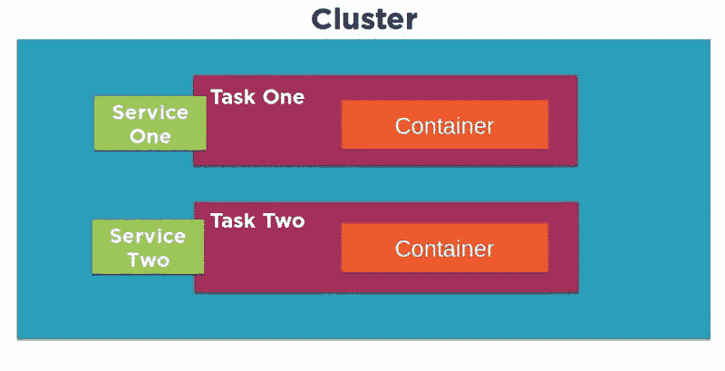

# 选择太多:如何选择合适的工具来管理 Docker 集群

> 原文：<https://www.freecodecamp.org/news/too-many-choices-how-to-pick-the-right-tool-to-manage-your-docker-clusters/>

玩 Docker 游戏有各种各样的方法，显然，没有一种方法适合所有用例。所以我在这里要做的是给你一个简单的*功能性的*概述每个最明显的管理选项，这种方式可以帮助你自己选择，并在这个过程中为你节省大量的时间和挫折。这样你看起来很聪明，没人会知道一直是我。

首先，这里有一句话，关于任何主题的每篇文章，即使与 Docker 有一点点关系，都必须以这句话开头:在过去的 n 年里(其中 n < 6)，容器技术，尤其是 Docker，已经成为应用程序供应领域的主导工具。

太好了。这个问题解决了，我们可以开始谈正事了。所以你正在考虑通过 Docker 容器来交付你的应用或网络服务…或者至少给他们一个好的外观。我当然不会和你争论:那可能是个好选择。

现在，想必您已经知道 Docker Engine 是一个开源软件环境，它允许您虚拟化主机硬件系统的各个部分，直到它们看起来和操作起来就像真正的服务器一样。Docker 现在有免费(社区版)和商业支持(企业版)两种版本。

毫无疑问，您也知道如何从命令行调用 Docker 引擎，比如:

```
$ docker ps$ docker images
```

并且:

```
$ docker network inspect
```

…会把事情做好。对这一切不太适应？我在 Pluralsight 的面向 Docker 的课程中包含了一些你可能会喜欢的入门材料。

当你正在学习的时候，所有这些都会很好的工作。但是，一旦您准备好开始规划一个强大且高度可扩展的部署，包括可能包含微服务和网桥的复杂配置，那么情况就会迅速发生变化。问题不在于“如何”，而在于“在哪里和哪个地方”:你有本地运行你的应用的计算和网络资源吗，或者你需要找一个主机吗？应该自己做还是选择像 AWS 的 Elastic Beasntalk 这样的公有云上的托管服务？

然后行政呢？你是一个事必躬亲的人，还是更喜欢站在后面一两层，让 Kubernetes 或 Docker swarm mode 等管理工具为你做一些繁重的工作？或者回到两三层，用 Ansible 或 Puppet 怎么样？

让我们将事情分成三类:**存储库工具**用于存储和管理 Docker 映像，**管理框架**用于在 Docker 容器的生命周期中定义、启动和管理它们，然后是一些命令行和配置自动化**管理工具**。

## 1.图像注册表

### 坞站集线器

对于大多数人来说，寻找 Docker 映像(包含用于运行容器的操作系统和软件的包)的第一个地方显然是 Docker Hub。Docker Hub 由 Docker 自己提供，它保存了大量预加载的图像，以支持各种应用程序项目。你可以在[hub.docker.com](https://hub.docker.com/)网站上找到并研究图像，然后将它们直接放入你自己的 Docker 引擎环境中。

```
$ docker pull ubuntu
```

一旦你开始创建你自己的图像，你就可以安全地在 Docker Hub 上的公共存储库中存储尽可能多的图像。此外，他们将允许你免费进行一次私人回购，并以每次回购大约 1 美元的价格进行更多回购。也许 Docker Hub 最棒的一点是它可以与连接到 Docker 的任何东西无缝协作，包括 AWS 等公共云提供商和 Docker Cloud 等基础设施管理服务。

独立的 Docker Store 服务允许您发布预先认证的图像和插件，以满足访问可信资源的需求。

### EC2 集装箱注册中心(ECR)

亚马逊的 AWS 完全了解 Docker 的力量和潜力，并希望参与这场游戏。作为他们努力向尽可能多的 Docker 业务开放云生态系统的一部分，他们已经建立了自己的注册中心来支持他们的 EC2 容器服务平台:ECR。可以通过 AWS GUI 或 CLI 工具推、拉和管理映像。权限策略可以严格控制只有您选择的人才能访问图像。

局限性？ECR 显然是为运行在基于 AWS 的服务上的基础设施而设计的，比如 ECS 和 Elastic Beanstalk。

### 坞站注册表

如果您需要将您的图像保存在离家近一点的地方，无论是出于安全还是实际原因，那么您会想要了解 Docker 免费提供的 Docker 注册表。您指定一个注册服务器，可以访问您的其他网络资产，安装并启用 docker-registry 包，标记图像，使它们指向您的本地注册表，这样您就有了一个真正的私人回购。

```
$ dpkg -i docker-registry_2.4.1~ds1-2_amd64.deb$ systemctl enable docker-registry$ docker tag hello-world localhost:5000/hello-world:latest
```

图像本身存储在服务器的文件系统中，但是它们可以通过 Docker Hub 上的相同 CLI 工具获得。担心保护您的图像？Docker Registry 允许您应用 SSL/TLS 证书，并通过对您的站点实施登录验证来控制访问。

Docker 可信注册表是 Docker 的 Docker 注册表的商业版本。通过支付月费或年费，您可以获得额外的附加功能，包括支持、基于浏览器的 GUI 和 LDAP/AD 集成。

## 2.管理框架

即使您已经超越了只是看看如何工作的阶段，您可能仍然希望在本地保持一个活跃的 Docker 部署:也许您的客户端都是本地的，或者您的预计工作量并不那么重。或者你只是对安全有所怀疑。当然，我所说的“对安全的偏执”是指“对网络漏洞的现状了如指掌”。

“留在本地”的一个方法是继续你一直在做的事情。只要考虑到资源安全和容量，就没有理由放弃已经安装的社区版 Docker 引擎。

但是，如果您认为您将要面对的复杂程度让您感到有点失落，那么您可能需要考虑升级到一个商业环境，在持续的支持下，可以提供基于浏览器的管理控制台。不管怎样，你都需要提供你自己的托管环境来运行你的容器。这可能是您的本地服务器，或者运行在公共云中的虚拟机，如 AWS 或 Azure。

### 数据中心坞站

通过在本地服务器上下载并安装常规的 Docker 引擎，以及名为 Docker Universal Control Plane(UCP)的第二个软件包，您可以设置数据中心(现在作为 Docker Enterprise Edition 的一部分销售)。UCP 提供了一个浏览器界面，允许对构成基础架构的所有图像、应用程序和网络进行集中管理。安全性也是通过接口来处理的。

### Docker 云

与 Docker Datacenter(也是 Docker 的官方产品)非常相似，Docker Cloud 提供了一个基于浏览器的 GUI 控制台，用于管理 Docker 部署的各个方面。这包括管理在公共云中运行的主机节点。最大的区别是，与数据中心不同，Docker 云管理服务是由 cloud.docker.com 的站点托管的:不需要在你自己的设备上安装服务器软件。


*Docker Cloud — cloud provider settings*

它的工作原理是为你的云提供商帐户(如 AWS)输入认证信息，或者在任何有网络连接的 Linux 或 Windows 机器上安装 Docker 云代理。单击“节点群集”窗口中的“自带节点”按钮，将显示一个 Linux 命令，用于下载和安装代理，可能如下所示:

```
$ curl -Ls https://get.cloud.docker.com/ | sudo -H sh -s 90b501cb04e344bfbf76890a09362c39
```

Docker Cloud 将资源组织到节点集群中，节点集群是作为单个服务的一部分进行管理的单个节点组，所有节点都致力于统一的部署目标。

我认为，Docker 继续推广两种类似服务(数据中心和云)的部分原因可以追溯到几年前，当时 Docker 收购了一家名为 Tutum 的公司，并将他们基于网络的产品重新命名为 Docker Cloud。Tutum 已经有了一个快乐的客户群和一个相当成功的商业模式，所以没有理由关闭它。在任何情况下，两者都有效，所以选择一个让你想起的。

### AWS EC2 集装箱服务(ECS)

除了 ECR 映像注册表，AWS 还为托管和管理 Docker 容器集群创建了自己的完整基础设施。ECS 的工作方式是提供一个专门构建的 EC2 实例，并安装 Docker 引擎和 ECS 代理。使用 ECS 控制台或 AWS CLI，您可以在 EC2 实例上定义、启动和管理容器。

```
$ aws ecs describe-clusters
```

老实说，弄清楚所有这些 ECS 部件是如何组合在一起的是一项艰巨的任务。我在 Pluralsight 上的“在亚马逊网络服务上使用 Docker”课程花了一些时间来解释这些部分是如何工作的。下面是简短的版本:

*   **任务**:定义应用程序及其网络、存储和安全环境的元数据
*   服务:启动、监控和控制你的容器的软件
*   容器(Containers):将运行任务的机器的定义
*   **集群**:任务和服务的组织结构



*A diagram of the EC2 Container Service architecture*

### AWS 弹性豆茎

Elastic Beanstalk 实际上位于 ECS 之上，允许您在 ECS 通常使用的所有 AWS 资源上部署应用程序，但是几乎所有的逻辑都被巧妙地抽象掉了。实际上，要启动一个完全可扩展的复杂微服务环境，您所需要的只是一个名为 Dockerrun.aws.json 的文件中的声明性 JSON 格式的脚本。

```
$ eb run
```

仅此而已。不真的。

我应该提到 Dockerrun.aws.json 文件有两种风格:V1 用于单容器部署，V2 用于多容器部署。同样值得注意的是，与浏览器版本相比，使用 CLI 的一个很大的优势是它可以更容易地远程 SSH 登录到 EC2 主机和管理任务。

这里还有一些事情要考虑:我的“[在一个月的午餐中学习亚马逊网络服务](https://www.manning.com/books/learn-amazon-web-services-in-a-month-of-lunches?a_aid=bootstrap-it&amp;a_bid=1c1b5e27)”一书的前 17 章一步一步地追溯了一个高度可用、可伸缩和安全的 WordPress 站点的构建。对于第 19 章——只是为了快速说明它是如何工作的——我创建了一个 20 行的 Dockerrun.aws.json 文件，它做了几乎完全相同的事情……但只用了五分钟。

这并不是说这本书的前 17 章是浪费时间！事实上，如果不了解每个独立的 AWS 服务是如何工作的，您就无法完全理解 Beanstalk 实际上完成了什么。而且，您肯定会错过各种各样的功能，这些功能会带您超越 Beanstalk 所能提供的东西。但是它确实说明了脚本部署的强大之处，不是吗？

## 3.管理工具

#### 码头工人群体模式

虽然它现在是 Docker Engine 的一部分，也许是因为它仍在不断变化，但 Docker swarm mode 多少有点独立产品的味道。想法是您可以指定您的一个服务器(称为节点)作为管理器:

```
$ docker swarm init
```

…以及作为客户端的其他服务器:

```
$ docker swarm join
```

从那里，使用管理器中的“docker service”命令将创建和管理 docker 容器集群作为服务，并自动有效地将容器分布在所有可用的服务器中，无论它们位于何处。您应该亲自尝试一下，体验一下运行一个简单的“服务规模”命令并看到适当数量的容器神奇地立即出现在您的网络中的快感。

```
$ docker service create -p 80:80 --name webserver nginx$ docker service scale webserver=5
```

我将我的 [Pluralsight“使用 Docker 和 AWS 弹性豆茎”](http://pluralsight.pxf.io/c/1191769/424552/7490?subId1=solving&u=https%3A%2F%2Fapp.pluralsight.com%2Fprofile%2Fauthor%2Fdavid-clinton)课程的一部分专门用于演示 Docker Swarm 的运行。有兴趣就看看吧。

### 库伯内特斯

和 Swarm 一样，Google 的 Kubernetes 也非常擅长高效管理大型容器集群。说 Kubernetes 受欢迎就像说雨是湿的。咄。

Kubernetes 将资源组织到 pod 中，pod 本身由运行单个微服务的互连容器组成。你应该把一个吊舱看作是完全一次性的，它的功能可以被其他等待进入这个世界的人立即替代。

事实上，pods 是根据主节点上定义的需求由调度器和复制控制器创建和销毁的，所有这些都可以由 kubectl 程序管理。pod 和它们的容器运行在称为工作节点的服务器上，这些工作节点运行它们自己的 Docker 引擎实例。

我不知道你怎么想，但我发现每个 it 平台都选择用不同的名称来指代组成元素，这既令人困惑又令人恼火，但这些名称往往只是略有不同。应该有法律。

### 部署自动化工具

我不能不提到如何使用任何流行的部署编排工具(如 Ansible、Jenkins 和 Puppet)来自动化您的 Docker 环境。深入细节将使我远远超出本文的最初计划，所以只需选择您最喜欢的工具并记录下来。

那有帮助吗？检查出我的 [*Bootstrap IT 网站*](https://bootstrap-it.com/) *为类似的 Docker，Linux 和 AWS 好负载。*