# 如何使用 Particle 强大的蓝牙 API

> 原文：<https://www.freecodecamp.org/news/how-to-use-particles-powerful-bluetooth-api/>

**本帖最初来自[www.jaredwolff.com](https://www.jaredwolff.com/how-to-use-particles-powerful-bluetooth-api/)**

我被打败了。

我花了整整一个晚上试图让一个蓝牙低能耗项目工作。很痛苦。令人沮丧。我准备放弃了。

那是在蓝牙低能耗的早期。从那时起，它变得越来越容易开发。粒子网格蓝牙库也不例外。

在本演练中，我将向您展示如何使用粒子的蓝牙 API。我们将配置一些 led，并观察它们在网状网络中所有设备上的变化。我们将使用氩氙板。

准备好了吗？我们开始吧！

附:这个帖子很长。如果你想下载一些东西，点击这里获得一个精美的 PDF 格式。

## 阶段 1:设置蓝牙

1.  [下载/安装粒子工作台](https://www.particle.io/workbench/)

2.  创建新项目。我挑选了一个合适的地点，然后命名为`ble_mesh`

    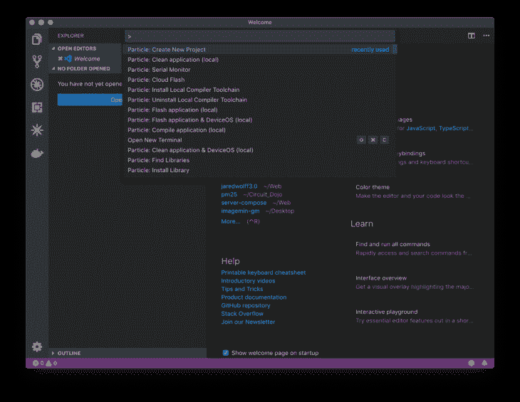

3.  去你的`/src/`目录并打开你的`<your project name>.ino`文件

4.  然后，确保您将设备操作系统的版本更改为> **1.3.0**

    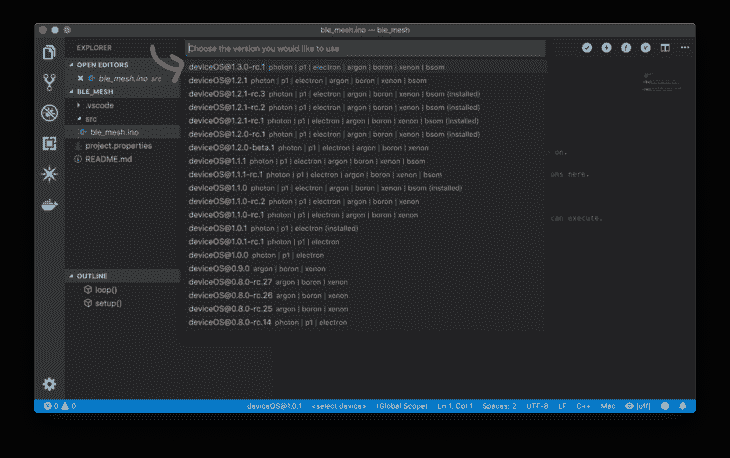

### 写代码

我们希望建立一个具有 3 个特征的服务。这些特性分别与 RGB LEDs 的强度相关。以下是设置蓝牙的方法:

1.  在您的`Setup()`功能中，启用应用程序对 LED 的控制

    ```
    RGB.control(true); 
    ```

2.  在你的`.ino`文件的顶部设置你的 UUIDs

    ```
     const char* serviceUuid = "6E400001-B5A3-F393-E0A9-E50E24DCCA9E";
     const char* red         = "6E400002-B5A3-F393-E0A9-E50E24DCCA9E";
     const char* green       = "6E400003-B5A3-F393-E0A9-E50E24DCCA9E";
     const char* blue        = "6E400004-B5A3-F393-E0A9-E50E24DCCA9E"; 
    ```

    UUIDs 是唯一的标识符或地址。它们用于区分设备上的不同服务和特性。

    上面的 UUIDs 用在前面的粒子例子中。如果你想创建自己的，你可以在 OSX 命令行使用`uuidgen`。也可以去类似 **[的网站在线 GUID 生成器](https://www.guidgenerator.com/online-guid-generator.aspx)。**

    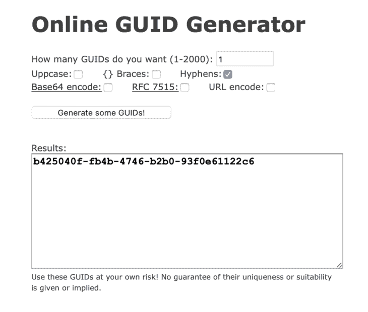

    使用以上设置获得您自己的 UUID。然后，您可以从这个生成的 UUIDS 创建您的服务和特征 UUIDS:

    ```
     const char* serviceUuid = "b425040**0**-fb4b-4746-b2b0-93f0e61122c6"; //service
     const char* red         = "b4250401-fb4b-4746-b2b0-93f0e61122c6"; //red char
     const char* green       = "b4250402-fb4b-4746-b2b0-93f0e61122c6"; //green char
     const char* blue        = "b4250403-fb4b-4746-b2b0-93f0e61122c6"; //blue char 
    ```

    做这件事没有对错之分。但是你必须小心不要使用蓝牙 SIG 保留的 UUIDs。这是极不可能的。如果你想仔细检查，你可以去[这里](https://www.bluetooth.com/specifications/gatt/characteristics/)和[这里](https://www.bluetooth.com/specifications/gatt/services/)。

    现在，我们将坚持使用第一组 UUIDs。

3.  在`Setup()`中，初始化您的服务。

    ```
     // Set the RGB BLE service
     BleUuid rgbService(serviceUuid); 
    ```

    这是“注册”您的服务的第一步。以下是更多相关信息。

4.  初始化`Setup()`中的每个特性

    ```
     BleCharacteristic redCharacteristic("red", BleCharacteristicProperty::WRITE_WO_RSP, red, serviceUuid, onDataReceived, (void*)red);
     BleCharacteristic greenCharacteristic("green", BleCharacteristicProperty::WRITE_WO_RSP, green, serviceUuid, onDataReceived, (void*)green);
     BleCharacteristic blueCharacteristic("blue", BleCharacteristicProperty::WRITE_WO_RSP, blue, serviceUuid, onDataReceived, (void*)blue); 
    ```

    对于这个设置，我们将使用`WRITE_WO_RSP`属性。这允许我们写入数据，并且不期望任何响应。
    我引用了 UUIDs 作为接下来的两个参数。第一个是典型的 UUID。第二个是服务 UUID。

    下一个参数是回调函数。当数据被写入这个回调时，这个函数将被触发。

    最后，最后一个参数是上下文。这到底是什么意思？我们对所有三个特征使用相同的回调。我们知道哪个特征被写入了(至少在 deviceOS 中)的唯一方法是设置一个上下文。在这种情况下，我们将使用已经可用的 UUIDs。

5.  定义特征后，让我们添加它们，这样它们就会显示出来:

    ```
     // Add the characteristics
     BLE.addCharacteristic(redCharacteristic);
     BLE.addCharacteristic(greenCharacteristic);
     BLE.addCharacteristic(blueCharacteristic); 
    ```

6.  设置回调函数。

    ```
     // Static function for handling Bluetooth Low Energy callbacks
     static void onDataReceived(const uint8_t* data, size_t len, const BlePeerDevice& peer, void* context) {

     } 
    ```

    你可以在文件的顶部这样做(在`Setup()`上面),我们稍后会详细说明。

7.  最后，为了让您的设备可以连接，我们必须设置广告。将这段代码放在您的`Setup()`函数的末尾

    ```
     // Advertising data
     BleAdvertisingData advData;

     // Add the RGB LED service
     advData.appendServiceUUID(rgbService);

     // Start advertising!
     BLE.advertise(&advData); 
    ```

    首先我们创建一个`BleAdvertisingData`对象。我们添加步骤 3 中的`rgbService`。最后，我们可以开始做广告，这样我们的服务和特色就可以被发现了！

### 测试时间到了

在这一点上，我们有一个最低限度的可行计划。让我们编译它，并将其编程到我们的粒子硬件。这应该适用于任何支持网格的设备。(氙、氩、硼)

1.  在我们开始测试之前，暂时将`SYSTEM_MODE(MANUAL);`添加到文件的顶部。这将阻止设备连接到网状网络。如果设备在启动时闪着蓝光，你必须在继续之前用[粒子应用](https://apps.apple.com/ru/app/particle-iot/id991459054?l=en)设置它。

2.  [在此下载 1.3.0-rc.1 镜像。](https://github.com/particle-iot/device-os/releases/tag/v1.3.0-rc.1)对于 Xenon，您需要**Xenon-system-part 1 @ 1 . 3 . 0-RC . 1 . bin .**对于其他，请查找**boron-system-part 1 @ 1 . 3 . 0-RC . 1 . bin**和**argon-system-part 1 @ 1 . 3 . 0-RC . 1 . bin .**文件在页面底部的**资产**下

    

3.  将您的设备置于 DFU 模式。按住**模式按钮**，瞬间点击**复位** **按钮。**继续按住**模式按钮**直到 LED 闪烁黄色。

4.  在命令行窗口中，将目录更改为存储下载文件的位置。在我的例子中，命令是`cd ~/Downloads/`

5.  然后运行:

    ```
     particle flash --usb xenon-system-part1@1.3.0-rc.1.bin 
    ```

    这将安装最新的操作系统到你的氙。一旦完成，它将继续快速闪烁黄色。同样，如果你有一个不同的粒子网格设备，改变文件名来匹配。

6.  在可视化代码中，使用 **Command + Shift + P** 组合键弹出命令菜单。选择**粒子:编译应用程序(本地)**

    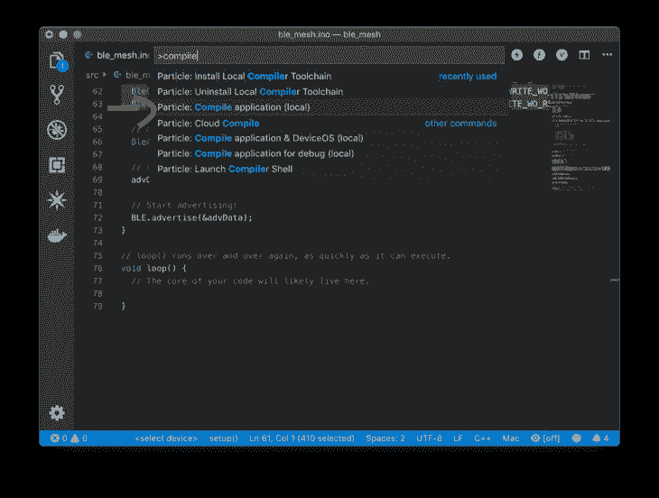

7.  修复任何可能出现的错误。

8.  然后，打开同一菜单，选择 **Flash 应用程序(本地)**

    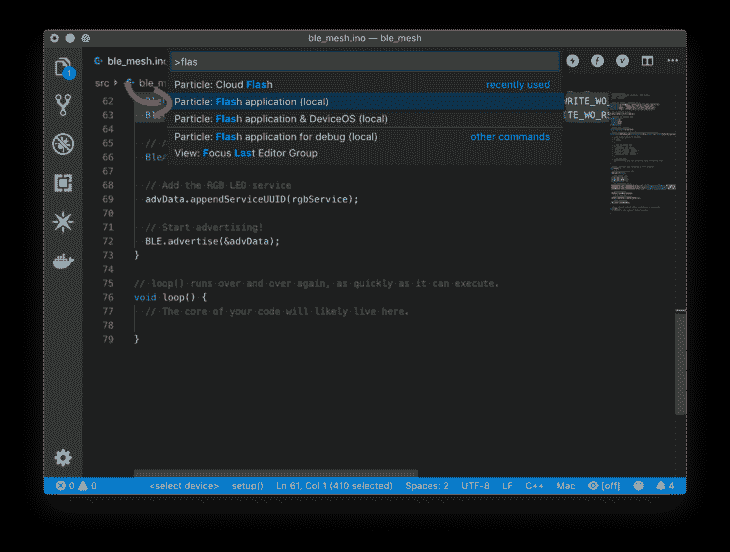

9.  编程完成后，拿出手机。然后，打开你最喜欢的蓝牙低能耗 app。最好的是 **[NRF 连接](https://apps.apple.com/cn/app/nrf-connect/id1054362403?l=en)** 和 **[浅蓝色探索者。在这个例子中，我将使用浅蓝色的浏览器。](https://apps.apple.com/ru/app/lightblue-explorer/id557428110?l=en)**

10.  检查一个名为**“氙-<id>”</id>**的设备是否是广告。插入和您设备的唯一 ID。

    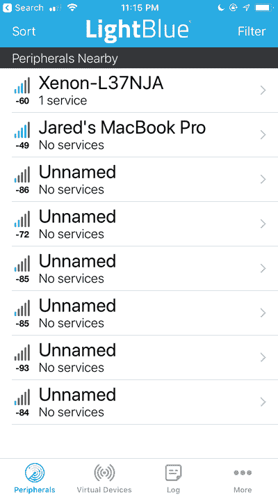

11.  找到您的设备并单击名称。

12.  查看服务和特性列表。包括我们目前设定的服务和特色 UUID 吗？例如，服务 UUID 是否显示为**6e 400001-b5 a3-F393-e0a 9-e 50 e 24 DCCA 9 e**？

    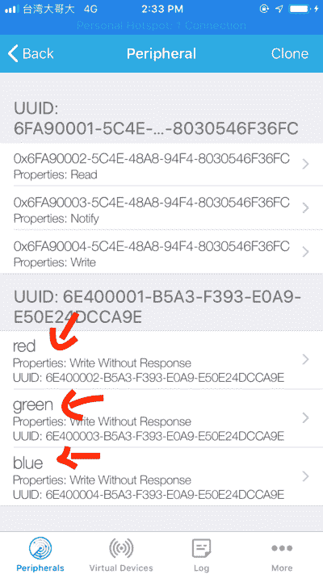

    如果一切都如你所料，你就在一个好地方。如果不匹配，请仔细阅读前面的说明，确保一切匹配。

## 阶段 2:处理数据

我们项目的下一步是处理写事件。我们将更新我们的`onDataReceived`功能。

### 写代码

1.  首先，让我们创建一个保持 led 状态的结构。这可以在文件的顶部完成。

    ```
     // Variables for keeping state
     typedef struct {
       uint8_t red;
       uint8_t green;
       uint8_t blue;
     } led_level_t; 
    ```

2.  第二部分是使用这个数据类型创建一个静态变量

    ```
     // Static level tracking
     static led_level_t m_led_level; 
    ```

    前两步允许我们使用一个变量来表示 RGB LED 的三个值。

3.  接下来，让我们检查一下`onDataReceive`函数中的基本错误，例如我们想确保我们只接收一个字节。

    ```
     // We're only looking for one byte
       if( len != 1 ) {
         return;
     	} 
    ```

4.  接下来，我们想看看这个事件来自哪个特征。我们可以使用`context`变量来确定这一点。

    ```
     // Sets the global level
       if( context == red ) {
         m_led_level.red = data[0];
       } else if ( context == green ) {
         m_led_level.green = data[0];
       } else if ( context == blue ) {
         m_led_level.blue = data[0];
       } 
    ```

    记住，在这种情况下，上下文将等于红色、绿色或蓝色 UUID 字符串的指针。你也可以注意到我们正在设置`m_led_level`。这样，即使只有一个值发生变化，我们也可以更新 RGB led。

5.  最后，一旦设置完毕，您就可以写入`RGB`对象

    ```
     // Set RGB color
     	RGB.color(m_led_level.red, m_led_level.green, m_led_level.blue); 
    ```

### 测试代码

让我们按照与之前相同的步骤来刷新设备。

1.  将您的设备置于 DFU 模式。按住**模式按钮**，点击**复位** **按钮。**继续按住**模式按钮**直到 LED 闪烁黄色。

2.  然后，打开同一菜单，选择 **Flash 应用程序(本地)**

    

3.  编程完成后，使用**浅蓝色浏览器**连接到设备。

4.  点击适用于红色 LED 的特性。

5.  **写 FF** 。红色 LED 应该会亮起。

    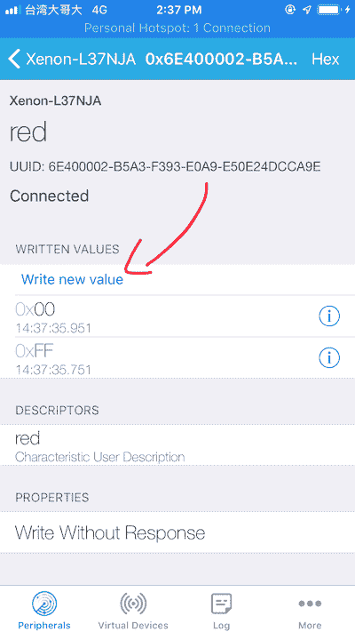

    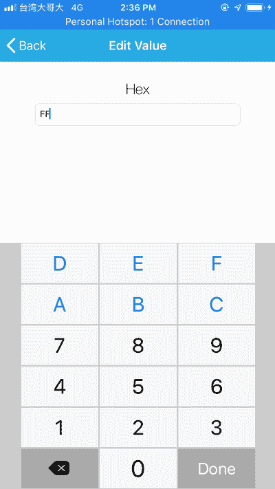

6.  **写 00** 。红色 LED 应该熄灭。

7.  对其他两个特征做同样的操作。我们现在可以通过蓝牙低能耗完全控制 RGB LED！

## 阶段 3:通过网格共享

最后，现在我们成功地接收到了 BLE 消息，是时候将它们转发到我们的网状网络了。

### 写代码

1.  首先让我们取消手动模式。注释掉`SYSTEM_MODE(MANUAL);`

2.  在文件的顶部，让我们添加一个变量，如果我们需要发布，我们将用它来跟踪

    ```
     // Tracks when to publish to Mesh
     static bool m_publish; 
    ```

3.  然后在`Setup()`中初始化

    ```
     // Set to false at first
     m_publish = false; 
    ```

4.  然后，在`onDataReceived`回调中设置 RGB led 后，让我们将其设置为 true:

    ```
     // Set RGB color
     RGB.color(m_led_level.red, m_led_level.green, m_led_level.blue);

     // Set to publish
     m_publish = true; 
    ```

5.  让我们在`loop()`函数中添加一个条件。这将导致我们向网状网络发布 LED 状态:

    ```
     if( m_publish ) {
     	// Reset flag
     	m_publish = false;

     	// Publish to Mesh
       Mesh.publish("red", String::format("%d", m_led_level.red));
       Mesh.publish("green", String::format("%d", m_led_level.green));
       Mesh.publish("blue", String::format("%d", m_led_level.blue));
     } 
    ```

    `Mesh.publish`两个输入都需要一个字符串。因此，我们使用`String::format`来创建一个包含红色、绿色和蓝色值的字符串。

6.  那么让我们订阅`Setup()`中的相同变量。这样，另一个设备也可以使该设备上的 LED 更新。

    ```
     Mesh.subscribe("red", meshHandler);
     Mesh.subscribe("green", meshHandler);
     Mesh.subscribe("blue", meshHandler); 
    ```

7.  在我们想要创建的文件的顶端`meshHandler`

    ```
     // Mesh event handler
     static void meshHandler(const char *event, const char *data)
     {
     } 
    ```

8.  在这个应用程序中，我们需要`event`参数和`data`参数。为了使用它们，我们必须把它们改成`String`型。这样，我们可以使用内置的转换和比较功能。所以，在`meshHandler`函数里面添加:

    ```
     // Convert to String for useful conversion and comparison functions
       String eventString = String(event);
       String dataString = String(data); 
    ```

9.  最后我们做了一些比较。我们首先检查事件名称是否匹配。然后，我们将`dataString`的值设置为相应的 led 级别。

    ```
     // Determine which event we recieved
       if( eventString.equals("red") ) {
         m_led_level.red = dataString.toInt();
       } else if ( eventString.equals("green") ) {
         m_led_level.green = dataString.toInt();
       } else if ( eventString.equals("blue") ) {
         m_led_level.blue = dataString.toInt();
       } else {
     		return;
     	}

       // Set RGB color
       RGB.color(m_led_level.red, m_led_level.green, m_led_level.blue); 
    ```

    然后在最后我们设置新的 RGB 颜色。注意我是如何通过在`else`部分添加一个`return`语句来处理未知状态的。在错误条件造成严重破坏之前过滤掉它们总是好的！

### 测试代码

1.  打开手机上的粒子应用程序

2.  让我们先设置氩气。**如果不是闪烁的蓝色，按住模式按钮直到它闪烁蓝色。**

    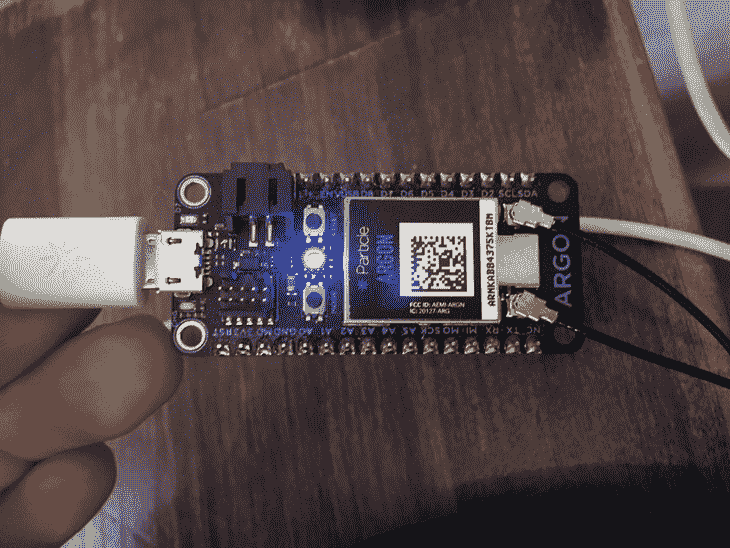

    注:如果您已经对应用程序进行了编程，LED 将默认关闭。**按住模式按钮 5 秒钟，然后继续。**

3.  完成配对过程。这个应用程序会引导你完成所有的步骤。确保您记住了网状网络的管理员密码。

    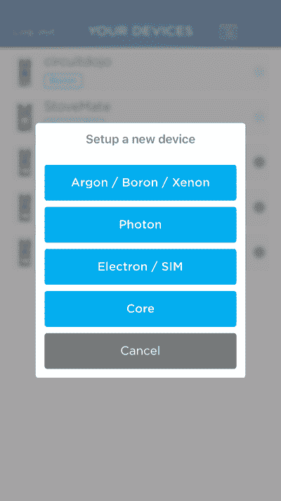

    

    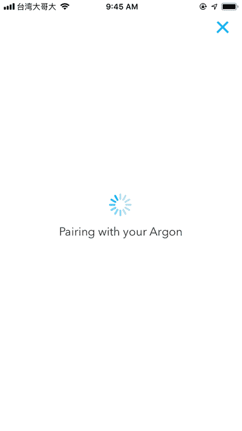

    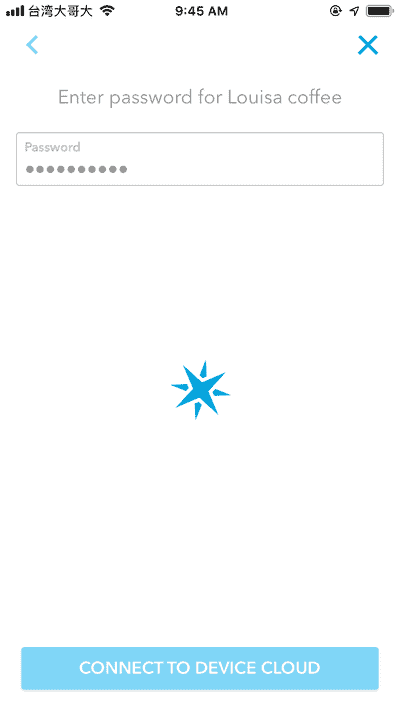

4.  使用最新固件(1.3.0)对氩气进行编程(参见**阶段 1 -测试时间-步骤 2** 了解如何进行该操作)

5.  一旦快速闪烁黄色，用 Tinker 应用程序编程氩气。可以在[发布页面](https://github.com/particle-iot/device-os/releases/tag/v1.3.0-rc.1)下载。

6.  一旦我们有了一个漂亮的固态青色 LED(连接到粒子云)，我们将编程应用程序。使用下拉菜单中的**云闪**选项。

    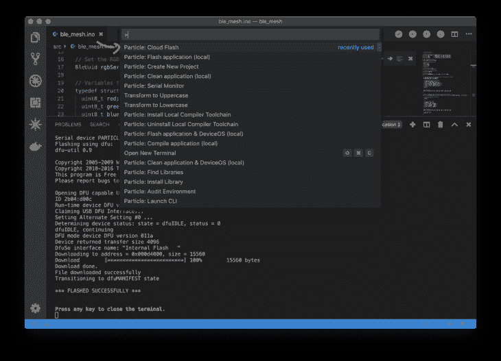

    据我所知，当连接到云时，Particle 会强制任何设备在本地闪速进入安全模式。可能是我设的套。您的里程可能会有所不同。最好用**云闪**。

    确保您选择了正确的设备操作系统版本( **1.3.0-rc1** )、设备类型(**氩**)和设备名称(**您在设置过程中命名的名称**)

7.  使用**手机应用**连接氙气灯

8.  使用手机应用程序将 Xenon 连接到您的网状网络

9.  使用**云闪**来闪烁你的氙气灯。使用您在设置手机应用程序时提供的名称。只要设备连接到粒子云或处于安全模式(紫色 LED)，它就应该可以编程。

    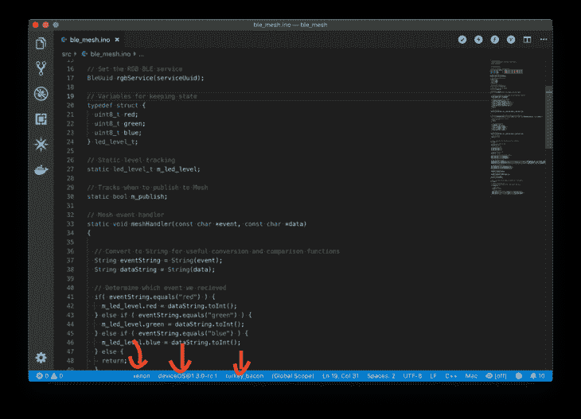

    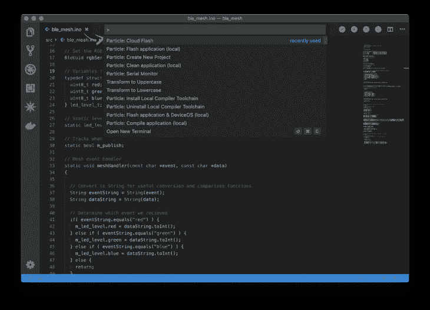

10.  一旦连接上，让我们开始有趣的部分。打开**浅蓝色探索者。**连接到**氩气**或**氙气**。

    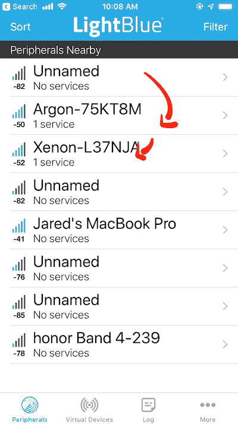

11.  选择一个 LED 特性并更改值。

    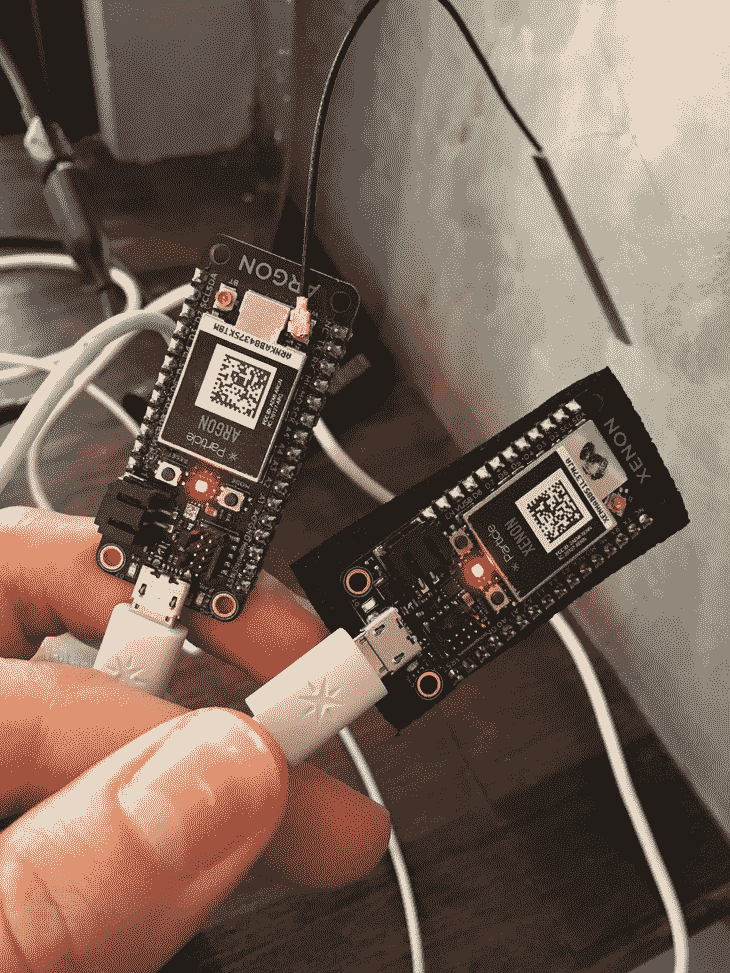

    所有设备上的指示灯都应该改变！

## 最终代码

这是所有部分组合在一起的最终代码。你可以用这个来确保你把它们放在正确的地方！！

```
/*
 * Project ble_mesh
 * Description: Bluetooth Low Energy + Mesh Example
 * Author: Jared Wolff
 * Date: 7/13/2019
 */

//SYSTEM_MODE(MANUAL);

// UUIDs for service + characteristics
const char* serviceUuid = "6E400001-B5A3-F393-E0A9-E50E24DCCA9E";
const char* red         = "6E400002-B5A3-F393-E0A9-E50E24DCCA9E";
const char* green       = "6E400003-B5A3-F393-E0A9-E50E24DCCA9E";
const char* blue        = "6E400004-B5A3-F393-E0A9-E50E24DCCA9E";

// Set the RGB BLE service
BleUuid rgbService(serviceUuid);

// Variables for keeping state
typedef struct {
  uint8_t red;
  uint8_t green;
  uint8_t blue;
} led_level_t;

// Static level tracking
static led_level_t m_led_level;

// Tracks when to publish to Mesh
static bool m_publish;

// Mesh event handler
static void meshHandler(const char *event, const char *data)
{

  // Convert to String for useful conversion and comparison functions
  String eventString = String(event);
  String dataString = String(data);

  // Determine which event we recieved
  if( eventString.equals("red") ) {
    m_led_level.red = dataString.toInt();
  } else if ( eventString.equals("green") ) {
    m_led_level.green = dataString.toInt();
  } else if ( eventString.equals("blue") ) {
    m_led_level.blue = dataString.toInt();
  } else {
		return;
	}

  // Set RGB color
  RGB.color(m_led_level.red, m_led_level.green, m_led_level.blue);

}

// Static function for handling Bluetooth Low Energy callbacks
static void onDataReceived(const uint8_t* data, size_t len, const BlePeerDevice& peer, void* context) {

  // We're only looking for one byte
  if( len != 1 ) {
    return;
  }

  // Sets the global level
  if( context == red ) {
    m_led_level.red = data[0];
  } else if ( context == green ) {
    m_led_level.green = data[0];
  } else if ( context == blue ) {
    m_led_level.blue = data[0];
  }

  // Set RGB color
  RGB.color(m_led_level.red, m_led_level.green, m_led_level.blue);

  // Set to publish
  m_publish = true;

}

// setup() runs once, when the device is first turned on.
void setup() {

  // Enable app control of LED
  RGB.control(true);

  // Init default level
  m_led_level.red = 0;
  m_led_level.green = 0;
  m_led_level.blue = 0;

  // Set to false at first
  m_publish = false;

  // Set the subscription for Mesh updates
  Mesh.subscribe("red",meshHandler);
  Mesh.subscribe("green",meshHandler);
  Mesh.subscribe("blue",meshHandler);

  // Set up characteristics
  BleCharacteristic redCharacteristic("red", BleCharacteristicProperty::WRITE_WO_RSP, red, serviceUuid, onDataReceived, (void*)red);
  BleCharacteristic greenCharacteristic("green", BleCharacteristicProperty::WRITE_WO_RSP, green, serviceUuid, onDataReceived, (void*)green);
  BleCharacteristic blueCharacteristic("blue", BleCharacteristicProperty::WRITE_WO_RSP, blue, serviceUuid, onDataReceived, (void*)blue);

  // Add the characteristics
  BLE.addCharacteristic(redCharacteristic);
  BLE.addCharacteristic(greenCharacteristic);
  BLE.addCharacteristic(blueCharacteristic);

  // Advertising data
  BleAdvertisingData advData;

  // Add the RGB LED service
  advData.appendServiceUUID(rgbService);

  // Start advertising!
  BLE.advertise(&advData);
}

// loop() runs over and over again, as quickly as it can execute.
void loop() {

  // Checks the publish flag,
  // Publishes to a variable called "red" "green" and "blue"
  if( m_publish ) {

    // Reset flag
    m_publish = false;

    // Publish to Mesh
    Mesh.publish("red", String::format("%d", m_led_level.red));
    Mesh.publish("green", String::format("%d", m_led_level.green));
    Mesh.publish("blue", String::format("%d", m_led_level.blue));
  }

} 
```

## 结论

在本教程中，您学习了如何将蓝牙添加到粒子网格项目中。可以想象，可能性是无穷无尽的。例如，您可以将用户/管理应用程序添加到体验中。这太棒了。？

你可以在我即将出版的书中期待更多这样的内容: ***粒子网格终极指南*** 。订阅我的列表以获取更新和内部内容。此外，所有早期订户在发行时都可以享受折扣！[点击这里报名。](https://www.jaredwolff.com/the-ultimate-guide-to-particle-mesh)