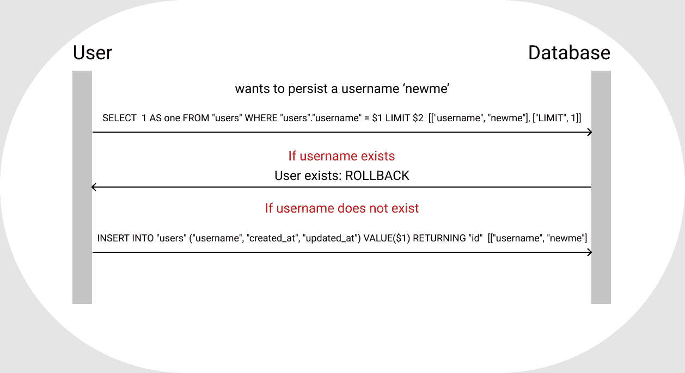
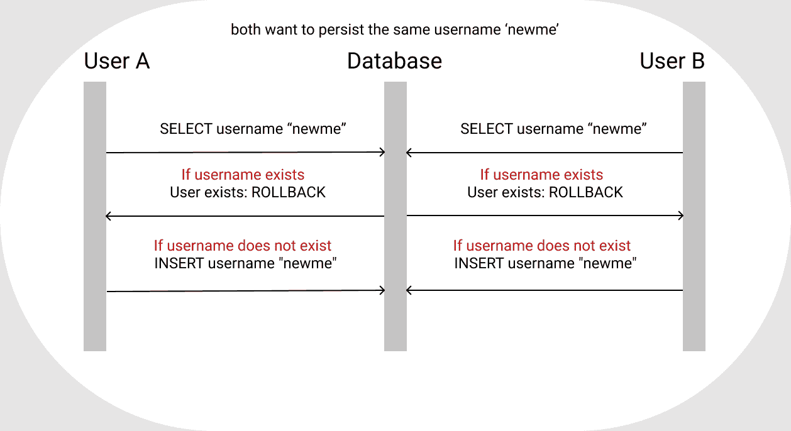
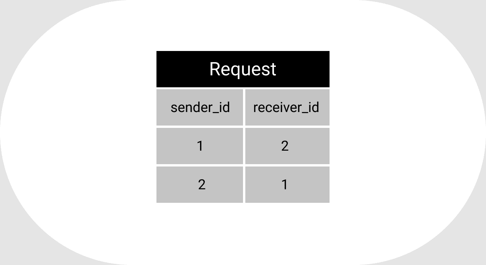
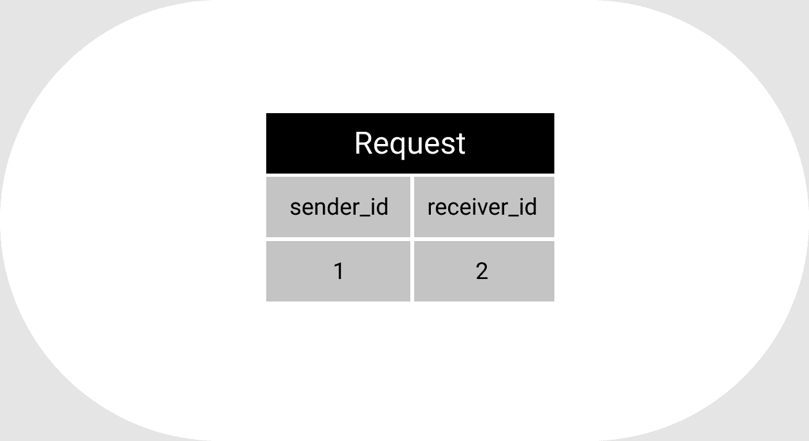

# Rails:如何设置唯一的可互换索引约束

> 原文：<https://www.freecodecamp.org/news/how-to-set-unique-interchangeable-index-constraint-in-rails/>

在 rails 中设置唯一性验证是您经常要做的事情。也许，你甚至已经把它们添加到你的大部分应用程序中了。然而，这种验证只能提供良好的用户界面和体验。它通知用户阻止数据在数据库中持久化的错误。

### 为什么唯一性验证是不够的

即使进行了唯一性验证，不需要的数据有时也会保存在数据库中。为了清楚起见，让我们看一下如下所示的用户模型:

```
class User
    validates :username, presence: true, uniqueness: true
end 
```

为了验证 username 列，rails 使用 SELECT 查询数据库，查看用户名是否已经存在。如果存在，它将打印“用户名已经存在”。如果没有，它将运行一个插入查询，将新用户名保存在数据库中。



当两个用户同时运行相同的流程时，数据库有时会保存数据，而不考虑验证约束，这就是数据库约束(唯一索引)的作用。

如果用户 A 和用户 B 同时试图将同一个用户名保存到数据库中，rails 会运行 SELECT 查询，如果用户名已经存在，它会通知这两个用户。但是，如果数据库中不存在用户名，它将同时为两个用户运行插入查询，如下图所示。



现在你知道了为什么数据库唯一索引(数据库约束)是重要的，让我们进入如何设置它。在 rails 中为任何一列或一组列设置数据库惟一索引非常容易。然而，rails 中一些数据库约束可能很棘手。

### 快速浏览为一个或多个列设置唯一索引

这和运行迁移一样简单。假设我们有一个 users 表，其中包含 username 列，我们希望确保每个用户都有一个惟一的用户名。您只需创建一个迁移并输入以下代码:

```
add_index :users, :username, unique: true 
```

然后运行迁移，就这样。数据库现在确保表中没有保存类似的用户名。

对于多个关联的列，假设我们有一个包含 sender_id 和 receiver_id 列的请求表。类似地，您只需创建一个迁移并输入以下代码:

```
add_index :requests, [:sender_id, :receiver_id], unique: true 
```

就这样吗？哦哦，没那么快。

### 以上多列迁移的问题

问题是，在这种情况下，id 是可以互换的。这意味着，如果 sender_id 为 1，receiver_id 为 2，请求表仍然可以保存 sender_id 为 2，receiver_id 为 1，即使它们已经有一个挂起的请求。

这个问题经常发生在自我参照的联想中。这意味着发送者和接收者都是用户，并且从 user_id 引用 sender_id 或 receiver_id。user_id(sender_id)为 1 的用户向 user_id(receiver_id)为 2 的用户发送请求。

如果接收者再次发送另一个请求，并且我们允许它保存在数据库中，那么我们在请求表中有来自相同的两个用户(发送者和接收者||接收者和发送者)的两个相似的请求。

下图对此进行了说明:



### 常见的解决方法

这个问题通常可以用下面的伪代码来解决:

```
def force_record_conflict
    # 1\. Return if there is an already existing request from the sender to receiver 
    # 2\. If not then swap the sender and receiver
end 
```

这种解决方案的问题是，每次在保存到数据库之前，receiver_id 和 sender_id 都会被交换。因此，receiver_id 列必须保存 sender_id，反之亦然。

例如，如果 sender_id 为 1 的用户向 receiver_id 为 2 的用户发送请求，则请求表如下所示:


这听起来不像是一个问题，但是如果您的列保存了您希望它们保存的确切数据，那就更好了。这有许多优点。例如，如果您需要通过 receiver_id 向接收方发送通知，那么您将从 receiver_id 列中查询数据库以获得确切的 id。当您开始切换保存在请求表中的数据时，这已经变得更加混乱了。

### 正确的解决方法

这个问题可以通过直接与数据库对话来完全解决。在这种情况下，我将使用 PostgreSQL 进行解释。运行迁移时，在保存之前，必须确保唯一约束检查请求表中的(1，2)和(2，1)。

您可以通过使用以下代码运行迁移来实现这一点:

```
class AddInterchangableUniqueIndexToRequests < ActiveRecord::Migration[5.2]
    def change
        reversible do |dir|
            dir.up do
                connection.execute(%q(
                    create unique index index_requests_on_interchangable_sender_id_and_receiver_id on requests(greatest(sender_id,receiver_id), least(sender_id,receiver_id));
                    create unique index index_requests_on_interchangable_receiver_id_and_sender_id on requests(least(sender_id,receiver_id), greatest(sender_id,receiver_id));
                ))
            end

            dir.down do
                connection.execute(%q(
                    drop index index_requests_on_interchangable_sender_id_and_receiver_id;
                    drop index index_requests_on_interchangable_receiver_id_and_sender_id;
                ))
            end    
        end
    end
end 
```

### 代码解释

创建迁移文件后，可恢复的是确保我们可以在任何需要的时候恢复数据库。`dir.up`是在我们迁移数据库时运行的代码，而`dir.down`将在我们向下迁移或恢复数据库时运行。

`connection.execute(%q(...))`就是告诉 rails 我们的代码是 PostgreSQL。这有助于 rails 将我们的代码作为 PostgreSQL 运行。

由于我们的“id”是整数，在保存到数据库之前，我们使用下面的代码检查最大值和最小值(2 和 1)是否已经在数据库中:

```
requests(greatest(sender_id,receiver_id), least(sender_id,receiver_id)) 
```

然后，我们还使用以下方法检查最小和最大值(1 和 2)是否在数据库中:

```
requests(least(sender_id,receiver_id), greatest(sender_id,receiver_id)) 
```

请求表将完全符合我们的意图，如下图所示:



仅此而已。编码快乐！

### 参考资料:

[Edgeguides](https://edgeguides.rubyonrails.org/active_record_validations.html#uniqueness) | [思维机器人](https://thoughtbot.com/blog/the-perils-of-uniqueness-validations)