# 如何测试 React 组件:完整指南

> 原文：<https://www.freecodecamp.org/news/testing-react-hooks/>

当我第一次开始学习测试我的应用程序时，我会对用于测试的不同类型、风格和技术感到非常沮丧，还有一系列解散的博客帖子、教程和文章。我发现 React 测试也是如此。

所以我决定在一篇文章中写一个完整的 React 测试指南。

完整的指南，嗯，你会涵盖所有可能的测试场景吗？当然不是。然而，这将是一个完整的测试基础指南，并且足以用于大多数其他边缘情况。

此外，我还在最后的进一步阅读部分收集了大量的博客文章、文章和教程，这些应该会给你足够的知识，让你在测试方面成为前 10%的开发人员。

您可以在这里找到已完成的项目:

[https://github.com/iqbal125/react-hooks-testing-complete](https://github.com/iqbal125/react-hooks-testing-complete)

## 目录

**理论**

*   什么是测试？
*   为什么要测试？
*   考什么？
*   不测试什么？
*   我如何测试
*   浅 vs 安装
*   单元 vs 集成 vs e 到 e

**初步信息**

*   一些零碎的东西

**酶**

*   Enyme 设置
*   反应-测试-呈现器
*   快照测试
*   测试实施细节

**反应测试库**

*   使用状态和道具
*   useReducer()
*   useContext()
*   受控组件表单
*   useEffect()和 Axios API 请求

**柏树**

*   完整的端到端测试

**持续集成**

*   特拉维斯. yml
*   用工作服覆盖代码

## 理论

### 什么是测试？

让我们从头开始，讨论什么是测试。测试分为三个步骤，如下所示:

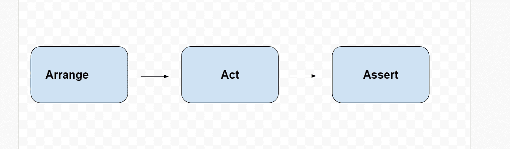

安排一下，你的 app 处于某个原始状态。动作，然后有事情发生(点击事件，输入等。).然后你断言，或者做一个假设，你的应用程序的新状态。如果你的假设是正确的，测试就会通过，如果假设是错误的，测试就会失败。

与 react 组件不同，您的测试不在浏览器中执行。Jest 是 React 使用的测试运行器和测试框架。Jest 是实际执行所有测试的环境。这就是为什么你不需要导入`expect`和`describe`到这个文件。这些函数已经在 jest 环境中全局可用。

您的测试语法将如下所示:

```
describe('Testing sum', () => {
    function sum(a, b) {
       return a + b;
    }

    it('should equal 4',()=>{
       expect(sum(2,2)).toBe(4);
      })

    test('also should equal 4', () => {
        expect(sum(2,2)).toBe(4);
      }) 
});
```

`describe`包装了我们的`it`或`test`块，并且是一种对我们的测试进行分组的方法。`it`和`test`都是关键词，可以互换使用。该字符串将是测试中应该出现的内容，并将被打印到控制台。`toBe()` 是一个匹配器，它与 expect 一起工作，允许您做出断言。jest 提供了更多的匹配器和全局变量，完整列表见下面的链接。

[https://jestjs.io/docs/en/using-matchers](https://jestjs.io/docs/en/using-matchers)

[https://jestjs . io/docs/en/API](https://jestjs.io/docs/en/api)

### 

为什么要考试？

测试是为了确保你的应用程序能为你的终端用户正常工作。进行测试会让你的应用程序更健壮，更不容易出错。这是一种验证代码是否如开发人员所愿的方法。

潜在缺点:

*   编写测试既耗时又困难。
*   在某些场景中，在 CI 中执行测试会花费实际的金钱。
*   如果做得不正确，它会给你假阳性。您的测试通过了，但是您的应用程序没有按预期运行。
*   或者假阴性。您的测试失败了，但是您的应用程序运行正常。

### 考什么？

为了建立在前一点的基础上，你的测试应该测试应用程序的功能，模拟最终用户将如何使用它。这将让您确信您的应用程序将在您的生产环境中正常运行。当然，在整篇文章中，我们会更详细地讨论，但这只是文章的基本要点。

### 不测试什么？

我喜欢在这里使用 Kent C dodds 的哲学，你不应该测试实现细节。

实现细节意味着测试不是最终用户功能的东西。我们将在下面的酶部分看到一个例子。

看起来你在那里测试功能，但实际上你没有。您正在测试函数的名称。因为你可以改变函数的名字，你的测试会失败，但你的应用程序仍然会工作，给你一个假阴性。

不断地担心函数名和变量名是一件令人头痛的事情，而且每次修改它们都要重写测试也是很乏味的，我将向您展示一种更好的方法。

**常量变量:**这些都是不变的变量，不需要测试。

第三方库:测试这些库不是你的工作。由这些库的创建者来测试它。如果你不确定一个库是否经过测试，你就不应该使用它。或者您可以阅读源代码，看看作者是否包含测试。您可以下载源代码并自己运行这些测试。您还可以询问作者他们的库是否已经准备好投入生产。

### 我个人的测试哲学

我的很多测试哲学都是基于 Kent C dodds 的教导，所以你会在这里看到他的很多观点，但我也有一些自己的想法。

许多集成测试。没有快照测试。很少单元测试。少数 e 对 e 测试。

单元测试比快照测试高一步，但并不理想。然而，它比快照测试更容易理解和维护。

主要编写集成测试。单元测试是好的，但是它们并不真正类似于你的终端用户与你的应用程序交互的方式。用单元测试测试实现细节是非常容易的，尤其是用浅层渲染。

集成测试应该尽可能少地模仿

不要测试实现细节，比如函数和变量的名字。

例如，如果我们正在测试一个按钮，并将 onClick 方法中的函数名称从 increment()更改为 handleClick()，我们的测试将会中断，但我们的组件仍将正常工作。这是一个糟糕的实践，因为我们基本上只是测试函数的名称，这是一个实现细节，我们的最终用户并不关心。

### 浅 vs 安装

Mount 实际上像浏览器一样执行 html、css 和 js 代码，但是以模拟的方式执行。例如，它是“无头的”,这意味着它不向 UI 呈现或绘制任何内容，而是充当模拟的 web 浏览器，并在后台执行代码。

不花时间在 UI 上绘制任何东西会让你的测试更快。然而，安装测试仍然比浅层测试慢得多。

这就是为什么每次测试后都要卸载或清理组件，因为它几乎是一个活动的应用程序，一个测试会影响另一个测试。

Mount/render 通常用于集成测试，shallow 用于单元测试。

浅层渲染只渲染我们正在测试的单个组件。它不呈现子组件。这允许我们单独测试我们的组件。

例如，考虑这个子组件和父组件。

```
import React from 'react';

const App = () => {
  return (
    <div> 
      <ChildComponent /> 
    </div> 
  )
}

const ChildComponent = () => {
  return (
    <div>
     <p> Child components</p>
    </div>
  )
}
```

如果我们使用`App.js`的浅层渲染，我们会得到类似这样的结果，注意子组件的 DOM 节点都不存在，因此有术语浅层渲染。

```
<App>
  <div> 
    <ChildComponent /> 
  </div>
</App> 
```

现在我们可以将其与安装组件进行比较:

```
<App>
  <div> 
    <ChildComponent> 
      <div>
       <p> Child components</p>
      </div>
    </ChildComponent>
   </div>
</App> 
```

我们上面看到的更接近我们的应用在浏览器中的样子，这就是挂载/渲染的优势。

### 单元 vs 集成 vs 端到端

**单元测试**:测试你的应用程序的一个孤立的部分，通常结合浅层渲染来完成。示例:组件使用默认属性进行渲染。

**集成测试:**测试不同的部分是否相互工作或集成。通常在安装或渲染组件时完成。示例:测试子组件是否可以更新父组件中的上下文状态。

**e 到 e 测试**:代表端到端。通常是将多个单元测试和集成测试合并成一个大测试的多步骤测试。通常很少有人嘲笑或反对。测试是在模拟的浏览器中进行的，测试运行时可能有也可能没有 UI。示例:测试整个身份验证流程。

## 初步信息

**react-testing-library:** 我个人喜欢用 react-testing-library 但是常用的方式是用酶。我将向您展示一个酶的示例，因为了解酶的基本知识以及其他与反应-测试-库相关的示例非常重要。

**示例概述:**我们的示例将遵循一种模式。我将首先向您展示 React 组件，然后是对它的测试，并详细解释每一个组件。也可以跟着开头链接的回购一起走。

**配置:**我还将假设您使用 create-react-app 和 jest 的默认测试设置，因此我将跳过手动配置。

sinon，mocha，chai:Sinon 提供的许多功能在 jest 中默认可用，因此您不需要 Sinon。摩卡和柴是 jest 的替代品。Jest 是预先配置好的，可以和你的应用程序一起使用，所以使用摩卡和 chai 是没有意义的。

**组件命名方案:**我对组件的命名方案是`<TestSomething />`，但这并不意味着它们是假组件。它们是常规的 React 组件，这只是命名方案。

**npm 测试和笑话观看模式** : `yarn test`对我有效。`npm test`在 jest watch 模式下无法正常工作。

**测试单个文件:** `yarn test`文件名

React Hooks vs class:我在大多数例子中使用 React Hooks 组件，但是由于 react-testing-library 的强大功能，所有这些测试也将直接使用类组件。

有了初步的背景信息，我们可以检查一些代码。

## 酶

### 酶设置

我们的第三方库

`npm install enzyme enzyme-to-json  enzyme-adapter-react-16`

让我们先从我们的进口货开始

```
import React from 'react';
import ReactDOM from 'react-dom';
import Basic from '../basic_test';

import Enzyme, { shallow, render, mount } from 'enzyme';
import toJson from 'enzyme-to-json';
import Adapter from 'enzyme-adapter-react-16';

Enzyme.configure({ adapter: new Adapter() })
```

我们将从基本进口开始，前 3 项进口是 react 和我们的组件。

在这之后，我们进口酶。然后我们从‘酶到 JSON’库中导入 toJson 函数。我们将需要它来将我们的浅层渲染组件转换成 JSON，并保存到快照文件中。

最后，我们导入我们的适配器，使酶与 react 16 一起工作，并如上所示初始化它。

 **反应-测试-渲染器**

React 实际上有自己的测试渲染器，你可以用它来代替 enzyme，语法如下。

```
// import TestRenderer from 'react-test-renderer';
// import ShallowRenderer from 'react-test-renderer/shallow';

// Basic Test with React-test-renderer
// it('renders correctly react-test-renderer', () => {
//   const renderer = new ShallowRenderer();
//   renderer.render(<Basic />);
//   const result = renderer.getRenderOutput();
//
//   expect(result).toMatchSnapshot();
// });
```

但是即使是 react-test-render 文档也建议使用 enzyme 来代替，因为它有一个稍微好一点的语法，并且做同样的事情。只是一些需要注意的事情。

### 快照测试

现在我们的第一个测试是快照测试

```
it('renders correctly enzyme', () => {
  const wrapper = shallow(<Basic />)

  expect(toJson(wrapper)).toMatchSnapshot();
});
```

如果您以前没有运行过此命令，将自动为您创建 _ _ snapshots _ _ 文件夹和 test.js.snap 文件。在每个后续测试中，新快照将与现有快照文件进行比较。如果快照未更改，测试将通过；如果快照已更改，测试将失败。

所以本质上，快照测试允许您一行一行地查看自上次测试以来您的组件发生了什么变化。发生变化的代码行称为差异。

这是我们正在进行快照测试的基本组件:

```
import React from 'react';

const Basic = () => {
  return (
    <div >
      <h1> Basic Test</h1>
         <p> This is a basic Test Component</p>
    </div>
  );
}

export default Basic;
```

运行上面的测试将会生成一个如下所示的文件。这基本上是我们的 React DOM 节点树。

```
// Jest Snapshot v1, https://goo.gl/fbAQLP

exports[`renders correctly enzyme 1`] = `
<div>
  <h1>
     Basic Test
  </h1>
  <p>
     This is a basic Test Component
  </p>
</div>
`;
```

并将生成一个如下所示的文件夹结构:

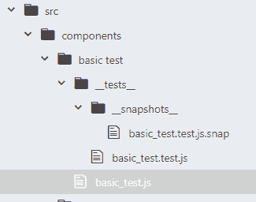

您的终端输出将如下所示:

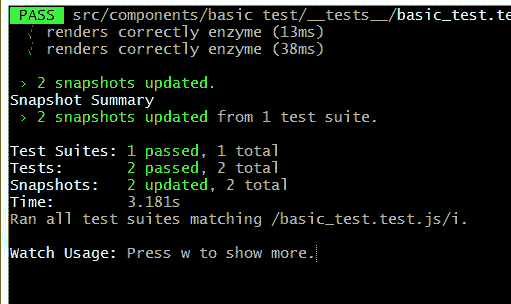

然而，如果我们把基本组件换成这样，会发生什么呢

```
import React from 'react';

const Basic = () => {
  return (
    <div >
      <h1> Basic Test</h1>

    </div>
  );
}

export default Basic;
```

我们的快照现在将失败

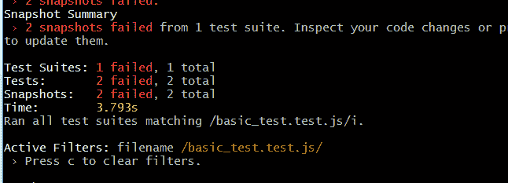

也会给我们差异

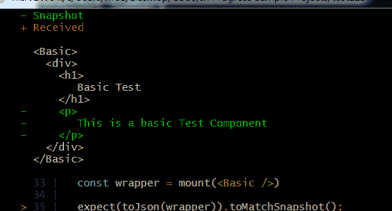

就像在 git 中，每行前面的“-”表示它被删除了。

我们只需要按“w”来激活观看模式，然后按“u”来更新快照。

我们的快照文件将自动更新为新的快照，并将通过我们的测试

```
// Jest Snapshot v1, https://goo.gl/fbAQLP

exports[`renders correctly enzyme 1`] = `
<div>
  <h1>
     Basic Test
  </h1>
</div>
`;
```

这是快照测试，但如果你读了我的个人想法部分，你就会知道我不做快照测试。我把它放在这里是因为它像酶一样非常普遍，是你应该知道的东西，但是下面我会试着解释为什么我不使用它。

让我们再次回顾一下什么是快照测试。它本质上允许您看到自上次测试以来您的组件发生了怎样的变化。这样有什么好处。

*   它实现起来非常快速简单，有时只需要几行代码。
*   您可以看到我们的组件是否正确呈现。可以清楚地看到 DOM 节点。debug()函数。

**反对，反对快照测试的理由:**

*   快照测试唯一能做的事情就是告诉你代码的语法自上次测试以来是否发生了变化。
*   那么它到底在测试什么呢？有些人会争辩不多。
*   此外，应用程序的基本正确渲染是 React 的工作，所以你要稍微测试一下第三方库的领域。
*   比较差异也可以通过 git 版本控制来完成。这不应该是快照测试的工作。
*   一个失败的测试并不意味着你的应用程序不能如预期的那样工作，只意味着自从你上次运行测试以来你的代码已经改变了。这会导致大量的假阴性和对测试缺乏信任。这也可能导致人们只是更新测试，而没有仔细查看它。
*   快照测试还会告诉您 JSX 的语法是否正确，但是这同样可以在开发环境中轻松完成。仅仅为了检查语法错误而运行快照测试没有任何意义。
*   很难理解快照测试中发生了什么，因为大多数人使用浅层渲染的快照测试，它不渲染子组件，所以它根本没有给开发人员任何洞察力。

更多信息见延伸阅读部分

### 用酶测试实现细节

在这里，我将举例说明为什么不测试实现细节。假设我们有如下简单的计数器组件:

```
import React, { Component } from 'react';

class Counter extends Component {
  constructor(props) {
    super(props)

    this.state = {
      count: 0
    }
  }

  increment = () => {
    this.setState({count: this.state.count + 1})
  }

  //This incorrect code will still cause tests to pass
  // <button onClick={this.incremen}>
  //   Clicked: {this.state.count}
  // </button>

  render() {
    return (
      <div>
        <button className="counter-button" onClick={this.incremen}>
          Clicked: {this.state.count}
        </button>
      </div>
  )}
}

export default Counter;
```

你会注意到我有一个评论，暗示一个不工作的应用程序仍然会导致测试通过，例如在 onClick 事件中拼错函数名。

让我们来看看测试，它会让你明白为什么。

```
import React from 'react';
import ReactDOM from 'react-dom';
import Counter from '../counter';

import Enzyme, { shallow, render, mount } from 'enzyme';
import toJson from 'enzyme-to-json';
import Adapter from 'enzyme-adapter-react-16';

Enzyme.configure({ adapter: new Adapter() })

// incorrect function assignment in the onClick method
// will still pass the tests.

test('the increment method increments count', () => {
  const wrapper = mount(<Counter />)

  expect(wrapper.instance().state.count).toBe(0)

  // wrapper.find('button.counter-button').simulate('click')
  // wrapper.setState({count: 1})
  wrapper.instance().increment()
  expect(wrapper.instance().state.count).toBe(1)
}) 
```

运行上面的代码将通过测试。使用`wrapper.setState()`也会如此。因此，我们通过了一个非功能性应用程序的测试。我不知道你怎么想，但这并没有给我信心，我们的应用程序将为我们的最终用户发挥作用。

模拟点击按钮不会通过测试，但它可能会给我们相反的问题，一个错误的否定。假设我们想通过为按钮声明一个新的 CSS 类来改变按钮的样式，这是一种非常常见的情况。我们的测试现在会失败，因为我们再也找不到我们的按钮，但我们的应用程序仍将工作，给我们一个错误的否定。每当我们改变函数或状态变量的名字时，情况也是如此。

每次我们想改变函数和 CSS 类名时，我们都必须重写测试，这是一个非常低效和乏味的过程。

那么我们能做些什么呢？

## 反应测试库

### useState

从 react-testing-library 文档中，我们看到主要的指导原则是

> 你的测试越像你的软件被使用的方式，它们就能给你越多的信心。

当我们进一步探索我们的测试时，我们将牢记这一指导原则。

让我们从一个基本的 React Hooks 组件开始，测试状态和道具。

```
import React, { useState } from 'react';

const TestHook = (props) => {
  const [state, setState] = useState("Initial State")

  const changeState = () => {
    setState("Initial State Changed")
  }

  const changeNameToSteve = () => {
    props.changeName()
  }

  return (
  <div>
    <button onClick={changeState}>
      State Change Button
    </button>
    <p>{state}</p>
    <button onClick={changeNameToSteve}>
       Change Name
    </button>
    <p>{props.name}</p>
  </div>
  )
}

export default TestHook;
```

我们的道具来自根父组件

```
 const App = () => {
      const [state, setState] = useState("Some Text")
      const [name, setName] = useState("Moe")
  ...
      const changeName = () => {
        setName("Steve")
      }

      return (
        <div className="App">
         <Basic />
        <h1> Counter </h1>
         <Counter />
        <h1> Basic Hook useState </h1>
         <TestHook name={name} changeName={changeName}/>
    ... 
```

那么牢记我们的指导原则，我们的测试会是什么样的呢？

我们的最终用户使用这个应用程序的方式将是:在用户界面上看到一些文本，在按钮上看到文本，然后点击它，最后在用户界面上看到一些新的文本。

这就是我们将如何使用 React 测试库编写我们的测试。

使用此命令安装 react 测试库。

`npm install @testing-library/react`

**不是**

`npm install react-testing-library`

现在进行我们的测试

```
import React from 'react';
import ReactDOM from 'react-dom';
import TestHook from '../test_hook.js';
import {render, fireEvent, cleanup} from '@testing-library/react';
import App from '../../../App'

afterEach(cleanup)

it('Text in state is changed when button clicked', () => {
    const { getByText } = render(<TestHook />);

    expect(getByText(/Initial/i).textContent).toBe("Initial State")

    fireEvent.click(getByText("State Change Button"))

    expect(getByText(/Initial/i).textContent).toBe("Initial State Changed")
 })

it('button click changes props', () => {
  const { getByText } = render(<App>
                                <TestHook />
                               </App>)

  expect(getByText(/Moe/i).textContent).toBe("Moe")

  fireEvent.click(getByText("Change Name"))

  expect(getByText(/Steve/i).textContent).toBe("Steve")
})
```

我们首先从通常的进口商品开始。

接下来我们有`afterEach(cleanup)`函数。因为我们没有使用浅层渲染，所以我们必须在每次测试后卸载或清理。这正是这个函数正在做的。

`getByText`是我们在 render 函数的值上使用 object destructuring 得到的查询方法。还有其他几种查询方法，但这是您在大多数情况下想要使用的一种。

为了测试我们的状态通知，我们没有使用任何函数名或状态变量名。我们坚持我们的指导原则，不测试实现细节。由于用户将在 UI 上看到文本，这就是我们查询 DOM 节点的方式。我们也将以这种方式查询按钮并单击它。最后，我们也将基于文本查询最终状态。

`(/Initial/i)`是一个正则表达式，返回至少包含文本“Initial”的第一个节点。

我们也可以用道具做同样的事情。由于**道具**将在`App.js`中被改变，我们需要将它和我们的组件一起渲染。和前面的例子一样，我们没有使用函数名和变量名。我们正在测试用户使用我们的应用程序的相同方式，那就是通过他们将看到的文本。

希望这能给你一个好主意，告诉你如何用`react-testing-library`和指导原则进行测试，你通常想在大多数时候使用`getByText`。随着我们继续深入，我们将会看到一些例外情况。

### useReducer

现在我们可以用 useReducer 钩子测试一个组件。我们当然需要动作和缩减器来处理我们的组件，所以让我们像这样设置它们:

我们的减速器

```
import * as ACTIONS from './actions'

export const initialState = {
    stateprop1: false,
}

export const Reducer1 = (state = initialState, action) => {
  switch(action.type) {
    case "SUCCESS":
      return {
        ...state,
        stateprop1: true,
      }
    case "FAILURE":
      return {
        ...state,
        stateprop1: false,
      }
    default:
      return state
  }
}
```

和行动:

```
 export const SUCCESS = {
  type: 'SUCCESS'
}

export const FAILURE = {
  type: 'FAILURE'
} 
```

我们会让事情变得简单，用行动代替行动创造者。

最后是将使用这些动作和减速器的组件:

```
import React, { useReducer } from 'react';
import * as ACTIONS from '../store/actions'
import * as Reducer from '../store/reducer'

const TestHookReducer = () => {
  const [reducerState, dispatch] = useReducer(Reducer.Reducer1, Reducer.initialState)

  const dispatchActionSuccess = () => {
    dispatch(ACTIONS.SUCCESS)
  }

  const dispatchActionFailure = () => {
    dispatch(ACTIONS.FAILURE)
  }

  return (
    <div>
       <div>
        {reducerState.stateprop1
           ? <p>stateprop1 is true</p>
           : <p>stateprop1 is false</p>}
       </div>
       <button onClick={dispatchActionSuccess}>
         Dispatch Success
       </button>
    </div>
  )
}

export default TestHookReducer; 
```

这是一个简单的组件，通过分派一个`SUCCESS`动作将`stateprop1`从假变为真。

现在是我们的测试。

```
import React from 'react';
import ReactDOM from 'react-dom';
import TestHookReducer from '../test_hook_reducer.js';
import {render, fireEvent, cleanup} from '@testing-library/react';
import * as Reducer from '../../store/reducer';
import * as ACTIONS from '../../store/actions';

afterEach(cleanup)

describe('test the reducer and actions', () => {
  it('should return the initial state', () => {
    expect(Reducer.initialState).toEqual({ stateprop1: false })
  })

  it('should change stateprop1 from false to true', () => {
    expect(Reducer.Reducer1(Reducer.initialState, ACTIONS.SUCCESS ))
      .toEqual({ stateprop1: true  })
  })
})

it('Reducer changes stateprop1 from false to true', () => {
   const { container, getByText } = render(<TestHookReducer />);

   expect(getByText(/stateprop1 is/i).textContent).toBe("stateprop1 is false")

   fireEvent.click(getByText("Dispatch Success"))

   expect(getByText(/stateprop1 is/i).textContent).toBe("stateprop1 is true")
})
```

我们首先从测试我们的减速器开始。我们可以在`describe`块中完成减速器的测试。这些是相当基本的测试，我们用来确保初始状态**是我们想要的，并且动作产生我们想要的输出。**

你可以说测试 reducer 就是测试实现细节，但是我在实践中发现测试 actions 和 reducer 是一个总是必要的单元测试。

这是一个简单的例子，所以看起来没什么大不了的，但是在更大更复杂的应用程序中，不测试 reducers 和 actions 可能是灾难性的。因此，actions 和 reducers 将是测试实现细节规则的一个例外。

接下来，我们对实际组件进行测试。再次注意，这里我们没有测试实现细节。我们使用与前面的 useState 示例相同的模式，通过文本获取 DOM 节点，并查找和单击带有文本的按钮。

### 使用上下文

现在让我们继续测试子组件是否可以更新父组件中的上下文状态。这看起来可能很复杂，但却相当简单明了。

我们首先需要可以在自己的文件中初始化的上下文对象。

```
import React from 'react';

const Context = React.createContext()

export default Context 
```

我们还需要包含上下文提供者的父应用程序组件。传递给`Provider`的值将是`App.js`组件的状态值和`setState`函数。

```
import React, { useState } from 'react';
import TestHookContext from './components/react-testing-lib/test_hook_context';

import Context from './components/store/context';

const App = () => {
  const [state, setState] = useState("Some Text")

  const changeText = () => {
    setState("Some Other Text")
  }

  return (
    <div className="App">
    <h1> Basic Hook useContext</h1>
     <Context.Provider value={{changeTextProp: changeText,
                               stateProp: state
                                 }} >
        <TestHookContext />
     </Context.Provider>
    </div>
  );
}

export default App;
```

对于我们的组件

```
import React, { useContext } from 'react';

import Context from '../store/context';

const TestHookContext = () => {
  const context = useContext(Context)

  return (
    <div>
    <button onClick={context.changeTextProp}>
        Change Text
    </button>
      <p>{context.stateProp}</p>
    </div>
  )
}

export default TestHookContext;
```

我们有一个简单的组件来显示我们在`App.js`中初始化的文本，并且我们将`setState`函数传递给`onClick`方法。

**注意:**状态被改变、初始化并包含在我们的`App.js`组件中。我们只是通过上下文将状态值和`setState`函数传递给我们的子组件，但是最终状态是在`App.js`组件中处理的。这对理解我们的测试很重要。

我们的测试是:

```
import React from 'react';
import ReactDOM from 'react-dom';
import TestHookContext from '../test_hook_context.js';
import {act, render, fireEvent, cleanup} from '@testing-library/react';
import App from '../../../App'

import Context from '../../store/context';

afterEach(cleanup)

it('Context value is updated by child component', () => {

   const { container, getByText } = render(<App>
                                            <Context.Provider>
                                             <TestHookContext />
                                            </Context.Provider>
                                           </App>);

   expect(getByText(/Some/i).textContent).toBe("Some Text")

   fireEvent.click(getByText("Change Text"))

   expect(getByText(/Some/i).textContent).toBe("Some Other Text")
}) 
```

即使对于上下文，你可以看到我们没有打破我们的测试模式，我们仍然用文本找到并模拟我们的事件。

我已经在渲染函数中包含了`<Context.Provider/>`和`<TestHookContext />` 组件，因为这使得代码更容易阅读，但是我们实际上并不需要它们。如果我们只将`<App />`组件传递给渲染函数，我们的测试仍然可以工作。

```
const { container, getByText } = render(<App/>) 
```

为什么会这样呢？

让我们回想一下我们所知道的语境。所有的上下文状态都在`App.js`中处理，因此这是我们实际测试的主要组件，尽管看起来我们是在测试使用 **useContext** 钩子的子组件。由于**挂载/渲染**，这段代码也能工作。正如我们所知，在浅层渲染中，子组件**不被渲染**，但是在挂载/渲染中它们被渲染。由于`<Context.Provider />`和`<TestHookContext />`都是`<App />`的子组件，它们被自动渲染。

### 受控组件表单

受控组件表单本质上意味着表单将通过反应状态工作，而不是表单保持自己的状态。这意味着`onChange`处理程序会在每次击键时将输入文本保存到 React 状态。

测试表单会和我们目前看到的有一点不同，但是我们会努力记住我们的指导原则。

```
import React, { useState } from 'react';

const HooksForm1 = () => {
  const [valueChange, setValueChange] = useState('')
  const [valueSubmit, setValueSubmit] = useState('')

  const handleChange = (event) => (
    setValueChange(event.target.value)
  );

  const handleSubmit = (event) => {
    event.preventDefault();
    setValueSubmit(event.target.text1.value)
  };

    return (
      <div>
       <h1> React Hooks Form </h1>
        <form data-testid="form" onSubmit={handleSubmit}>
          <label htmlFor="text1">Input Text:</label>
          <input id="text1" onChange={handleChange} type="text" />
          <button type="submit">Submit</button>
        </form>
        <h3>React State:</h3>
          <p>Change: {valueChange}</p>
          <p>Submit Value: {valueSubmit}</p>
        <br />
      </div>
    )
}

export default HooksForm1;
```

这是我们这里的一个基本表单，我们还显示变更的值，并在我们的 JSX 中提交值。我们有`data-testid="form"`属性，我们将在测试中使用它来查询表单。

我们的测试:

```
import React from 'react';
import ReactDOM from 'react-dom';
import HooksForm1 from '../test_hook_form.js';
import {render, fireEvent, cleanup} from '@testing-library/react';

afterEach(cleanup)

//testing a controlled component form.
it('Inputing text updates the state', () => {
    const { getByText, getByLabelText } = render(<HooksForm1 />);

    expect(getByText(/Change/i).textContent).toBe("Change: ")

    fireEvent.change(getByLabelText("Input Text:"), {target: {value: 'Text' } } )

    expect(getByText(/Change/i).textContent).not.toBe("Change: ")
 })

 it('submiting a form works correctly', () => {
     const { getByTestId, getByText } = render(<HooksForm1 />);

     expect(getByText(/Submit Value/i).textContent).toBe("Submit Value: ")

     fireEvent.submit(getByTestId("form"), {target: {text1: {value: 'Text' } } })

     expect(getByText(/Submit Value/i).textContent).not.toBe("Submit Value: ")
  })
```

由于空的 input 元素没有文本，我们将使用一个`getByLabelText()`函数来获取输入节点。这仍然符合我们的指导原则，因为标签文本是用户在输入文本之前要阅读的内容。

注意，我们将触发`.change()`事件，而不是通常的`.click()`事件。我们还以下列形式传入虚拟数据:

`{ target: { value: "Text" } }`

由于表单中的值将以`event.target.value`的形式被访问，这就是我们传递给模拟事件的内容。

因为我们通常不知道用户提交的文本是什么，所以我们可以使用一个`.not`关键字来确保文本在我们的 render 方法中发生了改变。

我们可以用类似的方式测试表单的提交。唯一的区别是我们使用了`.submit()`事件，并以这种方式传入虚拟数据:

`{ target: { text1: { value: 'Text' } } }`

这就是当用户提交表单时如何从合成事件中访问表单数据。其中`text1`是我们的输入元素的 id。我们将不得不稍微打破我们的模式，使用`data-testid="form"`属性来查询表单，因为实际上没有其他方法来获取表单。

这就是表单。这和我们其他的例子没有什么不同。如果你认为你明白了，让我们来看一些更复杂的东西。

### axios 的 useEffect 和 API 请求

现在让我们看看如何测试 **useEffect 钩子**和 API 请求。这将与我们目前所看到的大不相同。

假设我们有一个从根父组件传递到子组件的 url。

```
 ...

     <TestAxios url='https://jsonplaceholder.typicode.com/posts/1' />

 ... 
```

和组件本身。

```
import React, { useState, useEffect } from 'react';
import axios from 'axios';

const TestAxios = (props) => {
  const [state, setState] = useState()

  useEffect(() => {
    axios.get(props.url)
      .then(res => setState(res.data))
  }, [])

  return (
    <div>
    <h1> Axios Test </h1>
        {state
          ? <p data-testid="title">{state.title}</p>
          : <p>...Loading</p>}
    </div>
  )
}

export default TestAxios;
```

我们只需发出一个 API 请求，并将结果保存在本地状态中。我们还在 render 方法中使用了一个三元表达式来等待请求完成，以显示来自 json 占位符的标题数据。

您会注意到，出于需要，我们将不得不再次使用`data-testid`属性，这也是一个实现细节，因为用户不会以任何方式看到该属性或与之交互，但这更现实，因为我们通常不会预先知道来自 API 请求的文本。

我们还将在本次测试中使用模拟。

模拟是模拟我们在测试中不想做的行为的一种方式。例如，我们模拟 API 请求，因为我们不想在测试中发出真正的请求。

出于各种原因，我们不想在测试中发出真正的 API 请求:这会使我们的测试慢很多，可能会给我们一个错误的否定，API 请求会花费我们的钱，或者我们会用测试数据搞乱我们的数据库。

```
import React from 'react';
import ReactDOM from 'react-dom';
import TestAxios from '../test_axios.js';
import {act, render, fireEvent, cleanup, waitForElement} from '@testing-library/react';

import axiosMock from "axios"; 
```

我们有通常的进口货，但你会注意到一些特别的东西。我们正在从`axios`库中导入`axiosMock`。我们没有从`axios`库中导入一个模拟的 axios 对象。我们实际上是在嘲讽`axios`库*本身*。

怎么会？

通过使用 jest 提供的模仿功能。

我们首先将在测试文件夹旁边创建一个`__mocks__`文件夹，就像这样。

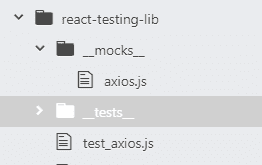

在 mocks 文件夹中，我们有一个`axios.js`文件，这是我们伪造的 **axios** 库。在我们的假 **axios** 库中，我们有我们的 **jest mock 函数**。

模拟函数允许我们在 jest 环境中使用函数，而不必实现函数的实际逻辑。

所以基本上我们不会实现 axios get 请求背后的实际逻辑。我们将使用这个模拟函数来代替。

```
export default {
  get: jest.fn(() => Promise.resolve({ data: {} }) )
}; 
```

这里我们有我们的假 get 函数。这是一个简单的函数，实际上是一个 JS 对象。`get`是我们的键，值是**模拟函数**。像一个 **axios** API 请求，我们解决一个承诺。我们不会在这里传入任何数据，我们将在我们的测试设置中这样做。

现在我们的测试设置

```
//imports
...

afterEach(cleanup)

it('Async axios request works', async () => {
  axiosMock.get.mockResolvedValue({data: { title: 'some title' } })

  const url = 'https://jsonplaceholder.typicode.com/posts/1'
  const { getByText, getByTestId, rerender } = render(<TestAxios url={url} />);

  expect(getByText(/...Loading/i).textContent).toBe("...Loading")

  const resolvedEl = await waitForElement(() => getByTestId("title"));

  expect((resolvedEl).textContent).toBe("some title")

  expect(axiosMock.get).toHaveBeenCalledTimes(1);
  expect(axiosMock.get).toHaveBeenCalledWith(url);
 })
```

我们在测试中做的第一件事是调用我们的假 **axios get 请求**，并讽刺地用 jest 提供的`mockResolvedValue`函数模拟解析的值。这个函数确实如其名，它用我们传入的数据解析一个承诺，这模拟了 axios 所做的事情。

这个函数必须在我们的`render()`函数之前被调用，否则测试将不起作用。因为记得我们是在嘲讽 **axios 库**本身。当我们的组件运行`import axios from 'axios';`命令时，它将是**导入我们的假 axios 库**而不是真正的库，这个假 axios 将在我们组件中任何使用 axios 的地方被替换。

接下来我们得到了我们的"...Loading”文本节点，因为这是在承诺解析之前将显示的内容。在这之后，我们使用了一个在`waitForElement()`函数之前没有见过的函数，它将等到承诺完成后再进行下一个断言。

还要注意 **await** 和 **async** 关键字，它们在非测试环境中的使用方式完全相同。

一旦被解析，DOM 节点将有“某个标题”的文本，这是我们传递给我们的假模拟 axios 库的数据。

接下来，我们确保请求只被调用一次，并且使用正确的 url。即使我们正在测试这个 url，我们也没有用这个 url 发出 API 请求。

这就是 axios 的 API 请求。在下一节中，我们将看看用 cypress 进行的 e 到 e 测试。

## 柏树

现在让我们来看看 cypress，我认为它是运行 e 到 e 测试的最佳框架。我们现在不再使用 jest land，我们现在将只使用 cypress，它有自己的测试环境和语法。

赛普拉斯是相当惊人和强大的。如此神奇和强大，事实上，我们可以在一个测试块中运行我们刚刚检查过的每个测试，并在模拟浏览器中实时观看 cypress 运行这些测试。

很酷吧。

我也这么认为总之，在此之前，我们需要设置 cypress。令人惊讶的是 Cypress 可以作为一个常规的 npm 模块安装。

`npm install cypress`

要运行 cypress，您需要使用这个命令。

`node_modules/.bin/cypress open`

如果每次想打开 cypress 时都觉得写起来很麻烦，那么可以把它添加到 package.json 中。

```
...

  "scripts": {
    "start": "react-scripts start",
    "build": "react-scripts build",
    "test": "react-scripts test",
    "eject": "react-scripts eject",
    "cypress": "node_modules/.bin/cypress open", 

   ...
```

这将允许你只用`npm run cypress`命令打开 cypress。

打开 cypress 会给你一个类似这样的 GUI。

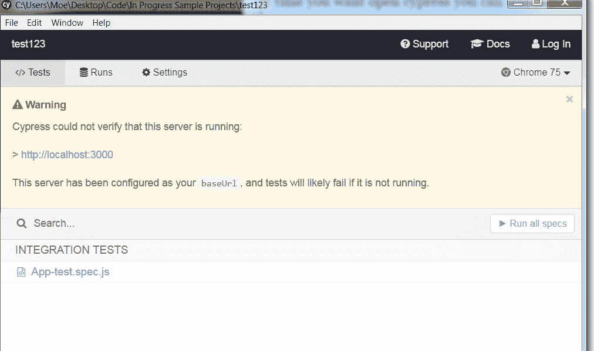

要真正运行 cypress 测试，您的应用程序必须同时运行，我们马上就会看到这一点。

运行`cypress open`命令将为您提供 cypress 的基本配置，并自动为您的创建一些文件和文件夹。将在项目根目录下创建一个 cypress 文件夹。我们将在集成文件夹中编写代码。

我们可以从删除 examples 文件夹开始。与 jest 不同，cypress 文件的扩展名是`.spec.js`。因为这是一个 e 到 e 的测试，我们将在我们的主`App.js`文件上运行它。所以你应该有一个目录结构，看起来像这样。

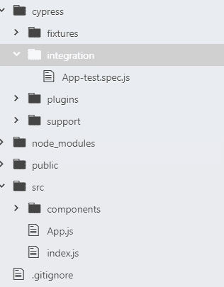

我们还可以在 cypress.json 文件中设置一个基本 url。就像这样:

`{ "baseUrl": "[http://localhost:3000](http://localhost:3000)" }`

现在是我们的大型整体测试

```
import React from 'react';

describe ('complete e to e test', () => {
  it('e to e test', () => {
    cy.visit('/')
    //counter test
    cy.contains("Clicked: 0")
      .click()
    cy.contains("Clicked: 1")
    // basic hooks test
    cy.contains("Initial State")
    cy.contains("State Change Button")
      .click()
    cy.contains("Initial State Changed")
    cy.contains("Moe")
    cy.contains("Change Name")
      .click()
    cy.contains("Steve")
    //useReducer test
    cy.contains('stateprop1 is false')
    cy.contains('Dispatch Success')
      .click()
    cy.contains('stateprop1 is true')
    //useContext test
    cy.contains("Some Text")
    cy.contains('Change Text')
      .click()
    cy.contains("Some Other Text")
    //form test
    cy.get('#text1')
      .type('New Text {enter}')
    cy.contains("Change: New Text")
    cy.contains("Submit Value: New Text")
    //axios test
    cy.request('https://jsonplaceholder.typicode.com/posts/1')
      .should(res => {
          expect(res.body).not.to.be.null
          cy.contains(res.body.title)
        })
  });
});
```

如前所述，我们正在一个测试块中运行我们刚刚检查过的每一个测试。我用注释把每个部分分开，这样更容易看。

我们的测试一开始可能看起来令人生畏，但是大多数单独的测试将遵循一个基本的排列-动作-断言模式。

```
 cy.contains(Some innerHTML text of DOM node)

cy.contains (text of button)
.click()

cy.contains(Updated innerHTML text of DOM node) 
```

因为这是一个 e 到 e 的测试，你不会发现任何嘲笑。我们的应用程序将在一个模拟的 UI 浏览器中运行其完整的开发版本。这将是我们所能得到的最接近于以现实的方式测试我们的应用程序的方法。

与单元测试和集成测试不同，我们不需要明确地断言一些事情。这是因为一些 Cypress 命令已经内置了默认断言。默认断言正如它们听起来的那样，它们是默认断言的，所以不需要添加匹配器。

[柏默认断言](https://docs.cypress.io/guides/core-concepts/introduction-to-cypress.html#Default-Assertions)

命令是链接在一起的，因此顺序很重要，一个命令会等到前一个命令完成后再运行。

即使在用 cypress 测试时，我们也将坚持不测试实现细节的原则。实际上，这意味着如果可以的话，我们不会使用 html/css 类、id 或属性作为选择器。我们唯一需要使用 id 的时候是获取表单输入元素。

我们将利用`cy.contains()`命令返回一个带有匹配文本的 DOM 节点。在 UI 上看到文本并与之交互是我们的最终用户将会做的事情，因此以这种方式进行测试将符合我们的指导原则。

因为我们没有反对或嘲笑任何东西，你会注意到我们的测试看起来非常简单。这很好，因为这是一个实时运行的应用程序，我们的测试不会有任何人为的值。

在我们的 axios 测试中，我们将向端点发出一个真实的 http 请求。在 e 到 e 测试中发出真正的 http 请求是很常见的。然后我们将检查该值是否不为空。然后确保响应的数据出现在我们的 UI 中。

如果操作正确，您应该看到 cypress 在 chromium 中成功地运行了测试。

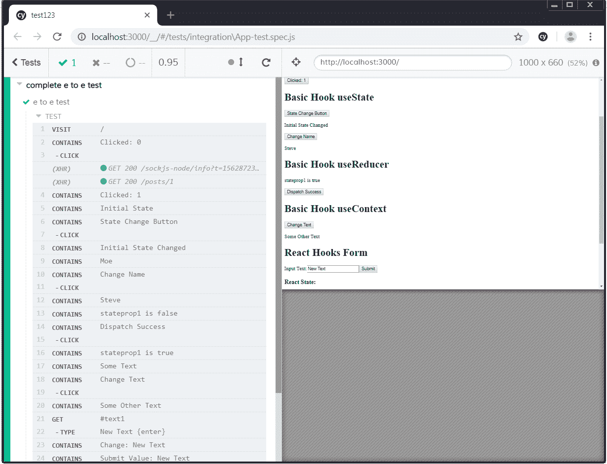

## 连续累计

手动跟踪和运行所有这些测试会变得很乏味。所以我们有持续集成，一种自动持续运行测试的方法。

### 特拉维斯·CI

为了简单起见，我们将只使用 Travis CI 进行持续集成。您应该知道，使用 Docker 和 Jenkins 还有更复杂的 CI 设置。

你需要注册一个 Travis 和 Github 账户，幸运的是这两个都是免费的。

我建议在 Travis CI 上使用“注册 Github”选项。

在那里，您只需点击您的配置文件图标，然后单击您想要配置项的存储库旁边的滑块按钮。


为了让 Travis CI 知道该做什么，我们需要在项目根目录中配置一个. travis.yml 文件。

```
language: node_js

node_js: 
  - stable

install:
  - npm install

script:
  - npm run test
  - npm run coveralls
```

这实际上告诉 Travis 我们正在使用 node_js，下载稳定版本，安装依赖项，并运行 npm run test 和 npm run coveralls 命令。

这就是了。您可以在仪表板上知道 go 并开始构建。Travis 会自动运行测试，并给出如下输出。如果你的测试通过了，你就可以走了。如果它们失败，您的构建将会失败，您将需要修复您的代码并重新开始构建。

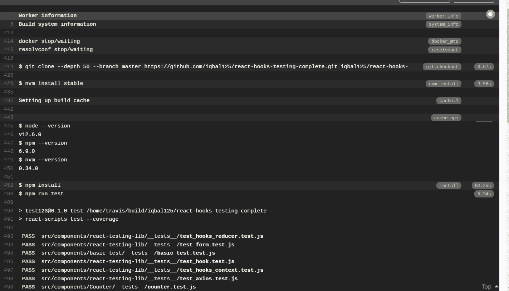

### 工装连体服

coverall 为我们提供了一份覆盖报告，它告诉我们有多少代码正在被测试。

您需要注册工作服，并与您的 github 帐户同步。与 Travis CI 类似，只需转到“add repos”选项卡，然后打开您在 Travis CI 上激活的回购。

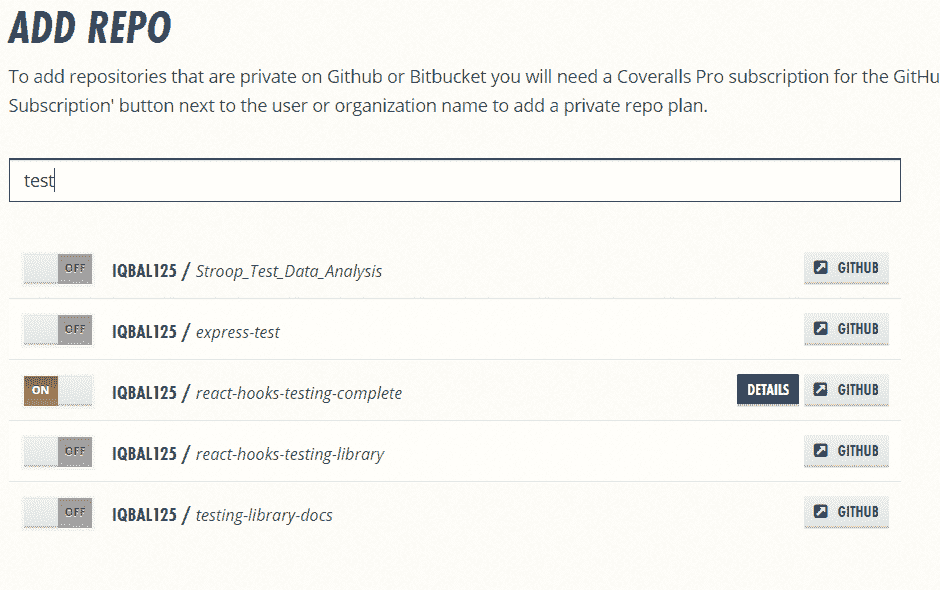

接下来转到 package.json 文件，添加这行代码

```
 "scripts": {
    "start": "react-scripts start",
    "build": "react-scripts build",
    "test": "react-scripts test --coverage",
    "eject": "react-scripts eject",
    "cypress": "node_modules/.bin/cypress open", 
    "coveralls": "cat ./coverage/lcov.info | node node_modules/.bin/coveralls"
  },
```

确保将`--coverage` 标志添加到`react-scripts test`命令中。这将生成覆盖率数据，连体工作服将使用这些数据来生成覆盖率报告。

在测试运行之后，您可以在 Travis CI 控制台上看到这些覆盖率数据。

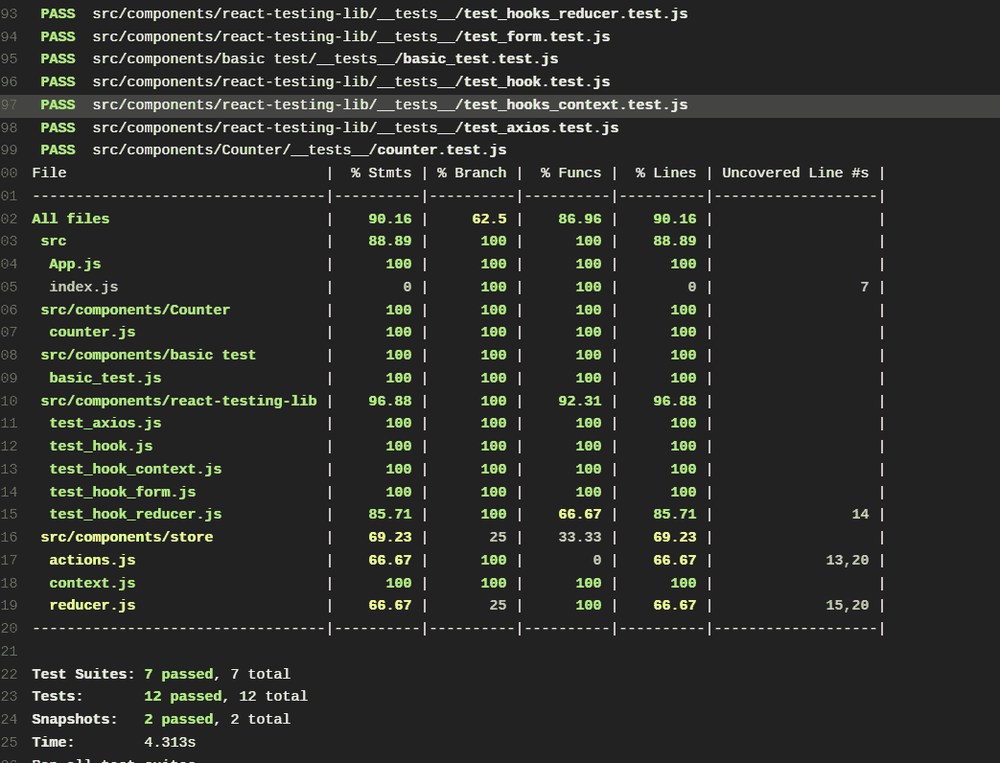

由于我们不是在处理私人回购或特拉维斯 CI pro，我们不需要担心回购令牌。

完成后，您可以通过复制控制面板上提供的链接，将徽章添加到您的回购自述文件中。

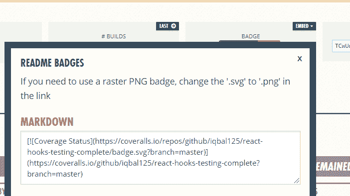

它看起来会像这样。

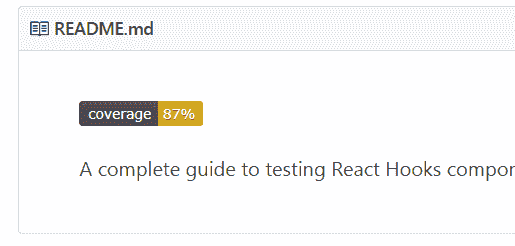

## 结论

如果你完成了整个教程，就 React 测试技能而言，你可以跻身于前 20%的开发人员之列。

感谢阅读。干杯。

> 以后更多教程可以在 twitter 上关注我:[https://twitter.com/iqbal125sf?lang=en](https://twitter.com/iqbal125sf?lang=en)

### 延伸阅读

**博文:**

[https://djangostars . com/blog/what-and-how-to-test-with-enzyme-and-jest-full-instruction-on-react-component-testing/](https://djangostars.com/blog/what-and-how-to-test-with-enzyme-and-jest-full-instruction-on-react-component-testing/#utm_source=medium&utm_medium=blog.bitsrc.io&utm_campaign=react%20components%20testing&utm_content=continue%20reading%20the%20original%20article%20on%20our%C2%A0blog)

[https://engineering . ez cater . com/the-case-against-react-snapshot-testing](https://engineering.ezcater.com/the-case-against-react-snapshot-testing)

[https://medium . com/@ Tom gold _ 48918/why-I-stopped-using-snapshot-testing-with-jest-3279 Fe 41 FFB 2](https://medium.com/@tomgold_48918/why-i-stopped-using-snapshot-testing-with-jest-3279fe41ffb2)

[https://circle ci . com/blog/continuously-testing-react-applications-with jest-and-enzyme/](https://circleci.com/blog/continuously-testing-react-applications-with-jest-and-enzyme/)

[https://testing . Google blog . com/2015/04/just-say-no-to-more-end-to-end-tests . html](https://testing.googleblog.com/2015/04/just-say-no-to-more-end-to-end-tests.html)

[https://willowTreeApps . com/ideas/unit-testing-with-reaction-redux-method](https://willowtreeapps.com/ideas/best-practices-for-unit-testing-with-a-react-redux-approach)

[https://blog . pragmatists . com/genuine-guide-to-testing-react-redux-applications-6f 3265 c11f 63](https://blog.pragmatists.com/genuine-guide-to-testing-react-redux-applications-6f3265c11f63)

[https://hacks . Mozilla . org/2018/04/testing-strategies-for-react-and-redux/](https://hacks.mozilla.org/2018/04/testing-strategies-for-react-and-redux/)

[https://code burst . io/describe-practice-what-I-learn-from-reading-redux-mock-store-8d 2d 79 a4 b 24d](https://codeburst.io/deliberate-practice-what-i-learned-from-reading-redux-mock-store-8d2d79a4b24d)

[https://www.robinwieruch.de/react-testing-tutorial/](https://www.robinwieruch.de/react-testing-tutorial/)

[https://medium . com/@ ryandrewjohnson/unit-testing-components-using-reacts-new-context-API-4a 5219 F4 B3 Fe](https://medium.com/@ryandrewjohnson/unit-testing-components-using-reacts-new-context-api-4a5219f4b3fe)

肯特·C·多兹关于测试的文章

[https://kentcdodds . com/blog/introducing-the-react-testing-library](https://kentcdodds.com/blog/introducing-the-react-testing-library)

[https://kentcdodds . com/blog/unit-vs-integration-vs-e2e-tests](https://kentcdodds.com/blog/unit-vs-integration-vs-e2e-tests)

[https://kentcdodds . com/blog/why-I-never-use-shallow-rendering](https://kentcdodds.com/blog/why-i-never-use-shallow-rendering)

[https://kentcdodds.com/blog/demystifying-testing](https://kentcdodds.com/blog/demystifying-testing)

[https://kentcdodds.com/blog/effective-snapshot-testing](https://kentcdodds.com/blog/effective-snapshot-testing)

[https://kentcdodds.com/blog/testing-implementation-details](https://kentcdodds.com/blog/testing-implementation-details)

[https://kentcdodds.com/blog/common-testing-mistakes](https://kentcdodds.com/blog/common-testing-mistakes)

[https://kentcdodds.com/blog/ui-testing-myths](https://kentcdodds.com/blog/ui-testing-myths)

[https://kentcdodds . com/blog/why-you-be-bad-about-testing](https://kentcdodds.com/blog/why-youve-been-bad-about-testing)

[https://kentcdodds.com/blog/the-merits-of-mocking](https://kentcdodds.com/blog/the-merits-of-mocking)

[https://kentcdodds.com/blog/how-to-know-what-to-test](https://kentcdodds.com/blog/how-to-know-what-to-test)

[https://kentcdodds.com/blog/avoid-the-test-user](https://kentcdodds.com/blog/avoid-the-test-user)


**备忘单/ github 线程**

[https://devhints.io/enzyme](https://devhints.io/enzyme)

https://devhints .我 /jest

[https://github . com/react training/react-router/tree/master/packages/react-router/modules/_ _ tests _ _](https://github.com/ReactTraining/react-router/tree/master/packages/react-router/modules/__tests__)

[https://github.com/airbnb/enzyme/issues/1938](https://github.com/airbnb/enzyme/issues/1938)

[https://gist . github . com/fokusferit/e 4558d 384 e 4 e 9 cab 95d 04 e 5 f 35d 4 f 913](https://gist.github.com/fokusferit/e4558d384e4e9cab95d04e5f35d4f913)

[https://airbnb.io/enzyme/docs/api/selector.html](https://airbnb.io/enzyme/docs/api/selector.html)


**文档**

[https://docs.cypress.io](https://docs.cypress.io/)

[https://airbnb.io/enzyme/](https://airbnb.io/enzyme/)

[https://github.com/dmitry-zaets/redux-mock-store](https://github.com/dmitry-zaets/redux-mock-store)

https://jestjs . io/docs/en

[https://testing-library.com/docs/learning](https://testing-library.com/docs/learning)

[https://sinonjs.org/releases/v7.3.2/](https://sinonjs.org/releases/v7.3.2/)

[https://redux.js.org/recipes/writing-tests](https://redux.js.org/recipes/writing-tests)

[https://jestjs.io/docs/en/using-matchers](https://jestjs.io/docs/en/using-matchers)

https://jestjs . io/docs/en/API