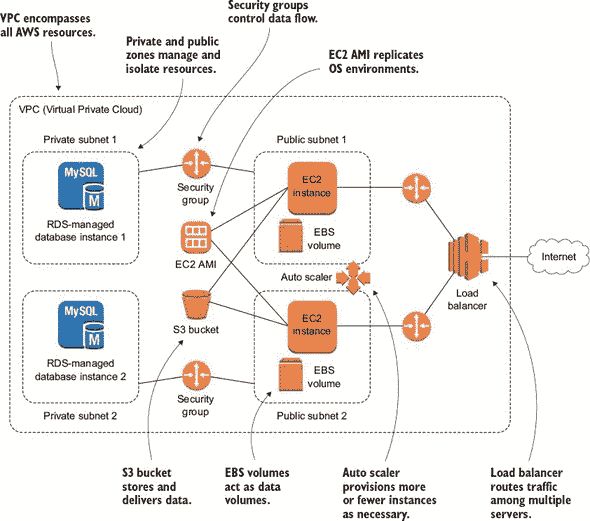
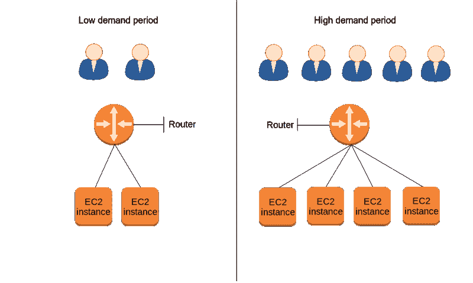
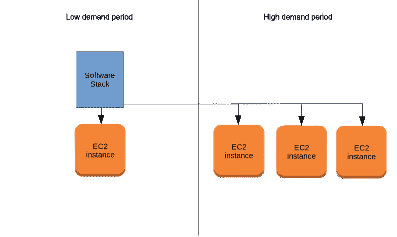

# AWS 和弹性:领先用户需求

> 原文：<https://www.freecodecamp.org/news/aws-and-elasticity-keeping-ahead-of-user-demand/>

我假设，无论如何，您已经熟悉了 AWS 的许多核心部署服务。这意味着您现在知道了:

EC2 实例和 ami(Amazon 机器映像)，以及支持其部署的“外围”工具，如安全组和 EBS 卷

将数据库整合到我们的应用程序中，包括即时整合和通过托管 RDS 服务整合

使用 S3 存储桶通过我们的 EC2 应用交付媒体文件，并用于服务器备份存储

通过 IAM(身份和访问管理)控制对我们 AWS 资源的访问

通过智能地应用标签来管理不断增长的资源集，以及

使用浏览器界面或 AWS CLI(命令行界面)访问我们的资源

所有这些都可以用图 1 中的示意图来表示。

Figure 1\. This is the kind of application infrastructure that you should be able to build using the core AWS services.

现在，我将稍微转移一下焦点，探索一些应用程序优化的最佳实践。图 2 可以帮助您直观地看到如何通过网络分段、自动伸缩和负载平衡的魔力使所有基础设施变得高度可用。

Figure 2\. An illustration of how AWS data and security services work together to enable an EC2 instance, so it can deliver its application to customers.

虽然您可能还不熟悉图表中显示的许多工具和关系，但您应该花一分钟时间记住至少几个要点，包括:

虚拟私有云(VPC ),涵盖我们应用部署中的所有 AWS 资源

两种可用性区域:私有和公共——用于管理资源，并在需要时隔离资源

其规则控制资源间数据移动的安全组

EC2 AMI (Amazon 机器映像)作为复制精确操作系统环境的模板

可存储和交付数据的 S3(简单存储服务)存储桶，既可用于备份，也可用于向用户交付

充当实例的数据卷(如硬盘)的 EBS 卷

自动缩放器允许自动提供更多(或更少)实例，以满足应用程序不断变化的需求，以及

负载平衡器在多台服务器之间路由流量，以确保最流畅、最高效的用户体验

我很确定你已经注意到了这一点:许多 AWS 服务名称(EC2、ECS、EFS、EMR……)中的“e”并不像电子邮件等一些老技术的名称那样代表“电子”，而是“弹性”然而，你可以理解为什么 AWS 的云计算愿景如此有弹性。

但是在我回答这个问题之前，从总体上讲一下云计算可能是有用的。理解云的独特之处对于充分利用它所能提供的一切可能是至关重要的。

### 云计算

美国国家标准与技术研究所(NIST)将云计算定义为向用户提供以下五种品质的服务:

按需自助服务:客户能够在需要时访问公共云资源，无需通过人工代表订购。

广泛的网络访问:可以从任何联网(即互联网)的位置访问云资源。

资源池:云提供商提供多租户模型，个人客户可以通过该模型安全地相互共享资源，以及动态资源分配，通过该模型可以根据客户需求分配和取消分配资源。

快速弹性:资源可用性和性能可以自动增加或减少，以满足不断变化的客户需求。

计量服务:客户能够在一个计费周期内消费不同级别的服务，并且只为他们实际使用的资源付费。

这五个品质描述了一个高度灵活和高度自动化的系统，其元素可以自由混合和匹配，以提供最有效和最具成本效益的服务。但是，使这成为可能的很大一部分是集成系统的存在，这些系统可以根据周围发生的事情动态地调整自己。这些调整是弹性行为的例子。

### 弹性与可扩展性

因此，正如我们已经确定的，弹性是系统监控用户需求并相应地自动增加和减少部署资源的能力。相比之下，可伸缩性是系统监控用户需求并自动增减的能力……等等:我刚才说的不是弹性吗？

有点复杂。事实上，这两个术语有时可以互换使用。然而，我认为区分它们是值得的。请记住，我解释这两种观点之间关系的方式绝不是这个主题的最终结论——环顾四周，你会发现一些其他的方法。但是，我认为，在理解 AWS 如何工作的背景下，我的观点应该是有用的。

橡皮筋之所以有弹性，部分是因为它在压力下能够伸展，但也是因为当压力释放时，它能够迅速恢复到原来的大小。用 AWS 的术语来说，这意味着这样的方式，例如，EC2 让实例在需要时可用，但让您在不需要时丢弃它们；只对正常运行时间收费。参见图 3。

Figure 3\. Elasticity allows for systems to dynamically add or remove resources to meet changing demand.

可伸缩性描述了系统被设计来满足不断变化的需求的方式。这可能包括您可以 24 小时访问您可能需要的任何资源(当然，这是一个弹性特性)，但这也意味着底层设计本身支持快速和不可预测的变化。

举个例子，可扩展的软件可以很容易地被安装到一个新的服务器上——可能是在一个新的网络环境中——并且不需要任何手动配置就可以运行。类似地，如图 4 所示，可伸缩基础设施的组成可以快速改变，所有旧的部分立即知道如何与新的部分一起工作。

Figure 4\. Scalable software can be easily copied for use in multiple servers deployed in multiple network environments.

考虑到这一点，我们可以说 Amazon 的 EC2 不仅有弹性，而且因为它的元素(实例、存储卷、安全组等)。)可以平滑地放入和退出正在运行的基础设施，它也非常具有可伸缩性。啊，但是什么样的可伸缩性呢？有两个，你知道:

水平扩展是“向外扩展”，即添加更多轻量级服务器节点(或“实例”)来满足不断增长的需求。

垂直扩展是“纵向扩展”，即将应用从一台轻量级服务器移动到一台计算能力更强的服务器。

将基于 AWS 的应用程序从较轻的服务器转移到较重的服务器上当然是可能的，而且对于某些负载——如许多高负载事务数据库，这是首选。但是在 AWS 上下文中，如果您听到“scale”一词的一些变形，很可能它指的是水平缩放。

### 实际应用

好的。但是谁在乎呢？随着用户对我们 WordPress 网站的需求持续增长，我们会的，而且是大幅增长。你看，由于某种原因——可能与我们每天晚上只打半个小时的 75%的折扣有关——顾客在当地时间傍晚时分到达的人数最多。因此，虽然我们运行的单台服务器在一天的大部分时间里基本上没有使用，但在如此短的时间内，它在成千上万次访问的压力下融化了。

有一天，办公室里的一个人问了我一个问题:“我们的整个业务都运行在一台网络服务器上；如果倒了会怎么样？”事实上。

我们可以提供四到五台额外的服务器，让它们全天运行。这样，我们就可以应对高容量时期和任何一台服务器的故障。但是这仍然会造成巨大的浪费，因为每天的大部分时间里，我们都要为大部分实例的闲置付出代价。在网络故障的情况下，它也不一定有多大帮助，因为网络故障可能会同时切断与所有服务器的连接。

我们至少可以通过安排某人每天晚上在办公室手动启动我们需要的额外服务器来解决客户需求问题。但是我们四处打听，没有人自愿。此外，确保日常工作无法完成的最好方法是假设管理员会记得做这件事。

### 自动化高可用性

或者，我们可以花一些时间将高可用性功能整合到我们的设置中，让软件安静而高效地管理整个事情。这将是本书接下来几章的主题，在这几章中，我们将学习利用 AWS 的地理远程可用性区域来降低应用程序整体故障的可能性，使用负载平衡来协调并行服务器并监控它们的健康状况，以及通过根据需要启动和关闭实例来让 AWS 自动响应不断变化的需求的高峰和低谷。

想了解更多关于亚马逊网络服务的信息，请下载免费的第一章[在一个月的午餐中学习亚马逊网络服务](https://www.manning.com/books/learn-amazon-web-services-in-a-month-of-lunches)并观看这个[幻灯片演示](http://www.slideshare.net/ManningBooks/learn-amazon-web-services-in-a-month-of-lunches)。不要忘记使用代码****ss 克林顿**** 来节省 42%的购买费用。