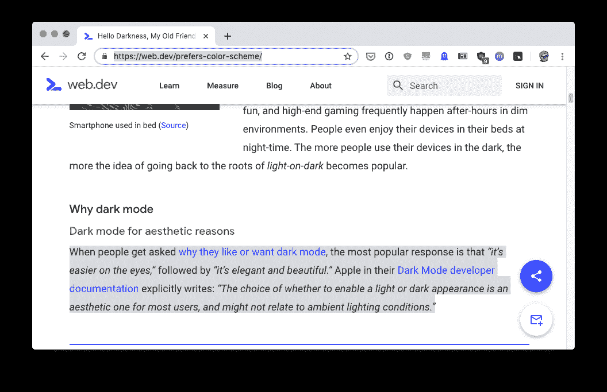
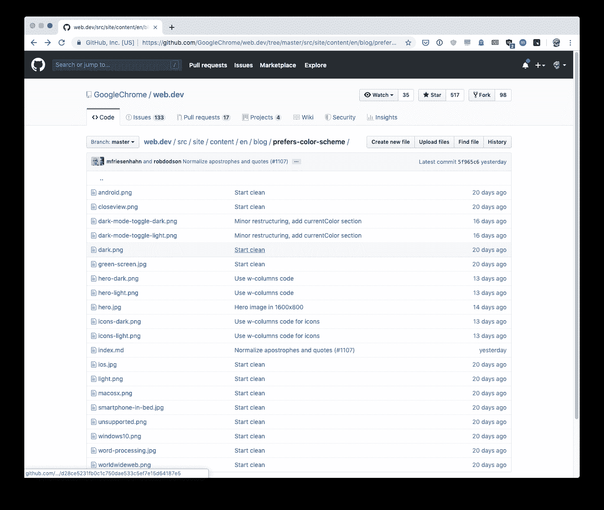
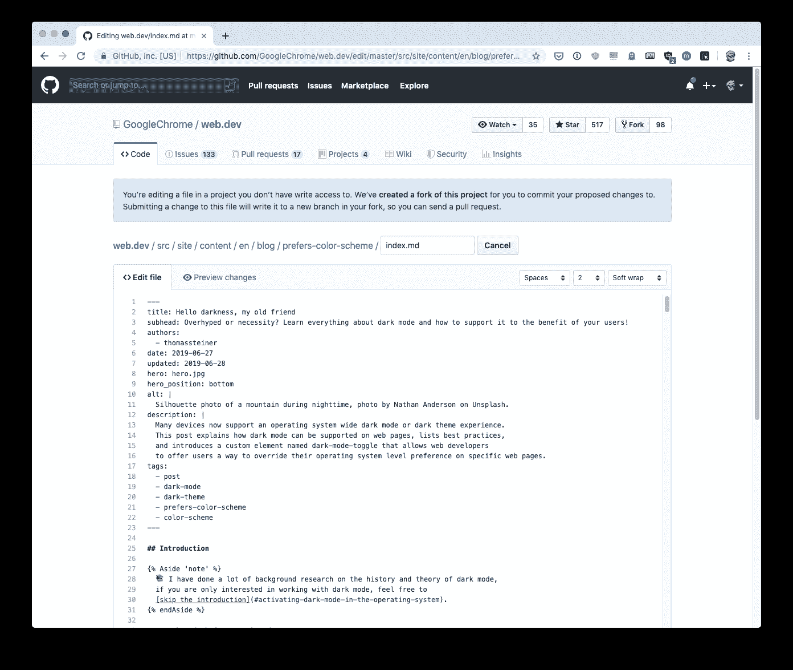
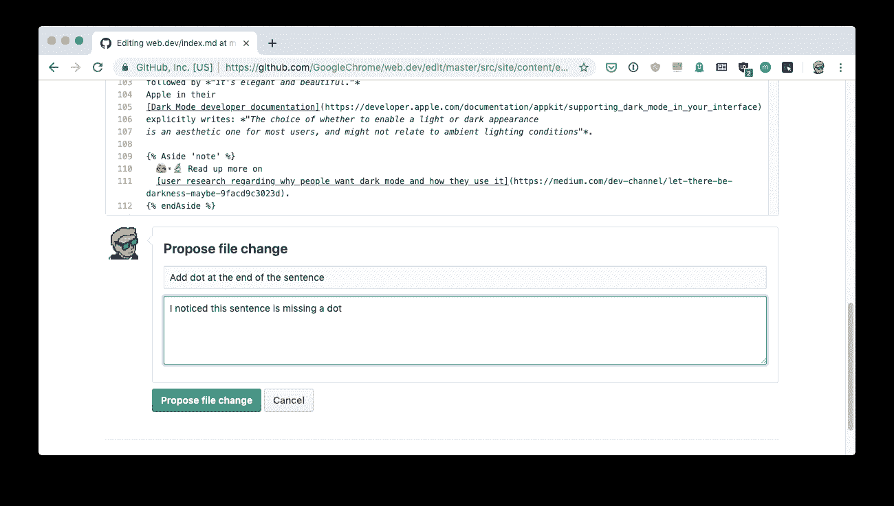
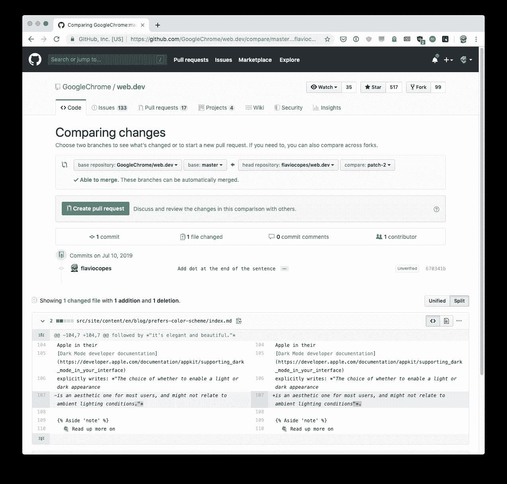
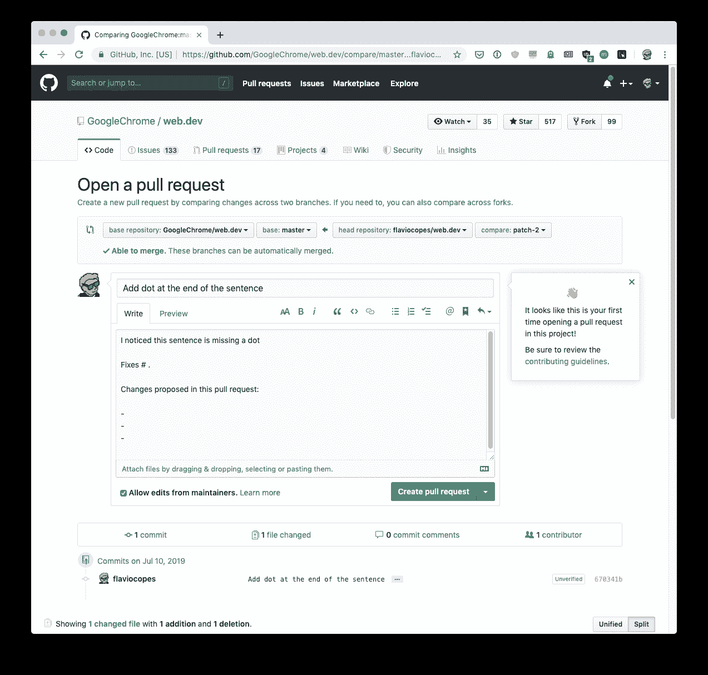
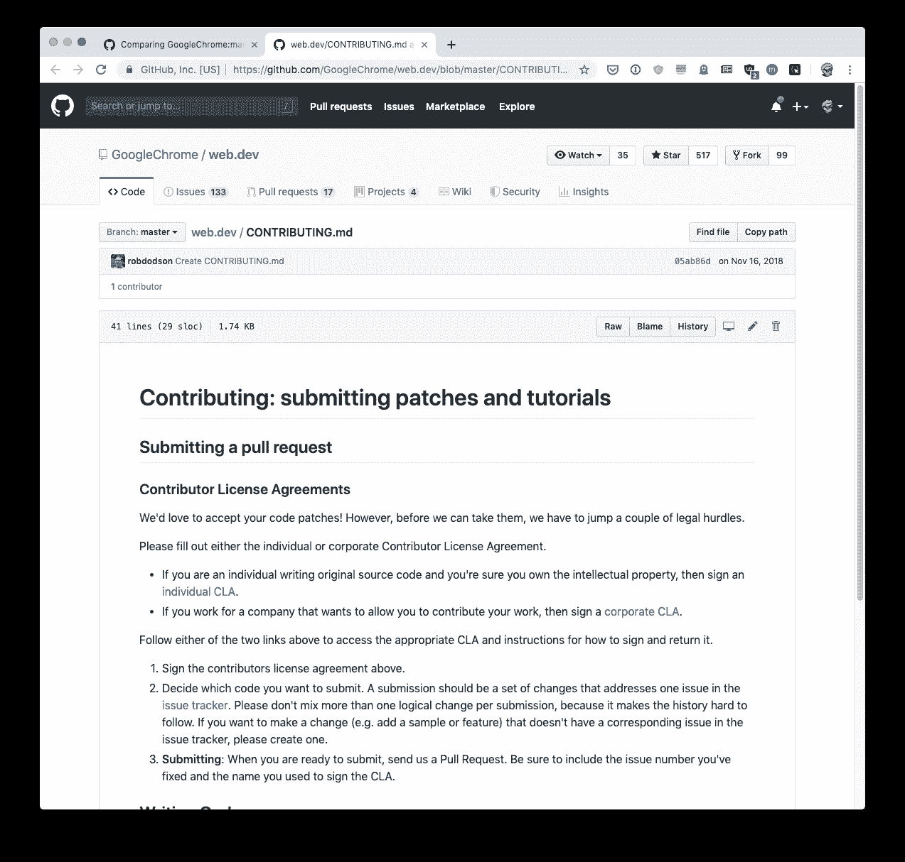
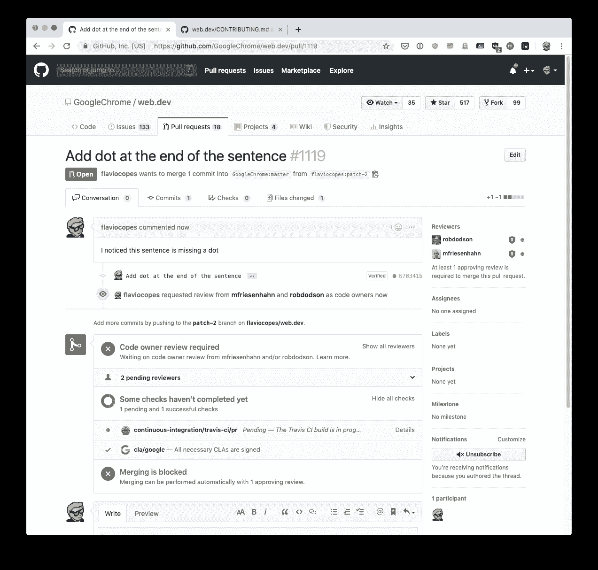

# 如何在 GitHub 上提出第一个拉取请求

> 原文：<https://www.freecodecamp.org/news/how-to-make-your-first-pull-request-on-github/>

有许多关于这个主题的教程，但是它们假设一个人必须为一个项目贡献**代码**，从而使事情变得过于复杂。

如果他们只需要编辑一个文件，也许是项目自述文件来修复一个错别字，那该怎么办？

你不需要知道如何编码或者如何使用 Git 来做这件事。但是一旦你开始做拉式请求，你可以做更多的事情，和其他人一起合作。也许这将推动你以后也贡献代码。

我假设你已经有一个(免费的)GitHub 帐户。如果你没有，那就去 github.com 买一个。

我给你演示一下流程。

我去了这一页[https://web.dev/prefers-color-scheme/](https://web.dev/prefers-color-scheme/)，我发现了一个可能的打印错误。这一行末尾少了一个点。

> 我不是一个拘泥于语法的人，这只是为了找个例子？

我知道这个网站是托管在 GitHub 上的，这篇文章也是托管在这里:[https://GitHub . com/Google chrome/web . dev/tree/master/src/site/content/en/blog/prefers-color-scheme](https://github.com/GoogleChrome/web.dev/tree/master/src/site/content/en/blog/prefers-color-scheme)

我直接在 github 上打开 index.md 文件[https://GitHub . com/Google chrome/web . dev/blob/master/src/site/content/en/blog/preferred-color-scheme/index . MD](https://github.com/GoogleChrome/web.dev/blob/master/src/site/content/en/blog/prefers-color-scheme/index.md)并按下文件工具栏中的铅笔图标。悬停它说“分叉这个项目并编辑文件”。

这将显示一个编辑器视图，其中包含以下信息:

> 您正在编辑项目中您没有写权限的文件。提交对该文件的更改将会把它写到您的 fork flaviocopes/web.dev 中的一个新分支，这样您就可以发送一个 pull 请求。

我可以去添加那个点，然后在底部的表格中解释我所做的更改:

我按下“建议文件更改”按钮，一个比较视图出现了。

在那里，我可以检查我所做的更改，以确保一切正常，最后我可以单击“Create Pull Request”按钮。目前已经对项目的*fork*进行了修改，这是在你点击铅笔图标时由 GitHub 自动完成的。

在这个视图的顶部，你可以看到我正准备从我的表单`flaviocopes/web.dev`向`GoogleChrome/web.dev`项目提交一个 PR，从我的分公司`patch-2`向他们的分公司`master`提交。

点击“创建拉取请求”按钮会显示另一个表单，我可以在其中为拉取请求编写详细描述。

拉请求可以包含许多不同的变更，所以理论上你可以在同一个 PR 中编辑许多文件，这就是为什么你可以添加一个摘要。

这个存储库有一个 PR 文本模板，可以帮助团队管理它。我们的 PR 非常简单，所以我删除了模板，只粘贴了之前提交消息中的内容。

注意到右边的提示了吗？他们告诉我这个项目有一个 CONTRIBUTING.md 文件，解释了如何贡献和指导方针。相当酷。

似乎我们需要签署一个 CLA(贡献者许可协议)来完成我们的公关。我已经在过去签署了谷歌 CLA，所以这一步对我来说是清楚的，但你可能需要解决这个问题。大多数项目并不真正需要它。

我点击了“创建拉动式请求”，请购单现已发送！

现在由项目维护人员介入并接受它，你只需要等待一封电子邮件告诉你它已经被合并，或者其他人的任何评论。

[...几个小时过去了...]

我收到了一封电子邮件，公关被拒绝，因为该点实际上是在正确的位置！(这个我不知道)。

但无论如何，我想补充一点:如果你提交的简历没有被接受，不要生气或沮丧。项目的维护者在这个项目上工作了几个月或几年，他们比你更清楚什么对它更好。

另外，尤其是代码，观点可能会非常不同，你认为很好的公关可能不受欢迎。

在着手一个实质性的公关之前，最好先问一下，看看这是不是项目真正需要的东西。

错误修复是简单的开始。

* * *

我是弗拉维奥。我在 flaviocopes.com 为开发者写教程