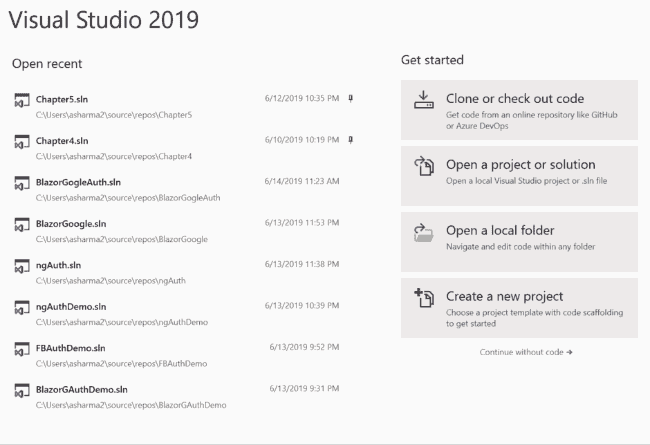
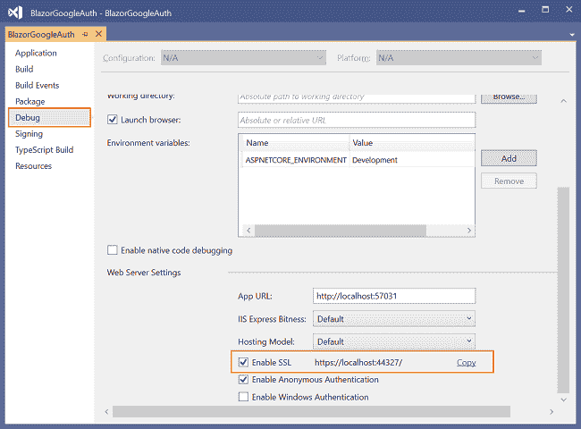
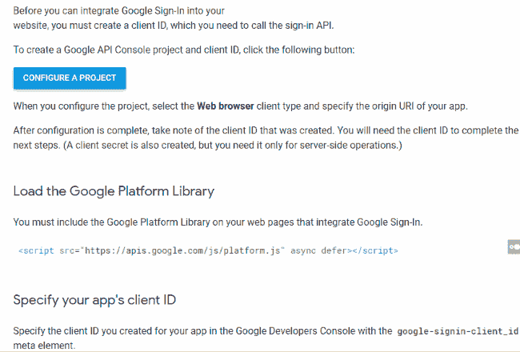
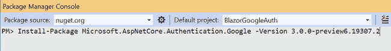
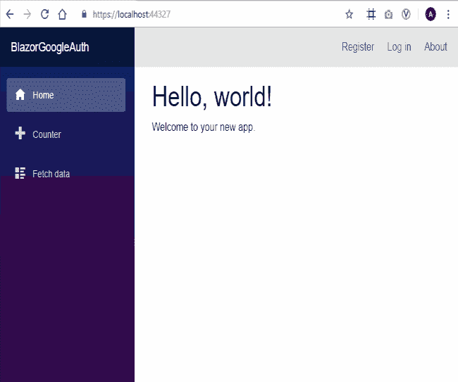

# 如何在服务器端 Blazor 应用中实现 Google 认证和授权

> 原文：<https://www.freecodecamp.org/news/how-to-implement-google-authentication-and-authorization-in-server-side-blazor-app/>

## **简介**

的最新预览。NET Core 3 (preview-6)引入了在服务器端 Blazor 应用程序中添加身份验证和授权的功能。在本文中，我们将学习如何在服务器端 Blazor 应用程序中使用 Google 实现身份验证和授权。可以参考我之前的文章[了解服务器端 Blazor](https://ankitsharmablogs.com/understanding-server-side-blazor/) 来深入了解服务器端 Blazor。

## **先决条件**

*   安装最新版本。网芯 3.0 预览版 SDK 从[这里](https://dotnet.microsoft.com/download/dotnet-core/3.0)。
*   从[这里](https://visualstudio.com/preview)安装 Visual Studio 2019 最新预览版。
*   从[这里](https://go.microsoft.com/fwlink/?linkid=870389)安装 ASP.NET 核心 Blazor 语言服务扩展。

## **源代码**

从 [GitHub](https://github.com/AnkitSharma-007/Google-Authentication-with-server-side-Blazor) 获取源代码

## **创建服务器端 Blazor 应用程序**

要创建服务器端 Blazor 应用程序，请打开 Visual Studio 2019，并按照下面提到的步骤操作。

1.  点击“创建新项目”。
2.  选择“ASP。NET 核心 Web 应用程序”。点击下一步。
3.  将会打开一个新的“配置您的新项目”屏幕。将项目的名称设为`BlazorGoogleAuth`,然后单击 Create。
4.  在下一个屏幕中，选择“”。NET Core”和“ASP。左上角下拉菜单中的 NET Core 3.0”。
5.  从可用模板列表中选择“Blazor(服务器端)”。
6.  点击“更改验证”按钮，将打开“更改验证”对话框。选择“个人用户帐户”并单击确定。点击`Create`按钮创建应用程序。

这些步骤显示在下面的 GIF 图像中。



在运行应用程序之前，我们需要将迁移应用到我们的应用程序中。导航到工具>>获取软件包管理器>>软件包管理器控制台。

它将打开软件包管理器控制台。输入`Update-Database`命令并点击回车。这将使用实体框架代码优先迁移来更新数据库。


通过在解决方案资源管理器中右击项目并选择属性来打开项目属性。从左侧菜单中选择调试，然后滚动到页面底部。请注意启用了 SSL 的 URL。在这种情况下，URL 是`https://localhost:44327/`。我们需要这个 URL 来配置 Google API 控制台项目，这将在我们的下一节中进行。请参考下图:



## **创建一个 Google API 控制台项目**

我们需要创建一个 Google API 控制台项目，并获得一个客户端 ID 和客户端密码，以便在我们的应用程序中配置 Google 身份验证。

导航到[https://developers . Google . com/identity/sign-in/web/sign-in # before _ you _ begin](https://developers.google.com/identity/sign-in/web/sign-in#before_you_begin)。使用您的 Google 帐户登录。遵循下面提到的步骤。

1.  点击“配置项目”按钮。
2.  将会打开一个“为 Google 登录配置一个项目”对话框，要求您选择或创建一个新项目。
3.  从下拉列表中选择“创建新项目”。将您的项目命名为“BlazorAuthDemo ”,然后单击 Next。
4.  在“配置您的 OAuth 客户端”屏幕中，输入您的产品名称。你可以使用任何你选择的名字。这里我们将把“BlazorAuth”作为产品名称。
5.  在下一个屏幕中，从“您从哪里打电话”下拉列表中选择“Web 服务器”。
6.  然后它会要求你把“授权重定向 URIs”。给出应用程序的基本 URL，并在后面加上`/signin-google`。对于本教程，URL 将是`https://localhost:44327/signin-google`。
7.  点击创建。现在，对话框将提示您输入客户端 ID 和客户端密码。记下`ClientId`和`ClientSecret`字段。我们将需要这些值在我们的 web 应用程序中配置 Google 身份验证

为了更好的理解，请参考下面的 GIF。



> *   Don't use the word "Google" in your product name. You will be prompted with an error and you will not be allowed to create an application. This means that "BlazorGoogleAuth" is an invalid project name.
> *   The name of the project must be between 4 and 30 characters, and can only contain letters, numbers, spaces and hyphens.

## **安装谷歌认证中间件 NuGet 包**

要为 Google 认证配置 ASP.NET 核心中间件，我们需要在我们的应用程序中安装`Microsoft.AspNetCore.Authentication.Google` nuget 包。此 nuget 包的版本必须与的版本匹配。我们在项目中使用的 NET Core 3。

打开[https://www.nuget.org/packages/Microsoft.AspNetCore.Authentication.Google/](https://www.nuget.org/packages/Microsoft.AspNetCore.Authentication.Google/)。选择的版本。来自“版本历史”的网芯 3。从“软件包管理器”选项卡中复制命令。在我们的应用程序的 NuGet 包管理器控制台中运行这个命令。

对于这个应用程序，我们使用`.NET Core 3.0.0-preview6.19307.2`。因此，我们将在应用程序的包管理器控制台中运行以下命令。

```
Install-Package Microsoft.AspNetCore.Authentication.Google -Version 3.0.0-preview6.19307.2 
```

请参考下图:



## **配置服务器端 Blazor 应用程序使用谷歌认证**

我们需要在应用程序中存储`ClientId`和`ClientSecret`字段值。为此，我们将使用 Secret Manager 工具。Secret Manager 工具是一个项目工具，可用于存储密码、API 密钥等秘密。在开发过程中为一个. NET 核心项目。借助秘密管理器工具，我们可以将应用程序秘密与特定项目相关联，并在多个项目之间共享它们。

再次打开我们的 web 应用程序，并在解决方案资源管理器中右键单击该项目。从上下文菜单中选择管理用户机密。一个`secrets.json`文件将会打开。把下面的代码放进去。

```
{
  "Authentication:Google:ClientId": "Your Google ClientId here",
  "Authentication:Google:ClientSecret": "Your Google ClientSecret here"
} 
```

现在打开`Startup.cs`文件，将下面的代码放到`ConfigureServices`方法中。

```
services.AddAuthentication().AddGoogle(googleOptions =>
{
  googleOptions.ClientId = Configuration["Authentication:Google:ClientId"];
  googleOptions.ClientSecret = Configuration["Authentication:Google:ClientSecret"];
}); 
```

这段代码将从`secrets.json`文件中读取`ClientId`和`ClientSecret`。`AddGoogle()`方法是一个扩展方法，它用于为我们的应用程序配置 Google 认证选项。

## **向 Blazor 页面添加授权**

Blazor 新增了一个名为`AuthorizeView`的内置组件，用于根据应用的认证状态显示不同的内容。只有当用户被授权时，该组件才会显示子组件。在`\Shared\LoginDisplay.razor`文件中配置了`AuthorizeView`组件。

为了实现对特定页面的授权，我们需要使用`[Authorize]`属性。Blazor 引入了一个新的指令`@attribute`，用于包含页面的`[Authorize]`属性。在这个应用程序中，我们将对 FetchData 组件应用`[Authorize]`。这将禁止对该组件的未授权访问。打开`FetchData.razor`页面，在页面顶部添加以下几行。

```
@using Microsoft.AspNetCore.Authorization
@attribute [Authorize] 
```

## **执行演示**

启动应用程序。通过单击左侧菜单上的“获取数据”链接，导航至“获取数据”组件。您将看到屏幕上显示“未授权”消息。点击顶部菜单上的“登录”。在下一页中，单击“Google”按钮登录 Google。成功登录后，您将能够访问“获取数据”组件。

为了更好的理解，请参考下面的 GIF。



## **结论**

我们学习了如何在服务器端 Blazor 应用程序中实现 Google 身份验证和授权。我们已经创建并配置了一个 Google API 控制台项目来实现 Google 身份验证。为了在 Blazor 中实现对特定组件的授权，我们使用了[Authorize]属性。我们已经使用了`Microsoft.AspNetCore.Authentication.Google` nuget 包来配置用于 Google 认证的中间件。

请从 [GitHub](https://github.com/AnkitSharma-007/Google-Authentication-with-server-side-Blazor) 获取源代码，并四处播放，以便更好地理解。

获取我的书 [Blazor 快速入门指南](https://amzn.to/2OToEji)以了解更多关于 Blazor 的信息。

准备面试！！！阅读我关于技术面试的 C#编码问题的文章

## **参见**

*   [Blazor Grid——Blazor 的可重用网格组件](https://ankitsharmablogs.com/blazorgrid-reusable-grid-component-for-blazor/)
*   [将 Blazor 组件发布到 Nuget Gallery](https://ankitsharmablogs.com/publishing-blazor-component-to-nuget-gallery/)
*   [在 Azure 上部署 Blazor 应用](https://ankitsharmablogs.com/deploying-a-blazor-application-on-azure/)
*   [在 Firebase 上托管 Blazor 应用](https://ankitsharmablogs.com/hosting-a-blazor-application-on-firebase/)
*   [使用谷歌云 Firestore 的 Blazor CRUD】](https://ankitsharmablogs.com/blazor-crud-using-google-cloud-firestore/)
*   [使用 Blazor 和 MongoDB 进行 CRUD】](https://ankitsharmablogs.com/crud-using-blazor-with-mongodb/)
*   [使用服务器端 Blazor 的单页面应用](https://ankitsharmablogs.com/single-page-application-using-server-side-blazor/)

*最初发布于[https://ankitsharmablogs . com/Google-authentic ation-and-authorization-in-server-side-blazor-app/](https://ankitsharmablogs.com/google-authentication-and-authorization-in-server-side-blazor-app/)*