# 想学建网站？试试我们免费的 HTML & CSS 速成班

> 原文：<https://www.freecodecamp.org/news/want-to-learn-to-build-websites-try-our-free-4-hour-crash-course-on-html-css-2/>

我很高兴与你们分享这个四小时的关于 HTML 和 CSS 的课程(<——课程链接)。

如果你对 web 开发很好奇，但不知道从哪里开始，这是最适合你的课程！

它绝对没有任何先决条件，甚至不需要安装代码编辑器！斯克林巴会在那里掩护你。

这门课的讲师是才华横溢的凯文·鲍威尔。他是一个超级 CSS 粉丝，是一个非常受欢迎的 YouTube 讲师，他也在课堂上教授 HTML 和 CSS。换句话说，你得到了很好的照顾。

在本课程中，你将学习 HTML 和 CSS 的基础知识，并开始构建你的第一个网页。所有的课程都是动手操作，并直接开始编写实际代码。

一旦你完成了这个课程，并准备好迎接更多的挑战，你也可以去看看 Kevin 的[响应式网页设计训练营](https://scrimba.com/g/gresponsive?utm_source=freecodecamp.org&utm_medium=referral&utm_campaign=ghtmlcss_launch_article)。这是一个 15 小时的大型课程，教你高级 CSS 和如何在专业水平上建立响应网站。


[Click here to get to the advanced bootcamp.](https://scrimba.com/g/gresponsive?utm_source=freecodecamp.org&utm_medium=referral&utm_campaign=ghtmlcss_launch_article)

但是现在，让我们更仔细地看看入门课程中的课程。

# 1.介绍

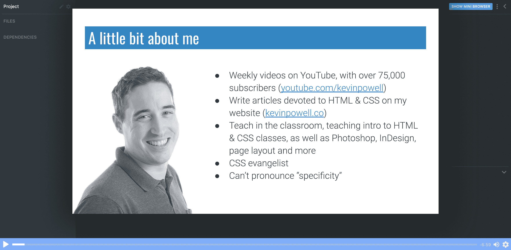

在第一课中，凯文简单介绍了你对这门课程的期望，以及一些尽可能从中学习的技巧。

# 2.什么是 HTML 和 CSS？

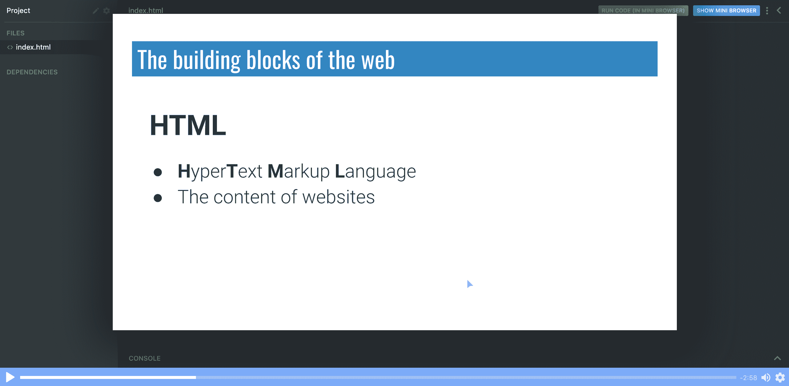

在第二集，Kevin 向我们介绍了 HTML 和 CSS，这些缩写代表什么，以及 HTML 和 CSS 是如何紧密交织在一起的。

# 3.基本术语和语法

Kevin 用一本书作为 HTML 标记如何工作的例子，并介绍了诸如`elements`和`tags`这样的概念，以及如何使用它们。

# 4.我们写点 HTML 吧！

在这个截屏中，Kevin 介绍了`<!DOCTYPE html>`，让浏览器知道内容是 HTML，我们编写了第一个 HTML 网页，并在此过程中学习了一些基本元素！

```
<!DOCTYPE html>
<html>
  <head>
    <title>My first website</title>
  </head>

  <body>
    <h1>My very first webpage</h1>
    <h2>Websites are built with HTML</h2>
    <p>HTML is a markup language that tells the browser what everything is</p>
    <h2>They also use CSS</h2>
    <p>I can't wait to start learning CSS!</p>
  </body>
</html> 
```

# 5.`strong`和`emphasis`

我们可以使用`<em>`在文本中添加*强调*，使用`<strong>`添加**重要性**。

# 6.文件命名和组织

在这一部分，Kevin 教了我们一些关于文件命名的好方法，并给出了如何组织文件的好建议。

# 7.锚点和属性

我们可以使用 anchor `<a>`元素来链接到同一页面上的不同位置或另一个页面。为了告诉`<a>`链接到哪里，我们使用`attributes`，对于主播来说是`href`。

```
<a href="https://scrimba.com">Link to Scrimba</a> 
```

# 8.CSS 简介

Kevin 向我们介绍了 CSS 语法以及 CSS 中属性和值的概念。我们如何使用`property: value`语法来设计我们的网页，并引入*内联*样式来使页面上的单个元素看起来更好。

# 9.CSS 基础

在这段视频中，我们将学习字体大小、颜色、背景颜色和文本对齐。凯文将向我们介绍在 CSS 中使用关键字、`hex`、`rgb`和`hsl`值来指定颜色的四种不同方式。

# 10.练习时间！

好了，是时候做一些个人练习了。Kevin 给我们布置了一个任务，创建一个关于我们自己的页面，并在这个过程中给我们布置了一些 HTML/CSS 挑战。

```
<!--
HTML
  - h1 (the title of the page)
  - An introductory paragraph
  - Two h2s, each followed by a few paragraphs
  - Inside the paragraphs, use strong and emphasis tags
  - If you are feeling adventurous add a second page and link to it

CSS
  - Change the color of the h1
  - Change the text alignment of the h1
  - Change the color of the h2s
  - Change the font-size of the paragraphs
  - If you added a link, change the color of it
 --> 
```

# 11.重复到这一点

在本期节目中，我们快速回顾了到目前为止我们所学的关于 HTML 和 CSS 的所有知识。重复是学习之母！

# 12.列表

现在，Kevin 向我们展示了如何在 HTML 中使用`<ol>`创建有序列表，使用`<ul>`创建无序列表。

```
<ol>
  <li>List item one</li>
  <li>a second list item</li>
</ol>

<ul>
  <li>bullet point</li>
  <li>another bullet</li>
</ul> 
```

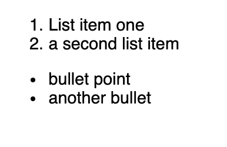

*[*Click* here *to go to the cast*](https://scrimba.com/p/pvwJdCn/cnZ3dnAJ?utm_source=freecodecamp.org&utm_medium=referral&utm_campaign=ghtmlcss_launch_article)*

# 13.形象

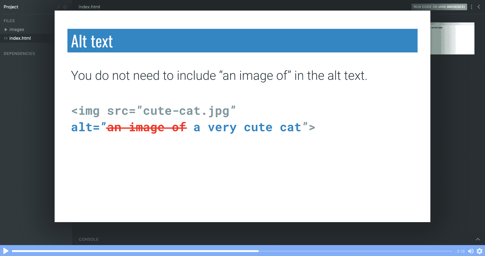

图像自动关闭，两个``都有效``。凯文还解释了如何使用`src`和`alt`属性，以及`alt`如何帮助提高可访问性。

```
 
```

# 14.练习时间！

好了，我们第二次练习截屏的时间到了。凯文给我们设置了一个挑战，将一些 markdown 文件转换成 HTML/CSS 网页。如果您不确定`markdown`是什么，请不要担心，因为在这个练习环节中，Kevin 将带领我们完成任务。

# 15.内部 CSS

在这一章中，Kevin 介绍了内部 CSS，它是编写内联 CSS 的一种替代方法。

内部 CSS 和 HTML 写在同一个文件中，但是在一个单独的`<style>`标签中

```
<!DOCTYPE html>
<html>
  <head>
    <title>All about Earth and Mars</title>
    <style>
      h1 {
        font-size: 60px;
      }

      p {
        font-size: 24px;
        color: steelblue;
      }
    </style>
  </head>
  <body>
    <h1>Earth and Mars</h1>
    <p>Earth and Mars are two planets within our solar system.</p>
  </body>
</html> 
```

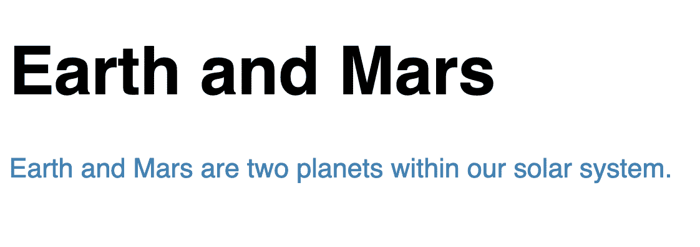

*[*Click* here *to go to the cast*](https://scrimba.com/p/pvwJdCn/cbWKNeuE?utm_source=freecodecamp.org&utm_medium=referral&utm_campaign=ghtmlcss_launch_article)*

# 16.外部 CSS

外部 CSS 是管理 CSS 的另一种方法。这次 Kevin 向我们展示了如何将 CSS 提取到一个单独的文件中，以及如何用一个`<link>`标签将 CSS 样式表链接到我们的 HTML 文件中

```
<link href="css/style.css" rel="stylesheet" /> 
```

# 17.类别和 id

在这个截屏中，Kevin 重点介绍了 CSS 中的三种选择器，以及何时应该使用哪一种。

```
/* Element selector  */
a {
  color: darksalmon;
}

/* Class selector  */
.intro {
  font-size: 24px;
}

/* ID selector  */
#earth-title {
  color: lightgreen;
} 
```

# 18.HTML 和 CSS 中的注释

我们可以在 HTML 中添加注释:

```
<html>
  <head>
    <title>Comments!</title>
    <link rel="stylesheet" href="css/style.css" />
  </head>
  <body>
    <h1>Comments!</h1>
    <!-- My comment goes here -->
  </body>
</html> 
```

在 CSS 中:

```
/* TODO: change the color of the text to white */

body {
  background: #333;
  color: white;
}

/* Some more comments */

h1 {
  color: red;
} 
```

# 19.您需要知道的唯一标签(目前)

在课程的这一部分，Kevin 提醒我们，在这一点上，我们不需要了解所有内容，在这一阶段，我们只需要了解以下标签:

```
h1 -> h6
p
strong and em
a
ul, ol, li
img 
```

如果我们能区分以下标签，那就太好了:

```
header
main
section
footer
nav
div 
```

# 20.箱式模型介绍

现在是发现*盒子模型*的时候了。
大多数元素都是块元素，这意味着它们的宽度是其父元素的 100%，高度为 0。

这是一个辉煌的演员阵容，其中凯文不仅简单明了地解释了盒子模型是如何工作的，而且还让我们避免了即使是有经验的开发人员也会不时陷入的常见陷阱。

# 21.边距和填充

接下来是边距和填充。
边距用于控制元素**相对于其周围**的位置，而填充用于控制内容**在**元素中的位置。Kevin 很好地解释了在 CSS 中设置填充和边距的许多不同方式。

```
/*  */
padding-top: 20px;
padding-right: 30px;
padding-bottom: 40px;
padding-left: 50px;

/* Shorthand version would be */
padding: 20px 30px 40px 50px;

margin-top: 500px;
margin-left: 100px;
margin-right: 100px;
margin-bottom: 10px;

/* Shorthand version would be */
margin: 500px 100px 10px; 
```

# 22.边界

盒子模型中的最后一块——边框。在元素周围添加边框。它们可以以类似于边距和填充的方式设置。

```
border-color: yellow;
border-width: 20px;
border-style: solid;

/* Shorthand version would be */
border: solid yellow 20px; 
```

# 23.箱式模型总结

在这一章中，凯文帮助我们回顾 CSS 盒子模型，并提供了一个很好的形象化的未来参考。

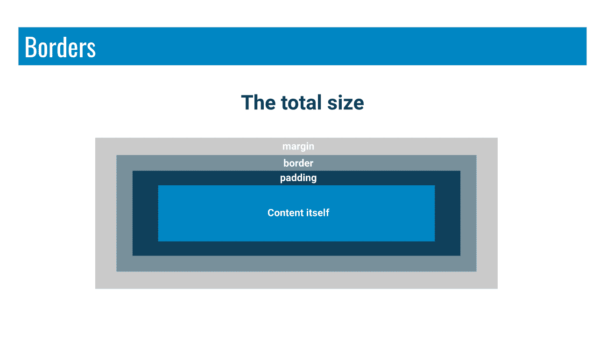

*[*Click* here *to go to* the *cast*](https://scrimba.com/p/pvwJdCn/cWQVDPCJ?utm_source=freecodecamp.org&utm_medium=referral&utm_campaign=ghtmlcss_launch_article)*

# 24.基本布局

我们现在准备创建一个非常基本的布局。

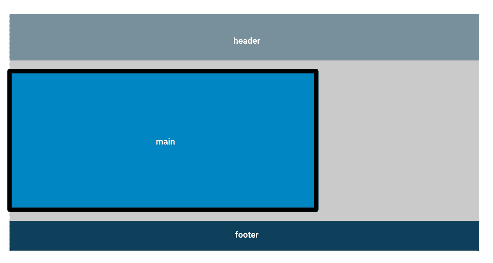

*[*Click* here *to go to the cast*](https://scrimba.com/p/pvwJdCn/cbWmpeC9?utm_source=freecodecamp.org&utm_medium=referral&utm_campaign=ghtmlcss_launch_article)*

凯文将指导我们创建一个关于恐龙的页面，在那里我们将能够把我们到目前为止所学的一切付诸实践。

# 25.基本布局——将一个元素放在页面中央

在这一章中，凯文向我们展示了如何将主要元素居中。这并不太难，但是有一些棘手的地方。

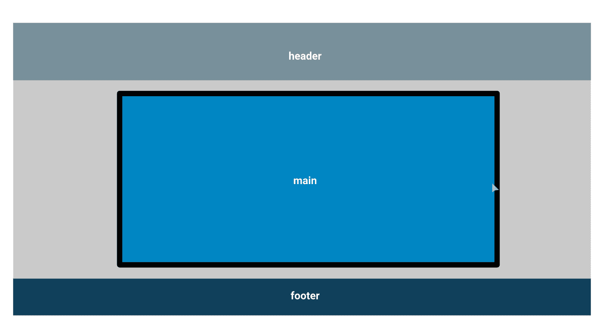

*[*Click* here *to go to the cast*](https://scrimba.com/p/pvwJdCn/ckdDNKAV?utm_source=freecodecamp.org&utm_medium=referral&utm_campaign=ghtmlcss_launch_article)*

# 26.使用 flexbox 创建列

到目前为止，我们做得很好。

在这最后的演员表中，Kevin 介绍了一个迷你顶石项目来从头开始创建这个 HTML 布局。

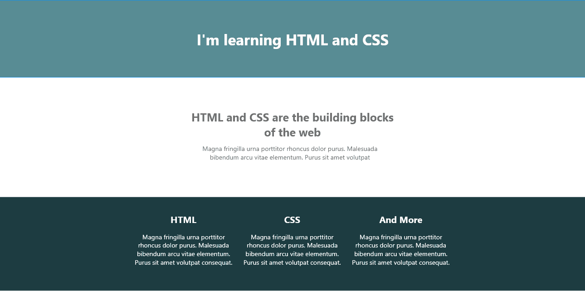

*[*Click* here *to go to the cast*](https://scrimba.com/p/pvwJdCn/cZnGZDc8?utm_source=freecodecamp.org&utm_medium=referral&utm_campaign=ghtmlcss_launch_article)*

很多设计经常在页脚使用分栏。在这个节目中，Kevin 向我们展示了如何使用`display: flex`来创建这个整洁的布局。

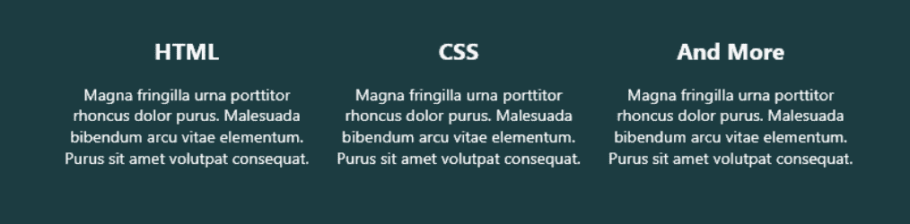

*[*Click* here *to go to the cast*](https://scrimba.com/p/pvwJdCn/cZnGZDc8?utm_source=freecodecamp.org&utm_medium=referral&utm_campaign=ghtmlcss_launch_article)*

# 27.从头开始创建布局 HTML

在这个截屏中，Kevin 将设计分成易于管理的几个部分，并带领我们完成 HTML 实现。

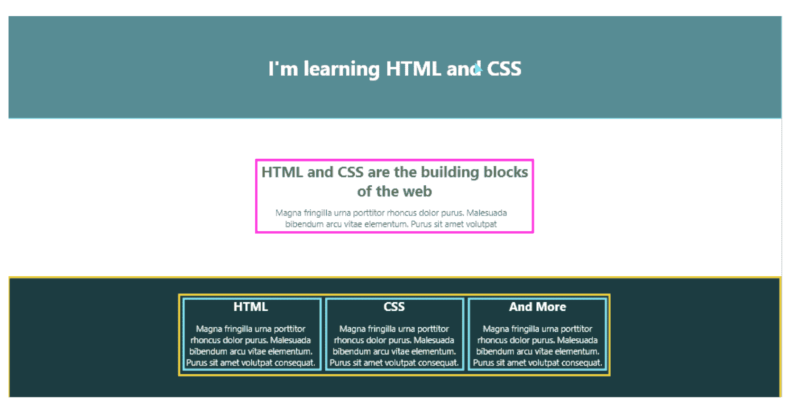

*[*Click* here *to go to the cast*](https://scrimba.com/p/pvwJdCn/cdPK6BCv?utm_source=freecodecamp.org&utm_medium=referral&utm_campaign=ghtmlcss_launch_article)*

在这个截屏中，我们正在创建 HTML 标记。

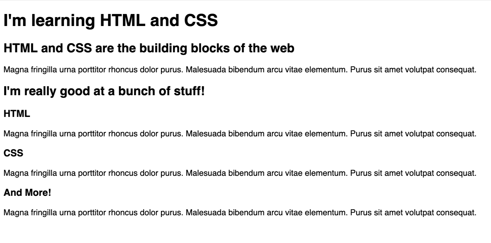

*[*Click* here *to go to the cast*](https://scrimba.com/p/pvwJdCn/cdPK6BCv?utm_source=freecodecamp.org&utm_medium=referral&utm_campaign=ghtmlcss_launch_article)*

# 28.创建布局 CSS

在本课程的最后一部分，我们将编写 CSS 来创建最终的布局。


*[*Click* here *to go to the cast*](https://scrimba.com/p/pvwJdCn/cqR8k6cN?utm_source=freecodecamp.org&utm_medium=referral&utm_campaign=ghtmlcss_launch_article)*

# 29.下一步是什么？

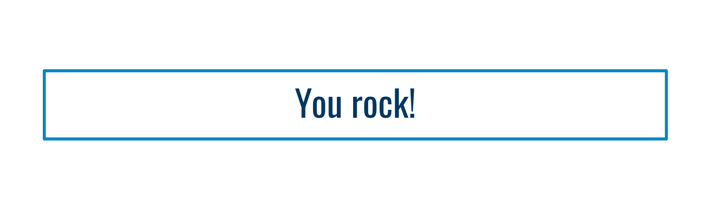

如果你一路走到这一步，那么给自己一个鼓励。祝贺您完成课程！我们已经谈了很多，你完全有理由为自己感到骄傲。

从这里你能去哪里？Kevin 的第一个建议是安装一个文本编辑器。在这个阶段，他们中的任何一个都是好的，你可以在以后改变。VS 代码非常受欢迎，这是有原因的。

你也应该关注凯文即将推出的关于如何建立响应性网站的高级课程，所以一定要[注册凯文的时事通讯](https://www.kevinpowell.co/newsletter/)。

快乐编码:)

* * *

感谢阅读！我的名字叫 Per Borgen，我是最简单的学习编码方法——Scrimba 的联合创始人。如果你想学习建立专业水平的现代网站，你应该看看我们的[响应式网页设计训练营](https://scrimba.com/g/gresponsive?utm_source=freecodecamp.org&utm_medium=referral&utm_campaign=ghtmlcss_launch_article)。


[Click here to get to the advanced bootcamp.](https://scrimba.com/g/gresponsive?utm_source=freecodecamp.org&utm_medium=referral&utm_campaign=ghtmlcss_launch_article)