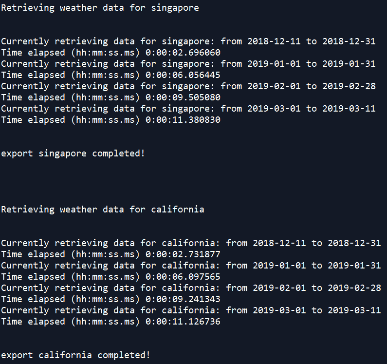
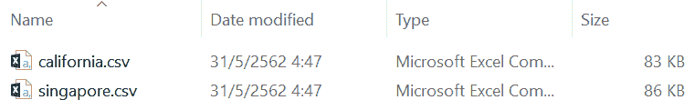
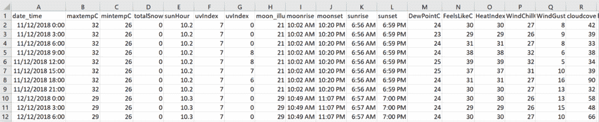

# 使用 Python 获取 CSV 格式的历史天气预报数据

> 原文：<https://www.freecodecamp.org/news/obtain-historical-weather-forecast-data-in-csv-format-using-python/>

最近在做一个与可再生能源相关的机器学习项目，需要多个城市 的 ****历史天气预报数据。****

尽管进行了大量的研究，我还是很难找到好的数据源。大多数网站只允许访问过去两周的历史数据。如果需要更多，需要付费。在我的例子中，我需要五年的数据——每小时的历史预测，这可能很昂贵。

### **我的要求是...**

****1。免费—至少在试用期间****

不需要提供信用卡信息。

****2。灵活的****

灵活改变预测时间间隔，时间段，地点。

****3。可复制****

易于在生产阶段复制和实施。

最后，我决定使用来自世界天气在线的数据。这花了我不到两分钟的时间订阅免费试用高级 API——无需填写信用卡信息。(截至 2019 年 5 月 30 日，60 天内每天 500 次免费请求)。


[https://www.worldweatheronline.com/developer/signup.aspx](https://www.worldweatheronline.com/developer/signup.aspx)

您可以在这里尝试 JSON 或 XML 格式的请求。结果是嵌套的 JSON，在输入 ML 模型之前需要做一些预处理工作。因此，我写了一些[脚本](https://github.com/ekapope/WorldWeatherOnline)来将它们解析成熊猫数据帧并保存为 CSV 以备后用。

### 介绍 wwo-hist 包

这个 [wwo-hist 包](https://pypi.org/project/wwo-hist/)用于从[世界天气在线](https://www.worldweatheronline.com/developer/api/historical-weather-api.aspx)获取历史天气数据并解析成熊猫数据帧和 CSV 文件。

****输入:**** api_key、位置 _ 列表、开始 _ 日期、结束 _ 日期、频率

****输出:**** 位置 _ 名称. csv

****输出列名:**** date_time，maxtempC，mintempC，totalSnow_cm，sunHour，uvIndex，uvIndex，moon_illumination，月出，月落，日出，日落，DewPointC，FeelsLikeC，HeatIndexC，WindChillC，WindGustKmph，cloudcover，湿度，precipMM，压力，tempC，能见度，winddirDegree，windspeedKmph

#### 安装并导入软件包:

```
pip install wwo-hist
```

```
# import the package and function
from wwo_hist import retrieve_hist_data

# set working directory to store output csv file(s)
import os
os.chdir(".\YOUR_PATH")
```

**示例代码:**

指定输入参数并调用*****retrieve _ hist _ data()******。*有关参数设置的更多信息，请访问 [my github repo](https://github.com/ekapope/WorldWeatherOnline) 。

这将从 2018 年 12 月 11 日**到 2019 年 3 月 11 日**检索 ****【新加坡】**** 和 ****加州**** 的 ****3 小时间隔**** 历史天气预报数据，并将输出保存到 hist_weather_data 变量和 ****CSV**** 文件中。****

```
`FREQUENCY = 3
START_DATE = '11-DEC-2018'
END_DATE = '11-MAR-2019'
API_KEY = 'YOUR_API_KEY'
LOCATION_LIST = ['singapore','california']

hist_weather_data = retrieve_hist_data(API_KEY,
                                LOCATION_LIST,
                                START_DATE,
                                END_DATE,
                                FREQUENCY,
                                location_label = False,
                                export_csv = True,
                                store_df = True)`
```

**

This is what you will see in your console.** **

Result CSV(s) exported to your working directory.** **

Check the CSV output.** 

**你有它！详细的脚本也记录在 GitHub 上[。](https://github.com/ekapope/WorldWeatherOnline)**

* * *

**感谢您的阅读。请尝试一下，并让我知道你的反馈！如果你喜欢我的做法，可以考虑在 [GitHub](https://github.com/ekapope) 、 [Medium](https://medium.com/@ekapope.v) 和 [Twitter](https://twitter.com/EkapopeV) 上关注我，以获得更多关于你的订阅的文章和教程。**