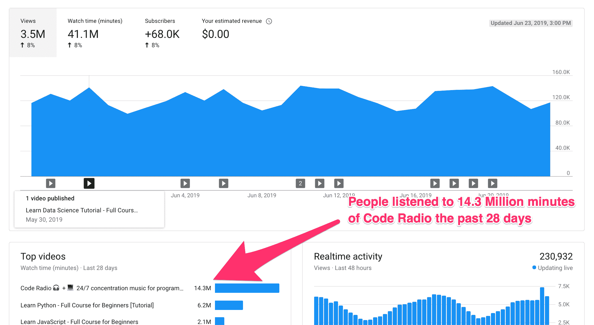
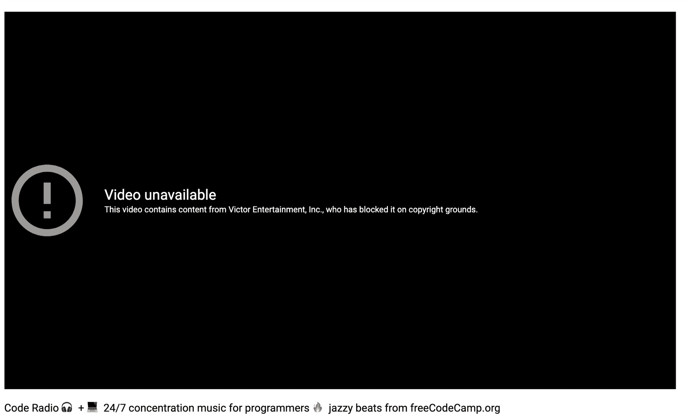
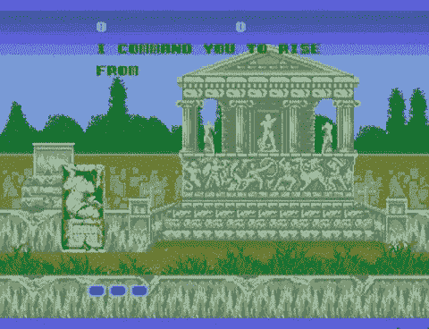

# 密码无线电的兴衰

> 原文：<https://www.freecodecamp.org/news/the-fall-and-rise-of-code-radio/>

Code Radio 是一个由 freeCodeCamp 社区运营的互联网电台。我们播放旨在帮助您在编码时集中注意力的音乐。

在过去的一年里，Code Radio 已经成为 YouTube 上最大的音乐流之一。人们在他们的咖啡店和共同工作的地方玩这个游戏。无论人们在哪里编码，在不太远的地方就能听到熟悉的编码无线电的声音。

仅在过去的 28 天里，开发人员收听 Code Radio 的时间就超过了 1400 万分钟。(这相当于长达 27 年的干扰和编码。)

# 秋天

Code Radio 上的 1，250 多首歌曲中有一首包含一部动画的简短音频样本，在歌曲结束时播放一个节拍。

原来，一家日本媒体公司——通过一系列收购——碰巧拥有这部动漫的版权。他们使用某种自动化系统来搜索 YouTube，并从他们庞大的知识产权目录中识别出任何样本。

其中一个流是代码无线电。周三早上，他们的系统向 YouTube 提交了自动删除请求。

就这样，全球 1000 家咖啡馆、办公室和黑客空间的音响陷入了沉默。我们的代码广播流被替换成了 YouTube 上的这条消息:

我们立即联系了 YouTube 支持。这一定是个错误。

我们交谈过的客户服务代表都很友好。但是他们不知道如何修理它。他们甚至不知道我们如何重新获得我们频道的流媒体控制。相反，他们说他们“会调查并回复我们。”

(截至周一下午，我们还没有收到他们的回复。)

因此，在这种混乱的深处——在来自专门的 Code Radio 听众询问发生了什么的推文和电子邮件的海洋中——我逐渐明白了真相: **Code Radio 需要一个新家——一个单一的有问题的自动删除请求无法将其从存在中抹去的家。**

# 编码无线电也兴起了

> “我们为什么会坠落，韦恩先生？所以我们可以学会重新振作起来。”-蝙蝠侠诞生中的阿尔弗雷德

啊-一个自我托管的代码电台！这将有几个好处:

1.  看 YouTube 用了很多数据。许多人的数据计划有限。如果我们自己主持 Code Radio，我们可以只提供 MP3 文件本身，而不是视频流。我们甚至可以以较低的比特率提供音乐的数据简化版本。
2.  在自由代码营盛行的许多国家，包括中国，YouTube 都被屏蔽了。代码广播的自我托管版本将在世界任何地方提供给每个人。
3.  使用 YouTube，你必须保持 YouTube 应用程序打开，否则音乐将停止播放(除非你每月向他们支付 12 美元的 YouTube Premium)。一个自托管的代码收音机可以继续在你的手机上播放-即使当你切换应用程序或锁定你的手机。
4.  有了自托管版本，我们可以建立代码电台移动应用程序，Alexa 技能，这样你就可以很容易地在亚马逊回声上收听代码电台-天空是无限的。

但是我们如何实现自托管版本呢？每月提供 1400 万分钟的音频不会很贵吗？这是大量的数据。

# 建筑代码无线电

原来网络电台社区挺活跃的。我们立即发现了一个很棒的开源自托管互联网广播项目，名为 AzuraCast。

我通过 Twitter 联系了项目维护人员，几分钟后，他就和我们通话了。他以前是地面电台的人。他向我们介绍了互联网无线电工具生态系统的最新进展。

是的-向世界各地的人们传输数字音频比仅仅提供我们的编码课程数据要昂贵得多。但如果支持者再捐些钱，我们应该能扭转局面。

有了 AzuraCast，加上一些额外的中继工具，我们可以以之前的规模运营一个自托管的互联网广播电台，每月花费不到 100 美元。

附注:如果你还不是支持者，我们欢迎你的支持。点点滴滴都有帮助:[https://donate.freecodecamp.org](https://donate.freecodecamp.org)-是的，我们接受一次性捐赠、加密、雇主捐赠匹配等等:[https://donate.freecodecamp.org/other-ways-to-donate/](https://donate.freecodecamp.org/other-ways-to-donate/))

# 代码电台正在直播。帮助我们进行负载测试，并给我们反馈。

现在就可以开始听代码电台: **[听代码电台](https://coderadio.freecodecamp.org)**

我们正在开发许多附加功能，将在未来几天推出:

*   比特率控制(因此您可以通过以 64 kbps 的速度收听来保存您的移动数据)
*   某种形式的聊天-最好是与现有的论坛帐户和论坛版主
*   一个聊天机器人(也许又是夜机器人)
*   热键
*   更好的移动体验
*   带回经典的 Saron Yitbarek 代码无线电动画

我要感谢@abdolsa、@beaucarnes、@raisedadead、@askmp、@scissorsneedfoodtoo，当然还有 Code Radio DJ 和策展人 [Lawrence Yeo 又名 Trebles and Blues](https://twitter.com/TreblesandBlues) 。他们齐心协力，在 24 小时内就完成了这个原型。

# YouTube da real MVP

说真的，我还要感谢 YouTube。通过他们自己的装模作样，他们无意中迫使我们后退一步，研究自托管代码无线电的可能性。

我们将继续在 YouTube 上发布深入的编码教程和免费的编程课程。我们不会因为他们自己的无能而反对他们。我们很感激他们的存在，并为像我们这样的非营利组织提供基础设施，免费向 100 多万订户提供高清视频。

这只是我们社区逐渐脱离像 Medium 和脸书这样的专有平台，转向像开发者新闻和这个论坛这样的我们自己的工具的最新篇章。

感谢阅读，感谢聆听，编码快乐！