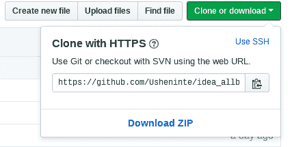
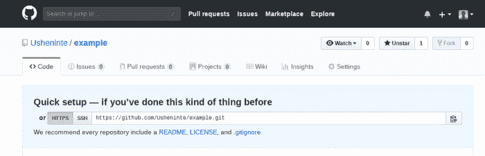

# 推向 Github——对诗人来说足够简单

> 原文：<https://www.freecodecamp.org/news/pushing-to-github-made-simple-enough-for-poets/>

当我开始积极地向 Github 推送内容时，我没有推送开源贡献、组件或任何类似的东西——我推送的是诗歌。我之所以这样做，是因为这是我最喜欢的，在编码之后。我一直很感激我主动做出了我的第一个`git commit`。

现在，我想为新的程序员(和诗人——希望如此)分解这个过程，以便他们也能适应使用 Github。我将分解几种向 Github 推送内容的方式。出于本文的目的，我将假设读者熟悉终端的用法(GitBash 或其他)。

* * *

### 使用自述文件推送至新的存储库

这需要几个基本步骤:

*   单击存储库页面上绿色的克隆或下载按钮。
    

*   使用克隆 HTTPS 选项，并复制提供的链接。
    

*   在终端中运行`git clone https://github.com/UserProfile/repository.git`。这里， ***UserProfile*** 和 ***repository*** 将被替换为复制链接中提供的值。
*   在终端中运行`git init`。这将初始化本地计算机系统上的文件夹/存储库。
*   在终端中运行`git add .`。这将跟踪自上次提交以来对系统上的文件夹所做的任何更改。如果这是您第一次提交文件夹的内容，它将添加所有内容。
*   运行`git commit -m"insert Message here"`。这将为您系统上的文件夹准备添加/跟踪的更改，以便推送到 Github。在这里， ***插入消息在这里，*** 可以替换为您选择的任何相关提交消息。
*   运行`git push origin master`。注意**命令中的最后一个字*主*** ，并不是运行`git push`时的固定条目。它可以替换为任何相关的“分支名称”。

* * *

### 如何将现有代码推送到新的 Github 库

> “编码是一件美好的事情。任何人都可以学习编码！”

您需要做的事情:

*   复制提供的`HTTPS`链接。
    

*   在终端中运行`git init`。这将初始化本地计算机系统上的文件夹/存储库。
*   在终端中运行`git add .`。这将跟踪自上次提交以来对系统上的文件夹所做的任何更改。由于这是您第一次提交文件夹的内容，它将添加所有内容。
*   运行`git commit -m"insert Message here"`。这将为您系统上的文件夹准备添加/跟踪的更改，以便推送到 Github。在这里， ***插入消息在这里，*** 可以替换为您选择的任何相关提交消息。
*   在终端中运行`git remote add origin https://github.com/Usheninte/example.git`。这里， ***引座员*** 和 ***示例*** 将被替换为复制链接中提供的值。这将把您本地计算机系统上的现有文件夹推到新创建的**Github 库。**
*   运行`git remote -v`。这确实有些 ***git 拉*** 和 ***git 推*** 的魔力，以确保你的新 Github 库的内容，和你本地系统上的文件夹是一样的。
*   运行`git push origin master`。注意**命令中的最后一个字*主*** ，并不是运行`git push`时的固定条目。它可以替换为任何相关的“分支名称”。

* * *

所以，就这样了！我真的相信任何人都可以学习编码。我花了一年时间，在尼日利亚辅导本科生软件开发。很快，我将作为**融水科技创业学院的一名[受训企业家开始我的旅程。](https://meltwater.org/training-program/)**

> 今天就开始编码！