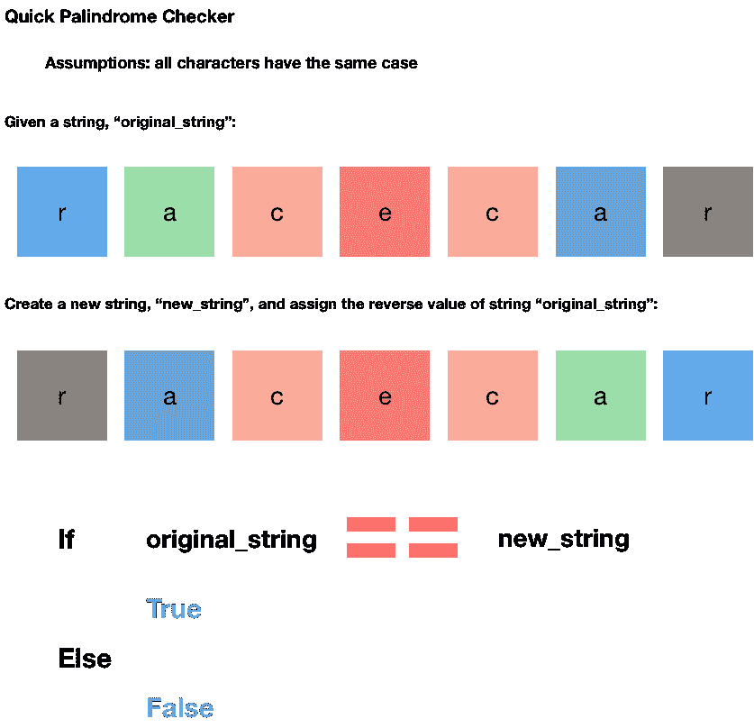

# 什么是回文——一个直观的解释

> 原文：<https://www.freecodecamp.org/news/cjn-palindrome-visualized/>

### 什么是回文？

回文是一个单词、短语或序列，向后读和向前读是一样的。

### 为什么开发人员需要知道什么是回文，为什么他们要学习这个？

*   回文是一个常见的字符串操作/算法问题
*   下面的例子是最简单的一个。
*   有大量从容易到困难的回文问题(见最后的链接)。



### 一种快速的回文检查方法:

```
def reverse(s):
    return s[::-1]

def isPalindrome(s):
    rev = reverse(s)

    if (s == rev):
        return True
    return False

#
s = "racecar"
ans = isPalindrome(s)

if ans == 1:
    print("Yes")
else:
    print("No")
```

来源:[https://www . geeks forgeeks . org/python-program-check-string-回文-not/](https://www.geeksforgeeks.org/python-program-check-string-palindrome-not/)

### 更快的回文检查:

```
str(n) == str(n)[::-1]
```

来源:[https://stack overflow . com/questions/17331290/how-to-check-for-回文-using-python-logic/17331328](https://stackoverflow.com/questions/17331290/how-to-check-for-palindrome-using-python-logic/17331328)

### 学习材料

维基百科:[https://en.wikipedia.org/wiki/Palindrome](https://en.wikipedia.org/wiki/Palindrome)

极客们:https://www.geeksforgeeks.org/string-palindrome/

### 解决回文挑战

leet code:[https://leetcode.com/problemset/all/?search=palindrome](https://leetcode.com/problemset/all/?search=palindrome)

https://www.codewars.com/kata/search/my-languages?q =回文& beta=false

### 其他可视化

[冒泡排序](https://www.freecodecamp.org/news/cjn-bubble-sort-visualized/)