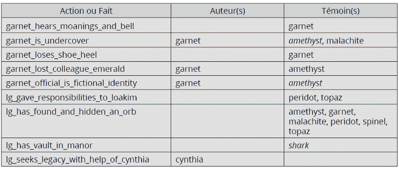
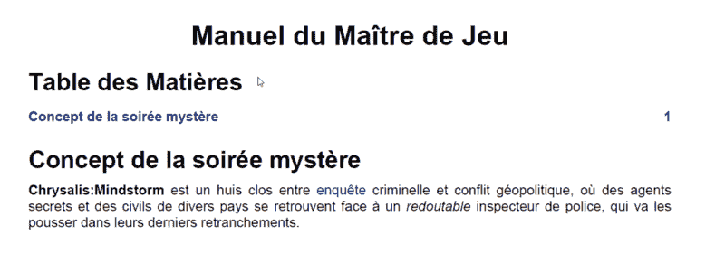
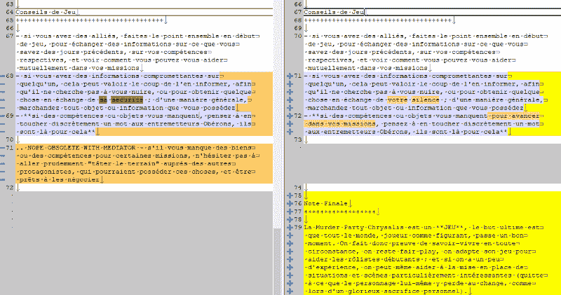
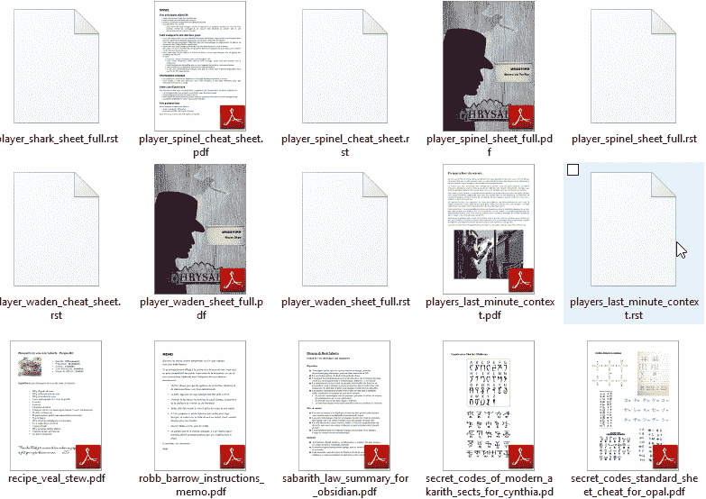
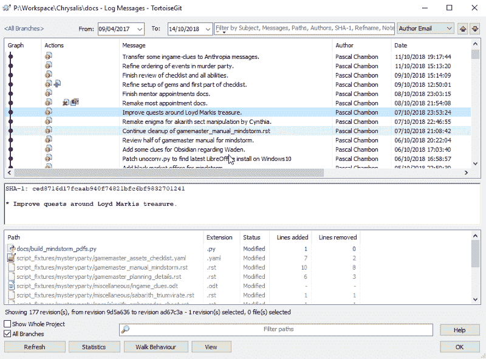

# 使用 Pychronia 工具辅助脚本编写

> 原文：<https://www.freecodecamp.org/news/assisted-script-writing-with-pychronia-tools/>

让软件工具为您检查角色扮演脚本的一致性！

*(此文法文版可用* [*此处上电 GN*](https://www.electro-gn.com/12495-lecriture-de-scenarios-assistee-avec-pychronia-tools) *)*

### 问题

每个作家都会向你证实:当你连续几个月写一个长篇故事时，保持连贯性是不容易的。当故事中有几十个角色，每个人都有自己对真相的片面看法时，情况就更糟了。而真人角色扮演游戏(LARPs)尤其暴露出这个问题。

危险不在于写作的第一稿:如果作者把所有的想法都准备好了，除了一些错别字和名字的互换，他不会冒太大的风险。这是在随后的修改(事实年表的变化，曲折的补充等)。)在各种参与者的文件中传播和复制的信息将逐渐变得过时和不一致。最终，即使是一个普通的“谋杀和神秘派对”的人物表，如果在场景的每次演变后没有严格检查和比较，也会以充满空间，时间，词汇和结构的不可思议性而告终。

我们能做些什么来防止这一点，而不是花一辈子做比较校对？首先，毫无疑问，*删除了几个玩家*共有的文本，这导致了繁琐的复制和粘贴(增加了错误并人为地夸大了文本的质量)。然后，*允许作者回顾他已经连续应用到他的场景中的相互依赖的变化集合。最后，给他关键信息的*摘要*，比冗长的文学文本更容易回顾。并且所有这些都在*中以尽可能自动化的方式进行*，因为要管理的文档数量会使最小的操作都非常耗时(并且存在粗心大意的风险)。*

### Pychronia 工具机械的好处

为了在创作[chrysis:mind storm](https://chrysalis-game.com/fr/cms/soiree-mystere-chrysalis-mindstorm/)神秘派对(仅限法语)的过程中受益于这些宝贵的写作工具，我设置了一个特定的写作过程，包括简单的文本文件(包含场景)、各种现有的软件工具，以及为此开发的模块“Pychronia Tools”。

一旦这个机器就位，你所要做的就是启动它，然后——神奇的是——一百个 PDF 文件一个接一个地出现在输出文件夹中:游戏大师手册，玩家的完整和总结的角色表，打印在漂亮卷轴上作为游戏线索的文档，临时演员的总结表…

这个工具不仅仅是一个简单的文档生成器:它包括一个自动检查脚本一致性的工具。现在，如果在一个地方提到了一个索引，但在另一个地方没有提供，或者如果同一个符号在不同的文件中有不同的值，就会报告错误。

**提取程序返回的一致性错误:**

> ！！！关键字 golden_box_with_blood 的提示注册表中出错:['needed']需要一个提供的提示
> ！！！关键谋杀日期的符号注册表中出现错误:[' 2018 年 1 月 3 日'，' 2018 年 3 月 15 日']

由于自动生成的汇总表，有可能一目了然地检查每个球员是否充分了解与他/她有关的事实，关键信息的分布或多或少是平衡的，以及主要事件是否正确记录在汇总表中。

**从场景“事实”的自动摘要中摘录:**

当角色名称中的“事实”只出现在完整的角色表中，而不出现在摘要表中时，则以斜体显示。



因此，游戏大师可以安静地依靠他自己的(自己生成的)文档来设置和监控游戏:详细的场景、晚上的计划、放置在场所中的材料和文字的清单、任务的自动总结和每个玩家的特殊技能…

除此之外，这台机器还可以通过电子邮件向每个玩家发送游戏文档(例如角色卡和最初拥有的文档)。这就避免了等待每个组织者的戏剧性事件:通过向参与者发送错误的文件来宠坏他。

与一些常见的 Word/LibreOffice 文件相比，该系统显然增加了项目的复杂性。但是它在场景可伸缩性和健壮性方面提供了宝贵的支持，检测不一致性并自动完成艰巨的任务。就我个人而言，他不止一次地救过我，当我在卡片上调换了一些角色的名字，或者忘记警告一些玩家他们过去应该犯下的新罪行。

### 如何设置这样的流程？

**步骤 1:** 从丰富的 office 文件(docx、odt、pdf…)转移到易于操作的纯文本格式，其中格式由特殊字符明确指示。游戏中的文档*对图形和排版有很高的需求(海报、卷轴、报纸……)可以放在一边，放在更常见的办公自动化文件中:Word、LibreOffice、InDesign……*

**纯文本示例(restructuredtext 格式):**

```
Manuel du Maître de Jeu
############################

.. contents:: Table des Matières
    :depth: 2

Concept de la soirée mystère
================================

**Chrysalis:Mindstorm** est un huis clos entre `enquête 
<https://fr.wikipedia.org/wiki/Enqu%C3%AAte>`_ criminelle et conflit
géopolitique, où des agents secrets et des civils de divers pays se 
retrouvent face à un *redoutable* inspecteur de police, qui va les 
pousser dans leurs derniers retranchements.
```

**此文本转换为 PDF 后的渲染:**



**第二步:**对场景文件使用版本管理器。这使得在任何时候回到过去成为可能，以避免可怕的意外文件修改，并检查每个更改的一致性(重命名一个地方，为一组玩家添加信息……)。

**查看对游戏规则的更改:**



第三步:添加一个小的处理引擎，以简单实用的功能丰富文本:允许一个文件包含另一个文件，定义可重用的文本块，插入变量(例如，关键事件的日期，神秘之夜的每一节都不同)，根据目标球员所属的球队显示不同的信息…

第四步:自动化一致性检查。为了做到这一点，我在处理引擎中创建了特定的标记，然后在我写的时候插入了这些标记:
——{ % fact % }标记用于宣布一个事实(例如，“某某人试图抢劫劳埃德·乔治”)，并指示玩家是作者还是仅仅是一个目击者。
—{ % hint % }标签允许你请求提供给玩家一个物理线索(字母、物体……)。
—{ % symbol % }标签确保一个值在所有场景文件中是唯一的(例如，犯罪的确切时间)，同时避免使用模糊文本的“变量”。

**使用特殊标签丰富场景文本的示例:**

> 请{{agent_gamma_fake_name }}:继由代理人 Epsilon { % fact " agent _ Epsilon _ triggered _ war "作为作者%}领导的剧情之后，代表" first_country_at_war" %}的{% symbol "Balberith "国家已加入战争。你有他签名的证词来证明。需要{ % hint " epsilon _ signed _ evidence _ for _ agent _ gamma % }。

正如我们所看到的，这些标签都有自己的语法，并且可以使用处理引擎的其他功能，例如变量(我们以*{ { agent _ gamma _ fake _ name } }*为例)。

**第五步:**将所有这些与脚本联系起来，脚本将自动执行创建游戏文档的不同步骤:收集有用的数据(包括玩家照片)，为每个参与者分发场景页面(全局上下文、个人上下文、游戏规则…)，将其转换为 PDF 格式，并为游戏主生成摘要表。

**生成的一些 PDF 文档，在它们的纯文本源旁边:**



### 今后

所有这些都很好，但是角色扮演社区的其他人呢？更广泛地说，它能从这个脚本编写支持系统提供的功能中受益吗？

答案是肯定的。然而，正如在上面的步骤中看到的，这个工具需要与通常为计算机开发保留的过程有一定的密切关系；很多 GN 作者没有的亲和力。

因此，我在倾听那些被这种体验所吸引的作者，以便和他们一起看看他们是如何工作的，他们能够使用什么样的格式和工具，以及这个系统如何能够被推广以适合他们的使用。然后，我可以看到提取这段代码(这是目前强烈链接到蝶蛹游戏文件的结构)，使它更自主，更容易部署。

请注意，像 [Twine](https://twinery.org/) 这样的软件已经允许以一种相当简单的方式创建场景，用一种迷你语言来定义变量和使用逻辑运算。因此，Pychronia Tools machinery 只对它提供的高度集成有意义，它具有自动化的一致性检查和端到端的生成脚本。

对这个编剧支持系统感兴趣？请随时使用[蛹网站](https://chrysalis-game.com/fr/cms/contacts/)上的信息联系我。

### 附录:懂电脑的人的详细资料

我的机器基于 Python 语言及其文档操作/创建生态系统。

至于场景的“纯文本”格式，许多“标记语言”都可以用于此目的:restructuredtext、markdown、textile、latex 甚至 html……我选择了 [restructuredtext](http://docutils.sourceforge.net/docs/user/rst/quickstart.html) ,因为它清晰、灵活，并且与 Python 语言高度集成。当然，要编辑这些文本文件，Pycharm、Notepad++、Geany 或一个简单的笔记本就可以做到。

对于版本管理器(或“VCS”)，我选择了 Git 及其出色的 TortoiseGit 图形界面(不幸的是，只能在 Windows 下使用)。Mercurial、Bazaar、DARCS 或其他网站也同样相关。至少，我们可以使用 Dropbox 等人提出的版本化文件备份，即使它只提供了一些功能来可视化几个写入步骤之间的差异…

**通过 GIT 可视化对场景所做的修改:**



关于用于处理文本文件(和特定标签)的模板引擎，最后，我集成了强大的 [Jinja2](http://jinja.pocoo.org/) ，它允许你直接在模板中创建变量和宏。在我的例子中，这个引擎处理的数据来自 Yaml 文件的树结构，但是许多其他来源(python 文件、csv、XML……)也很容易集成。