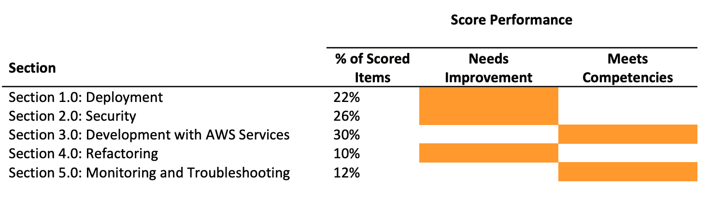
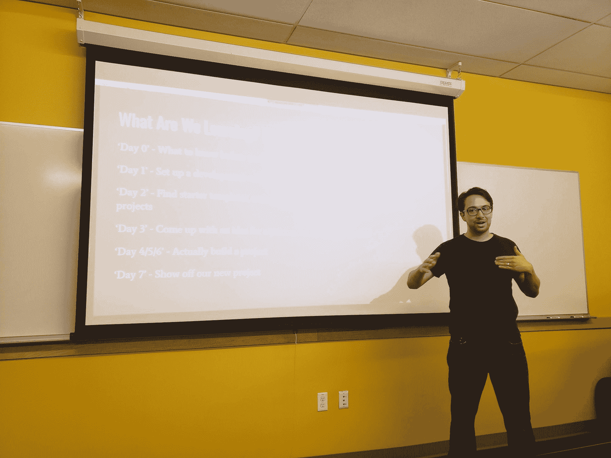
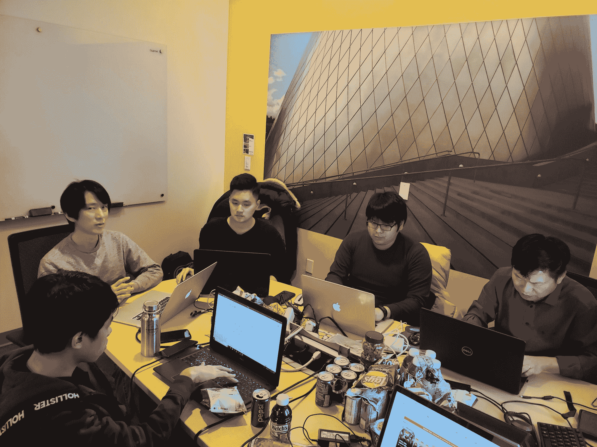

# 我没有通过 AWS 开发者考试。现在怎么办？

> 原文：<https://www.freecodecamp.org/news/cjn-i-failed-my-aws-developer-exam/>

我刚刚参加了 2019 年 7 月 1 日的 [AWS 认证开发者助理考试](https://aws.amazon.com/certification/certified-developer-associate/)。结果呢？我失败了。

My AWS Developer Certificate score card

***AWS 认证开发人员助理(DVA-C01)的分数在 100 到 1000 分之间。通过考试所需的最低分数是 720 分。***

> 我得了 642 分

问题总数为 65 个。我做了一些粗略的计算。再答对 5 道题，我就能通过考试了。

**回顾与反思**

*   当我参加考试并检查问题时，我已经觉得我不会通过了。我复习我的问题。没什么。
*   接下来我做了什么？我用考点提供的可擦纸写下了每道题的题目。
*   我发现了什么？有很多基于场景的问题，这在我意料之中。问题使用 AWS 服务的组合，我也预料到了。但是节流、故障排除和根本原因分析呢？没有那么多。没有简单的问题。没有关于 SQS(简单队列服务)，SNS(简单通知服务)。此外，在 DynamoDB 上没有计算 WCU(写容量单位)和 RCU(读容量单位)的问题，我也准备好了。
*   我感觉到了什么？我一定是在问题池方面运气不佳，也许我需要更多的时间在使用 AWS 服务和遇到问题方面进行更多的实际操作。

## 现在怎么办？

我后悔参加考试了吗？不。在这个过程中我学到了很多。

我仍然像往常一样乐观，这是我的绝地思维技巧:

失败让我更加努力，更加谦虚(*让我觉得自己终究是个人* ) *。*

如果你不留心，成就会让你自满。

## 时间表

### Two thousand and eighteen

### 九月

***我用 AWS 服务湿了脚***

*   AWS 研讨会- [构建现代 Web 应用架构](https://aws.amazon.com/getting-started/projects/build-modern-app-fargate-lambda-dynamodb-python/)由[AM(Allen-Michael)Grobelny](https://www.linkedin.com/in/amgrobelny/)主持

Same speaker on a different event

### 十一月

***我在 AWS 学会了简单的项目创意创建。***

*   Fernando Medina Corey 在 7 天内构建无服务器投资组合

He visited us at City University of Seattle

### 十二月

***我亲身体验了 IAM、S3、Lambda、API 网关***

*   AWS 无服务器研讨会由[王聪](https://www.linkedin.com/in/kevin-pwang/)

从车间[创建的简单项目在这里](https://github.com/clarkngo/serverless-workshop)。

Serverless Workshop at City University of Seattle

## Two thousand and nineteen

我向同学们介绍了 AWS 服务。

### 一月

我自己的演讲:

*   [科技术语解码(第一部分)](https://youtu.be/HLi4zr_dgDU?list=PLK4sJSsw4V-f3tfHHrxBuCoJv2nWDNqIf)
*   [AWS S3 快速深潜系列](https://youtu.be/RZb7nNQvv2Y?list=PLK4sJSsw4V-f3tfHHrxBuCoJv2nWDNqIf)
*   [AWS Elasticsearch 快速深潜系列](https://youtu.be/KAHKuxXkWoM?list=PLK4sJSsw4V-f3tfHHrxBuCoJv2nWDNqIf)

### 三月

***看了成吨的 AWS 大会演讲。查看我的博客[在这里](https://www.freecodecamp.org/news/cjn-i-failed-my-aws-developer-exam/cjn-why-i-abandoned-my-mba-to-get-a-masters-in-computer-science)在我的硕士课程的旅程。***

[AWS 培训](https://aws.amazon.com/training/)

[AWS 培训](https://aws.amazon.com/education/awseducate/) -云计算简介和软件开发者途径

*   云计算简介[视频播放列表](https://www.youtube.com/playlist?list=PLK4sJSsw4V-f0bgbss6Bu_kSxIJ4mj7X3)
*   软件开发者途径[视频播放列表](https://www.youtube.com/playlist?list=PLK4sJSsw4V-eWashk3yCLcUZzYDa9fy-3)

### 六月

我恢复了 AWS 开发者考试的学习，因为我对自己能在考试中取得好成绩有了一些信心。

**如何再次学习的提示[此处](https://www.freecodecamp.org/news/cjn-i-failed-my-aws-developer-exam/cjn-how-to-teach-yourself-to-learn-again)。**

*   CISSE 2019 拉斯维加斯会议上的论文演示- [后端开发的无服务器计算架构安全性和质量分析](https://youtu.be/RxCFErjEmgs?list=PLK4sJSsw4V-f3tfHHrxBuCoJv2nWDNqIf)
*   [AWS 白皮书](https://aws.amazon.com/whitepapers/)
*   acloudguru 的 Udemy 课程- [AWS 认证开发者-助理 2019](https://www.udemy.com/share/1000viBUcZcVxWRnw=/)
*   qwikilabs

Qwiklab 课程

*   [亚马逊简单存储(S3)简介](https://www.qwiklabs.com/focuses/278?parent=catalog)
*   [AWS 身份和访问管理(IAM)简介](https://www.qwiklabs.com/focuses/281?parent=catalog)
*   EC2 简介
*   [亚马逊弹性搜索服务简介](https://www.qwiklabs.com/focuses/273?parent=catalog)
*   [亚马逊关系数据库服务(RDS) - SQL Server 简介](https://www.qwiklabs.com/focuses/378?parent=catalog)
*   [dynamo db 简介](https://www.qwiklabs.com/focuses/271?parent=catalog)
*   [AWS cloud formation Designer 简介](https://www.qwiklabs.com/focuses/384?parent=catalog)
*   [AWS Lambda 简介](https://www.qwiklabs.com/focuses/5988?parent=catalog)
*   [将亚马逊引入 API 网关](https://www.qwiklabs.com/focuses/269?parent=catalog)
*   [使用亚马逊 DynamoDB 的无服务器网络应用-第 1 部分](https://www.qwiklabs.com/focuses/395?parent=catalog)
*   [使用亚马逊 DynamoDB 的无服务器网络应用-第二部分](https://www.qwiklabs.com/focuses/396?parent=catalog)
*   [使用亚马逊 DynamoDB 的无服务器网络应用——第三部分](https://www.qwiklabs.com/focuses/397?parent=catalog)
*   Quest: [使用 DynamoDB 的无服务器网络应用](https://www.qwiklabs.com/quests/21)

**结论**

写这篇博客的时候，我正在转移到其他东西上。

我目前在西雅图城市大学担任研究生助教，这份工作要求我专注于打字稿和创作内容。

我们还准备教亚马逊学徒，这需要我们学习 Linux 系统管理、网络、web 开发、MEAN stack 和 Django 来支持他们。

作为认证大使，我需要加快身份和安全方面的速度。来自 Auth0 [这里](https://auth0.com/docs/videos/learn-identity/01-introduction-to-identity)的牛逼素材。

作为一名开源贡献者，我需要重构我的代码，并在 [hackathon-starter](https://github.com/sahat/hackathon-starter) 存储库中创建一个新的 pull 请求。

**在这里伸出手:**

[推特](https://twitter.com/djjasonclark)

[LinkedIn](https://www.linkedin.com/in/clarkngo/)

下次见！不要让失败定义你=)