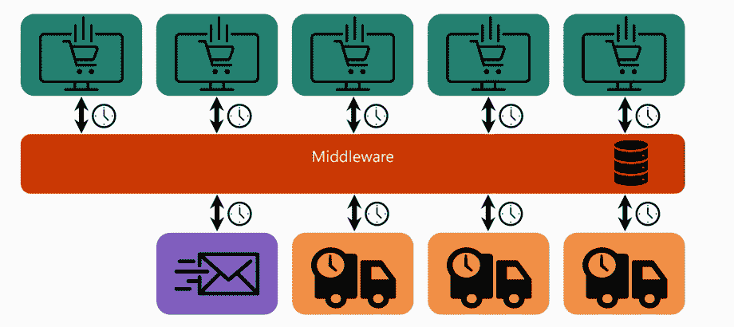
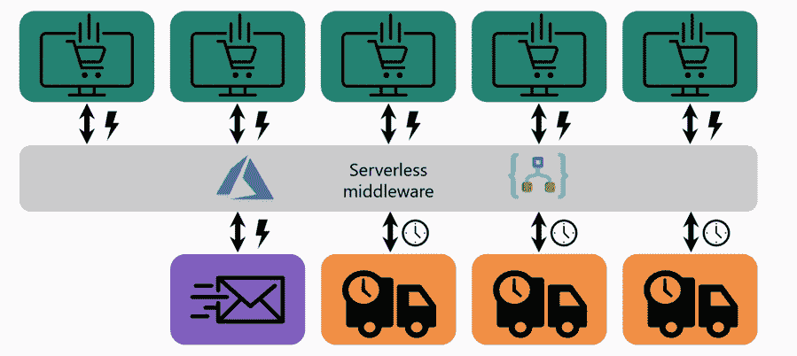
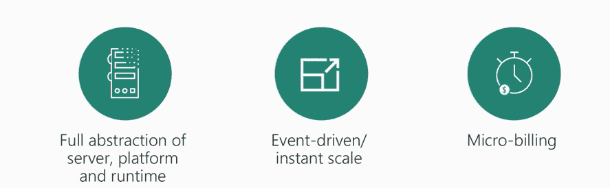
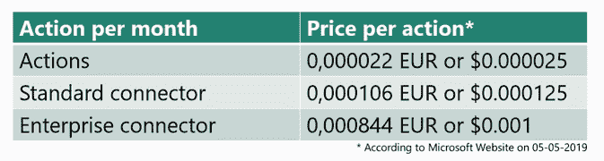
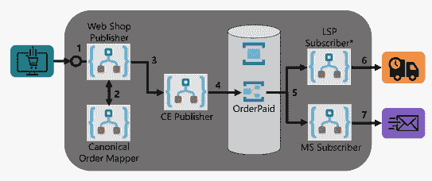
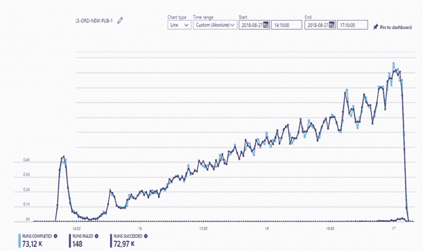
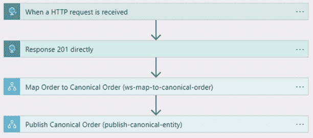
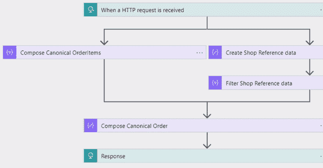
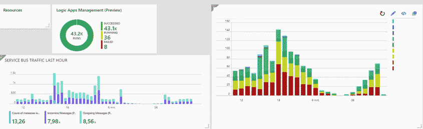

# Azure Logic 应用使用案例–黑色星期五

> 原文：<https://www.freecodecamp.org/news/azure-logic-apps-use-case-black-friday/>

这篇博客概述了当定制的集成系统崩溃时，Azure 无服务器技术是如何拯救用户的。此外，它还展示了使用 Azure 无服务器服务(如逻辑应用、服务总线队列和主题等)构建的高级架构解决方案，以取代遗留系统。

本文最初发表于[Serverless360.com](https://www.serverless360.com)

## 这一切是如何开始的？

大约三年前，在 B2B 领域开展业务的 Northwind 公司希望将其业务扩展到 B2C 领域。所以，该公司想开一个网上商店(SaaS)。因为这是一家 B2B 专业公司，所以没有仓库和运输服务来有效地为客户服务。该公司选择与 LSP(物流服务提供商)合作。遗留系统是使用连接网上商店和 LSP 的中间件构建的。后来，遗留系统与电子邮件系统整合在一起。随着几个分支机构(网上商店)在全球范围内开业，系统的复杂性增加了。

有一天，整个系统都瘫痪了，公司开始失去数百份订单。然后，该公司联系了一个专家团队来修复他们的中间件。

### **需要考虑的要求**

*   稳定性——系统需要足够稳定以处理大量订单。
*   监控–应该监控系统，以便在出现问题时向操作人员发出警报。
*   每小时处理一万份订单。
*   新 SaaS 网站

## 解决方案

专家团队使用 Azure 无服务器技术替换了中间件。主要使用逻辑应用和其他无服务器实体，如 Azure 函数、服务总线队列和主题。使用基于事件的方法将有状态中间件转换为无状态中间件。

## 什么是无服务器？

**服务器、平台和运行时的抽象**—不需要供应或维护任何服务器。不需要安装、维护或管理软件或运行时。

**事件驱动的扩展**–这是无服务器的重要特征之一，如果需求增加，您不必担心扩展您的解决方案。

**微计费**–当您的代码被执行时，您需要为每次执行付费。通常，供应商根据内存消耗和执行时间来计算。

### 优势

**管理应用而非服务器**–无服务器的显著优势是用户不管理服务器，而是由云服务提供商管理。

**降低开发运营成本**–由于基础设施由 CSP 维护，因此降低了开发运营成本。

**更快的上市时间**–它缩短了上市时间，因为无服务器技术屏蔽了基础工作，让开发人员专注于逻辑。

## Azure 逻辑应用

> **您可以使用 Logic App 服务在 Azure 中运行业务工作流。**

Logic 应用程序是您可以使用触发器和操作定义的一个工作流的逻辑容器。触发器可以实例化一个工作流，该工作流可以由一个或多个活动(动作)组成。例如，您可以通过发送 HTTP 请求来触发工作流，或者安排工作流每小时从公共网站检索数据。有 200 多种现成的连接器可用于企业集成。

### 利益

*   开箱即用的连接器减少了集成挑战
*   将数据从云中连接和集成到内部
*   云中的 B2B 和企业消息传递
*   功能强大的基于 web 的工作流设计器

## Azure Logic 应用的定价

定价很简单。这是一种现收现付的模式，你只需要花几个镍币。例如，如果您一天处理 1000 条服务总线消息，一个包含五个操作的工作流将花费您大约 4.62 欧元。要执行一个正常的操作，需要花费$ 0.000025，而对于一个标准连接器，需要花费$0.000125。甚至，企业连接器只需要 0.001 美元。欲了解更多信息，请参见定价页面[此处](https://azure.microsoft.com/en-in/pricing/details/logic-apps/)。

## 基础架构解决方案

最初，有一个通过 Webhook 连接到 webshop publisher Logic App 的 Webshop。Webshop publisher Logic 应用程序充当工作流的协调器。来自网上商店的数据被转换成规范的实体，并传递给规范的订单映射器逻辑应用程序。随后，控制流向 CE 发布者，在那里进行对象的翻译。然后，翻译后的对象被发送到服务总线主题。主题订阅以发布/订阅模式提供了一种一对多的交流形式。点击了解话题订阅规则[。基于过滤器，订单被发送到 LSP 用户和 MS(营销系统)用户。](https://www.serverless360.com/blog/manage-azure-topic-subscription-rules)

## Azure Logic 应用令人印象深刻的可扩展性

在运行上述工作流时，它可以在 20 分钟内处理 73，120 个订单。每个订单在不到 3 秒的时间内得到处理，成功率超过 98%。上面的日志显示完成了 73，120 次运行，其中完成了 72，972 次运行，148 次运行失败。

## 资源组中实体的视图

上图显示了资源组中实体的排列方式。为了更好地管理实体，请使用显示名称标签。它帮助用户在失败的情况下调试工作流。

## Webshop Publisher Logic 应用程序

开箱即用，有一个 HTTP 触发器，它启动逻辑应用程序并直接为接收到的消息发送 201 响应。201 响应表示请求已被满足，并导致一个或多个新资源被创建。随后，将订单消息发送到另一个逻辑应用程序(将订单映射到规范订单)并发布规范订单。

### 跟踪的属性

在“直接响应 201”操作中，跟踪以下属性

*   客户电子邮件
*   流动
*   订单 ID
*   Shop ID

## 规范顺序映射器

逻辑应用程序通过接收 HTTP 请求来触发。然后，消息将被传递给数据操作动作，以组成规范的订单项目并创建商店参考数据。随后，使用数据操作动作组成规范顺序并发回响应。

## 服务总线浏览器

为了便于管理实体，请使用服务总线资源管理器。它为服务总线主题提供了过滤器选项，使用该选项可以将消息发送到定义的订阅(LSP)。消息将根据服务总线主题中定义的属性进行过滤。以下是 Serverless360 如何成为服务总线浏览器的更好选择。

## 监视

上图显示了日志分析仪表板。它为与日志分析相关的实体提供了图形表示和监控功能。在日志分析中，如果出现问题，用户可以运行强大的查询并检查数据库。

## 演示–订单已支付

要测试新的解决方案架构，发送测试订单，使用 Postman 工具向 Logic App 发送 POST 消息。在发送成功的订单时，您可以在邮递员工具的左下角看到 201 响应。收到订单后，逻辑应用程序被触发，最后，订单消息将到达相应的任何一个 LSP。

## CI/CD 管道

上图代表 CI/CD 管道架构。有三个模块，即开发者上下文、Azure DevOps 和 Azure 订阅。开发者上下文包含 PowerShell、IDE 等。一旦开发人员签入代码，就提交到存储库。在切换构建选项时，构建管道将代码部署到 Blob 存储中。一旦 Build pipeline 完成了工作，Release pipeline 就会启动并告诉 ARM 反映开发、测试和生产环境中的变化。

### 利益

*   部署代码不需要手动步骤。
*   可以进行质量控制
*   组织可以有一个更大的开发团队

### **挑战**

*   ARM 模板需要大量的内务处理。
*   如果任何一个 ARM 模板崩溃，事情就会变得复杂。因为只有在发布过程中才能发现故障。
*   服务的节奏变化很快

## 上述解决方案的关键要点

*   更快的上市时间:只有三个开发人员，他们可以在 3 个月内完成项目。
*   弹性和可伸缩性:正如我们在上面看到的，应用程序是高度可伸缩的。它可以在 20 分钟内处理大约 7.3 万个订单。
*   它最适合业务关键型系统

这篇博客摘自“黑色星期五？拯救逻辑应用”,由 Aarjan Meirink 在 MSBuild 2019 上发表。