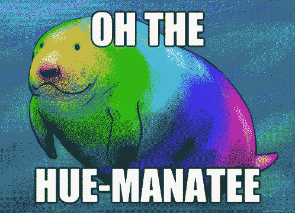
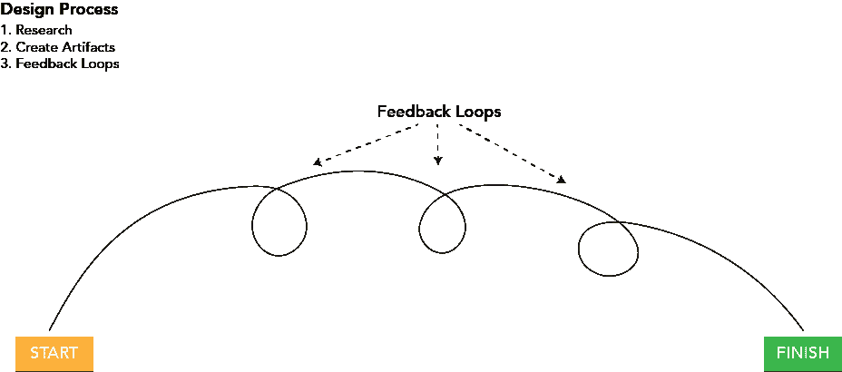

# 充分利用设计学校(更新)

> 原文：<https://www.freecodecamp.org/news/getting-the-most-out-of-design-school/>

来自设计专家的建议

我不是典型的网页设计学生。我在空军当了 10 年的宪兵。当我决定改变我的整个生活时，我预见到了我成功的两个障碍。第一，我今年 30 岁，试图挤进快速发展的网页设计世界。第二，我从军队中获得的经验是尽可能远离在科技领域工作。空军的网络应用程序几乎只在 Internet Explorer 中工作(哦，人类)。

但是，回到我的第一个观点，我把科技行业视为一列火车，在全国疾驰。它总是在前进，很少停下来让任何人上车。但这并不妨碍我抓起我的包(你知道，流浪汉有的那种东西)跳上去。

Which way to the Internet?

像大多数学生一样，我不断地问自己，“我为什么在学校，我在学什么？”也许不常见的是，“我学得够吗？”我没有深思，而是直奔源头。

我有幸见到了罗伯特·埃克哈特，一个多才多艺的人，但最近成为了华特·迪士尼工作室的经验设计师。他已经在产品/视觉设计领域为各种组织工作了 18 年，包括 NFL 和国家公园管理局。我和他坐下来讨论如何在不断发展的设计领域取得成功。

### 艺术学校

你在艺术学校学到了什么？

“我学会了一个过程。我学了美学理论。我学会了如何去看。有看有看。当你看艺术时，(你可能会说)，哦，太酷了，我能做到，一个五岁的孩子也能做到。但是如果你能看到艺术，你就能明白艺术家想要做什么。你必须学会如何去看。我认为如果更多的人被教会看东西，我们将生活在一个更加美好的世界。我们周围就不会有这么多丑陋和视觉污染，从恶心的广告牌到遍布整个城镇(洛杉矶)的电线。”

> “你必须学会如何去看。”

“我也学会了如何合作。我学会了厚脸皮。我有非常刻薄的教授，我的意思是他们很强硬。我们的教授来自 RISD(罗德岛设计学院)、耶鲁和巴塞尔。这些就像是作物设计学校的精华。他们的课程，他们坚持这个过程。体力劳动让我们慢了下来。那是另一个建议，就是慢下来。慢慢来。不要觉得匆忙。我知道最后期限之类的事情会接踵而至，我也知道你不想处于我所说的“分析瘫痪”状态。有时候你会想太多事情，以至于不敢去推动那个像素。如果我做了，但它是错的怎么办？忘了那件事吧，去做吧，继续前进。如果你做错了，承认它，从中吸取教训。你会成为更好的人，更好的设计师，更好的员工，更好的合作者。承认你错了。没有比揭露真相更糟糕的了。如果你想要真相，做一些完全错误的事情，你会很快得到真相。"

> “如果你想要真相，做一些完全错误的事情，你就会很快得到真相。”

“我也学会了如何表达自己。我学会了如何批判。批评别人的工作真的，真的对你自己的工作有帮助。除非你知道如何去看，否则你不可能成为一个好的评论家。你说的任何话，都要支持。不要只说‘我不喜欢’。为什么不喜欢？我喜欢“如果”这个词说，‘我不知道这是否有效，但如果呢？它开着门。更有外交手腕。另一个设计师需要感觉到，你所说的实际上会让他们的工作做得更好。归根结底，这就是我们想要的。"

**什么是“过程”？**

“过程是:

1.理解。“理解是关键。要理解，你需要研究。我总是这样说:如果你在设计一本书，那就去读这本书。不仅看了书，采访了作者。不仅采访作者，还要采访出版商和编辑。如果你正在设计一本书，了解它的故事。如果故事发生在某个城镇，那就研究这个城镇。如果它涉及一个问题，比如一种疾病，或者一个运动员，那就研究这项运动或者医学状况。先做那个。得到全面的了解。

a.“理解读者。是小说，还是非小说？那些读者是谁？谁通常会买这些书？采访他们。获得一个完整和全面的理解。

“这种研究并不总是被视为富有成效的，但对我来说，这是整个过程中不可或缺的一部分。如果你真的没有预算或时间来做用户反馈和研究，你有朋友、同事、同学。你仍然可以做这项研究。你只要打游击就行了。”

2.创造理解的人工制品。“将理解提升到一个新的层次就是共享理解。能够向一屋子的人传达你的想法和产品。你已经做了这项研究，你已经提出了一些很酷的想法，你如何将这些想法从这里(你的脑袋)转移到其他东西上。对于这种类型的工作，没有“一刀切”的演示工具。如果你认为有用的话，用建筑纸做点什么。建立一个复杂的原型。在 Illustrator 里画点东西。无论如何都要讲述对你设计的产品的理解。”

3.反馈循环。“从头到尾，产品都是这样做的:多圈圈的东西。不断地做反馈循环。每个循环都是一个协作会话。这种产品一直被吹捧为“真理”。我说的真实，是指:这个产品的真实性如何？它真的能解决商业问题和用户问题吗？”

“你不能做出假设。你可以做出有根据的猜测，这又回到了研究上。每当你做出一个决定，一个想法，支持它。我这样做是因为…我从这里收集的见解，引导我这样做，我认为，不是假设，我认为这将使它成功，但我不确定。让我们给其他人看看吧。测试一下，看看这个假设是否正确。永远挑战自己，永远挑战自己的假设。永远不要说，“没关系，因为我是设计师。”"

你认为那是设计学校的目的吗？

“是的，我认为这是任何艺术项目的目的。如果你想成为一名实践者，创造视觉交流，你应该知道如何去看。不仅看到，而且解释你看到的几乎任何东西。一旦你打破了那个封印，在这个世界上生活真的很难。”

很多人说，现在你可以在网上自学任何东西，你相信吗？

“我相信，是的。我在很多方面都是自学的，但我不相信你能在真空中成为一名伟大的设计师。我认为你需要其他人来合作。我认为技术技能，绝对是。前几天，我不得不修理房子里的一些东西…一个水龙头坏了，所以我去了 YouTube。瞧，看看我，我是个水管工。我自学了 Axure，如果你正在学习数码产品，这是另一个你应该看看的应用。这是用来做原型的。我说，它真的让我可以用手思考。我为此学习了技术技能，但如果没有这个过程，我用 [Axure](http://www.axure.com/) 做的事情将毫无意义。它只是一个工具。就像一把锤子。一把锤子可以建造一个家，如果你知道如何建造一个家的话。你被雇佣来创造。这就是设计，创造。让人们的工具见鬼去吧，让那些为你工作的工具来帮助你创造。你应该能够证明你能创造这些作品，你应该在你的作品集里有这些作品来证明你已经完成了这项工作。”

> “我在很多方面都是自学的，但我不相信你能在真空中成为一名伟大的设计师。”

### 你的第一份工作

为了作品的目的，你应该展示从开始到结束的整个过程，还是至少一个项目？

“现在机器人看你的简历了，所以你要给机器人写简历。删除您的日期。让你的语言更像十年级。我来来回回，我过去常常做这些报道，就像，这就是我在我的过程中所做的。它将是段落。我会去面试，希望人们至少会阅读。他们没有。然后我反其道而行之，我把它简化了:这个日期，这是我做的，如果你想看的话，在这里。以后再问我吧。然后我添加了案例研究，对其进行扩展。我觉得那对我很有用。我会建议，也许，做一个更标准的，自助餐式的作品集，在那里他们可以得到你的作品的一个很好的广度，然后也许对一个或两个有深度的探究，出于好奇。但是，还是要保持简短。最多不超过 500 字。”

你认为人们绝对 100%应该去实习吗？

“是的，我相信学徒制。德国很有趣，因为不是每个孩子都上大学，但每个孩子都有学徒期，他们在工作中学习。我在学校学到的是非常高水平的东西。这些都是值得学习的好东西，可以让你对自己和你的工作感到舒服。我在这个领域学到的东西，一旦我开始做实际的工作，和真正的客户在一起……会更加有益。尤其是这种类型的工作。我认为从一个真正有成就的同事或导师那里学习比任何课堂都重要。我强烈推荐实习，我会要求你得到报酬。如果可以的话，我会建议你去一些你真正钦佩和尊敬的地方。把它当成一个机会，即使你做的是蹩脚的工作。我的实习生，我总是带他们去开会。他们总是在那里，见证着。仅此一项，你就会学到很多东西。就在那个房间里。”

你和刚出校门的学生相处的经验是好是坏？

“有些出柜的学生表现得好像他们什么都知道。不要那样做。你的学位不是自大的许可证。给我留下深刻印象的走出校门的孩子都很好奇。也包括那些不怕直言不讳的人。我和许多有想法的年轻人一起工作过，他们是壁花。有些人，这是他们的个性，但在一个创造性的合作环境中，学会自信地表达自己是一个巨大的胜利。我发现，那是成功发生的地方。在一个充满创意的世界里，新鲜的视角……是如此有益。”

> "你的学位不是自大的许可证."

### 寿命

你如何保持相关性？

“我是一个技术爱好者，所以我总是对技术着迷，这很有帮助，对我来说这很自然。但这也是我的行业。我不必强迫自己变得相关。当 iPhone 问世时，我就想，‘我等不及要为它设计了……要弄清楚它。’"

你个人如何衡量，有什么趋势可循？

“这完全取决于我在为谁工作。如果你付钱给我，我会跟进的。例如，现在我在电影行业工作，所以我真的很喜欢…回到那个理解…我喜欢看电影和购买电影。我碰巧就是其中之一，但这不代表什么。你个人的偏见毫无意义。总是质疑自己的个人偏见。所以现在，我真的对电影趋势很感兴趣，电影是如何被购买、销售和发行的。”

“我让我的工作推动我所追随的趋势的相关性，但我真的很关注这个行业的大玩家。我试图以领导者的身份追随他们，而不是作为一个粉丝，只是想弄清楚他们在做什么。”

你如何防止精疲力尽？你如何平衡家庭生活和不断学习的需求？

“我只是要求它。我离开 NFL 的部分原因是因为我会一大早去上班，直到 9:30-10 才回家，所以我做了一些改变来找回这种感觉。我会在面试中问这个问题。你永远得不到你不要求的东西。工资也一样。你要你想要的钱，做你的研究。经常询问此事，并确保不止与一个人交谈。”

> "你永远得不到你不要求的东西。"

### 最后的想法

另一个我们谈到过，但没有写进本文的 app 是 [Sketch](https://www.sketchapp.com/) 。我接受了他的建议，并开始在我的线框和模型中使用它。我强烈推荐。他是这样说的:“所有的小配件商店，如果你用 photoshop(来设计产品)，你会被嘲笑的。他们都继续前进(去画素描)。”我们讨论的两个应用程序对学生/教师都有折扣。素描 50 美元，Axure 免费 50 美元。

我和鲍勃的谈话让我确信我走在正确的道路上。我非常感谢他花时间来指导我，我知道我会因此变得更好。最后，以下是他的一些鼓舞人心的话:

> “永远不要失去好奇心。无论你是在自学，还是去上课，还是在看 youtube 视频，都要不断学习……保持好奇心。”

### 更新:2019 年的最终想法

本文最初发表于 2016 年初。我们现在在 2019 年，我已经做了大约 3 年的专业 web 开发人员。本文中的所有信息仍然是相关的，只有一个小的例外。素描。Sketch 仍然被大量使用，但我个人已经转移到了 [Adobe XD](https://www.adobe.com/products/xd.html) 。它是免费的，并且内置了原型。 [Figma](https://www.figma.com/) 也是一个强有力的竞争者，然而，在使用了所有三个之后，我更喜欢 XD。

#### 参考

[**罗伯特·埃克哈特——体验设计师，数码**](http://roberteckhardt.com/)

[**交互式线框软件&实体模型工具| Axure**](http://www.axure.com/)

[https://www.sketchapp.com/](https://www.sketchapp.com/)