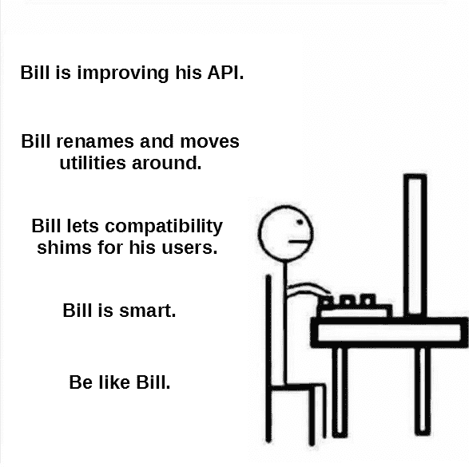
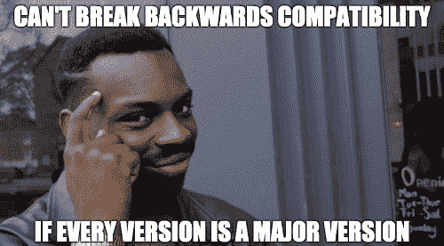
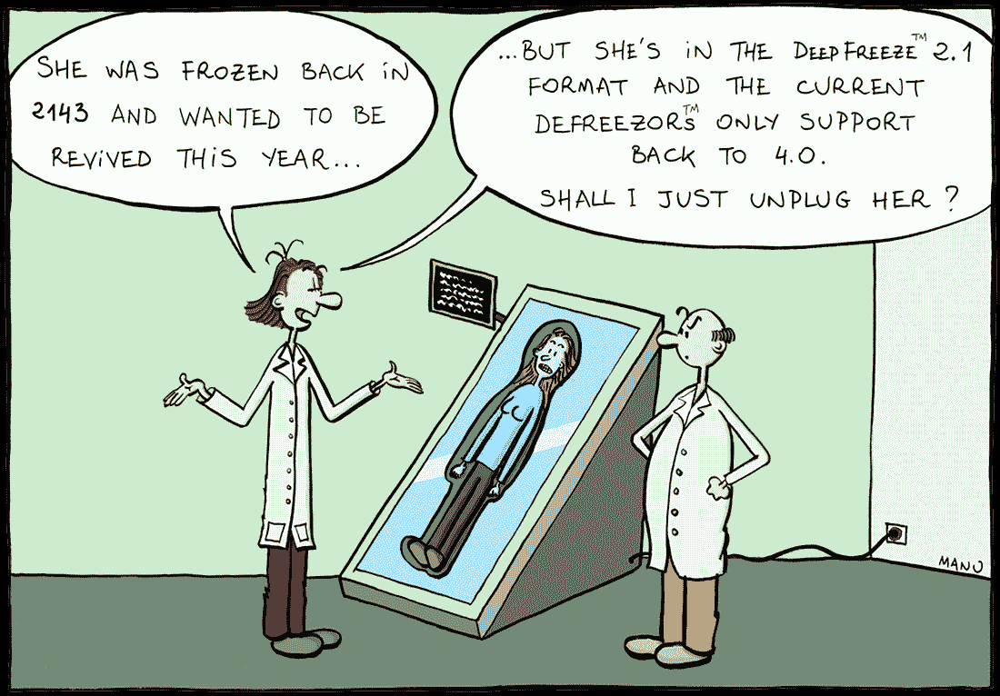

# API 稳定性便宜又容易，有 Compat 补丁！

> 原文：<https://www.freecodecamp.org/news/api-stability-is-cheap-and-easy/>

## 为什么向后兼容性很重要

(如果你已经确信 API 的稳定性是一个至关重要的问题，而不是一些保守人士的突发奇想，那就省点时间，直接跳到下一章吧。)

> “我们不破坏用户空间！”

唉，莱纳斯·托沃兹的这句著名的咆哮比以往任何时候都更加贴切。

> 如果一个变化导致用户程序中断，这是内核中的一个错误。我们从不责怪用户程序。这能有多难理解？

> 如果应用程序不关心特定的错误值，那么一开始就有多个错误值是没有意义的，你也不应该关心是哪个错误值。但是由于应用程序*关心*，并且由于我们*关心*有多个错误值，我们坚持使用旧的，除非有一些*非常*好的理由不这样做。而且那些理由真的需要很充分，并且要拼出来，解释清楚。

让我们用任何框架/库来代替“内核”，用“API 签名”来代替“错误值”，我们就得到一条优秀编程的无价戒律。我们可以忍受一些小错误和不完美的特性，但是当我们的应用程序在简单的版本升级后出现 segfaults 或冗长的回溯时，就有问题了。一个真正的问题。

这里有一个悖论。关于操作系统发行版、驱动程序、libc/gtk/Qt 和其他低级的静态类型库，我们期望——并且乐于体验——无痛的更新，只带来新的特性和错误修复。然而，对于我们的高级 web 框架，大部分是用动态语言编码的，我们已经接受了这样一个事实，即每次更新都可能变成 3 天的劳动，去理解漏洞，寻找依赖关系的兼容版本，以及分叉或猴子修补，直到测试套件再次变绿。逻辑上，不应该反过来吗？如果 2 年前发布的可插拔服务器应用程序在多个方面都存在问题，为什么大多数 1995 win32 免费软件仍然可以工作，为什么 x32/x64 迁移对大多数用户如此透明？

我来告诉你为什么。

API 稳定性曾经是一个非常值得称赞的承诺。语义版本控制是必须的。像 Qt 这样的项目自豪地详细描述了他们采取的措施，以确保他们的 C/C++不会崩溃。有些人甚至用空值来填充他们的函数参数，“留作将来使用”。而不兼容的变更只有在找不到解决方案时才会被唤起。

幸运的是，这种思维模式在大范围的编程中仍然有效。但是现在一种不同的哲学已经污染了人们的思想，尤其是在网络行业。这种斯巴达式的思维方式可以被称为“要么走，要么死”，“弱者没有天堂”，或者“只要我发出警告，我就能射出子弹”。有时隐藏在可爱的概念后面，如“日历版本化”或“常青树应用程序”，这种思维方式实际上是非常清楚的:最微小的软件升级可能会引入突破性的变化——不管是否有文档记录，不管是否骄傲地假设——只是处理它。

为什么？当移动模块、重命名对象、改变函数签名时，为什么不仅仅使用别名、适配器和其他兼容性垫片呢？大多数现代语言都具有动态和自省的特性，这难道不是轻而易举的事情吗？有时候开发资源非常稀缺，已经太多了。但是剩下的时间呢？我的猜测是，当这不是一个技术技能或懒惰的问题时，它可能是一个文化问题。

你知道当你在清单上打勾，尤其是最后一项时，你会得到多少多巴胺吗？这种满足感有时会让你写下一个已经完成的任务*，这样你就可以勾选它*？当你残酷地将代码重构为一个更干净的架构，或者按照弃用策略删除兼容性垫片*时，你可能会得到同样的快感。这是一种幸福的冲动，一种回归纯洁的冲动。*

但这种精确的感觉是一个巨大的谎言。盲目的自我专注。有害的心理偏见。

兼容性垫片不是技术债务；也没有一堆疣。恰恰相反，它们是无价的资产。有了这几块源代码，我们的软件就可以将其兼容性扩展到遍布网络的数十、数百、数千个各式各样的库和应用程序，包括公共和私有存储库，从小型实用程序到大型企业应用程序。这些外国代码库，充满了商业逻辑、赚钱功能和高度特定的代码，正是这些代码库使得它们的基础值得存在。

但是这个生态系统非常多样化。一些存储库每天都有来自多个贡献者的提交，一些存储库在维护人员有一点空闲时间的时候会进行大规模更新，还有一些存储库已经很多年没有被接触了(因为它们的创建者失去了兴趣，或者只是找不到任何可以改进的地方)。有些有类似 Tox 的多版本测试和持续集成，有些甚至没有单一的单元测试。

那么，当开发人员遵循这种流行的“不走就死”的哲学时，会发生什么呢？这个生态系统已经被语言(python2vs3，ruby，go，php...只针对动态语言)，通过文件格式和网络协议，通过框架和执行风格(同步与异步)，得到更多的碎片。以最无声最致命的方式。基本上，如果我们认为代码库依赖于一个框架或库(这里称为“软件”):

*   默认情况下，几年没有更新的存储库会被破坏。
*   积极维护的库，但不针对与我们相同的软件版本，也不起作用。
*   Bug 追踪器充满了无用的“Plz 增加对 X.Y.Z 版本的支持”或“Plz 恢复对 X.Y.Z 版本的支持”标签。
*   叉子在稍微出名的仓库周围蓬勃发展；不能合并的分叉，因为它们的每一个修改都极有可能破坏其他软件版本；而每一个分叉者带来的后续改进，被链接到分歧的代码库，不断扩散，从未被合并回来；很自然地，他们被几个开发人员各自改造，因为他们中很少有人花时间去查看 forks 图并挑选有趣的提交。
*   最大的项目有时会很好地提供一个兼容性矩阵，或者“已知的工作集”绑定到它们的补丁版本号上。但是一旦你有了更多的依赖，你就进入了一个依赖地狱，没有任何冲突解决算法可以解决；你只需要不断地修改，修改，修改，直到你的依赖者达成一致。
*   项目需求充满了到 git 存储库和提交散列的链接；无语义数据，这将使下一次升级更加笨拙的实验；或者由于意外的“强制推动”而消失。
*   毫不奇怪，这些可插拔应用程序的许多维护者不想承担用特殊情况填充代码的额外负担，以避开主软件开发人员的破坏狂潮。结果，依赖性地狱无节制地不断扩大。

因此，当骄傲地将子模块的名称复数化时，当删除一个据称很少使用的实用程序类时，当将可选参数变成强制参数时，我们没有改进任何东西。我们只是为了美学的纯粹性而扼杀实用性。我们正在不顾一切地破坏整个软件生态系统，将大量的测试套件变成红色的噩梦。但是我们永远不知道会到什么程度。尤其是如果我们不检查的话。无知是福。

如果有足够的时间，生物生态系统可以到达深渊的深处或其他星球；当事情变化太快时，就是大灭绝。软件生态系统也不例外。享受“从零开始重新制作”的 API 的清洁，就像享受被核爆炸玻璃化的森林的微生物无菌。

当然，认为因为我们使用一些开源软件，我们就有权获得我们要求的错误修复和功能是错误的。但是认为因为我们的框架/库的用户不是付费客户，所以我们不欠他们任何东西也是错误的。他们信任我们，根据我们的代码构建他们自己的代码，遵循我们的惯例和最佳实践，而他们本可以选择另一种语言/框架/库。我们如何证明践踏他们自己的努力，让他们浪费几天或几周的开发，仅仅是因为我们突然感到不可抑制的改变命名方案的冲动，或者放弃完美工作的代码？在一个软件生态系统中，我们都是相互依赖的，一点点的意识、细心和理性就能起到很大的作用。有些人会耸耸肩说:“但是你永远不确定变化不会破坏事情的发展。当然可以。没有人要求完美。但是不被故意伤害已经是非常好的开始了。

在一些“要么走，要么死”方法的倡导者背后有一种家长式的情绪。如果我们坚持 API 的稳定性，贡献者将变得懒惰，永远不会更新他们的模块，生态系统将在原地腐烂，而不是前进。哦，该死，违背人们的意愿去做好事是多么危险啊。相反，如果我们希望用户更新他们的代码库，我们应该从不野蛮地破坏东西开始。我们应该带来闪亮的新功能，而不只是拿枪指着他们的头。我们应该让他们在愿意和能够的时候修正轻度恼人的“反对警告”，而不是现在**。我们应该让他们把时间花在有益的贡献上，而不是花在修复我们因计划淘汰而破坏的东西上，我们敢称之为“进步”。**

****

**有趣的事实:在发行说明中宣传突破性的变化并不赋予它们合法性；当一个私有 API 如此方便，以至于被多个项目使用时，也许这是一个信号，表明它应该被公开和记录，而不是它应该在第一次冲动时被破坏。**

**所以让我们把它刻在我们桌面的大理石上:API 稳定性是，也必须是，我们最关心的事情；以及健壮性和满足最终用户需求的能力；但绝对超越了任何美学上的考虑。只有具备长期兼容性，我们的软件生态系统才能从持续更新的应用程序中的一小撮精英成长为一个庞大而多样的模块星系；有些是昨天更新的，有些是十年前更新的，但是他们都在做事情。因为这就是软件的意义所在，也是人们最终获得报酬的原因。不要浪费时间去修理昨天还能用的轮子，因为我们听到了虚空的召唤。**

## **Compat Patcher 概念**

**我是不是在要求(开源)软件维护者付出更多的努力，以实现这一如此重要的长期 API 稳定性？没有。我不敢。相反，我要求他们更懒惰。但是好的，明智的，既自私又仁慈的，有点懒。**

**更多的兼容性意味着更少的支持请求，更少的证明有争议的变化的时间，以及来自我们社区的更多的特性/错误修复贡献。更多的兼容性并不意味着更多的键盘输入。除了如果我们只是进入玩具项目，我们已经把兼容性垫片到位一段时间。只有一件事要做:离开他们。他们不会伤害我们。它们不会浪费磁盘空间。每个角色可能值几千美元。让我们避免一个野蛮的“删除兼容性垫片 XYZ”的承诺，并朝着更大的目标前进。**

**如果仅仅看到兼容性垫片就让我们呕吐(我想这并不是一种不寻常的病理现象)，那么有一个好消息:有了高级语言，我们的代码中不再需要垫片了。我们必须接受兼容性修补程序的概念(或者对新词爱好者来说是“兼容程序”)。**

**瓦特-伊兹-达特？只是一个伴随库，通常在自己的存储库中过着自己的生活，它在启动时将自己插入真正的软件，并恢复其与十年前版本的兼容性。因此，我们可以让我们的代码库完全意识不到任何“贬低”可能，同时仍然与生活在我们生态系统中的数千个模块保持共生共存。**

**有人说，猴子打补丁很丑？也许吧，但是从来没有像花几个小时对整个插件架构进行改造，只是为了意识到命名约定中多了一个“S”就足以毁掉一切那样糟糕。编程霸主可能更喜欢使用面向方面的编程来编织他们的代码，但是对于我们大多数人来说，简单和实用就足够了。一些文档、日志和控制台警告足够“明确”,任何人都可以控制代码库。**

**我们不要低估高级语言的力量。Python 的例子。我们重命名一个子模块？好吧，多亏了导入挂钩，来自框架导入旧模块的*和来自框架导入新模块*的*将返回完全相同的对象。我们改变一个函数的符号？一个微小的注入之后，旧的调用参数集将自动适应并转发到新的签名。我们将一整组实用程序移出主存储库？好吧，但是只要需要，兼容性补丁程序会把它们从新的位置取出，并把它们注入到它们曾经属于的地方。我们重命名常量，类，函数？留下别名只需要一行代码，现在有了兼容性补丁，这一行代码甚至不用再伤害我们的眼睛和心灵了。***

**请注意，兼容性修补程序就像时间旅行者。即使开发人员删除了一个功能，以不同的形式重新添加它，然后又删除它，它们也能工作。即使开发人员轻率地修改函数行为，例如通过就地交换相似的参数，它们也能工作。所以想象一下，当开发人员与这个系统合作，并且很好地将编程问题解耦，使得补丁最小化的时候！**

**蛋糕上的樱桃，通过分离“艺术状态”代码和兼容性垫片，Compat Patchers 使**选择性激活兼容性集**变得轻而易举。你的项目是全新的，只依赖前沿库？好吧，关掉整个修补程序。你只需要兼容框架的最后两个主要版本？只需启用相应的垫片系列。你需要支持非常老的包？让修补程序配置处于最大模式。**

**

That feeling when all 30 dependencies work smoothly on first install** 

**现在到了令人焦虑的部分:Compat 修补程序的缺点是什么？答:在启动时有几秒钟的延迟(当所有的垫片都被激活时)，在运行时有一些逻辑操作和类型检查。就是这样。在现代 web 世界中，大多数服务器进程不间断地运行几个小时，处理可以想到的最未优化的(基于文本的)格式，性能更多地取决于数据库优化和适当的缓存，而不是原始执行速度，这听起来像是一项合理的支出，不是吗？**

**编辑:Compat 修补程序的另一个限制是他们需要核心开发者的一点点合作。事实上，我们都知道向后兼容的规则:“**只添加 Optiona** l”。添加新的可选参数，添加新的函数，添加新的模块；不要删除元素和行为，不要强制旧的选项。但是还有一条额外的黄金法则:**永远不要改变事物的语义。如果我们改变一个参数的含义、一个输出的格式、一个可调用的动作，而没有任何附加的指示符，那么设置垫片就变得(几乎)不可行；在这种情况下，即使是 Compat 补丁程序也无法解决这种模糊性，并猜测用户在使用我们的 API 时所要求的行为。让我们永远将这些[残酷](https://docs.djangoproject.com/en/2.2/releases/2.2/#admin-actions-are-no-longer-collected-from-base-modeladmin-classes)和[有害](https://serverfault.com/questions/829754/why-did-the-format-of-nginx-ssl-client-i-dn-suddenly-change)的变化列入黑名单。****

## **练习时间到了！**

**Compat patchers 不只是一厢情愿。**

**这里有一个著名的 Django web 框架的。通过几十个小的修复程序，它允许人们使用从框架版本 1.6 到 2.2 的可插拔应用程序。这只是一个开始，欢迎对特性的请求和评论。**

**这个补丁在一些网站的产品中使用，包括 [Pychronia](https://github.com/ChrysalisTeam/pychronia) 门户和它的 CMS/博客生态系统。它运行在 [CompatPatcherCore](https://github.com/pakal/compat-patcher-core) 上，这是一个 Python 微框架，用于在眨眼之间创建这样的配套应用程序(甚至包括一个 [cookiecutter 菜谱](https://compat-patcher-core.readthedocs.io/en/latest/startup.html))。**

**毫无疑问，我热情地鼓励你为你可能维护的框架/库引导一个 Compat 补丁程序，除非你是已经坚定地致力于 API 稳定性的少数勇敢者之一。**

**这个概念也应该很容易移植到 Ruby、PHP、Javascript 和其他高可扩展性语言。对于低级和静态语言，这个任务可能要困难得多(并且需要宏处理器之类的东西)，但是谁知道呢。**

****我们到了。更新破损不是致命的。多亏了一些思考和一些技术上的细节，这只是一个我们必须打破的坏习惯*。因此，我们可以享受不断增长和不断工作的软件生态系统的乐趣，那些确实使开发变得有趣和令人兴奋的软件生态系统！*****

****编辑 2019/07/05:唤起“资源的硬稀缺”作为缺少垫片的可能原因，并调整该部分的语气。****

****编辑 2019/07/14:修复错别字，预警不到位的语义变化。****

******