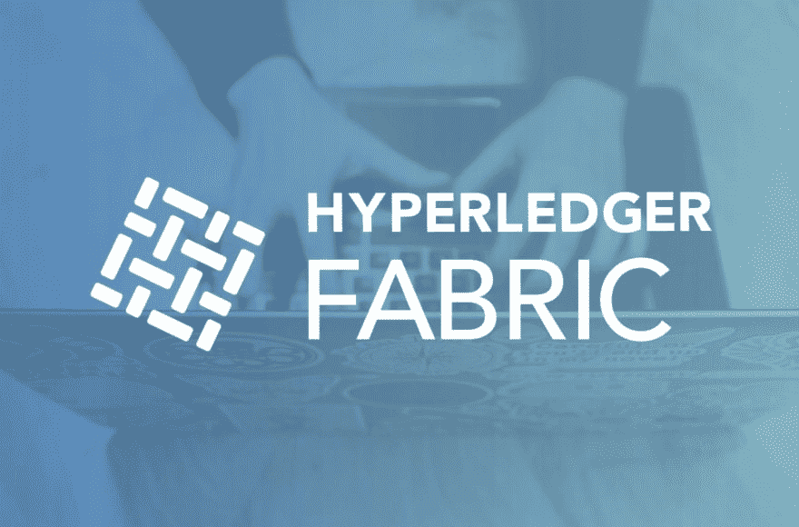
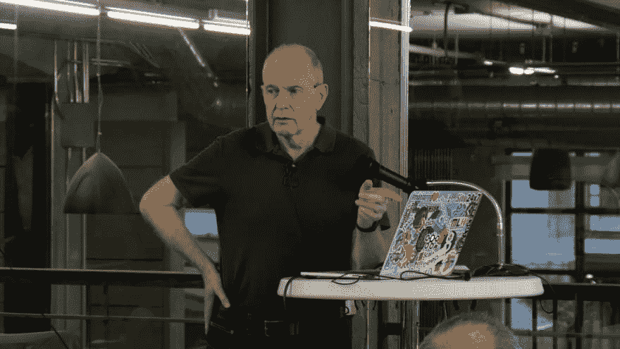
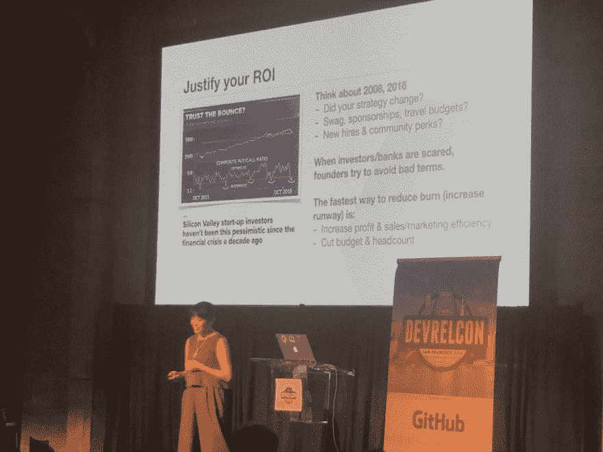

# 为高技术项目进行有效的开发者宣传

> 原文：<https://www.freecodecamp.org/news/effective-developer-advocacy-for-highly-technical-projects/>

我正在采访我的同事 Lennart Frantzell，他是 IBM 开发人员旧金山团队的一名开发人员倡导者。在 IBM 内部，Lennart 专注于我们技术上最深入的社区之一:区块链。

### 问:您的开发人员宣传工作集中在具有大型代码库和技术架构的项目上，这些项目需要开发人员调整他们的心智模型。你能给我们讲讲他们吗？

当我在 80 年代末来到硅谷时，我从事的是可以想象的最令人兴奋的项目之一，专家系统，也就是今天的人工智能系统和 IBM 的沃森项目的前身。我在硅谷的童年时代在门洛帕克度过了四年，创造了具有内置人工智能能力的语言编译器。就像前沿技术经常出现的情况一样，我们没能成功。幸运的是，后来我有机会在位于圣何塞南部的 IBM 硅谷实验室的一个团队中工作，该团队从 IBM Research 获取原型并将其产品化。从那以后，我转向了面向对象系统，并且一直致力于高级软件系统。其中一些成功了，但许多没有成功。就像初创企业一样。

### 问:你是如何开始编程的？

最初我在瑞典主修亚洲研究，并在斯德哥尔摩大学获得博士学位。毕业后，我意识到在我选择的领域没有工作，我开始对计算机感兴趣。我学了一些课程，并在美国东海岸的食品连锁店 Shoprite 的 IT 部门找到了一份工作。两年后，IBM 登广告招聘一种叫做 Series/1 小型计算机的工作人员，我们在 Shoprite 使用了这种计算机。我很幸运地被录取了，并在接下来的四年里编写了西雅图自动化电话交换机的汇编代码，我爱上了这份工作。这也是我的大儿子和他的家人现在在西雅图生活和工作的原因。

IBM Series/1 Minicomputer

### 问:你是如何从程序员转变为开发倡导者的？

我一直热爱编程，但我也喜欢与人一起工作，当我有机会跳到 IBM 的一个创新中心，与商业伙伴一起工作时，我毫不犹豫。

几年后，这让我想到了开发者倡议，这真的很棒，因为你可以见到来自不同地理位置和国家的许多开发者和初创公司，他们对技术有自己的看法。

### 问:你如何发现深度技术项目的倡导不同于一般的开发者倡导？

正如马克·安德森所指出的，IT 技术正在突然吞噬世界。它不再是一种外围技术，而是在改变我们周围的社会。

一个引人注目的例子是人工智能，具有图像识别和面部识别。我们在增强图像识别能力方面取得了惊人的进步，但事实证明，这些进步也有另一面:我们真的想要能够跟踪我们每一步的人工智能系统吗？这是我们作为开发者倡导者可以强调的，让人们和我们自己意识到的。

有代码，但代码也有社会影响，既有好的，也有坏的。

我喜欢组织既关注技术又关注技术的社会层面的活动。我喜欢放眼全局，在 IBM 这样的公司工作令人兴奋，它让我可以自由地与开发人员和初创公司合作，而不是总是遵循特定的公司路线。

### 问:如何让初级程序员对深度或非常技术性的生态系统感兴趣？

先说对社会的影响。当我遇到一些只见树木不见森林的人时，我会感到不安，即他们的代码可能对社会产生的影响。

我还应该提到 [IBM 代码模式](https://developer.ibm.com/patterns)——一种为开发人员提供围绕特定主题的工作代码的创新方法。它们让我们能够快速启动和运行人工智能、区块链或机器学习等领域的开发人员。一些让我们的工作比以前简单得多的东西，让我们和我们交谈的人能够快速看到新技术在现实生活中的表现。

### 问:在你工作过的技术中，你最感兴趣的是什么？

区块链、机器学习和 AI。这些技术是未来所在，并且已经是我们社会的重要组成部分。

例如，自动驾驶汽车是几年前你甚至无法想象的东西，现在我们谈论的不仅是底层技术和算法，还有对社会的影响以及它可以给世界各地的人们带来的自由。

### 问:我们来谈谈物流。什么类型的活动有利于你所倡导的技术？

有 50 到 100 人参加的面对面活动。你必须记住，参加这些活动的人是来交际的。他们想与人见面、交谈、交换意见——他们对听我们谈一个小时或更长时间并不真正感兴趣。反正所有的信息通常都在网上。

当然，他们想学习和编码，但这主要是一个社交活动，他们想和人交往。作为一名开发人员倡导者，能够读懂受众并对他们的需求做出反应是一项重要的技能。

此外，我们还举办了许多黑客马拉松，这本质上是长期的社交活动。我喜欢在黑客马拉松上工作胜过其他任何事情。

### 问:你接触过的开发人员倡导的最佳实践是什么？

我刚刚去了 DevRelCon SF 2019，你可以从演示文稿中看出，开发者倡导者作为一个群体真的很擅长与观众交谈——尤其是当他们谈论自己的时候！

来自 Heavybit 的 Dana Oshiro 在 DevRelCon SF 2019 上做了一个非常棒的演讲。这是非常真实的，不是专门针对开发商关系的，而是关于公司筹资、董事会动态和现金流的不同方面，这些都与宣传有关，但许多宣传者可能不会接触到。

Dana Oshiro speaks at DevRelCon SF 2019

### 问:你想学什么，你想和谁见面或搭档？

我想花时间结合区块链、人工智能、人工智能和物联网，并看看这将导致什么。花更多的时间与正在构建企业应用程序的大型初创公司相处也会很有趣——目前，我花了很多时间与小型初创公司和个人开发人员相处，但与大型公司合作会让你对公司试图用 IBM 云技术构建的东西有更全面的了解，包括区块链和人工智能。我目前不在这个领域工作，但我希望很快进入这个领域。

要想与伦纳特取得联系，请随时联系 LinkedIn:[https://www.linkedin.com/in/lennartfrantzell/](https://www.linkedin.com/in/lennartfrantzell/)