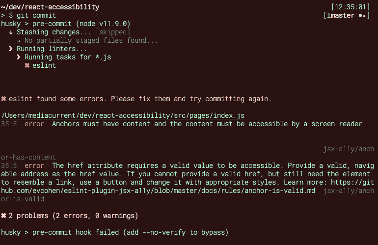
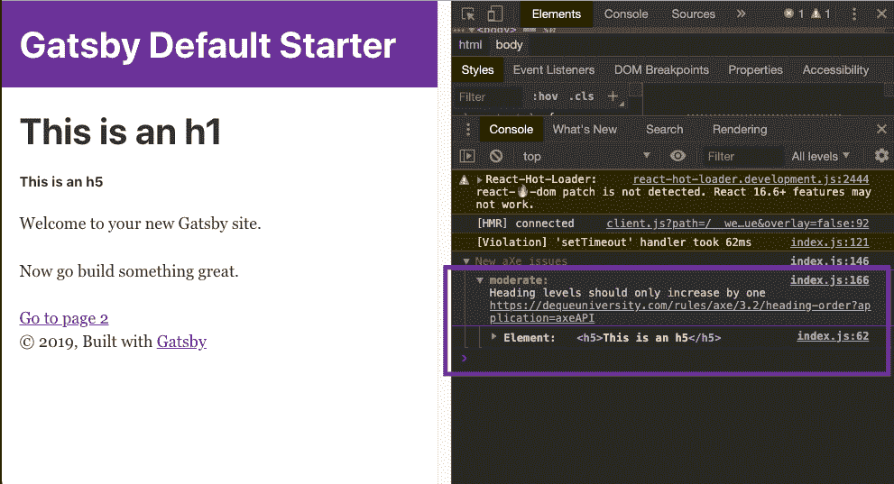
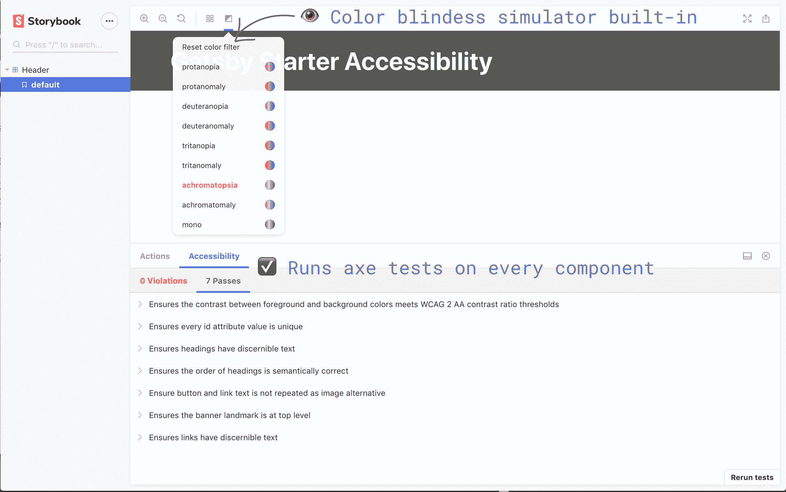

# 难以接近的神话反应

> 原文：<https://www.freecodecamp.org/news/the-myth-of-inaccessible-react/>

在 Twitter 上，在 Slack 上，在 Discord 上，在 IRC 上，或者在你和其他开发者在互联网上闲逛的任何地方，你可能会听到以下陈述的一些表述:

*   React 不支持辅助功能
*   React 使网站无法访问
*   人们应该编写可访问的 HTML，而不是 React
*   react 正在运行互联网

有一种普遍的误解，认为 JavaScript 框架和 web 可访问性不能混合在一起。React 作为最大的 JavaScript 库之一，经常成为攻击目标。

然而，在我的职业生涯中，我有过有趣的经历，几乎同时被介绍到可访问性和反应性。我发现 React 中的工具帮助我学习了很多关于可访问性的知识，否则我永远也不会遇到。

虽然我不反对有大量的图书馆、网站、应用程序等。我不同意 ReactJS 中有一些固有的东西会让开发人员构建不可访问的站点。事实上，我**喜欢**React 生态系统中可用的可访问性工具，所以这篇文章实际上是关于 React 如何帮助你使*比你以前制作的*网站更易访问。

我将概述如何将 React 林挺工具、DOM 审计和 Storybook(一个组件库工具)结合起来，为开发人员提供一个真正支持的可访问性环境——无论他们是可访问性专家还是初学者。在这篇文章结束时，您将为您的 [Gatsby 项目](https://www.mediacurrent.com/videos/webinar-recording-rain-gatsbyjs-fast-tracking-drupal-8/)(或其他 React 项目)配置好以下内容:

*   可访问性错误的编辑器内报告
*   一个预提交挂钩，用于防止可访问性错误进入存储库
*   开发过程中报告辅助功能错误的浏览器控制台，带有指向如何解决错误的信息的链接
*   具有内置可访问性测试的组件库，因此所有项目涉众可以让团队对可访问性问题负责

*想马上开始吗？我创建了一个 Gatsby starter，内置了所有这些辅助工具。检查一下**[Gatsby-starter-accessibility repo](https://github.com/benjamingrobertson/gatsby-starter-accessibility)**的开箱即用功能。*

## 工具和设置

### **[eslint-plugin-jsx-a11y](https://github.com/evcohen/eslint-plugin-jsx-a11y)**

如果你在过去几年中编写过 JavaScript，你可能使用过或者至少听说过 [ESLint](https://eslint.org/) 。如果没有，现在是开始使用它的好时机！

ESLint 是一个用于 JavaScript 的林挺实用程序，可以帮助您在编写代码时捕捉格式和语法错误。大多数编辑器都内置了某种林挺配置，可以让您在编码时看到编辑器中的错误。

这对于保持代码的一致性非常有帮助，尤其是当很多人在一个项目中工作的时候。

ESLint 也有一个非常健康的插件生态系统。您可以包含特定于您正在使用的 JavaScript 框架的规则(例如，React、Angular、Vue 等)，等等。对于 React，我通常使用`eslint-plugin-react` 和真正有用的 [eslint-plugin-jsx-a11y](https://github.com/evcohen/eslint-plugin-jsx-a11y) 。这个插件使用[这些规则](https://github.com/evcohen/eslint-plugin-jsx-a11y#supported-rules)，为你的代码查找已知的可访问性违规。

让这些自动化测试在你写代码的时候运行可以防止*这么多错误*。尽管自动化的可访问性测试只能捕获所有可访问性错误的 20-30%左右，但是在它们进入代码库之前捕获这些错误可以节省时间、预算和精力，以便在代码进入浏览器后进行更多的手动测试。

#### 使用

以下是如何在 React 项目中开始使用林挺辅助功能。

首先，我们需要安装必要的 eslint 包:

`npm install eslint eslint-plugin-react eslint-plugin-jsx-a11y --save-dev`

在 package.json 中，添加以下配置:

```
"eslintConfig": {
    "parserOptions": {
      "sourceType": "module"
    },
    "env": {
      "node": true,
      "browser": true,
      "es6": true
    },
    "plugins": [
      "react",
      "jsx-a11y"
    ],
    "extends": [
      "eslint:recommended",
      "plugin:react/recommended",
      "plugin:jsx-a11y/recommended"
    ]
}
```

将此添加到您的`package.json`中，ESLint 将在您工作时使用 ESLint、React 和 jsx-a11y 插件推荐的规则。

您需要确保您的编辑器设置为在编辑器中显示林挺错误，这样才真正有用。

### 使用 lint:staged 添加一个预提交挂钩，以防止代码库中的代码不可访问

现在我们已经为林挺设置了一些可访问性，希望每个参与该项目的人都能在他们的编辑器中打开林挺，这样他们就可以在工作时看到任何错误。

但是你不能 100%确定每个人都会关注棉绒。即使是这样，也很容易快速更改、切换文件，任何错误都会被遗忘。

为了防止不可访问的代码进入代码库，我们可以做的额外检查是添加一个*预提交挂钩*,每当开发人员试图提交代码时，它都会运行我们在上面设置的林挺。如果发现可访问性错误，将显示一条错误消息，其中包含相关的林挺错误和错误位置，并且在开发人员解决该问题之前，提交将被阻止。



*lint-staged will run a pre-commit hook that will catch any accessibility errors raised by eslint-plugin-jsx-a11y*

#### 使用

设置预提交林挺钩子最简单的方法是使用`[lint-staged](https://www.npmjs.com/package/lint-staged)` [包](https://www.npmjs.com/package/lint-staged)。在您设置好所有的 eslint 配置(从我们的第一步开始)之后，在您的项目目录中运行以下命令:

`npx mrm lint-staged`

这个命令将安装用于管理预提交钩子的`[husky](https://www.npmjs.com/package/husky)` [包](https://www.npmjs.com/package/husky)，并查看您的 package.json 以根据您的林挺配置自动设置预提交钩子。

基于 repo 中现有的 eslint 配置链接所有 JS 文件的简单配置如下所示(从`package.json`):

```
"husky": {
    "hooks": {
      "pre-commit": "lint-staged"
    }
},
"lint-staged": {
    "*.js": [
      "eslint"
    ]
}
```

你可以按照你认为合适的来调整它。例如，有时您希望将林挺限制在某些目录中。要仅在 src 目录中的 JS 文件上运行预提交挂钩，您应该像这样更新 lint-staged 配置:

```
"lint-staged": {
    "src/*.js": [
      "eslint"
    ]
}
```

关于`lint-staged`的伟大之处在于，它只 lints 属于当前提交的文件。如果由于某种原因，在代码库的另一部分中存在一些预先存在的错误，提交不会被阻止——它只是防止引入新的错误。

### 反应斧

我们现在拥有的林挺设置的伟大之处在于，它将防止大量错误被引入代码库。然而，它不能防止所有的错误。有些错误只在几个组件一起使用时存在，或者来自某些内容，只能在浏览器中捕捉到。

幸运的是，我们对此也有解决方案。Axe 是一个用于自动化可访问性测试的开源引擎，由 [Deque](https://www.deque.com/) 支持。我第一次熟悉 axe 是通过使用他们真正有用的浏览器扩展来测试浏览器中的单个页面[。](https://www.mediacurrent.com/blog/5-website-accessibility-checkers/)

浏览器扩展可访问性测试的问题是，它们通常只在开发完成后*运行。使用`react-axe library`，您可以在开发过程中对每个页面进行自动化的可访问性测试，这样开发人员就可以获得关于可访问性问题的实时反馈。这有助于确保可访问性问题永远不会出现在产品中，并且它还可以让那些可能不是可访问性专家的开发人员了解潜在的陷阱。*

react-axe 库是 axe 引擎的一个易于使用的实现，专门用于 react。

#### 使用

下面是如何和盖茨比一起开始使用 react-axe([有人为它做了一个盖茨比插件！](https://github.com/angeloashmore/gatsby-plugin-react-axe)):

`npm install --save gatsby-plugin-react-axe`

将 gatsby-plugin-react-axe 添加到 gatsby-config.js 中的插件数组中

```
module.exports = {
 siteMetadata: {
        title: 'Gatsby Default Starter',
    description:
      'Kick off your next, great Gatsby project with this default starter. This barebones starter ships with the main Gatsby configuration files you might need.',
    author: '@gatsbyjs',
  },
  plugins: [
    'gatsby-plugin-react-axe',
    // other plugins go here
  ],
};
```

现在，当页面呈现时，插件会将任何可访问性错误打印到浏览器控制台。这里有一个例子，我把一个`<h5>`直接放在了一个`<h1>`的下面:



*React aXe will show accessibility errors in the console while you are developing.*

​

在你开发的时候，React aXe 会在控制台中显示可访问性错误。

你可以在控制台的 axe 消息中看到，它已经确定了我的航向问题:“航向问题应该只增加一个”为中度问题。它还包括一个链接，可以了解更多关于*为什么*这是一个问题以及如何解决它:【https://dequeuniversity.com/rules/axe/3.2/heading-order】T2。最后，它显示了导致问题的具体因素，以便于识别。

这种即时反馈是非常重要的，无论你是一个无障碍初学者还是一个经验丰富的专业人士。即时捕捉自动化问题可以让您有更多的时间关注其他更复杂的任务。

### 故事书和可访问性

我们的可访问性工作流的最后一部分与我们的[组件驱动的工作流](https://www.mediacurrent.com/blog/building-components-breaking-it-down/)有关。对于 React 项目，我非常喜欢使用[故事书](https://storybook.js.org/)来构建和记录我们的前端组件。

Storybook 是一个开源工具，用于开发独立于 React、Vue 和 Angular 的 UI 组件。它使构建令人惊叹的 ui 变得有条理和高效。

——[storybook.js.org](https://storybook.js.org/)

除了有一个漂亮的工作流程和用户界面，Storybook 还有一个很棒的 [accessibility add-on](https://github.com/storybooks/storybook/tree/master/addons/a11y) ，它为你的组件库中的每个组件添加了一个面板，突出了可访问性问题。

我们的 storybook 配置对每个组件都有内置的 axe 测试，还有一个色盲模拟器，由 storybook accessibility 附加组件提供。

在幕后，附加组件实际上也使用 aXe 进行测试。这真的很好，因为这意味着我们在开发中使用的测试和我们在组件库中使用的测试是一样的。在组件库中突出显示错误还有助于我们项目团队中的每个人在浏览库时发现可访问性问题，无论是出于 QA 目的还是设计灵感。

#### 设置

Storybook 的设置有点复杂，所以如果你以前没有使用过 Storybook，你可以查看 React 文档中的 [Storybook 以获得一个通用的 React 设置。](https://storybook.js.org/docs/guides/guide-react/)

如果你想让故事书和 Gatsby 一起运行，请参见 Gatsby 文档中的[用故事书进行视觉测试](https://www.gatsbyjs.org/docs/visual-testing-with-storybook/)。

一旦你有了故事书设置，添加可访问性附加组件是非常简单的。

首先，安装附加组件:

`npm install @storybook/addon-a11y --save-dev`

然后将这一行添加到 storybook 配置目录中的 addons.js 文件中:

`import '@storybook/addon-a11y/register';`

最后，将这一行添加到 Storybook config.js 文件中，以自动将辅助功能面板添加到所有组件中:

`addDecorator(withA11y);`

当您现在运行 Storybook 时，您应该会看到辅助功能面板([在此处查看实时版本](https://gatsby-starter-accessibility.netlify.com/storybook/?path=/story/header--default)):



*Our storybook configuration has built-in axe tests for each component and a color blindness simulator, provided by the storybook accessibility add-on.*

顺便说一句，你可以根据你将附加组件导入 addons.js 文件的顺序来控制附加组件面板中标签的顺序，如果你想默认显示辅助功能面板，确保它是 addons.js 的第一行。

## 包裹

如果你没有按照设置进行，或者只是想通过这个工作流快速获得一个新的项目设置，请查看[Gatsby-starter-accessibility Gatsby starter！](https://github.com/benjamingrobertson/gatsby-starter-accessibility)

您可以用我上面描述的所有配置创建一个新的 Gatsby 站点，在您的终端中使用这一行代码:

`npx gatsby new my-accessible-project https://github.com/benjamingrobertson/gatsby-starter-accessibility`

或者您可以在 [repo](https://github.com/benjamingrobertson/gatsby-starter-accessibility) 中查看具体配置。

无论您运行了上述所有步骤还是使用了 [starter](https://github.com/benjamingrobertson/gatsby-starter-accessibility) ，您都将在您的 Gatsby / React 项目中设置以下特性:

*   可访问性错误的编辑器内报告
*   一个预提交挂钩，用于防止可访问性错误进入存储库
*   开发过程中报告辅助功能错误的浏览器控制台，带有指向如何解决错误的信息的链接
*   具有内置可访问性测试的组件库，因此所有项目涉众可以让团队对可访问性问题负责

在有许多团队成员和移动部分的复杂项目中，自动化可访问性测试将有助于节省时间，以确保您可以更多地关注自动化测试无法捕捉的可访问性任务。

除此之外，像这样的工具确实可以帮助开发人员提高他们的可访问性知识。

我知道这对我有帮助——我希望对你的团队也有帮助！

想要更深入地构建无障碍网站吗？加入我的免费邮箱课程:？ *[常见的易访问性错误以及如何避免](https://benrobertson.io/courses/common-accessibility-mistakes/)。30 天，10 节课，100%的乐趣！*？ [*在这里报名*](https://benrobertson.io/courses/common-accessibility-mistakes/) ！