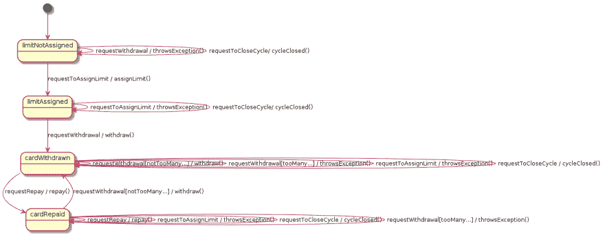
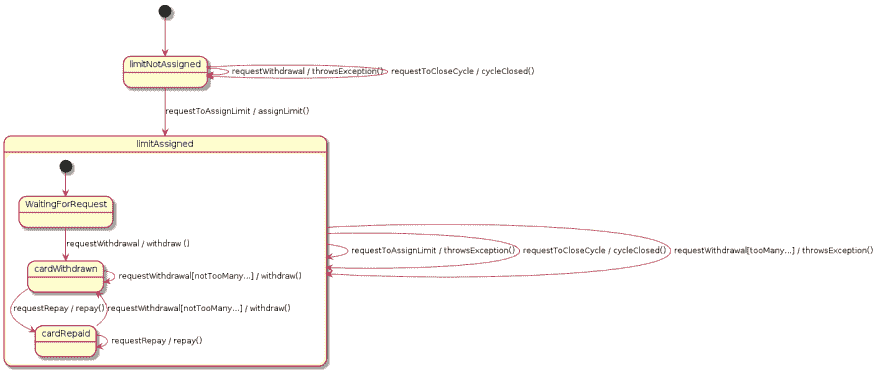

# 吻别国家机器

> 原文：<https://www.freecodecamp.org/news/kissing-the-state-machine-goodbye/>

最近，我写了关于[简化基于事件的应用](https://www.freecodecamp.org/news/simplifying-an-event-sourced-application/)的文章。

这篇文章从雅各布·皮里蒙和肯尼·巴斯塔尼在 T2 的一次谈话开始。最后，为代码中的事件建立一个模型:如何应用它们，以及在什么条件下应用。

示例应用程序是关于信用卡管理的。您可以:

*   **分配信用额度**。但只能一次，否则应用程序抛出一个`IllegalStateException`。
*   **取钱**。但是你不能在某个周期内取款超过 45 次。否则你也会得到一个异常。
*   **还钱**

我和`CreditCard`班一起玩。我感觉`withdraw`方法可能有问题。所以我写了一个测试来检查正确的行为。

```
@Test(expected = IllegalStateException.class)
public void withdrawWithoutLimitAssignedThrowsIllegalStateException() {
    CreditCard card = new CreditCard(UUID.randomUUID());
    card.withdraw(BigDecimal.ZERO);
}
```

该测试试图提取零金额。但是以前没有设定信用额度。应用程序应该拒绝这个请求，并抛出一个`IllegalStateException`。
相反，应用程序抛出了一个`NullPointerException`。

该应用程序假定该限制以前已经分配过。现在:这是一个示例应用程序。如果它涵盖了所有情况，它可能不会像现在这样容易理解。

让我们假设我们正在处理一个真实世界的应用程序。如果命令/事件的所需顺序取决于多种条件和状态，那该怎么办？

如果您曾经试图只用条件语句来实现这一点，您可能知道这很容易丢失概述。但是有一个管理复杂流程和行为变化的标准解决方案。

## 国家机器来拯救

在计算机科学中，状态机已经存在了几十年。它们在理论上很好理解。它们在实践中得到了战斗的证明。它们是处理状态依赖行为的事实标准。

所以我决定为示例应用程序创建一个 UML 状态机模型。我先问自己:我要在状态机中处理命令还是事件？

命令是关于应用程序将来应该做的事情。事件是关于过去发生的事情。

我想*防止*在没有信用额度的情况下取款。
所以状态机模型需要处理命令。

图中转换的语法是`command[condition] / commandHandler()`。它的意思是:当一个命令对象被接收，并且条件被满足时，处理这个命令并进入下一个状态。



模型决定了什么是允许发生的，什么是不允许发生的。比如:提现后才有可能还款。

但是这种精确是有代价的。如果您希望执行状态机模型并控制运行时的行为，您需要对每个状态的每个可能的转换进行建模。包括其状态，如果有两个具有相同事件的转换。

这就是为什么在状态机中比在原始代码中有更多重复的`if`语句。减少重复次数的一种方法是使用*超状态*和*子状态*:



在状态机模型中定义依赖于状态的行为是很容易的。但是像*这样的状态独立规则在任何状态下(当条件 X 成立时)，do Y* 会导致几个跃迁。例如，我需要将`requestToCloseCycle`添加到每个超级状态中。

你需要有合适技能的人来创建模型。与非技术利益相关者就模型进行交流并不容易。这不是他们通常谈论用户旅程的方式。

## 说再见

目前看来有两种选择。

在左边角落的是`if`语句。很容易开始。低开销。最适合没有复杂行为流的应用程序。但是当行为变得复杂时，很容易失去全局。

右上角:可执行状态机模型。强大。经过验证。精确。为您提供行为概述。但是很难定义州独立规则。并且状态机模型很难与非技术利益相关者交流。

我站在第三个角落。我已经找到了状态机的替代品。
一种解决方案

*   使您能够定义条件。但在大多数情况下，您不必这样做。
*   使状态相关和独立规则同样容易指定。
*   使用所有利益相关者都能理解的语言。

在我深入研究细节之前，这里是使用该解决方案重写的示例状态机模型:

```
Model model = Model.builder()
  .useCase(useCreditCard)
    .basicFlow()
    	.step(assigningLimit).user(requestsToAssignLimit).systemPublish(assignedLimit)
    	.step(withdrawingCard).user(requestsWithdrawingCard).systemPublish(withdrawnCard).reactWhile(accountIsOpen)
    	.step(repaying).user(requestsRepay).systemPublish(repay).reactWhile(accountIsOpen)

    .flow("Withdraw again").after(repaying)
    	.step(withdrawingCardAgain).user(requestsWithdrawingCard).systemPublish(withdrawnCard)
    	.step(repeating).continuesAt(withdrawingCard)

    .flow("Cycle is over").anytime()
    	.step(closingCycle).on(requestToCloseCycle).systemPublish(closedCycle)

    .flow("Limit can only be assigned once").condition(limitAlreadyAssigned)
    	.step(assigningLimitTwice).user(requestsToAssignLimit).system(throwsAssignLimitException)

    .flow("Too many withdrawals").condition(tooManyWithdrawalsInCycle) 
    	.step(withdrawingCardTooOften).user(requestsWithdrawingCard).system(throwsTooManyWithdrawalsException)
.build();
return model;
```

可以看到，型号是代码中的[。模型运行者执行这个模型。运行器对命令/事件做出反应，类似于状态机。](https://github.com/bertilmuth/requirementsascode/blob/master/requirementsascodeexamples/creditcard_eventsourcing/src/main/java/creditcard_eventsourcing/model/CreditCardAggregateRoot.java)

基本流程是“快乐日场景”。用户达到其目标的步骤。其他流程涵盖备选和错误场景。

一个流可以为其第一步运行定义一个*显式条件*——例如示例中的`after(...)`、`anytime()`或`condition()`。
如果流程有明确的条件，当条件满足且跑步者当前处于不同的流程中时，流程开始。
如果流没有显式条件(例如样本中的基本流)，则第一步在转轮启动后运行，此时还没有运行任何步骤。

从流程的第二步开始，每一步都有一个*隐含条件*。该条件是:在同一个流中的前一个步骤之后运行该步骤，除非可以启动具有显式条件的不同流。
所以与状态机相反，你不需要在第一步之后指定条件。

在内部，状态依赖行为是通过检查条件来实现的。每个步骤都包含其完整的条件，该条件定义了该步骤可以运行的确切时间。这就是作为代码的[需求](https://github.com/bertilmuth/requirementsascode)如何对待状态依赖和独立行为。

请看[进一步的例子](https://github.com/bertilmuth/requirementsascode/tree/master/requirementsascodeexamples/helloworld)深入挖掘。

## 何时使用需求作为代码

许多应用程序都有动态的内部行为。对于分布式应用程序来说尤其如此。他们需要处理“对方”不可用的事实。

但从用户的角度来看，这些应用程序看起来相当可预测和有规律。当我想在网飞或亚马逊 Prime 上观看一个节目时，我每次都会遵循完全相同的步骤，直到我可以观看为止。看起来一步接一步。

如果作为状态机的替代，这是需求作为代码的最佳点:定义应用程序的*可见行为*。

## 信用卡应用程序现在如何工作

*   一个[客户端](https://github.com/bertilmuth/requirementsascode/blob/master/requirementsascodeexamples/creditcard_eventsourcing/src/main/java/creditcard_eventsourcing/EventsourcingApplication.java)向`CreditCardAggregateRoot`发送一个命令
*   [CreditCardAggregateRoot](https://github.com/bertilmuth/requirementsascode/blob/master/requirementsascodeexamples/creditcard_eventsourcing/src/main/java/creditcard_eventsourcing/model/CreditCardAggregateRoot.java) 使用事件存储库重放信用卡的所有事件，以恢复信用卡
*   `CreditCardAggregateRoot`使用上述模型将命令分派给命令处理方法
*   命令处理方法产生一个事件，并将其应用于`CreditCard`实例。
*   [信用卡](https://github.com/bertilmuth/requirementsascode/blob/master/requirementsascodeexamples/creditcard_eventsourcing/src/main/java/creditcard_eventsourcing/model/CreditCard.java)实例的事件处理模型将事件分派给一个状态改变方法

## 结论

我希望你喜欢我的文章。我还想邀请您看看我在整篇文章中使用的库。在实践中尝试一下，让我知道结果。

如果你想了解我正在做的事情或给我留言，请在 [LinkedIn](https://www.linkedin.com/in/bertilmuth/) 或 [Twitter](https://twitter.com/BertilMuth) 上关注我。要了解敏捷软件开发，请访问我的[在线课程](https://skl.sh/2Cq497P)。
*最后编辑时间:2020 年 4 月 27 日:更新事件采购流程*