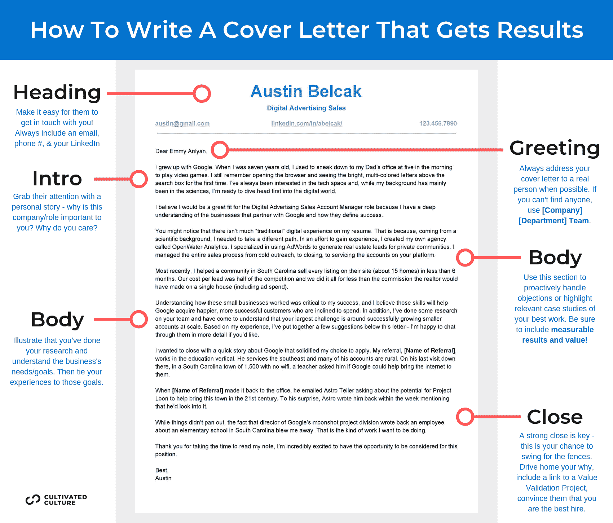
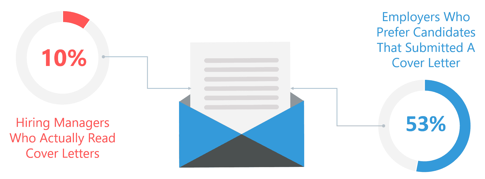
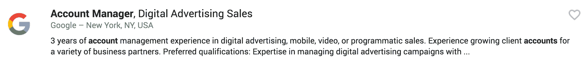
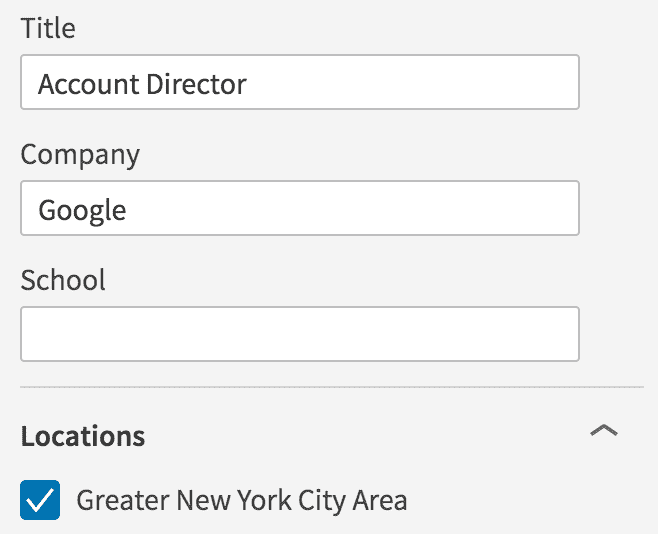
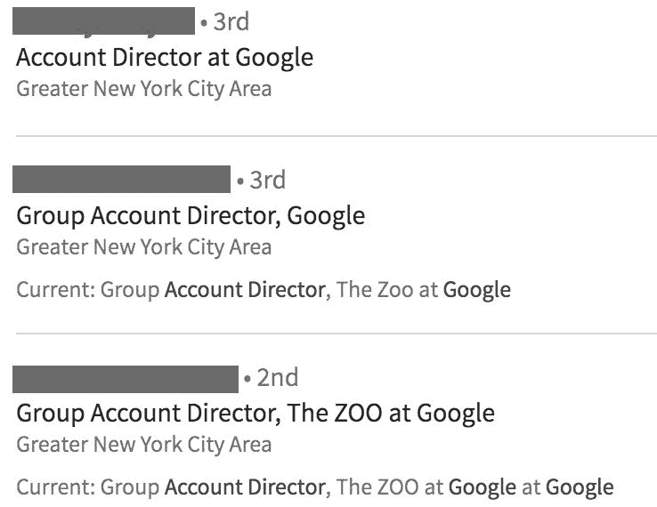
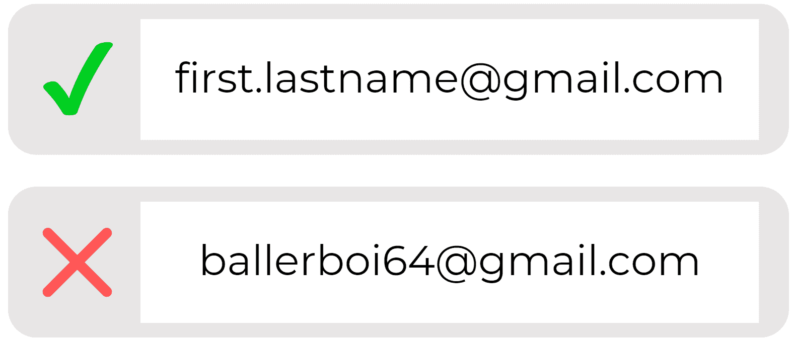

# 如何写一封令人惊叹的求职信，让你被录用(包括模板)

> 原文：<https://www.freecodecamp.org/news/how-to-write-an-amazing-cover-letter-that-will-get-you-hired/>

写求职信可能是求职过程中最容易引发压力的环节之一。

编写它们如此困难的原因是因为我们没有一个明确的框架可以遵循。

如果你需要更新你的简历，你可以下载一个模板并填空。当你申请工作时，雇主会在申请表上列出你需要填写的字段。

但是当你在写求职信时，你可能会发现自己盯着一个空白的 Word 文档，希望正确的单词会出现在页面上。

我们大多数人都不认为自己会成为下一个沃尔特·伊萨克森，而编造完美故事的任务远远超出了我们的舒适区。大多数关于这个问题的建议充其量也只是含糊其辞，这并没有什么帮助。

我在谷歌上快速搜索了一下“如何写求职信”这里有一些“专家”推荐的东西:

*   **评估雇主的需求和你的技能。然后试着在信中以一种符合雇主自身利益的方式来匹配它们。**
*   **按逻辑顺序排列各点；围绕一个要点组织每一段。**
*   **基本字体像 Arial、Calibri、**、Verdana、* Open Sans *都很好用。10 或 12 点的字体便于阅读。页面顶部、底部、左侧和右侧的标准页边距为 1 英寸。**
*   **一定要包括积极的品质，比如“专注”、“努力工作”和“以结果为导向”**

虽然所有这些建议从技术上来说都是正确的，但是当你回去打出第一句话的时候，你有没有感觉到你的信心暴涨？

是啊，我也是…

## **写一封能让你被录用的求职信**

**事情是这样的——大多数职业“专家”给出模糊的建议，说他们在自己的市场领域看到了工作。它不会变得太具体，因为许多职业教练(甚至招聘人员)从未经历过世界级公司的申请过程。他们不知道事实真相。**

**当他们给出具体的建议时，通常是针对某个特定领域的——软件开发、技术销售、金融等。但是，在一个行业或角色中对一个人有效的方法，在不同的情况下可能对类似的人无效。**

**我希望通过这篇文章改变现状。**

**在这篇文章中，我将展示我的成千上万的客户用来获得跨行业工作的求职信策略，比如苹果、亚马逊、谷歌、脸书、微软、德勤、ESPN、美国运通等等。**

**如果你没有从简历或求职信中得到你想要的结果，[看看我的免费简历生成器](https://cultivatedculture.com/resume-templates/)。它能让你在几分钟内创建一份招聘人员认可的、ATS 友好的简历，而且是 100%免费的(没有费用、订阅或限制！).**

### ******求职信的真相******

**在我们深入到可操作的东西之前，我想提供一些关于求职信在招聘过程中的位置的背景。**

**求职信是一种奇怪的动物。人们似乎认为，他们是会让潜在雇主的回复率突然飙升的缺失环节。**

**当我让我的观众在求职信指南、简历或 LinkedIn 个人资料中进行选择时，求职信以显著优势胜出。**

**事实是，在招聘人员/招聘经理的心目中，你的求职信是一个打破僵局的因素，只有在你的申请的其余部分被审查后才会被阅读。90%的招聘经理甚至不看求职信。然而，超过一半的雇主指出，他们更喜欢提交求职信的候选人:**

****

**这让我们处在一个有趣的地方。**

**我们需要写一封好的求职信来增加我们的机会，但我们不想花几个小时去写，因为在找工作的过程中，有更好的方法来花时间获得结果。如果你遵循我的其他文章中的[网络和增值策略，这些策略将比一份 3-5 段的文件更能有效地打破束缚。](https://cultivatedculture.com/how-to-get-a-job-anywhere-no-connections/)**

**我希望这份指南能给你一个框架，让你有效地撰写更有可能让你被录用的求职信。**

### ******让人们丢掉工作的 7 个求职信错误******

**如果我们希望我们的求职信尽可能有效，我们需要确保避免雇主讨厌看到的错误，然而大多数人仍然会犯这些错误。**

**为了尽可能准确，除了我自己的研究之外，我去和来自谷歌、微软和一些华尔街公司的招聘人员交谈。然后，我将这些信息与我在 Cultivated Culture 的办公桌上收到的几百封求职信进行了交叉参考。**

**说了这么多，做了这么多，以下是人们在求职信中最常犯的 7 个错误，这些错误会导致招聘人员拒绝他们的申请:**

#### ******1。错别字、语法错误和一般的马虎******

**这是最明显和最常见的问题。超过 70%的招聘人员表示，他们会自动扔掉有拼写或语法错误的求职信。好消息是，这也是最容易纠正的错误。**

**在你提交求职信之前，确保至少有另外两方审阅过。你可能要考虑雇佣一个专业的编辑/校对，因为他们对于一个短文档来说并不太贵，而且他们会发现大多数人会忽略的东西。在 [Upwork](http://www.upwork.com/) 上很容易找到一个。**

**你可以使用的另一个技巧是在 75%的过程中包含一个明显的错误。如果你有“在音乐会上抓住贾斯汀·比伯汗湿的 t 恤”坐在那里，有人没有叫你出来，你知道他们可能没有仔细阅读。**

#### ******2。**翻过一页****

**我收到的 99%的简历和求职信都在一页之内。有趣的是，99%的招聘人员告诉我，他们绝对讨厌超过一页的简历和求职信*。***

***理想的求职信长度是 3-5 段。改变页边空白、字体和字体大小都是公平的——只要保持在一页上，好吗？***

#### *******3。以稍微不同的格式复述你的简历*******

***你的求职信是一个让你真正脱颖而出的空间。如果你只是把简历上的要点变成完整的句子，你会错过一个巨大的机会。***

***用求职信展示一点个性，分享一些人们浏览你的简历时不会知道的东西。***

***记住，这是决胜局。如果你的求职信不能吸引人们的注意力，那么它很可能会失败。***

#### *******4。注重训练或武断的凭证而不是结果*******

***我们很多人都觉得自己不能胜任想要的工作。因此，我们试图扭曲我们的经验，以符合我们的目标角色的传统资格。***

***这种方法的问题在于，无论你申请的是什么职位，你都是在和那些有资格获得传统证书的人竞争。如果你试图在他们的游戏中打败他们，你十有八九会输。***

***我是不是在说，你应该忘记编造你的经历来给自己定位？绝对不行。然而，当你大学毕业 4-5 年后，在简历中加入商业课程不会有太大帮助。***

***相反，把你工作之外的时间集中在建立可以在你的求职信(和简历)中展示的切实成果上。如果你想成为一名开发人员，那就去上几门编码课程，然后做一些很酷的东西。如果你想从事数字营销，就找几个客户，帮他们做广告。***

***在大多数情况下，讲述一个你如何采取积极措施积累某个领域的经验的故事会胜过传统的证书。公司喜欢看到你渴望学习。***

#### *******5。不要把你的求职信写给一个真实的人*******

***当我看到标题为“亲爱的招聘经理”或“致相关人员”的求职信时，我的内心有点发凉。***

***任何读到这一点的人都会立即在精神上将其视为非个人化。把你的求职信写给一个真实的人要好得多，即使它最终没有到他们手里。这是我的策略。***

***假设我正在申请谷歌的一个客户经理职位:***

******

***我要去 LinkedIn，开始寻找具体的人来管理我申请的职位。如果我找不到他们，或者我不确定，那么我会瞄准我的目标角色所属的最高级的人。***

***客户经理的阶梯通常是高级客户经理、客户总监和副总裁。我将在 LinkedIn 的职位过滤器下插入“客户总监”,以涵盖那里的所有职位。然后，我将在公司过滤器中添加“Google ”,在位置过滤器中添加“Greater New York Area ”:***

******

***这一搜索将会找到很多我可以在求职信中直接提及的人:***

******

***不管谁看了你的求职信，他们都会知道你做了调查。最重要的是，你的求职信甚至可能会送到收件人手中。***

#### *******6。未能展示任何个性*******

***如前所述，你的求职信是为数不多的让你真正从竞争中脱颖而出的机会之一。如果你在网上申请工作(我不推荐)，你唯一需要推销的就是你的简历、求职信和申请表。***

***不要在简历中重复这段经历，而是讲述一个你是如何获得这段经历的故事。让它独特而有个性。当我谈到我是如何从一份医学工作过渡到科技行业，开始一项为房地产经纪人创造商机的副业时，我取得了最大的成功。我会开诚布公地谈论我所面临的挑战，我所犯的错误，以及我当初为什么要经历这一切。***

***利用这个空间来讲述你的故事。记住，人们不会买你做的东西——他们会买你为什么做这件事。***

#### *******7。写一个不舒服的情况*******

***当我们谈到讲故事的话题时，有一件事是你想要避免的——谈论一些非常不舒服的事情。对你的大学论文有用的东西在这里不会有用。***

***你想保持专业。谈论与业务相关的错误和挑战是可以的，但要尽量避开深刻的个人故事。他们更有可能伤害而不是帮助。***

***如果你的求职信没有违反以上任何规则，你就有了一个好的开始！***

### *******解剖一封雷厉风行的求职信*******

***当我在找工作时，最令人沮丧的事情之一是试图弄清楚我的简历/求职信/申请中应该包括什么。网上有太多相互矛盾的“专家”建议，让你觉得自己在瞎猜。***

***当我开始培养文化时，我开始追踪不同的因素如何影响我的学生的成功。在过去几年与数百名求职者共事后，我发现以下因素与高面试成功率之间有很强的相关性:***

#### *******1。利用你求职信的标题*******

***大多数人没有意识到，当他们点击应用程序上的“提交”时，他们的求职信会被一个搜索特定单词和短语的机器人扫描。***

***其中一个主要的关键词是匹配或相关的职位。如果你申请的是项目经理的职位，你会在求职信中包括项目经理、项目管理、PMP 或者类似的内容吗？这就是机器人正在寻找的，头部是一个很好的注射位置。我建议把它放在你名字的正下方。***

***一旦你通过了机器人，你的求职信将会到达真人手中。***

***我们希望让这个人尽可能容易地了解我们的更多信息，并在他们需要时与我们联系。我总是建议你在求职信的顶部写上以下内容:***

*******电子邮件地址****——确保简单专业。76%的申请因电子邮件地址不专业而被拒。还有，别忘了超链接！你希望雇主能够点击并取得联系。***

******

*******LinkedIn 个人资料****–[最近的一项研究](https://www.resumego.net/research/linkedin-interview-chances/)显示，包含 LinkedIn 综合个人资料链接的应用程序获得回复的几率增加了 71%！***

*******电话号码****——如果他们喜欢他们阅读的内容，让他们很容易拿起电话拨号。***

*******相关链接****–你的标题也是分享链接的好地方，比如 Github、相关社交资料、个人网站、你的博客等。***

***最后，很多人问我关于包括位置的问题。我不建议在写求职信的时候加上你的位置，除非申请需要。***

***你的地址和位置是私人的、个人的信息，把它们放在你上传到网上的简历或求职信中是一个很大的风险。你将自己置于公司数据实践的摆布之下，如果他们不遵循[良好的数据安全实践](https://learn.g2.com/nonprofit-data-security)，你可能会以在佛罗里达州追捕数据窃贼而告终。***

#### *******2。在你的开篇**中讲一个故事*****

***这是你希望在求职信的每一部分都包含的主题。***

***科学已经证明，当信息以故事的形式传递时，人们更容易记住信息(或者是候选人)。故事也有助于与读者(或招聘人员/招聘经理)建立积极的心理联系。***

***还记得丹·布朗的书 **达芬奇密码** 吗？***

******

***这是一本关于达芬奇一些最著名的画作中的神秘线索通向圣杯的小说。虽然这本书本身是虚构的，但艺术家、作品以及它们背后的大部分历史都是准确的。***

***现在，如果你问大多数人对艺术史的看法，他们会告诉你这很无聊。如果你试图让他们读一本关于这个主题的书，他们也会失望地呻吟。然而，丹·布朗的小说一飞冲天，登上了《纽约时报》畅销书排行榜的榜首，并引起了国际轰动。事实上，在它出版后的几年里，艺术史学位的申请量上升了 25%。***

***为什么所有这些人突然对以前被认为“无聊”的领域感兴趣了因为丹·布朗在一个有趣的故事背景下灌输了历史事实！***

***我们的目标是在求职信中做同样的事情——下面是具体的例子。***

#### *******2。谈谈你为什么对**T3 公司感兴趣*****

***在求职信的第一部分，你要简单地谈谈你为什么对这个职位和公司感兴趣。请记住，我们希望通过一个故事来传达信息。***

***当我申请谷歌时，我想在那里工作，因为他们是一个家喻户晓的名字，专注于尖端技术，但他们也关心影响生活。下面是我用来说明这一点的故事:***

> *****我想通过我的推荐人[Name]讲述一个故事。他从事教育行业，在农村学校呆了很长时间。当他在南卡罗来纳州时，一位老师问他为这个镇和它的学生安装无线网络的可能性。[Name]说他会尽力而为，回来后他四处打听。他给 Astro Teller 发了一封电子邮件，后者回复了他，他们讨论了在该地区实施 Loon 项目的可行性。我不认为它成功了，但事实上，通信发生在南卡罗来纳州的一个小镇说服了我。这就是我想做的事情。*****

***如果你没有一个立即跃入脑海的故事，最好的方法是和在公司工作的人交谈。事先了解公司的使命或核心价值观，让那个人告诉你他们亲身经历过的最好的例子。***

***如果你想知道如何找到某人的公司电子邮件地址，你可以查看这篇文章。***

#### *******3。突出你给**这个角色带来的东西*****

***求职信的第二部分应该通过谈论你过去的成就来展示你将为这个角色带来什么。确保使用可测量的指标(实际数字和定量结果)来支持您的观点。***

***如果你来自一个非传统的背景(并且不觉得你是“合格的”)，这是解决这个异议的时候了。这是我的谷歌求职信的另一段摘录，用可衡量的结果描述了我的背景:***

> ***你可能会注意到，我的简历上没有多少“传统”的数码经验。这是因为，作为一名科学家，我需要走一条不同的道路。为了积累经验，我创建了自己的机构，名为 OpenWater Analytics。我专门使用 AdWords 为私人社区创造房地产线索。我管理了整个销售流程，从冷接触到成交，再到为您平台上的客户提供服务。***

> ***最近，我帮助南卡罗来纳州的一个社区在不到 6 个月的时间里卖出了他们网站上的所有房源(大约 15 套房子)。我们每条线索的成本是竞争对手的一半，而且我们的佣金比房地产经纪人在一套房子上的佣金还低(包括广告支出)。***

***当我写这篇文章时，我没有太多的数码经验。我没有试图编造我所拥有的，而是走出去，通过创办一家数字营销公司，自己创造了这种体验。同样，如果你觉得自己缺乏经验，那就走出去创造自己的经验吧！***

#### *******4。参考你的“价值验证”项目*******

***如果你读过我写的关于如何在没有关系的地方找到工作的文章，你会知道我一直提倡创建一个我称之为“T2”的“价值验证项目”***

***这包括与你想为之工作的公司的人进行交谈，并确定他们最大的挑战或即将到来的计划。然后，你可以利用这些信息自己进行研究，并为你的联系人提出一些解决方案/建议。***

***在求职信的最后一部分，你要提到这个项目，并呼吁大家讨论这个项目。它可能看起来像这样:***

> ***为了更多地了解[公司]，我与[姓名]见了一次面。她告诉我，她的团队面临的最大挑战是向客户推销公司新的补充平台。她指出，尽管该平台增加了客户保留率并降低了客户成本，但前期成本是一个主要障碍。***

> ***在我之前的工作中，我们处理过类似的情况。我们的客户接受采用新平台，尽管数据显示这对各方都有利。我领导了一项计划，我们测试并分析了几种收入模式，最大限度地提高了采用率和利润率。最终，我们在不影响收入的情况下将采用率提高了 30%。***

> *****利用[Name]给我的信息，我详细描述了与您的平台相关的流程。我相信你的团队可以立即实施这些策略，并看到类似的结果。如果你想要我寄给你，请告诉我！我的电子邮件是 name@email.com。*****

***这一部分非常有力，因为它表明你不仅感兴趣，而且已经证明了你能给团队带来的价值。此外，行动号召可以引导你与决定雇佣你的人进行对话！***

## ***求职信模板——抄袭我在谷歌、微软和推特上用过的求职信***

***在这一点上，你应该对写一封杀手级求职信背后的科学有一个坚实的理解。你还应该很好地处理要避免的错误，这样你的求职信会给人留下令人敬畏的第一印象。***

***现在我们需要将所有这些应用到纸上的墨水中！为了让你更容易理解，我附上了一份我在谷歌面试时用的求职信模板，这样你就能清楚地看到我是怎么写的了。***

#### *******上下文为模板*******

***在我们深入了解具体的求职信模板之前，我想给你一些背景信息，以便你能更好地理解这封信的内容。***

***我在申请谷歌纽约办公室的数字广告销售客户经理。我首先在 LinkedIn 上做了一些研究，寻找我认为是招聘经理的人(她的名字是艾美奖)。***

***我知道我的非传统背景对大多数雇主来说是一个很大的危险信号，所以我的目标是在求职信中主动提出这个问题，通过说出它，讲述我为建立正确的技能做了什么，并强调我从这些努力中取得的成果。***

***最后，我和几位谷歌员工交谈过，他们都告诉我“谷歌度”(文化契合度)是公司招聘决策的一个重要因素。如果我想有一个机会，我需要一个令人信服的叙述，围绕为什么我想为他们工作，为什么我是一个很好的选择。***

***考虑到这些，下面是我写的求职信:***

### ***奥斯汀的求职信模板***

> ***亲爱的艾玛安利，***

> ***我伴随着谷歌长大。当我七岁的时候，我经常在早上五点溜到我爸爸的办公室玩电子游戏。我还记得打开浏览器，第一次看到搜索框上方鲜艳的多色字母。我一直对科技领域感兴趣，虽然我的背景主要是科学，但我已经准备好一头扎进数字世界。***

> ***我相信我非常适合数字广告销售客户经理的角色，因为我对与谷歌合作的企业以及他们如何定义成功有着深刻的理解。***

> ***你可能会注意到，我的简历上没有多少“传统”的数字经验。这是因为，作为一名科学家，我需要走一条不同的道路。为了积累经验，我创建了自己的机构，名为 OpenWater Analytics。我专门使用 AdWords 为私人社区创造房地产线索。我管理了整个销售流程，从冷接触到成交，再到为您平台上的客户提供服务。***

> ***最近，我帮助南卡罗来纳州的一个社区在不到 6 个月的时间里卖出了他们网站上的所有房源(大约 15 套房子)。我们每条线索的成本是竞争对手的一半，而且我们的佣金比房地产经纪人在一套房子上的佣金还低(包括广告支出)。***

> ***了解这些小企业是如何运作的对我的成功至关重要，我相信这些技能将帮助谷歌获得更快乐、更成功的消费者。此外，我对您的团队做了一些研究，了解到您最大的挑战是如何成功地扩大小客户规模。根据我的经验，我在这封信下面提出了一些建议——如果你愿意，我很乐意详细讨论这些建议。***

> ***我想以一个关于谷歌的小故事作为结束，这个故事坚定了我申请的选择。我的推荐人， ****【推荐人姓名】**** ，在教育垂直工作。他服务于东南部，他的许多账户都是农村的。在他最后一次去那里的时候，在南卡罗来纳州一个 1500 人没有无线网络的小镇，一位老师问他谷歌是否可以帮助他们接入互联网。***

> ***当 ****【推荐人姓名】**** 回到办公室后，他给 Astro Teller 发了一封电子邮件，询问 Project Loon 在 21 世纪帮助这座城市的潜力。令他惊讶的是，阿童木在一周内给他回信，提到他会调查此事。***

> ***虽然事情并不顺利，但谷歌 moonshot 项目部门的负责人给一名员工写了一封回信，内容是关于南卡罗来纳州的一所小学，这让我大吃一惊。这就是我想做的工作。***

> ***感谢您花时间阅读我的笔记，我非常兴奋有机会被考虑这个职位。***

> ***最佳，
> 奥斯汀***

#### ***下载奥斯汀求职信模板的免费副本***

***如果你想要一份包含标题和所有格式的求职信模板，这里有一个在我的 Google Drive 上的链接。***

***点击链接后，只需点击文件>制作副本>整理，将其添加到您自己的 Google Drive！你也可以下载各种格式的文件。***

***如果你对写一封精彩的求职信还有疑问或想法，请在下面留言——我很乐意回答你！***

#### ***不通过网上申请，就想知道如何获得一份理想工作的内幕信息，而不管你的背景如何？***

***点击此处获取我的学生在谷歌、微软、亚马逊等公司求职时使用的 5 个免费策略，无需在线申请。***