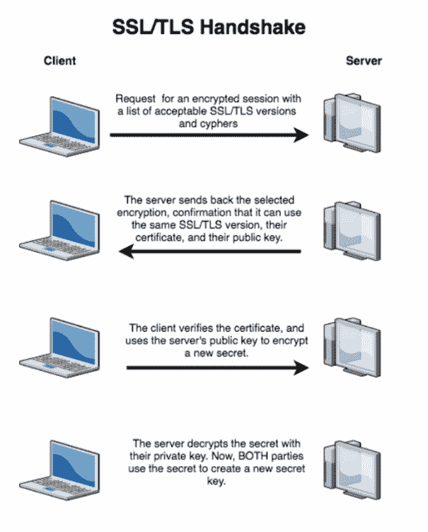
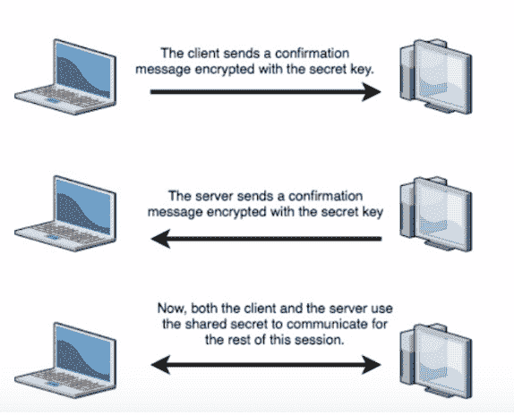

# HTTPS 搞什么鬼？

> 原文：<https://www.freecodecamp.org/news/wtf-is-https/>

安全有很多缩写。它们是什么意思？让我们把它们分成易于管理的部分。

首先，HTTPS 实际上是运行在 TLS 或 SSL 之上的 HTTP。首先，我们将介绍 HTTP，然后是 TLS 和 SSL。

### 什么是 HTTP？

HTTP 是网络浏览器用来连接网页、图像等的。它是一种无连接的基于文本的协议。无连接部分意味着每次 web 浏览器需要加载新元素时，都需要建立一个新的连接(而不是像大多数协议那样一直保持连接打开)。)协议只是一组管理设备如何通过互联网连接的计算机规则。

当您在浏览器中键入 URL 时，计算机将检索 IP 地址(这是 DNS)。然后，浏览器连接到服务器并向网页发送 HTTP 请求。web 服务器检查页面并加载它。然后，浏览器接收页面并关闭连接。然后，浏览器在页面中查找需要加载的其他部分(如图像、小程序等)。).对于需要加载的每个新部件，浏览器将建立并关闭另一个连接。最后，页面被完全加载。

HTTP 的问题在于它通过明文传输信息——这意味着任何有技术能力观察流量的人都可以看到传输的一切(包括用户名和密码)。HTTPS 提供加密和认证。

加密旨在对除消息预期接收者之外的任何人隐藏消息的内容。这个想法是转换数据，以便只有某个人或一群人可以将数据转换回可识别的消息。

身份验证验证身份。它用于验证应该发送消息的服务器实际上是发送消息的服务器。

### 什么是 SSL/TLS？

首先，基本上 SSL 和 TLS 做同样的事情。但是 TLS 是同一协议的新版本，具有更强的加密和认证协议。

基本上，TLS 使用**非对称加密**在两台使用**私有/公共密钥**的服务器之间建立链接。不对称加密就像一把锁和一把钥匙，其中一个人拥有加密数据的“锁”,另一个人拥有解密数据的“钥匙”。公钥和私钥就像一把锁和一组密钥，一个用来锁住(加密)数据，一个用来解锁(解密)数据。

启动会话后，服务器可以安全地计算共享秘密，并开始使用对称加密进行通信(因为对称加密速度更快，可以传输更大的数据包)。对称加密没有锁/密钥对。相反，这就像在一个安全的地方与某人交谈(共享秘密)。如果位置是安全的(即只有你们两个知道自己在哪里/知道共享的秘密)，你就不必担心用锁和钥匙来保护特定的信息。

### SSL/TLS 是如何工作的？

SSL/TLS 通过一种称为 SSL/TLS 握手的协议工作。它是这样工作的:

握手使用非对称加密来建立过程并就共享秘密达成一致。然后握手切换到更快的对称加密。“可接受的密码”部分只是帮助服务器同意使用一个通用协议。

[https://giphy.com/embed/cI45LEPRoFQhLVq7AB](https://giphy.com/embed/cI45LEPRoFQhLVq7AB)

[通过 GIPHY](https://giphy.com/gifs/skittles-yes-winning-heck-cI45LEPRoFQhLVq7AB)

HTTPS 很重要，因为它保护网站流量的完整性。这使得网站能够保护其用户免受有意安装恶意软件或窃取用户数据的恶意攻击者的攻击，以及可能对注入广告或提取数据感兴趣的第三方(如 ISP)的攻击。

HTTPS 确保了用户的隐私，它正变得无处不在，这在很大程度上归功于谷歌对 HTTPS 的推动。这就是为什么在 HTTPS 网站上，当你使用 Chrome 浏览器时，你会看到一个“锁”符号(见下文)。

没有 HTTPS 的网站会弹出一个亮红色的“不安全”警告。此外，许多新功能在没有 HTTPS 的情况下无法实现(尤其是渐进式网络应用)。鉴于 HTTPS 对网络安全的重要性，对于任何从事安全工作的人来说，理解它为什么以及如何工作是很重要的。为了保护系统，您需要了解它们。