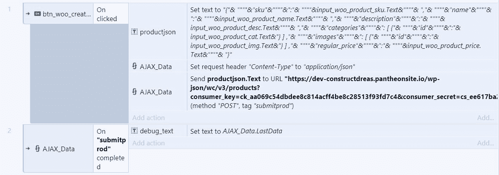

# REST API cURL 通过 Construct 3 GameDev 工具和 AJAX 模块发送请求

> 原文：<https://www.freecodecamp.org/news/rest-api-curl-post-request-via-construct-3-gamedev-tool-ajax-module/>

你好 FreeCodeCamp 读者社区！本教程是一个小小的思想实验，但可能对这个或那个人有一些价值。

> 请记住，这个插件是通过在现有的 WordPress + WooCommerce 安装中添加一个通过 Construct 3 Forms + REST API cURL 请求的产品来做例子的。

这些原则对于 REST API 的其他用途仍然有效，我在本教程的底部包含了. c3p。有更好的方式将信息数组提供给应用程序，但这是一个快速演示，作为概念验证，我在 2 小时内完成了这个演示，由于缺乏 Construct 3 的 API 和 AJAX 信息，我想分享一下。

**下面是一张截图中的全部代码:**

Construct 3 Source Code Screenshot

# 一旦我们点击“创建产品”按钮，代码就会分解

*   productjson 是布局上视口之外的强制文本字段。
*   productjson 包含我们的全部有效负载数据，这些数据被预格式化为 json，以允许 REST API 正常工作。
*   有效负载包含动态创建的内容，这些内容是布局中的形式，如产品名称、sku、价格等。
*   我重命名为 AJAX_Data 的 AJAX 模块会将 Request_Header 设置为值为“application/json”的“Content-Type”，因为通过 cURL request 的 REST API 会利用 json。
*   下一个带有‘Post to URL’请求的 AJAX_Data 将是我们实际的 API 请求。
*   标签仅仅是一个名字，可以用来返回请求的值，在我的项目的例子中，作为调试信息。
*   URL 将以您的域名开始，即'[https://www.example.com](https://www.example.com)' URL 的下一部分是您想要发出的 API 请求，在我们的示例中，根据 WooCommerce 文档，添加我们需要的产品'/wp-json/wc/v3/products？'
*   最后但同样重要的是，对于 URL，我们需要消费者密钥和秘密，如下所示:“消费者密钥=<consumer_key>&消费者秘密= <consumer_secret>”</consumer_secret></consumer_key>
*   完整的网址是这样的:"[https://www.example.com/wp-json/wc/v3/products?消费者 _ 密钥=](https://www.example.com/wp-json/wc/v3/products?consumer_key=) <消费者 _ 密钥> &消费者 _ 秘密= <消费者 _ 秘密>
*   接下来是数据。这很简单，因为我们已经为此制作了一个文本框。这里简单的引用一下，在我的例子中数据会是' productjson。'文本'。
*   最后，什么类型的请求。由于我们正在创建一个产品，我们将需要“POST”，如果我们要检索一个产品，我们将需要一个“GET”请求，请参阅您正在使用的 API 的相应文档。

### . c3p 文件下载:

[https://drive.google.com/open?id = 16 dkq 5 rjd 5 tcw 57 ozprugk _ mtTIAe-Um9](https://drive.google.com/open?id=16DKq5RJD5tCw57oZPruGk_mtTIAe-Um9%5B/url%5D)

# 我的. c3p 示例的要求

*   安装了 WooCommerce 的 WordPress 安装
*   REST API 启用并发布了一个消费者秘密&密钥
*   在代码中替换我的 API 秘密和密钥示例
*   在 WordPress 的媒体库中上传了一张图片
*   在 WordPress/WooCommerce 中创建了一个产品类别

如果你需要一个免费的 WordPress 环境来玩，我用了 [https://pantheon.io](https://pantheon.io) ，在免费计划下你可以得到 2 个沙盒网站。只要确保首先安装 WP-CORS 插件，并设置允许的网站为' * '，如他们的文档所示:https://pantheon.io/docs/platform-considerations/#cors
T3

[https://wordpress.org/plugins/wp-cors/](https://wordpress.org/plugins/wp-cors/%5B/url%5D)

### API 来源信息和相关 C3 文件:

[WooCommerce REST API 文档](https://woocommerce.github.io/woocommerce-rest-api-docs)
[构造 3 个 AJAX 文档](https://www.construct.net/en/make-games/manuals/construct-3/plugin-reference/ajax)
[JSON 验证器工具验证你的 JSON 格式是否正确。](https://jsonlint.com/)
[我在 Construct.net 上写的原创教程](https://www.construct.net/en/tutorials/rest-api-curl-post-request-2245)